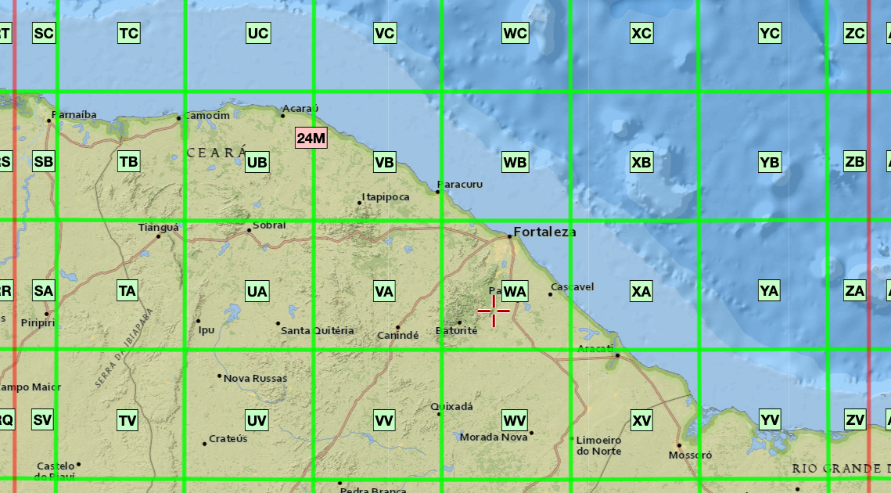

# Earth observation data cubes{-}

```{r, include = FALSE}
source("common.R")
dir.create("./tempdir/chp4")
library(sits)
```

<a href="https://www.kaggle.com/code/esensing/creating-data-cubes-in-sits" target="_blank"></a>

## Analysis-ready data image collections{-}

Analysis-ready data (ARD) are images that are ready for analysis without the need for further preprocessing or transformation. They simplify and accelerate the analysis of Earth observation data by providing consistent and high-quality data that are standardized across different sensors and platforms. ARD data is typically provided as a collection of  files, where each pixel contains a single value for each spectral band for a given date.

ARD collections are available in cloud services such as Amazon Web Service, Brazil Data Cube, Digital Earth Africa, Swiss Data Cube, and Microsoft's Planetary Computer. These collections have been processed to improve multidate comparability.  Radiance measures at the top of the atmosphere were converted to ground reflectance measures.  In general, the timelines of the images of an ARD collection are different. Images still contain cloudy or missing pixels; bands for the images in the collection may have different resolutions. Figure \@ref(fig:ardt) shows an example of the Landsat ARD image collection. 

```{r ardt, echo = FALSE, out.width="80%", fig.align="center", fig.cap="ARD image collection (Source: USGS. Reproduction based on fair use doctrine)."}
knitr::include_graphics("images/usgs_ard_tile.png")
```

ARD image collections are organized in spatial partitions. Sentinel-2/2A images follow the Military Grid Reference System (MGRS) tiling system, which divides the world into 60 UTM zones of 8 degrees of longitude. Each zone has blocks of 6 degrees of latitude. Blocks are split into tiles of 110 $\times$ 110 km$^2$ with a 10 km overlap. Figure \@ref(fig:mgrs) shows the MGRS tiling system for a part of the Northeastern coast of Brazil, contained in UTM zone 24, block M. 

```{r mgrs, echo = FALSE, out.width="80%", fig.align="center", fig.cap="MGRS tiling system used by Sentinel-2 images (Source: GISSurfer 2.0. Reproduction based on fair use doctrine)."}

```

The Landsat-4/5/7/8/9 satellites use the Worldwide Reference System (WRS-2), which breaks the coverage of Landsat satellites into images identified by path and row (see Figure \@ref(fig:wrs)).  The path is the descending orbit of the satellite; the WRS-2 system has 233 paths per orbit, and each path has 119 rows, where each row refers to a latitudinal center line of a frame of imagery. Images in WRS-2 are geometrically corrected to the UTM projection.

```{r wrs, echo = FALSE, out.width="80%", fig.align="center", fig.cap="WRS-2 tiling system used by Landsat-5/7/8/9 images (Source: INPE and ESRI. Reproduction based on fair use doctrine)."}
knitr::include_graphics("images/landsat_wrs_grid.png")
```

## ARD image collections handled by sits{-}

Package `sits` supports access to the following ARD image collections:

1. Amazon Web Services (AWS): Open data Sentinel-2/2A level 2A collections for the Earth's land surface. 
2. Brazil Data Cube (BDC): Open data collections of Sentinel-2/2A, Landsat-8, CBERS-4/4A, and MODIS images for Brazil. These collections are organized as regular data cubes. 
3. Digital Earth Africa (DEAFRICA): Open data collections of Sentinel-2/2A and Landsat-8 for Africa.
4. Microsoft Planetary Computer (MPC): Open data collections of Sentinel-2/2A and Landsat-4/5/7/8/9 for the Earth's land areas. 
5. USGS: Landsat-4/5/7/8/9 collections available in AWS, which require access payment. 
6. Swiss Data Cube (SDC): Open data collection of Sentinel-2/2A and Landsat-8 images for Switzerland. 
7. Harmonized Landsat-Sentinel (HLS): HLS, provided by NASA, is a collection that processes Landsat 8 and Sentinel-2 imagery to a common standard.

## Regular image data cubes{-}

Machine learning and deep learning (ML/DL) classification algorithms require the input data to be consistent. The dimensionality of the data used for training the model has to be the same as that of the data to be classified. There should be no gaps and no missing values. Thus, to use ML/DL algorithms for remote sensing data, ARD image collections should be converted to regular data cubes. Adapting a previous definition by Appel and Pebesma [@Appel2019], we consider a *regular data cube*  has the following definition and properties:

1. A regular data cube is a four-dimensional structure with dimensions x (longitude or easting), y (latitude or northing), time, and bands. The spatial, temporal, and attribute dimensions are independent and not interchangeable.
2. The spatial dimensions refer to a coordinate system, such as the grids defined by UTM (Universal Transverse Mercator) or MGRS (Military Grid Reference System). A grid (or tile) of the grid corresponds to a unique zone of the coordinate system.
3. The temporal dimension is a set of continuous and equally-spaced intervals. 
4. For every combination of dimensions, a cell has a single value.

All cells of a data cube have the same spatiotemporal extent. The spatial resolution of each cell is the same in X and Y dimensions. All temporal intervals are the same. Each cell contains a valid set of measures. Each pixel is associated to a unique coordinate in a zone of the coordinate system.   For each position in space, the data cube should provide a set of valid time series. For each time interval, the regular data cube should provide a valid 2D image (see Figure \@ref(fig:dc)). 

```{r dc, echo = FALSE, out.width="100%", fig.align="center", fig.cap="Conceptual view of data cubes (Source: Authors)."}
knitr::include_graphics("images/datacube_conception.png")
```

Currently, the only cloud service that provides regular data cubes by default is the Brazil Data Cube (BDC). ARD collections available in AWS, MPC, USGS, and DEAFRICA are not regular in space and time. Bands may have different resolutions, images may not cover the entire time, and time intervals may be irregular. For this reason, subsets of these collections need to be converted to regular data cubes before further processing. To produce data cubes for machine-learning data analysis, users should first create an irregular data cube from an ARD collection and then use `sits_regularize()`, as described below.

## Creating data cubes{-}

<a href="https://www.kaggle.com/esensing/creating-data-cubes-in-sits" target="_blank"></a>

To obtain information on ARD image collection from cloud providers, `sits` uses the [SpatioTemporal Asset Catalogue](https://stacspec.org/en) (STAC) protocol, a specification of geospatial information which many large image collection providers have adopted. A 'spatiotemporal asset' is any file that represents information about the Earth captured in a specific space and time. To access STAC endpoints, `sits` uses the [rstac](http://github.com/brazil-data-cube/rstac) R package.

The function `sits_cube()` supports access to image collections in cloud services; it has the following parameters:

1. `source`: Name of the provider. 
2. `collection`: A collection available in the provider and supported by `sits`. To find out which collections are supported by `sits`, see `sits_list_collections()`. 
3. `platform`: Optional parameter specifying the platform in collections with multiple satellites. 
4. `tiles`: Set of tiles of image collection reference system. Either `tiles` or `roi` should be specified. 
5. `roi`: A region of interest. Either: (a) a named vector (`lon_min`, `lon_max`, `lat_min`, `lat_max`) in WGS 84 coordinates; or (b) an `sf` object.  All images intersecting the convex hull of the `roi` are selected. 
6. `bands`: Optional parameter with the bands to be used. If missing, all bands from the collection are used.
7. `start_date`: The initial date for the temporal interval containing the time series of images.
8. `end_date`: The final date for the temporal interval containing the time series of images.

The result of `sits_cube()` is a tibble with a description of the selected images required for further processing. It does not contain the actual data, but only pointers to the images.  The attributes of individual image files can be assessed by listing the `file_info` column of the tibble. 


## Assessing Amazon Web Services{-}

Amazon Web Services (AWS) holds two kinds of collections: *open-data* and *requester-pays*. Open data collections can be accessed without cost. Requester-pays collections require payment from an AWS account. Currently, `sits` supports collection `SENTINEL-2-L2A` which is open data.  The bands in 10 m resolution are B02, B03, B04, and B08. The  20 m bands are B05, B06, B07, B8A, B11, and B12. Bands B01 and B09 are available at 60 m resolution. A CLOUD band is also available. The example below shows how to access one tile of the open data `SENTINEL-2-L2A` collection.  The `tiles` parameter allows selecting the desired area according to the MGRS reference system. 

```{r, tidy="styler", out.width="100%", fig.align="center", fig.cap= "Sentinel-2 image in an area of the Northeastern coast of Brazil (Source: Authors)."}
# Create a data cube covering an area in Brazil
s2_23MMU_cube <- sits_cube(
    source = "AWS",
    collection = "SENTINEL-2-L2A",
    tiles = "23MMU",
    bands = c("B02", "B8A", "B11", "CLOUD"),
    start_date = "2018-07-12",
    end_date = "2019-07-28"
)
plot(s2_23MMU_cube, 
     red = "B11", 
     blue = "B02", 
     green = "B8A", 
     date = "2018-10-05"
)
```


## Assessing Microsoft's Planetary Computer{-}

Microsoft's Planetary Computer (MPC) hosts two open data collections: `SENTINEL-2-L2A` and `LANDSAT-C2-L2`. The first collection contains SENTINEL-2/2A ARD images, with the same bands and resolutions as those available in AWS (see above). The example below shows how to access the `SENTINEL-2-L2A` collection. 

```{r, tidy="styler",  out.width="100%", fig.align="center", fig.cap= "Sentinel-2 image in an area of the state of Rondonia, Brazil (Source: Authors)."}
# Create a data cube covering an area in the Brazilian Amazon
s2_20LKP_cube_MPC <- sits_cube(
      source = "MPC",
      collection = "SENTINEL-2-L2A",
      tiles = "20LKP",
      bands = c("B02", "B8A", "B11", "CLOUD"),
      start_date = "2019-07-01",
      end_date = "2019-07-28"
)
# Plot a color composite of one date of the cube
plot(s2_20LKP_cube_MPC, red = "B11", blue = "B02", green = "B8A", 
     date = "2019-07-18"
)
```

The `LANDSAT-C2-L2` collection provides access to data from Landsat-4/5/7/8/9 satellites. Images from these satellites have been intercalibrated to ensure data consistency. For compatibility between the different Landsat sensors, the band names are BLUE, GREEN, RED,  NIR08,  SWIR16, and SWIR22. All images have 30 m resolution. For this collection,  tile search is not supported; the `roi` parameter should be used. The example below shows how to retrieve data from a region of interest covering the city of Brasilia in Brazil. 

```{r, tidy="styler", out.width="100%", fig.align="center", fig.cap= "Landsat-8 image in an area in Northeast Brazil (Source: Authors)."}

# Read a ROI that covers part of the Northeastern coast of Brazil
roi <- c(lon_min = -43.5526, lat_min = -2.9644, 
         lon_max = -42.5124, lat_max = -2.1671)
# Select the cube
s2_L8_cube_MPC <- sits_cube(
        source = "MPC",
        collection = "LANDSAT-C2-L2",
        bands = c("BLUE", "RED", "GREEN", "NIR08", "SWIR16", "CLOUD"),
        roi = roi,
        start_date = "2019-06-01",
        end_date = "2019-09-01"
)
# Plot the tile that covers the Lencois Maranhenses
plot(s2_L8_cube_MPC, red = "RED", green = "GREEN", blue = "BLUE",  
     date = "2019-06-30")
```


## Assessing Digital Earth Africa{-}

Digital Earth Africa (DEAFRICA) is a cloud service that provides open-access Earth observation data for the African continent. The ARD image collections in `sits` are `S2_L2A` (Sentinel-2 level 2A) and `LS8_SR` (Landsat-8). Since the STAC interface for DEAFRICA does not implement the concept of tiles, users need to specify their area of interest using the `roi` parameter. The requested `roi` produces a cube that contains one MGRS tiles ("35LPH") covering an area of Madagascar that includes the Betsiboka Estuary.  
```{r, tidy="styler", out.width="100%", fig.align="center", fig.cap="Sentinel-2 image in an area over Madagascar (Source: Authors)."}
dea_s2_cube <- sits_cube(
    source = "DEAFRICA",
    collection = "S2_L2A",
    roi = c(
        lon_min = 46.1, lat_min = -15.6,
        lon_max = 46.6, lat_max = -16.1
    ),
    bands = c(
        "B02", "B03", "B04",
        "B05", "B06", "B07",
        "B08", "B8A", "B11",
        "B12", "CLOUD"
    ),
    start_date = "2019-04-01",
    end_date = "2019-11-30"
)
plot(dea_s2_cube, red = "B04", blue = "B02", green = "B08")
```

## Assessing the Brazil Data Cube{-}

The [Brazil Data Cube](http://brazildatacube.org/en) (BDC) is built by Brazil’s National Institute for Space Research (INPE), to provide regular EO data cubes from CBERS, LANDSAT, SENTINEL-2, and TERRA/MODIS satellites for environmental applications. The collections available in the BDC are: `LANDSAT-OLI-16D` (Landsat-8 OLI, 30 m resolution, 16-day intervals),  `SENTINEL-2-16D` (Sentinel-2A and 2B MSI images at 10 m resolution, 16-day intervals), `CBERS-WFI-16D` (CBERS 4 WFI, 64 m resolution, 16-day intervals), `CBERS-WFI-8D`(CBERS 4 and 4A WFI images, 64m resolution, 8-day intervals) `CBERS-MUX-2M` (CBERS 4/4A MUX, 20 m resolution, two-month intervals), and `MOD13Q1-6` (MODIS MOD13SQ1 product, collection 6, 250 m resolution, 16-day intervals). For more details, use `sits_list_collections(source = "BDC")`.

The BDC uses three hierarchical grids based on the Albers Equal Area projection and SIRGAS 2000 datum. The large grid has tiles of 4224.4 $\times4$ 224.4 km^2^ and is used for CBERS-4 AWFI collections at 64 m resolution; each CBERS-4 AWFI tile contains images of 6600 $\times$ 6600 pixels. The medium grid is used for Landsat-8 OLI collections at 30 m resolution; tiles have an extension of 211.2 $\times$ 211.2 km^2^, and each image has 7040 $\times$ 7040 pixels. The small grid covers 105.6 $\times$ 105.6 km^2^ and is used for Sentinel-2 MSI collections at 10 m resolutions; each image has 10560 $\times$ 10560 pixels. The data cubes in the BDC are regularly spaced in time and cloud-corrected [@Ferreira2020a]. 


```{r, echo = FALSE, out.width="80%", fig.align="center", fig.cap="Hierarchical BDC tiling system showing (a) large BDC grid overlayed on Brazilian biomes, (b) one large tile, (c) four medium tiles, and (d) sixteen small tiles (Source: Ferreira et al. (2020). Reproduction under fair use doctrine)."}
knitr::include_graphics("images/bdc_grid.png")
```

To access the BDC, users must provide their credentials using environment variables, as shown below. Obtaining a BDC access key is free. Users must register at the [BDC site](https://brazildatacube.dpi.inpe.br/portal/explore) to obtain a key.

In the example below, the data cube is defined as one tile ("005004") of `CBERS-WFI-16D` collection, which holds CBERS AWFI images at 16 days resolution.

```{r, tidy="styler", out.width="100%", fig.align="center", fig.cap="CBERS-4 WFI image in a Cerrado area in Brazil (Source: Authors)."}
# Define a tile from the CBERS-4/4A AWFI collection
cbers_tile <- sits_cube(
    source = "BDC",
    collection = "CBERS-WFI-16D",
    tiles = "005004",
    bands = c("B13", "B14", "B15", "B16", "CLOUD"),
    start_date = "2021-05-01",
    end_date = "2021-09-01")
# Plot one time instance
plot(cbers_tile, 
     red = "B15", 
     green = "B16", 
     blue = "B13", 
     date = "2021-05-09")
```


## Accessing Harmonized Landsat-Sentinel collections {-}

Harmonized Landsat Sentinel (HLS) is a NASA initiative that processes and harmonizes Landsat 8 and Sentinel-2 imagery to a common standard, including atmospheric correction, alignment, resampling, and corrections for BRDF (bidirectional reflectance distribution function). The purpose of the HLS project is to create a unified and consistent dataset that integrates the advantages of both systems, making it easier to work with the data.

The NASA Harmonized Landsat and Sentinel (HLS) service provides two image collections:

1. Landsat 8 OLI Surface Reflectance HLS (HLSL30) – The HLSL30 product includes atmospherically corrected surface reflectance from the Landsat 8 OLI sensors at 30 m resolution. The dataset includes 11 spectral bands.

2. Sentinel-2 MultiSpectral Instrument Surface Reflectance HLS (HLSS30) – The HLSS30 product includes atmospherically corrected surface reflectance from the Sentinel-2 MSI sensors at 30 m resolution. The dataset includes 12 spectral bands.

The HLS tiling system is identical as the one used for Sentinel-2 (MGRS). The tiles dimension is 109.8 km and there is an overlap of 4,900 m on each side.

To access NASA HLS, users need to registed at [NASA EarthData](https://urs.earthdata.nasa.gov/), and save their login and password in a ~/.netrc plain text file in Unix (or %HOME%\_netrc in Windows). The file must contain the following fields:

```{echo = TRUE, eval = FALSE}
machine urs.earthdata.nasa.gov
login <username>
password <password>
```

Access to images in NASA HLS is done by region of interest. The following example shows an HLS Sentinel-2 image over the Brazilian coast. 

```{r, tidy="styler", echo = TRUE, eval = FALSE}
# define a region of interest
roi <- c(lon_min = -45.6422, lat_min = -24.0335,
         lon_max = -45.0840, lat_max = -23.6178)

# create a cube from the HLSS30 collection
hls_cube_s2 <- sits_cube(
  source = "HLS",
  collection = "HLSS30",
  roi = roi,
  bands = c("BLUE", "GREEN", "RED", "CLOUD"),
  start_date = as.Date("2020-06-01"),
  end_date = as.Date("2020-09-01"),
  progress = FALSE
)
# plot the cube
plot(hls_cube_s2, red = "RED", green = "GREEN", blue = "BLUE", date = "2020-06-20")
```

```{r, echo = FALSE, eval = TRUE, out.width="100%", fig.align="center", fig.cap="Plot of Sentinel-2 image obtained from the NASA HLS collection for date 2020-06-15 showing the island of Ilhabela in the Brazilian coast  (Source: Authors)."}

knitr::include_graphics("images/hls_ilhabela_s2.png") 
```
Images from the HLS Landsat and Sentinel-2 collections are accessed separately and can be combined with `sits_merge()`. The script below creates an HLS Landsat cube over the same area as the Sentinel-2 cube above bands. The two cubes are then merged. 

```{r, tidy="styler", echo = TRUE, eval = FALSE}
# define a region of interest
roi <- c(lon_min = -45.6422, lat_min = -24.0335,
         lon_max = -45.0840, lat_max = -23.6178)

# create a cube from the HLSS30 collection
hls_cube_l8 <- sits_cube(
  source = "HLS",
  collection = "HLSL30",
  roi = roi,
  bands = c("BLUE", "GREEN", "RED", "CLOUD"),
  start_date = as.Date("2020-06-01"),
  end_date = as.Date("2020-09-01"),
  progress = FALSE
)
# merge the Sentinel-2 and Landsat-8 cubes
hls_cube_merged <- sits_merge(hls_cube_s2, hls_cube_l8)
```

```{r, echo = FALSE, eval = TRUE}
hls_cube_s2 <- readRDS(file = "./etc/hls_cube_s2.rds")
hls_cube_l8 <- readRDS(file = "./etc/hls_cube_l8.rds")
hls_cube_merged <- readRDS(file = "./etc/hls_cube_merged.rds")
```


Comparing the timelines of the original cubes and the merged one, one can see the benefits of the merged collection for time series data analysis. 

```{r, tidy="styler"}
# Timeline of the Sentinel-2 cube
sits_timeline(hls_cube_s2)
```
```{r, tidy="styler"}
# Timeline of the Landsat-8 cube
sits_timeline(hls_cube_l8)
```
```{r, tidy="styler"}
# Timeline of the Landsat-8 cube
sits_timeline(hls_cube_merged)
```

```{r, echo = TRUE, eval = FALSE, tidy="styler"}
# plotting a harmonized Landsat image from the merged dataset 
# plot the cube
plot(hls_cube_merged, 
     red = "RED", 
     green = "GREEN", 
     blue = "BLUE", 
     date = "2020-07-11")
```

```{r, echo = FALSE, eval = TRUE, out.width="100%", fig.align="center", fig.cap="Plot of Sentinel-2 image obtained from merging NASA HLS collection and Sentinel-2 collection for date 2020-06-15 showing the island of Ilhabela in the Brazilian coast (Source: Authors)."}
knitr::include_graphics("images/hls_ilhabela_l8.png") 
```

## Defining a data cube using ARD local files{-}

ARD images downloaded from cloud collections to a local computer are not associated with a STAC endpoint that describes them. They must be organized and named to allow `sits` to create a data cube from them. All local files have to be in the same directory and have the same spatial resolution and projection. Each file must contain a single image band for a single date. Each file name needs to include tile, date, and band information. Users must provide information about the original data source to allow `sits` to retrieve information about image attributes such as band names, missing values, etc. When working with local cubes,  `sits_cube()` needs the following parameters: 

1. `source`: Name of the original data provider; for a list of providers and collections, use `sits_list_collections()`. 
2. `collection`:  Collection from where the data was extracted. 
3. `data_dir`: Local directory for images.
4. `bands`: Optional parameter to describe the bands to be retrieved.
5. `parse_info`: Information to parse the file names. File names need to contain information on tile, date, and band, separated by a delimiter (usually `"_"`).
6. `delim`: Separator character between descriptors in the file name (default is `"_"`).

The example shows how to define a data cube using files from the `sitsdata` package.  The dataset contains part of tile "20LMR" of Sentinel-2 images for the period 2022-01-05 to 2021-08-26, with bands B02, B8A, and B11. Data is extracted from collection "SENTINEL-2-L2A" on Microsoft Planetary Computer ("MPC"). 

In general, `sits` users need to match the local file names to the values provided by the `parse_info` parameter. Since the file names of this dataset use the format `SENTINEL-2_MSI_20LMR_B8A_2022-12-23.tif`, which fits the default value for `parse_info` which is `c("X1", "X2", "tile", "band", "date")` and for `delim` which is "_",  it is not necessary to set these values when creating a data cube from the local files. 


```{r}
library(sits)
# Create a cube based on a stack of CBERS data
data_dir <- system.file("extdata/Rondonia-20LKP", package = "sitsdata")
# List the first file
list.files(data_dir)[1]
```

```{r, tidy="styler", out.width="100%", fig.align="center", fig.cap="Sentinel-2 image over an area in Rondonia, Brazil (Source: Authors)."}
# Create a data cube from local files
s2_cube_20LKP <- sits_cube(
    source = "MPC",
    collection = "SENTINEL-2-L2A",
    data_dir = data_dir
)

# Plot the band B8A in the first time instance
plot(s2_cube_20LKP, red = "B11", green = "B8A", blue = "B02", 
     date = "2020-07-22")
```

## Defining a data cube using classified images{-}

It is also possible to create local cubes based on results that have been produced by classification or post-classification algorithms. In this case, more parameters are required, and the parameter `parse_info` is specified differently, as follows:

1. `source`:  Name of the original data provider. 
2. `collection`: Name of the collection from where the data was extracted. 
3. `data_dir`: Local directory for the classified images.
4. `band`: Band name associated with the type of result. Use: (a) `probs` for probability cubes produced by `sits_classify()`; (b) `bayes`, for cubes produced by `sits_smooth()`; (c) `entropy`, `least`, `ratio` or `margin`, according to the method selected when using `sits_uncertainty()`; and (d) `class` for classified cubes.
5. `labels`: Labels associated with the names of the classes (not required for cubes produced by `sits_uncertainty()`).
6. `version`: Version of the result (default = `v1`).
7. `parse_info`: File name parsing information to allow `sits` to deduce the values of `tile`, `start_date`, `end_date`, `band`, and `version` from the file name. Unlike non-classified image files, cubes produced by classification and post-classification have both `start_date` and `end_date`. 

The following code creates a results cube based on the classification of deforestation in Brazil.  This classified cube was obtained by a large data cube of Sentinel-2 images, covering the state of Rondonia, Brazil comprising 40 tiles, 10 spectral bands, and covering the period from 2020-06-01 to 2021-09-11. Samples of four classes were trained by a random forest classifier. Internally, classified images use integers to represent classes. Thus, labels have to be associated to the integers that represent each class name.

```{r, tidy="styler", out.width="100%", fig.align="center", fig.cap="Classified data cube for the year 2020/2021 in Rondonia, Brazil (Source: Authors)."}
# Create a cube based on a classified image 
data_dir <- system.file("extdata/Rondonia-20LLP", 
                        package = "sitsdata")
# File name  "SENTINEL-2_MSI_20LLP_2020-06-04_2021-08-26_class_v1.tif" 
Rondonia_class_cube <- sits_cube(
    source = "AWS",
    collection = "SENTINEL-S2-L2A-COGS",
    bands = "class",
    labels = c("1" = "Burned_Area", "2" = "Cleared_Area", 
               "3" = "Highly_Degraded", "4" =  "Forest"),
    data_dir = data_dir,
    parse_info = c("satellite", "sensor", "tile", "start_date", "end_date", 
                   "band", "version"))
# Plot the classified cube
plot(Rondonia_class_cube)
```

## Regularizing data cubes{-}

ARD collections available in AWS, MPC, USGS, and DEAFRICA are not regular in space and time. Bands may have different resolutions, images may not cover the entire tile, and time intervals are irregular. For this reason, data from these collections need to be converted to regular data cubes by calling `sits_regularize()`, which uses the  *gdalcubes* package [@Appel2019]. 

In the following example, the user has created an irregular data cube from the Sentinel-2 collection available in Microsoft's Planetary Computer (MPC) for tiles `20LKP` and `20LLP` in the state of Rondonia, Brazil. We first build an irregular data cube using `sits_cube()`.

```{r, tidy="styler"}
# Creating an irregular data cube from MPC
s2_cube_rondonia <- sits_cube(
    source = "MPC",
    collection = "SENTINEL-2-L2A",
    tiles = c("20LKP", "20LLP"),
    bands = c("B05", "B8A", "B12", "CLOUD"),
    start_date = as.Date("2018-07-01"),
    end_date = as.Date("2018-08-31"))
# Show the different timelines of the cube tiles
sits_timeline(s2_cube_rondonia)
```


```{r, tidy="styler", out.width="100%", fig.align="center", fig.cap="Sentinel-2 tile 20LLP for date 2018-07-03 (Source: Authors)."}
# plot the first image of the irregular cube
s2_cube_rondonia |>  
    dplyr::filter(tile == "20LLP") |>  
    plot(red = "B12", green = "B8A", blue = "B05", date = "2018-07-03")
```

Because of the different acquisition orbits of the Sentinel-2 and Sentinel-2A satellites, the two tiles also have different timelines. Tile `20LKP` has 12 instances, while tile `20LLP` has 24 instances for the chosen period. The function  `sits_regularize()` builds a data cube with a regular timeline and a best estimate of a valid pixel for each interval. The `period` parameter sets the time interval between two images. Values of `period` use the ISO8601 time period specification, which defines time intervals as `P[n]Y[n]M[n]D`, where "Y" stands for years, "M" for months, and "D" for days. Thus, `P1M` stands for a one-month period, `P15D` for a fifteen-day period. When joining different images to get the best image for a period, `sits_regularize()` uses an aggregation method that organizes the images for the chosen interval in order of increasing cloud cover and then selects the first cloud-free pixel. 

```{r, tidy="styler", message=FALSE, results='hide', out.width="100%", fig.align="center", fig.cap="Regularized image for tile Sentinel-2 tile 20LLP (Source: Authors)."}
# Regularize the cube to 15 day intervals
reg_cube_rondonia <- sits_regularize(
          cube       = s2_cube_rondonia,
          output_dir = "./tempdir/chp4",
          res        = 120,
          period     = "P15D",
          multicores = 4)

# Plot the first image of the tile 20LLP of the regularized cube
# The pixels of the regular data cube cover the full MGRS tile
reg_cube_rondonia |>
    dplyr::filter(tile == "20LLP") |>
    plot(red = "B12", green = "B8A", blue = "B05")
```

After obtaining a regular data cube, users can perform data analysis and classification operations, as shown in the following chapters.
