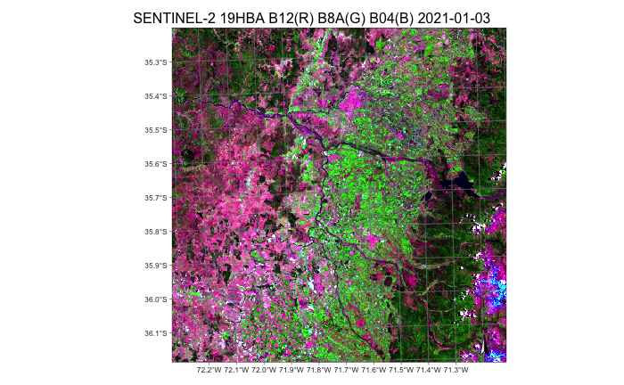

# Earth observation data cubes{-}

```{r, include = FALSE, eval = TRUE, echo = FALSE}
source("common.R")
dir.create("./tempdir/chp4")
library(sits)
library(sitsdata)
```

<a href="https://www.kaggle.com/code/esensing/creating-data-cubes-in-sits" target="_blank"></a>

## Brief introduction to remote sensing images and terminology{-}

### Optical surface reflectance images{-}

Optical satellite sensors are instruments onboard satellites designed to capture images of the Earth's surface using visible, near-infrared, and sometimes shortwave infrared light. These sensors detect reflected sunlight. To be useful for analysis, the signals captured by optical sensors are converted to surface reflectance values, which represent the fraction of sunlight reflected by the Earth's surface. This correction accounts for sensor characteristics, atmospheric scattering, and varying solar illumination conditions. The images are also corrected for geometric distortions caused by the sensor's angle of view. Finally, the images are accurately aligned with geographic coordinates. Additional information provided together with optical images include cloud detection masks. Pixels which are affected by clouds or shadows are marked to allow additional corrections and gap filling. 

### Synthetic aperture radar (SAR) images{-}

Synthetic Aperture Radar (SAR) images are acquired by satellites using a specialized radar system that sends out microwave signals. When the microwave pulses hit the Earth's surface, they are scattered in various directions. A portion of these scattered signals, known as backscatter, is reflected back towards the satellite. The SAR antenna on the satellite receives the backscattered signals. Because the satellite is moving along its orbit, it collects data from different positions, which helps in synthesizing a larger aperture than the physical size of the antenna. 

The received signals are processed using complex algorithms. This processing involves combining the signals from multiple pulses and different positions to create a high-resolution image. The technique of combining these signals to simulate a larger antenna is called aperture synthesis. The processed data is then used to generate SAR images, which represent the backscatter intensity from the Earth's surface. SAR imaging has several advantages. SAR can penetrate clouds and work in all weather conditions, including rain and fog. Since SAR uses microwave signals, it does not rely on sunlight and can capture images both day and night.


#### SAR Ground Range Detected (GRD) images{-}

Sentinel-1 GRD products consist of focused SAR data that has been detected, multi-looked and projected to ground range using the WGS84 Earth ellipsoid model. GRD images are subject for variations in the radar signal's intensity due to topographic effects, antenna pattern, range spreading loss, and other radiometric distortions. The most common types of distortions include foreshortening, layover and shadowing. 

Foreshortening occurs when the radar signal strikes a steep terrain slope facing the radar, causing the slope to appear compressed in the image. Features like mountains can appear much steeper than they are, and their true heights can be difficult to interpret. Layover happens when the radar signal reaches the top of a tall feature (like a mountain or building) before it reaches the base. As a result, the top of the feature is displaced towards the radar and appears in front of its base. This results in a reversal of the order of features along the radar line-of-sight, making the image interpretation challenging. Shadowing occurs when a radar signal is obstructed by a tall object, casting a shadow on the area behind it that the radar cannot illuminate. The shadowed areas appear dark in SAR images, and no information is available from these regions, similar to optical shadows.

#### SAR Radiometrically Terrain Corrected (RTC) images{-}

An RTC SAR image has undergone corrections for both geometric distortions and radiometric distortions caused by the terrain. The purpose of RTC processing is to enhance the interpretability and usability of SAR images for various applications by providing a more accurate representation of the Earth's surface. The radar backscatter values are normalized to account for these variations, ensuring that the image accurately represents the reflectivity of the surface features.

The terrain correction addresses geometric distortions caused by the side-looking geometry of SAR imaging, such as foreshortening, layover, and shadowing. It uses a Digital Elevation Model (DEM) to model the terrain and re-project the SAR image from the slant range (radar line-of-sight) to the ground range (true geographic coordinates). This process aligns the SAR image with the actual topography, providing a more accurate spatial representation.

### Analysis-ready data(ARD) definition{-}

Analysis Ready Data (CEOS-ARD) are satellite data that have been processed to meet the [ARD standards](https://ceos.org/ard/) defined by the Committee on Earth Observation Satellites (CEOS). ARD data simplify and accelerate the analysis of Earth observation data by providing consistent and high-quality data that are standardized across different sensors and platforms. 

ARD images processing includes geometric corrections, radiometric corrections, and sometimes atmospheric corrections. Images are georeferenced, meaning they are accurately aligned with a coordinate system. Optical ARD images include cloud and shadow masking information. These masks indicate which pixels affected by clouds or cloud shadows. For optical sensors, CEOS-ARD images have to be converted to surface reflectance values, which represent the fraction of light that is reflected by the surface. This makes the data more comparable across different times and locations.

For SAR images, CEOS-ARD specification require images to undergo Radiometric Terrain Correction (RTC) and are provided in the GammaNought ($\gamma_0$) backscatter values. This value which mitigates the variations from diverse observation geometries and is recommended for most land applications. 

## Analysis-ready data image collections

ARD images are available from various satellite platforms, including Landsat, Sentinel, and commercial satellites. This provides a wide range of spatial, spectral, and temporal resolutions to suit different applications. They are organised as a collection of  files, where each pixel contains a single value for each spectral band for a given date. These collections are available in cloud services such as Brazil Data Cube, Digital Earth Africa, and Microsoft's Planetary Computer. In general, the timelines of the images of an ARD collection are different. Images still contain cloudy or missing pixels; bands for the images in the collection may have different resolutions. Figure \@ref(fig:ardt) shows an example of the Landsat ARD image collection. 

```{r ardt, echo = FALSE, out.width="80%", fig.align="center", fig.cap="ARD image collection (Source: USGS. Reproduction based on fair use doctrine)."}
knitr::include_graphics("./images/usgs_ard_tile.png")
```

ARD image collections are organized in spatial partitions. Sentinel-2/2A images follow the Military Grid Reference System (MGRS) tiling system, which divides the world into 60 UTM zones of 8 degrees of longitude. Each zone has blocks of 6 degrees of latitude. Blocks are split into tiles of 110 $\times$ 110 km$^2$ with a 10 km overlap. Figure \@ref(fig:mgrs) shows the MGRS tiling system for a part of the Northeastern coast of Brazil, contained in UTM zone 24, block M. 

```{r mgrs, echo = FALSE, out.width="80%", fig.align="center", fig.cap="MGRS tiling system used by Sentinel-2 images (Source: GISSurfer 2.0. Reproduction based on fair use doctrine)."}
knitr::include_graphics("./images/s2_mgrs_grid.png")
```

The Landsat-4/5/7/8/9 satellites use the Worldwide Reference System (WRS-2), which breaks the coverage of Landsat satellites into images identified by path and row (see Figure \@ref(fig:wrs)).  The path is the descending orbit of the satellite; the WRS-2 system has 233 paths per orbit, and each path has 119 rows, where each row refers to a latitudinal center line of a frame of imagery. Images in WRS-2 are geometrically corrected to the UTM projection.

```{r wrs, echo = FALSE, out.width="80%", fig.align="center", fig.cap="WRS-2 tiling system used by Landsat-5/7/8/9 images (Source: INPE and ESRI. Reproduction based on fair use doctrine)."}
knitr::include_graphics("./images/landsat_wrs_grid.png")
```

## Image collections handled by sits{-}

In version 1.5.1,`sits` supports access to the following ARD image cloud providers:

1. Amazon Web Services (AWS): Open data Sentinel-2/2A level 2A collections for the Earth's land surface. 
2. Brazil Data Cube (BDC): Open data collections of Sentinel-2/2A, Landsat-8, CBERS-4/4A, and MOD13Q1 products for Brazil. These collections are organized as regular data cubes. 
3. Digital Earth Africa (DEAFRICA): Open data collections of Sentinel-1 RTC, Sentinel-2/2A, Landsat-5/7/8/9 for Africa. Additional products available include ALOS_PALSAR mosaics, DEM_COP_30, NDVI_ANOMALY based on Landsat data, and monthly and daily rainfall data from CHIRPS. 
4. Microsoft Planetary Computer (MPC): Open data collections of Sentinel-1 GRD, Sentinel-2/2A,  Landsat-4/5/7/8/9 images for the Earth's land areas. Also supported are Copernicus DEM-30 and MOD13Q1, MOD10A1 and MOD09A1 products. Sentinel-1 RTC collections are acessible but require payment.
5. Copernicus Data Space Ecosystem (CDSE): Open data collections of Sentinel-1 RTC and Sentinel-2/2A images. 
6. Harmonized Landsat-Sentinel (HLS): HLS, provided by NASA, is an open data collection that processes Landsat 8 and Sentinel-2 imagery to a common standard.
7. USGS: Landsat-4/5/7/8/9 collections available in AWS, which require access payment. 
8. Swiss Data Cube (SDC): Open data collection of Sentinel-2/2A and Landsat-8 images for Switzerland. 
9. Digital Earth Australia (DEAUSTRALIA): Open data ARD collections of Sentinel-2A/2B and Landsat-5/7/8/9 images; yearly geomedian of Landsat 5/7/8 images; yearly fractional land cover from 1986 to 2024. 
10. ESA World Cover: World land cover data set for year 2021, hosted by TERRASCOPE. 

In addition, `sits` supports the use of Planet monthly mosaics stored as local files. For a detailed description of the providers and collections supported by `sits`, please run `sits_list_collections()`.


## Regular image data cubes{-}

Machine learning and deep learning (ML/DL) classification algorithms require the input data to be consistent. The dimensionality of the data used for training the model has to be the same as that of the data to be classified. There should be no gaps and no missing values. Thus, to use ML/DL algorithms for remote sensing data, ARD image collections should be converted to regular data cubes. Adapting a previous definition by Appel and Pebesma [@Appel2019], we consider a *regular data cube*  has the following definition and properties:

1. A regular data cube is a four-dimensional data structure with dimensions x (longitude or easting), y (latitude or northing), time, and bands. The spatial, temporal, and attribute dimensions are independent and not interchangeable.
2. The spatial dimensions refer to a coordinate system, such as the grids defined by UTM (Universal Transverse Mercator) or MGRS (Military Grid Reference System). A grid (or tile) of the grid corresponds to a unique zone of the coordinate system. A data cube may span various tiles and UTM zones.
3. The temporal dimension is a set of continuous and equally-spaced intervals. 
4. For every combination of dimensions, a cell has a single value.

All cells of a data cube have the same spatiotemporal extent. The spatial resolution of each cell is the same in X and Y dimensions. All temporal intervals are the same. Each cell contains a valid set of measures. Each pixel is associated to a unique coordinate in a zone of the coordinate system.   For each position in space, the data cube should provide a set of valid time series. For each time interval, the regular data cube should provide a valid 2D image (see Figure \@ref(fig:dc)). 

```{r dc, echo = FALSE, out.width="100%", fig.align="center", fig.cap="Conceptual view of data cubes (Source: Authors)."}
knitr::include_graphics("./images/datacube_conception.png")
```

Currently, the only cloud service that provides regular data cubes by default is the Brazil Data Cube (BDC). ARD collections available in other cloud services are not regular in space and time. Bands may have different resolutions, images may not cover the entire time, and time intervals may be irregular. For this reason, subsets of these collections need to be converted to regular data cubes before further processing. To produce data cubes for machine-learning data analysis, users should first create an irregular data cube from an ARD collection and then use `sits_regularize()`, as described below.

## Creating data cubes{-}

<a href="https://www.kaggle.com/esensing/creating-data-cubes-in-sits" target="_blank"></a>

To obtain information on ARD image collection from cloud providers, `sits` uses the [SpatioTemporal Asset Catalogue](https://stacspec.org/en) (STAC) protocol, a specification of geospatial information which many large image collection providers have adopted. A 'spatiotemporal asset' is any file that represents information about the Earth captured in a specific space and time. To access STAC endpoints, `sits` uses the [rstac](http://github.com/brazil-data-cube/rstac) R package.

The function `sits_cube()` supports access to image collections in cloud services; it has the following parameters:

1. `source`: Name of the provider. 
2. `collection`: A collection available in the provider and supported by `sits`. To find out which collections are supported by `sits`, see `sits_list_collections()`. 
3. `platform`: Optional parameter specifying the platform in collections with multiple satellites. 
4. `tiles`: Set of tiles of image collection reference system. Either `tiles` or `roi` should be specified. 
5. `roi`: A region of interest. Either: (a) a named vector (`lon_min`, `lon_max`, `lat_min`, `lat_max`) in WGS 84 coordinates; or (b) an `sf` object.  All images intersecting the convex hull of the `roi` are selected. 
6. `bands`: Optional parameter with the bands to be used. If missing, all bands from the collection are used.
7. `orbit`: Optional parameter required only for Sentinel-1 images.
8. `start_date`: The initial date for the temporal interval containing the time series of images.
9. `end_date`: The final date for the temporal interval containing the time series of images.

The result of `sits_cube()` is a tibble with a description of the selected images required for further processing. It does not contain the actual data, but only pointers to the images.  The attributes of individual image files can be assessed by listing the `file_info` column of the tibble. 


## Amazon Web Services{-}

Amazon Web Services (AWS) holds two kinds of collections: *open-data* and *requester-pays*. Open data collections can be accessed without cost. Requester-pays collections require payment from an AWS account. Currently, `sits` supports collection `SENTINEL-2-L2A` which is open data.  The bands in 10 m resolution are B02, B03, B04, and B08. The  20 m bands are B05, B06, B07, B8A, B11, and B12. Bands B01 and B09 are available at 60 m resolution. A CLOUD band is also available. The example below shows how to access one tile of the open data `SENTINEL-2-L2A` collection.  The `tiles` parameter allows selecting the desired area according to the MGRS reference system. 

```{r, eval = FALSE, echo = TRUE, tidy="styler"}
# Create a data cube covering an area in Brazil
s2_23MMU_cube <- sits_cube(
    source = "AWS",
    collection = "SENTINEL-2-L2A",
    tiles = "23MMU",
    bands = c("B02", "B8A", "B11", "CLOUD"),
    start_date = "2018-07-12",
    end_date = "2019-07-28"
)
plot(s2_23MMU_cube, 
     red = "B11", 
     blue = "B02", 
     green = "B8A", 
     date = "2018-10-05"
)
```

```{r, echo = FALSE, out.width="100%", fig.align="center", fig.cap= "Sentinel-2 image in an area of the Northeastern coast of Brazil (Source: Authors)."}
knitr::include_graphics("./images/aws_s2.png")
```


## Microsoft's Planetary Computer{-}

The `sits` supports access to three open data collection from Microsoft's Planetary Computer (MPC): `SENTINEL-1-GRD`, `SENTINEL-2-L2A`, `LANDSAT-C2-L2`. It also allows access to `COP-DEM-GLO-30` (Copernicus Global DEM at 30 meter resolution) and `MOD13Q1-6.1`(version 6.1 of the MODIS MOD13Q1 product). Access to the non-open data collection `SENTINEL-1-RTC` is available for users that have registration in MPC. 

### SENTINEL-2/2A images in MPC{-}

The SENTINEL-2/2A ARD images available in MPC have the same bands and resolutions as those available in AWS (see above). The example below shows how to access the `SENTINEL-2-L2A` collection. 

```{r, tidy="styler",  eval = FALSE}
# Create a data cube covering an area in the Brazilian Amazon
s2_20LKP_cube_MPC <- sits_cube(
      source = "MPC",
      collection = "SENTINEL-2-L2A",
      tiles = "20LKP",
      bands = c("B02", "B8A", "B11", "CLOUD"),
      start_date = "2019-07-01",
      end_date = "2019-07-28"
)
# Plot a color composite of one date of the cube
plot(s2_20LKP_cube_MPC, red = "B11", blue = "B02", green = "B8A", 
     date = "2019-07-18"
)
```

```{r, echo = FALSE, out.width="100%", fig.align="center", fig.cap= "Sentinel-2 image in an area of the state of Rondonia, Brazil (Source: Authors)."}
knitr::include_graphics("./images/mpc_s2.png")
```

### LANDSAT-C2-L2 images in MPC{-}

The `LANDSAT-C2-L2` collection provides access to data from Landsat-4/5/7/8/9 satellites. Images from these satellites have been intercalibrated to ensure data consistency. For compatibility between the different Landsat sensors, the band names are BLUE, GREEN, RED,  NIR08,  SWIR16, and SWIR22. All images have 30 m resolution. For this collection,  tile search is not supported; the `roi` parameter should be used. The example below shows how to retrieve data from a region of interest covering the city of Brasilia in Brazil. 

```{r, tidy="styler", eval = FALSE}

# Read a ROI that covers part of the Northeastern coast of Brazil
roi <- c(lon_min = -43.5526, lat_min = -2.9644, 
         lon_max = -42.5124, lat_max = -2.1671)
# Select the cube
s2_L8_cube_MPC <- sits_cube(
        source = "MPC",
        collection = "LANDSAT-C2-L2",
        bands = c("BLUE", "RED", "GREEN", "NIR08", "SWIR16", "CLOUD"),
        roi = roi,
        start_date = "2019-06-01",
        end_date = "2019-09-01"
)
# Plot the tile that covers the Lencois Maranhenses
plot(s2_L8_cube_MPC, red = "RED", green = "GREEN", blue = "BLUE",  
     date = "2019-06-30")
```

```{r, echo = FALSE, out.width="100%", fig.align="center", fig.cap= "Landsat-8 image in an area in Northeast Brazil (Source: Authors)."}
knitr::include_graphics("./images/mpc_l8.png")
```

### SENTINEL-1-GRD images in MPC{-}

Access to Sentinel-1 GRD images can be done either by MGRS tiles (`tiles`) or by region of interest (`roi`). We recommend using the MGRS tiling system for specifying the area of interest, since when these images are regularized, they will be re-projected into MGRS tiles. By default, only images in descending orbit are selected. 

The following example shows how to create a data cube of S1 GRD images over a region in Mato Grosso Brazil that is an area of the Amazon forest that has been deforested. The resulting cube will not follow any specific projection and its coordinates will be stated as EPSG 4326 (latitude/longitude). Its geometry is derived from the SAR slant-range perspective; thus, it will appear included in relation to the Earth's longitude. 

```{r, tidy="styler", cache = TRUE, out.width="100%", fig.align="center", fig.cap= "Sentinel-1 image in an area in Mato Grosso, Brazil (Source: Authors)."}
cube_s1_grd <-  sits_cube(
  source = "MPC",
  collection = "SENTINEL-1-GRD",
  bands = c("VV"),
  orbit = "descending",
  tiles = c("21LUJ","21LVJ"),
  start_date = "2021-08-01",
  end_date = "2021-09-30"
)
plot(cube_s1_grd, band = "VV", palette = "Greys")
```

As explained earlier in this chapter, in areas with areas with large elevation differences, Sentinel-1 GRD images will have geometric distortions. For this reason, whenever possible, we recommend the use of RTC (radiometrically terrain corrected) images as described in the next session. 


### SENTINEL-1-RTC images in MPC{-}

In MPC, access to Sentinel-1-RTC images requires a Planetary Computer account. User will receive a  Shared Access Signature (SAS) Token from MPC that allows access to RTC data. Once a user receives a token from Microsoft, she needs to include the environment variable `MPC_TOKEN` in her `.Rprofile`. Therefore, the following example only works for users that have an SAS token.

```{r, tidy="styler", cache = TRUE, out.width="100%", fig.align="center", fig.cap= "Sentinel-1-RTC image of an area in Colombia (Source: Authors)."}
cube_s1_rtc <-  sits_cube(
  source = "MPC",
  collection = "SENTINEL-1-RTC",
  bands = c("VV", "VH"),
  orbit = "descending",
  tiles = "18NZM",
  start_date = "2021-08-01",
  end_date = "2021-09-30"
)
plot(cube_s1_rtc, band = "VV", palette = "Greys")
```
The above image is from the central region of Colombia, a country with large variations in altitude due to the Andes mountains. Users are invited to compare this images with the one from the `SENTINEL-1-GRD` collection and see the significant geometrical distortions of the GRD image compared with the RTC one.

### Copernicus DEM 30 meter images in MPC{-}

The Copernicus digital elevation model 30-meter global dataset (COP-DEM-GLO-30) is a high-resolution topographic data product provided by the European Space Agency (ESA) under the Copernicus Program. The vertical accuracy of the Copernicus DEM 30-meter dataset is typically within a few meters, but this can vary depending on the region and the original data sources. The primary data source for the Copernicus DEM is data from the TanDEM-X mission, designed by the German Aerospace Center (DLR). TanDEM-X provides high-resolution radar data through interferometric synthetic aperture radar (InSAR) techniques.

The Copernicus DEM 30 meter is organized in a 1$^\circ$ by 1$^\circ$ grid. In `sits`, access to COP-DEM-GLO-30 images can be done either by MGRS tiles (`tiles`) or by region of interest (`roi`). In both case, the cube is retrieved based on the parts of the grid that intersect the region of interest or the chosen tiles.

```{r, tidy="styler", out.width="100%", fig.align="center", fig.cap= "Copernicus 30-meter DEM of an area in Brazil (Source: Authors)."}
cube_dem_30 <-  sits_cube(
  source = "MPC",
  collection = "COP-DEM-GLO-30",
  tiles = "20LMR",
  band = "ELEVATION"
)
plot(cube_dem_30, band = "ELEVATION", rev = TRUE)
```

## Copernicus Data Space Ecosystem (CDSE){-}

The Copernicus Data Space Ecosystem (CDSE) is a cloud service designed to support access to Earth observation data from the Copernicus Sentinel missions and other sources. It is designed and maintained by the European Space Agency (ESA) with support from the European Commission. 

Configuring user access to CDSE involves several steps to ensure proper registration, access to data, and utilization of the platform's tools and services. Visit the Copernicus Data Space Ecosystem [registration page](https://dataspace.copernicus.eu). Complete the registration form with your details, including name, email address, organization, and sector. Confirm your email address through the verification link sent to your inbox.

After registration, you will need to obtain access credentials to the S3 service implemented by CDSE, which can be obtained using the [CSDE S3 credentials site](https://eodata-s3keysmanager.dataspace.copernicus.eu/panel/s3-credentials). The site will request you to add a new credential. You will receive two keys: an an S3 access key and a secret access key. Take note of both and include the following lines in your `.Rprofile`.

```{r, echo = TRUE, eval = FALSE}
Sys.setenv(
    AWS_ACCESS_KEY_ID = "your access key",
    AWS_SECRET_ACCESS_KEY = "your secret access key"
	  AWS_S3_ENDPOINT = "eodata.dataspace.copernicus.eu",
	  AWS_VIRTUAL_HOSTING = "FALSE"
)
```

After including these lines in your .Rprofile, restart `R` for the changes to take effect. By following these steps, users will have access to the Copernicus Data Space Ecosystem. 

### SENTINEL-2/2A images in CDSE{-}

CDSE hosts a global collection of Sentinel-2 Level-2A images, which are processed according to the [CEOS Analysis-Ready Data](https://ceos.org/ard/) specifications. One example is provided below, where we present a Sentinel-2 image of the Lena river delta in Siberia in summertime.

```{r, echo = TRUE, eval = FALSE}
# obtain a collection of images of a tile covering part of Lena delta
lena_cube <- sits_cube(
    source = "CDSE",
    collection = "SENTINEL-2-L2A",
    bands = c("B02", "B04", "B8A", "B11", "B12"),
    start_date = "2023-05-01",
    end_date = "2023-09-01",
    tiles = c("52XDF")
)
# plot an image from summertime
plot(lena_cube, date = "2023-07-06", red = "B12", green = "B8A", blue = "B04")
```

```{r, echo = FALSE, out.width="100%", fig.align="center", fig.cap= "Sentinel-2 image of the Lena river delta in summertime (Source: Authors)."}
knitr::include_graphics("./images/s2_lena_delta.png")
```

### SENTINEL-1-RTC images in CDSE{-}

An important product under development at CDSE are the radiometric terrain corrected (RTC) Sentinel-1 images. in CDSE, this product is referred to as normalized terrain backscater (NRB). The S1-NRB product contains radiometrically terrain corrected (RTC) gamma nought backscatter (γ0) processed from Single Look Complex (SLC) Level-1A data. Each acquired polarization is stored in an individual binary image file. 

All images are projected and gridded into the United States Military Grid Reference System (US-MGRS). The use of the US-MGRS tile grid ensures a very high level of interoperability with Sentinel-2 Level-2A ARD products making it easy to also set-up complex analysis systems that exploit both SAR and optical data. While speckle is inherent in SAR acquisitions, speckle filtering is not applied to the S1-NRB product in order to preserve spatial resolution.  Some applications (or processing methods) may require spatial or temporal filtering for stationary backscatter estimates. 

For more details, please refer to the [S1-NRB product website](https://sentinels.copernicus.eu/web/sentinel/sentinel-1-ard-normalised-radar-backscatter-nrb-product). As of July 2024, RTC images are only available for Africa. Global coverage is expected to grow as ESA expands the S1-RTC archive. The following example shows an S1-RTC image for the Rift valley in Ethiopia.

```{r, tidy = "styler", echo = TRUE, eval = FALSE}
# retrieve a S1-RTC cube and plot
s1_cube <- sits_cube(
    source = "CDSE",
    collection = "SENTINEL-1-RTC",
    bands = c("VV", "VH"),
    orbit = "descending",
    start_date = "2023-01-01",
    end_date = "2023-12-31",
    tiles = c("37NCH")
)
plot(s1_cube, band = "VV", date = c("2023-03-03"), palette = "Greys")
```

```{r, echo = FALSE, out.width="100%", fig.align="center", fig.cap= "Sentinel-1-RTC image of the Rift Valley in Ethiopia (Source: Authors)."}
knitr::include_graphics("./images/s1_rtc_cdse.png")
```


## Digital Earth Africa{-}

Digital Earth Africa (DEAFRICA) is a cloud service that provides open-access Earth observation data for the African continent. The ARD image collections in `sits` are:
1. Sentinel-2 level 2A (`SENTINEL-2-L2A`), organised as MGRS tiles.
2. Sentinel-1 radiometrically terrain corrected (`SENTINEL-1-RTC`)
3. Landsat-5 (`LS5-SR`), Landsat-7 (`LS7-SR`), Landsat-8 (`LS8-SR`) and Landat-9 (`LS9-SR`). All Landsat collections are ARD data and are organized as WRS-2 tiles.
4. SAR L-band images produced by PALSAR sensor onboard the Japanese ALOS satellite(`ALOS-PALSAR-MOSAIC`). Data is organized in a 5$^\circ$ by 5$^\circ$ grid with a spatial resolution of 25 meters. Images are available annually from 2007 to 2010 (ALOS/PALSAR) and from 2015 to 2022 (ALOS-2/PALSAR-2).
5.Estimate of vegetation condition using NDVI anomalies (`NDVI-ANOMALY`) compared with the long-term baseline condition. The available measurements are "NDVI_MEAN" (mean NDVI for a month) and "NDVI-STD-ANOMALY" (standardised NDVI anomaly for a month).
6. Rainfall information provided by Climate Hazards Group InfraRed Precipitation with Station data (CHIRPS) from University of California in Santa Barbara. There are monthly (`RAINFALL-CHIRPS-MONTHLY`) and daily (`RAINFALL-CHIRPS-DAILY`) products over Africa.
7. Digital elevation model provided by the EC Copernicus program (`COP-DEM-30`) in 30 meter resolution organized in a 1$^\circ$ by 1$^\circ$ grid.

Access to DEAFRICA Sentinel-2 images can be done wither using `tiles` or `roi` parameter. In this example, the requested `roi` produces a cube that contains one MGRS tiles (“35LPH”) covering an area of Madagascar that includes the Betsiboka Estuary.

```{r, tidy="styler", eval = FALSE}
dea_s2_cube <- sits_cube(
    source = "DEAFRICA",
    collection = "SENTINEL-2-L2A",
    roi = c(
    lon_min = 46.1, lat_min = -15.6,
    lon_max = 46.6, lat_max = -16.1
  ),
    bands = c("B02", "B04", "B08"),
    start_date = "2019-04-01",
    end_date = "2019-05-30"
)
plot(dea_s2_cube, red = "B04", blue = "B02", green = "B08")
```

```{r, echo = FALSE, out.width="100%", fig.align="center", fig.cap="Sentinel-2 image in an area over Madagascar (Source: Authors)."}
knitr::include_graphics("./images/deafrica_s2.png")
```

The next example retrieves a set of ARD Landsat-9 data, covering the Serengeti plain in Tanzania. 

```{r, tidy="styler", eval = FALSE}
dea_l9_cube <- sits_cube(
    source = "DEAFRICA",
    collection = "LS9-SR",
    roi = c(
        lon_min = 33.0, lat_min = -3.60, 
        lon_max = 33.6, lat_max = -3.00
    ),
    bands = c("B04", "B05", "B06"),
    start_date = "2023-05-01",
    end_date = "2023-08-30"
)
plot(dea_l9_cube, date = "2023-06-26", 
     red = "B06", green = "B05", blue = "B04")
```

```{r, echo = FALSE, out.width="100%", fig.align="center", fig.cap="Landsat-9 image in an area over the Serengeti in Tanzania (Source: Authors)."}
knitr::include_graphics("./images/landsat9_serengeti.png")
```

The following example shows how to retrieve a subset of the ALOS-PALSAR mosaic for year 2020, for an area near the border between Congo and Rwanda. 

```{r, tidy="styler", eval = FALSE}
dea_alos_cube <- sits_cube(
    source = "DEAFRICA",
    collection = "ALOS-PALSAR-MOSAIC",
    roi = c(
        lon_min = 28.69, lat_min = -2.35, 
        lon_max = 29.35, lat_max = -1.56
    ),
    bands = c("HH", "HV"),
    start_date = "2020-01-01",
    end_date = "2020-12-31"
)
plot(dea_alos_cube,band = "HH")
```

```{r, echo = FALSE, out.width="100%", fig.align="center", fig.cap="Landsat-9 image in an area over the Serengeti in Thailand (Source: Authors)."}
knitr::include_graphics("./images/alos_palsar_hh_lake_kivu.png")
```

## Assessing the Brazil Data Cube{-}

The [Brazil Data Cube](http://brazildatacube.org/en) (BDC) is built by Brazil’s National Institute for Space Research (INPE), to provide regular EO data cubes from CBERS, LANDSAT, SENTINEL-2, and TERRA/MODIS satellites for environmental applications. The collections available in the BDC are: `LANDSAT-OLI-16D` (Landsat-8 OLI, 30 m resolution, 16-day intervals),  `SENTINEL-2-16D` (Sentinel-2A and 2B MSI images at 10 m resolution, 16-day intervals), `CBERS-WFI-16D` (CBERS 4 WFI, 64 m resolution, 16-day intervals), `CBERS-WFI-8D`(CBERS 4 and 4A WFI images, 64m resolution, 8-day intervals), and `MOD13Q1-6.1` (MODIS MOD13SQ1 product, collection 6, 250 m resolution, 16-day intervals). For more details, use `sits_list_collections(source = "BDC")`.

The BDC uses three hierarchical grids based on the Albers Equal Area projection and SIRGAS 2000 datum. The large grid has tiles of 4224.4 $\times4$ 224.4 km^2^ and is used for CBERS-4 AWFI collections at 64 m resolution; each CBERS-4 AWFI tile contains images of 6600 $\times$ 6600 pixels. The medium grid is used for Landsat-8 OLI collections at 30 m resolution; tiles have an extension of 211.2 $\times$ 211.2 km^2^, and each image has 7040 $\times$ 7040 pixels. The small grid covers 105.6 $\times$ 105.6 km^2^ and is used for Sentinel-2 MSI collections at 10 m resolutions; each image has 10560 $\times$ 10560 pixels. The data cubes in the BDC are regularly spaced in time and cloud-corrected [@Ferreira2020a]. 


```{r, echo = FALSE, out.width="80%", fig.align="center", fig.cap="Hierarchical BDC tiling system showing (a) large BDC grid overlayed on Brazilian biomes, (b) one large tile, (c) four medium tiles, and (d) sixteen small tiles (Source: Ferreira et al. (2020). Reproduction under fair use doctrine)."}
knitr::include_graphics("./images/bdc_grid.png")
```

To access the BDC, users must provide their credentials using environment variables, as shown below. Obtaining a BDC access key is free. Users must register at the [BDC site](https://brazildatacube.dpi.inpe.br/portal/explore) to obtain a key. In the example below, the data cube is defined as one tile ("005004") of `CBERS-WFI-16D` collection, which holds CBERS AWFI images at 16 days resolution.

```{r, tidy="styler", eval = FALSE}
# Define a tile from the CBERS-4/4A AWFI collection
cbers_tile <- sits_cube(
    source = "BDC",
    collection = "CBERS-WFI-16D",
    tiles = "005004",
    bands = c("B13", "B14", "B15", "B16", "CLOUD"),
    start_date = "2021-05-01",
    end_date = "2021-09-01")
# Plot one time instance
plot(cbers_tile, 
     red = "B15", 
     green = "B16", 
     blue = "B13", 
     date = "2021-05-09")
```

```{r, echo = FALSE, out.width="100%", fig.align="center", fig.cap="CBERS-4 WFI image in a Cerrado area in Brazil (Source: Authors)."}
knitr::include_graphics("./images/bdc_cbers4.png")
```


## Accessing Harmonized Landsat-Sentinel collections {-}

Harmonized Landsat Sentinel (HLS) is a NASA initiative that processes and harmonizes Landsat 8 and Sentinel-2 imagery to a common standard, including atmospheric correction, alignment, resampling, and corrections for BRDF (bidirectional reflectance distribution function). The purpose of the HLS project is to create a unified and consistent dataset that integrates the advantages of both systems, making it easier to work with the data.

The NASA Harmonized Landsat and Sentinel (HLS) service provides two image collections:

1. Landsat 8 OLI Surface Reflectance HLS (HLSL30) – The HLSL30 product includes atmospherically corrected surface reflectance from the Landsat 8 OLI sensors at 30 m resolution. The dataset includes 11 spectral bands.

2. Sentinel-2 MultiSpectral Instrument Surface Reflectance HLS (HLSS30) – The HLSS30 product includes atmospherically corrected surface reflectance from the Sentinel-2 MSI sensors at 30 m resolution. The dataset includes 12 spectral bands.

The HLS tiling system is identical as the one used for Sentinel-2 (MGRS). The tiles dimension is 109.8 km and there is an overlap of 4,900 m on each side.

To access NASA HLS, users need to registed at [NASA EarthData](https://urs.earthdata.nasa.gov/), and save their login and password in a ~/.netrc plain text file in Unix (or %HOME%\_netrc in Windows). The file must contain the following fields:

```{echo = TRUE, eval = FALSE}
machine urs.earthdata.nasa.gov
login <username>
password <password>
```

We recommend using the earthdatalogin package to create a `.netrc` file with the `earthdatalogin::edl_netrc`. This function creates a properly configured .netrc file in the user's home directory and an environment variable GDAL_HTTP_NETRC_FILE, as shown in the example.

```{r, tidy = "styler", echo = TRUE, eval = FALSE}
library(earthdatalogin)

earthdatalogin::edl_netrc( 
username = "<your user name>", 
password = "<your password>" 
) 
```


Access to images in NASA HLS is done by region of interest or by tiles. The following example shows an HLS Sentinel-2 image over the Brazilian coast. 

```{r, tidy="styler", echo = TRUE, eval = FALSE}
# define a region of interest
roi <- c(lon_min = -45.6422, lat_min = -24.0335,
         lon_max = -45.0840, lat_max = -23.6178)

# create a cube from the HLSS30 collection
hls_cube_s2 <- sits_cube(
  source = "HLS",
  collection = "HLSS30",
  roi = roi,
  bands = c("BLUE", "GREEN", "RED", "CLOUD"),
  start_date = as.Date("2020-06-01"),
  end_date = as.Date("2020-09-01"),
  progress = FALSE
)
# plot the cube
plot(hls_cube_s2, red = "RED", green = "GREEN", blue = "BLUE", date = "2020-06-20")
```

```{r, echo = FALSE, eval = TRUE, out.width="100%", fig.align="center", fig.cap="Plot of Sentinel-2 image obtained from the NASA HLS collection for date 2020-06-15 showing the island of Ilhabela in the Brazilian coast  (Source: Authors)."}

knitr::include_graphics("./images/hls_ilhabela_s2.png") 
```
Images from the HLS Landsat and Sentinel-2 collections are accessed separately and can be combined with `sits_merge()`. The script below creates an HLS Landsat cube over the same area as the Sentinel-2 cube above bands. The two cubes are then merged. 

```{r, tidy="styler", echo = TRUE, eval = FALSE}
# define a region of interest
roi <- c(lon_min = -45.6422, lat_min = -24.0335,
         lon_max = -45.0840, lat_max = -23.6178)

# create a cube from the HLSS30 collection
hls_cube_l8 <- sits_cube(
  source = "HLS",
  collection = "HLSL30",
  roi = roi,
  bands = c("BLUE", "GREEN", "RED", "CLOUD"),
  start_date = as.Date("2020-06-01"),
  end_date = as.Date("2020-09-01"),
  progress = FALSE
)
# merge the Sentinel-2 and Landsat-8 cubes
hls_cube_merged <- sits_merge(hls_cube_s2, hls_cube_l8)
```

```{r, echo = FALSE, eval = TRUE}
hls_cube_s2 <- readRDS(file = "./etc/hls_cube_s2.rds")
hls_cube_l8 <- readRDS(file = "./etc/hls_cube_l8.rds")
hls_cube_merged <- readRDS(file = "./etc/hls_cube_merged.rds")
```


Comparing the timelines of the original cubes and the merged one, one can see the benefits of the merged collection for time series data analysis. 

```{r, tidy="styler"}
# Timeline of the Sentinel-2 cube
sits_timeline(hls_cube_s2)
```
```{r, tidy="styler"}
# Timeline of the Landsat-8 cube
sits_timeline(hls_cube_l8)
```
```{r, tidy="styler"}
# Timeline of the Landsat-8 cube
sits_timeline(hls_cube_merged)
```

```{r, echo = TRUE, eval = FALSE, tidy="styler"}
# plotting a harmonized Landsat image from the merged dataset 
# plot the cube
plot(hls_cube_merged, 
     red = "RED", 
     green = "GREEN", 
     blue = "BLUE", 
     date = "2020-07-11")
```

```{r, echo = FALSE, eval = TRUE, out.width="100%", fig.align="center", fig.cap="Plot of Sentinel-2 image obtained from merging NASA HLS collection and Sentinel-2 collection for date 2020-06-15 showing the island of Ilhabela in the Brazilian coast (Source: Authors)."}
knitr::include_graphics("./images/hls_ilhabela_l8.png") 
```

## Reading Planet data as ARD local files{-}

ARD images downloaded from cloud collections to a local computer are not associated with a STAC endpoint that describes them. They must be organized and named to allow `sits` to create a data cube from them. All local files have to be in the same directory and have the same spatial resolution and projection. Each file must contain a single image band for a single date. Each file name needs to include tile, date, and band information. Users must provide information about the original data source to allow `sits` to retrieve information about image attributes such as band names, missing values, etc. When working with local cubes,  `sits_cube()` needs the following parameters: 

1. `source`: Name of the original data provider; for a list of providers and collections, use `sits_list_collections()`. 
2. `collection`:  Collection from where the data was extracted. 
3. `data_dir`: Local directory for images.
4. `bands`: Optional parameter to describe the bands to be retrieved.
5. `parse_info`: Information to parse the file names. File names need to contain information on tile, date, and band, separated by a delimiter (usually `"_"`).
6. `delim`: Separator character between descriptors in the file name (default is `"_"`).

To be able to read local files, they must belong to a collection registered by `sits`. All collections known to `sits` by default are shown using `sits_list_collections()`. To register a new collection, please see the information provided in the Technical Annex.

The example shows how to define a data cube using Planet images from the `sitsdata` package.  The dataset contains monthly PlanetScope mosaics for tile "604-1043" for August to October 2022, with bands B01, B02, B04, and B04. 

In general, `sits` users need to match the local file names to the values provided by the `parse_info` parameter. The file names of this dataset use the format `PLANETSCOPE_MOSAIC_604-1043_B4_2022-10-01.tif`, which fits the default value for `parse_info` which is `c("source", "collection", "tile", "band", "date")` and for `delim` which is "_",  it is not necessary to set these values when creating a data cube from the local files. 


```{r}
library(sits)
# Create a cube based on a stack of Sentinel-2 data
data_dir <- system.file("extdata/Planet", package = "sitsdata")
# List the first file
list.files(data_dir)[1]
```

```{r, tidy="styler", out.width="100%", fig.align="center", fig.cap="Planet image over an area in Colombia (Source: Authors)."}
# Create a data cube from local files
planet_cube <- sits_cube(
    source = "PLANET",
    collection = "MOSAIC",
    data_dir = data_dir
)

# Plot the first instance of the Planet data in natural colors
plot(planet_cube, red = "B3", green = "B2", blue = "B1")
```

## Reading global classified maps{-}


## Reading classified images as local data cube{-}

It is also possible to create local cubes based on results that have been produced by classification or post-classification algorithms. In this case, more parameters are required, and the parameter `parse_info` is specified differently, as follows:

1. `source`:  Name of the original data provider. 
2. `collection`: Name of the collection from where the data was extracted. 
3. `data_dir`: Local directory for the classified images.
4. `band`: Band name associated with the type of result. Use: (a) `probs` for probability cubes produced by `sits_classify()`; (b) `bayes`, for cubes produced by `sits_smooth()`; (c) `entropy`, `least`, `ratio` or `margin`, according to the method selected when using `sits_uncertainty()`; and (d) `class` for classified cubes.
5. `labels`: Labels associated with the names of the classes (not required for cubes produced by `sits_uncertainty()`).
6. `version`: Version of the result (default = `v1`).
7. `parse_info`: File name parsing information to allow `sits` to deduce the values of `tile`, `start_date`, `end_date`, `band`, and `version` from the file name. Unlike non-classified image files, cubes produced by classification and post-classification have both `start_date` and `end_date`. 

The following code creates a results cube based on the classification of deforestation in Brazil.  This classified cube was obtained by a large data cube of Sentinel-2 images, covering the state of Rondonia, Brazil comprising 40 tiles, 10 spectral bands, and covering the period from 2020-06-01 to 2021-09-11. Samples of four classes were trained by a random forest classifier. Internally, classified images use integers to represent classes. Thus, labels have to be associated to the integers that represent each class name.

```{r, tidy="styler", out.width="100%", fig.align="center", fig.cap="Classified data cube for the year 2020/2021 in Rondonia, Brazil (Source: Authors)."}
# Create a cube based on a classified image 
data_dir <- system.file("extdata/Rondonia-20LLP", 
                        package = "sitsdata")
# File name  "SENTINEL-2_MSI_20LLP_2020-06-04_2021-08-26_class_v1.tif" 
Rondonia_class_cube <- sits_cube(
    source = "AWS",
    collection = "SENTINEL-S2-L2A-COGS",
    bands = "class",
    labels = c("1" = "Burned_Area", "2" = "Cleared_Area", 
               "3" = "Highly_Degraded", "4" =  "Forest"),
    data_dir = data_dir,
    parse_info = c("satellite", "sensor", "tile", "start_date", "end_date", 
                   "band", "version"))
# Plot the classified cube
plot(Rondonia_class_cube)
```

## Regularizing data cubes{-}

ARD collections available in AWS, MPC, USGS, and DEAFRICA are not regular in space and time. Bands may have different resolutions, images may not cover the entire tile, and time intervals are irregular. For this reason, data from these collections need to be converted to regular data cubes by calling `sits_regularize()`, which uses the  *gdalcubes* package [@Appel2019]. After obtaining a regular data cube, users can perform data analysis and classification operations, as shown in the following chapters.

### Regularizing Sentinel-2 images

In the following example, the user has created an irregular data cube from the Sentinel-2 collection available in Microsoft's Planetary Computer (MPC) for tiles `20LKP` and `20LLP` in the state of Rondonia, Brazil. We first build an irregular data cube using `sits_cube()`.

```{r, cache = TRUE, tidy="styler"}
# Creating an irregular data cube from MPC
s2_cube_rondonia <- sits_cube(
    source = "MPC",
    collection = "SENTINEL-2-L2A",
    tiles = c("20LKP", "20LLP"),
    bands = c("B02", "B8A", "B11", "CLOUD"),
    start_date = as.Date("2018-07-01"),
    end_date = as.Date("2018-08-31"))
# Show the different timelines of the cube tiles
sits_timeline(s2_cube_rondonia)
```


```{r, cache = TRUE, tidy="styler", out.width="100%", fig.align="center", fig.cap="Sentinel-2 tile 20LLP for date 2018-07-03 (Source: Authors)."}
# plot the first image of the irregular cube
s2_cube_rondonia |>  
    dplyr::filter(tile == "20LLP") |>  
    plot(red = "B11", green = "B8A", blue = "B02", date = "2018-07-03")
```

Because of the different acquisition orbits of the Sentinel-2 and Sentinel-2A satellites, the two tiles also have different timelines. Tile `20LKP` has 12 instances, while tile `20LLP` has 24 instances for the chosen period. The function  `sits_regularize()` builds a data cube with a regular timeline and a best estimate of a valid pixel for each interval. The `period` parameter sets the time interval between two images. Values of `period` use the ISO8601 time period specification, which defines time intervals as `P[n]Y[n]M[n]D`, where "Y" stands for years, "M" for months, and "D" for days. Thus, `P1M` stands for a one-month period, `P15D` for a fifteen-day period. When joining different images to get the best image for a period, `sits_regularize()` uses an aggregation method that organizes the images for the chosen interval in order of increasing cloud cover and then selects the first cloud-free pixel. In the example, we use a small spatial resolution for the regular cube to speed up processing; in actual case, we suggest using a 10-meter spatial resolution for the cube.

```{r, cache = TRUE, tidy="styler", message = FALSE, results='hide', out.width="100%", fig.align="center", fig.cap="Regularized image for tile Sentinel-2 tile 20LLP (Source: Authors)."}
# Regularize the cube to 15 day intervals
reg_cube_rondonia <- sits_regularize(
          cube       = s2_cube_rondonia,
          output_dir = "./tempdir/chp4",
          res        = 40,
          period     = "P16D",
          multicores = 6)

# Plot the first image of the tile 20LLP of the regularized cube
# The pixels of the regular data cube cover the full MGRS tile
reg_cube_rondonia |>
    dplyr::filter(tile == "20LLP") |>
    plot(red = "B11", green = "B8A", blue = "B02")
```

### Regularizing Sentinel-1 images and merging with Sentinel-2

Because of their acquisition mode, SAR images are usually stored following their geometry of acquisition, which is inclined with respect to the Earth. This is the case of GRD and RTC collections available in Microsoft Planetary Computer (MPC). To allow easier use of Sentinel-1 data and to merge them with Sentinel-2 images, regularization in sits reprojects SAR data to the MGRS grid, as shown in the following example. The example uses the "SENTINEL-1-RTC" collection from MPC. Readers that do not have a subscription can replace "SENTINEL-1-RTC" with "SENTINEL-1-GRD" in the example.

```{r, echo = TRUE, tidy="styler", eval = FALSE}
# create an RTC cube from MPC collection for a region in Mato Grosso, Brazil.
cube_s1_rtc <-  sits_cube(
    source = "MPC",
    collection = "SENTINEL-1-RTC",
    bands = c("VV", "VH"),
    orbit = "descending",
    tiles = c("22LBL"),
    start_date = "2021-06-01",
    end_date = "2021-10-01"
)
plot(cube_s1_rtc, band = "VH", palette = "Greys", scale = 0.7)
```

```{r, out.width="100%", fig.align="center", fig.cap="Original Sentinel-1 image covering tile 22LBL (Source: Authors)."}
knitr::include_graphics("./images/cube_s1_rtc_tile_22LBL.png") 
```

After creating an irregular data cube from the data available in MPC, we use `sits_regularize()` to produce a SAR data cube that matches MGRS tile "22LBL". For plotting the SAR image, we select a multidate plot for the "VH" band, where the first date will be displayed in red, the second in green and the third in blue, so as to show an RGB map where changes are visually enhanced.

```{r, echo = TRUE, tidy="styler", eval = FALSE}
# define the output directory
# # Create a directory to store files
if (!file.exists("./tempdir/chp4/sar"))
    dir.create("./tempdir/chp4/sar")
# create a regular RTC cube from MPC collection for a tile 22LBL.
cube_s1_reg <- sits_regularize(
    cube = cube_s1_rtc,
    period = "P16D",
    res = 40,
    tiles = c("22LBL"),
    memsize = 12,
    multicores = 6,
    output_dir = "./tempdir/chp4/sar"
)
plot(cube_s1_reg, band = "VH", palette = "Greys", scale = 0.7, 
     dates = c("2021-06-06", "2021-07-24", "2021-09-26"))
```

```{r, out.width="100%", fig.align="center", fig.cap="Regular Sentinel-1 image covering tile 22LBL (Source: Authors)."}
knitr::include_graphics("./images/cube_s1_rtc_tile_22BL_reg_rgb.png") 
```
The next step is to produce a regular Sentinel-2 data cube for the same tile and regularize it. The cube below defines an irregular data cube retrieved from Planetary Computer. 

```{r, echo = TRUE, tidy="styler", eval = FALSE}

# define the output directory
cube_s2 <-  sits_cube(
    source = "MPC",
    collection = "SENTINEL-2-L2A",
    bands = c("B02", "B8A", "B11", "CLOUD"),
    tiles = c("22LBL"),
    start_date = "2021-06-01",
    end_date = "2021-09-30"
)
plot(cube_s2, red = "B11", green = "B8A", blue = "B02", date = "2021-07-07")
```

```{r, out.width="100%", fig.align="center", fig.cap="Sentinel-2 image covering tile 22LBL (Source: Authors)."}
knitr::include_graphics("./images/s2_tile_22LBL.png") 
```

The next step is to create a regular data cube for tile "20LBL". 
```{r, echo = TRUE, tidy="styler", eval = FALSE}
if (!file.exists("./tempdir/chp4/s2_opt"))
    dir.create("./tempdir/chp4/s2_opt")
# define the output directory
cube_s2_reg <-  sits_regularize(
    cube = cube_s2,
    period = "P16D",
    res = 40,
    tiles = c("22LBL"),
    memsize = 12,
    multicores = 6,
    output_dir = "./tempdir/chp4/s2_opt"
)
```

After creating the two regular cubes, we can merge them. Before this step, one should first compare their timelines to see if they match. Timelines of regular cubes are constrained by acquisition dates, which in the case of Sentinel-1 and Sentinel-2 are different. Attentive readers will have noticed that the start and end dates of the cubes selected from the Planetary Computer (see code above) are slightly difference, because of the need to ensure both regular cubes have the same number of time steps. The timelines for both cubes are shown below.

```{r, echo = FALSE, tidy="styler", eval = TRUE}
# recover the Sentinel-2 cube
cube_s2_reg <- sits_cube(
  source = "MPC",
  collection = "SENTINEL-2-L2A",
  data_dir = "./tempdir/chp4/s2_opt/"
)
# recover the Sentinel-1 cube
cube_s1_reg <- sits_cube(
  source = "MPC",
  collection = "SENTINEL-1-RTC",
  data_dir = "./tempdir/chp4/sar/"
)
```

```{r, echo = TRUE, tidy="styler", eval = TRUE}
# timeline of the Sentinel-2 cube
sits_timeline(cube_s2_reg)
```

```{r, echo = TRUE, tidy="styler", eval = TRUE}
# timeline of the Sentinel-2 cube
sits_timeline(cube_s1_reg)
```

Considering that the timelines are close enough so that the cubes can be combined, we can use the `sits_merge` function to produce a combined cube. As an example, we show a plot with both radar and optical bands.

```{r, echo = TRUE, tidy="styler", eval = TRUE}
# merge Sentinel-1 and Sentinel-2 cubes
cube_s1_s2 <- sits_merge(cube_s2_reg, cube_s1_reg)
# plot a an image with both SAR and optical bands
plot(cube_s1_s2, red = "B11", green = "B8A", blue = "VH")
```

## Merging multitemporal data cubes with base information 

In many applications, especially in regions with large topographical, soil or climatic variations, is is useful to merge multitemporal data cubes with base information such as digital elevation models (DEM). Merging multitemporal satellite images with digital elevation models (DEMs) offers several advantages that enhance the analysis and interpretation of geospatial data. Elevation data provides an additional to the two-dimensional satellite images, which help to distinguish land use and land cover classes which are impacted by altitude gradients.  One example is the capacity to distinguish between low-altitude and high-altitude forests. In case where topography changes significantly, DEM information can improve the accuracy of classification algorithms.

As an example of DEM integation in a data cube, we will consider an agricultural region of Chile which is located in a narrow area close to the Andes. There is a steep gradient so that the cube benefits from the inclusion of the DEM.

```{r, echo = TRUE, eval = FALSE}
s2_cube_19HBA <- sits_cube(
  source = "MPC",
  collection = "SENTINEL-2-L2A",
  tiles = "19HBA",
  bands = c("B04", "B8A", "B12", "CLOUD"),
  start_date = "2021-01-01",
  end_date = "2021-03-31"
)
plot(s2_cube_19HBA, red = "B12", green = "B8A", blue = "B04")
```

```{r, out.width="100%", fig.align="center", fig.cap="Sentinel-2 image covering tile 19HBA (Source: Authors)."}
 
```

Then, we produce a regular data cube to use for classification. In this example, we will use a reduced resolution (30 meters) to expedite processing. In practice, a resolution of 10 meters is recommended.

```{r, echo = TRUE, eval = FALSE}
s2_cube_19HBA_reg <- sits_regularize(
  cube = s2_cube_19HBA,
  period = "P16D",
  res = 30,
  output_dir = ".tempdir/s2_19HBA"
)
```


The next step is recover the DEM for the area. For this purpose, we will use the Copernicus Global DEM-30, and select the area covered by the tile. As explained in the MPC access section above, the Copernicus DEM tiles are stored as 1$^\circ$ by 1$^\circ$ grid. For them to match an MGRS tile, they have to be regularized in a similar way as the Sentinel-1 images, as shown below. To select a DEM, no temporal information is required.


```{r}
# obtain the DEM cube for 
dem_cube_19HBA <- sits_cube(
  source = "MPC",
  collection = "COP-DEM-GLO-30",
  bands = "ELEVATION",
  tiles = "19HBA"
)
# plot the DEM reversing the palette 
plot(dem_cube_19HBA, band = "ELEVATION", palette = "RdYlGn", rev = TRUE)
```