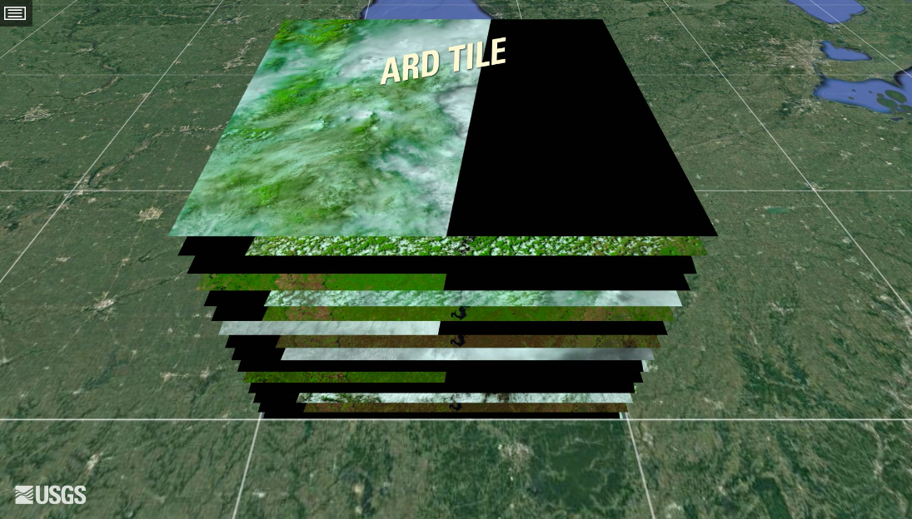
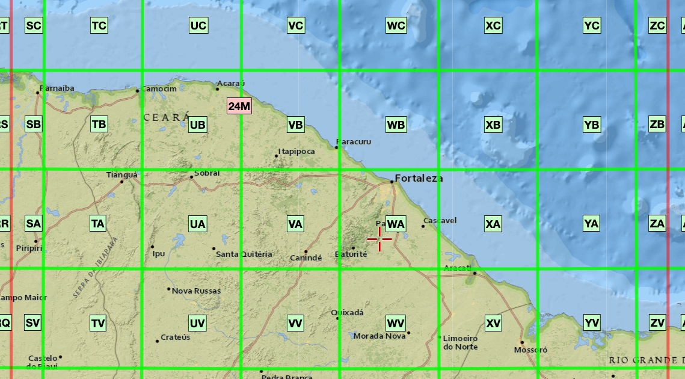
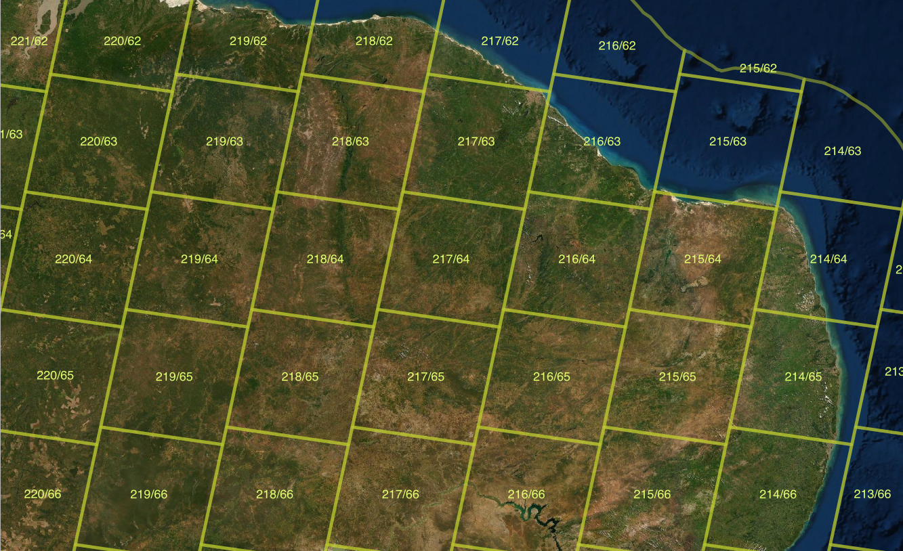
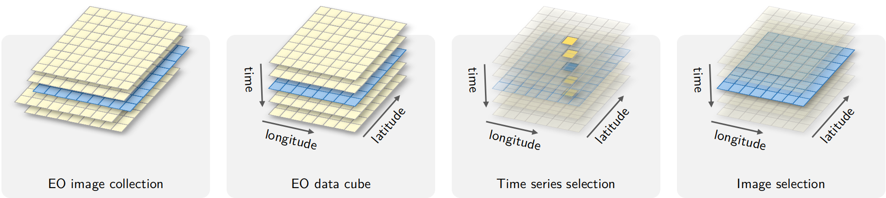
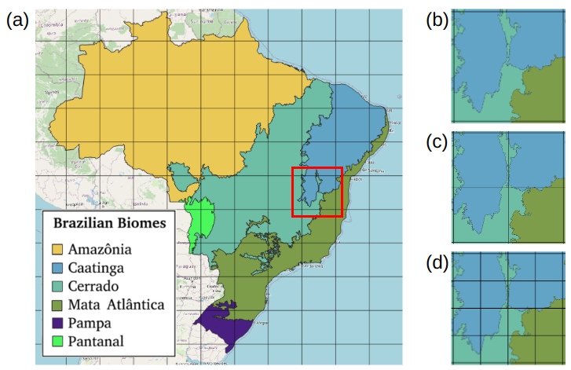
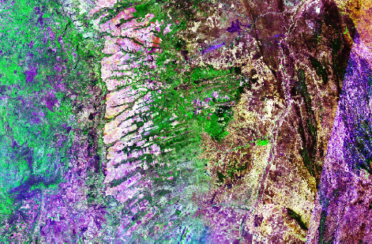

# Earth observation data cubes{-}

```{r, include = FALSE}
source("common.R")
dir.create("./tempdir/chp4")
library(sits)
```

## Analysis-ready data image collections{-}

Collections of Earth observation analysis-ready data (ARD) are available in cloud services such as Amazon Web Service, Brazil Data Cube, Digital Earth Africa, Swiss Data Cube, and Microsoft's Planetary Computer. These collections have been processed to improve multidate comparability.  Radiance measures at the top of the atmosphere are converted to ground reflectance measures.  In general, timelines of the images of an ARD image collection are different. Images still contain cloudy or missing pixels; bands for the images in the collection may have different resolutions. Figure 9 shows an example of the Landsat ARD image collection. 

```{r ardtile, echo = FALSE, out.width="70%", fig.align="center", fig.cap="ARD image collection (source: USGS). Reproduction based on fair use doctrine."}

```

ARD image collections are organized in spatial partitions. Sentinel-2/2A images follow the MGRS tiling system, which divides the world in 60 UTM zones of 8 degrees of longitude each. Each zone has blocks of 6 degrees of latitude. Blocks are split into tiles of 110 x 110 km2 with a 10 km overlap. Figure 10 shows the MGRS tiling system for a part of the Northeastern coast of Brazil, contained in UTM zone 24, block M. 

```{r wrs, echo = FALSE, out.width="70%", fig.align="center", fig.cap="MGRS tiling system used by Sentinel-2 images (source: GISSurfer 2.0). Reproduction based on fair use doctrine."}

```

The Landsat 4/5/7/8/9 satellites use the Worldwide Reference System (WRS-2), which breaks the coverage of Landsat satellites into images identified by path and row.  The path is the descending orbit of the satellite; the WRS-2 system has 233 paths per orbit and each path is divided in 119 rows,where each row refers to ta latitudinal center line of a frame of imagery. Images in WRS-2 are geometrically corrected to the UTM projection. 

```{r mgrs, echo = FALSE, out.width="70%", fig.align="center", fig.cap="WRS-2 tiling system used by Landsat-5/7/8/9 images (source: INPE and ESRI). Reproduction based on fair use doctrine."}

```

## ARD image collections handled by sits{-}

As of version 1.1.0, `sits` supports access to the following ARD image collections:

1. Amazon Web Services (AWS): Open data Sentinel-2/2A level 2A collections for the Earth's land surface. 
2. Brazil Data Cube (BDC): Open data collections of Sentinel-2/2A, Landsat-8, CBERS-4/4A, and MODIS images for Brazil. These collections organized as regular data cubes. 
3. Digital Earth Africa (DEA): Open data collections of Sentinel-2/2A and Landsat-8 for Africa.
4. Microsoft Planetary Computer (MPC): Open data collections of Sentinel-2/2A and Landsat-4/5/7/8/9 for the Earth's land areas. 
5. USGS: Landsat-4/5/7/8/9 collections available in AWS, which require payment to access. 
6. Swiss Data Cube (SDC): Open data collection of Sentinel-2/2A and Landsat-8 images for Switzerland. 

## Regular image data cubes{-}

Machine learning and deep learning (ML/DL) classification algorithms require the input data to be consistent. The dimensionality of the data used for training the model has to be the same as that of the data to be classified. There should be no gaps in the input data and no missing values are allowed. Thus, to use of ML/DL algorithms for remote sensing data, ARD image collections should be converted to regular data cubes. Following [@Appel2019], a *regular data cube*  meets the following definition:

1. A regular data cube is a four-dimensional structure with dimensions x (longitude or easting), y (latitude or northing), time, and bands.
2. Its spatial dimensions refer to a single spatial reference system (SRS). Cells of a data cube have a constant spatial size with respect to the cube’s SRS.
3. The temporal dimension is composed of a set of continuous and equally-spaced intervals. 
4. For every combination of dimensions, a cell has a single value.

All cells of a data cube have the same spatiotemporal extent. The spatial resolution of each cell is the same in X and Y dimensions. All temporal intervals are the same. Each cell contains a valid set of measures. For each position in space, the data cube should provide a valid time series. For each time interval, the regular data cube should provide a valid 2D image (see Figure 11). 

```{r dcconcept, echo = FALSE, out.width="90%", fig.align="center", fig.cap="Conceptual view of data cubes (source: authors)"}

```

Currently, the only cloud service that provides regular data cubes by default is the Brazil Data Cube (BDC). Analysis-ready data (ARD) collections available in AWS, MSPC, USGS and DE Africa are not regular in space and time. Bands may have different resolutions, images may not cover the entire time, and time intervals are not regular. For this reason, subsets of these collections need to be converted to regular data cubes before further processing. To produce data cubes for machine-learning data analysis, users should first create an irregular data cube from an ARD collection and then use `sits_regularize()`, as described below.

## Creating data cubes{-}

<a href="https://www.kaggle.com/esensing/creating-data-cubes-in-sits" target="_blank"></a>

To obtain information on ARD image collection from cloud providers, `sits` uses the STAC (SpatioTemporal Asset Catalogue) protocol, which is a specification of geospatial information which has been adopted by many large image collection providers. A 'spatiotemporal asset' is any file that represents information about the Earth captured in a certain space and time. To access STAC endpoints, `sits` uses the [rstac](http://github.com/brazil-data-cube/rstac) R package.

All access to image collections and data cubes in cloud services is done using `sits_cube()`,  which requires the following parameters:

1. `source`: name of the provider from the list of providers supported by `sits`. 
2. `collection`: a collection available in the provider and supported by `sits`. To find out which collections are supported by `sits`, see `sits_list_collections()`. 
3. `platform`: optional parameter specifying the platform in case of collections that include more than one satellite. 
4. `tiles`: Set of tiles of image collection reference system. Either `tiles` or `roi` should be specified. 
5. `roi`: a region of interest. Either: (a) a named vector (`lon_min`, `lon_max`, `lat_min`, `lat_max`) in WGS 84 coordinates; or (b) an `sf` object.  All images that intersect the convex hull of the `roi` are selected. 
6. `bands`: (optional) bands to be used. If missing, all bands from the collection are used.
7. `start_date`: the initial date for the temporal interval containing the time series of images.
8. `end_date`: the final date for the temporal interval containing the time series of images.

The `sits_cube()` function produces a tibble with metadata about the desired images. It has the information required for further processing, but does not contain the actual data. The attributes of individual image files can be assessed by listing the `file_info` column of the tibble. 


## Assessing Amazon Web Services{-}

AWS holds are two kinds of collections: *open-data* and *requester-pays*. Open data collections can be accessed without cost. Requester-pays collections require payment to an AWS account. Currently, `sits` supports collections `SENTINEL-S2-L2A` (requester-pays) and `SENTINEL-S2-L2A-COGS` (open-data). Both collections include all Sentinel-2/2A bands.  The bands in 10m resolution are `B02`, `B03`, `B04`, and `B08`. The  20m bands are `B05`, `B06`, `B07`, `B8A`, `B11`, and `B12`. Bands `B01` and `B09` are available at 60m resolution. A `CLOUD` band is also available. The example below shows how to access one tile of the open data `SENTINEL-S2-L2A-COGS` collection.  The `tiles` parameter allows selection of desired area according to the MGRS reference system. 

```{r, tidy="styler"}
# create a data cube covering an area in the Brazilian Amazon
# Sentinel-2 images over the Rondonia region
s2_20LKP_cube <- sits_cube(
    source = "AWS",
    collection = "SENTINEL-S2-L2A-COGS",
    tiles = "20LKP",
    bands = c("B04", "B08", "B11", "CLOUD"),
    start_date = "2018-07-12",
    end_date = "2019-07-28"
)
```


## Assessing Microsoft's Planetary Computer{-}

Microsoft's Planetary Computer (MPC) hosts two open data collections: `SENTINEL-2-L2A` and `LANDSAT-C2-L2`. The first collection contains SENTINEL-2/2A ARD images, with the same bands and resolutions as those available in AWS (see above). The example below shows how to access the `SENTINEL-2-L2A` collection. 

```{r, tidy="styler",  out.width="90%", fig.align="center", fig.cap= "Sentinel-2 image in an area of the state of Rondonia, Brazil"}
# create a data cube covering an area in the Brazilian Amazon
s2_20LKP_cube_MPC <- sits_cube(
      source = "MPC",
      collection = "SENTINEL-2-L2A",
      tiles = "20LKP",
      bands = c("B05", "B8A", "B11", "CLOUD"),
      start_date = "2019-07-01",
      end_date = "2019-07-28"
      
)
# plot a color composite of one date of the cube
plot(s2_20LKP_cube_MPC, red = "B11", blue = "B05", green = "B8A", 
     date = "2019-07-18")
```

The `LANDSAT-C2-L2` collection provides access to data from Landsat-4, 5, 7, 8, and 9 satellites. Images from these satellites have been intercalibrated to ensure data consistency. For compatibility between the different Landsat sensors, the band names are `BLUE`, `GREEN`, `RED`,  `NIR08`,  `SWIR16`, and `SWIR22`. All images have 30m resolution. For this collection,  tile search is not supported; the `roi` parameter should be used. The example shows how to retrieve data from a region of interest covering the city of Brasilia in Brazil. 

\newpage

```{r, tidy="styler", out.width="80%", fig.align="center", fig.cap= "Landsat-8 image in an area of the city of Brasilia, Brazil"}
# Read a shapefile thar covers the city of Brasilia
shp_file <- system.file("extdata/shapefiles/df_bsb/df_bsb.shp", 
                        package = "sits")
sf_bsb <- sf::read_sf(shp_file)
# select the cube
s2_L8_cube_MPC <- sits_cube(
        source = "MPC",
        collection = "LANDSAT-C2-L2",
        bands = c("BLUE", "NIR08", "SWIR16", "CLOUD"),
        roi = sf_bsb,
        start_date = "2019-06-01",
        end_date = "2019-10-01"
)
# Plot the second tile that covers Brasilia
plot(s2_L8_cube_MPC[2,], red = "SWIR16", green = "NIR08", blue = "BLUE", 
     date = "2019-07-30")
```


## Assessing Digital Earth Africa{-}

Digital Earth Africa (DEAFRICA) is a cloud service that provides open access Earth Observation data for the African continent. The ARD image collections available in `sits` are `S2_L2A` (Sentinel-2 level 2A) and `LS8_SR` (Landsat-8). Since the STAC interface for DEAFRICA does not implement the concept of tiles, users users need to specify their area of interest using the `roi` parameter. The requested `roi` produces a cube that contains three MGRS tiles ("35HLD", "35HKD", and "35HLC") covering part of South Africa. 
```{r, tidy="styler", out.width="90%", fig.align="center", fig.cap="Sentinel-2 image in an area over South Africa"}
dea_cube <- sits_cube(
    source = "DEAFRICA",
    collection = "S2_L2A",
    roi = c(lon_min = 24.97, lat_min = -34.30,
            lon_max = 25.87, lat_max = -32.63),
    bands = c("B05", "B8A", "B11"),
    start_date = "2019-09-01",
    end_date = "2019-10-01"
)
# plot tile 35HLC
dea_cube %>% 
    dplyr::filter(tile == "35HLC") %>% 
    plot(red = "B11", blue = "B05", green = "B8A", date = "2019-09-07")
```

## Assessing the Brazil Data Cube{-}

The [Brazil Data Cube](http://brazildatacube.org/) (BDC) is built by Brazil’s National Institute for Space Research (INPE). The BDC uses three hierarchical grids based on the Albers Equal Area projection and SIRGAS 2000 datum. The three grids are generated taking -54$^\circ$ longitude as the central reference and defining tiles of $6\times4$, $3\times2$ and $1.5\times1$ degrees. The large grid is composed by tiles of $672\times440$ km^2^ and is used for CBERS-4 AWFI collections at 64 meter resolution; each CBERS-4 AWFI tile contains images of $10,504\times6,865$ pixels. The medium grid is used for Landsat-8 OLI collections at 30 meter resolution; tiles have an extension of $336\times220$ km^2^ and each image has $11,204\times7,324$ pixels. The small grid covers $168\times110$ km^2^ and is used for Sentinel-2 MSI collections at 10m resolutions; each image has $16,806\times10,986$ pixels. The data cubes in the BDC are regularly spaced in time and cloud-corrected [@Ferreira2020a]. 

```{r, echo = FALSE, out.width="80%", fig.align="center", fig.cap="Hierarchical BDC tiling system showing overlayed on Brazilian Biomes (a), illustrating that one large tile (b) contains four medium tiles (c) and that medium tile contains four small tiles. Source: Ferreira et al.(2020). Reproduction under fair use doctrine."}


```

The collections available in the BDC are: `LC8_30_16D_STK-1` (Landsat-8 OLI, 30m resolution, 16-day intervals),  `S2-SEN2COR_10_16D_STK-1` (Sentinel-2 MSI images at 10 meter resolution, 16-day intervals), `CB4_64_16D_STK-1` (CBERS 4/4A AWFI, 64m resolution, 16 days intervals), `CB4_20_1M_STK-1` (CBERS 4/4A MUX, 20m resolution, one month intervals) and `MOD13Q1-6` (MODIS MOD13SQ1 product, collection 6, 250m resolution, 16-day intervals). For more details, use `sits_list_collections(source = "BDC")`.

To access the Brazil Data Cube, users need to provide their credentials using an environment variables, as shown below. Obtaining a BDC access key is free. Users need to register at the [BDC site](https://brazildatacube.dpi.inpe.br/portal/explore) to obtain the key.
```{r,eval = FALSE}
Sys.setenv(
    "BDC_ACCESS_KEY" = <your_bdc_access_key>
)
```

In the example below, the data cube is defined as one tile ("022024") of `CB4_64_16D_STK-1` collection which holds CBERS AWFI images at 16 days resolution.

```{r, tidy="styler", eval = FALSE}
# define a tile from the CBERS-4/4A AWFI collection
cbers_tile <- sits_cube(
    source = "BDC",
    collection = "CB4_64_16D_STK-1",
    tiles = "022024",
    bands = c("B13", "B14", "B15", "B16", "CLOUD"),
    start_date = "2018-09-01",
    end_date = "2019-08-28"
)
# plot one time instance
plot(cbers_tile, red = "B15", green = "B16", blue = "B13", date = "2018-09-30")
```

```{r, echo = FALSE, out.width="70%", fig.align="center", fig.cap="Plot of CBERS-4 image obtained from the BDC with a single tile covering an area in the Brazilian Cerrado."}


```

## Defining a data cube using ARD local files{-}

ARD images downloaded from cloud collections to a local computer are not associated to a STAC endpoint that describes them. They need to be be organized and named to allow `sits` to create a data cube from them. All local files should be in the same directory and have the same spatial resolution and projection. Each file should contain a single image band for a single date. Each file name needs to include tile, date and band information. Users need to provide information about the original data source to allow `sits` to retrieve information about image attributes such as band names, missing values, etc. When working with local cubes,  `sits_cube()` needs the following parameters: 

1. `source`: name of the original data provider; either `BDC`, `AWS`, `USGS`, `MSPC` or `DEAFRICA`. 
2. `collection`:  collection from where the data was extracted. 
3. `data_dir`: local directory for images.
4. `bands`: optional parameter to describe the bands to be retrieved.
5. `parse_info`: information to parse the file names. File names need to contain information on tile, date and band, separated by a delimiter (usually "_").
6. `delim`: separator character between descriptors in the file name (default is "_").

The example shows how to define a data cube using files from the `sitsdata` package.  Given the file name `CB4_64_16D_STK_022024_2018-08-29_2018-09-13_EVI.tif`, to retrieve information about the images, one needs to set the `parse_info` parameter to `c("X1", "X2", "X3", "X4", "tile", "date", "X5", "band")`. 

```{r}
library(sits)
# Create a cube based on a stack of CBERS data
data_dir <- system.file("extdata/CBERS", package = "sitsdata")
# list the first file
list.files(data_dir)[1]
```

```{r, tidy="styler", out.width="90%", fig.align="center", fig.cap="CBERS-4 NDVI in an area over Brazil"}
# create a data cube from local files
cbers_cube <- sits_cube(
    source = "BDC",
    collection = "CB4_64_16D_STK-1",
    data_dir = data_dir,
    parse_info = c("X1", "X2", "X3", "X4", "tile", "date", "X5", "band")
)
# plot the band NDVI in the first time instance
plot(cbers_cube, band = "NDVI", date = "2018-08-29")
```

## Defining a data cube using classified images{-}

It is also possible to create local cubes based on results that have been produced by classification or post-classification algorithms. In this case, more parameters are required and the parameter `parse_info` is specified differently, as follows:

1. `source`:  name of the original data provider. 
2. `collection`:  name of the collection from where the data was extracted. 
3. `data_dir`: local directory for the classified images.
4. `band`: Band name is associated to the type of result. Use: (a) `probs` for probability cubes produced by `sits_classify()`; (b) `bayes` or `bilateral`, according to the method selected when using `sits_smooth()`; (c) `entropy`, `least`, `ratio` or `margin`, according to the method selected when using `sits_uncertainty()`; and (d) `class` for labelled cubes.
5. `labels`: Labels associated to the classification results (not required for cubes produced by `sits_uncertainty()`).
6. `version`: Version of the result (default = `v1`).
7. `parse_info`: File name parsing information to allow `sits` to deduce the values of `tile`, `start_date`, `end_date`, `band` and `version` from the file name. Unlike non-classified image files, cubes produced by classification and post-classification have both `start_date` and `end_date`. 

The following code creates a results cube based on the classification of deforestation in Brazil.  This classified cube was obtained by a large data cube of Sentinel-2 images, covering the state of Rondonia, Brazil comprising 40 tiles, 10 spectral bands, and covering the period from 2020-06-01 to 2021-09-11. Samples of four classes were trained by a random forest classifier. 

```{r, tidy="styler", out.width="90%", fig.align="center", fig.cap="Classified data cube for year 2020/2021 in Rondonia, Brazil"}
# Create a cube based on a classified image 
data_dir <- system.file("extdata/Rondonia", package = "sitsdata")
# file is named "SENTINEL-2_MSI_20LLP_2020-06-04_2021-08-26_class_v1.tif" 
Rondonia_class_cube <- sits_cube(
    source = "AWS",
    collection = "SENTINEL-S2-L2A-COGS",
    bands = "class",
    labels = c("Burned_Area", "Cleared_Area", 
               "Highly_Degraded", "Forest"),
    data_dir = data_dir,
    parse_info = c("X1", "X2", "tile", "start_date", "end_date", 
                   "band", "version")
)
# plot the classified cube
plot(Rondonia_class_cube)
```

## Regularizing data cubes{-}

Analysis-ready data (ARD) collections available in AWS, MSPC, USGS and DEAFRICA are not regular in space and time. Bands may have different resolutions, images may not cover the entire tile, and time intervals are not regular. For this reason, data from these collection need to be converted to regular data cubes to run machine learning methods. This is done in by the function `sits_regularize()`, which uses the  *gdalcubes* package [@Appel2019]. 

In the following example, the user has created an irregular data cube from the Sentinel-2 collection available in Microsoft's Planetary Computer (MSPC) for tiles `20LKP` and `20LLP` in the state of Rondonia, Brazil. We first build an irregular data cube using `sits_cube()`.

```{r, tidy="styler", out.width="90%", fig.align="center", fig.cap="Sentinel-2 tile 20LLP for date 2018-07-03"}
# creating an irregular data cube from MSPC
s2_cube <- sits_cube(
    source = "MPC",
    collection = "SENTINEL-2-L2A",
    tiles = c("20LKP", "20LLP"),
    bands = c("B05", "B8A", "B12", "CLOUD"),
    start_date = as.Date("2018-07-01"),
    end_date = as.Date("2018-08-31")
)
# plot the first image of the irregular cube
s2_cube %>% 
    dplyr::filter(tile == "20LLP") %>% 
    plot(red = "B12", green = "B8A", blue = "B05", date = "2018-07-03")
```

Because of different acquisition orbits of the Sentinel-2 and Sentinel-2A satellites, the two tiles also have different timelines. Tile `20LKP` has 12 instances and tile `20LLP` has 24 instances for the chosen period. The function  `sits_regularize()` builds a data cube with a regular timeline and a best estimate of a valid pixel for each interval. The `period` parameter sets the time interval between two images. Values of `period` use the ISO8601 time period specification, which defines time intervals as `P[n]Y[n]M[n]D`, where Y stands for years, "M" for months and "D" for days. Thus, `P1M` stands for a one-month period, `P15D` for a fifteen-day period. When joining different images to get the best image for a period, `sits_regularize()` uses an aggregation method which organizes the images for the chosen interval in order of increasing cloud cover, and selects the first cloud-free pixel in the sequence. 

\newpage

```{r, tidy="styler", message=FALSE, results='hide', out.width="90%", fig.align="center", fig.cap="Regularized image for tile Sentinel-2 tile 20LLP"}
# regularize the cube to 15 day intervals
reg_cube <- sits_regularize(
          cube       = s2_cube,
          output_dir = "./tempdir/chp4",
          res        = 120,
          period     = "P15D",
          multicores = 4,
          memsize    = 16
)
# plot the first image of the tile 20LLP of the regularized cube
# The pixels of the regular data cube cover the full MGRS tile
reg_cube %>% 
    dplyr::filter(tile == "20LLP") %>% 
    plot(red = "B12", green = "B8A", blue = "B05")
```

After obtaining a regular data cube, users can perform data analysis and classification operations, as shown what follows and in the next chapter.

## Mathematical operations on regular data cubes{-}

Many analysis operations on remote sensing require operations on one or multiple bands. These operations include thresholding, decision trees, and band ratios. Given a regular data cube, these operations can be performed using `sits_apply()`. Users specify the mathematical operation as function of the bands available on the cube. The function then performs the operation for all tiles and all temporal intervals. The flexibility of `sits_apply()` allows users to perform different types of mathematical operations in data cubes in a simple and efficient fashion.  The example below shows the computation of the normalized burn ratio (NBR) as the difference between the near infrared and the short wave infrared band, here calculated using the `B8A` and `B12` bands.

```{r, tidy="styler", out.width="90%", fig.align="center", fig.cap="NBR ratio for a regular data cube built using Sentinel-2 tiles and 20LKP and 20LLP"}
# calculate the normalized burn ratio 
reg_cube_NBR <- sits_apply(reg_cube,
    NBR = (B8A - B12)/(B8A + B12),
    output_dir = "./tempdir/chp4",
    multicores = 4,
    memsize = 12
)
# plot the NBR for the first date
plot(reg_cube_NBR, band = "NBR")
```


