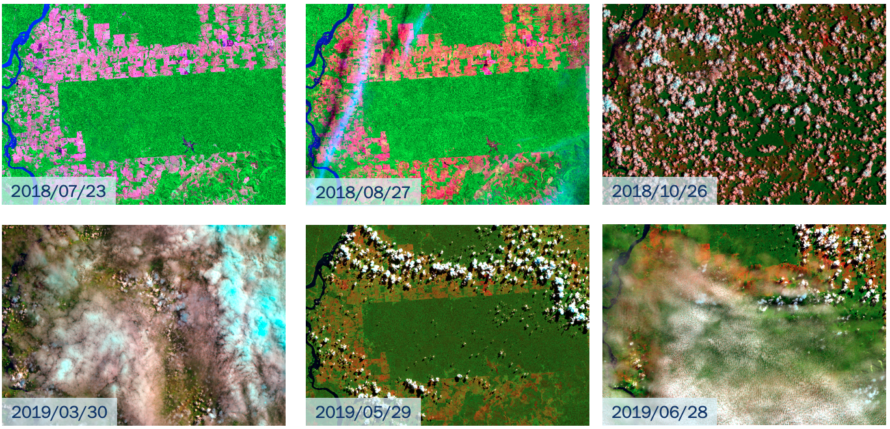

# Earth observation data cubes

```{r, include = FALSE}
source("common.R")
```

---

This chapter describes how to use Earth observation data cubes in SITS.

---

## Introduction

### Image data cubes as the basis for big Earth observation data analysis

Given the large sizes of the collections of Earth observation data available, most bthere is a clear trend to use cloud computing. In this configuration, cloud services archive large satellite-generated data sets and provide computing facilities to process them. Users can share big Earth observation databases and minimize data download. Investment in infrastructure is minimized, and sharing of data and software increases. 

To take full advantage of the cloud computing model, Earth observation data needs to be available to users as *data cubes*, whose aim is to organize satellite data for a given area in a consistent spatiotemporal arrangement. Generalizing [@Appel2019], we consider that a *data cube* should meet the following definition:

1. A data cube is a four-dimensional structure with dimensions x (longitude or easting), y (latitude or northing), time, and bands.
2. Its spatial dimensions refer to a single spatial reference system (SRS). Cells of a data cube have a constant spatial size with respect to the cube’s SRS.
3. The temporal dimension is composed of a set of continuous and equally-spaced intervals. 
4. For every combination of dimensions, a cell has a single value.

A data cube defines a regular partition of space-time. All cells of a data cube have the same spatiotemporal extent. The spatial resolution of each cell is the same in X and Y dimensions. All temporal intervals are the same. Each cell contains a valid set of measures. For each position in space, the data cube should provide a valid time series. For each time interval, the data cube should provide a valid 2D image (see Figure \@ref(fig:dcconcept)). 

Data cubes provide a useful abstraction for algorithms that extract information from big EO data sets. Machine learning and deep learning algorithms require the input data to be consistent. The dimensionality of the data used for training the model has to be the same as that of the data to be classified. There should be no gaps in the input data and no missing values are allowed. 

Currently, few cloud services support the above definition of data cubes. Cloud providers such as AWS and Microsoft organize their data as analysis-ready image collection. In the next section, we describe such collections and point out their differences to data cubes.

```{r dcconcept, echo = FALSE, out.width = "90%", out.height = "90%", fig.align="center", fig.cap="Conceptual view of data cubes (source: authors)"}
knitr::include_graphics("images/datacube_conception.png")
```

### Analysis-ready data image collections 

Data available in cloud services such as Amazon Web Service (AWS), Microsoft's Planetary Computer, and Digital Earth Africa (DE Africa) does not adhere to the definition of data cubes stated above. These data sets are better described as collections of analysis-ready data (ARD) which have been processed by space agencies to improve multidate comparability. Such processing includes conversion from radiance measures at the top of the atmosphere to reflectance measures from ground areas. Variations in sun incidence angles are also compensated. The image is usually reprocessed to a well-known cartographic projection. We define an *ARD image collections* as:

1. An ARD image collection is a set of files from a given sensor (or a combined set of sensors) that has been corrected to ensure comparability of measurements between different dates.
2. All images are reprojected to a cartographic projection following well-established standards.
3. Image collections are cropped into a tiling system.  
4. In general, the timelines of the images that are part of one tile are not regular. Also, these timelines are not the same as those associated to a different tile. 
5. ARD image collections do not guarantee that every pixel of an image has a valid value, since its images still contains cloudy or missing pixels. 

Figure \@ref(fig:imagesro) shows images of tile "20LKP" of the Sentinel-2 Level 2A collection available in AWS for different dates. Some of images have a significant number of clouds. The values of cloudy pixels should be replaced by valid values before being ingested into a data cube. 

```{r imagesro, echo = FALSE, out.width = "90%", out.height = "90%", fig.align="center", fig.cap="Sentinel-2 for tile 20LKP in different dates (source: authors)."}

```

A further point concerns the timeline of different tiles. Consider the neighboring Sentinel-2 tiles "20LLP" and "20LKP" for the period 2018-07-13 to 2019-07-28, as they are available in AWS. Tile 20LKP has 71 temporal instances and tile 20 LLP has 144 instances. To process large areas, all tiles have to be organized to follow the same timeline. Thus, users cannot rely on ARD image collections when working with large areas. Users that want to work on multiples tiles of an ARD image collection should use the `sits_regularize()` function to generate regularly spaced cubes in time from image collection. Please see the session "Regularizing data cubes" below. 

### Differences betwen Open Data and Requester-Pays Collections

There are two types of collections available in cloud providers. Some collections are available as "open data". In this case, users can access such data without payment. Some open data providers (e.g., Brazil Data Cube) require an access token which is free to obtain. A "requester-pays" collection requires users to cover cost of extracting data from the provider. Providers such as AWS have both open data and requester-pays collection.

### Data providers and collections supported by SITS

As of version 0.15.0, `sits` supports access to the following image collections:

1. AWS: Sentinel-2/2A level 2A collections, including "SENTINEL-S2-L2A-COGS" (open data) and "SENTINEL-S2-L2A" (non open data). 
2. Brazil Data Cube (BDC): Open data collections of Sentinel-2, Landsat-8 and CBERS-4 images.
3. Digital Earth Africa (DEAFRICA): Open data collection of Sentinel-2/2A and Landsat-8 for Africa.
4. USGS: Landsat-4/5/7/8 collections, which are not open data. 

The package also supports services that allow access to individual time series:

1. WTSS (Web Time Series Service), provided by the Brazil Data Cube
2. SATVEG, provided by the Center for Agricultural Informatics of Brazil's Agricultural Research Agency(EMBRAPA)

To find out which collections are supported by `sits`, use `sits_list_collections()`. 

```{r}
# list the AWS collections supported by sits
sits_list_collections(source = "AWS")
```
```{r}
# list the DEAFRICA collections supported by sits
sits_list_collections(source = "DEAFRICA")
```


## Accessing Data Cubes and Image Collections in SITS

<a href="https://www.kaggle.com/esensing/creating-data-cubes-in-sits" target="_blank">img src="https://kaggle.com/static/images/open-in-kaggle.svg"/></a>

To obtain information on cloud image collection, `sits` uses information provided by implementations of the STAC (SpatioTemporal Asset Catalogue) protocol. [STAC] (https://stacspec.org/) is a specification of geospatial information which has been adopted by many large image collection providers (e.g., AWS, Microsoft, USGS). A 'spatiotemporal asset' is any file that represents information about the earth captured in a certain space and time. To access STAC endpoints, `sits` uses the [rstac](http://github.com/brazil-data-cube/rstac) R package.

All access to data cubes is done using `sits_cube()`. Please note that most of the examples in this chapter require access keys to cloud repositories and as such are not executable directly. Users need to provide the appropriate access keys to run the examples.

## Creating a data cube: general view 

The `sits_cube()` function requires the following common parameters:

1. `source`: name of the provider from the list of providers suported by `sits`. See the next section for a description of the providers.
2. `collection`: a collection available in the provider and supported by `sits`. See the next section to learn how to get information on collections.
3. `url`: URL associated to the STAC endpoint of the provider. In most cases, `sits` has information about the default endpoint, so this parameter can be omitted. 
4. `tiles`: Most satellites, when organised as analysis-ready data, conform to a reference system that divides Earth into granules or tiles. By specifying one or more tiles, the user selects a region of interest. in practice, either `tiles` or `roi` should be specified. 
5. `roi`: a region of interest. Can be defined using: (a) a named vector ("lon_min", "lon_max", "lat_min", "lat_max") with lat/long values in WGS 84; (b) an *sf* object from the *sf* package, a data frame with feature attributes and feature geometries; or (c) a GeoJSON geometry (RFC 7946). When selecting images that compose a data cube based on a `roi`, sits does not crop them directly; the software selects the images that intersect with it. The information is used later by `sits_classify()`, when only the pixels inside the region will be processed.
6. `start_date`: the initial date for the temporal interval containing the time series of images.
7. `end_date`: the final date for the temporal interval containing the time series of images.

```{r, eval=FALSE}

new_cube <- sits_cube(
               # main parameters
               source = <a provider supported by sits>,
               collection = <a collection supported by the provider>,
               url   = <URL for the STAC endpoint of the data source>,
               tiles = <one of more tiles in the collection reference system>,
               bands = <bands used for processing>,
               roi   = <region of interest>,
               start_date = <initial date for the temporal interval>,
               end_date = <initial date for the temporal interval>
)

```

The output of the `sits_cube()` function is composed of metadata about the images that satisfy the requirements stated in its parameters (spatiotemporal extent, resolution, and area of interest). The `new_cube` object created in the above statement is a tibble that has the information required for further processing, but does not contain the actual data. 

The `sits_cube()` function has other parameters that are specific to certain types of cubes, as discussed below. 

### Accessing data cubes in Amazon Web Services 

In AWS, there are two types of collections: open-data and requester-pays data. Open data collections can be accessed worldwide without cost. Requester-pays collections require payment associated to an AWS account. Users with access to AWS EC2 virtual machines may select requester-pays collection for efficiency reasons, specially if their machines are in the same geographical region as the collection. Version 0.15.0 of `sits` supports collections "SENTINEL-S2-L2A" (requester-pays) and "SENTINEL-S2-L2A-COGS" (open-data). Both collections support all Sentinel-2/2A bands.  The bands in 10m resolution are "B02", "B03", "B04", and "B08". The  20m bands are "B05", "B06", "B07", B8A", "B8A", "B11", and "B12". Bands "B01" and "B09" are available at 60m resolution. 

To find out which AWS collections are supported by `sits`, use `sits_list_collections()`. 
```{r}
# list the AWS collections supported by sits
sits_list_collections(source = "AWS")
```

The example below shows how to access one tile of the "SENTINEL-S2-L2A-COGS" collection. Such access does not require AWS credentials, since the collection is open data.

```{r}
# create a data cube covering an area in the Brazilian Amazon
# Sentinel-2 images over the Rondonia region
s2_20LKP_cube <- sits_cube(
        source = "AWS",
        collection = "sentinel-s2-l2a-cogs",
        tiles = "20LKP",
        start_date = "2018-07-12",
        end_date = "2019-07-28",
        bands = c("B04", "B08", "B11", "CLOUD")
)
# show the data cube 
show_table(s2_20LKP_cube[,1:8])
```

The attributes of individual image files that are part of the data cube can be assessed by listing the `file_info` column of the tibble. This column contains a list that points to the file information tibble. Since the bands have different resolutions, one should use `sits_regularize()` (described below) to produce a regular cube. 

```{r}
# show the first 10 images of the cube
show_table(s2_20LKP_cube$file_info[[1]][1:10,])
```

To access Sentinel-2/2A level 2A files in collection "SENTINEL-S2-L2A" users  need to provide AWS credentials to access this collection, since it is not open data. These credentials are "AWS_ACCESS_KEY_ID" and "AWS_SECRET_ACCESS_KEY", which should be informed as environment variables, as shown below.

```{r, eval=FALSE}
Sys.setenv(
     "AWS_ACCESS_KEY_ID"     = <your_access_key>,
     "AWS_SECRET_ACCESS_KEY" = <your_secret_access_key>
)
```


In SITS version 0.15.0, users who do not want to use the `sits_regularize()` function and prefer to use AWS images directly can only create valid data cubes if the images belong to the same tile. However, we do not recommend such practice, since `sits_regularize()` produces more consistent data cubes. 


### Accessing the Brazil Data Cube

The [Brazil Data Cube](http://brazildatacube.org/) (BDC) is being developed by Brazil’s National Institute for Space Research (INPE). Its goal is to create multidimensional data cubes of analysis-ready data Brazil. The BDC uses three hierarchical grids based on the Albers Equal Area projection and SIRGAS 2000 datum. The three grids are generated taking -54 $^\circ$ longitude as the central reference and defining tiles of $6\times4$, $3\times2$ and $1.5\times1$ degrees. The large grid is composed by tiles of $672\times440$ km^2^ and is used for CBERS-4 AWFI collections at 64 meter resolution; each CBERS-4 AWFI tile contains images of $10,504\times6,865$ pixels. The medium grid is used for Landsat-8 OLI collections at 30 meter resolution; tiles have an extension of $336\times220$ km^2^ and each image has $11,204\times7,324$ pixels. The small grid covers $168\times110$ km^2^ and is used for Sentinel-2 MSI collections at 10m resolutions; each image has $16,806\times10,986$ pixels. The data cubes in the BDC are regularly spaced in time and cloud-corrected. 

```{r, echo = FALSE, out.width = "50%", out.height = "50%", fig.align="center", fig.cap="Hierarchical BDC tiling system showing overlayed on Brazilian Biomes (a), illustrating that one large tile (b) contains four medium tiles (c) and that medium tile contains four small tiles"}

knitr::include_graphics("images/bdc_grid.png")
```

To access the Brazil Data Cube, users need to provide their credentials using environmental variables.
```{r,eval = FALSE}
Sys.setenv(
    "BDC_ACCESS_KEY" = <your_bdc_access_key>
)
```

Creating a data cube using the BDC is similar to what is required for AWS. The user 
defines an image collection, a spatiotemporal extent, bands, and optionally a bounding box.  In the example below, the data cube is defined as one tile ("022024") of "CB4_64_16D_STK-1" collection which holds CBERS AWFI images at 16 days resolution. Other collections include "LC8_30_16D_STK-1" (Landsat OLI images at 16 days),  "S2-SEN2COR_10_16D_STK-1" (Sentinel-2 MSI images at 16 days with 10 meter resolution) and "MOD13Q1-6" (MODIS MOD13SQ1 product, collection 6).

```{r, eval = FALSE}
cbers_tile <- sits_cube(
    source = "BDC",
    collection = "CB4_64_16D_STK-1",
    bands = c("NDVI", "EVI"),
    tiles = "022024",
    start_date = "2018-09-01",
    end_date = "2019-08-28"
)
```

### Accessing Digital Earth Africa 

Digital Earth Africa is a cloud service that provides Earth Observation data . DE Africa is leveraging international Earth Observation (EO) data and science to produce new information and services that benefit African countries.

To find out which DEAFRICA collections are supported by `sits`, use `sits_list_collections()`. 
```{r}
# list the AWS collections supported by sits
sits_list_collections(source = "DEAFRICA")
```
To create a cube based on DEAFRICA collections, users should specify the image collection and the desired bands. There is a difference from the specification of data cubes using DEAFRICA data and those from AWS and BDC. Digital Earth Africa does not fully implement the concept of tiles. Thus, users need to specify their region of interest using the `roi` parameter. The `roi` parameter allows a selection of an area of interest, either using a named vector ("lon_min", "lat_min", "lon_max", "lat_max") with values in WGS 84, an `sf` object from the `sf` package, or a GeoJSON geometry (RFC 7946). This parameter does not crop a region, but only selects the images that intersect with it.

```{r}
dea_cube <- sits_cube(source = "DEAFRICA",
                  collection = "s2_l2a",
                  bands = c("B01", "B04", "B05"),
                  roi = c(lon_min = 17.379,
                          lat_min = 1.1573,
                          lon_max = 17.410,
                          lat_max = 1.1910),
                  start_date = "2019-01-01",
                  end_date = "2019-10-28"
)
```

### Defining a data cube using files

In some cases, users have downloaded files from image collections and have them available in their computer or in a local network. As *sits* does not have access to STAC information that describe the files, they should be organized and named to allow SITS to create a data cube. 

All files should be in the same directory and have the same spatial resolution and projection. Each file should contain a single image band for a single date. Since raster files in popular formats (e.g., GeoTiff and JPEG 2000) do not include temporal and band information, each file name needs to include date and band. Information on the tile reference system should be provided. Also, When building data cubes from images stored in a local machine, users need to provide information about the original source from with the data was downloaded. The reason to included such information is because there are no standards for the metadata used to process an image.

When working with local cubes, the following parameters should be provided to the `sits_cube()` function:

- `source` - name of the original data provider (possible values are "BDC" (Brazil Data Cube), "AWS" (Amazon Web Services), USGS (USGS Landsat), "MS-PC" (Microsoft Planetary Computer) or "DEAFRICA" (Digital Earth Africa)). 
- `collection` - name of the collection from where the data was extracted. Please use function `sits_list_collections()` to see which collections are supported. 
- `data_dir` - directory where the image data is located;
- `parse_info` - information to parse the file names and extract the information on the tile, date and band associated with each individual file. It is assumed that file names contain image descriptors separated by a delimiter (usually "_"). For example, `CBERS-4_AWFI_022024_B13_2018-02-02.tif` and `SENTINEL-2_MSI_L20KP_20m_B08_2021_03_29.jp2` are valid file names for sits. The `parse_info` parameter is a list of strings indicating at which position the names of `tile`, `date` and `band` are to be found. In the two file names above, the parsing info is respectively `c("X1", "X2", "tile", band", "date")` and `c("X1", "X2", "tile", "X3", "band", "date")`;
- `delim` - separator character between descriptions in the file name (default is "_").

The following example shows how to define a data cube based on local files available as part of the *sits* package.

```{r, eval = FALSE}
library(sits)
# Create a cube based on a stack of CBERS data
data_dir <- system.file("extdata/CBERS", package = "sitsdata")

# files are named using the convention 
# "CB4_64_16D_STK_022024_2018-08-29_2018-09-13_EVI.tif"
cbers_cube <- sits_cube(
      source = "BDC",
      collection = "MOD13Q1-6",
      data_dir = data_dir,
      delim = "_",
      parse_info = c("X1", "X2", "X3", "X4", "tile", "date", "X5", "band")
)
# show the timeline of the cube
sits_timeline(cbers_cube)
# show the bands of the cube
sits_bands(cbers_cube)
# plot the band B16 in the first time instance
plot(cbers_cube, band = "NDVI", time = 1)
```


## Regularizing data cubes 

Analysis-ready data (ARD) collections available in AWS, USGS and DE Africa do not have consistent timelines. In general, images in neighboring tiles have different timelines. This is a problem when classifying large areas. In this case, users may want to produce data cubes with regular time intervals.  For example, a user may want to define the best Sentinel-2 pixel in a one-month period. This can be done in *sits* by the function `sits_regularize()`, which uses the package *gdalcubes* [@Appel2019]. For details in gdalcubes, please see [https://github.com/appelmar/gdalcubes](https://github.com/appelmar/gdalcubes).

```{r, eval = FALSE, echo = TRUE}
# creating a data cube in AWS
s2_cube <- sits_cube(source = "AWS",
                     collection = "sentinel-s2-l2a-cogs",
                     tiles = c("20LKP", "20LLP"),
                     start_date = as.Date("2018-07-01"),
                     end_date = as.Date("2018-08-31"),
                     bands = c("B08", "B11", "CLOUD"),
)
# list the timeline of the AWS S2 cube (there are 12 images)
sits_timeline(s2_cube)
# regularize the cube to one month intervals
reg_cube <- sits_regularize(
          cube       = s2_cube,
          output_dir = tempdir(),
          res = 60,
          period     = "P15D",
          agg_method = "median",
          cloud_mask = TRUE,
          multicores = 4
          
)
```


In the above example, the user has selected the `s2_cube` object defined using AWS (see example above). As described earlier in this chapter, because of the way ARD image collections are built, the timelines of tiles "20LLP" and "20LKP" associated with this cube are different. The `sits_regularize()` function builds a new data cube, with the same temporal extent as the `s2_cube` but with the same timeline. In this function, the `period` parameter controls the temporal interval between two images. Values should abide by the ISO8601 time period specification, which states that time interval should be defined as "P[n]Y[n]M[n]D", where Y stands for "years", "M" for months and "D" for days. Thus, "P1M" stands for a one-month period, "P15D" for a fifteen-day period. 

When joining different images to get the best image for a period, `sits_regularize()` uses an aggregation method, defined by the parameter `agg_method`. It specifies how individual values of different pixels should be combined. The default is `median`, which select the most frequent value for the pixel during the desired interval. For more details, see `?sits_regularize`.

