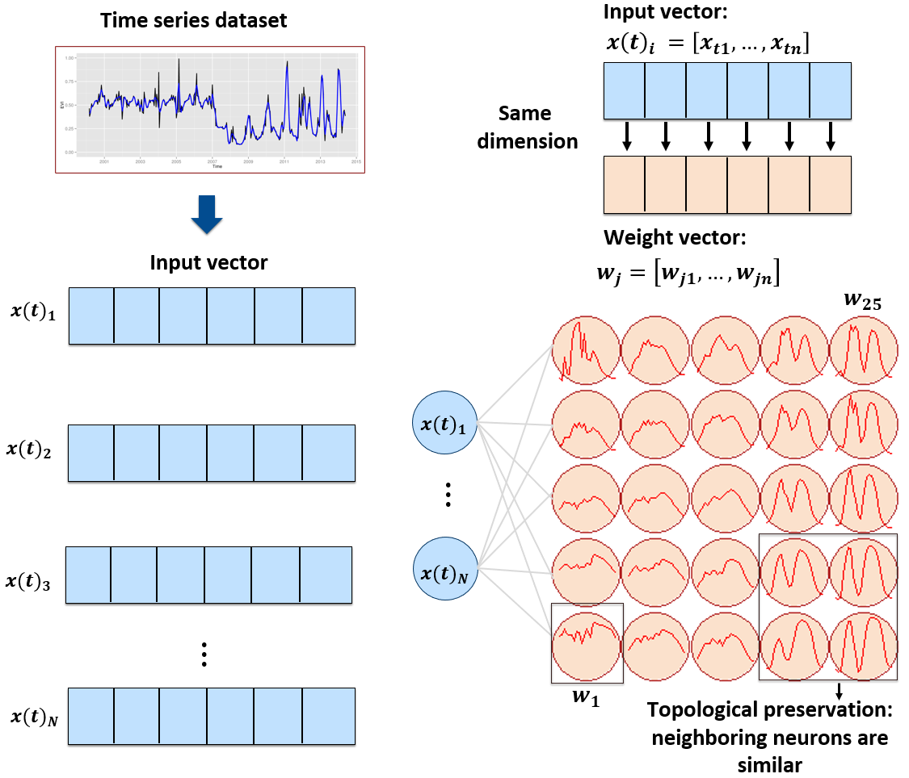
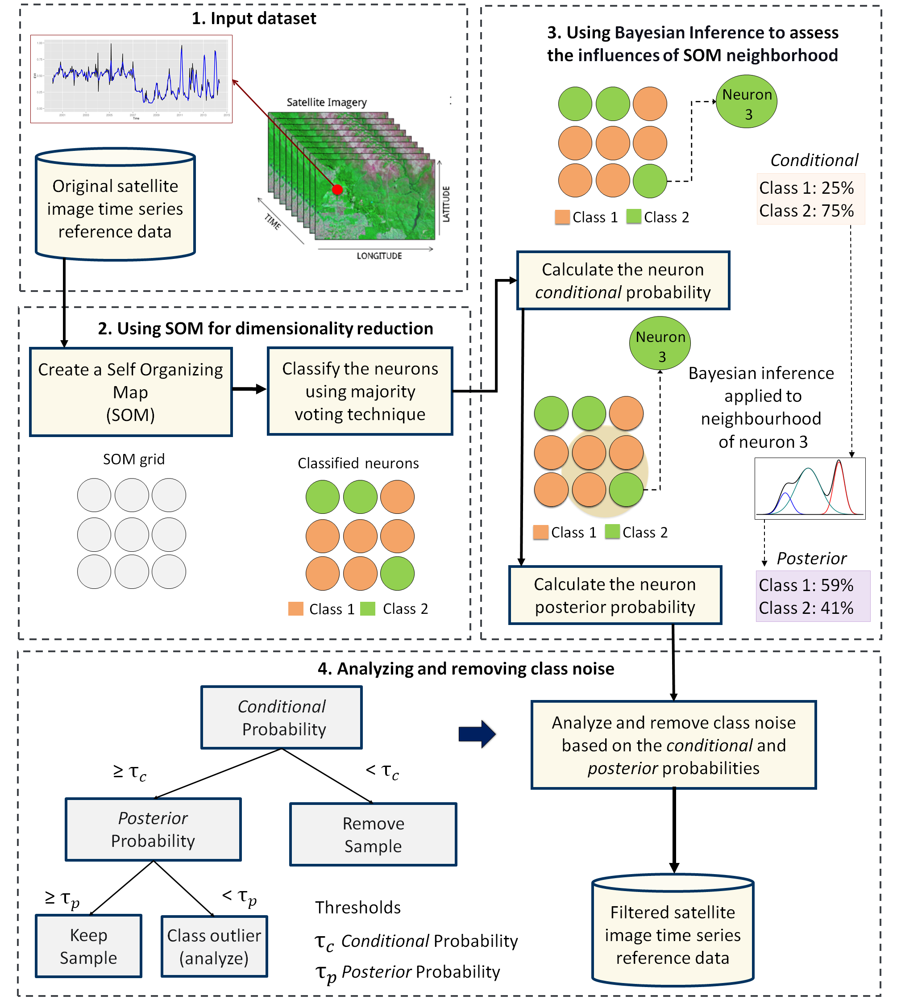

# Improving the Quality of Training Samples

```{r, include = FALSE}
source("common.R")
```

## Introduction{-}

One of the key challenges when using samples to train machine learning classification models is assessing their quality. Experience with machine learning methods has shown that the limiting factor in obtaining good results is the number and quality of training samples. Large and accurate data sets are better, no matter the algorithm used [@Maxwell2018]; noisy training samples can have a negative effect on classification performance [@Frenay2014]. Therefore, it is useful to apply pre-processing methods to improve the quality of the samples and to remove those that might have been wrongly labeled or that have low discriminatory power. 

One needs to distinguish between wrongly labelled samples and differences that result from natural variability of class signatures. When training data is collected over a large geographic region, natural variability of vegetation phenology leads to different patterns being assigned to the same label. A related issue is the limitation of crisp boundaries to describe the natural world. Class definitions use idealized descriptions (e.g., "a savanna woodland has tree cover of 50% to 90% ranging from 8 to 15 meters in height"). In practice, the boundaries between classes are fuzzy and sometimes overlap, making it hard to distinguish between them. Samples quality assessment methods should provide users with means of identifying these different situations. 

The package provides support for two clustering methods to test sample quality: (a) Agglomerative Hierarchical Clustering (AHC); (b) Self-organizing Maps (SOM). The two methods have different computational complexities. As discussed below, AHC results are somewhat easier to interpret than those of SOM. However, AHC has a computational complexity of $\mathcal{O}(n^2)$ given the number of time series $n$, whereas SOM complexity is linear with respect to n. Therefore, for large data sets, AHC requires an substantial amount of memory and running time; in these cases, SOM is recommended.

## Hierachical clustering for sample quality control{-}

Agglomerative hierarchical clustering (AHC) computes the dissimilarity between any two elements from a data set. Depending on the distance functions and linkage criteria, the algorithm decides which two clusters are merged at each iteration. This approach is useful for exploring data samples due to its visualization power and ease of use [@Keogh2003]. In `sits`, AHC is implemented using `sits_cluster_dendro()`.

```{r dendrogram, tidy = "styler", cache=TRUE, fig.align="center", out.width="90%", fig.cap="Example of hierarchical clustering for a two class set of time series", message=FALSE}
# take a set of patterns for 2 classes
# create a dendrogram, plot, and get the optimal cluster based on ARI index
clusters <- sits_cluster_dendro(
    samples = cerrado_2classes, 
    bands = c("NDVI", "EVI"),
    dist_method = "dtw_basic",
    linkage =  "ward.D2"
)
```

The `sits_cluster_dendro()` function has one mandatory parameter (`samples`), where users should provide the name of the R object containing the data samples to be evaluated. Optional parameters include `bands`, `dist_method` and `linkage`. The `dist_method` parameter specifies how to calculate the distance between two time series. We recommend a metric that uses dynamic time warping (DTW)[@Petitjean2012], as DTW is reliable method for measuring differences between satellite image time series [@Maus2016]. The options available in `sits` are based on those provided by package `dtwclust`, which include `dtw_basic`, `dtw_lb`, and `dtw2`. Please check `?dtwclust::tsclust` for more information on DTW distances.

The `linkage` parameter defines the metric used for computing the distance between clusters. The recommended linkage criteria are: `complete` or `ward.D2`. Complete-linkage prioritizes the within-cluster dissimilarities, producing clusters with shorter distance samples. Complete-linkage clustering can be sensitive to outliers, which can increase the resulting intracluster data variance. As an alternative, Ward proposes criteria to minimize the data variance by means of either *sum-of-squares* or *sum-of-squares-error* [@Ward1963]. Ward's intuition is that clusters of multivariate observations, such as time series, should be approximately elliptical in shape [@Hennig2015].

After creating a dendrogram, an important question emerges: *where to cut the dendrogram?* The answer depends on what are the purposes of the cluster analysis, which needs to balance two objectives: get clusters as large as possible, and get clusters as homogeneous as possible with respect to their known classes. The `sits_cluster_dendro()` function computes the *adjusted rand index* (ARI) for a series of the different number of generated clusters. This function returns the height where the cut of the dendrogram maximizes the index. For more detaily, please see [@Rand1971].

In the example above after calculating the dendrogram, the ARI index indicates that six (6) clusters are the best possible arrangement. However, these clusters may still contain a mixed composition of samples of different classes.

The result of the `sits_cluster` operation is a `sits_tibble` with one additional column, called "cluster". The function `sits_cluster_frequency()` provides information on the composition of each cluster,

```{r}
# show clusters samples frequency
sits_cluster_frequency(clusters)
```

The result shows that each cluster have a predominance of either "Cerrado" or "Pasture" class with the exception of cluster $3$. The table how the samples are distributed across the clusters and helps identify two kinds of problems. The first is relative to small amounts of samples of one class in clusters dominated by another (*e.g.* clusters $1$, $2$, $4$, $5$, and $6$), while the second is relative to those samples in non-dominated clusters (*e.g.* cluster $3$). These confusions can be an indication of samples with poor quality, and inadequacy of selected parameters for cluster analysis, or even a natural confusion due to the inherent variability of the land classes.

It is possible to remove clusters with mixed classes using the `dplyr` package. In the example above, removing cluster $3$ can be done using the `dplyr::filter()` function. The resulting clusters still contained mixed labels, possibly resulting from outliers. In this case, users may want to remove the outliers and leave only the most frequent class. To do this, one can use `sits_cluster_clean()`, which removes all minority samples, as shown below.

```{r}
# remove cluster 3 from the samples
clusters_new <- dplyr::filter(clusters, cluster != 3)
# clear clusters, leaving only the majority class in each cluster
clean <- sits_cluster_clean(clusters_new)
# show clusters samples frequency
sits_cluster_frequency(clean)
```


After cleaning the samples using dendrograms, users are expected to have a better set of samples which will provide more accurate estimates of land classification.

## Using self-organizing maps for sample quality control{-}

<a href="https://www.kaggle.com/esensing/using-som-for-sample-quality-control-in-sits" target="_blank"></a>

As an alternative for hierarchical clustering for quality control of training samples, SITS provides a clustering technique based on self-organizing maps (SOM). SOM is a dimensionality reduction technique [@Kohonen1990], where high-dimensional data is mapped into a two dimensional map, keeping the topological relations between data patterns. As the shown in the Figure below, the SOM 2D map is composed by units called \emph{neurons}. Each neuron has a weight vector, with the same dimension as the training samples. At the start, neurons are assigned a small random value and then trained by competitive learning. The algorithm computes the distances of each member of the training set to all neurons and finds the neuron closest to the input, called the best matching unit.

```{r, out.width = "90%", out.height = "90%", echo = FALSE, fig.align="center", fig.cap="SOM 2D map creation (source: Santos et al.(2021)"}


```

The input data for quality assessment is a set of training samples, which are high-dimensional data sets such as a time series with 25 instances of 4 spectral bands has 100 dimensions. When projecting a high-dimensional data set into a 2D SOM map, the units of the map (called *neurons*) compete for each sample. Each time series will be mapped to one of the neurons. Since the number of neurons is smaller than the number of classes, each neuron will be associated to many time series. The resulting 2D map will be a set of clusters. Given that SOM preserves the topological structure of neighborhoods in multiple dimensions, clusters that contain training samples of a given class will usually be neighbors in 2D space. The neighbors of each neuron of a SOM map provide information on intraclass and interclass variability which is used to detect noisy samples. The methodology of using SOM for sample quality assessment (see Figure below) is discussed in detail in the reference paper [@Santos2021a].

```{r, out.width = "90%", out.height = "90%", echo = FALSE, fig.align="center", fig.cap="Using SOM for class noise reduction (source: Santos et al.(2021)"}


```

As an example, we take a time series dataset from the Cerrado region of Brazil, the second largest biome in South America with an area of more than 2 million km2. This set ranges from 2000 to 2017 and includes 50,160 land use and cover samples divided into 12 classes("Dense_Woodland", "Dunes", "Fallow_Cotton", "Millet_Cotton", "Pasture", "Rocky_Savanna", "Savanna", "Savanna_Parkland", "Silviculture", "Soy_Corn", "Soy_Cotton", "Soy_Fallow"). Each time series covers 12 months (23 data points) from MOD13Q1 product, and has 4 bands ("EVI", "NDVI", "MIR", and "NIR"). We use bands "NDVI" and "EVI" for faster processing.

```{r, message = FALSE, tidy = "styler", warning = FALSE}
# take only the NDVI and EVI bands
samples_cerrado_mod13q1_2bands <- sits_select(
    data = samples_cerrado_mod13q1, 
    bands = c("NDVI", "EVI")
)
# show the summary of the samples
sits_labels_summary(
  data = samples_cerrado_mod13q1_2bands
)
```

### SOM-based quality assessment part 1: creating the SOM map{-}

To run the SOM-based quality assessment, the first step is to run `sits_som_map()` which uses the `kohonen` R package [@Wehrens2018] to compute a SOM grid. Each sample is assigned to a neuron, and neurons are placed in the grid based on similarity. This function has six main parameters. In `data`, the user should provide the name of the R object containing the samples. The size of the SOM grid is controlled by `grid_xdim` and `grid_ydim`. The starting learning rate is set using `alpha`; this learning rate decreases during the interactions. The distance metric is controlled by `distance`; options available currently are "sumofsquares" and "euclidean". The number of iterations is set by `rlen`. For more details on the implementation, please also consult `?kohonen::supersom`.

```{r, tidy = "styler", message = FALSE, warning = FALSE}
# clustering time series using SOM
som_cluster <- sits_som_map(
    data = samples_cerrado_mod13q1_2bands,
    grid_xdim = 15,
    grid_ydim = 15,
    alpha = 1.0,
    distance = "euclidean",
    rlen = 20
)
```

The output of the `sits_som_map()` is a list with 3 elements: (a) the original set of time series with two additional columns for each time series: `id_sample` (the original id of each sample) and `id_neuron` (the id of the neuron to which it belongs); (b) a tibble with information on the neurons. For each neuron, it gives the prior and posterior probabilities of all labels which occur in the samples assigned to it; and (c) the SOM grid. To plot the SOM grid, use `plot()`. The neurons are labelled using majority voting.

```{r, message=FALSE, warning=FALSE, fig.cap = "SOM map for the Cerrado samples"}
plot(som_cluster)
```

The SOM grid shows that most classes are associated to neurons close to each other.  The are exceptions. Some "Pasture" neurons are far from the main cluster, because  the transition between areas of open savanna and pasture is not always well defined and depends on climate and latitude. Also, the neurons associated to "Soy_Fallow" are dispersed in the map; this indicates possible problems in distinguising this class from the other agricultural classes. Thus, the SOM grid provides a measures of  sample quality.

### SOM-based quality assessment part 2: assessing confusion between labels{-}

The second step in SOM-based quality assessment is understanding the confusion between labels. The function `sits_som_evaluate_cluster()` groups neurons by their majority label and produces a tibble. For each label, the tibble show the percentage of samples with a different label that have been mapped to a neuron whose majority is that label.
\newpage

```{r}
# produce a tibble with a summary of the mixed labels
som_eval <- sits_som_evaluate_cluster(som_cluster)
# show the result
som_eval 
```

As seen above, almost all labels are associated to clusters where there are some samples with a different label. Such confusion between labels arises because visual labeling of samples is subjective and can be biased. In many cases, interpreters use high-resolution data to identify samples. However, the actual images to be classified are captured by satellites with lower resolution. In our case study, a MOD13Q1 image has pixels with 250 x 250 meter resolution. Therefore, the correspondence between labelled locations in high-resolution images and mid to low-resolution images is not direct. Therefore, the SOM-based analysis is useful to select only homogeneous pixels.

The confusion by class can be visualised in a bar plot using `plot()`, as shown below. The bar plot shows some confusion between the classes associated to the natural vegetation typical of the Brazilian Cerrado ("Savanna", "Savanna_Parkland", "Rocky_Savanna"). This mixture is due to the large variability of the natural vegetation of the Cerrado biome, which makes it difficult to draw sharp boundaries between each label. Some confusion is also visible between the agricultural classes. The "Millet_Cotton" class is a particularly difficult one, since many of the samples assigned to this class are confused with "Soy_Cotton" and "Fallow_Cotton". 

```{r, out.width = "90%", fig.align="center", fig.cap="Confusion between classes as measured by SOM."}
# plot the confusion between clusters
plot(som_eval)
```

### SOM-based quality assessment part 3: using probabilities to detect noisy samples{-}

The third step in the quality assessment uses the discrete probability distribution associated to each neuron, which is included in the `labelled_neurons` tibble produced by `sits_som_map()`. More homogeneous neurons (those with a single class of high probability) are assumed to be composed of good quality samples. Heterogeneous neurons (those with two or more classes with significant probability) are likely to contain noisy samples. The algorithm computes two values for each sample:

- *prior probability*: the probability that the label assigned to the sample is correct, considering only the samples contained in the same neuron. For example, if a neuron has 20 samples, of which 15 are labeled as "Pasture" and 5 as "Forest", all samples labeled "Forest" are assigned a prior probability of 25%. This is an indication that the "Forest" samples in this neuron may not be of good quality.
- *posterior probability*: the probability that the label assigned to the sample is correct, considering the neighboring neurons. Take the case of the above-mentioned neuron whose samples labeled "Pasture" have a prior probability of 75%. *What happens if all the neighboring samples have "Forest" as a majority label?* To answer this question, we use Bayesian inference to estimate if these samples are noisy based on the neighboring neurons [@Santos2021].

To identify noisy samples, we take the result of the `sits_som_map()` function as the first argument to the function `sits_som_clean_samples()`. This function finds out which samples are noisy, those that are clean, and some that need to be further examined by the user. It requires the `prior_threshold` and `posterior_threshold` parameters according to the following rules:

-   If the prior probability of a sample is less than `prior_threshold`, the sample is assumed to be noisy and tagged as "remove";
-   If the prior probability is greater or equal to `prior_threshold` and the posterior probability calculated by Bayesian inference is greater or equal to `posterior_threshold`, the sample is assumed not to be noisy and thus is tagged as "clean";
-   If the prior probability is greater or equal to `prior_threshold` and the posterior probability is less than `posterior_threshold`, we have a situation the sample is part of the majority level of those assigned to its neuron, but its label is not consistent with most of its neighbors. This is an anomalous condition and is tagged as "analyze". Users are encouraged to inspect such samples to find out whether they are in fact noisy or not.

The default value for both `prior_threshold` and `posterior_threshold` is 60%. The `sits_som_clean_samples()` has an additional parameter (`keep`) which indicates which samples should be kept in the set based on their prior and posterior probabilities of being noisy and the assigned label. The default value for `keep` is `c("clean", "analyze")`. As a result of the cleaning, about 900 samples have been considered to be noisy and thus removed.

```{r, tidy = "styler", message = FALSE, warning = FALSE}
new_samples <- sits_som_clean_samples(
    som_map = som_cluster, 
    prior_threshold = 0.6,
    posterior_threshold = 0.6,
    keep = c("clean", "analyze")
)
# print the new sample distribution
sits_labels_summary(new_samples)
```

Comparing the original and the new sample set, we observe that all samples of the class which had the highest confusion with other classes ("Millet_Cotton") have been removed. Most samples of class "Silviculture" (planted forests) have also been removed from the set, since in the SOM map they have been confused with natural forests and woodlands. Further analysis includes calculating the SOM map and confusion matrix for the new set of samples, as shown in the following example. As expected, the new confusion map shows a significant improvement over the previous one. This result should be interpreted carefully, since it may be due to different effects. The most direct interpretation is that "Millet_Cotton" and "Silviculture" cannot be easily separated from the other classes, given the current attributes (a time series of "NDVI" and "EVI" indices from MODIS images). In such situations, users should consider improving the number of samples from the less represented classes, including more MODIS bands, or working with higher resolution satellites. In general, results of the SOM method should be interpreted based on the users' understanding of the ecosystems and agricultural practices of the study region. 

```{r, tidy = "styler", message = FALSE, warning = FALSE}
# evaluate the misture in the SOM clusters of new samples
new_cluster <- sits_som_map(
   data = new_samples,
   grid_xdim = 15,
   grid_ydim = 15,
   alpha = 1.0,
   distance = "euclidean",
   rlen = 20
)
```

```{r, out.width="90%", fig.align="center", fig.cap="Cluster confusion plot for samples cleaned by SOM"}
new_cluster_mixture <- sits_som_evaluate_cluster(new_cluster)
# plot the mixture information.
plot(new_cluster_mixture)
```

A further comparison between the original and clean samples is to run a 5-fold validation on the original and on the cleaned sample sets using `sits_kfold_validate()` and a random forest model. As the results show, the SOM procedure improves the validation results from 95% to 99%. Again, this improvement should not be interpreted as a better fit for the final map accuracy. A 5-fold validation procedure only measures how well the machine learning model fits the samples; it is not an accuracy assessment of classification results. For more details on accuracy measures, please see chapter on "Validation and Accuracy Measures".

```{r, tidy = "styler", message = FALSE, warning = FALSE}
# run a k-fold validation
assess_orig <- sits_kfold_validate(
    samples = samples_cerrado_mod13q1_2bands, 
    folds = 5,
    ml_method = sits_rfor()
)
# print summary 
sits_accuracy_summary(assess_orig)
```

```{r, tidy = "styler", message = FALSE, warning = FALSE}
assess_new <- sits_kfold_validate(
    samples = new_samples,
    folds = 5,
    ml_method = sits_rfor()
)
# print summary 
sits_accuracy_summary(assess_new)
```

The SOM-based analysis discards samples which can be confused with samples of other classes. After removing noisy samples or uncertain classes, the data set obtains a better validation score since there is less confusion between classes. Users should analyse the results with care. Not all discarded samples are low quality ones. Confusion between samples of different classes can result from inconsistent labeling or from the lack of capacity of satellite data to distinguish between chosen classes. When many samples are discarded, as in the current example, it is advisable to revise the whole classification schema. The aim of selecting training data should always be to match the reality in the ground to the power  of remote sensing data to identify differences. No analysis procedure can replace actual user experience and knowledge of the study region. 

## Reducing sample imbalance{-} 

Many training samples for Earth observation data analysis are imbalanced. This situation arises when the number of labels associated to each of the classes have a large difference in size. When dealing with heterogeneous landscapes with both natural and anthropic land covers, it is inevitable that some classes will be more prevalent than others. One example is the Cerrado data set used in this chapter (see above), where the three most frequent classes ("Dense Woodland", "Savanna" and "Pasture") include 53% of all samples, while the three least frequent classes ("Millet-Cotton", "Silviculture", and "Dunes") together comprise only 2.5% of the data set. Sample imbalance is an undesirable property of a training data set. Machine learning classification algorithms tend to be more accurate for classes with many samples and less accurate for the other classes. Reducing sample imbalance can have a positive effect on classification accuracy.  Unbalanced data sets have a negative effect on classification performance of traditional classification algorithms[@Johnson2019]. 

The function `sits_reduce_imbalance()` deals with class imbalance; it oversamples minority classes and undersamples majority ones. Oversampling requires generation of synthetic samples. The package uses the SMOTE method [@Chawla2002] that estimates new samples by considering the cluster formed by the nearest neighbors of each minority class. The SMOTE method work as follows: *"Take the difference between the feature vector (sample) under consideration and its nearest neighbor. Multiply this difference by a random number between 0 and 1, and add it to the feature vector under consideration. This causes the selection of a random point along the line segment between two specific features"*[@Chawla2002].

To perform undersampling for the majority classes, `sits_reduce_imbalance()` builds a SOM map, based on the required number of samples to be selected. Each dimension of the SOM is set to `ceiling(sqrt(new_number_samples/4))` so as to allow a reasonable number of neurons to group similar samples. After calculating the SOM map, the algorithm extracts four samples per neuron to generate a set of samples that approximates the variation that is present in the original samples. 

The `sits_reduce_imbalance()` algorithm has two parameters: `n_samples_over` and `n_samples_under`. The first parameter ensures that all classes with samples less than its value are oversampled. The second parameter  controls undersampling; all classes with more samples than its value are undersampled. The following example shows the use of `sits_reduce_imbalance()` in the Cerrado data set used in this chapter. We generate a balanced data set where all classes have between 1000 and 1500 samples. The method generates synthetic samples for clases with less than 1000 samples, and uses the SOM map to reduce classes with many samples. We then show the new label distribution. We use `sits_som_evaluate_cluster()` to estimate the confusion between classes of the balanced data set.

```{r, tidy = "styler"}
# reducing imbalances in the Cerrado data set
# no class should have less than 1000 samples
# no class should have more than 1500 samples
balanced_samples <- sits_reduce_imbalance(
    samples = samples_cerrado_mod13q1_2bands,
    n_samples_over = 1000,
    n_samples_under = 1500,
    multicores = 4
)
# print the balanced samples
# some classes have more than 1500 samples due to the SOM map
# each class has betwen 10% and 6% of the full set
sits_labels_summary(balanced_samples)
```

```{r, tidy = "styler", message = FALSE, warning = FALSE}
# clustering time series using SOM
som_cluster_bal <- sits_som_map(
    data = balanced_samples,
    grid_xdim = 10,
    grid_ydim = 10,
    alpha = 1.0,
    distance = "euclidean",
    rlen = 20
)
```


```{r}
# produce a tibble with a summary of the mixed labels
som_eval <- sits_som_evaluate_cluster(som_cluster_bal)
```

```{r, fig.align="center", out.width="90%", fig.cap="Confusion by cluster for the balanced data set"}
# show the result
plot(som_eval) 
```

As shown in the Figure, the balanced data set shows less confusion per class than the unbalanced one. In this case, many of the classes which were confused with other in the original confusion map are now better represented. Reducing class imbalance should be tried as an alternative to reducing the number of samples of the classes using SOM. In general, users should try to balance their training data for better performance. 

## Conclusion{-}

Machine learning methods are now established as a useful technique for remote sensing image analysis. Despite the well-known fact that the quality of the training data is a key factor in the accuracy of the resulting maps, the literature on methods for detecting and removing class noise in SITS training sets is limited. To contribute to solving this challenge, `sits` provides three methods for training sample improvements. We recommend the use of both imbalance reducing and SOM-based algorithms for large data sets. The SOM-based method identifies potential mislabeled samples and outliers that are flagged to further investigation. The results demonstrate the positive impact on the overall classification accuracy. 

We recommend that users dedicate an appropriate time for defining their classification schema. The complexity and diversity of our planet defies simple class names with hard boundaries. Because of representational and data handling issues, all classification systems will have a limited number of categories, which will fail to properly describe the nuances of the planet's landscapes. All representation systems are thus limited and application-dependent. As stated by [@Janowicz2012]: *"geographical concepts are situated and context-dependent, can be described from different, equally valid, points of view, and ontological commitments are arbitrary to a large extent"*. The availability of big data and satellite image time series is a further challenge. In principle, image time series can capture more subtle changes for land classification. In practice, experts need to conceive classification systems and training data collection by understanding how time series information relate to actual land change. Methods for quality analysis such as those presented in this chapter cannot replace actual users understanding and informed choices. 
