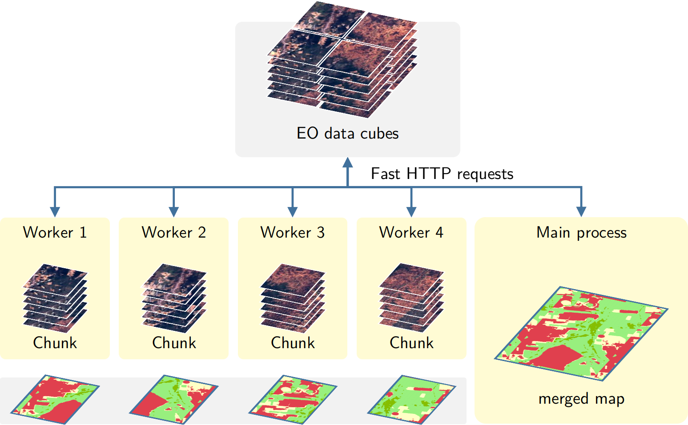

```{r, include = FALSE}
source("common.R")
dir.create("./tempdir/chp8")
```

# Classification of Images in Data Cubes using Satellite Image Time Series{-}


<a href="https://www.kaggle.com/esensing/raster-classification-in-sits" target="_blank"></a>

In this chapter, we discuss how to classify data cubes by providing a step-by-step example. We selected a study area located in the Bahia state, Brazil, between the Cerrado and Caatinga biomes. This region is known for the expansion of agriculture and livestock, which has been happening over the last few years in an intensive way. This data set has been used in the paper "Earth Observation Data Cubes for Brazil: Requirements, Methodology and Products" [@Ferreira2020a]. The data is composed of 23 EVI and NDVI CBERS-4 AWFI images for the period 2018-08-29 to 2019-08-13, covering the agricultural year in the Brazilian Cerrado near the city of Barreiras (Bahia) and available in the `sitsdata` package. 

## Training the classification model{-}

We first retrieve the training data set `samples_cerrado_cbers`, also available in the package `sitsdata`, and show its contents. The training data is composed of 922 samples, with land classes `Cerrado`, `Cerradao` (Dense Woodlands), `Cropland`, and `Pasture`. 

```{r, tidy = "styler"}
library(sitsdata)
# obtain the samples 
data("samples_cerrado_cbers")
# show the contents of the samples
sits_labels_summary(samples_cerrado_cbers)
```
The next step is to train a LighTAE model, using the `adamw` optimizer and a learning rate of 0.001. Since the images only have the `NDVI` and `EVI` bands, we select these bands from the training data.

```{r, tidy = "styler", out.width = "70%", fig.align="center", fig.cap="Training evolution of LightTAE model."}
# use only the NDVI and EVI bands
samples_cerrado_ndvi_evi <- sits_select(samples_cerrado_cbers, 
                                        bands = c("NDVI", "EVI"))

# train model using LightTAE algorithm
ltae_model <- sits_train(
    samples = samples_cerrado_ndvi_evi, 
    ml_method = sits_lighttae(
        opt_hparams = list(lr = 0.001)
        )
)
# plot the evolution of the model
plot(ltae_model)
```

## Building the data cube{-}

We now build a data cube from the NDVI and EVI CBERS-4 images available in the package `sitsdata`. These images were downloaded from the Brazil Data Cube (`BDC`) and come from `CB4_64_16D_STK-1` collection, which contains CBERS-4 images from the AWFI sensor at 64 meter resolution. The image files follow the pattern `CB4_64_16D_STK_022024_2018-08-29_2018-09-13_EVI.tif`. As explained in the "Earth observation data cubes" chapter, we need to inform `sits` how to parse these file names to obtain tile, date and band information. 


```{r, tidy = "styler", out.width = "70%", fig.align="center", fig.cap="Color composite image of first date of the cube"}

# files are available in a local directory
data_dir <- system.file("extdata/CBERS", package = "sitsdata")
# build a local data cube
cbers_cerrado_cube <- sits_cube(
    source     = "BDC",
    collection = "CB4_64_16D_STK-1",
    data_dir = data_dir,
    parse_info = c("X1", "X2", "X3", "X4", "tile", "date", "X5", "band"),
    delim = "_"
)
# plot the first date with NDVI and EVI bands
plot(cbers_cerrado_cube, red = "EVI", green = "NDVI", blue = "EVI")
```

## Classification using parallel processing{-}

To classify both data cubes and sets of time series, use the function `sits_classify()`, which uses parallel processing for speed up performance, as described in the end of this Chapter. Its most relevant parameters are: (a) `data`, either a data cube or a set of time series; (b) `ml_model`, a trained model using one of the machine learning methods provided; (c) `multicores`, number of CPU cores that will be used for processing; (d) `memsize`, memory available for classification; (e) `output_dir`, directory where results will be stored; (f) `version`, for version control. If users want to follow the processing steps, they should turn on the parameters `verbose` to print information and `progress` to get a progress bar. The result of the classification is a data cube with a set of probability layers, one for each output class. Each probability layer contains the model's assessment of how likely is each pixel to belong to the related class. The probability cube can be visualisazed with `plot()`. 

```{r, tidy = "styler", out.width = "70%", fig.align="center", fig.cap="Probability maps produced by LightTAE model."}

# classify data cube
probs_cerrado <- sits_classify(
    data     = cbers_cerrado_cube,
    ml_model = ltae_model,
    output_dir = "./tempdir/chp8",
    version = "v1",
    multicores = 4,
    memsize = 12
)
plot(probs_cerrado, breaks = "quantile")
```

The probability cube is a useful tool for data analysis. It is used for post-processing smoothing, as described in this Chapter, but also in uncertainty estimates and active learning, as described in the "Uncertainty and Active Learning" Chapter.

```{r, tidy = "styler", out.width = "70%", fig.align="center", fig.cap="Final classification map."}
# generate thematic map
cerrado_map <- sits_label_classification(
    cube = probs_cerrado,
    multicores = 4,
    memsize = 12,
    output_dir = "./tempdir/chp8"
)
plot(cerrado_map)
```

The resulting labelled map shows a number of likely misclassified pixels which are shown as small patches surrounded by a different class. These outliers are a side-effect of pixel-based time series classification. Images contain many mixed pixels irrespective of the resolution, and there is a considerable degree of data variability in each class. These effects lead to outliers whose chance of misclassification is significant. To improve this result, it is recommended to include post-processing smoothing methods that use spatial context of the probability cubes. 

## Post-classification smoothing{-}

Smoothing methods are an important complement to machine learning algorithms for image classification. Since these methods are mostly pixel-based, it is useful to complement them with post-processing smoothing to include spatial information in the result. For each pixel, machine learning and other statistical algorithms provide the probabilities of that pixel belonging to each of the classes. As a first step in obtaining a result, each pixel is assigned to the class whose probability is higher. After this step, smoothing methods use class probabilities to detect and correct outliers or misclassified pixels. 

Image classification post-processing has been defined as "a refinement of the labelling in a classified image in order to enhance its classification accuracy" [@Huang2014]. In remote sensing image analysis, these procedures are used  to combine pixel-based classification methods with a spatial post-processing method to remove outliers and misclassified pixels. For pixel-based classifiers, post-processing methods enable the inclusion of spatial information in the final results. 

Post-processing is a desirable step in any classification process. To offset these problems, most post-processing methods use the "smoothness assumption" [@Schindler2012]: nearby pixels tend to have the same label. To put this assumption in practice, smoothing methods use the neighbourhood information to remove outliers and enhance consistency in the resulting product. The spatial smoothing methods are available in `sits` are bayesian smoothing and bilinear smoothing. These methods are called using the `sits_smooth()` function, as shown in the examples below.

### Bayesian smoothing{-}

The assumption of all spatial smoothing methods is the existence of a spatial autocorrelation effect between a pixel and its neighbors. Spatial autocorrelation describes the degree of similarity between pixels that are located close to each other. In land use classification, class probabilities of pixels in a neighborhood are mostly similar. Pixels with high probabilities of being labelled "Forest" should be surrounded by pixels with similar class probabilities. However, sometimes a pixel with high probability for a given class (e.g., "Crops") has neighbors with which have low to moderate probabilities for this class. Bayesian smoothing uses the class probability to estimate if this is a classification error. 

Bayesian inference can be thought of as way of coherently updating our uncertainty in the light of new evidence.  It allows the inclusion of expert knowledge on the derivation of probabilities. Bayesian smoothing works by considering the combination of two elements: (a) our prior belief on class probabilities; (b) the estimated probabilities for a given pixel. To estimate prior distribution to the class probabilities for each pixel, we use the values for its neighbors. The assumption is that, at local level, class probabilities should be similar and provide the baseline for comparison with the pixel values produced by the classifier. Based on these two elements, Bayesian smoothing adjusts the probabilities for the pixel based on our prior beliefs.  

The intuition for Bayesian smoothing is that homogeneous neighborhoods should have the same class. These situations occur when there is a high average probability for a single class, associated with a low variance. In this case, local effects dominate. Pixels which have been assigned to a different class are updated to the one that dominates the neighborhood. In these case, the prior probability is said to be informative. By contrast, in neighborhoods where the average probability for the most frequent class is not high and that have a high variance in its values, the pixel's assigned class is likely not to be updated. 

To run Bayesian smoothing, the parameter of `sits_smooth()` are: (a) `cube`, a probability cube produced by `sits_classify()`; (b) `type` should be `bayes` (the default); (c) `window_size`, the local window to compute the neighborhood probabilities; (d) `smoothness`, an estimate of the local variance (see Technical Annex for details); (e) `multicores`, number of CPU cores that will be used for processing; (f) `memsize`, memory available for classification; (g) `output_dir`, directory where results will be stored; (h) `version`, for version control. The resulting cube can be visualized with `plot()`. The bigger one sets the `window_size` and `smoothness` parameters, the stronger the adjustments will be.  In what follows, we compare two situations of smoothing effects, by varying the `window_size` and `smoothness` parameters 

```{r, tidy = "styler", out.width = "70%", fig.align="center", fig.cap="Probability maps after bayesian smoothing."}
# compute Bayesian smoothing
probs_smooth <- sits_smooth(
    cube = probs_cerrado,
    type = "bayes",
    window_size = 5,
    smoothness = 20,
    multicores = 4,
    memsize = 12,
    version = "bayes_w5_s20",
    output_dir = "./tempdir/chp8"
)
# plot the result
plot(probs_smooth, breaks = "quantile")
```

Bayesian smoothing has removed some of local variability associated to misclassified pixels which are different from their neighbors. The impact of smoothing is best appreciated comparing the labelled map produced without smoothing to the one that follows the procedure, as shown below.

```{r, tidy = "styler", out.width = "70%", fig.align="center", fig.cap="Final classification map after Bayesian smoothing."}
# generate thematic map
cerrado_map_smooth <- sits_label_classification(
    cube = probs_smooth,
    multicores = 4,
    memsize = 12,
    output_dir = "./tempdir/chp8",
    version = "bayes_w5_s20"
)
plot(cerrado_map_smooth)
```

To produce an even stronger smoothing effect, the example below uses bigger values for `window_size` and `smoothness`. 

```{r, tidy = "styler", out.width = "70%", fig.align="center", fig.cap="Probability maps after bayesian smoothing with big window."}
# compute Bayesian smoothing
probs_smooth_2 <- sits_smooth(
    cube = probs_cerrado,
    type = "bayes",
    window_size = 9,
    smoothness = 80,
    multicores = 4,
    memsize = 12,
    version = "bayes_w9_s80",
    output_dir = "./tempdir/chp8"
)
# plot the result
plot(probs_smooth_2, breaks = "quantile")
```


Comparing the two maps, it is apparent that the smoothing procedure has reduced a lot of the noise in the original classification and produced a more homogeneous result. Although more pleasing to the eye, this map may not be be more accurate than the previous one, since much spatial details has been lost.  

```{r, tidy = "styler", out.width = "70%", fig.align="center", fig.cap="Final classification map after Bayesian smoothing with large window size."}
# generate thematic map
cerrado_map_smooth_2 <- sits_label_classification(
    cube = probs_smooth_2,
    multicores = 4,
    memsize = 12,
    output_dir = "./tempdir/chp8",
    version = "bayes_w9_s80"
)
plot(cerrado_map_smooth_2)
```
## Bilateral smoothing{-} 

One of the problems with post-classification smoothing is that we would like to remove noisy pixels (e.g., a pixel with high probability of being labeled "Forest" in the midst of pixels likely to be labeled "Cerrado"), but would also like to preserve the edges between areas. Because of its design, bilateral filter has proven to be a useful method for post-classification processing since it preserves edges while removing noisy pixels [@Schindler2012].

Bilateral smoothing combines proximity (combining pixels which are close) and similarity (comparing the values of the pixels) [@Tomasi1998]. If most of the pixels in a neighborhood have similar values, it is easy to identify outliers and noisy pixels. In contrast, there is a strong difference between the values of pixels in a  neighborhood, it is possible that the pixel is located in a class boundary. The method takes a considers two factors: the distance between the pixel and its neighbors, and the difference in class probabilities between them. Each of the values contributes according to a Gaussian kernel. These factors are calculated independently. Big difference between class probability values reduce the influence of the neighbor in the smoothed pixel. Big distances between pixels also reduce the impact of neighbors.

To run Bayesian smoothing, the parameter of `sits_smooth()` are: (a) `cube`, a probability cube produced by `sits_classify()`; (b) `type` should be `bilateral` (the default); (c) `window_size`, the local window to compute the neighborhood probabilities; (d) `sigma`, an estimate of the variance of the Gaussian kernel based on distances (see Technical Annex for details); (e) `tau`, an estimate of the variance of the Gaussian kernel based on local probabilities; (f) `multicores`, number of CPU cores that will be used for processing; (g) `memsize`, memory available for classification; (h) `output_dir`, directory where results will be stored; (v) `version`, for version control. The resulting cube can be visualized with `plot()`. 

The bigger one sets the `window_size`, the stronger the adjustments will be.  The `sigma` parameter controls the effects of distance; larger values will reduce the influence of the neighbors. The `tau` parameter controls the influence of the class probabilities of the neighbors.  Larger values of `sigma` will increase the influence of the neighbors. To achieve a satisfactory result, we need to balance the `sigma` and `tau`. As a general rule, the values of `tau` should range from 0.05 to 0.50, while the values of `sigma` should vary between 4 and 16[@Paris2007]. The default values adopted in *sits* are `tau = 0.1` and `sigma = 8`. As the best values of `sigma` and `tau` depend on the variance of the noisy pixels, users are encouraged to experiment and find parameter values that best fit their requirements.

The following example shows the behavior of the bilateral smoother and its impact on the classification map. The results show only a moderate reduction of classification noise. 

```{r, tidy = "styler", out.width = "70%", fig.align="center", fig.cap="Classified image with bilateral smoothing"}
# smooth the result with a bilateral filter
cerrado_probs_bil_1 <- sits_smooth(
    cube = probs_cerrado, 
    type = "bilateral",
    window_size = 5,
    sigma = 8,
    tau = 0.1,
    multicores = 4,
    memsize = 12,
    version = "bil_w5_s8_t01",
    output_dir = "./tempdir/chp8"
)

# label the smoothed probability images
cerrado_class_bil_1 <- sits_label_classification(
    cube = cerrado_probs_bil_1,
    multicores = 4,
    memsize = 12,
    version = "bil_s8_t01",
    output_dir = "./tempdir/chp8")
# plot the result
plot(cerrado_class_bil_1)
```

For a stronger reduction in classification noise, we can increase the window size, while reducing the variance of the Gaussian kernels by decreasing `sigma` and `tau`. 

```{r, tidy = "styler", out.width = "70%", fig.align="center", fig.cap="Classified image with bilateral smoothing"}
# smooth the result with a bilateral filter
cerrado_probs_bil_2 <- sits_smooth(
    cube = probs_cerrado, 
    type = "bilateral",
    window_size = 9,
    sigma = 16,
    tau = 0.5,
    multicores = 4,
    memsize = 12,
    version = "bil_w9_s16_t05",
    output_dir = "./tempdir/chp8"
)

# label the smoothed probability images
cerrado_class_bil_2 <- sits_label_classification(
    cube = cerrado_probs_bil_2,
    multicores = 4,
    memsize = 12,
    version = "bil_w9_s16_t05",
    output_dir = "./tempdir/chp8")
# plot the result
plot(cerrado_class_bil_2)
```

Bayesian smoothing tends to produce more homogeneous labeled images than bilateral smoothing. However, some spatial details and some edges are better preserved by the bilateral method. Choosing between the methods depends on user needs and requirements. Since Bayesian smoothing is based on class probabilities and is simpler to parameterize than bilateral smoothing, we recommend the former rather than the latter.  In any case, as stated by Schindler [@Schindler2012], smoothing improves the quality of classified images and thus should be applied in most situations.

### How parallel processing works in `sits`{-}

This section provides an overview of how the functions `sits_classify()`, `sits_smooth()` and `sits_label_classification()` process images in parallel. To achieve efficiency, `sits` implements a fault tolerant multitasking procedure for big EO data classification. Users are not burdened with the need to learn how to do multiprocessing. Thus, their learning curve is shortened. Image classification in `sits` is done by a cluster of independent workers linked to a virtual machine. To avoid communication overhead, all large payloads are read and stored independently; direct interaction between the main process and the workers is kept at a minimum. The customized approach is depicted in the figure below.

1. Based on the size of the cube, the~number of cores, and~the available memory, divide the cube into chunks.
2. The cube is divided into chunks along its spatial dimensions. Each chunk contains all temporal intervals.
3. Assign chunks to the worker cores. Each core processes a block and produces an output image that is a subset of the result.
4. After all the subimages are produced, join them to obtain the result.
5. If a worker fails to process a block, provide failure recovery and ensure the worker completes the job.

```{r, out.width = "90%", out.height = "90%", echo = FALSE, fig.align="center", fig.cap="Parallel processing in sits (source: Simoes et al.,2021)."}


```

This approach has many advantages. It works in any virtual machine that supports R and has no dependencies on proprietary software. Processing is done in a concurrent and independent way, with no communication between workers. Failure of one worker does not cause failure of the big data processing. The~software is prepared to resume classification processing from the last processed chunk, preventing against failures such as memory exhaustion, power supply interruption, or network breakdown. From~an end-user point of view, all work is done smoothly and transparently. 

The classification algorithm allows users to choose how many processes will run the task in parallel, and also the size of each data chunk to be consumed at each iteration. This strategy enables `sits` to work on average desktop computers without depleting all computational resources. The code bellow illustrates how to classify a large brick image that accompany the package. 

To reduce processing time, it is necessary to adjust `sits_classify()`, `sits_smooth()`, and `sits_label_classification()`  according to the capabilities of the host environment. There is a trade-off between computing time, memory use, and I/O operations. The best trade-off has to be determined by the user, considering issues such disk read speed, number of cores in the server, and CPU performance.  The `memsize` parameter controls the size of the main memory (in GBytes) to be used for classification. A practical approach is to set `memsize` to about 75% to 80% of the total memory available in the virtual machine. Users choose the number of cores to be used for parallel processing by setting the parameter `multicores`. We suggest that the `multicores` parameter is set to 1/4 to 1/2 of `memsize`.

### Processing time estimates{-} 

Processing time depends on the data size and the model used. Some estimates derived from experiments made the authors show that:

1. Classification of one year of the entire Cerrado region of Brazil (2,5 million $kmˆ2$) using 18 tiles of CBERS-4 AWFI images (64 meter resolution), each tile consisting of 10,504 x 6,865 pixels with 24 time instances, using 4 spectral bands, 2 vegetation indexes and a cloud mask, resulting in 1,7 TB, took 16 hours using 100 GB of memory and 20 cores of a virtual machine. The classification was done with a random forest model with 100 trees.

2. Classification of one year in one tile of LANDSAT-8 images (30 meter resolution), each tile consisting of 11,204 x 7,324 pixels with 24 time instances, using 7 spectral bands, 2 vegetation indexes and a cloud mask, resulting in 157 GB, took 90 minutes using 100 GB of memory and 20 cores of a virtual machine. The classification was done with a random forests model.


