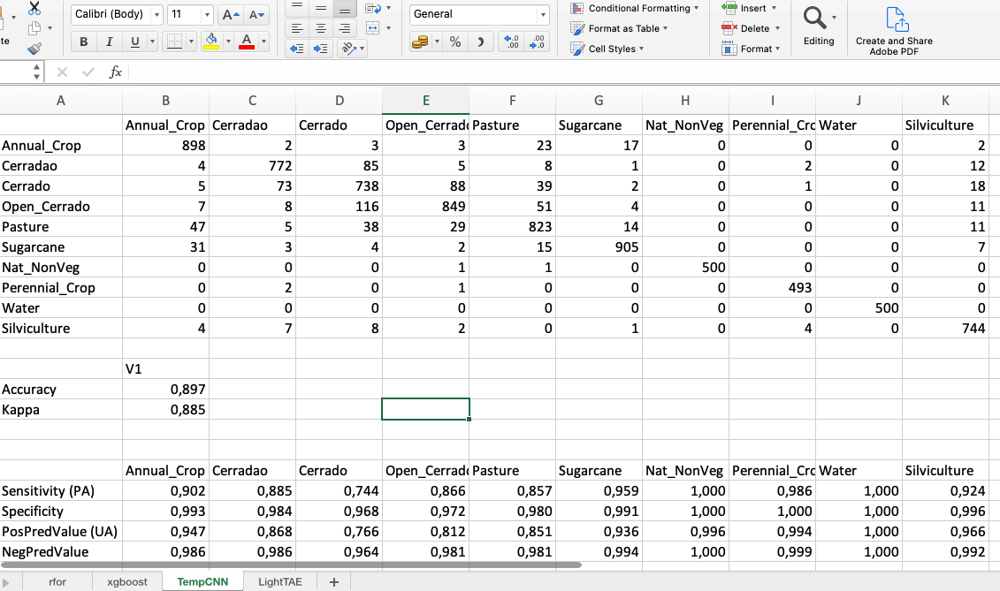

# Validation and accuracy measurements in SITS{-}


```{r, include = FALSE}
source("common.R")
dir.create("./tempdir/chp9")
```

## Case study used in this Chapter{-}

To show how to do validation and accuracy assessment in`sits`, we present an example resulting using a study area located in the Bahia state, Brazil, in the Cerrado biome. The data is composed of 67 Landsat-8 tiles from the Brazil Data Cube, with 23 time steps covering the the period 2017-08-29 to 2018-08-29, covering the agricultural year in the Brazilian Cerrado near the city of Barreiras (Bahia) and available in the `sitsdata` package.  The following code creates the data cube from local files.

Since the data is avaliable in the Brazil Data Cube, users should first obtain access to the BDC, by obtaining an access key. After obtaining the access key, they should  to include their credentials using an environment variables, as shown below. Obtaining a BDC access key is free. Users need to register at the [BDC site](https://brazildatacube.dpi.inpe.br/portal/explore) to obtain the key.
```{r,eval = FALSE}
Sys.setenv(
    "BDC_ACCESS_KEY" = <your_bdc_access_key>
)
```

After obtaining the BDC access key, we now can create a data cube for the Cerrado biome. 

```{r, tidy = "styler", out.width = "70%", fig.align="center", fig.cap="Color composite image of first date of the cube"}

# files are available in the Brazil Data Cube
# 
# obtain the region of interest covering the Cerrado biome
roi_cerrado_shp <- system.file(
    "extdata/shapefiles/cerrado_border/cerrado_border.shp",
    package = "sitsdata")
# read the shapefile as an object of the "sf" package
roi_cerrado <- sf::st_read(roi_cerrado_shp)

# create a data cube for the entire cerrado biome
cerrado_cube <- sits_cube(
        source = "BDC",
        collection = "LC8_30_16D_STK-1",
        roi = roi_cerrado,
        start_date = "2017-08-29",
        end_date = "2018-08-29",
        multicores = 3
)
# plot the first date with NDVI and EVI bands
plot(cerrado_cube, tile = "044049", red = "B7", green = "B5", blue = "B4")
```

To classify the Cerrado, we will use a training data set, produced by a systematic sampling using a grid of 5km x 5km throughout the biome as described by Simoes et al.[@Simoes2021]. The authors carried out a systematic sampling using a grid of 5 x 5 km throughout the Cerrado biome, collecting 85,026 samples. The training data labels were extracted from three sources: the pastureland map of 2018 from Parente et al. [@Parente2019], MapBiomas Collection 5 for  2018 [@Souza2020], and~Brazil's National Mapping Agency IBGE land maps for 2016--2018. Out of the 85,026 samples, the authors selected those where there was no disagreement between the labels assigned by the three sources.  The final training set consists of 48,850 points from which the authors extracted the time series using the Landsat-8 data cube available in the BDC. The classes for this training set are: `Annual Crop`, `Cerradao` (Woody Savanna), `Cerrado` (Savanna), `Nat_NonVeg` (Dunes), `Pasture`, `Perennial_Crop`, `Silviculture` (Planted Forests), `Sugarcane`, and `Water`. This data set is available in the package `sitsdata` as `samples_cerrado_lc8`. 


```{r, tidy = "styler", out.width = "70%"}
library(sitsdata)
data("samples_cerrado_lc8")
# show the class distribution in the new training set
sits_labels_summary(samples_cerrado_lc8)
```

Since the dataset is big and highly imbalanced, we will use the function `sits_reduce_imbalance()` to reduce the size and produce a more balanced sample dataset. We will use the resulting data set in the validation examples in this chapter.

```{r, tidy = "styler", echo = TRUE, eval=FALSE}
# reduce imbalance in the data set
# maximum number of samples per class will be 1000 
# minimum number of samples per class will be 500
samples_cerrado_bal <- sits_reduce_imbalance(
    samples = samples_cerrado_lc8,
    n_samples_over = 500,
    n_samples_under = 1000,
    multicores = 4
)
# show new sample distribution
sits_labels_summary(samples_cerrado_bal)
```

```{r, tidy = "styler", echo = FALSE, eval=TRUE}
samples_cerrado_bal <- readRDS("./etc/samples_cerrado_bal.rds")
sits_labels_summary(samples_cerrado_bal)
```

## Cross validation of training set{-}

Cross validation is a process undertaken on models to estimate some error associated with them, and hence has been used widely in different scientific disciplines. When we talk about validation, we are interested in estimating the prediction error associated to some model. For this purpose, we concentrate on the *cross-validation* approach, probably the most used validation technique [@Hastie2009].

Notice that validation techniques are not a replacement of accuracy measures, which are described below. Validation methods are based on the training samples. In general, these samples will be biased due to many factors. When working in large areas, it is hard to obtain random stratified samples which would cover the different variations in land cover associated to the ecosystems of the study area. In general, all machine learning methods are prone to underspecification [@DAmour2020]. Therefore, cross-validation should not be used as an accuracy measures, unless the samples have been carefully collected to represent the diversity of possible ocurrences of classes in the study area [@Wadoux2021]. 

Cross-validation uses part of the available samples to fit the classification model, and a different part to test it. The so-called *k-fold* validation, we split the data into $k$ partitions with approximately the same size and proceed by fitting the model and testing it $k$ times. At each step, we take one distinct partition for test and the remaining ${k-1}$ for training the model, and calculate its prediction error for classifying the test partition. A simple average gives us an estimation of the expected prediction error. 

A natural question that arises is: *how good is this estimation?* According to @Hastie2009, there is a bias-variance trade-off in choice of $k$. If $k$ is set to the number of samples, we obtain the so-called *leave-one-out* validation, the estimator gives a low bias for the true expected error, but produces a high variance expectation. This can be computational expensive as it requires the same number of fitting process as the number of samples. On the other hand, if we choose ${k=2}$, we get a high biased expected prediction error estimation that overestimates the true prediction error, but has a low variance. The recommended choices of $k$ are $5$ or $10$.

`sits_kfold_validate()` supports k-fold validation in `sits`. The following code does a five-fold validation using random forests. The result is the confusion matrix and the accuracy statistics (overall and by class). In the examples below, we use multiprocessing to speed up the results. 

```{r, echo = FALSE}
set.seed(290356)
```


```{r, tidy = "styler"}
# perform a five fold validation for the cerrado data set
# random forests machine learning method using default parameters
val_rfor <- sits_kfold_validate(
    samples = samples_cerrado_bal, 
    folds = 5, 
    ml_method = sits_rfor(),
    multicores = 5
)
# print the validation statistics
sits_accuracy_summary(val_rfor)
```


One useful function in SITS is the capacity to compare different validation methods and store them in an XLS file for further analysis. The following example shows how to do this, using the Cerrado data set. We take the models: random forests(`sits_rfor()`), extreme gradient boosting (`sits_xgboost()`), temporal CNN (`sits_tempcnn()`), and lightweight temporal attention encoder (`sits_lighttae())`.  After computing the confusion matrix and the statistics for each model, we also store the result in a list. When the calculation is finished, the function `sits_to_xlsx()` writes all of the results in an Excel-compatible spreadsheet. 


```{r, tidy = "styler", eval = FALSE}
# Compare different models for the Cerrado data set
# create a list to store the results
results <- list()
# Give a name to the results of the random forest model (see above)
val_rfor$name <- "rfor"
# store the rfor results in a list
results[[length(results) + 1]] <- val_rfor

## Extreme Gradient Boosting
val_xgb <- sits_kfold_validate(
    samples = samples_cerrado_bal,
    ml_method = sits_xgboost(),
    folds = 5,
    multicores = 5
)

# Give a name to the SVM model
val_xgb$name <- "xgboost"
# store the results in a list
results[[length(results) + 1]] <- val_xgb

# Temporal CNN
val_tcnn <- sits_kfold_validate(
    samples = samples_cerrado_bal,
    ml_method = sits_tempcnn(
        optimizer = torchopt::optim_adamw,
        opt_hparams = list(lr = 0.001)
    ),
    folds = 5,
    multicores = 5
)

# Give a name to the result
val_tcnn$name <- "TempCNN"
# store the results in a list
results[[length(results) + 1]] <- val_tcnn

# Light TAE
val_ltae <- sits_kfold_validate(
    samples = samples_cerrado_bal,
    ml_method = sits_lighttae(
        optimizer = torchopt::optim_adamw,
        opt_hparams = list(lr = 0.001)
    ),
    folds = 5,
    multicores = 5
)

# Give a name to the result
val_ltae$name <- "LightTAE"
# store the results in a list
results[[length(results) + 1]] <- val_ltae

# Save to an XLS file
xlsx_file <- "./model_comparison.xlsx"

sits_to_xlsx(results, file = xlsx_file)
```
The resulting Excel file can be opened with R or using spreadsheet programs. The figure below shows a printout of what is read by Excel. As shown below, each sheet corresponds to the output of one model. For simplicity, we show only the result of Random Forests, that has an overall accuracy of 90%. 

```{r, echo = FALSE, fig.align="center", out.width = "90%", out.height = "90%", fig.cap= "Result of 5-fold cross validation of Mato Grosso dataset using LightTAE"}



```

The scores for overall accuracy are similar between the models. However, there are significant differences between the models, as shown by comparing their F1 scores, as shown below.    

```{r, eval = FALSE, echo = TRUE}
model_acc <- tibble::tibble(
    "Random Forest" = val_rfor$overall[["Accuracy"]],
    "XGBoost"       = val_xgb$overall[["Accuracy"]],
    "TempCNN"       = val_tcnn$overall[["Accuracy"]],
    "LightTAE"      = val_ltae$overall[["Accuracy"]]
)
options(digits = 3)
model_acc
```

```{r, eval = TRUE, echo = FALSE}
model_acc <- readRDS(file = "./etc/model_acc.rds")
options(digits = 3)
model_acc
```
The table below shows the F1-scores of all classes for each model, as produced by the k-fold validation. The F1-scores are obtained as the harmonic mean between user's accuracy and precision accuracy for each class. The results show that although deep learning models such TempCNN and LightTAE have similar overall accuracies than Random Forests or XGBoost, their F1-scores per class are in most cases better.  

```{r, eval=FALSE, echo = TRUE, tidy = "styler"}
f1_score_rfor <- unname(val_rfor$byClass[,"F1"])
f1_score_xgb <-  unname(val_xgb$byClass[,"F1"])
f1_score_tcnn <-  unname(val_tcnn$byClass[,"F1"])
f1_score_ltae <-  unname(val_ltae$byClass[,"F1"])

f1_scores <- tibble::tibble(
    "Classes"  = sits_labels(samples_cerrado_bal),
    "RandFor"  = f1_score_rfor,
    "XGBoost"  = f1_score_xgb,
    "TempCNN"  = f1_score_tcnn,
    "LightTAE" = f1_score_ltae
)
f1_scores
```
```{r, eval = TRUE, echo = FALSE}
f1_scores <- readRDS(file = "./etc/f1_scores.rds")
options(digits = 3)
f1_scores
```

The cross validation results have to be interpreted carefully. Cross validation is a measure how well the model fits the training data. Using these results as a measure of classification accuracy is only valid if the training data is a good sample of the entire data set. In practice, training data is subject to various sources of bias. In most cases of land classification, some classes are much more frequent than others and as such the training data set will be imbalanced. For large areas, regional differences in soil and climate condition will lead that the same classes will have different spectral responses. When collecting samples for large areas, field analysts may be restricted to areas where they have access (e.g, along roads). An additional problem is that of mixed pixels. Expert interpreters tend to select samples which standout in field work or reference images. Border pixels are unlikely to be chosen as part of training data. For all these reason, cross validation results should not be considered as indicative of  accuracy measurement over the entire data set. 


## Accuracy assessment of classified images{-}

To measure the accuracy of classified images, the `sits_accuracy()` function uses an area-weighted technique, following the best practices proposed by Olofsson et al. [@Olofsson2013]. The need for area-weighted estimates arises from the fact the land use and land cover classes are not evenly distributed in space. In some applications (e.g., deforestation) where the interest lies in assessing how much of the image has changed, the area mapped as deforested is likely to be a small fraction of the total area. If users disregard the relative importance of small areas where change is taking place, the overall accuracy estimate will be inflated and unrealistic. For this reason, Olofsson et al [@Olofsson2013] argue that "mapped areas should be adjusted to eliminate bias attributable to map classification error and these error-adjusted area estimates should be accompanied by confidence intervals to quantify the sampling variability of the estimated area".

With this motivation, when measuring accuracy of classified images, the function `sits_accuracy()` follows the procedure set by Olofsson et al. [@Olofsson2013]. Given a classified image and a validation file, the first step is to calculate the confusion matrix in the traditional way, i.e., by identifying the commission and omission errors. Then we calculate the unbiased estimator of the proportion of area in cell $i,j$ of the error matrix

$$
\hat{p_{i,j}} = W_i\frac{n_{i,j}}{n_i}
$$
where the total area of the map is $A_{tot}$, the mapping area of class $i$ is $A_{m,i}$ and the proportion of area mapped as class $i$ is $W_i = {A_{m,i}}/{A_{tot}}$. Adjusting for area size allows producing an unbiased estimation of the total area of class $j$, defined as a stratified estimator
$$
\hat{A_j} = A_{tot}\sum_{i=1}^KW_i\frac{n_{i,j}}{n_i}
$$
This unbiased area estimator includes the effect of false negatives (omission error) while not considering the effect of false positives (commission error). The area estimates also allow producing an unbiased estimate of the user's and producer's accuracy for each class. Following @Olofsson2013, we provide the 95% confidence interval for $\hat{A_j}$. 

To use the `sits_accuracy()` function to produce the adjusted area estimates, users have to provide the classified image together with a csv file containing a set of well selected labeled points.  The csv file should have the same format as the one used to obtain samples, as discussed earlier. The labelled points should be based on a random stratified sample. All areas associated to each class should contribute to the test data used for accuracy assessment. 

Because of the biases inherent in cross validation of training data, users should provide an independent validation data set to measure classification accuracy. In this case study, Simoes et al.[@Simoes2021] did a systematic sampling of the Cerrado biome using a 20 x 20 km grid with a total of 5402 points. These samples are independent of the training set used in the classification. They were interpreted by five specialists using high resolution images from the same period of the classification. This resulted in 5286 evaluation samples thus distributed: "Annual Crop" (553), "Cerrado" (3155), "Natural Non Vegetated" (44), "Pasture" (1246), "Perennial Crop" (38), "Silviculture" (94), "Sugarcane" (77), and "Water" (79). This data set is available in package "sitsdata", as described below. In this validation file, all samples belonging to classes "Cerrado", "Open Cerrado" and "Cerradao" (Woody Savanna) have been grouped together in a single class. 

The first step is to obtain the classification map. Since the map is too large for sharing by an R package, the data is available in a Dropbox folder. The metadata for the cube is provided by the library `sitsdata`. 

```{r, tidy="styler", out.width = "70%", fig.align="center", fig.cap="Classification of tile 044048 from the Landsat data cube for the Brazilian Cerrado in 2017/2018." }
# retrieve the metadata for the classified cube
# the files are stored as Dropbox links
cerrado_classif_rds <- system.file("extdata/Cerrado/cerrado_classif_dropbox.rds",
                                   package = "sitsdata")
# read the cube metadata
cerrado_classif <- readRDS(cerrado_classif_rds)
# plot the classification
plot(cerrado_classif, tiles = "044048")
```
The next step is to provide a CSV file with the validation points, as described above.

```{r, eval = FALSE, echo = TRUE}
# get ground truth points
valid_csv <- system.file("extdata/csv/cerrado_lc8_validation.csv",
                            package = "sitsdata")
# calculate accuracy according to Olofsson's method
area_acc <- sits_accuracy(cerrado_classif, 
                          validation_csv = valid_csv)
# print the area estimated accuracy 
area_acc
```
```{r, eval = TRUE, echo = FALSE}
# calculate accuracy according to Olofsson's method
area_acc <- readRDS("./etc/area_acc.rds")
# print the area estimated accuracy 
options(digits = 3)
area_acc
```
This example shows that it is important to correct area estimates in land classification, to reduce the bias effect of misclassification and to take into account the different producer's accuracies associated to each class. It also shows that actual overall accuracy is in general lower than the result of cross-validation.  


