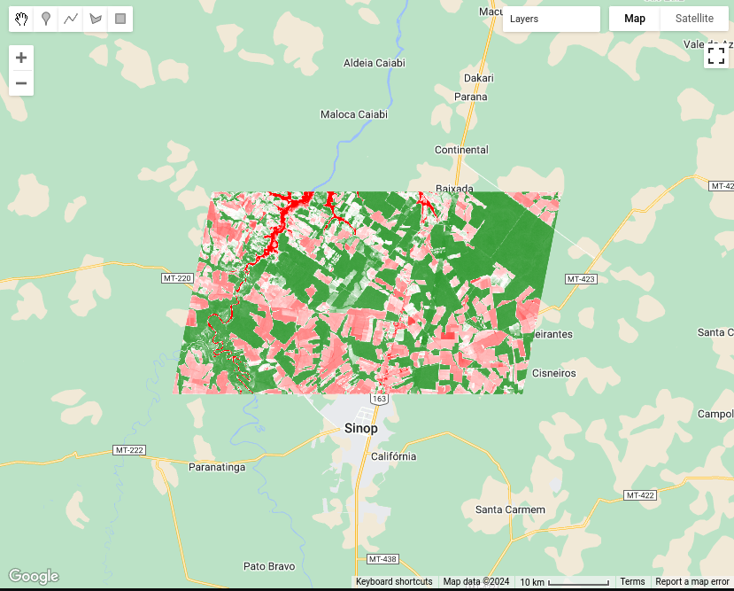

# Technical annex {-}

```{r, eval = TRUE, echo = FALSE, include = FALSE}
source("common.R")
library(sits)
library(sitsdata)
```

This Chapter contains technical details on the algorithms available in `sits`. It is intended to support those that want to understand how the package works and also want to contribute to its development.

## How colors work in sits{-}

In examples provided in the book, the color legend is taken from a predefined color pallete provided by `sits`. The default color definition file used by `sits` has 220 class names, which can be shown using `sits_colors()`

```{r, tidy = "styler", out.width = "100%", out.height = "100%", echo = FALSE, fig.align="center", fig.cap="Default colors used in the sits package (source: authors)."}
# Point default `sits` colors
sits_colors()
```

These colors are grouped by typical legends used by the Earth observation community, which include "IGBP", "UMD", "ESA_CCI_LC", "WORLDCOVER", "PRODES", "PRODES_VISUAL", "TERRA_CLASS", "TERRA_CLASS_PT". The following commands shows the colors associated with the IGBP legend [@Herold2009].

```{r, tidy = "styler", out.width = "100%", out.height = "100%", fig.align="center", fig.cap="Colors used in the sits package to represeny IGBP legend (source: authors)."}
# Display default `sits` colors
sits_colors_show(legend = "IGBP")
```


The default color table can be extended using `sits_colors_set()`. As an example of a user-defined color table, consider a definition that covers level 1 of the Anderson Classification System used in the US National Land Cover Data, obtained by defining a set of colors associated to a new legend. The colors should be defined by HEX values and the color names should consist of a single string; multiple names need to be connected with an underscore("_").
```{r colors, tidy = "styler", out.width = "100%", out.height = "80%", fig.align="center", fig.cap="Example of defining colors for the Anderson Land Classification Scheme(source: authors)."}
# Define a color table based on the Anderson Land Classification System
us_nlcd <- tibble::tibble(name = character(), color = character())
us_nlcd <- us_nlcd |>  
  tibble::add_row(name = "Urban_Built_Up", color =  "#85929E") |> 
  tibble::add_row(name = "Agricultural_Land", color = "#F0B27A") |>  
  tibble::add_row(name = "Rangeland", color = "#F1C40F") |> 
  tibble::add_row(name = "Forest_Land", color = "#27AE60") |>  
  tibble::add_row(name = "Water", color = "#2980B9") |>  
  tibble::add_row(name = "Wetland", color = "#D4E6F1") |> 
  tibble::add_row(name = "Barren_Land", color = "#FDEBD0") |> 
  tibble::add_row(name = "Tundra", color = "#EBDEF0") |> 
  tibble::add_row(name = "Snow_and_Ice", color = "#F7F9F9")
# Load the color table into `sits`
sits_colors_set(colors = us_nlcd, legend = "US_NLCD")
# Show the new legend
sits_colors_show(legend = "US_NLCD")
```

The original default `sits` color table can be restored using `sits_colors_reset()`. 

```{r, eval = TRUE, echo = FALSE, warning = FALSE, message = FALSE} 
# Reset the color table
sits_colors_reset()
```

As an alternative, a legend can be used directly as a parameter to `plot()`. Please see the example provided in Section "Map Reclassification" in Chapter [Image classification in data cubes](https://e-sensing.github.io/sitsbook/image-classification-in-data-cubes.html). 


## How parallel processing works in virtual machines with CPUs{-}

This section provides an overview of how `sits_classify()`, `sits_smooth()`, and `sits_label_classification()` process images in parallel. To achieve efficiency, `sits` implements a fault-tolerant multitasking procedure for big Earth observation data classification. The learning curve is shortened as there is no need to learn how to do multiprocessing. Image classification in `sits` is done by a cluster of independent workers linked to a virtual machine. To avoid communication overhead, all large payloads are read and stored independently; direct interaction between the main process and the workers is kept at a minimum. 

The classification procedure benefits from the fact that most images available in cloud collections are stored as COGs (cloud-optimized GeoTIFF). COGs are regular GeoTIFF files organized in regular square blocks to improve visualization and access for large datasets. Thus, data requests can be optimized to access only portions of the images. All cloud services supported by `sits` use COG files. The classification algorithm in `sits` uses COGs to ensure optimal data access, reducing I/O demand as much as possible.

The approach for parallel processing in `sits`, depicted in Figure \@ref(fig:par), has the following steps:

1. Based on the block size of individual COG files, calculate the size of each chunk that must be loaded in memory, considering the number of bands and the timeline's length. Chunk access is optimized for the efficient transfer of data blocks.
2. Divide the total memory available by the chunk size to determine how many processes can run in parallel. 
3. Each core processes a chunk and produces a subset of the result.
4. Repeat the process until all chunks in the cube have been processed.
5. Check that subimages have been produced correctly. If there is a problem with one or more subimages, run a failure recovery procedure to ensure all data is processed.
6. After generating all subimages, join them to obtain the result.

```{r par, out.width = "90%", out.height = "90%", echo = FALSE, fig.align="center", fig.cap="Parallel processing in sits (Source: Simoes et al. (2021).  Reproduction under fair use doctrine)."}
knitr::include_graphics("./images/sits_parallel.png")
```

This approach has many advantages. It has no dependencies on proprietary software and runs in any virtual machine that supports R. Processing is done in a concurrent and independent way, with no communication between workers. Failure of one worker does not cause the failure of big data processing. The software is prepared to resume classification processing from the last processed chunk, preventing failures such as memory exhaustion, power supply interruption, or network breakdown. 

To reduce processing time, it is necessary to adjust `sits_classify()`, `sits_smooth()`, and `sits_label_classification()`  according to the capabilities of the host environment. The `memsize` parameter controls the size of the main memory (in GBytes) to be used for classification. A practical approach is to set `memsize` to the maximum memory available in the virtual machine for classification and to choose `multicores` as the largest number of cores available. Based on the memory available and the size of blocks in COG files, `sits` will access the images in an optimized way. In this way, `sits` tries to ensure the best possible use of the available resources. 

## Including new methods for machine learning{-}

This section provides guidance for experts that want to include new methods for machine learning that work in connection with `sits`. The discussion below assumes familiarity with the R language. Developers should consult Hadley Wickham's excellent book [Advanced R](https://adv-r.hadley.nz/), especially Chapter 10 on "Function Factories". 

All machine learning and deep learning algorithm in `sits` follow the same logic; all models are created by `sits_train()`. This function has two parameters: (a) `samples`, a set of time series with the training samples; (b) `ml_method`, a function that fits the model to the input data. The result is a function that is passed on to `sits_classify()` to classify time series or data cubes. The structure of `sits_train()` is simple, as shown below.

```{r, tidy = "styler", eval = FALSE}
sits_train <- function(samples, ml_method){
    # train a ml classifier with the given data
    result <- ml_method(samples)
    # return a valid machine learning method
    return(result)
}
```

In R terms, `sits_train()` is a function factory, or a function that makes functions. Such behavior is possible because functions are first-class objects in R. In other words, they can be bound to a name in the same way that variables are. A second propriety of R is that functions capture (enclose) the environment in which they are created. In other words, when a function is returned as a result of another function, the internal variables used to create it are available inside its environment. In programming language, this technique is called "closure". 

The following definition from Wikipedia captures the purpose of clousures: *"Operationally, a closure is a record storing a function together with an environment. The environment is a mapping associating each free variable of the function with the value or reference to which the name was bound when the closure was created. A closure allows the function to access those captured variables through the closure's copies of their values or references, even when the function is invoked outside their scope."*

In `sits`, the properties of closures are used as a basis for making training and classification independent. The return of `sits_train()` is a model that contains information on how to classify input values, as well as information on the samples used to train the model. 

To ensure all models work in the same fashion, machine learning functions in `sits` also share the same data structure for prediction. This data structure is created by `sits_predictors()`, which transforms the time series tibble into a set of values suitable for using as training data, as shown in the following example.

```{r, tidy = "styler", eval = TRUE}
data("samples_matogrosso_mod13q1", package = "sitsdata")
pred <- sits_predictors(samples_matogrosso_mod13q1)
pred
```

The predictors tibble is organized as a combination of the "X" and "Y" values used by machine learning algorithms. The first two columns are `sample_id` and `label`. The other columns contain the data values, organized by band and time. For machine learning methods that are not time-sensitive, such as random forest, this organization is sufficient for training. In the case of time-sensitive methods such as `tempCNN`, further arrangements are necessary to ensure the tensors have the right dimensions. Please refer to the `sits_tempcnn()` source code for an example of how to adapt the prediction table to appropriate `torch` tensor.

Some algorithms require data normalization. Therefore, the `sits_predictors()` code is usually combined with methods that extract statistical information and then normalize the data, as in the example below.

```{r, tidy = "styler", eval = FALSE}
 # Data normalization
ml_stats <- sits_stats(samples)
# extract the training samples
train_samples  <- sits_predictors(samples)
# normalize the training samples
train_samples  <- sits_pred_normalize(pred = train_samples, stats = ml_stats)
```        

The following example shows the implementation of the LightGBM algorithm, designed to efficiently handle large-scale datasets and perform fast training and inference [@Ke2017]. Gradient boosting is a machine learning technique that builds an ensemble of weak prediction models, typically decision trees, to create a stronger model. LightGBM specifically focuses on optimizing the training and prediction speed, making it particularly suitable for large datasets. The example builds a model using the `lightgbm` package.  This model will then be applied later to obtain a classification.

Since LightGBM is a gradient boosting model, it uses part of the data as testing data to improve the model's performance. The split between the training and test samples is controlled by a parameter, as shown in the following code extract.

```{r, tidy="styler", eval = FALSE}
# split the data into training and validation datasets
# create partitions different splits of the input data
test_samples <- sits_pred_sample(train_samples,
                                 frac = validation_split
)
# Remove the lines used for validation
sel <- !(train_samples$sample_id %in% test_samples$sample_id)
train_samples <- train_samples[sel, ]
```

To include the `lightgbm` package as part of `sits`, we need to create a new training function which is compatible with the other machine learning methods of the package and will be called by `sits_train()`. For compatibility, this new function will be called `sits_lightgbm()`. Its implementation uses two functions from the `lightgbm`: (a) `lgb.Dataset()`, which transforms training and test samples into internal structures; (b) `lgb.train()`, which trains the model.

The parameters of `lightgbm::lgb.train()` are: (a) `boosting_type`, boosting algorithm; (b) `objective`, classification objective (c) `num_iterations`, number of runs; (d) `max_depth`, maximum tree depth; (d) `min_samples_leaf`,  minimum size of data in one leaf (to avoid overfitting); (f) `learning_rate`,  learning rate of the algorithm; (g) `n_iter_no_change`, number of successive iterations to stop training when validation metrics do not improve; (h) `validation_split`, fraction of training data to be used as validation data. 

```{r, tidy = "styler", eval = TRUE}
# install "lightgbm" package if not available 
if (!require("lightgbm")) install.packages("lightgbm")
# create a function in sits style for LightGBM algorithm
sits_lightgbm <- function(samples = NULL,
                          boosting_type = "gbdt",
                          objective = "multiclass",
                          min_samples_leaf = 10,
                          max_depth = 6,
                          learning_rate = 0.1,
                          num_iterations = 100,
                          n_iter_no_change = 10,
                          validation_split = 0.2, ...){

    # function that returns MASS::lda model based on a sits sample tibble
    train_fun <- function(samples) {
        # Extract the predictors
        train_samples <- sits_predictors(samples)
        
        # find number of labels
        labels <- sits_labels(samples)
        n_labels <- length(labels)
        # lightGBM uses numerical labels starting from 0
        int_labels <- c(1:n_labels) - 1
        # create a named vector with integers match the class labels
        names(int_labels) <- labels
        
        # add number of classes to lightGBM params
        # split the data into training and validation datasets
        # create partitions different splits of the input data
        test_samples <- sits_pred_sample(train_samples,
                                         frac = validation_split
        )
        
        # Remove the lines used for validation
        sel <- !(train_samples$sample_id %in% test_samples$sample_id)
        train_samples <- train_samples[sel, ]
        
        # transform the training data to LGBM dataset
        lgbm_train_samples <- lightgbm::lgb.Dataset(
            data = as.matrix(train_samples[, -2:0]),
            label = unname(int_labels[train_samples[[2]]])
        )
        # transform the test data to LGBM dataset
        lgbm_test_samples <- lightgbm::lgb.Dataset(
            data = as.matrix(test_samples[, -2:0]),
            label = unname(int_labels[test_samples[[2]]])
        )
        # set the parameters for the lightGBM training
        lgb_params <- list(
            boosting_type = boosting_type,
            objective = objective,
            min_samples_leaf = min_samples_leaf,
            max_depth = max_depth,
            learning_rate = learning_rate,
            num_iterations = num_iterations,
            n_iter_no_change = n_iter_no_change,
            num_class = n_labels
        )
        # call method and return the trained model
        lgbm_model <- lightgbm::lgb.train(
            data    = lgbm_train_samples,
            valids  = list(test_data = lgbm_test_samples),
            params  = lgb_params,
            verbose = -1,
            ...
        )
        # serialize the model for parallel processing
        lgbm_model_string <- lgbm_model$save_model_to_string(NULL)
        # construct model predict closure function and returns
        predict_fun <- function(values) {
            # reload the model (unserialize)
            lgbm_model <- lightgbm::lgb.load(model_str = lgbm_model_string)
            # predict probabilities
            prediction <- stats::predict(lgbm_model,
                               data = as.matrix(values),
                               rawscore = FALSE,
                               reshape = TRUE
            )
            # adjust the names of the columns of the probs
            colnames(prediction) <- labels
            # retrieve the prediction results
            return(prediction)
        }
        # Set model class
        class(predict_fun) <- c("lightgbm_model", "sits_model", class(predict_fun))
        return(predict_fun)
    }
    result <- sits_factory_function(samples, train_fun)
    return(result)
}
```

The above code has two nested functions: `train_fun()` and `predict_fun()`. When `sits_lightgbm()` is called, `train_fun()` transforms the input samples into predictors and uses them to train the algorithm, creating a model (`lgbm_model`). This model is included as part of the function's closure and becomes available at classification time. Inside `train_fun()`, we include `predict_fun()`, which applies the `lgbm_model` object to classify to the input values. The `train_fun` object is then returned as a closure, using the `sits_factory_function` constructor. This function allows the model to be called either as part of `sits_train()` or to be called independently, with the same result.

```{r, tidy = "styler", eval = FALSE}
sits_factory_function <- function(data, fun) {
    # if no data is given, we prepare a
    # function to be called as a parameter of other functions
    if (purrr::is_null(data)) {
        result <- fun
    } else {
        # ...otherwise compute the result on the input data
        result <- fun(data)
    }
    return(result)
}
```

As a result, the following calls are equivalent.

```{r, tidy = "styler", eval = FALSE}
# building a model using sits_train
lgbm_model <- sits_train(samples, sits_lightgbm())
# building a model directly
lgbm_model <- sits_lightgbm(samples)
```


There is one additional requirement for the algorithm to be compatible with `sits`. Data cube processing algorithms in `sits` run in parallel. For this reason, once the classification model is trained, it is serialized, as shown in the following line. The serialized version of the model is exported to the function closure, so it can be used at classification time.

```{r, tidy = "styler", eval = FALSE}
# serialize the model for parallel processing
lgbm_model_string <- lgbm_model$save_model_to_string(NULL)
```

During classification,  `predict_fun()` is called in parallel by each CPU. At this moment, the serialized string is transformed back into a model, which is then run to obtain the classification, as shown in the code.

```{r, tidy = "styler", eval = FALSE}
# unserialize the model
lgbm_model <- lightgbm::lgb.load(model_str = lgbm_model_string)
```


Therefore, using function factories that produce closures, `sits` keeps the classification function independent of the machine learning or deep learning algorithm. This policy allows independent proposal, testing, and development of new classification methods. It also enables improvements on parallel processing methods without affecting the existing classification methods.

To illustrate this separation between training and classification, the new algorithm developed in the chapter using `lightgbm` will be used to classify a data cube. The code is the same as the one in Chapter [Introduction](https://e-sensing.github.io/sitsbook/introduction.html) as an example of data cube classification, except for the use of `lgb_method()`. 

```{r maplgbm, tidy = "styler", eval = TRUE, out.width = "100%", fig.cap = "Classification map for Sinop using LightGBM (source: authors).", fig.align="center"}
data("samples_matogrosso_mod13q1", package = "sitsdata")
# Create a data cube using local files
sinop <- sits_cube(
  source = "BDC", 
  collection  = "MOD13Q1-6.1",
  data_dir = system.file("extdata/sinop", package = "sitsdata"),  
  parse_info = c("X1", "X2", "tile", "band", "date")
)
# The data cube has only "NDVI" and "EVI" bands 
# Select the bands NDVI and EVI
samples_2bands <- sits_select(
    data = samples_matogrosso_mod13q1, 
    bands = c("NDVI", "EVI")
)
# train lightGBM model
lgb_model <- sits_train(samples_2bands, sits_lightgbm())

# Classify the data cube
sinop_probs <- sits_classify(
    data = sinop, 
    ml_model = lgb_model,
    multicores = 2,
    memsize = 8,
    output_dir = "./tempdir/chp15"
)
# Perform spatial smoothing
sinop_bayes <- sits_smooth(
    cube = sinop_probs,
    multicores = 2,
    memsize = 8,
    output_dir = "./tempdir/chp15"
)
# Label the smoothed file 
sinop_map <- sits_label_classification(
    cube = sinop_bayes, 
    output_dir = "./tempdir/chp15"
)
# plot the result
plot(sinop_map, title = "Sinop Classification Map")
```

## Adding functions to the `sits` API{-}

### General principles{-}

New functions that build on the `sits` API should follow the general principles below.

- The target audience for `sits` is the community of remote sensing experts with Earth Sciences background who want to use state-of-the-art data analysis methods with minimal investment in programming skills. The design of the `sits` API considers the typical workflow for land classification using satellite image time series and thus provides a clear and direct set of functions, which are easy to learn and master. 

- For this reason, we welcome contributors that provide useful additions to the existing API, such as new ML/DL classification algorithms. In case of a new API function, before making a pull request please raise an issue stating your rationale for a new function.

- Most functions in `sits` use the S3 programming model with a strong emphasis on generic methods wich are specialized depending on the input data type. See for example the implementation of the `sits_bands()` function. 

- Please do not include contributed code using the S4 programming model. Doing so would break the structure and the logic of existing code. Convert your code from S4 to S3.

- Use generic functions as much as possible, as they improve modularity and maintenance. If your code has decision points using `if-else` clauses, such as `if A, do X; else do Y` consider using generic functions. 

- Functions that use the `torch` package use the R6 model to be compatible with that package. See for example, the code in `sits_tempcnn.R` and `api_torch.R`. To convert `pyTorch` code to R and include it is straightforward. Please see the [Technical Annex](https://e-sensing.github.io/sitsbook/technical-annex.html) of the sits on-line book.

- The sits code relies on the packages of the `tidyverse` to work with tables and list. We use `dplyr` and `tidyr` for data selection and wrangling, `purrr` and `slider` for loops on lists and table, `lubridate` to handle dates and times. 

### Adherence to the `sits` data types{-}

The `sits` package in built on top of three data types: time series tibble, data cubes and models. Most `sits` functions have one or more of these types as inputs and one of them as return values. The time series tibble contains data and metadata. The first six columns contain the metadata: spatial and temporal information, the label assigned to the sample, and the data cube from where the data has been extracted. The time_series column contains the time series data for each spatiotemporal location. All time series tibbles are objects of class `sits`. 

The `cube` data type is designed to store metadata about image files. In principle, images which are part of a data cube share the same geographical region, have the same bands, and have been regularized to fit into a pre-defined temporal interval. Data cubes in `sits` are organized by tiles. A tile is an element of a satellite's mission reference system, for example MGRS for Sentinel-2 and WRS2 for Landsat. A `cube` is a tibble where each row contains information about data covering one tile. Each row of the cube tibble contains a column named `file_info`; this column contains a list that stores a tibble 

The `cube` data type is specialised in `raster_cube` (ARD images), `vector_cube` (ARD cube with segmentation vectors). `probs_cube` (probabilities produced by classification algorithms on raster data), `probs_vector_cube`(probabilites generated by vector classification of segments),  `uncertainty_cube` (cubes with uncertainty information), and `class_cube` (labelled maps). See the code in `sits_plot.R` as an example of specialisation of `plot` to handle different classes of raster data. 

All ML/DL models in `sits` which are the result of `sits_train` belong to the `ml_model` class. In addition, models are assigned a second class, which is unique to ML models (e.g, `rfor_model`, `svm_model`) and generic for all DL `torch` based models (`torch_model`). The class information is used for plotting models and for establishing if a model can run on GPUs. 

### Literal values, error messages, and testing{-}

The internal `sits` code has no literal values, which are all stored in the YAML configuration files `./inst/extdata/config.yml` and `./inst/extdata/config_internals.yml`. The first file contains configuration parameters that are relevant to users, related to visualisation and plotting; the second contains parameters that are relevant only for developers. These values are accessible using the `.conf` function. For example, the value of the default size for ploting COG files is accessed using the command `.conf["plot", "max_size"]`. 

Error messages are also stored outside of the code in the YAML configuration file `./inst/extdata/config_messages.yml`. These values are accessible using the `.conf` function. For example, the error associated to an invalid NA value for an input parameter is accessible using th function `.conf("messages", ".check_na_parameter")`. 

We strive for high code coverage (> 90\%). Every parameter of all `sits` function (including internal ones) is checked for consistency. Please see `api_check.R`. 


### Supporting new STAC-based image catalogues{-}

If you want to include a STAC-based catalogue not yet supported by `sits`, we encourage you to look at existing implementations of catalogues such as Microsoft Planetary Computer (MPC), Digital Earth Africa (DEA) and AWS. STAC-based catalogues in `sits` are associated to YAML description files, which are available in the directory `.inst/exdata/sources`. For example, the YAML file `config_source_mpc.yml` describes the contents of the MPC collections supported by `sits`. Please first provide an YAML file which lists the detailed contents of the new catalogue you wish to include. Follow the examples provided.

After writing the YAML file, you need to consider how to access and query the new catalogue. The entry point for access to all catalogues is the `sits_cube.stac_cube()` function, which in turn calls a sequence of functions which are described in the generic interface `api_source.R`. Most calls of this API are handled by the functions of `api_source_stac.R` which provides an interface to the `rstac` package and handles STAC queries. 

Each STAC catalogue is different. The STAC specification allows providers to implement their data descriptions with specific information. For this reason, the generic API described in `api_source.R` needs to be specialized for each provider. Whenever a provider needs specific implementations of parts of the STAC protocol, we include them in separate files. For example, `api_source_mpc.R` implements specific quirks of the MPC platform. Similarly, specific support for CDSE (Copernicus Data Space Environment) is available in `api_source_cdse.R`. 


## Exporting data to JSON{-}

Both the data cube and the time series tibble can be exported to exchange formats such as JSON.

```{r, tidy = "styler", eval = FALSE}
library(jsonlite)
# Export the data cube to JSON
jsonlite::write_json(
  x = sinop,
  path = "./data_cube.json",
  pretty = TRUE)

# Export the time series to JSON
jsonlite::write_json(
  x = samples_prodes_4classes,
  path = "./time_series.json",
  pretty = TRUE)
```

## SITS and Google Earth Engine APIs: A side-by-side exploration{-}

This section presents a side-by-side exploration of the `sits` and Google Earth 
Engine (`gee`) APIs, focusing on their respective capabilities in handling 
satellite data. The exploration is structured around three key examples: 
(1) creating a mosaic, (2) calculating the Normalized Difference Vegetation 
Index (NDVI), and (3) performing a Land Use and Land Cover (LULC) classification. 
Each example demonstrates how these tasks are executed using `sits` and `gee`, 
offering a clear view of their methodologies and highlighting the similarities 
and the unique approaches each API employs.

### Example 1: Creating a Mosaic{-}

### Example 2: Calculating NDVI{-}

This example demonstrates how to generate time-series of Normalized Difference 
Vegetation Index (NDVI) using both the `sits` and `gee` APIs.

#### Define Region of Interest data{-}

In this example, a Region of Interest (ROI) is defined using the `sinop_roi.shp` 
file. Below are the code snippets for specifying this file in both `sits` and 
`gee` environments.

> To reproduce the example, you can download the shapefile using [this link](data/sits-gee/sinop_roi.zip). 
In `sits`, you can just use it. In `gee`, it would be required to upload the 
file in your user space.

**sits**

```{r, eval = FALSE}
roi_data <- "sinop_roi.shp"
```

**gee**

```js
var roi_data = ee.FeatureCollection("/path/to/sinop_roi");
```

#### Load Satellite Imagery{-}

Next, we load the satellite imagery. For this example, we use data from [Landsat-8](https://www.usgs.gov/landsat-missions/landsat-8). 
In `sits`, this data is retrieved from the Brazil Data Cube, although 
other sources are available. For `gee`, the data provided by the platform is used.

In `sits`, when the data is loaded, all necessary transformations to make the 
data ready for use (e.g., `factor`, `offset`, `cloud masking`) are applied 
automatically. In `gee`, users are responsible for performing these 
transformations themselves.

**sits**

```{r, eval = FALSE}
data <- sits_cube(
    source      = "BDC",
    collection  = "LANDSAT-OLI-16D",
    bands       = c("RED", "NIR08", "CLOUD"),
    roi         = roi_data,
    start_date  = "2019-05-01",
    end_date    = "2019-07-01"
)
```

**gee**

```js
var data = ee.ImageCollection("LANDSAT/LC08/C02/T1_L2")
  .filterBounds(roi_data)
  .filterDate("2019-05-01", "2019-07-01")
  .select(["SR_B4", "SR_B5", "QA_PIXEL"]);

// factor and offset
data = data.map(function(image) {
  var opticalBands = image.select('SR_B.').multiply(0.0000275).add(-0.2);
  return image.addBands(opticalBands, null, true);
});

data = data.map(function(image) {
  // Select the pixel_qa band
  var qa = image.select('QA_PIXEL');

  // Create a mask to identify cloud and cloud shadow
  var cloudMask = qa.bitwiseAnd(1 << 5).eq(0) // Clouds
           .and(qa.bitwiseAnd(1 << 3).eq(0)); // Cloud shadows

  // Apply the cloud mask to the image
  return image.updateMask(cloudMask);
});
```

#### Generate NDVI{-}

After loading the satellite imagery, the NDVI can be generated. In `sits`, a 
function allows users to specify the formula used to create a new attribute, 
in this case, NDVI. In `gee`, a callback function is used, where the NDVI is 
calculated for each image.

**sits**

```{r, eval = FALSE}
data_ndvi <- sits_apply(
  data        = data,
  NDVI        = (NIR08 - RED) / (NIR08 + RED),
  output_dir  = tempdir(),
  multicores  = 4,
  progress    = TRUE
)
```

**gee**

```js
var data_ndvi = data.map(function(image) {
  var ndvi = image.normalizedDifference(["SR_B5", "SR_B4"]).rename('NDVI');

  return image.addBands(ndvi);
});

data_ndvi = data_ndvi.select("NDVI");
```

#### Crop Result{-}

The results are clipped to the ROI defined at the beginning of the 
example to facilitate visualization.

> In both APIs, you can define a ROI before performing the 
operation to optimize resource usage. However, in this example, the data is 
cropped after the calculation.

**sits**

```{r, eval = FALSE}
data_ndvi <- sits_mosaic(
  cube       = data_ndvi,
  roi        = roi_data,
  output_dir = tempdir(),
  multicores = 4
)
```

**gee**

```js
data_ndvi = data_ndvi.map(function(image) {
  return image.clip(roi_data);
});
```

#### View Result{-}

Finally, the results can be visualized in an interactive map.

**sits**

```{r, eval = FALSE}
sits_view(data_ndvi, band = "NDVI", date = "2019-05-25", opacity = 1)
```

```{r, echo = FALSE, out.width = "100%", out.height = "50%"}
knitr::include_graphics("./images/sitsgee/ndvi-sits.png")
```

**gee**

```js
// Define view region
Map.centerObject(roi_data, 10);

// Add classification map (colors from sits)
Map.addLayer(data_ndvi, {
    min: 0, 
    max: 1, 
    palette: ["red", 'white', 'green']
}, "NDVI Image");
```

```{r, echo = FALSE, out.width = "100%", out.height = "50%"}

```

### Example 3: Land Use and Land Cover (LULC) Classification{-}

This example demonstrates how to perform Land Use and Land Cover (LULC) 
classification using satellite image time series and machine-learning models in 
both `sits` and `gee`.

#### Define Region of Interest data{-}

This example defines the region of interest (ROI) using a shapefile named 
`sinop_roi.shp`. Below are the code snippets for specifying this file in both 
`sits` and `gee` environments.

> To reproduce the example, you can download the shapefile using [this link](data/sits-gee/sinop_roi.zip). 
In `sits`, you can just use it. In `gee`, it would be required to upload the 
file in your user space.

**sits**

```r
roi_data <- "sinop_roi.shp"
```

**gee**

```js
var roi_data = ee.FeatureCollection("/path/to/sinop_roi");
```

#### Define Sample Data{-}

To train a classifier, sample data with labels representing the behavior of 
each class to be identified is necessary. In this example, we use a small set 
with `18` samples. The following code snippets show how these samples are defined 
in each environment.

In `sits`, labels can be of type `string`, whereas `gee` requires labels to be 
`integers`. To accommodate this difference, two versions of the same sample set 
were created: (1) one with `string` labels for use with `sits`, and (2) another 
with `integer` labels for use with `gee`.

> To download these samples, you can use the following links: 
[samples_sinop_crop for sits](data/sits-gee/samples_sinop_crop.zip) or [samples_sinop_crop for gee](data/sits-gee/samples_sinop_crop_gee_format.zip)

**sits**

```r
samples <- "samples_sinop_crop.shp"
```

**gee**

```js
var samples = ee.FeatureCollection("samples_sinop_crop");
```

#### Load Satellite Imagery{-}

Next, we load the satellite imagery. For this example, we use data from [MOD13Q1](https://ladsweb.modaps.eosdis.nasa.gov/missions-and-measurements/products/MOD13Q1) . 
In `sits`, this data is retrieved from the Brazil Data Cube, but other 
sources are also available. In `gee`, the platform directly provides this data.

In `sits`, all necessary data transformations for classification tasks are 
handled automatically. In contrast, `gee` requires users to manually transform 
the data into the correct format.

In this context it's important to note that, in the `gee` code, transforming all 
images into bands mimics the approach used by `sits` for non-temporal classifiers. 
However, this method is not inherently scalable in `gee` and may need adjustments 
for larger datasets or more bands. Additionally, for temporal classifiers like 
TempCNN, other transformations are necessary and must be manually implemented by 
the user in `gee`.

In contrast, `sits` provides a consistent API experience, regardless of the data 
size or machine learning algorithm.

**sits**

```r
data <- sits_cube(
    source      = "BDC",
    collection  = "MOD13Q1-6.1",
    bands       = c("NDVI"),
    roi         = roi_data,
    start_date  = "2013-09-01",
    end_date    = "2014-08-29"
)
```

**gee**

```js
var data = ee.ImageCollection("MODIS/061/MOD13Q1")
  .filterBounds(roi_data)
  .filterDate("2013-09-01", "2014-09-01")
  .select(["NDVI"]);

// Transform all images to bands
data = data.toBands();
```

#### Extract sample time-series{-}

In this example, we'll use a Random Forest classifier to create a LULC map. To 
train the classifier, we need sample data linked to time-series.

This step shows how to extract and associate time-series with samples.

**sits**

```r
samples_ts <- sits_get_data(
    cube       = data,
    samples    = samples,
    multicores = 4
)
```

**gee**

```js
var samples_ts = data.sampleRegions({
  collection: samples,
  properties: ["label"]
});
```

#### Train classification model{-}

With the time-series data extracted for each sample, we can now train the Random
Forest classifier

**sits**

```r
classifier <- sits_train(
    samples_ts, sits_rfor(num_trees = 100)
)
```

**gee**

```js
var classifier = ee.Classifier.smileRandomForest(100).train({
  features: samples_ts,
  classProperty: "label",
  inputProperties: data.bandNames()
});
```

#### Generate classification map{-}

Now, it is possible to generate the classification map using the trained Random 
Forest model.

In `sits`, the classification process starts with a probability map. 
This map provides the probability of each class for every pixel, offering insights 
into the classifier's performance. It also allows for refining the results using
methods like Bayesian probability smoothing. After generating the probability map, 
it is possible to produce the class map, where each pixel is assigned to the class 
with the highest probability.

In `gee`, while it is possible to generate probabilities, it is not strictly 
required to produce the classification map. Yet, as of the date of this document, 
there is no out-of-the-box solution available for utilizing these probabilities 
to enhance classification results, as presented in `sits`

**sits**

```r
probabilities <- sits_classify(
    data       = data,
    ml_model   = classifier,
    multicores = 4,
    roi        = roi_data,
    output_dir = tempdir()
)

class_map <- sits_label_classification(
    cube       = probabilities,
    output_dir = tempdir(),
    multicores = 4
)
```

**gee**

```js
var probs_map = data.classify(classifier.setOutputMode("MULTIPROBABILITY"));
var class_map = data.classify(classifier);
```

#### Crop Result{-}

The results are clipped to the ROI defined at the beginning of the example to 
facilitate visualization.

> In both APIs, it's possible to define an ROI before processing. However, this 
was not applied in this example.

**sits**

```r
class_map <- sits_mosaic(
    cube       = class_map,
    roi        = roi_data,
    output_dir = tempdir(),
    multicores = 4
)
```

**gee**

```js
class_map = class_map.clip(roi_data);
```

#### View Result{-}

Finally, the results can be visualized on an interactive map.

**sits**

```r
sits_view(class_map, opacity = 1)
```

```{r, echo = FALSE, out.width = "100%", out.height = "50%"}
knitr::include_graphics("./images/sitsgee/classification-sits.png")
```

**gee**

```js
// Define view region
Map.centerObject(roi_data, 10);

// Add classification map (colors from sits)
Map.addLayer(class_map, {
    min: 1,
    max: 4,
    palette: ["#FAD12D", "#1E8449", "#D68910", "#a2d43f"]
}, "Classification map");
```

```{r, echo = FALSE, out.width = "100%", out.height = "50%"}
knitr::include_graphics("./images/sitsgee/classification-gee.png")
```
