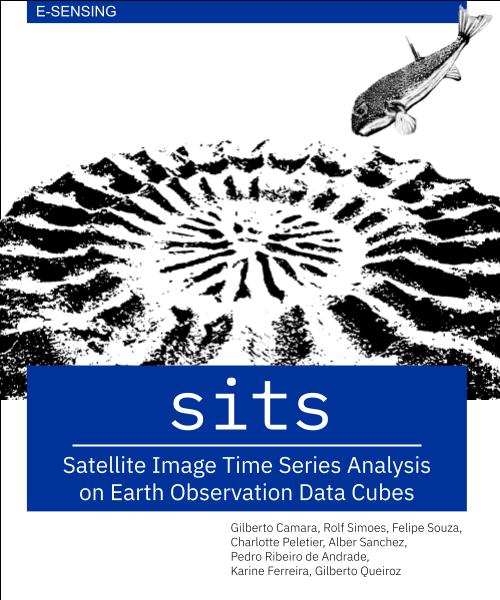

SITS - Satellite Image Time Series Analysis for Earth Observation Data
Cubes
================

### Contents of this repository

This repository contains Rmarkdown (.Rmd) files with the text of the book "Satellite Image Time Series Analysis on Earth Observation Data Cubes", which describes the `sits` package and also provides a conceptual background on the subject of big Earth observation data analysis,

### Overview of sits

`sits` is an open source R package for satellite image time series analysis. It enables users to apply machine learning techniques for classifying image time series obtained from earth observation data cubes. The package is available on [github](https://github.com/e-sensing/sits) and provides tools for analysis, visualization, and classification of satellite image time series. 

### Citation

If you use  this book on your work, please use this reference: 

Gilberto Camara, Rolf Simoes, Felipe Souza, Felipe Carlos, Charlotte Pelletier, Pedro R. Andrade, Karine Ferreira, and Gilberto Queiroz (2024). *Satellite Image Time Series Analysis on Earth Observation Data Cubes*. National Institute for Space Research (INPE), Brazil. Online book avaliable at https://github.com/e-sensing/sitsbook. [DOI: 10.5281/zenodo.13381515](https://zenodo.org/doi/10.5281/zenodo.13381515).

### Intellectual property rights

This book is licensed as [Attribution-NonCommercial-ShareAlike 4.0 International (CC BY-NC-SA 4.0)](https://creativecommons.org/licenses/by-nc-sa/4.0/) by Creative Commons. 

### How to contribute{-}

We welcome contributions. You may suggest corrections and improvements, and also provide whole chapters with case studies. The `sitsbook` project is released with a [Contributor Code of Conduct](https://github.com/e-sensing/sitsbook/blob/master/CODE_OF_CONDUCT.md).
By contributing to this project, you agree to abide by its terms.