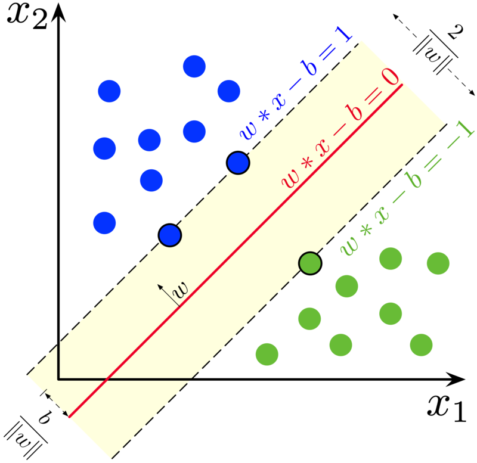
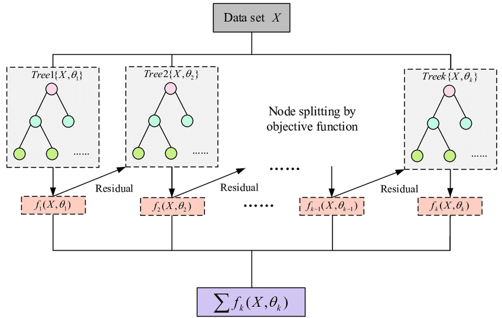
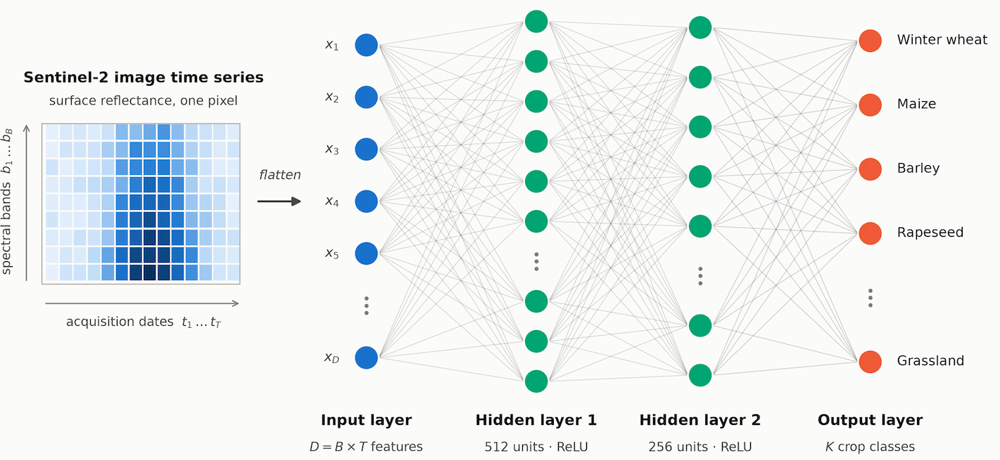
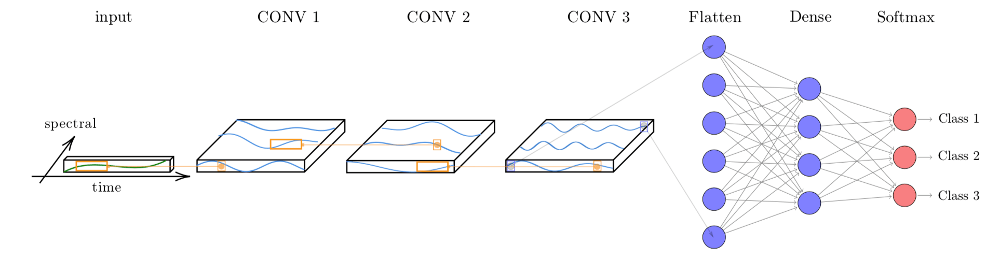
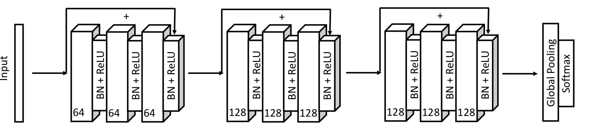
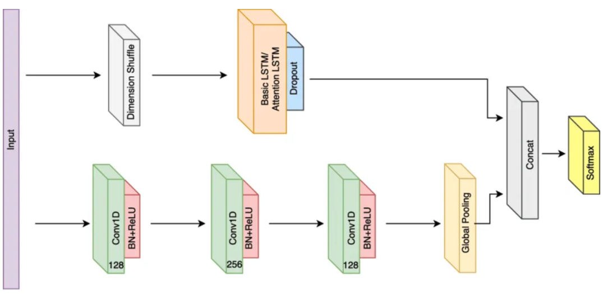
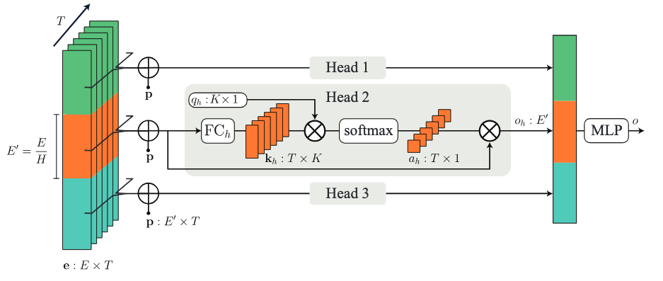

<a href="https://www.kaggle.com/code/esensing/machine-learning-algorithms-for-image-time-series" target="_blank">

</a>

### Configurations to run this chapter{-}

:::{.panel-tabset}
## R
```{r}
#| echo: true
#| eval: true
#| output: false
# load package "tibble"
library(tibble)
# load packages "sits" and "sitsdata"
library(sits)
library(sitsdata)
# set tempdir if it does not exist 
tempdir_r <- "~/sitsbook/tempdir/R/cl_machinelearning"
dir.create(tempdir_r, showWarnings = FALSE)
```
## Python
```{python}
#| echo: true
#| eval: true
#| output: false
# load "pysits" library
from pysits import *
from pathlib import Path
# set tempdir if it does not exist 
tempdir_py = Path.home() / "sitsbook/tempdir/Python/cl_machinelearning"
tempdir_py.mkdir(parents=True, exist_ok=True)
```
:::

## Data used in this chapter

The following examples show how to train machine learning methods and apply them to classify a single time series. We use the set `samples_matogrosso_mod13q1`, containing time series samples from the Brazilian Mato Grosso state obtained from the MODIS MOD13Q1 product. It has 1,837 samples and seven classes (`Cerrado`, `Forest`, `Pasture`, `Soy_Corn`, `Soy_Cotton`, `Soy_Fallow`, `Soy_Millet`). Each time series covers 12 months (23 data points) with six bands (NDVI, EVI, BLUE, RED, NIR, MIR). The samples are arranged along an agricultural year, starting in September and ending in August. They have been collected in different years to capture responses of the same land use and land cover classes under different climatological conditions. The dataset was used in the paper "Big Earth observation time series analysis for monitoring Brazilian agriculture" [@Picoli2018], and is available in the R package `sitsdata`. To illustrate the outcome of each algorithm, we show an example of a multi-temporal classification of a pixel in the Mato Grosso region, from the period 2000 to 2015.

## Common interface to machine learning and deep learning models

The `sits_train()` function provides a standard interface to all machine learning models. This function takes two mandatory parameters: the training data (`samples`) and the ML algorithm (`ml_method`). After the model is estimated, it can classify individual time series or data cubes with `sits_classify()`. In what follows, we show how to apply each method to classify a single time series. Then, in Chapter [Image classification in data cubes](https://e-sensing.github.io/sitsbook/cl_rasterclassification.html), we discuss how to classify data cubes.

Since `sits` is aimed at remote sensing users who are not machine learning experts, it provides a set of default values for all classification models. These settings have been chosen based on testing by the authors. Nevertheless, users can control all parameters for each model. Novice users can rely on the default values, while experienced ones can fine-tune model parameters to meet their needs. Model tuning is discussed at the end of this chapter.

When a set of time series organized as tibble is taken as input to the classifier, the result is the same tibble with one additional column (`predicted`), which contains the information on the labels assigned for each interval. The results can be shown in text format using the function `sits_show_prediction()` or graphically using `plot()`.

## Random Forest

Random Forest is a machine learning algorithm that uses an ensemble learning method for classification tasks. The algorithm consists of multiple decision trees, each trained on a different subset of the training data and with a different subset of features. To make a prediction, each decision tree in the forest independently classifies the input data. The final prediction is made based on the majority vote of all the decision trees. The randomness in the algorithm comes from the random subsets of data and features used to train each decision tree, which helps to reduce overfitting and improve the accuracy of the model. This classifier measures the importance of each feature in the classification task, which can be helpful in feature selection and data visualization. For an in-depth discussion of the robustness of Random Forest for satellite image time series classification, please see Pelletier et al. [@Pelletier2016].

```{r}
#| label: fig-ml-rf
#| echo: false
#| out-width: "90%"
#| fig-align: "center"
#| fig-cap: "Random forest algorithm (source: Venkata Jagannath in Wikipedia)."
knitr::include_graphics("./images/random_forest.png") 
```

`sits` provides `sits_rfor()`, which uses the R `randomForest` package [@Wright2017]; its main parameter is `num_trees`, which is the number of trees to grow with a default value of 100. The model can be visualized using `plot()`.

:::{.panel-tabset}
## R
```{r}
#| label: fig-ml-random-forest
#| cache: true
#| warning: false
#| fig-width: 7
#| fig-height: 5
#| fig-dpi: 300
#| fig-cap: |
#|   Most important variables in Random Forest model.
#| fig-align: center
#| out-width: 100%
set.seed(290356)

# Train the Mato Grosso samples with Random Forest algorithm
rfor_model <- sits_train(
    samples = samples_matogrosso_mod13q1, 
    ml_method = sits_rfor(num_trees = 100))

# Plot the most important variables of the model
plot(rfor_model)
```
## Python
```{python}
#| eval: false
r_set_seed(290356)

# Load samples
samples_matogrosso_mod13q1 = load_samples(
    name = "samples_matogrosso_mod13q1", 
    package = "sitsdata"
)

# Train the Mato Grosso samples with Random Forest algorithm
rfor_model = sits_train(
    samples = samples_matogrosso_mod13q1, 
    ml_method = sits_rfor(num_trees = 100))

# Plot the most important variables of the model
plot(rfor_model)
```
```{r}
#| echo: false
#| label: py-fig-ml-random-forest
#| cache: true
#| warning: false
#| fig-width: 7
#| fig-height: 5
#| fig-dpi: 300
#| fig-cap: |
#|   Most important variables in Random Forest model.
#| fig-align: center
#| out-width: 100%
# Plot the most important variables of the model
plot(rfor_model)
```
:::
The model plot shows the most important explanatory variables, which are the NDVI index on dates 21 (2007-07-28) and 22 (2007-08-13) and the NIR (near infrared) band and EVI index on date 17 (2007-05-25). The NDVI value at the end of July and beginning of August differentiates natural classes such as Forest and agricultural classes. NDVI values for Forest will have high values even in late July/early August during the dry season. By contrast, the crops will have been harvested by late July, leading to low NDVI values associated with bare soil. The NIR and EVI values at the end of May capture the growth of the second crop for double cropping classes. In general, the Random Forest algorithm will do a good job of separating natural land covers from temporary agriculture crops.


:::{.panel-tabset}
## R
```{r}
#| label: fig-pixel-random-forest
#| cache: true
#| warning: false
#| fig-width: 7
#| fig-height: 5
#| fig-dpi: 300
#| fig-cap: |
#|   Most important variables in Random Forest model.
#| fig-align: center
#| out-width: 100%
# Classify using Random Forest model and plot the result
point_class <- sits_classify(
    data = point_mt_mod13q1, 
    ml_model  = rfor_model)

plot(point_class, bands = c("NDVI", "EVI"))
```
## Python
```{python}
#| eval: false
# Load samples
point_mt_mod13q1 = load_samples(
    name = "point_mt_mod13q1", 
    package = "sitsdata"
)

# Classify using Random Forest model and plot the result
point_class = sits_classify(
    data = point_mt_mod13q1, 
    ml_model  = rfor_model)

plot(point_class, bands = ("NDVI", "EVI"))
```
```{r}
#| echo: false
#| label: py-fig-pixel-random-forest
#| cache: true
#| warning: false
#| fig-width: 7
#| fig-height: 5
#| fig-dpi: 300
#| fig-cap: |
#|   Most important variables in Random Forest model.
#| fig-align: center
#| out-width: 100%
plot(point_class, bands = c("NDVI", "EVI"))
```
:::

The result shows that the area started as a forest in 2000, was deforested from 2004 to 2005, used as pasture from 2006 to 2007, and for double-cropping agriculture from 2009 onwards. This behavior is consistent with expert evaluation of land change process in this region of Amazonia.

Random Forest is robust to outliers and can deal with irrelevant inputs [@Hastie2009]. The method tends to overemphasize some variables because its performance tends to stabilize after part of the trees is grown [@Hastie2009]. In cases where abrupt change occurs, such as deforestation mapping, Random Forest (if properly trained) will emphasize the temporal instances and bands that capture such quick change. Before using Random Forest, it is recommended that users balance their training samples as explained in ["Reducing imbalances in training samples"](https://e-sensing.github.io/sitsbook/ts_balance.html).

## Support vector machine

The support vector machine (SVM) classifier is a generalization of a linear classifier that finds an optimal separation hyperplane which minimizes misclassification [@Cortes1995]. Since a set of samples with $n$ features defines an n-dimensional feature space, hyperplanes are linear ${(n-1)}$-dimensional boundaries that define linear partitions in that space. If the classes are linearly separable on the feature space, there will be an optimal solution defined by the maximal margin hyperplane, which is the separating hyperplane that is farthest from the training observations [@James2013]. The maximal margin is computed as the smallest distance from the observations to the hyperplane. The solution for the hyperplane coefficients depends only on the samples that define the maximum margin criteria, the so-called support vectors.

```{r}
#| label: fig-ml-svm
#| echo: false
#| out-width: "50%"
#| fig-align: "center"
#| fig-cap: "Maximum-margin hyperplane and margins for an SVM trained with samples from two classes. Samples on the margin are called the support vectors. (source: Larhmam in Wikipedia)."
 
```

For data that is not linearly separable, SVM provides kernel functions that map the original feature space into a higher dimensional space. Despite having a linear boundary on the enlarged feature space, the new classification model generally translates its hyperplane to a nonlinear boundary in the original attribute space. Kernels are an efficient computational strategy to produce nonlinear boundaries in the input attribute space; thus, they improve training-class separation. SVM is one of the most widely used algorithms in machine learning applications and has been applied to classify remote sensing data [@Mountrakis2011].

In `sits`, SVM is implemented as a wrapper of `e1071` R package that uses the `LIBSVM` implementation [@Chang2011]. The `sits` package adopts the *one-against-one* method for multiclass classification. For a $q$ class problem, this method creates ${q(q-1)/2}$ SVM binary models, one for each class pair combination, testing any unknown input vectors throughout all those models. A voting scheme computes the overall result.

The example below shows how to apply SVM to classify time series using default values. The main parameters are `kernel`, which controls whether to use a nonlinear transformation (default is `radial`), `cost`, which measures the punishment for wrongly-classified samples (default is 10), and `cross`, which sets the value of the k-fold cross validation (default is 10).

:::{.panel-tabset}
## R
```{r}
#| label: fig-pixel-svm
#| cache: true
#| warning: false
#| fig-width: 7
#| fig-height: 5
#| fig-dpi: 300
#| fig-cap: |
#|   Classification of time series using SVM.
#| fig-align: center
#| out-width: 100%
set.seed(290356)

# Train an SVM model
svm_model <- sits_train(
    samples = samples_matogrosso_mod13q1, 
    ml_method = sits_svm())

# Classify using the SVM model and plot the result
point_class <- sits_classify(
    data = point_mt_mod13q1, 
    ml_model = svm_model)

# Plot the result
plot(point_class, bands = c("NDVI", "EVI"))
```
## Python
```{python}
#| eval: false
r_set_seed(290356)

# Load samples
samples_matogrosso_mod13q1 = load_samples(
    name = "samples_matogrosso_mod13q1", 
    package = "sitsdata"
)

# Train an SVM model
svm_model = sits_train(
    samples = samples_matogrosso_mod13q1, 
    ml_method = sits_svm())
    
# Load samples
point_mt_mod13q1 = load_samples(
    name = "point_mt_mod13q1", 
    package = "sitsdata"
)

# Classify using the SVM model and plot the result
point_class = sits_classify(
    data = point_mt_mod13q1, 
    ml_model = svm_model)

# Plot the result
plot(point_class, bands = ("NDVI", "EVI"))
```
```{r}
#| echo: false
#| label: py-fig-pixel-svm
#| cache: true
#| warning: false
#| fig-width: 7
#| fig-height: 5
#| fig-dpi: 300
#| fig-cap: |
#|   Classification of time series using SVM.
#| fig-align: center
#| out-width: 100%
plot(point_class, bands = c("NDVI", "EVI"))
```
:::

The SVM classifier is less stable and less robust to outliers than the Random Forest method. In this example, it tends to misclassify some of the data. In 2008, it is likely that the correct land class was still `Pasture` rather than `Soy_Millet` as produced by the algorithm, while the `Soy_Cotton` class in 2012 is also inconsistent with the previous and latter classification of `Soy_Corn`.

## Extreme gradient boosting

XGBoost (eXtreme Gradient Boosting) [@Chen2016] is an implementation of gradient boosted decision trees designed for speed and performance.  It is an ensemble learning method, meaning it combines the predictions from multiple models to produce a final prediction. XGBoost builds trees one at a time, where each new tree helps to correct errors made by previously trained trees. Each tree builds a new model to correct the errors made by previous models. Using gradient descent, the algorithm iteratively adjusts the predictions of each tree by focusing on instances where previous trees made errors. Models are added sequentially until no further improvements can be made. 

Although Random Forest and boosting use trees for classification, there are significant differences. While Random Forest builds multiple decision trees in parallel and merges them together later, XGBoost builds trees one at a time. In XGBoost, each new tree helps to correct errors made by previously trained trees. XGBoost is often preferred for its speed and performance, particularly on large datasets, and is well-suited for problems where precision is paramount. Random Forest, on the other hand, is simpler to implement, more interpretable, and can be more robust to overfitting, making it a good choice for general-purpose applications.

```{r}
#| label: fig-ml-xgb
#| echo: false
#| out-width: "90%"
#| fig-align: "center"
#| fig-cap: "Flow chart of XGBoost algorithm (source: Guo et al., Applied Sciences, 2020)." 
 
```

The boosting method starts from a weak predictor and then improves performance sequentially by fitting a better model at each iteration. It fits a simple classifier to the training data and uses the residuals of the fit to build a predictor. Typically, the base classifier is a regression tree. Although Random Forest and boosting use trees for classification, there are significant differences. The performance of Random Forest generally increases with the number of trees until it becomes stable. Boosting trees apply finer divisions over previous results to improve performance [@Hastie2009]. Some recent papers show that it outperforms Random Forest for remote sensing image classification [@Jafarzadeh2021]. However, this result is not generalizable since the quality of the training dataset controls actual performance.

In `sits`, the XGBoost method is implemented by the `sits_xgboost()` function, based on `XGBoost` R package, and has five hyperparameters that require tuning. The `sits_xgboost()` function takes the user choices as input to a cross-validation to determine suitable values for the predictor.

The learning rate `eta` varies from 0.0 to 1.0 and should be kept small (default is 0.3) to avoid overfitting. The minimum loss value `gamma` specifies the minimum reduction required to make a split. Its default is 0; increasing it makes the algorithm more conservative. The `max_depth` value controls the maximum depth of the trees. Increasing this value will make the model more complex and likely to overfit (default is 6). The `subsample` parameter controls the percentage of samples supplied to a tree. Its default is 1 (maximum). Setting it to lower values means that xgboost randomly collects only part of the data instances to grow trees, thus preventing overfitting. The `nrounds` parameter controls the maximum number of boosting iterations; its default is 100, which has proven to be enough in most cases. To follow the convergence of the algorithm, users can turn the `verbose` parameter on. In general, the results using the extreme gradient boosting algorithm are similar to the Random Forest method.

:::{.panel-tabset}
## R
```{r}
#| label: fig-pixel-xgb
#| cache: true
#| warning: false
#| fig-width: 7
#| fig-height: 5
#| fig-dpi: 300
#| fig-cap: |
#|   Classification of time series using XGBoost.
#| fig-align: center
#| out-width: 100%
set.seed(290356)

# Train using  XGBoost
xgb_model <- sits_train(
    samples = samples_matogrosso_mod13q1, 
    ml_method = sits_xgboost(verbose = FALSE))

# Classify using SVM model and plot the result
point_class_xgb <- sits_classify(
    data = point_mt_mod13q1, 
    ml_model = xgb_model)

# View classification
plot(point_class_xgb, bands = c("NDVI", "EVI"))
```
## Python
```{python}
#| eval: false
r_set_seed(290356)

# Load samples
samples_matogrosso_mod13q1 = load_samples(
    name = "samples_matogrosso_mod13q1", 
    package = "sitsdata"
)

# Train using  XGBoost
xgb_model = sits_train(
    samples = samples_matogrosso_mod13q1, 
    ml_method = sits_xgboost(verbose = False))
    
# Load samples
point_mt_mod13q1 = load_samples(
    name = "point_mt_mod13q1", 
    package = "sitsdata"
)

# Classify using SVM model and plot the result
point_class_xgb = sits_classify(
    data = point_mt_mod13q1, 
    ml_model = xgb_model)

# View classification
plot(point_class_xgb, bands = ("NDVI", "EVI"))
```
```{r}
#| echo: false
#| label: py-fig-pixel-xgb
#| cache: true
#| warning: false
#| fig-width: 7
#| fig-height: 5
#| fig-dpi: 300
#| fig-cap: |
#|   Classification of time series using XGBoost.
#| fig-align: center
#| out-width: 100%
plot(point_class_xgb, bands = c("NDVI", "EVI"))
```
:::

## Deep learning using multilayer perceptron

To support deep learning methods, `sits` uses the `torch` R package, which takes the Facebook `torch` C++ library as a back-end. Machine learning algorithms that use the R `torch` package are similar to those developed using `PyTorch`. The simplest deep learning method is multilayer perceptron (MLP), which are feedforward artificial neural networks. An MLP consists of three kinds of nodes: an input layer, a set of hidden layers, and an output layer. The input layer has the same dimension as the number of features in the dataset. The hidden layers attempt to approximate the best classification function. The output layer decides which class should be assigned to the input. In an MLP, all inputs are treated equally at first; based on iterative matching of training and test data, the backpropagation technique feeds information back to the initial layers to identify the most suitable combination of inputs that produces the best output.

```{r}
#| label: fig-ml-mlp
#| echo: false
#| cache: true
#| out-width: "90%"
#| fig-align: "center"
#| fig-cap: "Illustration of an MLP with two hidden layers." 
 
```


In `sits`, MLP models can be built using `sits_mlp()`. Since there is no established model for generic classification of satellite image time series, designing MLP models requires parameter customization. The most important decisions are the number of layers in the model and the number of neurons per layer. These values are set by the `layers` parameter, which is a list of integer values. The size of the list is the number of layers, and each element indicates the number of nodes per layer.

The choice of the number of layers depends on the inherent separability of the dataset to be classified. For datasets where the classes have different signatures, a shallow model (with three layers) may provide appropriate responses. More complex situations require models of deeper hierarchy. Models with many hidden layers may take a long time to train and may not converge. We suggest starting with three layers and test different options for the number of neurons per layer before increasing the number of layers. In our experience, using three to five layers is a reasonable compromise if the training data has a good quality. Further increase in the number of layers will not improve the model.

MLP models also need to include the activation function. The activation function of a node defines the output of that node given an input or set of inputs. Following standard practices [@Goodfellow2016], we use the `relu` activation function.

The optimization method (`optimizer`) represents the gradient descent algorithm to be used. These methods aim to maximize an objective function by updating the parameters in the opposite direction of the gradient of the objective function [@Ruder2016]. Since gradient descent plays a key role in deep learning model fitting, developing optimizers is an important topic of research [@Bottou2018]. Many optimizers have been proposed in the literature, and recent results are reviewed by Schmidt et al. [@Schmidt2021]. The Adamw optimizer provides a good baseline and reliable performance for general deep learning applications [@Kingma2017]. By default, all deep learning algorithms in `sits` use Adamw.

Another relevant parameter is the list of dropout rates (`dropout`). Dropout is a technique for randomly dropping units from the neural network during training [@Srivastava2014]. By randomly discarding some neurons, dropout reduces overfitting. Since a cascade of neural nets aims to improve learning as more data is acquired, discarding some neurons may seem like a waste of resources. In practice, dropout prevents an early convergence to a local minimum [@Goodfellow2016]. We suggest users experiment with different dropout rates, starting from small values (10-30%) and increasing as required.

The following example shows how to use `sits_mlp()`. The default parameters have been chosen based on a modified version of @Wang2017, which proposes using multilayer perceptron as a baseline for time series classification. These parameters are: (a) Three layers with 512 neurons each, specified by the parameter `layers`; (b) Using the "relu" activation function; (c) dropout rates of 40%, 30%, and 20% for the layers; (d) the "optimizer_adamw" as optimizer (default value); (e) a number of training steps (`epochs`) of 100; (f) a `batch_size` of 64, which indicates how many time series are used for input at a given step; and (g) a validation percentage of 20%, which means 20% of the samples will be randomly set aside for validation.

To simplify the output, the `verbose` option has been turned off. After the model has been generated, we plot its training history.

:::{.panel-tabset}

## R
```{r}
#| label: fig-ml-mlp_model
#| cache: true
#| warning: false
#| fig-width: 7
#| fig-height: 5
#| fig-dpi: 300
#| fig-cap: |
#|   Evolution of training accuracy of MLP model.
#| fig-align: center
#| out-width: 100%
# Set a seed for reproducibility
set.seed(290356)

# Train using an MLP model
# This is an example of how to set parameters
# First-time users should test default options first
mlp_model <- sits_train(
    samples = samples_matogrosso_mod13q1, 
    ml_method = sits_mlp(
        optimizer        = torch::optim_adamw, 
        layers           = c(512, 512, 512),
        dropout_rates    = c(0.40, 0.30, 0.20),
        epochs           = 80,
        batch_size       = 64,
        verbose          = FALSE,
        validation_split = 0.2)
)

# Show training evolution
plot(mlp_model)
```

## Python
```{python}
#| eval: false
# Set a seed for reproducibility
r_set_seed(290356)

# Load samples
samples_matogrosso_mod13q1 = load_samples(
    name = "samples_matogrosso_mod13q1", 
    package = "sitsdata"
)

# Train using an MLP model
# This is an example of how to set parameters
# First-time users should test default options first
mlp_model = sits_train(
    samples = samples_matogrosso_mod13q1,
    ml_method = sits_mlp(
        optimizer        = "torch::optim_adamw",
        layers           = (512, 512, 512),
        dropout_rates    = (0.40, 0.30, 0.20),
        epochs           = 80,
        batch_size       = 64,
        verbose          = False,
        validation_split = 0.2))

# Show training evolution
plot(mlp_model)
```
```{r}
#| echo: false
#| label: py-fig-ml-mlp_model
#| cache: true
#| warning: false
#| fig-width: 7
#| fig-height: 5
#| fig-dpi: 300
#| fig-cap: |
#|   Evolution of training accuracy of MLP model.
#| fig-align: center
#| out-width: 100%
# Show training evolution of the model
plot(mlp_model)
```
:::
Then, we classify a 16-year time series using the multilayer perceptron model.

:::{.panel-tabset}
## R
```{r}
#| label: fig-pixel-mlp_model
#| warning: false
#| cache: true
#| fig-width: 7
#| fig-height: 5
#| fig-dpi: 300
#| fig-cap: |
#|   Classification of time series using MLP.
#| fig-align: center
#| out-width: 100%
# Classify using MLP model and plot the result
point_class <- sits_classify(point_mt_mod13q1, mlp_model)
plot(point_class, bands = c("NDVI", "EVI"))
```
## Python
```{python}
#| eval: false
# Load samples
point_mt_mod13q1 = load_samples(
    name = "point_mt_mod13q1", 
    package = "sitsdata"
)
# Classify using MLP model
point_class = sits_classify(point_mt_mod13q1, mlp_model)

# Plot
plot(point_class, bands = ("NDVI", "EVI"))
```
```{r}
#| echo: false
#| label: py-fig-pixel-mlp_model
#| warning: false
#| cache: true
#| fig-width: 7
#| fig-height: 5
#| fig-dpi: 300
#| fig-cap: |
#|   Classification of time series using MLP.
#| fig-align: center
#| out-width: 100%
# Classify using MLP model and plot the result
plot(point_class, bands = c("NDVI", "EVI"))
```
:::

In theory, an MLP can capture more subtle changes than Random Forest and XGBoost. In this specific case, the result is similar to theirs. Although the model mixes the `Soy_Corn` and `Soy_Millet` classes, the distinction between their temporal signatures is quite subtle. Also it suggests the need to improve the number of samples. A second issue concerns the error in year 2004, where a deforestation event has been misclassified as `Soy_Cotton`. This error derives from the lack of an explicit `Deforestation` class in the labels used for training. The plot shows that the time series on year 2004 starts from a high NDVI value, corresponding to class `Forest`, which has a significant decrease during the year due to tree removal. In this example, the MLP model shows an increase in sensitivity compared to previous models. We recommend comparing different configurations since the MLP model is sensitive to changes in its parameters.

## Temporal Convolutional Neural Network (TempCNN)

Convolutional neural networks (CNN) are deep learning methods that apply convolution filters (sliding windows) to the input data sequentially. The Temporal Convolutional Neural Network (TempCNN) is a neural network architecture specifically designed to process sequential data such as time series. In the case of time series, a 1D CNN applies a moving temporal window to the time series to produce another time series as the result of the convolution.

The TempCNN architecture for satellite image time series classification is proposed by Pelletier et al. [@Pelletier2019].  It has three 1D convolutional layers and a final softmax layer for classification. The authors combine different methods to avoid overfitting and reduce the vanishing gradient effect, including dropout, regularization, and batch normalization. In the TempCNN reference paper [@Pelletier2019], the authors favorably compare their model with the Recurrent Neural Network proposed by Russwurm and Körner [@Russwurm2018]. @fig-ml-tcnn shows the architecture of the TempCNN model. TempCNN applies one-dimensional convolutions on the input sequence to capture temporal dependencies, allowing the network to learn long-term dependencies in the input sequence. Each layer of the model captures temporal dependencies at a different scale. Due to its multi-scale approach, TempCNN can capture complex temporal patterns in the data and produce accurate predictions.

```{r}
#| label: fig-ml-tcnn
#| echo: false
#| cache: true
#| warning: false
#| fig-width: 10
#| fig-height: 5
#| fig-dpi: 300
#| out-width: 100%
#| fig-align: "center"
#| fig-cap: |
#|   Structure of TempCNN architecture (source: [@Pelletier2019]).

```

The function `sits_tempcnn()` implements the model. The parameter `cnn_layers` controls the number of 1D-CNN layers and the size of the filters applied at each layer; the default values are three CNNs with 64 units. The parameter `cnn_kernels` indicates the size of the convolution kernels; the default is kernels of size 3. Activation for all 1D-CNN layers uses the "relu" function. The dropout rates for each 1D-CNN layer are controlled individually by the parameter `cnn_dropout_rates`. The default values are 20% for each layer.

The `optimizer` param selects the optimizer function to be used, which by default is `optim_adamw`, which is considered as a stable and reliable optimization function. The hyperparameters for the optimizer are defined by a list associated to `opt_hparams`, where `lr` is the learning rate of the optimizer, `eps` is a term added to improve numerical stability, and `weight_decay`: defines the strength of the L2 regularization method; it defines the penalty imposed to large weights in a neural network, to try to force weights to shrink toward zero during training. To improve convergence, after `lr_decay_epochs` the learning rate is reduced by a factor defined by the `lr_decay_rate` parameter. After a number of epochs without improvement (`patience`) the training stops. The `validation_split` controls the size of the test set relative to the full dataset. We recommend setting aside at least 20% of the samples for validation.

:::{.panel-tabset}
## R
```{r}
#| label: fig-tempcnn-training
#| cache: true
#| warning: false
#| fig-width: 7
#| fig-height: 5
#| fig-dpi: 300
#| fig-cap: |
#|   Training evolution of TempCNN model.
#| fig-align: center
#| out-width: 100%
# Set seed for 
set.seed(290356)
library(torch)

# Train using tempCNN
tempcnn_model <- sits_train(
    samples_matogrosso_mod13q1, 
    sits_tempcnn(
        cnn_layers           = c(64, 64, 64),
        cnn_kernels          = c(3, 3, 3),
        cnn_dropout_rates    = c(0.2, 0.2, 0.2),
        optimizer            = torch::optim_adamw,
        opt_hparams          = list(lr = 5e-04, 
                                    eps = 1e-08, 
                                    weight_decay = 1e-06),
        lr_decay_epochs      = 1,
        lr_decay_rate        = 0.95,
        patience             = 20,
        epochs               = 150,
        batch_size           = 64,
        validation_split     = 0.2,
        verbose              = FALSE))

# Show training evolution
plot(tempcnn_model)
```
## Python
```{python}
#| eval: false
r_set_seed(290356)

# Load samples
samples_matogrosso_mod13q1 = load_samples(
    name = "samples_matogrosso_mod13q1", 
    package = "sitsdata"
)

# Train using tempCNN
tempcnn_model = sits_train(
    samples_matogrosso_mod13q1, 
    sits_tempcnn(
        cnn_layers           = (64, 64, 64),
        cnn_kernels          = (3, 3, 3),
        cnn_dropout_rates    = (0.2, 0.2, 0.2),
        optimizer            = "torch::optim_adamw",
        opt_hparams          = dict(lr = 5e-04, 
                                    eps = 1e-08, 
                                    weight_decay = 1e-06),
        lr_decay_epochs      = 1,
        lr_decay_rate        = 0.95,
        patience             = 20,
        epochs               = 150,
        batch_size           = 64,
        validation_split     = 0.2,
        verbose              = False))

# Show training evolution
plot(tempcnn_model)
```
```{r}
#| echo: false
#| label: py-fig-tempcnn-training
#| cache: true
#| warning: false
#| fig-width: 7
#| fig-height: 5
#| fig-dpi: 300
#| fig-cap: |
#|   Training evolution of TempCNN model.
#| fig-align: center
#| out-width: 100%
# Show training evolution
plot(tempcnn_model)
```
:::

Using the TempCNN model, we classify a 16-year time series.

:::{.panel-tabset}
## R
```{r}
#| label: fig-tempcnn-pixel
#| cache: true
#| warning: false
#| fig-width: 7
#| fig-height: 5
#| fig-dpi: 300
#| fig-cap: |
#|   Classification of time series using TempCNN model.
#| fig-align: center
#| out-width: 100%
# Classify using TempCNN model and plot the result
point_class <- sits_classify(point_mt_mod13q1, tempcnn_model)
plot(point_class, bands = c("NDVI", "EVI"))
```
## Python
```{python}
#| eval: false
# Load samples
point_mt_mod13q1 = load_samples(
    name = "point_mt_mod13q1", 
    package = "sitsdata"
)
# Classify using TempCNN model and plot the result
point_class = sits_classify(point_mt_mod13q1, tempcnn_model)
plot(point_class, bands = ("NDVI", "EVI"))
```
```{r}
#| echo: false
#| label: py-fig-tempcnn-pixel
#| cache: true
#| warning: false
#| fig-width: 7
#| fig-height: 5
#| fig-dpi: 300
#| fig-cap: |
#|   Classification of time series using TempCNN model.
#| fig-align: center
#| out-width: 100%
# Classify using TempCNN model and plot the result
plot(point_class, bands = c("NDVI", "EVI"))
```
:::

The TempCNN model indicates the `Soy_Cotton` class as the most likely one in 2004. While this result is possibly wrong, it shows that the time series for 2004 is different from those of Forest and Pasture classes. One possible explanation is that there was forest degradation in 2004, leading to a signature that is a mix of forest and bare soil. In this case, including forest degradation samples could improve the training data. In our experience, TempCNN models are a reliable way of classifying image time series [@Simoes2021]. Recent work which compares different models also provides evidence that TempCNN models have satisfactory behavior, especially in the case of crop classes [@Russwurm2020].

## Residual 1D CNN networks (ResNet)

A residual 1D CNN network, also known as ResNet, is an extension of the standard 1D CNN architecture,  adding residual connections between the layers. Residual connections allow the network to learn residual mappings, which are the difference between the input and output of a layer. By adding these residual connections, the network can learn to bypass specific layers and still capture essential features in the data.

The Residual Network (ResNet) for time series classification was proposed by Wang et al. [@Wang2017], based on the idea of deep residual networks for 2D image recognition [@He2016]. The ResNet architecture comprises 11 layers, with three blocks of three 1D CNN layers each (see @fig-ml-rnet). Each block corresponds to a 1D CNN architecture. The output of each block is combined with a shortcut that links its output to its input, called a skip connection. The purpose of combining the input layer of each block with its output layer (after the convolutions) is to avoid the so-called "vanishing gradient problem". This issue occurs in deep networks as the neural network's weights are updated based on the partial derivative of the error function. If the gradient is too small, the weights will not be updated, stopping the training [@Hochreiter1998]. Skip connections aim to avoid vanishing gradients from occurring, allowing deep networks to be trained.

```{r}
#| label: fig-ml-rnet
#| echo: false
#| out-width: "100%"
#| fig-align: "center"
#| fig-cap: |
#|   Structure of ResNet architecture (source: [@Wang2017]).

```


In `sits`, the Residual Network is implemented using `sits_resnet()`. The default parameters are those proposed by Wang et al. [@Wang2017], as implemented by Fawaz et al. [@Fawaz2019]. The first parameter is `blocks`, which controls the number of blocks and the size of filters in each block. By default, the model implements three blocks, the first with 64 filters and the others with 128. The parameter `kernels` controls the size of the kernels of the three layers inside each block. It is useful to experiment a bit with these kernel sizes in the case of satellite image time series. The default activation is "relu", which is recommended in the literature to reduce the problem of vanishing gradients. The default optimizer is `optim_adamw`, available in package `torch`. The default values for the parameters are shown in the example below.

:::{.panel-tabset}
## R
```{r}
#| label: fig-ml-resnetmodel
#| cache: true
#| warning: false
#| fig-width: 7
#| fig-height: 5
#| fig-dpi: 300
#| out-width: "100%"
#| fig-align: "center"
#| fig-cap: |
#|    Training evolution of ResNet model.
# load the torch library
library(torch)
# Set seed for reproducibility
set.seed(290356)

# Train using ResNet
resnet_model <- sits_train(
    samples_matogrosso_mod13q1, 
    sits_resnet(
        blocks               = c(64, 128, 128),
        kernels              = c(7, 5, 3),
        optimizer            = torch::optim_adamw,
        opt_hparams          = list(lr = 0.001, 
                                    eps = 1e-08, 
                                    weight_decay = 1e-06),
        lr_decay_epochs      = 1,
        lr_decay_rate        = 0.95,
        patience             = 20,
        epochs               = 100,
        batch_size           = 64,
        validation_split     = 0.2,
        verbose              = FALSE)
)

# Show training evolution
plot(resnet_model)
```
## Python
```{python}
#| eval: false
# Set seed for reproducibility
r_set_seed(290356)

# Load samples
samples_matogrosso_mod13q1 = load_samples(
    name = "samples_matogrosso_mod13q1", 
    package = "sitsdata"
)

# Train using ResNet
resnet_model = sits_train(
    samples_matogrosso_mod13q1, 
    sits_resnet(
        blocks               = (64, 128, 128),
        kernels              = (7, 5, 3),
        optimizer            = "torch::optim_adamw",
        opt_hparams          = dict(lr = 0.001, 
                                    eps = 1e-08, 
                                    weight_decay = 1e-06),
        lr_decay_epochs      = 1,
        lr_decay_rate        = 0.95,
        patience             = 20,
        epochs               = 100,
        batch_size           = 64,
        validation_split     = 0.2,
        verbose              = False)
)
# Show training evolution
plot(resnet_model)
```
```{r}
#| label: py-fig-ml-resnetmodel
#| echo: false
#| cache: true
#| warning: false
#| fig-width: 7
#| fig-height: 5
#| fig-dpi: 300
#| out-width: "80%"
#| fig-align: "center"
#| fig-cap: |
#|    Training evolution of ResNet model.
plot(resnet_model)
```
:::

Using the ResNet model, we classify a 16-year time series.

:::{.panel-tabset}
## R
```{r}
#| label: fig-ml-resnetplot
#| cache: true
#| warning: false
#| fig-width: 7
#| fig-height: 5
#| fig-dpi: 300
#| out-width: "100%"
#| fig-align: "center"
#| fig-cap: |
#|   Classification of time series using ResNet.
# Classify a point using Resnet model 
point_class <- sits_classify(point_mt_mod13q1, resnet_model)
# Plot the result
plot(point_class, bands = c("NDVI", "EVI"))
```

## Python
```{python}
#| eval: false
# Load samples
point_mt_mod13q1 = load_samples(
    name = "point_mt_mod13q1", 
    package = "sitsdata"
)
# Classify using Resnet model
point_class = sits_classify(point_mt_mod13q1, resnet_model)
# Plot the result
plot(point_class, bands = ("NDVI", "EVI"))
```
```{r}
#| label: py-fig-ml-resnetplot
#| echo: false
#| cache: true
#| warning: false
#| fig-width: 7
#| fig-height: 5
#| fig-dpi: 300
#| out-width: "100%"
#| fig-align: "center"
#| fig-cap: |
#|   Classification of time series using ResNet.
plot(point_class, bands = c("NDVI", "EVI"))
```
:::


In this case, the result of the ResNet model is quite similar to that of the TempCNN model. In the same way as TempCNN, the ResNet algorithm tends to be better at detecting agricultural or natural forest classes. When it comes to situation where transitions happen during the classification period, as in the case of the transition from forest to pasture in 2004, Random Forest models tend to be more efficient than TempCNN or ResNet.

## Long Short-Term Memory Fully Convolutional Network (LSTM-FCN)

LSTM-FCN (Long Short-Term Memory Fully Convolutional Network) is a deep learning model designed for time series classification. It trains a **two-branch deep learning model** for classifying
satellite image time series. One branch is a Long Short-Term Memory (LSTM)
recurrent network; the other is a Fully Convolutional Network (FCN). The two
branches read the same time series in complementary ways, and their outputs are
merged before a final classification layer produces per-class probabilities [@Karim2019a].

The architecture combines two parallel blocks. An FCN block applies multiple temporal convolutional layers with batch normalization and ReLU activation to extract local features without needing pooling layers. An LSTM Block processes the input sequence through an LSTM cell to capture long-range temporal dependencies. The outputs from the convolutional blocks and the LSTM block are concatenated before passing to a final softmax classification layer.

In simple term, `sits_lstm_fcn()` hands this time series to two experts at the same time:

- The LSTM expert reads the series like a story, from beginning to end,
  remembering what happened earlier to make sense of what comes later. It is good
  at capturing the *order and timing* of events (for example, "greenness peaked
  late in the season").

- The FCN expert slides small "shape detectors" across the series, looking
  for characteristic local patterns --- a sudden rise, a dip, a plateau ---
  regardless of exactly when they occur. It is good at recognizing
  *distinctive shapes*.

A third component acts as a referee: it combines both experts' impressions
and outputs a probability for each possible land-cover class. During training,
the model is shown many labeled examples and gradually adjusts both experts and
the referee so that its answers match the known labels. Once trained, it can
label every pixel of a data cube. The overall design is shown in
@fig-ml-lstm-fcn-arch.

```{r}
#| label: fig-ml-lstm-fcn-arch
#| echo: false
#| cache: true
#| warning: false
#| fig-width: 7
#| fig-height: 5
#| fig-dpi: 300
#| out-width: "100%"
#| fig-align: "center"
#| fig-cap: |
#|   Architecture of LSTM-FCN algorithm (source: [@Karim2019a]).

```

The function `sits_lstm_fcn()` implements the model. The parameter `cnn_layers` controls the number of 1D-CNN layers and the size of the filters applied at each layer. The parameter `cnn_kernels` indicates the size of the convolution kernels. Activation for all 1D-CNN layers uses the "relu" function. The parameter `lstm_width` defines the number of neurons in the lstm hidden layer and `lstm_dropout` controls the dropout rate of the lstm layer.

The `optimizer` param selects the optimizer function to be used, which by default is `optim_adamw`, which is considered as a stable and reliable optimization function. The hyperparameters for the optimizer are defined by a list associated to `opt_hparams`, where `lr` is the learning rate of the optimizer, `eps` is a term added to improve numerical stability, and `weight_decay`: defines the strength of the L2 regularization method; it defines the penalty imposed to large weights in a neural network, to try to force weights to shrink toward zero during training. To improve convergence, after `lr_decay_epochs` the learning rate is reduced by a factor defined by the `lr_decay_rate` parameter. After a number of epochs without improvement (`patience`) the training stops. The `validation_split` controls the size of the test set relative to the full dataset. We recommend setting aside at least 20% of the samples for validation.


:::{.panel-tabset}
## R
```{r}
#| label: fig-lstm-fcn-training
#| cache: true
#| warning: false
#| fig-width: 7
#| fig-height: 5
#| fig-dpi: 300
#| fig-cap: |
#|   Training evolution of LSTM-FCN model.
#| fig-align: center
#| out-width: 100%
# Set seed for reproducibility
set.seed(290356)
library(torch)

# Train using LSTM-FCN
lstm_fcn_model <- sits_train(
    samples_matogrosso_mod13q1, 
    sits_lstm_fcn(
        cnn_layers           = c(64, 64, 64),
        cnn_kernels          = c(3, 3, 3),
        cnn_dropout_rates    = c(0.3, 0.3, 0.3),
        lstm_width           = 8,
        lstm_dropout         = 0.8,
        optimizer            = torch::optim_adamw,
        opt_hparams          = list(lr = 5e-04, 
                                    eps = 1e-08, 
                                    weight_decay = 1e-06),
        lr_decay_epochs      = 1,
        lr_decay_rate        = 0.95,
        patience             = 20,
        epochs               = 150,
        batch_size           = 64,
        validation_split     = 0.2,
        verbose              = FALSE)
)

# Show training evolution
plot(lstm_fcn_model)
```
## Python
```{python}
#| eval: false
r_set_seed(290356)

# Load samples
samples_matogrosso_mod13q1 = load_samples(
    name = "samples_matogrosso_mod13q1", 
    package = "sitsdata"
)

# Train using tempCNN
lstm_fcn_model = sits_train(
    samples_matogrosso_mod13q1, 
    sits_lstm_fcn(
        cnn_layers           = (64, 64, 64),
        cnn_kernels          = (3, 3, 3),
        cnn_dropout_rates    = (0.3, 0.3, 0.3),
        lstm_width           = 8,
        lstm_dropout         = 0.8,
        optimizer            = "torch::optim_adamw",
        opt_hparams          = dict(lr = 5e-04, 
                                    eps = 1e-08, 
                                    weight_decay = 1e-06),
        lr_decay_epochs      = 1,
        lr_decay_rate        = 0.95,
        patience             = 20,
        epochs               = 150,
        batch_size           = 64,
        validation_split     = 0.2,
        verbose              = False))

# Show training evolution
plot(lstm_fcn_model)
```
```{r}
#| echo: false
#| label: py-fig-lstm-fcn-training
#| cache: true
#| warning: false
#| fig-width: 7
#| fig-height: 5
#| fig-dpi: 300
#| fig-cap: |
#|   Training evolution of LSTM-FCN model.
#| fig-align: center
#| out-width: 100%
# Show training evolution
plot(lstm_fcn_model)
```
:::

Using the LSTM-FCN model, we classify a 16-year time series.

:::{.panel-tabset}
## R
```{r}
#| label: fig-lstm-fcn-pixel
#| cache: true
#| warning: false
#| fig-width: 7
#| fig-height: 5
#| fig-dpi: 300
#| fig-cap: |
#|   Classification of time series using LSTM-FCN model.
#| fig-align: center
#| out-width: 100%
# Classify using TempCNN model and plot the result
point_class <- sits_classify(point_mt_mod13q1, lstm_fcn_model)
plot(point_class, bands = c("NDVI", "EVI"))
```
## Python
```{python}
#| eval: false
# Load samples
point_mt_mod13q1 = load_samples(
    name = "point_mt_mod13q1", 
    package = "sitsdata"
)
# Classify using TempCNN model and plot the result
point_class = sits_classify(point_mt_mod13q1, lstm_fcn_model)
plot(point_class, bands = ("NDVI", "EVI"))
```
```{r}
#| echo: false
#| label: py-fig-lstm-fcn-pixel
#| cache: true
#| warning: false
#| fig-width: 7
#| fig-height: 5
#| fig-dpi: 300
#| fig-cap: |
#|   Classification of time series using LSTM-FCN model.
#| fig-align: center
#| out-width: 100%
# Classify using LSTM-FCN model and plot
plot(point_class, bands = c("NDVI", "EVI"))
```
:::

## Light Temporal Attention Encoder (LightTAE)

Attention mechanisms allow deep learning models to weight the elements of an input according to their relevance at each processing step, computing a weighted sum that emphasises the most informative parts of the signal. Introduced for tasks such as machine translation, image captioning, and speech recognition, they are now the dominant architecture for sequential data.

The motivation is that inputs are not equally informative. To translate the sentence "Look at all the lonely people", a system must relate "look" and "people" if the translation is to preserve the sentence's meaning. Transformers, a specific class of attention models, capture such dependencies between input and output sequences [@Vaswani2017]. Like other neural networks, they pair an encoder that maps textual inputs to numerical vectors with a decoder that produces outputs, but differ in two respects. Positional encoding assigns an index to each input element, preserving relative order throughout training and inference. Self-attention compares every word in a sentence with all others, including itself, thereby learning contextual relations. This design underpins large language models such as GPT-4 [@Bubeck2023].

Garnot et al. [@Garnot2020a] and Rußwurm and Körner [@Russwurm2020] extend attention to satellite image time series. Self-attention learns which temporal observations best discriminate land classes: for crops, the onset, peak, and end of the growing season; for deforestation, the dates of forest clearing.

Garnot and co-authors also proposed the Lightweight Temporal Self-Attention Encoder (LTAE) [@Garnot2020], which the authors claim can achieve high classification accuracy with fewer parameters compared to other neural network models. It is a good choice for applications where computational resources are limited.
Start from ordinary self-attention. Given a satellite image time series — one feature vector per acquisition date — classic self-attention has every date query every other date, producing one output vector per date, which you then have to pool into a single vector before classifying. That is a lot of computation for a summary you throw most of it away. LTAE's insight is that for classification you only ever need one summary vector for the whole sequence. So it removes the part that computes queries from the data.

```{r}
#| label: fig-ml-ltae-arch
#| echo: false
#| cache: true
#| warning: false
#| fig-width: 7
#| fig-height: 5
#| fig-dpi: 300
#| out-width: "100%"
#| fig-align: "center"
#| fig-cap: |
#|   Architecture of LTAE algorithm. The input sequence has  T vectors of size E, with H = 3 heads and keys of size K. The channels of the input embeddings are distributed among heads. Each head uses a learnt query $q^h$, while a linear layer FCh maps inputs to keys. The outputs of all heads are concatenated into a vector with the same size as the input embeddings, regardless of the number of heads (source: [@Garnot2020a]). 

```


As shown in @fig-ml-ltae-arch, the components of the LTAE model are:

1. A single learned "master query" per head: Instead of each date asking a question, each attention head owns one fixed question, learned during training and identical for every parcel. Think of it as "when in this series does the thing I care about happen?" — one head may learn to look for the green-up of a crop, another for the harvest, another for an abrupt drop in reflectance.

2. Each date answers with a key: A small linear layer turns each date's feature vector into a key. The dot product between the master query and each key becomes an attention score; a softmax over dates turns those scores into weights summing to one.

3. The output is a weighted average of the dates themselves: The values are the input embeddings directly — no value projection — so the head's output is literally the sequence, seen through the dates this head considers relevant.

4. Channel grouping instead of full projections: The E input channels are split into H non-overlapping groups of E/H, one per head. Each head sees only its slice, so heads are cheap and are forced to specialize on different features rather than duplicating each other.

5. Time is encoded as days, not positions: The positional encoding uses the number of days elapsed since the start of the series.

6. Concatenate and classify: The H head outputs are concatenated back to size E and passed through an MLP to the desired output dimension.

The payoff is extreme parsimony: a 9k-parameter LTAE beats a 110k-parameter TAE, a 700k-parameter TempCNN, and a 3M-parameter GRU on the Sentinel2-Agri crop dataset, reaching 94.3% overall accuracy and 51.7 mIoU with roughly a tenth of the computation. The attention weights are also directly readable — they tell you which dates the model used to make each decision.

The `sits_lighttae()` function implements this algorithm. The most important parameter to be set is the learning rate `lr`. Values ranging from 0.001 to 0.005 should produce good results. See also the section below on model tuning.


:::{.panel-tabset}
## R
```{r}
#| label: fig-ltae-training
#| cache: true
#| warning: false
#| fig-width: 7
#| fig-height: 5
#| fig-dpi: 300
#| fig-cap: |
#|   Training evolution of LTAE model.
#| fig-align: center
#| out-width: 100%
# Set seed 
set.seed(290356)
# Train a machine learning model using LTAE
ltae_model <- sits_train(
    samples_matogrosso_mod13q1, 
    sits_lighttae(
        epochs          = 150,
        batch_size      = 64,
        optimizer       = torch::optim_adamw,
        opt_hparams     = list(
            lr = 0.0005,
            eps = 1e-08,
            weight_decay = 7e-04
        ),
        lr_decay_epochs = 50L,
        lr_decay_rate   = 1.0,
        patience        = 20L,
        seed            = 290356,
        validation_split     = 0.2)
)
# Show training evolution
plot(ltae_model)
```
## Python
```{python}
#| eval: false
# Set seed 
r_set_seed(290356)

# Load samples
samples_matogrosso_mod13q1 = load_samples(
    name = "samples_matogrosso_mod13q1", 
    package = "sitsdata"
)
# Train a machine learning model using TAE
ltae_model = sits_train(
    samples_matogrosso_mod13q1, 
    sits_lighttae(
        epochs          = 150,
        batch_size      = 64,
        optimizer       = "torch::optim_adamw",
        opt_hparams     = dict(
            lr = 0.0005,
            eps = 1e-08,
            weight_decay = 7e-04
        ),
        lr_decay_epochs = 50L,
        lr_decay_rate   = 1.0,
        patience        = 20L,
        seed            = 290356,
        validation_split      = 0.2)
)
        
# Show training evolution
plot(ltae_model)
```
```{r}
#| label: py-fig-ltae-training
#| echo: false
#| cache: true
#| warning: false
#| fig-width: 7
#| fig-height: 5
#| fig-dpi: 300
#| fig-cap: |
#|   Training evolution of LTAE model.
#| fig-align: center
#| out-width: 100%
plot(ltae_model)
```
:::

Then, we classify a 16-year time series using the LightTAE model.

:::{.panel-tabset}
## R
```{r}
#| label: fig-ltae-class
#| cache: true
#| warning: false
#| fig-width: 7
#| fig-height: 5
#| fig-dpi: 300
#| fig-cap: |
#|   Classification of time series using LightTAE.
#| fig-align: center
#| out-width: 100%
# Classify using LTAE model and plot the result
point_class <- sits_classify(point_mt_mod13q1, ltae_model)
plot(point_class, bands = c("NDVI", "EVI"))
```
## Python
```{python}
#| eval: false
# Load samples
point_mt_mod13q1 = load_samples(
    name = "point_mt_mod13q1", 
    package = "sitsdata"
)
# Classify using LTAE model and plot the result
point_class = sits_classify(point_mt_mod13q1, ltae_model)
plot(point_class, bands = ("NDVI", "EVI"))
```
```{r}
#| echo: false
#| label: py-fig-ltae-class
#| cache: true
#| warning: false
#| fig-width: 7
#| fig-height: 5
#| fig-dpi: 300
#| fig-cap: |
#|   Classification of time series using LightTAE.
#| fig-align: center
#| out-width: 100%
# Classify using LTAE model and plot the result
plot(point_class)
```
:::

The behaviour of `sits_lighttae()` is similar to that of `sits_tempcnn()`. It points out the possible need for more classes and training data to better represent the transition period between 2004 and 2010. One possibility is that the training data associated with the Pasture class is only consistent with the time series between the years 2005 to 2008. However, the transition from Forest to Pasture in 2004 and from Pasture to Agriculture in 2009-2010 is subject to uncertainty since the classifiers do not agree on the resulting classes. In general, deep learning temporal-aware models are more sensitive to class variability than Random Forest and extreme gradient boosters.

## Summary

In this chapter, we present a description of the machine learning algorithms available in `sits`. The basic distinction is between time-sensitive algorithms such as LightTAE and TempCNN and those that do not consider the temporal order of values, such as Random Forest. In practice, we suggest that users take Random Forest as their baseline and then use LightTAE or TempCNN to try to improve classification accuracy.

## References{-}
