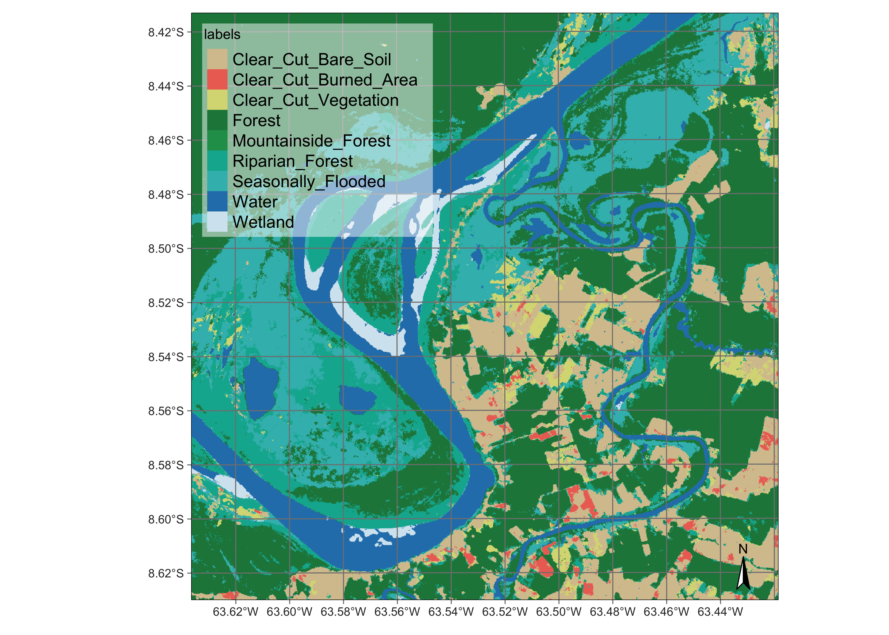

# Ensemble prediction from multiple models{-}


```
## SITS - satellite image time series analysis.
```

```
## Loaded sits v1.5.1.
##         See ?sits for help, citation("sits") for use in publication.
##         Documentation avaliable in https://e-sensing.github.io/sitsbook/.
```

```
## Loaded sitsdata data sets v1.2. Use citation("sitsdata") for use in publication.
```

```
## Loading required package: proxy
```

```
## 
## Attaching package: 'proxy'
```

```
## The following objects are masked from 'package:stats':
## 
##     as.dist, dist
```

```
## The following object is masked from 'package:base':
## 
##     as.matrix
```

```
## Loading required package: dtw
```

```
## Loaded dtw v1.23-1. See ?dtw for help, citation("dtw") for use in publication.
```

```
## dtwclust:
## Setting random number generator to L'Ecuyer-CMRG (see RNGkind()).
## To read the included vignettes type: browseVignettes("dtwclust").
## See news(package = "dtwclust") after package updates.
```

Ensemble prediction is a powerful technique for combining predictions from multiple models to produce more accurate and robust predictions. In general, ensemble predictions produce better predictions than using a single model. This is because the errors of individual models can cancel out or be reduced when combined with the predictions of other models. As a result, ensemble predictions can lead to better overall accuracy and reduce the risk of overfitting. This can be especially useful when working with complex or uncertain data. By combining the predictions of multiple models, users can identify which features or factors are most important for making accurate predictions. When using ensemble methods, choosing diverse models with different sources of error is important to ensure that the ensemble predictions are more accurate and robust.

The `sits` package provides `sits_combine_predictions()` to estimate ensemble predictions using probability cubes produced by `sits_classify()` and optionally post-processed with `sits_smooth()`. There are two ways to make ensemble predictions from multiple models:

* Averaging: In this approach, the predictions of each model are averaged to produce the final prediction. This method works well when the models have similar accuracy and errors. 

* Uncertainty: Predictions from different models are compared in terms of their uncertainties on a pixel-by-pixel basis; predictions with lower uncertainty are chosen as being more likely to be valid. 

In what follows, we will use the same dataset used in Chapter [Image classification in data cubes](https://e-sensing.github.io/sitsbook/image-classification-in-data-cubes.html) to illustrate how to produce an ensemble prediction. We will train three models: Random Forests (RF), Light Temporal Attention Encoder (LTAE), and Temporal Convolution Neural Networks (TempCNN), classify the cube with them, and then combine their results. The example uses three spectral indexes as attributes. We first run the RF classification.


``` r
# Files are available in a local directory
data_dir <- system.file("extdata/Rondonia-20LMR/", package = "sitsdata")
# Read data cube
ro_cube_20LMR <- sits_cube(
  source = "MPC",
  collection = "SENTINEL-2-L2A",
  data_dir = data_dir,
  bands = c("NDVI", "EVI", "NBR")
)
# select the NDVI EVI NBR indices from samples
samples_indices <- sits_select(samples_deforestation,
  bands = c("NDVI", "EVI", "NBR")
)
# train a random forest model
rfor_model <- sits_train(samples_indices, sits_rfor())

ro_cube_20LMR_rfor_probs <- sits_classify(
  ro_cube_20LMR,
  rfor_model,
  output_dir = "./tempdir/chp13",
  multicores = 6,
  memsize = 24,
  version = "rfor"
)

ro_cube_20LMR_rfor_bayes <- sits_smooth(
  ro_cube_20LMR_rfor_probs,
  output_dir = "./tempdir/chp13",
  multicores = 6,
  memsize = 24,
  version = "rfor"
)
ro_cube_20LMR_rfor_class <- sits_label_classification(
  ro_cube_20LMR_rfor_bayes,
  output_dir = "./tempdir/chp13",
  multicores = 6,
  memsize = 24,
  version = "rfor"
)
```


``` r
plot(ro_cube_20LMR_rfor_class,
  tmap_options = list("legend_text_size" = 0.71)
)
```

<div class="figure" style="text-align: center">

<p class="caption">(\#fig:unnamed-chunk-4)Land classification in Rondonia using a random forest algorithm  (Source: Authors).</p>
</div>

The next step is to classify the same area using a tempCNN algorithm, as shown below. 

``` r
# train a tempcnn model
tcnn_model <- sits_train(samples_indices, sits_tempcnn())

# classify the data cube
ro_cube_20LMR_tcnn_probs <- sits_classify(
  ro_cube_20LMR,
  tcnn_model,
  output_dir = "./tempdir/chp13",
  multicores = 2,
  memsize = 8,
  gpu_memory = 8,
  version = "tcnn"
)

ro_cube_20LMR_tcnn_bayes <- sits_smooth(
  ro_cube_20LMR_tcnn_probs,
  output_dir = "./tempdir/chp13",
  multicores = 2,
  memsize = 6,
  version = "tcnn"
)
ro_cube_20LMR_tcnn_class <- sits_label_classification(
  ro_cube_20LMR_tcnn_bayes,
  output_dir = "./tempdir/chp13",
  multicores = 2,
  memsize = 6,
  version = "tcnn"
)
```


``` r
plot(ro_cube_20LMR_tcnn_class,
  tmap_options = list("legend_text_size" = 0.7)
)
```

<div class="figure" style="text-align: center">

<p class="caption">(\#fig:unnamed-chunk-7)Land classification in Rondonia using tempCNN (Source: Authors).</p>
</div>

The third model is the Light Temporal Attention Encoder (LTAE), which has been discussed. 

``` r
# train a tempcnn model
ltae_model <- sits_train(samples_indices, sits_lighttae())

# classify the data cube
ro_cube_20LMR_ltae_probs <- sits_classify(
  ro_cube_20LMR,
  ltae_model,
  output_dir = "./tempdir/chp13",
  multicores = 2,
  memsize = 8,
  gpu_memory = 8,
  version = "ltae"
)

ro_cube_20LMR_ltae_bayes <- sits_smooth(
  ro_cube_20LMR_ltae_probs,
  output_dir = "./tempdir/chp13",
  multicores = 2,
  memsize = 6,
  version = "ltae"
)
ro_cube_20LMR_ltae_class <- sits_label_classification(
  ro_cube_20LMR_ltae_bayes,
  output_dir = "./tempdir/chp13",
  multicores = 2,
  memsize = 6,
  version = "ltae"
)
```


``` r
plot(ro_cube_20LMR_ltae_class,
  tmap_options = list("legend_text_size" = 0.7)
)
```

<div class="figure" style="text-align: center">

<p class="caption">(\#fig:unnamed-chunk-10)Land classification in Rondonia using tempCNN (Source: Authors).</p>
</div>

To understand the differences between the results, it is useful to compare the resulting class areas produced by the different algorithms.


``` r
# get the summary of the map produced by RF
sum1 <- summary(ro_cube_20LMR_rfor_class) |>
  dplyr::select("class", "area_km2")
colnames(sum1) <- c("class", "rfor")
# get the summary of the map produced by TCNN
sum2 <- summary(ro_cube_20LMR_tcnn_class) |>
  dplyr::select("class", "area_km2")
colnames(sum2) <- c("class", "tcnn")
# get the summary of the map produced by LTAE
sum3 <- summary(ro_cube_20LMR_ltae_class) |>
  dplyr::select("class", "area_km2")
colnames(sum3) <- c("class", "ltae")
# compare class areas of non-smoothed and smoothed maps
dplyr::inner_join(sum1, sum2, by = "class") |>
  dplyr::inner_join(sum3, by = "class")
```

```
#> # A tibble: 9 × 4
#>   class                    rfor  tcnn  ltae
#>   <chr>                   <dbl> <dbl> <dbl>
#> 1 Clear_Cut_Bare_Soil    74      67    59  
#> 2 Clear_Cut_Burned_Area   4.1     9.7   6.1
#> 3 Clear_Cut_Vegetation   12      10    26  
#> 4 Forest                280     270   220  
#> 5 Mountainside_Forest     0.014   2     0  
#> 6 Riparian_Forest        43      55    96  
#> 7 Seasonally_Flooded     88      90    94  
#> 8 Water                  67      76    68  
#> 9 Wetland                11       0    12
```


The study area presents many challenges for land classification, given the presence of wetlands, riparian forests and seasonally-flooded areas. The results show the algorithms obtain quite different results, since each model has different sensitivities. The RF method is biased towards the most frequent classes, especially for `Clear_Cut_Bare_Soil` and `Forest`. The area estimated by RF for class `Clear_Cut_Burned_Area` is the smallest of the three models. Most pixels assigned by LTAE and TCNN as burned areas are assigned by RF as being areas of bare soil.  The RF algorithm tends to be more conservative. The reason is because RF decision-making uses values from single attributes (values of a single band in a given time instance), while LTAE and TCNN consider the relations between instances of the time series. Since the RF model is sensitive to the response of images at the end of the period, it tends to focus on values that indicate the presence of forests and bare soils during the dry season, which peaks in August. The LTAE model is more balanced to the overall separation of classes in the entire attribute space, and produces larger estimates of riparian and seasonally flooded forest than the other methods. In contrast, both LTAE and TCNN make more mistakes than RF in including flooded areas in the center-left part of the image on the left side of the rives as `Clear_Cut_Vegetation` when the right label would be riparian or flooded forests. 

Given the differences and complementaries between the three predicted outcomes, combining them using `sits_combine_predictions()` is useful. This function takes the following arguments: (a) `cubes`, a list of the cubes to be combined. These cubes should be probability cubes generated by which optionally may have been smoothened; (b) `type`, which indicates how to combine the probability maps. The options are `average`, which performs a weighted mean of the probabilities, and  `uncertainty`, which uses the uncertainty cubes to combine the predictions; (c) `weights`, a vector of weights to be used to combine the predictions when `average` is selected; (d) `uncertainty_cubes`, a list of uncertainty cubes associated to the predictions;  (e) `multicores`, number of cores to be used; (f) `memsize`, RAM used in the classification; (g) `output_dir`, the directory where the classified raster files will be written.


``` r
# Combine the two predictions by taking the average of the probabilities for each class
ro_cube_20LMR_average_probs <- sits_combine_predictions(
  cubes = list(
    ro_cube_20LMR_tcnn_bayes,
    ro_cube_20LMR_rfor_bayes,
    ro_cube_20LMR_ltae_bayes
  ),
  type = "average",
  version = "average-rfor-tcnn-ltae",
  output_dir = "./tempdir/chp13/",
  weights = c(0.33, 0.34, 0.33),
  memsize = 16,
  multicores = 4
)
# Label the average probability cube
ro_cube_20LMR_average_class <- sits_label_classification(
  cube = ro_cube_20LMR_average_probs,
  output_dir = "./tempdir/chp13/",
  version = "average-rfor-tcnn-ltae",
  memsize = 16,
  multicores = 4
)
```


``` r
# Plot the second version of the classified cube
plot(ro_cube_20LMR_average_class,
  tmap_options = list("legend_text_size" = 0.7)
)
```

<div class="figure" style="text-align: center">

<p class="caption">(\#fig:unnamed-chunk-13)Land classification in Rondonia using the average of the probabilities produced by Random Forest and SVM algorithms (Source: Authors).</p>
</div>

We can also consider the class areas produced by the ensemble combination and compare them to the original estimates.


``` r
# get the summary of the map produced by LTAE
sum4 <- summary(ro_cube_20LMR_average_class) |>
  dplyr::select("class", "area_km2")
colnames(sum4) <- c("class", "ave")
# compare class areas of non-smoothed and smoothed maps
dplyr::inner_join(sum1, sum2, by = "class") |>
  dplyr::inner_join(sum3, by = "class") |>
  dplyr::inner_join(sum4, by = "class")
```

```
#> # A tibble: 9 × 5
#>   class                    rfor  tcnn  ltae    ave
#>   <chr>                   <dbl> <dbl> <dbl>  <dbl>
#> 1 Clear_Cut_Bare_Soil    74      67    59    68   
#> 2 Clear_Cut_Burned_Area   4.1     9.7   6.1   5.5 
#> 3 Clear_Cut_Vegetation   12      10    26    16   
#> 4 Forest                280     270   220   250   
#> 5 Mountainside_Forest     0.014   2     0     0.11
#> 6 Riparian_Forest        43      55    96    66   
#> 7 Seasonally_Flooded     88      90    94    91   
#> 8 Water                  67      76    68    68   
#> 9 Wetland                11       0    12    10
```

As expected, the ensemble map combines information from the three models. Taking the RF model prediction as a base, there is a reduction in the areas of classes `Clear_Cut_Bare_Soil` and `Forest`, confirming the tendency of the RF model to overemphasize the most frequent classes. The LTAE and TempCNN models are more sensitive to class variations and capture time-varying classes such as `Riparian_Forest` and `Clear_Cut_Burned_Area` in more detail than the RF model. However, both TempCNN and LTAE tend to confuse the deforestation-related class `Clear_Cut_Vegetation` and the natural class `Riparian_Forest` more than the RF model. This effect is evident in the left bank of the Madeira river in the centre-left region of the image. Also, both the LTAE and TempCNN maps are more grainy and have more spatial variability than the RF map.

The average map provides a compromise between RF's strong empahsis on the most frequent classes and the tendency of deep learning methods to produce outliers based on temporal relationship. The average map is less grainy and more spatially consistent than the LTAE and TempCNN maps, while introducing variability which is not present in the RF map. 

This chapter shows the possibilities of ensemble prediction. There are many ways to get better results than those presented here. Increasing the number of spectral bands would improve the final accuracy. Also, Bayesian smoothing for deep learning models should not rely on default parameters; rather it needs to rely on variance analysis, increase the spatial window and provide more informed hyperparameters. 

In general, ensemble prediction should be consider in all situations where one is not satisfied with the results of individual models. Combining model output increses the reliability of the result and thus shouls be considered in all situations where similar classes are present.


