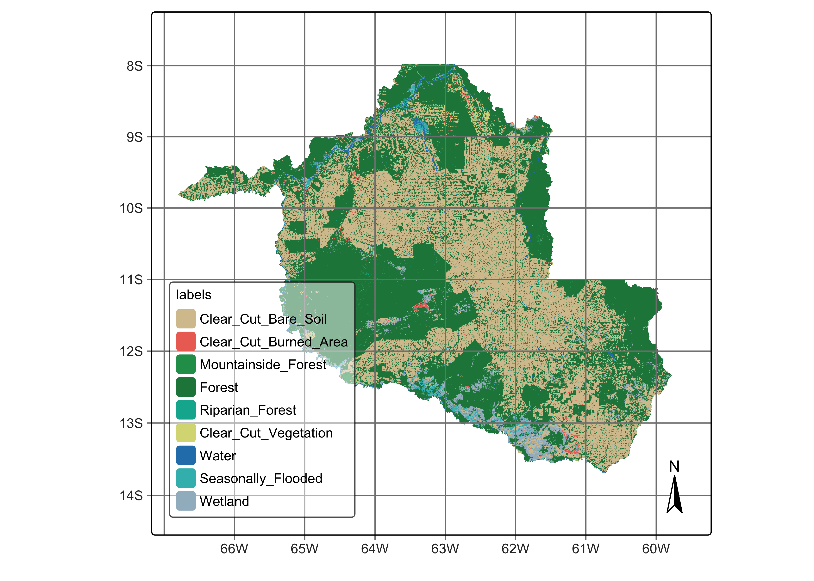

# Validation and accuracy measurements{-}


## Introduction{-}

Statistically robust and transparent approaches for assessing accuracy and estimating the area of change are essential to maintain the integrity of land change information. The `sits` packages supports a set of “good practice” recommendations for designing and implementing an accuracy assessment of a change map and estimating the area based on reference sample data. These recommendations address three major components: sampling design, response design, and analysis [@Olofsson2014].
.
The sampling design is implemented as a random stratified approach, ensure that every land use and land cover class in the population is included in the sample. Design-based inference methods provide support for sampling designs that provide making unbiased estimates. Each of the evaluation samples needs to be evaluated accurately, using high-quality reference data, ideally collected through field visits or high-resolution imagery, to validate classifications. In this way, we obtain a “reference classification” which is more accurate than the map classification being evaluated. 

The accuracy assessment is reported as an error matrix in terms of the proportion of area and estimates of overall accuracy, user’s accuracy and producer’s accuracy. Based on the error matrix, it is possible to estimate the proportion of each class and to adjust for classification errors. The estimated area includes confidence intervals.  

## Example data set{-} 

Our study area is the state of Rondonia (RO) in the Brazilian Amazon, which has a total area of \SI{237576}{\kilo\metre\squared}. According to official Brazilian government statistics, as of 2021, there are \SI{125752.41}{\kilo\metre\squared} of tropical forests in RO, which corresponds to 53\% of the state's total area. Significant human occupation started in 1970, led by settlement projects promoted by then Brazil's military government [@Alves2003]. Small and large-scale cattle ranching occupies most deforested areas. Deforestation in Rondonia is highly fragmented, partly due to the original occupation by small settlers. Such fragmentation poses considerable challenges for automated methods to distinguish between clear-cut and highly degraded areas. While visual interpreters rely upon experience and field knowledge, researchers must carefully train automated methods to achieve the same distinction.

We used Sentinel-2 and Sentinel-2A ARD (analysis ready) images from 2022-01-01 to 2022-12-31. Using all 10 spectral bands, we produced a regular data cube with a 16-day interval, with 23 instances per year. The best pixels for each period were selected to obtain as low cloud cover as possible. Persistent cloud cover pixels remaining in each period are then temporally interpolated to obtain estimated values. As a result, each pixel is associated with a valid time series. To fully cover RO, we used 41 MGRS tiles; the final data cube has 1.1 TB.  

The work considered nine LUCC classes: (a) stable  natural land cover, including \textit{Natural Forest} and \textit{Water Bodies}; (b) events associated with clear-cuts, including \textit{Clear Cut with Vegetation}, \textit{Clear Cut with Bare Soil}, and \textit{Clear Cut with Burned Area}; (c) natural areas with seasonal variability, including \textit{Wetlands}, \textit{Seasonally-flooded Forest}, and \textit{Riparian Forest}; (d) stable forest areas subject to topographic effects, including \textit{Mountainside Forest}.  

In this chapter, we will take the classification map as our starting point for accuracy assessment. This map can be retrieved from the `sitsdata` package as follows.


``` r
# define the classes of the probability cube
labels <- c(
  "1" = "Clear_Cut_Bare_Soil",
  "2" = "Clear_Cut_Burned_Area",
  "3" = "Mountainside_Forest",
  "4" = "Forest",
  "5" = "Riparian_Forest",
  "6" = "Clear_Cut_Vegetation",
  "7" = "Water",
  "8" = "Seasonally_Flooded",
  "9" = "Wetland"
)

# directory where the data is stored
data_dir <- system.file("extdata/Rondonia-Class-2022-Mosaic/", package = "sitsdata")
# create a probability data cube from a file
rondonia_2022_class <- sits_cube(
  source = "MPC",
  collection = "SENTINEL-2-L2A",
  data_dir = data_dir,
  bands = "class",
  labels = labels,
  version = "mosaic"
)
```


``` r
# plot the classification map
plot(rondonia_2022_class)
```

<div class="figure" style="text-align: center">

<p class="caption">(\#fig:valromosaic)Classified mosaic for land cover in Rondonia, Brazil for 2022 (source: authors).</p>
</div>


## Stratified sampling design and allocation{-} 

The sampling design outlines the method for selecting a subset of the map, which serves as the foundation for the accuracy assessment. The subset needs to satisfy a compromise between statistical and practical consideration. The subset needs to provide enough data for statistically-valid quality assessment, and also ensure that each element of the the sample can be evaluated correctly. Selection of the sample size thus combines an expected level of user's accuracy for each class with a viable choice of size and location. 

Following the recommended best practices for estimating accuracy of LUCC maps [@Olofsson2014], `sits` uses Cochran's method for stratified random sampling [@Cochran1977]. The method divides the population into homogeneous subgroups, or strata, and then applying random sampling within each stratum. In the case of LUCC, we take the classification map as the basis for the stratification. The area occupied by each class is considered as an homogeneous subgroup. Cochran's method for stratified random sampling helps to increase the precision of the estimates by reducing the overall variance, particularly when there is significant variability between strata but relatively less variability within each stratum.

To determine the overall number of samples to measure accuracy, we use the following formula [@Cochran1977]:

$$
n = \left( \frac{\sum_{i=1}^L W_i S_i}{S(\hat{O})} \right)^2
$$
where

- $L$ is the number of classes
- $S(\hat{O})$ is the expected standard error of the accuracy estimate
- $S_i$ is the standard deviation of the estimated area for class $i$
- $W_i$ is is the mapped proportion of area of class $i$

The standard deviation per class (stratum) is estimated based on the expected user's accuracy $U_i$ for each class as 

$$
S_i = \sqrt{U_i(1 - U_i)}
$$

Therefore, the total number of samples depends on the assumptions about the user's accuracies $U_i$ and the expected standard error $S(\hat{O})$. Once the sample size is estimated, there are several methods for allocating samples per class[@Olofsson2014]. One option is proportional allocation, when sample size in each stratum is proportional to the stratum’s size in the population. In land use mapping, some classes often have small areas compared to the more frequent ones. Using proportional allocation, rare classes will have small sample sizes decreasing their accuracy. Another option is equal allocation, where all classes will have the same number of samples; however, equal allocation may fail to capture the natural variation of classes with large areas.

As alternatives to proportional and equal allocation, [@Olofsson2014] suggests ad-hoc approaches where each class is assigned a minimum number of samples. He proposes three allocations where 50, 75 and 100 sample units are allocated to the less common classes, and proportional allocation is used for more frequent ones. These allocation methods should be considered as suggestions, and users should be flexible to select alternative sampling designs. 

The allocation methods proposed by [@Olofsson2014] are supported by function `sits_sampling_design()`, which has the following parameters:

- `cube`: a classified data cube;
- `expected_ua`: a named vector with the expected user's accuracies for each class;
- `alloc_options`: fixed sample allocation for rare classes;
- `std_err`: expected standard error of the accuracy estimate;
- `rare_class_prop`: proportional area limit to determine which are the rare classes.

In the case of Rondonia, the following sampling design was adopted.


``` r
ro_sampling_design <- sits_sampling_design(
  cube = rondonia_2022_class,
  expected_ua = c(
    "Clear_Cut_Bare_Soil" = 0.75,
    "Clear_Cut_Burned_Area" = 0.70,
    "Mountainside_Forest" = 0.70,
    "Forest" = 0.75,
    "Riparian_Forest" = 0.70,
    "Clear_Cut_Vegetation" = 0.70,
    "Water" = 0.70,
    "Seasonally_Flooded" = 0.70,
    "Wetland" = 0.70
  ),
  alloc_options = c(120, 100),
  std_err = 0.01,
  rare_class_prop = 0.1
)
# show sampling desing
ro_sampling_design
```

```
#>                       prop        expected_ua std_dev equal alloc_120 alloc_100
#> Clear_Cut_Bare_Soil   0.3841309   0.75        0.433   210   438       496      
#> Clear_Cut_Burned_Area 0.004994874 0.7         0.458   210   120       100      
#> Clear_Cut_Vegetation  0.009201698 0.7         0.458   210   120       100      
#> Forest                0.538726    0.75        0.433   210   614       696      
#> Mountainside_Forest   0.004555433 0.7         0.458   210   120       100      
#> Riparian_Forest       0.005482552 0.7         0.458   210   120       100      
#> Seasonally_Flooded    0.007677294 0.7         0.458   210   120       100      
#> Water                 0.007682599 0.7         0.458   210   120       100      
#> Wetland               0.03754864  0.7         0.458   210   120       100      
#>                       alloc_prop
#> Clear_Cut_Bare_Soil   727       
#> Clear_Cut_Burned_Area 9         
#> Clear_Cut_Vegetation  17        
#> Forest                1019      
#> Mountainside_Forest   9         
#> Riparian_Forest       10        
#> Seasonally_Flooded    15        
#> Water                 15        
#> Wetland               71
```
The next step is to chose one of the options for sampling design to generate a set of points for stratified sampling. These points can then be used for accuracy assessment. This is achieved by function `sits_stratified_sampling()` which takes the following parameters: 

- `cube`: a classified data cube;
- `sampling_design`: the output of function `sits_sampling_design()`;
- `alloc`: one of the sampling allocation options produced by `sits_sampling_design()`;
- `overhead`: additional proportion of number of samples per class (see below);
- `multicores`:  number of cores to run the function in parallel;
- `shp_file`: name of shapefile to save results for later use (optional);
- `progress`: show progress bar?

In the example below, we chose the "alloc_120" option from the sampling design to generate a set of stratified samples. The output of the function is an `sf` object with points with location (latitude and longitude) and class assigned in the map. We can also generate a SHP file with the sample information. The script below shows how to usee `sits_stratified_sampling()` and also how to convert an `sf` object to a CSV file. 


``` r
ro_samples_sf <- sits_stratified_sampling(
  cube = rondonia_2022_class,
  sampling_design = ro_sampling_design,
  alloc = "alloc_120",
  multicores = 4,
  shp_file = "./tempdir/chp11/ro_samples.shp"
)
```

```
#> Deleting layer `ro_samples' using driver `ESRI Shapefile'
#> Writing layer `ro_samples' to data source 
#>   `./tempdir/chp11/ro_samples.shp' using driver `ESRI Shapefile'
#> Writing 2254 features with 1 fields and geometry type Point.
```

``` r
# save sf object as CSV file
sf::st_write(ro_samples_sf,
  "./tempdir/chp11/ro_samples.csv",
  layer_options = "GEOMETRY=AS_XY",
  append = FALSE
)
```

```
#> Writing layer `ro_samples' to data source 
#>   `./tempdir/chp11/ro_samples.csv' using driver `CSV'
#> options:        GEOMETRY=AS_XY 
#> Writing 2254 features with 1 fields and geometry type Point.
```

Using the CSV file (or the optional shapefile) users can visualize the points in a standard GIS such as QGIS. For each point, they will indicate what is the correct class. In this way, they will obtain a confusion matrix which will be used for accuracy assessment. The `overhead` parameter is useful for users to discard border or doubtful pixels where the interpreter cannot be confident of her class assignment. By discarding points whose attribution is uncertain, they will improve the quality of the assessment. 

After all sampling points are labelled in QGIS (or similar), users should produce a CSV file, a SHP file, a data frame, or an `sf` object,  with at least three columns: `latitude`, `longitude` and `label`. See the next section for an example on how to use this data set for accuracay assessment.

## Accuracy assessment of classified images{-}

To measure the accuracy of classified images, `sits_accuracy()` uses an area-weighted technique, following the best practices proposed by Olofsson et al. [@Olofsson2013]. The need for area-weighted estimates arises because the land classes are not evenly distributed in space. In some applications (e.g., deforestation) where the interest lies in assessing how much of the image has changed, the area mapped as deforested is likely to be a small fraction of the total area. If users disregard the relative importance of small areas where change is taking place, the overall accuracy estimate will be inflated and unrealistic. For this reason, Olofsson et al.  argue that "mapped areas should be adjusted to eliminate bias attributable to map classification error, and these error-adjusted area estimates should be accompanied by confidence intervals to quantify the sampling variability of the estimated area" [@Olofsson2013].

With this motivation, when measuring the accuracy of classified images, `sits_accuracy()` follows the procedure set by Olofsson et al. [@Olofsson2013]. Given a classified image and a validation file, the first step calculates the confusion matrix in the traditional way, i.e., by identifying the commission and omission errors. Then it calculates the unbiased estimator of the proportion of area in cell $i,j$ of the error matrix

$$
\hat{p_{i,j}} = W_i\frac{n_{i,j}}{n_i},
$$
where the total area of the map is $A_{tot}$, the mapping area of class $i$ is $A_{m,i}$ and the proportion of area mapped as class $i$ is $W_i = {A_{m,i}}/{A_{tot}}$. Adjusting for area size allows producing an unbiased estimation of the total area of class $j$, defined as a stratified estimator
$$
\hat{A_j} = A_{tot}\sum_{i=1}^KW_i\frac{n_{i,j}}{n_i}.
$$

This unbiased area estimator includes the effect of false negatives (omission error) while not considering the effect of false positives (commission error). The area estimates also allow for an unbiased estimate of the user's and producer's accuracy for each class. Following Olofsson et al. @Olofsson2013, we provide the 95% confidence interval for $\hat{A_j}$. 

To produce the adjusted area estimates for classified maps, `sits_accuracy()` uses the following parameters:

- `data`: a classified data cube;
- `validation`:  a CSV file, SHP file, GPKG file, `sf` object or data frame containing at least three columns: `latitude`, `longitude` and `label`, containing a set of well-selected labeled points obtained from the samples suggested by `sits_stratified_sample()`.  

In the example below, we use a validation set produced by the researchers which produced the Rondonia data set, described above. We selected this data set both to serve as an example of `sits_accuracy()` and to illustrate the pitfalls of using visual interpretation of results of image time series classification. In this case, the validation team used an image from a single date late in 2022 to assess the results. This choice is not adequate for assessing results of time series classification. In many cases, including the example used in this chapter, the training set includes transitional classes such as `Clear_Cut_Burned_Area` and `Clear_Cut_Vegetation`. The associated samples refer to events that occur in specific times of the year. An area may start the year as a `Forest` land cover, only to be cut and burned during the peak of the dry season and later be completely clean. The classifier will recognize the signs of burned area and will signal that such event occurred. When using only a single date to evaluate the classification results, this correct estimate by the classifier will be missed by the interpreter. For this reason, the results shown below are merely illustrative and do not reflect a correct accuracy assessment. 

The validation team used QGIS to produce a CSV file with validation data, which is then used to assess the area accuracy using the best practices recommended by @Olofsson2014. 


``` r
# Get ground truth points
valid_csv <- system.file("extdata/Rondonia-Class-2022-Mosaic/rondonia_samples_validation.csv",
  package = "sitsdata"
)
# Calculate accuracy according to Olofsson's method
area_acc <- sits_accuracy(rondonia_2022_class,
  validation = valid_csv,
  multicores = 4
)
# Print the area estimated accuracy
area_acc
```

```
#> Area Weighted Statistics
#> Overall Accuracy = 0.84
#> 
#> Area-Weighted Users and Producers Accuracy
#>                       User Producer
#> Clear_Cut_Bare_Soil   0.82     1.00
#> Clear_Cut_Burned_Area 0.88     0.08
#> Mountainside_Forest   0.69     0.05
#> Forest                0.85     1.00
#> Riparian_Forest       0.66     0.58
#> Clear_Cut_Vegetation  0.82     0.24
#> Water                 0.97     0.67
#> Seasonally_Flooded    0.86     0.68
#> Wetland               0.87     0.69
#> 
#> Mapped Area x Estimated Area (ha)
#>                       Mapped Area (ha) Error-Adjusted Area (ha)
#> Clear_Cut_Bare_Soil          9537617.8                7787913.8
#> Clear_Cut_Burned_Area         124018.1                1383784.0
#> Mountainside_Forest           113107.2                1665469.0
#> Forest                      13376070.4               11377193.6
#> Riparian_Forest               136126.7                 155704.6
#> Clear_Cut_Vegetation          228469.7                 766171.1
#> Water                         190751.9                 275599.8
#> Seasonally_Flooded            190620.2                 241225.8
#> Wetland                       932298.3                1176018.6
#>                       Conf Interval (ha)
#> Clear_Cut_Bare_Soil            321996.87
#> Clear_Cut_Burned_Area          278746.61
#> Mountainside_Forest            299925.62
#> Forest                         333181.28
#> Riparian_Forest                 60452.25
#> Clear_Cut_Vegetation           186476.04
#> Water                           78786.79
#> Seasonally_Flooded              58098.50
#> Wetland                        163726.86
```

The confusion matrix is also available, as follows.


``` r
area_acc$error_matrix
```

```
#>                        
#>                         Clear_Cut_Bare_Soil Clear_Cut_Burned_Area
#>   Clear_Cut_Bare_Soil                   415                    65
#>   Clear_Cut_Burned_Area                   1                    42
#>   Mountainside_Forest                     1                     0
#>   Forest                                  0                     0
#>   Riparian_Forest                         4                     0
#>   Clear_Cut_Vegetation                    1                    17
#>   Water                                   0                     0
#>   Seasonally_Flooded                      0                     0
#>   Wetland                                 0                     2
#>                        
#>                         Mountainside_Forest Forest Riparian_Forest
#>   Clear_Cut_Bare_Soil                     0      0               0
#>   Clear_Cut_Burned_Area                   0      0               0
#>   Mountainside_Forest                    22      9               0
#>   Forest                                 95    680               3
#>   Riparian_Forest                         4      5             111
#>   Clear_Cut_Vegetation                    0      0               0
#>   Water                                   0      0               3
#>   Seasonally_Flooded                      0      0               1
#>   Wetland                                 0      0               1
#>                        
#>                         Clear_Cut_Vegetation Water Seasonally_Flooded Wetland
#>   Clear_Cut_Bare_Soil                     10     3                  1      15
#>   Clear_Cut_Burned_Area                    1     0                  1       3
#>   Mountainside_Forest                      0     0                  0       0
#>   Forest                                  19     2                  0       3
#>   Riparian_Forest                         43     0                  0       0
#>   Clear_Cut_Vegetation                    82     0                  0       0
#>   Water                                    0   121                  1       0
#>   Seasonally_Flooded                       0     1                118      18
#>   Wetland                                  4     0                  6      88
```

These results show the challenges of conducting validation assessments with image time series. While stable classes like `Forest` and `Clear_Cut_Bare_Soil` exhibit high user's accuracy (UA) and producer's accuracy (PA), the transitional classes (`Clear_Cut_Burned_Area` and `Clear_Cut_Vegetation`) have low PA. This discrepancy is not a true reflection of classification accuracy, but rather a result of inadequate visual interpretation practices. As mentioned earlier, the visual interpretation for quality assessment utilised only a single date, a method traditionally used for single images, but ineffective for image time series.

A detailed examination of the confusion matrix reveals a clear distinction between natural areas (e.g., `Forest` and `Riparian_Forest`) and areas associated with deforestation (e.g., `Clear_Cut_Bare_Soil` and `Clear_Cut_Burned_Area`). The low producer's accuracy values for transitional classes `Clear_Cut_Burned_Area` and `Clear_Cut_Vegetation` are artefacts of the validation procedure. Validation relied on only one date near the end of the calendar year, causing transitional classes to be overlooked.

This chapter provides an example of the recommended statistical methods for designing stratified samples for accuracy assessment. However, these sampling methods depend on perfect or near-perfect validation by end-users. Ensuring best practices in accuracy assessment involves a well-designed sample set and a sample interpretation that aligns with the classifier's training set.
