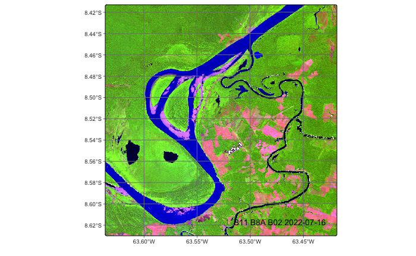
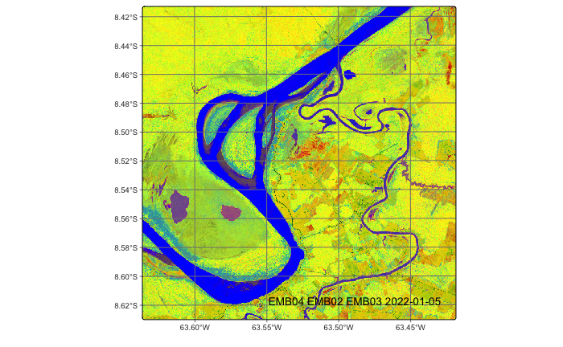
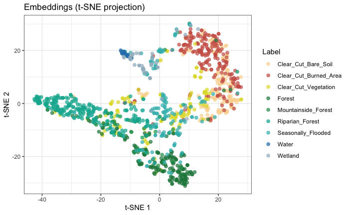
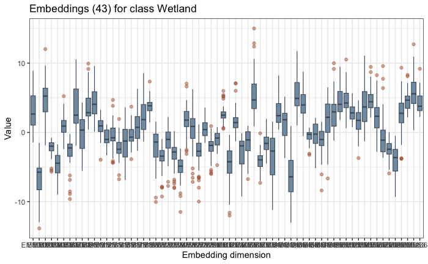
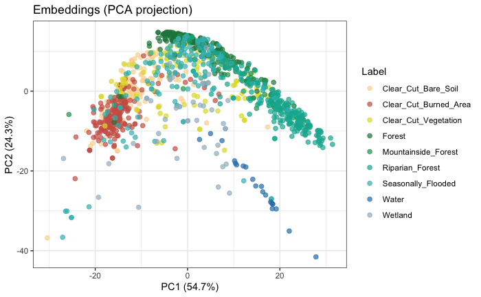
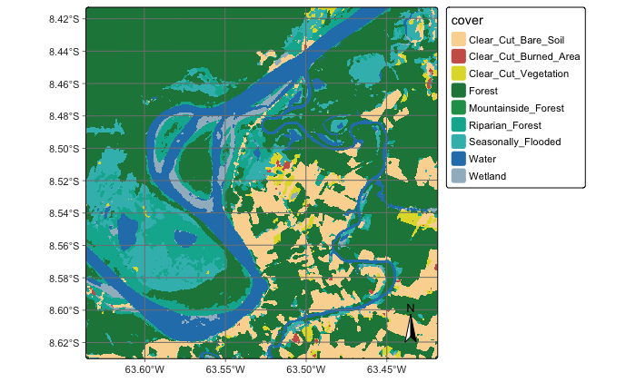

### Configurations to run this chapter{-}

:::{.panel-tabset}
## R
```{r}
#| echo: true
#| eval: true
#| output: false
# load package "tibble"
library(tibble)
# load packages "sits" and "sitsdata"
library(sits)
library(sitsdata)
# set tempdir if it does not exist 
tempdir_r <- "~/sitsbook/tempdir/R/emb_build"
dir.create(tempdir_r, showWarnings = FALSE, recursive = TRUE)
tempdir_r_class <- "~/sitsbook/tempdir/R/emb_build/class"
dir.create(tempdir_r_class, showWarnings = FALSE, recursive = TRUE)
```
## Python
```{python}
#| echo: true
#| eval: true
#| output: false
# load "pysits" library
from pysits import *
from pathlib import Path
# set tempdir if it does not exist
tempdir_py = Path.home() / "sitsbook/tempdir/Python/emb_build"
tempdir_py_class = Path.home() / "sitsbook/tempdir/Python/emb_build/class"
# Create directory
tempdir_py_class.mkdir(parents=True, exist_ok=True)
```
:::

## Overview

The `sits` package allows building of customized embeddings of data cubes using self-supervised learning. Any regular data cube, including multi-year and multi-modal ones, can be used as input. It is also recommended, but not mandatory, that a classified data cube for the same region and timeframe is used as a basis for selecting a stratified training sample. Users can thus design regional foundational models designed for specific cases and thus produce embeddings that are arguably better align with their desired products.  

The embedding workflow takes satellite image time series, learns a compact
representation with a deep-learning encoder, and then runs a standard
classification pipeline on those embeddings instead of on the raw bands.

## Embedding pipeline 

### Learning the encoder

The function `sits_pre_train()` trains a deep-learning encoder from time-series samples. It is a thin dispatcher: the real work is done by an `encoder_method` function.

| Parameter | Meaning |
|---|---|
| `samples` | Time series used for training the encoders (class `sits`). Labels are optional — SSL methods ignore them; supervised methods use them only to build pairs. The dimensions (bands and time-steps) of the data in `samples` should match those of data cube to be encoded. |
| `rl_method` | A representation learning function that takes `samples` and returns a `sits_encoder`. One of `sits_ssl_lejepa()`, `sits_ssl_vicreg()`, `sits_ssl_mae()`, `sits_contrastive_learning()`, `sits_barlow_twins()`|

: Pre-training parameters {#tbl-pre-train}

## Parameter for representation learning function

Each learning method has its own set of parameters. They also a set of common parameters, shown below.

**Common parameters for all embedding models**

| Parameter | Meaning |
|---|---|
| `samples` | Time series used for training the encoder. Default = `NULL` when called via `sits_pre_train()` |
| `embedding_dim` | Dimension of resulting embeddings (default = 64).|
| `encoder_model` | Deep learning method that takes time series as input and produces latent representations that are used to compute the loss function. Default = `sits_tempcnn()`. Alternatives include `sits_lighttae()`, `sits_tae()`,  `sits_resnet()` and `sits_mlp()` |
| `epochs` | Maximum number of training epochs (default = 150). | 
| `batch_size` | Batch size for training (default = 512). | 
| `validation_split` |  Fraction of samples held out for validation loss monitoring (default = 0.2) |
| `optimizer` | Gradient descent algorithms. Computes loss and improves model paramenters for better convergence (default = `torch::adamw`). | 
| `opt_hparams`| Named list of hyperparameters used by the optimizer. The most relevant parameters are `lr` (learning rate - default = 5.0e-04), `eps` (term added to the denominator to improve numerical stability - default = 1.0e-08), and `weight_decay` (prevents machine learning models from overfitting - default = 1.0e-06). |
| `lr_decay_epochs` | Step size (in epochs) for learning rate decay (default = 1) | 
| `lr_decay_rate` | Multiplicative decay factor (default = 0.95) |
| `patience` | Number of epochs without improvement for halting training (default = 20). | 
| `min_delta` | Minimum improvement for early stopping (default = 0.01) | 
| `verbose` | Logical value for printing training progress (default = `FALSE`| 
| `seed` | Random seed for reproducibility (default = 10). | 

: Parameters shared by all encoders {#tbl-common-par}

**LeJEPA**

The parameters specific for `sits_ssl_lejepa()` are described below. For an explanation of how the methods work, please check the preceeding chapter of the book.

| Parameter | Meaning |
|---|---|
| `proj_dim` | Dimension of the projector head used for pre-training (default = 128). | 
| `lambda` | Trade-off between invariance and SIGReg (default = 0.02). |
| `num_knots` | Number of quadrature knots for the SIGReg characteristic function test. Default = 17. | 
| `num_slices` | Number of random projection directions for SIGReg (default = 256). |

: Specific parameters for LeJEPA method {#tbl-lejepa-par}

**MAE**

The parameters specific for `sits_ssl_mae()` are described below. For an explanation of how the methods work, please check the preceeding chapter of the book.

| Parameter | Meaning |
|---|---|
| `decoder_width` | Width of the decoder MLP hidden layer used for reconstruction (default = 128). |
| `masking_method` | Mask selection strategy. Options are `"random"`  or `"contiguous"` (default = `"random"`). | 
| `mask_ratio` | Fraction of timesteps to mask (default = 0.6). |
| `mask_value` | Fill value used for masked timesteps (default = 0). |
| `masked_bands` | which bands to mask. Default = `NULL`, when all bands are eligible for masking. | 

: Specific parameters for MAE method {#tbl-mae-par}

**VICReg**

The parameters specific for `sits_ssl_vicreg()` are described below. For an explanation of how the methods work, please check the preceeding chapter of the book.

| Parameter | Meaning |
|---|---|
| `proj_dim` | Dimensionality of the projector head used during pre-training (default = 128). |
| `sim_coeff` | Weight of the invariance (MSE) term in  the VICReg loss. Balances the mean squared distance matching the two augmented views (default = 25.0) | 
| `std_coeff` | Weight of the variance (hinge) term in the VICReg loss. Enforces the standard deviation per dimension above the target threshold  (default = 25.0) |
| `cov_coeff` | Weight of the covariance (off-diagonal) term in the VICReg loss. Decorrelates the variables to eliminate redundancy (default = 1.0) |

: Specific parameters for VICReg method {#tbl-vicreg-par}

**Barlow Twins**

The specific parameters for the Barlow Twins method are described below.

| Parameter | Meaning |
|---|---|
| `proj_dim` | Dimensionality of the projector head used during pre-training (default = 128). |
| `bt_lambda`| Weight of the redundancy-reduction (off-diagonal) term in the Barlow Twins loss. Default = 5e-3. |
| `num_pairs` | Total number of pairs to form per epoch. Default = NULL. In this case, one pair is formed for every sample in the training split. |
    
: Specific parameters for Barlow Twins method {#tbl-btwins-par}

**Supervised Contrastive Loss**

The specific parameters for the SupCon method are described below.

| Parameter | Meaning |
|---|---|
| `proj_dim` | Dimensionality of the projector head used during pre-training (default = 128). |
| `scaling`| Scaling for the contrastive loss.  Lower values sharpen the similarity distribution (default = 0.07). |
| `num_pairs` | Total number of pairs to  form per epoch. Default = NULL. In this case, one pair is formed for every sample in the training split. |
    
## Processing pipeline

### Selecting the area of interest

In this chapter, we will use a small data cube to demonstrate the capabilities of the embedding-related functions in `sits`. In practice, one could use bigger data cubes to conver large regions of interest. 

In this case, we will take the state of Rondonia, Brazil as our area of interest. 
Rondônia covers 237,765 km² — roughly the size of the United Kingdom. Almost all of it lies within the Amazon biome; original forest cover was on the order of 208,000 km². Rondônia is the most transformed state in the Brazilian Amazon. As of 2026, native vegetation covers 60% of the state — the lowest proportion of any Amazon state — with roughly 7 million hectares (70,000 km²) of native vegetation lost since 1985.

Pasture expanded from 7% of the state's territory in 1985 to 37% in 2024 — approximately 88,000 km². Across the Amazon as a whole, over 90% of deforested area had pasture as its first use, and Rondônia is the state that converted the most native vegetation to pasture in absolute terms. The herd stands at roughly 18.2 million head (IBGE, 2023) in a state of 1.8 million people. Soy reached 717,600 hectares in the 2025/26 season. Expansion follows the pattern of converting degraded pasture rather than clearing forest directly, typically in soy-maize double-cropping systems.

Rondônia is an unusually demanding test case, and a useful one. Within one state you have the full sequence of Amazonian land change, plus the specific classes that make satellite image time series necessary rather than optional: pasture in varying degrees of degradation, secondary forest of differing ages, single-cropped versus double-cropped fields, and pasture-to-cropland transitions that are invisible in a single-date image but obvious in an annual spectrotemporal trajectory.

In this example, we will create a data cube using images from the Brazil Data Cube ("BDC").
Since the BDC already provides regular data cubes, there is no need for regularization. 
When using ARD data from other providers (e.g., CDSE or MPC), users need to copy the 
data to a local repository and obtain a regular data cube. The code for creating 
the data cubes is shown below.

:::{.panel-tabset}
## R
```{r}
#| eval: false
# Extract the shapefile with the boundaries of the Rondonia state
rondonia_shp <- system.file("extdata/shapefiles/rondonia/rondonia.shp", package = "sitsdata")

# Read the shapefile as an sf object
rondonia_sf <- sf::st_read(rondonia_shp)

# Define a Sentinel-2 data cube covering Rondonia in the Brazil Data Cube service
# We take 2022 as our study year
rondonia_cube <- sits_cube(
    source = "BDC",
    collection = "SENTINEL-2-16D",
    roi = rondonia_sf,
    start_date = "2022-01-05",
    end_date   = "2022-12-23"
)
```
## Python
```{python}
#| eval: false
# Import GeoPandas
import geopandas as gpd

# Extract the shapefile with the boundaries of the Rondonia state
rondonia_shp = r_package_dir("extdata/shapefiles/rondonia/rondonia.shp", package = "sitsdata")

# Read the shapefile as a GeoDataFrame object
rondonia_sf = gpd.read_file(rondonia_shp)

# Define a Sentinel-2 data cube covering Rondonia in the Brazil Data Cube service
# We take 2022 as our study year
rondonia_cube = sits_cube(
    source = "BDC",
    collection = "SENTINEL-2-16D",
    roi = rondonia_sf,
    start_date = "2022-01-05",
    end_date   = "2022-12-23"
)
```
:::

### Obtaining samples for representation learning

We start by selecting a large set of samples from an area of interest. This area should be 
large enough so as to capture spatial variations of the different classes. Depending on
the representation learning method, one can use unlabeled samples; this is the practice 
for MAE, VICReg and LeJEPA techniques. For the Barlow Twins and Supervised Contrastive 
Loss method, we need labelled samples.

The training data for self-supervised learning is a set of unlabeled samples, which can be drawn in two ways:  (a) Select a random sample from the chosen data cube; (b) select a stratified sample based on a classified data cube that covers the same region as the original. Although a random selection is simpler, using a classified data cube is recommended, since it enables balancing the samples between the different classes. In the first case, we use `sits_random_sampling()` and specify the total number of samples for self-supervised learning, as shown in the example below. When a classified data cube is available as a base  layer, one can use `sits_stratified_sampling()` to aim for a an SSL sample distribution which captures frequent and less frequent classes. We show an example later in the chapter. 

For this example, we take 30,000 samples covering the area of interest. In actual practice, a larger set of samples is recommended. Note that the next lines may take a long time. For this reason, we provide a shortcut in what follows. 

:::{.panel-tabset}
## R
```{r}
#| eval: false
# select a random set of locations to be samples
random_locations <- sits_random_sampling(
    cube = rondonia_cube,
    n_samples = 30000,
    multicores = 8,
    memsize = 24,
    progress = TRUE
)

# extract the time series 
samples <- sits_get_data(
    cube = rondonia_cube,
    samples = random_locations,
    multicores = 8,
    progress = TRUE
)
```
## Python
```{python}
#| eval: false
# select a random set of locations to be samples
random_locations = sits_random_sampling(
    cube = rondonia_cube,
    n_samples = 30000,
    multicores = 8,
    memsize = 24,
    progress = True
)

# extract the time series
samples = sits_get_data(
    cube = rondonia_cube,
    samples = random_locations,
    multicores = 8,
    progress = True
)
```
:::

The resulting samples consist of 30,000 time series covering a one-year period. Because of the time required to obtain the samples, we provide a shortcut by pre-archiving the result in the `sitsdata` package.

:::{.panel-tabset}
## R
```{r}
#| eval: false
# recover the samples 
samples_file <- system.file("extdata/samples/rondonia_30k.rds", package = "sitsdata")
samples <- readRDS(samples_file)

# use only optical bands, not indexes
samples <- sits_select(
    samples,
    bands = c("B02", "B03", "B04", "B05", "B06", 
              "B07", "B08", "B11", "B12", "B8A")
)

```
## Python
```{python}
#| eval: false
# recover the samples
samples_file = r_package_dir("extdata/samples/rondonia_30k.rds", package = "sitsdata")
samples = read_rds(samples_file)

# use only optical bands, not indexes
samples = sits_select(
    samples,
    bands = ("B02", "B03", "B04", "B05", "B06",
             "B07", "B08", "B11", "B12", "B8A")
)
```
:::

### Building the weights of the encoder 

To build the encoder, we need to select a representation learning method. For 
this example, we will use the VICReg (Variance-Invariance-Covariance) 
regularization method. For a detailed description of VICReg, please see
the previous chapter. 

To create the encoder, we use `sits_pre_train()` which takes two parameters: 
`samples`, which are the unlabeled samples to be used by chosen method; and
`rl_method`, the chosen representation learning method. The example uses
`sits_ssl_vicreg()`, whose parameters are described above. The most relevant
choices are `embedding_dim` (size of the embedding vector) and
`encoder_model` (the deep learning model used to process the inputs). In this
case, we use `sits_tempcnn()`. 

:::{.panel-tabset}
## R
```{r}
#| eval: false
vicreg_encoder <- sits_pre_train(
    samples = samples,
    rl_method = sits_ssl_vicreg(
        embedding_dim    = 64L,
        encoder_model    = sits_tempcnn()
    )
)
```
## Python
```{python}
#| eval: false
vicreg_encoder = sits_pre_train(
    samples = samples,
    rl_method = sits_ssl_vicreg(
        embedding_dim    = 64,
        encoder_model    = sits_tempcnn()
    )
)
```
:::

After obtaining a `vicreg_encoder`, we use it to produce embeddings from
a data cube. In this case, we use the same data cube from the 
[Classification of raster data cubes](https://e-sensing.github.io/sitsbook/cl_rasterclassification.html)
chapter. Please refer to that chapter for a description of the data. 

:::{.panel-tabset}
## R
```{r}
#| eval: false
# directory where files are located
data_dir <- system.file("extdata/Rondonia-20LMR", package = "sitsdata")

# builds a cube based on existing files
cube_20LMR <- sits_cube(
    source = "AWS",
    collection = "SENTINEL-2-L2A",
    data_dir = data_dir
)

# select only the S2 bands
cube_20LMR <- sits_select(
    cube_20LMR,
    bands = c("B02", "B03", "B04", "B05", 
    "B06", "B07", "B08", "B11", "B12", "B8A")
)

# Plot one of the dates of the cube
plot(
    cube_20LMR, 
    red = "B11",
    green = "B8A", 
    blue = "B02", 
    date = "2022-07-16"
)
```
## Python
```{python}
#| eval: false
# directory where files are located
data_dir = r_package_dir("extdata/Rondonia-20LMR", package = "sitsdata")

# builds a cube based on existing files
cube_20LMR = sits_cube(
    source = "AWS",
    collection = "SENTINEL-2-L2A",
    data_dir = data_dir
)

# select only the S2 bands
cube_20LMR = sits_select(
    cube_20LMR,
    bands = ("B02", "B03", "B04", "B05",
    "B06", "B07", "B08", "B11", "B12", "B8A")
)

# Plot one of the dates of the cube
plot(
    cube_20LMR,
    red = "B11",
    green = "B8A",
    blue = "B02",
    date = "2022-07-16"
)
```
:::

```{r}
#| echo: FALSE
#| label: fig-emb-20lmr
#| out-width: 90%
#| fig-cap: |
#|   Color composite of tile 20LMR.
#| fig-align: center

```

The next step is to produce embeddings from the data cube. The original data cube has 10 bands and 
23 time steps, and the encoding reduces it to 64 dimensions using `sits_encode`. The 
main parameters are `data` (either samples or a regular data cube) and 
`encoder`(which is the `vicreg_encoder` we derived from the samples). Note that
the bands and timelines of both data and encoder must match for the function to
execute correctly. The other parameters are `memsize` (RAM available),
`multicores` (number of cores allocated), `gpu_memory` (if a GPU is available) 
and `batch_size`, which is used only when working with a GPU. 

After generating the embeddings cube, we plot some of its dimensions.

:::{.panel-tabset}
## R
```{r}
#| eval: false
cube_emb <- sits_encode(
    data = cube_20LMR,
    encoder = vicreg_encoder,
    memsize = 12,
    multicores = 6,
    gpu_memory = 12,
    batch_size = 12000,
    output_dir = tempdir_r
)

plot(
    cube_emb, 
    red = "EMB04",
    green = "EMB02", 
    blue = "EMB03"
)
```
## Python
```{python}
#| eval: false
cube_emb = sits_encode(
    data = cube_20LMR,
    encoder = vicreg_encoder,
    memsize = 12,
    multicores = 6,
    gpu_memory = 12,
    batch_size = 12000,
    output_dir = tempdir_py
)

plot(
    cube_emb,
    red = "EMB04",
    green = "EMB02",
    blue = "EMB03"
)
```
:::


```{r}
#| echo: FALSE
#| label: fig-emb-rgb
#| out-width: 90%
#| fig-cap: |
#|   Color composite of three embedding bands.
#| fig-align: center

```

## Selecting the labelled data for classification

The next step is to select the data for classification. In this case, we will
use a subset of the `samples_deforestation_rondonia` sample set, which consists
of 6,007 samples for different land use and land cover classes in Rondonia. 
There are nine classes: `Clear_Cut_Bare_Soil`, `Clear_Cut_Burned_Area`, `Mountainside_Forest`, `Forest`, `Riparian_Forest`, `Clear_Cut_Vegetation`, `Water`, `Wetland`, and `Seasonally_Flooded`. Each time series contains values from Sentinel-2/2A bands B02, B03, B04, B05, B06, B07, B8A, B08, B11 and B12, from 2022-01-05 to 2022-12-23 in 16-day intervals.

This is the same data set used in the [Classification of raster data cubes](https://e-sensing.github.io/sitsbook/cl_rasterclassification.html)
chapter. To test the hypothesis that embeddings needs small set fo samples
for fine-tuning, we take only 20% of the original samples for classification.

After selecting the samples subset, we encode the samples to match the 
embeeding dimensions with the same encoder we used for the data cube

:::{.panel-tabset}
## R
```{r}
#| eval: false
# random selection from tile 
# selecting a subset of the original training data
samples_fine_tuning <- sits_sample(samples_deforestation_rondonia, frac = 0.2)

# transforming the samples to the embedding dimension
samples_embedding <- sits_encode(
    data = samples_fine_tuning,
    encoder = vicreg_encoder
)

# plot the embedded samples using t-SNE
plot(samples_embedding, mode = "tsne", perplexity = 30)
```
## Python
```{python}
#| eval: false
# obtain the samples
samples_deforestation_rondonia = load_samples(
    name = "samples_deforestation_rondonia",
    package = "sitsdata"
)

# random selection from tile
# selecting a subset of the original training data
samples_fine_tuning = sits_sample(samples_deforestation_rondonia, frac = 0.2)

# transforming the samples to the embedding dimension
samples_embedding = sits_encode(
    data = samples_fine_tuning,
    encoder = vicreg_encoder
)

# plot the embedded samples using t-SNE
plot(samples_embedding, mode = "tsne", perplexity = 30)
```
:::

```{r}
#| echo: FALSE
#| label: fig-emb-tnse
#| out-width: 90%
#| fig-cap: |
#|   t-SNE plot of embedded samples.
#| fig-align: center

```

t-SNE (t-distributed Stochastic Neighbor Embedding) is a non-linear machine learning algorithm used for data visualization and dimensionality reduction. It transforms high-dimensional datasets with hundreds or thousands of features into a 2D or 3D map, making clusters and hidden patterns visible to the human eye[@Maaten2008]. 
t-SNE turns distances into probabilities, then matches them in 2-D. For each point, it converts distances to its neighbours into a probability distribution — nearby points get high probability, distant ones vanish. It then scatters the points randomly on a plane and moves them by gradient descent until the 2-D neighbour probabilities match the high-dimensional ones as closely as possible (minimizing KL divergence).

Alternative to visualisation using t-SNE include `dimensions` (plots the spread
of each label in the embedding dimensions) and "PCA" (plot the first two principal components).

:::{.panel-tabset}
## R
```{r}
#| eval: false
# select the wetlands labels
samples_emb_wet = sits_select(samples_embedding, labels = "Wetland")

# plots the spread of values in each embedding dimension
plot(samples_emb_wet, mode = "dimensions")
```
## Python
```{python}
#| eval: false
# select the wetlands labels
samples_emb_wet = sits_select(samples_embedding, labels = "Wetland")

# plots the spread of values in each embedding dimension
plot(samples_emb_wet, mode = "dimensions")
```
:::

```{r}
#| echo: FALSE
#| label: fig-emb-dim
#| out-width: 80%
#| fig-cap: |
#|   Plot of the spread of class Wetland in the embedding dimensions.
#| fig-align: center

```

:::{.panel-tabset}
## R
```{r}
#| eval: false
plot(samples_embedding, mode = "PCA")
```
## Python
```{python}
#| eval: false
plot(samples_embedding, mode = "PCA")
```
:::

```{r}
#| echo: FALSE
#| label: fig-emb-pca
#| out-width: 90%
#| fig-cap: |
#|   Plot of the two main principal components of the embedding dimensions.
#| fig-align: center

```

### Classification of the embedding cube

After obtaining the embedding cube and samples, the next step is to 
follow the established `sits` classification pipeline, as shown below.
We use an multi-layer perceptron method (`sits_mlp()`) which is 
well-suited to work with embeddings. 

:::{.panel-tabset}
## R
```{r}
#| eval: false
# build MLP model
mlp_model <- sits_train(
    samples = samples_embedding,
    ml_method = sits_mlp(
        epochs = 150,
        batch_size = 32
    )
)

emb_probs <- sits_classify(
    data = cube_emb,
    ml_model = mlp_model,
    multicores = 6,
    memsize = 24,
    gpu_memory = 16,
    batch_size = 16000,
    output_dir = tempdir_r_class
)

emb_smooth <- sits_smooth(
    cube = emb_probs,
    multicores = 6,
    memsize = 24,
    output_dir = tempdir_r_class
)

emb_map <- sits_label_classification(
    cube = emb_smooth,
    multicores = 6,
    memsize = 24,
    output_dir = tempdir_r_class
)

plot(emb_map)
```
## Python
```{python}
#| eval: false
# build MLP model
mlp_model = sits_train(
    samples = samples_embedding,
    ml_method = sits_mlp(
        epochs = 150,
        batch_size = 32
    )
)

emb_probs = sits_classify(
    data = cube_emb,
    ml_model = mlp_model,
    multicores = 6,
    memsize = 24,
    gpu_memory = 16,
    batch_size = 16000,
    output_dir = tempdir_py_class
)

emb_smooth = sits_smooth(
    cube = emb_probs,
    multicores = 6,
    memsize = 24,
    output_dir = tempdir_py_class
)

emb_map = sits_label_classification(
    cube = emb_smooth,
    multicores = 6,
    memsize = 24,
    output_dir = tempdir_py_class
)

plot(emb_map)
```
:::

```{r}
#| echo: FALSE
#| label: fig-emb-class
#| out-width: 90%
#| fig-cap: |
#|   Classified map for Rondonia data cube.
#| fig-align: center


```

The resulting map compares favourably with the reference classification map
presented in the [Classification of raster data cubes](https://e-sensing.github.io/sitsbook/cl_rasterclassification.html)
chapter. Further accuracy evaluation could determine which classification is
more accurate. 

## Summary

This chapter presented the functions that support the creation and use of 
Earth observation embeddings based on satellite image time series. 
The examples show how to select an initial set of samples for 
self-supervise learning, and how the resulting encoder is used to 
generate embeddings. The final part of the chapter shows how use
EO embeddings for fine-tuning leading to land use and land cover classification.

## References

