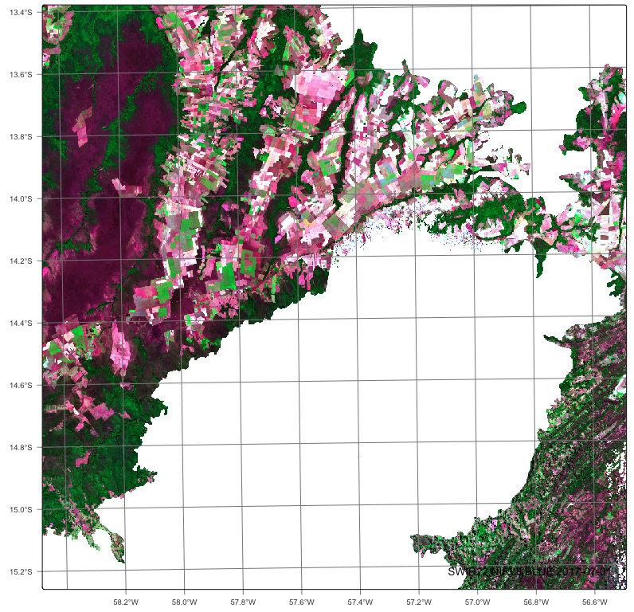
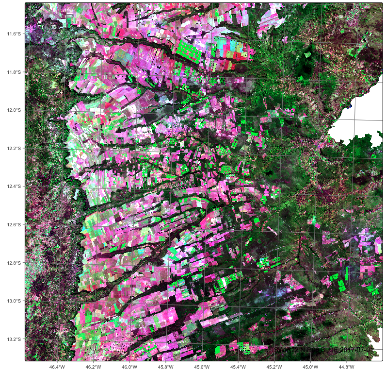
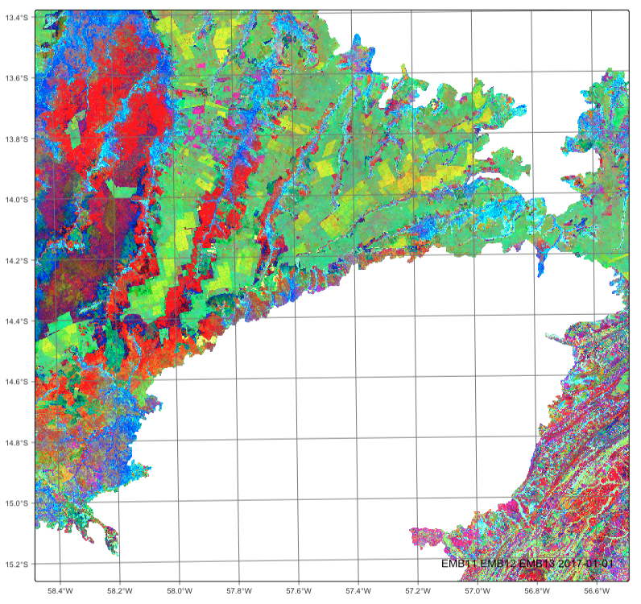
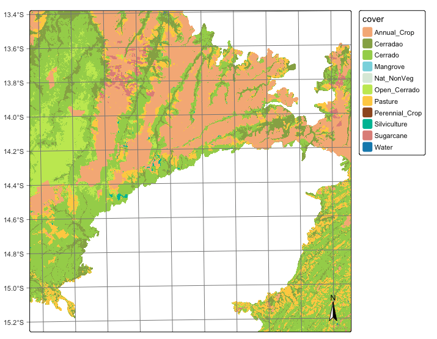

### Configurations to run this chapter{-}

:::{.panel-tabset}
## R
```{r}
#| echo: true
#| eval: false
#| output: false
# load package "tibble"
library(tibble)
# load packages "sits" and "sitsdata"
library(sits)
library(sitsdata)
# set tempdir if it does not exist 
tempdir_r <- "~/sitsbook/tempdir/R/emb_examples"
dir.create(tempdir_r, showWarnings = FALSE, recursive = TRUE)
tempdir_r_class <- "~/sitsbook/tempdir/R/emb_examples/class"
dir.create(tempdir_r_class, showWarnings = FALSE, recursive = TRUE)
tempdir_r_data <- "~/sitsbook/tempdir/R/emb_examples/data"
dir.create(tempdir_r_data, showWarnings = FALSE, recursive = TRUE)
tempdir_r_bdc <- "~/sitsbook/tempdir/R/emb_examples/bdc"
dir.create(tempdir_r_bdc, showWarnings = FALSE, recursive = TRUE)
tempdir_r_emb <- "~/sitsbook/tempdir/R/emb_examples/embeddings"
dir.create(tempdir_r_emb, showWarnings = FALSE, recursive = TRUE)
```
## Python
```{python}
#| echo: true
#| eval: false
#| output: false
# load "pysits" library
from pysits import *
from pathlib import Path
# set tempdir if it does not exist
tempdir_py = Path.home() / "sitsbook/tempdir/Python/emb_exemple"
tempdir_py_class = Path.home() / "sitsbook/tempdir/Python/emb_examples/class"
tempdir_py_data = Path.home() / "sitsbook/tempdir/Python/emb_examples/data"
tempdir_py_bdc = Path.home() / "sitsbook/tempdir/Python/emb_examples/bdc"
tempdir_py_emb = Path.home() / "sitsbook/tempdir/Python/emb_examples/embeddings"
# Create directory
tempdir_py_class.mkdir(parents=True, exist_ok=True)
tempdir_py_data.mkdir(parents=True, exist_ok=True)
tempdir_py_bdc.mkdir(parents=True, exist_ok=True)
tempdir_py_emb.mkdir(parents=True, exist_ok=True)
```
:::

## Overview

The `sits` package allows building of customized embeddings of data cubes using self-supervised learning. Any regular data cube, including multi-year and multi-modal ones, can be used as input. It is also recommended, but not mandatory, that a classified data cube for the same region and timeframe is used as a basis for selecting a stratified training sample. Users can thus design regional foundational models designed for specific cases and thus produce embeddings that are arguably better align with their desired products.  

The embedding workflow takes satellite image time series, learns a compact
representation with a deep-learning encoder, and then runs a standard
classification pipeline on those embeddings instead of on the raw bands.

This chapter scales up the workflow presented in the chapter ["Building regional embeddings: a simple example"](https://e-sensing.github.io/sitsbook/emb_build.html). While that chapter used a single Sentinel-2 tile in Rondonia and the VICReg method, here we cover an entire biome, the Brazilian Cerrado, using Landsat-8 data and the LeJEPA (Lean Joint-Embedding Predictive Architecture) method. A detailed description of LeJEPA is given in the chapter ["Embedding Methods in SITS"](https://e-sensing.github.io/sitsbook/emb_methods.html). 

Processing data for a whole biome requires substantial computing resources; most of the steps below are best run on a machine with a GPU and a large amount of RAM. For this reason, all code blocks in this chapter are not executed when the book is built. To allow readers to follow the example without repeating the most expensive steps, we provide the intermediate products (training samples, pre-trained encoder, embedding cube and validation data) in the Hugging Face repositories maintained by the `e-sensing` group. Readers can thus skip any step and start from the data provided for the next one.
    
## Area of interest

In this section, we present an application of SSL encoder to produce a two-year land use and cover classification of the Cerrado biome in Brazil using Landsat-8 images. Cerrado is the second largest biome in Brazil with 1.9 million km$^2$. The Brazilian Cerrado is a tropical savanna ecoregion with a rich ecosystem ranging from grasslands to woodlands. It is home to more than 7000 species of plants with high levels of endemism [@Klink2005]. It includes three major types of natural vegetation: *Open Cerrado*, typically composed of grasses and small shrubs with a sporadic presence of small tree vegetation; *Cerrado Sensu Stricto*, a typical savanna formation, characterized by the presence of low, irregularly branched, thin-trunked trees; and *Cerradão*, a dry forest of medium-sized trees (up to 10--12 m) [@Goodland1971]. Its natural areas are being converted to agriculture at a fast pace, as it is one of the world's fast moving agricultural frontiers [@Walter2006]. The main agricultural land uses include cattle ranching, crop farms, and planted forests. 

The Cerrado's farmland is dominated by cattle pasture (by area) and a double-cropped soy–corn system (by value). Other land uses include cotton, sugarcane and planted forests. Estimates indicate there are 51 Mha of pasture in the Cerrado, which is 26% of the biome, 31% of Brazil's pastures and 54% of the biome's agricultural area. In 2023, almost half of Brazil's soy area was in the Cerrado (19.3 Mha), ahead of the Atlantic Forest (10.3 Mha) and the Amazon (5.9 Mha). In 2015, 48% of Brazil's soybean production came from the Cerrado. Most Cerrado corn is sown right after the soy harvest, on the same fields. Sugarcane has expanded strongly into the Cerrado. The Cerrado also has eucalyptus plantations, and also permanent crops such as coffee and citrus.

The diversity of the Cerrado makes it a demanding test for embeddings. Natural vegetation ranges from grasslands to dry forests, with strong seasonal variation driven by the dry season. Anthropic uses include pastures in different states of management, single- and double-cropped annual agriculture, sugarcane and planted forests. Many of these classes are hard to separate in a single image but have distinct trajectories in a satellite image time series. 

In this example, we use regular Landsat-8 data cubes from the Brazil Data Cube ("BDC"). The data has been extracted from the BDC and transformed into a monthly cube that spans two years, from January 2017 to December 2018. We have selected 12 BDC tiles which are representative of the Cerrado's diversity. The encoder is trained with samples covering the years 2017 to 2024, and is then applied to the data cube. All data needed to run the example is available in Hugging Face. 

## Processing pipeline 

This chapter presents a step-by-step approach to create and deploy regional encoder models:

1. Producing a monthly data cube covering two years for selected areas of the Cerrado. 

2. Generating regional encoders using self-supervised learning. A large set of unlabelled time series is used to train a LeJEPA encoder, which learns how to summarise a time series as a 64-dimensional vector. 

3. Using encoders to produce Earth observation embeddings. The encoder is applied to every pixel of a regular data cube, producing an embedding cube whose bands are the embedding dimensions.

4. Classifying EO embeddings for land use and land cover applications. A small set of labelled samples is encoded with the same encoder and used to train a classifier, which is then applied to the embedding cube following the usual `sits` workflow of classification, smoothing and labelling.

5. Evaluating classification of EO embeddings. The resulting map is compared with an independent set of validation points.

The results from each processing step are available in the Hugging Face repository. Therefore, users can processing each step independently. 

## Producing a two year data cube for the Cerrado

The first step is to select a set of BDC tiles that represent the diversity of the Cerrado. The BDC uses three hierarchical grids based on the Albers Equal Area projection and SIRGAS 2000 datum. The medium grid is used for Landsat-8 OLI collections at 30 m resolution; tiles have an extent of 211.2 $\times$ 211.2 km^2^, and each image has 7040 $\times$ 7040 pixels. The data cubes in the BDC are regularly spaced in time and cloud-corrected [@Ferreira2020a]. The tiles can be viewed in the [BDC Explorer]()

The tiles of the BDC cover a rectangular area that extends beyond the Cerrado. To classify only pixels inside the biome, we retrieve a GeoPackage file with the Cerrado limits, which will be used as the region of interest (`roi`) in the regularization and classification. For reference, the results of this processing step have been already saved in the Hugging Face repository. 

:::{.panel-tabset}
## R
```{r}
#| eval: false
#
# Recover the Cerrado limits
#
cerrado_limits <- sits_from_hf(
    repo = "e-sensing/samples_cerrado",
    file = "cerrado_limits.gpkg",
    type = "dataset"
)
```
## Python
```{python}
#| eval: false
#
# Recover the cerrado limits
#
cerrado_limits = sits_from_hf(
    repo = "e-sensing/samples_cerrado",
    file = "cerrado_limits.gpkg",
    type = "dataset"
)
```
:::

The next step is to select a set of BDC tiles for the Cerrado region. 

:::{.panel-tabset}
## R
```{r}
#| eval: false
#
# Define the BDC Cerrado tiles
#
cerrado_tiles <- c(
    "017004", "015005", "015006",
    "015007", "014008", "015009",
    "009010", "013010", "013012",
    "014012", "011013", "013014"
)
```
## Python
```{python}
#| eval: false
#
# Define the BDC Cerrado tiles
#
cerrado_tiles = [
    "017004", "015005", "015006",
    "015007", "014008", "015009",
    "009010", "013010", "013012",
    "014012", "011013", "013014"
]
```
:::

Now, we define a data cube in the BDC with the selected tiles.

:::{.panel-tabset}
## R
```{r}
#| eval: false
#
# Define the BDC data cube
#
cerrado_cube_bdc <- sits_cube(
    source = "BDC",
    collection = "LANDSAT-OLI-16D",
    tiles = cerrado_tiles,
    start_date = "2017-01-01",
    end_date = "2018-12-31",
    multicores = 8,
    progress = TRUE
)
```
## Python
```{python}
#| eval: false
#
# Define the BDC data cube
#
cerrado_cube_bdc = sits_cube(
    source = "BDC",
    collection = "LANDSAT-OLI-16D",
    tiles = cerrado_tiles,
    start_date = "2017-01-01",
    end_date = "2018-12-31",
    multicores = 8,
    progress = TRUE
)
```
:::

The next step is to create a local copy of the data to speed up processing. We use the `roi` parameter to reduce the area being copied to the parts contained in the Cerrado biome.

:::{.panel-tabset}
## R
```{r}
#| eval: false
#
# Copy the BDC data cube to a local directory
#
cerrado_cube_local <- sits_cube_copy(
    cube  = cerrado_cube_bdc,
    roi = cerrado_limits,
    multicores = 8,
    output_dir = tempdir_r_bdc,
    progress = TRUE
)
```
## Python
```{python}
#| eval: false
#
# Copy the BDC data cube to a local directory
#
cerrado_cube_local = sits_cube_copy(
    cube  = cerrado_cube_bdc,
    roi = cerrado_limits,
    multicores = 8,
    output_dir = tempdir_r_bdc,
    progress = TRUE
)
```
:::

The next step is to produce a regular data cube with monthly intervals.

:::{.panel-tabset}
## R
```{r}
#| eval: false
#
# Regularize data cube with a one month interval
#
cerrado_cube_reg_2018 <- sits_regularize(
    cube  = cerrado_cube_local,
    period = "P1M",
    roi = cerrado_limits,
    multicores = 8,
    output_dir = tempdir_r_data,
    progress = TRUE
)
# plot a tile and date of the regular cube
plot(cerrado_cube_reg_2018, tile = "009010", date = "2017-07-01", 
     blue = "BLUE", green = "NIR08",  red = "SWIR22")
```
## Python
```{python}
#| eval: false
#
# Regularize data cube with a one month interval
#
cerrado_cube_reg_2018 = sits_regularize(
    cube  = cerrado_cube_local,
    period = "P1M",
    roi = cerrado_limits,
    multicores = 8,
    output_dir = tempdir_r_data,
    progress = TRUE
)
# plot a tile and date of the regular cube
plot(cerrado_cube_reg_2018, tile = "009010", date = "2017-07-01", 
     blue = "BLUE", green = "NIR08",  red = "SWIR22")
```
:::

```{r}
#| label: fig-emb-reg-cube
#| echo: false
#| out-width: 80%
#| fig-cap: |
#|   Plot of regular one-month cube for tile 009010 and date "2017-07-01".
#| fig-align: center

```

## Generating regional encoders using self-supervised learning

The first step is to build an encoder adapted to the region of interest. Self-supervised learning (SSL) methods do not need labels; they learn a representation from the structure of the data itself. To capture the spatial and temporal variability of the Cerrado, the training set should be large and cover the whole biome. It should also span several years, so that the encoder learns to represent interannual variations in climate and land management and can be applied to data from any year in the training period.

As discussed in the chapter ["Building regional embeddings: a simple example"](https://e-sensing.github.io/sitsbook/emb_build.html), the samples for SSL can be obtained either by random sampling of a data cube (`sits_random_sampling()`) or by stratified sampling based on an existing classified map (`sits_stratified_sampling()`). The second approach is preferable since it ensures that less frequent classes are well represented. 

The code below retrieves the samples used to train the encoder from Hugging Face. As described in the chapter ["Embedding Methods in SITS"](https://e-sensing.github.io/sitsbook/emb_methods.html), this set contains about 480,000 Landsat-8 time series covering the Brazilian Cerrado between 2017 and 2024. The result is a `sits` tibble, with one row per sample and the time series stored in the `time_series` column. Any labels in the sample set are ignored by the SSL method.

:::{.panel-tabset}
## R
```{r}
#| eval: false
#
# Read samples for the SSL training from 2017 to 2024 from Hugging Face
#
pretrain_samples <- sits_from_hf(
    repo = "e-sensing/samples_cerrado",
    file = "samples_cerrado_2017_2024_pretrain.parquet",
    type = "dataset"
)
```
## Python
```{python}
#| eval: false
#
# Read samples for the SSL training from 2017 to 2024 from Hugging Face
#
pretrain_samples = sits_from_hf(
    repo = "e-sensing/samples_cerrado",
    file = "samples_cerrado_2017_2024_pretrain.parquet",
    type = "dataset"
)
```
:::

The next step trains the encoder using `sits_pre_train()`, which takes two parameters: the unlabelled `samples` and the representation learning method `rl_method`. We use `sits_ssl_lejepa()`, which implements the LeJEPA method. LeJEPA avoids the collapse of the embeddings by forcing their distribution to be close to an isotropic Gaussian, so that all embedding dimensions carry comparable information. The main parameters are `embedding_dim` (size of the embedding vector, here 64), `encoder_model` (the deep learning network that processes the time series, here a temporal convolutional neural network built with `sits_tempcnn()`), `epochs` (maximum number of training epochs) and `batch_size`. A large batch size (2048) is used because the SIGReg term of the LeJEPA loss is estimated from the distribution of embeddings within each batch. When `verbose = TRUE`, the function reports the training and validation loss for each epoch. For a description of all parameters, please see @tbl-common-par and @tbl-lejepa-par in the chapter ["Embedding Methods in SITS"](https://e-sensing.github.io/sitsbook/emb_methods.html).

The result is an object of class `sits_encoder`, which contains the trained weights of the network and the information about bands and timeline of the training data. Note that training an encoder with almost half a million samples takes many hours, even with a GPU. Readers who do not want to wait can use the pre-trained encoder that we retrieve in the next section.

:::{.panel-tabset}
## R
```{r}
#| eval: false
#
# Create and save LeJEPA encoder
#
lejepa_encoder <- sits_pre_train(
    samples = pretrain_samples,
    rl_method = sits_ssl_lejepa(
        embedding_dim = 64,
        epochs = 150,
        batch_size = 2048,
        encoder_model = sits_tempcnn(),
        verbose = TRUE
    )
)
```
## Python
```{python}
#| eval: false
#
# Create LeJEPA encoder
#
lejepa_encoder <- sits_pre_train(
    samples = pretrain_samples,
    rl_method = sits_ssl_lejepa(
        embedding_dim = 64,
        epochs = 150,
        batch_size = 2048,
        encoder_model = sits_tempcnn(),
        verbose = TRUE
    )
)
```
:::

## Using encoders to produce Earth observation embeddings

Once the encoder is available, it can be applied to a data cube. For each pixel, the encoder takes the full time series of all bands and produces a vector of 64 values. The result is an embedding cube, which has the same spatial extent and resolution as the original cube, but where each band corresponds to one dimension of the embedding and there is no temporal dimension. An embedding cube is much more compact than the original cube and can be used as input to standard classification methods.

We start by downloading the Landsat-8 regular data cube for 2018 from Hugging Face. The files are stored in the directory `tempdir_r_data` (or `tempdir_py_data`) and the function returns a `sits` data cube that describes them. Note that the bands and the number of time steps of this cube must match those of the samples used to train the encoder; otherwise `sits_encode()` will fail. 

:::{.panel-tabset}
## R
```{r}
#| eval: false
# Download the 2018 data cube
#
cerrado_cube_reg_2018 <- sits_from_hf(
    repo = "e-sensing/cerrado_cube_reg_2018",
    type = "dataset",
    output_dir = tempdir_r_data
)
plot(cerrado_cube_reg_2018, tile = "015009", date = "2017-07-01", 
     blue = "BLUE", green = "NIR08",  red = "SWIR22")
```
## Python
```{python}
#| eval: false
# Download the 2018 data cube
#
cerrado_cube_reg_2018 = sits_from_hf(
    repo = "e-sensing/cerrado_cube_reg_2018",
    type = "dataset",
    output_dir = tempdir_py_data
)
plot(cerrado_cube_reg_2018, tile = "015009", date = "2017-07-01", 
     blue = "BLUE", green = "NIR08",  red = "SWIR22")
```
:::

```{r}
#| label: fig-emb-reg-cube-2
#| echo: false
#| out-width: 80%
#| fig-cap: |
#|   Plot of regular one-month cube for tile 009010 and date "2017-07-01".
#| fig-align: center

```


As a shortcut to the training step in the previous section, we retrieve a LeJEPA encoder already trained with the 2017–2024 samples, which uses a TempCNN network as the encoder model. The encoder is stored as an RDS file in Hugging Face; the result is the same `sits_encoder` object that would be produced by `sits_pre_train()`.

:::{.panel-tabset}
## R
```{r}
#| eval: false
#
#  Retrieve the  encoder
#
lejepa_encoder <- sits_from_hf(
    repo = "e-sensing/encoders_cerrado",
    file = "ssl_lejepa_tcnn_model_2017_2024.rds",
    type = "model"
)
```
## Python
```{python}
#| eval: false
#
#  Retrieve the  encoder
#
lejepa_encoder = sits_from_hf(
    repo = "e-sensing/encoders_cerrado",
    file = "ssl_lejepa_tcnn_model_2017_2024.rds",
    type = "model"
)
```
:::

We now produce the embedding cube with `sits_encode()`. The main parameters are `data` (a regular data cube or a set of samples) and `encoder` (the trained encoder). The other parameters control processing: `memsize` (RAM available, in GB), `multicores` (number of CPU cores), `gpu_memory` (memory of the GPU, in GB) and `batch_size` (number of pixels sent to the GPU at each step). These are the same parameters used by `sits_classify()`, described in the chapter ["Classification of raster data cubes"](https://e-sensing.github.io/sitsbook/cl_rasterclassification.html); see also the chapter on ["How parallel processing works in SITS"](https://e-sensing.github.io/sitsbook/annex_parallel.html) for how `sits` uses memory and cores. The files are written to `output_dir`. The result is an embedding cube with 64 bands named `EMB01` to `EMB64`. As shown in the chapter ["Building regional embeddings: a simple example"](https://e-sensing.github.io/sitsbook/emb_build.html), any three of these bands can be visualised as a color composite with `plot()`. Encoding a whole biome is a lengthy process.

:::{.panel-tabset}
## R
```{r}
#| eval: false
#
#  Generate the embeddings cube
#
lejepa_embedding <- sits_encode(
    data = cerrado_cube_reg_2018,
    encoder = lejepa_encoder,
    memsize = 12,
    multicores = 6,
    gpu_memory = 12,
    batch_size = 4096,
    output_dir = tempdir_r_emb
)
plot(lejepa_embedding, tile = "009010", 
     red = "EMB11", green = "EMB12", blue = "EMB13")
```
## Python
```{python}
#| eval: false
#
#  Generate the embeddings cube
#
lejepa_embedding = sits_encode(
    data = cerrado_cube_reg_2018,
    encoder = lejepa_encoder,
    memsize = 12,
    multicores = 6,
    gpu_memory = 12,
    batch_size = 4096,
    output_dir = tempdir_py_emb
)
plot(lejepa_embedding, tile = "009010", 
     red = "EMB11", green = "EMB12", blue = "EMB13")
```
:::

```{r}
#| label: fig-emb-lejepa-cube
#| echo: false
#| out-width: 80%
#| fig-cap: |
#|   Plot of LeJEPA embedding cube for tile 009010.
#| fig-align: center

```


## Classifying EO embeddings for land use and land cover applications

After obtaining the embedding cube, we use it to produce a land use and land cover map. This step, often called fine-tuning, follows the usual `sits` workflow described in the chapter ["Classification of raster data cubes"](https://e-sensing.github.io/sitsbook/cl_rasterclassification.html): train a model with labelled samples, classify the cube to obtain class probabilities, smooth the probabilities and label the result. The main difference is that both the samples and the cube are expressed in the embedding space. One of the expected benefits of embeddings is that a classifier trained on them needs fewer labelled samples than one trained on the original bands, since the encoder has already learned the relevant temporal patterns.

Since encoding the full data cube takes a long time, we provide the 2018 embedding cube in Hugging Face. The code below downloads it to `tempdir_r_emb` (or `tempdir_py_emb`). Readers who ran `sits_encode()` in the previous section can skip this step.

:::{.panel-tabset}
## R
```{r}
#| eval: false
#
# Load the embeddings cube
#
lejepa_embedding <- sits_from_hf(
    repo = "e-sensing/cerrado_emb_ssl_lejepa_tcnn_2018",
    type = "dataset",
    output_dir = tempdir_r_emb
)
```
## Python
```{python}
#| eval: false
#
# Load the embeddings cube
#
lejepa_embedding = sits_from_hf(
    repo = "e-sensing/cerrado_emb_ssl_lejepa_tcnn_2018",
    type = "dataset",
    output_dir = tempdir_py_emb
)
```
:::

The labelled samples must be encoded with the same encoder that produced the embedding cube; otherwise samples and cube would be in different embedding spaces. If the encoder is not available in the current session, we retrieve it again from Hugging Face.

:::{.panel-tabset}
## R
```{r}
#| eval: false
#
# Get LeJEPA encoder
#
lejepa_encoder <- sits_from_hf(
    repo = "e-sensing/encoders_cerrado",
    file = "ssl_lejepa_tcnn_model_2017_2024.rds",
    type = "model"
)
```
## Python
```{python}
#| eval: false
#
# Get LeJEPA encoder
#
lejepa_encoder = sits_from_hf(
    repo = "e-sensing/encoders_cerrado",
    file = "ssl_lejepa_tcnn_model_2017_2024.rds",
    type = "dataset"
)
```
:::

Next, we retrieve the labelled samples for the Cerrado. These are Landsat-8 time series with the same bands and timeline as the 2018 data cube, each associated with a land use and land cover class. The result is a `sits` tibble; users can inspect the number of samples per class with `summary(labelled_samples)`, as described in the chapter ["Basic operations on image time series"](https://e-sensing.github.io/sitsbook/ts_basics.html).

:::{.panel-tabset}
## R
```{r}
#| eval: false
#
# Load the samples
#
labelled_samples <- sits_from_hf(
    repo = "e-sensing/samples_cerrado",
    file = "labelled_samples_cerrado.parquet",
    type = "dataset"
)
```
## Python
```{python}
#| eval: false
#
# Load the samples
#
labelled_samples = sits_from_hf(
    repo = "e-sensing/samples_cerrado",
    file = "labelled_samples_cerrado.parquet",
    type = "dataset"
)
```
:::

To test the hypothesis that classifiers trained on embeddings need a small number of labelled samples, we use only 20% of the labelled samples, as in the chapter ["Building regional embeddings: a simple example"](https://e-sensing.github.io/sitsbook/emb_build.html). Function `sits_sample()` with `frac = 0.2` selects 20% of the samples of each class at random, thus keeping the original class proportions. The result is a smaller `sits` tibble.

:::{.panel-tabset}
## R
```{r}
#| eval: false
#
#  Reduce the number of samples
#
labelled_samples_red <- sits_sample(labelled_samples, frac = 0.2)
```
## Python
```{python}
#| eval: false
#
#  Reduce the number of samples
#
labelled_samples_red = sits_sample(labelled_samples, frac = 0.2)
```
:::

We then use `sits_encode()` to transform the reduced sample set into the embedding space. When applied to samples, `sits_encode()` replaces each time series by its 64-dimensional embedding, while keeping the location, dates and label of each sample. The result is a `sits` tibble whose "bands" are the embedding dimensions `EMB01` to `EMB64`, with a single value per sample. Before training a model, users may want to check how well the classes are separated in the embedding space using `plot()` with modes `"tsne"`, `"PCA"` or `"dimensions"`, as shown in the chapter ["Building regional embeddings: a simple example"](https://e-sensing.github.io/sitsbook/emb_build.html).

:::{.panel-tabset}
## R
```{r}
#| eval: false
#
# Encode the samples
#
samples_lejepa <- sits_encode(
    data = labelled_samples_red,
    encoder = lejepa_encoder,
    multicores = 8,
    gpu_memory = 16,
    batch_size = 512,
    verbose = TRUE
)
```
## Python
```{python}
#| eval: false
#
# Encode the samples
#
samples_lejepa = sits_encode(
    data = labelled_samples_red,
    encoder = lejepa_encoder,
    multicores = 8,
    gpu_memory = 16,
    batch_size = 512,
    verbose = TRUE
)
```
:::

With the encoded samples, we train a classification model using `sits_train()`. We use a multilayer perceptron (`sits_mlp()`), described in the chapter ["Machine learning algorithms for image time series"](https://e-sensing.github.io/sitsbook/cl_machinelearning.html). Since the encoder has already summarised the temporal behaviour of each pixel, the embeddings have no temporal structure left to explore; models designed for time series, such as TempCNN or LightTAE, offer no advantage here, and an MLP is a fast and suitable choice. The parameter `min_delta` sets the minimum improvement in the validation loss required to keep training (early stopping), `epochs` is the maximum number of training epochs and `batch_size` is the number of samples used in each training step. The result is a trained model that can be used by `sits_classify()`.

:::{.panel-tabset}
## R
```{r}
#| eval: false
#
# Build an MLP model for classification
#
mlp_model <- sits_train(
    samples = samples_lejepa,
    ml_method = sits_mlp(
        min_delta = 0.005,
        epochs = 150,
        batch_size = 128,
        verbose = TRUE
    )
)
```
## Python
```{python}
#| eval: false
#
# Build an MLP model for classification
#
mlp_model = sits_train(
    samples = samples_lejepa,
    ml_method = sits_mlp(
        min_delta = 0.005,
        epochs = 150,
        batch_size = 128,
        verbose = TRUE
    )
)
```
:::


We now classify the embedding cube with `sits_classify()`, using the MLP model and restricting the processing to the Cerrado limits. The parameters `memsize`, `multicores`, `gpu_memory` and `batch_size` have the same meaning as in `sits_encode()`. The parameter `version` adds a label to the output file names, which avoids overwriting results when comparing different encoders or models. The result is a probability cube, with one band per class, where each pixel contains the probability of belonging to each class, as explained in the chapter ["Classification of raster data cubes"](https://e-sensing.github.io/sitsbook/cl_rasterclassification.html).


:::{.panel-tabset}
## R
```{r}
#| eval: false
#
# Generate a Probability cube
#
cube_probs <- sits_classify(
    data = lejepa_embedding,
    ml_model = mlp_model,
    memsize = 12,
    multicores = 6,
    gpu_memory = 12,
    batch_size = 4096,
    output_dir = tempdir_r_class,
    version = "lejepa"
)
```
## Python
```{python}
#| eval: false
#
# Generate a Probability cube
#
cube_probs = sits_classify(
    data = lejepa_embedding,
    ml_model = mlp_model,
    roi = cerrado_limits,
    memsize = 12,
    multicores = 6,
    gpu_memory = 12,
    batch_size = 4096,
    output_dir = tempdir_py_class,
    version = "lejepa"
)

```
:::

Pixel-based classification tends to produce noisy maps with isolated pixels. To reduce this effect, we apply Bayesian smoothing with `sits_smooth()`, which uses the class probabilities of the neighbourhood of each pixel to update its own probabilities, as described in the chapter ["Bayesian smoothing for classification post-processing"](https://e-sensing.github.io/sitsbook/cl_smoothing.html). The result is a smoothed probability cube with the same structure as the input.

:::{.panel-tabset}
## R
```{r}
#| eval: false
#
# Produce a smoothed cube
#
cube_smooth <- sits_smooth(
    cube = cube_probs,
    memsize = 30,
    multicores = 10,
    gpu_memory = 12,
    batch_size = 4096,
    output_dir = tempdir_r_class
)
```
## Python
```{python}
#| eval: false
#
# Produce a classification map
cube_smooth = sits_smooth(
    cube = cube_probs,
    memsize = 30,
    multicores = 10,
    gpu_memory = 12,
    batch_size = 4096,
    output_dir = tempdir_py_class,
    version = "lejepa"
)
```
:::

Finally, `sits_label_classification()` assigns each pixel to the class with the highest smoothed probability. The result is a classified data cube with a single band, containing the land use and land cover map of the Cerrado for 2018. The map can be visualised with `plot(cube_class)`.

:::{.panel-tabset}
## R
```{r}
#| eval: false
#
# Produce a classification map
#
cube_class <- sits_label_classification(
    cube_smooth,
    memsize = 32,
    multicores = 8,
    output_dir = tempdir_r_class,
    version = "lejepa"
)
plot(cube_class)
```
## Python
```{python}
#| eval: false
#
# Produce a classification map
#
cube_class = sits_label_classification(
    cube_smooth,
    memsize = 32,
    multicores = 8,
    output_dir = tempdir_py_class,
    version = "lejepa"
)
plot(cube_class)
```
:::

```{r}
#| label: fig-emb-lejepa-class
#| echo: false
#| out-width: 100%
#| fig-cap: |
#|   Plot of classified BDC tile 009010 using LeJEPA embedding.
#| fig-align: center

```

    
## Measuring the accuracy of the classification 

The last step is to assess the quality of the map produced from the embeddings. Accuracy should be measured with reference data that is independent of the samples used for training the encoder and the classifier. The chapter ["Map accuracy assessment"](https://e-sensing.github.io/sitsbook/val_map.html) discusses good practices for designing a validation sample and for estimating accuracy and area [@Olofsson2014].

We start by retrieving a set of validation points for 2018 from Hugging Face. Each point has a location and a reference label assigned by an interpreter. The result is a table that can be used as input to `sits_accuracy()`.

:::{.panel-tabset}
## R
```{r}
#| eval: false
#
#  Recover validation data
#
validation_data <- sits_from_hf(
    repo = "e-sensing/samples_cerrado",
    file = "validation_data_2018.parquet",
    type = "dataset"
)
```
## Python
```{python}
#| eval: false
#
#  Recover validation data
#
validation_data = sits_from_hf(
    repo = "e-sensing/samples_cerrado",
    file = "validation_data_2018.parquet",
    type = "dataset"
)
```
:::

We then compare the classified map with the validation points using `sits_accuracy()`. For each validation point, the function retrieves the class assigned by the map and compares it with the reference label. The result is an accuracy assessment object, which includes the confusion matrix and the overall, user's and producer's accuracies for each class. Use `acc` to print the results. Comparing these figures with those of a classification based on the original Landsat-8 bands is a useful way to evaluate the benefits of the embeddings for the Cerrado.


:::{.panel-tabset}
## R
```{r}
#| eval: false
#
#  Measure accuracy
#
acc <- sits_accuracy(
    data = cube_class,
    validation = validation_data,
    method = "pixel"
)
```
## Python
```{python}
#| eval: false
#
#  Measure accuracy
#
acc = sits_accuracy(
    data = cube_class,
    validation = validation_data,
    method = "pixel"
)
```
:::


## Summary

This chapter presented a complete example of building and using regional 
Earth observation embeddings for a whole biome, the Brazilian Cerrado. 
A LeJEPA encoder was trained by self-supervised learning on unlabelled 
Landsat-8 time series covering 2017 to 2024, and then used to transform 
a 2018 data cube into an embedding cube with 64 dimensions. Using only 20% 
of the available labelled samples, encoded with the same encoder, we trained 
a multilayer perceptron and followed the standard `sits` workflow of 
classification, smoothing and labelling to produce a land use and land cover 
map. The map was then evaluated with an independent validation set. Since the 
encoder was trained over several years, the same encoder can be applied to 
data cubes of other years in the training period, allowing consistent 
multi-year mapping with few labelled samples.


## References

