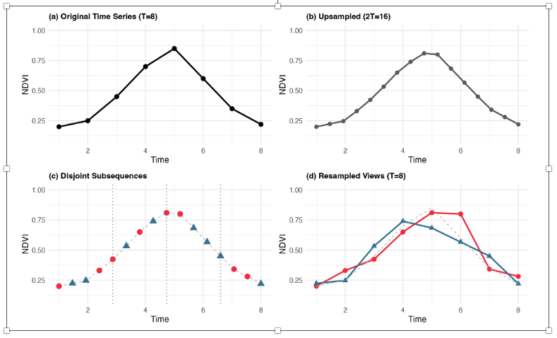
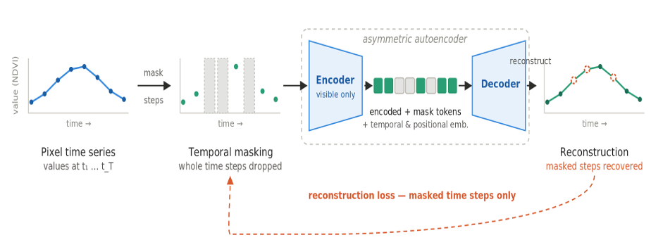
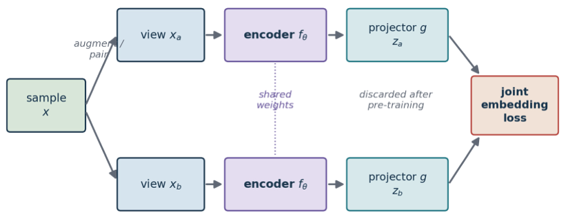
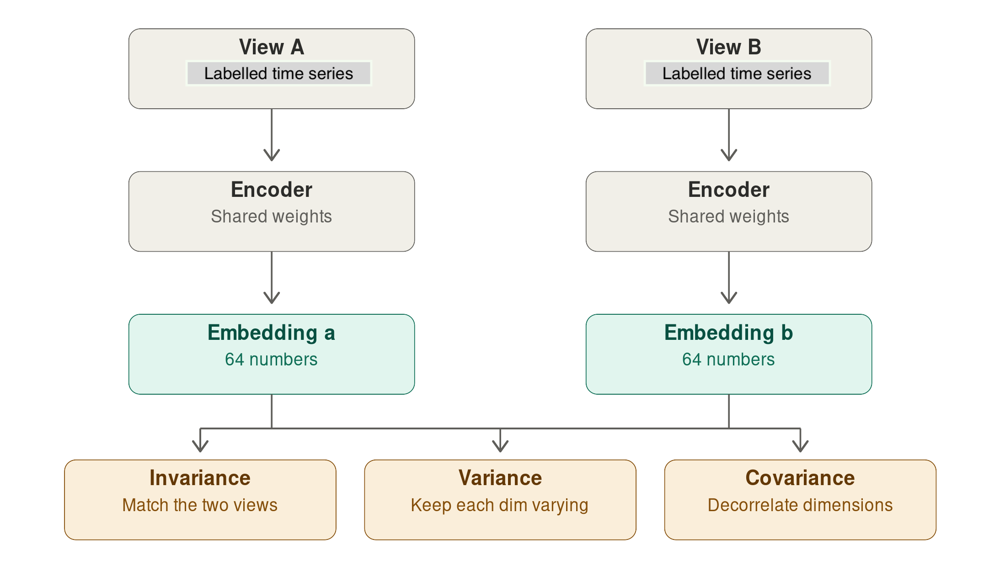
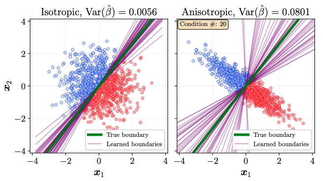
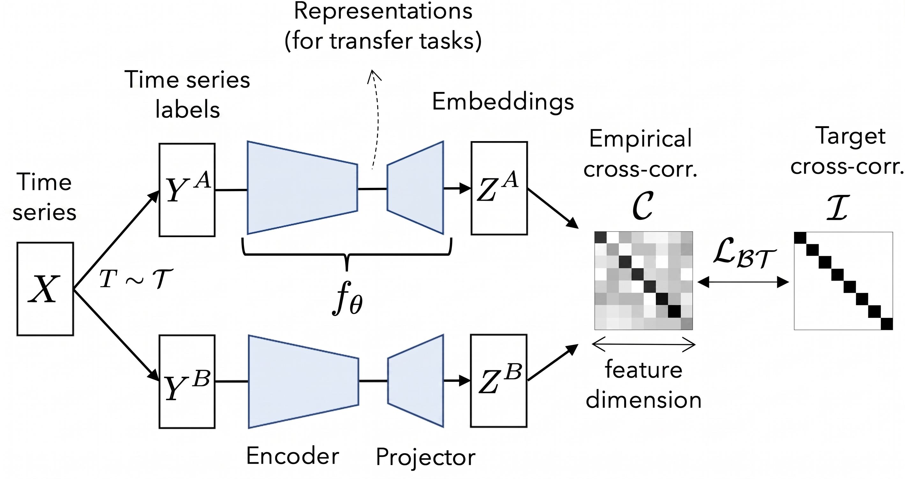
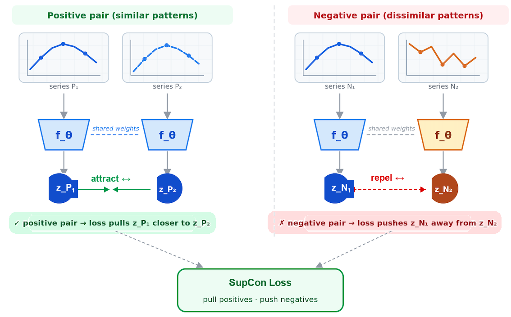

---
title: "Embedding Methods in SITS"
format: html
--- 

### Configurations to run this chapter{-}

:::{.panel-tabset}
## R
```{r}
#| echo: true
#| eval: true
#| output: false
# load package "tibble"
library(tibble)
# load packages "sits" and "sitsdata"
library(sits)
library(sitsdata)
# set tempdir if it does not exist 
tempdir_r <- "~/sitsbook/tempdir/R/emb_methods"
dir.create(tempdir_r, showWarnings = FALSE, recursive = TRUE)
```
## Python
```{python}
#| echo: true
#| eval: true
#| output: false
# load "pysits" library
from pysits import *
from pathlib import Path
# set tempdir if it does not exist
tempdir_py = Path.home() / "sitsbook/tempdir/Python/emb_methods"
# Create directory
tempdir_py.mkdir(parents=True, exist_ok=True)
```
:::

## Overview

The `sits` package allows building of customized embeddings of data cubes using self-supervised learning. Any regular data cube, including multi-year and multi-modal ones, can be used as input. It is also recommended, but not mandatory, that a classified data cube for the same region and timeframe is used as a basis for selecting a stratified training sample. Users can thus design regional foundational models designed for specific cases and thus produce embeddings that are arguably better align with their desired products.  

The embedding workflow takes satellite image time series, learns a compact
representation with a deep-learning encoder, and then runs a standard
classification pipeline on those embeddings instead of on the raw bands.

In `sits` we provide five methods for building embeddings. Four are self-supervised:  (a) Masked Autoencoders (MAE); (b) Variance-Invariance-Covariance regularization (VICReg); (c) Lean Joint-Embedding Predictive Architectures (LeJEPA);  (d) Barlow Twins. Two are supervised: Supervised Contrastive Learning and Supervised Barlow Twins. In what follows, we describe the embedding pipeline and then present each method in detail.

More detailed descriptions of the processing pipeline for generating embeddings
are given in the next chapters of the book: ["Building regional embeddings: a simple example"](https://e-sensing.github.io/sitsbook/emb_build.html) and ["Building regional embeddings: a full example"](https://e-sensing.github.io/sitsbook/emb_example.html)

## Embedding pipeline 

The function `sits_pre_train()` trains a deep-learning encoder from time-series samples. It is a thin dispatcher: the real work is done by an `encoder_method` function. Its parameters are:

- `samples`: time series used for training the encoders (class `sits`). Labels are optional — SSL methods ignore them; supervised methods use them only to build pairs. The dimensions (bands and time-steps) of the data in `samples` should match those of data cube to be encoded.
- `rl_method`: representation learning method that takes `samples` and returns a `sits_encoder`. One of `sits_ssl_lejepa()`, `sits_ssl_vicreg()`, `sits_ssl_mae()`, `sits_ssl_barlow_twins()`, `sits_barlow_twins` or `sits_contrastive_learning()`, 

## Time series augmentation for self-supervised learning

When using self-supervised contrastive learning methods with satellite image time s
series, a key challenge is building positive pairs. Transformations that work for images have no obvious counterpart for time series, and generic perturbations such as jittering, resizing or masking bring limited gains. 

Saget et al.[@Saget2025] propose an augmentation method based on resampling that
generates positive pairs for contrastive pre-training on unlabelled satellite
image time series. Given a series $S \in \mathbb{R}^{T \times C}$, the
procedure has three steps. First, $S$ is linearly
interpolated onto a finer grid of $T_{up} = 2T$ steps, yielding a densified
series $S_{up}$ from which many plausible observation schedules can be drawn.
Second, two subsequences of $T_{sub} = T/2$ steps are drawn from $S_{up}$ with
disjoint index sets, so that the two views share no observation; the draw is
constrained to take at least $\lfloor T_{sub}/4 \rfloor$ steps from each
temporal quarter, which forces both views to span the whole observation period
instead of collapsing onto a single window. Third, the timestamps of each
subsequence are rescaled to the original interval $[1,T]$ and the values are
interpolated back onto the original grid, so both views regain the length,
resolution and alignment expected by the encoder.

The two views describe the same phenological trajectory under different revisit schedules and slightly shifted timing, which pushes the encoder to encode the shape of the seasonal profile rather than the exact acquisition dates. This augmentation
strategy is used for the LeJEPA, VICReg and Barlow Twins methods.


```{r}
#| echo: false
#| label: fig-emb-augment
#| out-width: 100%
#| fig-align: "center"
#| fig-cap: | 
#|   {Resampling augmentation for time series. (a) The input series. (b) Linear upsampling to $T_{up} = 2T$ steps. (c) Two subsequences of $T_{sub} = T/2$ steps drawn with disjoint index sets. (d) Timestamps rescaled to $[1,T]$ and interpolated onto the original grid, producing a positive pair; the grey line is the input series.(source: [Saget2025]).


```

## Parameters shared by all representation learning functions

Each learning method has its own set of parameters. They also a set of common parameters, shown below.

| Parameter | Meaning |
|:---|:---|
| `samples` | Time series used for training the encoder. Default = `NULL` when called via `sits_pre_train()` |
| `embedding_dim` | Dimension of resulting embeddings (default = 64).|
| `encoder_model` | Deep learning method that takes time series as input and produces latent representations that are used to compute the loss function. Default = `sits_tempcnn()`. Alternatives include `sits_lighttae()`, `sits_tae()`,  `sits_resnet()` and `sits_mlp()` |
| `epochs` | Maximum number of training epochs (default = 150). | 
| `batch_size` | Batch size for training (default = 512). | 
| `validation_split` |  Fraction of samples held out for validation loss monitoring (default = 0.2) |
| `optimizer` | Gradient descent algorithms. Computes loss and improves model paramenters for better convergence (default = `torch::adamw`). | 
| `opt_hparams`| Named list of hyperparameters used by the optimizer. The most relevant parameters are `lr` (learning rate - default = 5.0e-04), `eps` (term added to the denominator to improve numerical stability - default = 1.0e-08), and `weight_decay` (prevents machine learning models from overfitting - default = 1.0e-06). |
| `lr_decay_epochs` | Step size (in epochs) for learning rate decay (default = 1) | 
| `lr_decay_rate` | Multiplicative decay factor (default = 0.95) |
| `patience` | Number of epochs without improvement for halting training (default = 20). | 
| `min_delta` | Minimum improvement for early stopping (default = 0.01) | 
| `verbose` | Logical value for printing training progress (default = `FALSE`| 
| `seed` | Random seed for reproducibility (default = 10). | 

: Parameters shared by all encoders {#tbl-common-par}


## Masked autoencoders

### Description 

Masked Autoencoders (MAEs) are a class of self-supervised learning neural networks that learn to understand data by hiding portions of an input and training the model to reconstruct the missing pieces [@He2022]. In `sits`, the MAE model is fed a satellite image time series where a large portion of the values are masked. By default, a fraction of the time steps are hidden, chosen at random. The model aims to reconstruct the missing values based on the available ones. To do this successfully, the model must learn what features naturally co-occur in the real world. When processing  time-series data, the MAE learns the temporal signatures of land cover and land use pixels. This is also the strategy used in the PRESTO foundational model [@Tseng2024]. The embedding is the latent representation produced by the encoder before reconstruction. It is never explicitly told what is important — it discovers structure by being forced to predict missing observations.

```{r}
#| echo: false
#| label: fig-emb-mae
#| out-width: 100%
#| fig-align: "center"
#| fig-cap: | 
#|   Graphical illustration of an masked autoencoders of time series. .


```

The MAE loss function is a masked mean squared error, computed only over the
masked positions. The indices run over the batch of samples $i$, the time steps
$t$, and the spectral bands $b$. The binary mask $m_{i,t} \in \{0,1\}$ marks
which time steps are hidden ($1 = $ masked, $0 = $ visible); it carries no band
index because masking is applied to a whole time step at once, so every band of
a masked step is hidden together. The target $x_{i,t,b}$ is the *observed* value
after the same per-band normalization (zero mean, unit variance across the
training samples) used to feed the encoder, and $\hat{x}_{i,t,b}$ is the value
the decoder reconstructs for that position:

$$
\mathcal{L}_{\text{MAE}} = \frac{\displaystyle\sum_{i,t,b} m_{i,t}\,\bigl(\hat{x}_{i,t,b} - x_{i,t,b}\bigr)^2}{\displaystyle\max\!\Bigl(1,\; \sum_{i,t,b} m_{i,t}\Bigr)}
$$ {#eq-mae}

The numerator accumulates the squared reconstruction error only where
$m_{i,t}=1$, and the denominator counts those same masked entries, so the loss
is the mean squared error over the hidden positions. The denominator is clamped
to at least 1 to avoid division by zero when a batch happens to mask nothing.
Visible time steps contribute nothing to the loss: the encoder is rewarded only
for reconstructing what it could not see.

### Implementation of MAE in SITS

The parameters specific for `sits_ssl_mae()` in sits are:

The parameters specific for `sits_ssl_mae()` are described below. For an explanation of how the methods work, please check the preceeding chapter of the book.

| Parameter | Meaning |
|:---|:---|
| `decoder_width` | Width of the decoder MLP hidden layer used for reconstruction (default = 128). |
| `masking_method` | Mask selection strategy. Options are `"random"`  or `"contiguous"` (default = `"random"`). | 
| `mask_ratio` | Fraction of timesteps to mask (default = 0.6). |
| `mask_value` | Fill value used for masked timesteps (default = 0). |
| `masked_bands` | which bands to mask. Default = `NULL`, when all bands are eligible for masking. | 

: Specific parameters for MAE method {#tbl-mae-par}

The following examples shows how to obtain an MAE encoder from a
data set of 480,000 samples covering the Brazilian Cerrado, built using Landsat-8 images. The Cerrado is the second largest biome in Brazil with 1.9 million km$^2$. It is a tropical savanna ecoregion with a rich ecosystem ranging from grasslands to woodlands. Please be aware that running the example below takes a long 
processing time. For more details, please see the following chapters.

:::{.panel-tabset}
## R
```{r}
#| eval: false
# Obtain the samples 
samples_pretrain <- sits_from_hf(
  repo = "e-sensing/samples_cerrado",
  file = "samples_cerrado_2017_2024_pretrain.parquet",
  type = "dataset"
)

# build a MAE encoder 
mae_encoder <- sits_pre_train(
    samples = samples_pretrain,
    rl_method = sits_ssl_mae(
        embedding_dim = 64L,
        masking_method = "random",
        mask_ratio = 0.6,
        mask_value = 0,
        masked_bands = NULL,
        encoder_model = sits_tempcnn(),
        decoder_width = 128L,
        dropout_rate = 0.2,
        epochs = 150,
        batch_size = 512
    )
)
```
## Python
```{python}
#| eval: false
# Obtain the samples 
samples_pretrain = sits_from_hf(
  repo = "e-sensing/samples_cerrado",
  file = "samples_cerrado_2017_2024_pretrain.parquet",
  type = "dataset"
)

# build an MAE encoder 
mae_encoder <- sits_pre_train(
    samples = samples_pretrain,
    rl_method = sits_ssl_mae(
        embedding_dim = 64L,
        masking_method = "random",
        mask_ratio = 0.6,
        mask_value = 0,
        masked_bands = NULL,
        encoder_model = sits_tempcnn(),
        decoder_width = 128L,
        dropout_rate = 0.2,
        epochs = 150,
        batch_size = 512
    )
)
```
:::

## Joint-embedding methods: an overview

Apart from MAE, the self-supervised algorithms used in `sits` are joint-embedding
methods. A joint-embedding encoder-projector architecture is a framework in deep learning where an encoder extracts features from unlabeled data, and a projector maps those features into a lower-dimensional space to optimize a contrastive or invariance-based loss function. Joint-embedding self-supervised methods learn time-series representation  by making the embeddings of two related "views" of the same sample agree, while preventing the trivial solution where the network maps everything to a constant (collapse).

The encoder is  neural network (such as a TempCNN or LightTAE that converts raw input data (like an image) into a rich, high-level latent representation. The projector is a multi-layer perceptron (MLP) placed on top of the encoder. It maps the encoder's output into a separate space where the loss function is computed. The encoder-projector combination trains the network by pulling together representations of different augmented views of the same input (positive pairs). 

The encoder maps each  view of shape *[batch, n_times, n_bands]*, to an embedding of shape *[batch, embedding_dim]* . The encoder weights are reused for both positive views. The projector matches a shape of size *[batch, embedding_dim] proj_dim]* to a shape of size *[batch, proj_dim]*. Both views go through the same encoder and the same projector (shared weights), and the loss is computed on the two projected outputs. During fine-tuning or deployment for downstream tasks, the projector is usually thrown away, and only the backbone encoder is retained. 

```{r}
#| echo: false
#| label: fig-emb-encoder-projector
#| out-width: 100%
#| fig-align: "center"
#| fig-cap: | 
#|   Joint embedding encoder-projector architecture for self-supervised learning og time series.

```


In what follows, we discuss three methods of SSL using joint-embedding: VICReg (Variance-Invariance-Covariance Regularization), LeJEPA (Lean Joint-Embedding Predictive Architecture), and Barlow Twins.

## VICReg (Variance-Invariance-Covariance Regularization)

### Description

VICReg is a **joint-embedding** method [@Bardes2022] that  builds two views of the same input, push both through a shared encoder and projector, and applies a loss that keeps paired embeddings close while preventing collapse. For satellite image time series, we employ the method proposed by [@Saget2025] that generates positive pairs, as described above.

The core problem VICReg solves is collapse. When training a network so that two views of the same pixel give the same embedding, the easiest solution is to output the same constant vector for every pixel, which is a consistent but useless approach. Contrastive methods avoid this by also pushing different locations apart, which requires negative pairs. VICReg avoids it with statistics computed over the batch instead, with three loss components: invariance, variance, and covariance

Invariance does the actual learning: take a pixel's time series, build two augmented views of it and penalize the distance between their embeddings. The message is "these are the same place, so describe them the same way." Variance blocks the shortcut. Look at one dimension of the embedding — say dimension 7 — across all pixels in the batch, and measure its standard deviation. If it falls below a threshold, the loss penalizes it. Every one of the 64 slots must keep varying across the batch, so a constant output is no longer available.

Covariance stops a subtler failure. Nothing so far prevents all 64 dimensions from encoding the same thing 64 times over. So VICReg computes the covariance between every pair of dimensions and pushes the off-diagonal terms toward zero. Each slot is forced to carry information the others don't, spreading the signal across the full vector. The covariance term is important, since spectral bands and consecutive dates are heavily correlated — decorrelation is what makes 64 dimensions hold 
different information. 
```{r}
#| echo: false
#| label: fig-emb-vicreg
#| out-width: 100%
#| fig-align: "center"
#| fig-cap: | 
#|     VICReg pipeline. The augmented views are passed through the encoder to produce embeddings, which are used as inputs to the loss functions. 

```

The embeddings produce two augmented views per sample. Let $Z^A, Z^B \in \mathbb{R}^{N \times D}$ be the projector outputs of the two views over a batch of $N$ samples. Each row $Z_{i,:}$ is the embedding of sample $i$, and $D = d_p$ is the projector output dimensionality. Take $Z_{:,j}$ for column $j$, i.e. feature $j$ collected across all $N$ samples in the batch. The VICReg loss sums three terms: 

*Invariance* — mean squared error between paired views:

$$
\ell_{\text{inv}} = \frac{1}{N D}\sum_{i=1}^{N}\sum_{j=1}^{D}\bigl(Z^A_{i,j} - Z^B_{i,j}\bigr)^2.
$$ {#eq-vicreg-inv}


*Variance* — a hinge that keeps each feature's batch standard deviation at or
above 1 (with $\epsilon = 10^{-4}$), preventing collapse:

$$
v(Z) = \frac{1}{D}\sum_{j=1}^{D}\max\!\Bigl(0,\; 1 - \sqrt{\operatorname{Var}(Z_{:,j}) + \epsilon}\Bigr),
\qquad
\ell_{\text{var}} = \tfrac{1}{2}\bigl(v(Z^A) + v(Z^B)\bigr).
$$ {#eq-vicreg-var}

Here $\operatorname{Var}(Z_{:,j})$ is the variance of feature $j$ across the $N$
samples of the batch, so $\sqrt{\operatorname{Var}(Z_{:,j}) + \epsilon}$ is that
feature's batch standard deviation. The hinge $\max(0,\,1 - \cdot)$ penalizes a
feature only while its standard deviation stays below the target value of 1;
once every feature varies enough, the term is zero. $\ell_{\text{var}}$ averages
this penalty over the two views.


*Covariance* — decorrelates features by penalizing off-diagonal covariance:

$$
C(Z) = \frac{1}{N-1}\,(Z - \bar Z)^\top (Z - \bar Z),
\qquad
c(Z) = \frac{1}{D}\sum_{j \neq k} \bigl[C(Z)\bigr]_{j,k}^2,
$$ {#eq-vicreg-cov1}

$$
\ell_{\text{cov}} = c(Z^A) + c(Z^B).
$$ {#eq-vicreg-cov2}

Here $\bar Z$ is the row vector of column means (each feature's batch mean),
broadcast over rows, so $C(Z) \in \mathbb{R}^{D \times D}$ is the empirical
covariance matrix of the features and $[C(Z)]_{j,k}$ is the covariance between
features $j$ and $k$. The sum in $c(Z)$ runs over all off-diagonal pairs
($j \neq k$), so only *between-feature* covariances are penalized while the
diagonal variances are left to the variance term.

The total loss combines them with fixed coefficients:

$$
\mathcal{L}_{\text{VICReg}} = \lambda_{\text{sim}}\,\ell_{\text{inv}}
\;+\; \lambda_{\text{std}}\,\ell_{\text{var}}
\;+\; \lambda_{\text{cov}}\,\ell_{\text{cov}}
$$ {#eq-vicreg-loss}

The default weights are $\lambda_{\text{sim}} = 25$, $\lambda_{\text{std}} = 25$,
and $\lambda_{\text{cov}} = 1$ (arguments `sim_coeff`, `std_coeff`, and
`cov_coeff`). The covariance term is given a much smaller weight because it sums
$D(D-1)$ off-diagonal entries and would otherwise dominate. Since VICReg relies on batch statistics, so batches need to be large enough for the variance and covariance estimates to be significant.

### Implementation of VICReg in SITS

The parameters specific for `sits_ssl_vicreg()` are described below. For an explanation of how the methods work, please check the preceeding chapter of the book.

| Parameter | Meaning |
|:---|:---|
| `proj_dim` | Dimensionality of the projector head used during pre-training (default = 128). |
| `sim_coeff` | Weight of the invariance (MSE) term in  the VICReg loss. Balances the mean squared distance matching the two augmented views (default = 25.0) | 
| `std_coeff` | Weight of the variance (hinge) term in the VICReg loss. Enforces the standard deviation per dimension above the target threshold  (default = 25.0) |
| `cov_coeff` | Weight of the covariance (off-diagonal) term in the VICReg loss. Decorrelates the variables to eliminate redundancy (default = 1.0) |

: Specific parameters for VICReg method {#tbl-vicreg-par}

The following examples shows how to obtain a VICReg encoder from a
data set of 480,000 samples covering the Brazilian Cerrado, built using Landsat-8 images. Please be aware that running the example below takes a long 
processing time. For more details, please see the following chapters.

:::{.panel-tabset}
## R
```{r}
#| eval: false
# recover the samples 
samples_pretrain <- sits_from_hf(
  repo = "e-sensing/samples_cerrado",
  file = "samples_cerrado_2017_2024_pretrain.parquet",
  type = "dataset"
)

# build a VICReg encoder 
vicreg_encoder <- sits_pre_train(
    samples = samples_pretrain,
    rl_method = sits_ssl_vicreg(
        embedding_dim    = 64,
        proj_dim         = 128,
        sim_coeff        = 25.0,
        std_coeff        = 25.0,
        cov_coeff        = 1.0,
        encoder_model    = sits_tempcnn(),
        epochs           = 150,
        batch_size       = 128
    )
)
```
## Python
```{python}
#| eval: false
# Obtain the samples 
samples_pretrain = sits_from_hf(
  repo = "e-sensing/samples_cerrado",
  file = "samples_cerrado_2017_2024_pretrain.parquet",
  type = "dataset"
)

# build a VICReg encoder 
vicreg_encoder = sits_pre_train(
    samples = samples_pretrain,
    rl_method = sits_ssl_vicreg(
        embedding_dim    = 64,
        proj_dim         = 128,
        sim_coeff        = 25.0,
        std_coeff        = 25.0,
        cov_coeff        = 1.0,
        encoder_model    = sits_tempcnn(),
        epochs           = 150,
        batch_size       = 128
    )
)
```
:::

## Lean Joint-Embedding Predictive Architecture (LeJEPA)

### Description

LeJEPA [@Balestriero2025] starts from a different place than VICReg. Its two ideas are: predict in embedding space rather than pixel space, and replace the VICReg loss with a single provable constraint. LeJEPA avoids the embedding collapse by assuming that the embedding distribution should be an isotropic Gaussian, which minimizes worst-case downstream prediction risk. Intuitively, the cloud of embeddings should be a round ball with no preferred direction, because any elongation means some directions carry most of the information. So instead of discouraging collapse indirectly, LeJEPA just enforces the target distribution directly. The loss has two terms — prediction error plus a distributional penalty — with a single trade-off hyperparameter.

```{r}
#| echo: false
#| label: fig-emb-lejepa
#| out-width: 100%
#| fig-align: "center"
#| fig-cap: | 
#|     LeJEPA avoids anisotropic (right) embeddings which lead to higher variance estimators and enforces isotropic embeddings (left) (source: [@Balestriero2025]) 

```

One challenge for LeJEPA is that testing whether a cloud of 64-dimensional vectors is Gaussian is inviable in high dimensions. The authors introduce SIGReg (Sketched Isotropic Gaussian Regularization). Draw many random directions, project every embedding onto each one, and run a one-dimensional goodness-of-fit test against a standard normal. If every random slice looks normal, the joint distribution is isotropic Gaussian. Cost is linear in batch size and dimension.

LeJEPA has useful properties for Earth observation data. Isotropy means all 64 dimensions carry comparable information, which matters when your deliverable is a fixed-length vector to be used for classification. 

The loss function in LeJEPA stacks the two projected views as $z \in \mathbb{R}^{V \times N \times D}$,
where $V = 2$ is the number of views, $N$ is the number of samples in the batch,
and $D$ is the projector output dimensionality. The entry $z^{(v)}_{i,j}$ is
feature $j$ of view $v$ for sample $i$. The loss has two components: an
invariance loss and the SIGReg term.

The invariance loss is the MSE (mean square error) of each view from the per-sample view mean
$\bar z = \tfrac{1}{V}\sum_v z^{(v)}$:

$$
\ell_{\text{inv}} = \frac{1}{V N D}\sum_{v,i,j}\bigl(\bar z_{i,j} - z^{(v)}_{i,j}\bigr)^2.
$$ {#eq-lejepa-inv}

The SIGReg (Sketched Isotropic Gaussian Regularization) pushes the embedding
distribution toward an isotropic Gaussian. For each of $S$ random unit
directions $a \in \mathbb{R}^D$ (argument `num_slices`, default 256), it forms
the scalar projections $u_i = z^{(v)}_i \cdot a$ — the coordinate of sample $i$'s
embedding along direction $a$ — and compares their empirical characteristic
function (ECF) to the characteristic function of a standard normal,
$\phi(t) = e^{-t^2/2}$, using an Epps–Pulley statistic evaluated at $K$
quadrature knots $t_k \in [0, 3]$ (argument `num_knots`, default 17):

$$
\widehat{\phi}(t_k) = \frac{1}{N}\sum_{i=1}^{N} e^{\,\mathrm{i}\,t_k u_i},
$$ {#eq-lejepa-knots}

where $\mathrm{i} = \sqrt{-1}$ is the imaginary unit (not to be confused with the
sample index $i$ in the sum), and $\widehat{\phi}(t_k)$ is the empirical
characteristic function of the projected values $u_1,\dots,u_N$ evaluated at knot
$t_k$. If the $u_i$ are standard normal, $\widehat{\phi}(t_k)$ should match
$\phi(t_k)$; SIGReg penalizes the squared gap between them.


$$
\ell_{\text{SIGReg}} = \mathbb{E}_{a,\,v}\!\left[\; N \sum_{k=1}^{K} \tilde w_k
\Bigl(\underbrace{\bigl(\tfrac{1}{N}\textstyle\sum_i \cos(t_k u_i) - \phi(t_k)\bigr)^2}_{\text{real part}}
+ \underbrace{\bigl(\tfrac{1}{N}\textstyle\sum_i \sin(t_k u_i)\bigr)^2}_{\text{imag. part}}\Bigr)\right],
$$ {#eq-lejepa-sigreg}


Here $\mathbb{E}_{a,\,v}$ denotes the average over the $S$ random directions $a$
and the $V$ views, and $\tilde w_k$ are the trapezoidal quadrature weights for
the knots $t_k$ (multiplied by $\phi(t_k)$) that turn the sum over knots into an
approximation of the integrated ECF discrepancy. The bracket splits the squared
error of the complex ECF into its real part (a sum of cosines, compared to
$\phi(t_k)$) and its imaginary part (a sum of sines, whose target is 0 because
the standard normal is symmetric). The two terms combine with a single
trade-off:

$$
\mathcal{L}_{\text{LeJEPA}} = (1 - \lambda)\,\ell_{\text{inv}} \;+\; \lambda\,\ell_{\text{SIGReg}}
$$ {#eq-lejepa-loss}

with default $\lambda = 0.02$.

### Implementation of LeJEPA in SITS

The parameters specific for `sits_ssl_lejepa()` are described below. For an explanation of how the methods work, please check the preceeding chapter of the book.

| Parameter | Meaning |
|:---|:---|
| `proj_dim` | Dimension of the projector head used for pre-training (default = 128). | 
| `lambda` | Trade-off between invariance and SIGReg (default = 0.02). |
| `num_knots` | Number of quadrature knots for the SIGReg characteristic function test. Default = 17. | 
| `num_slices` | Number of random projection directions for SIGReg (default = 256). |

: Specific parameters for LeJEPA method {#tbl-lejepa-par}

The following examples shows how to obtain a LeJEPA encoder from a
data set of 480,000 samples covering the Brazilian Cerrado, built using Landsat-8 images. Please be aware that running the example below takes a long 
processing time. For more details, please see the following chapters.

:::{.panel-tabset}
## R
```{r}
#| eval: false
# recover the samples 
# recover the samples 
samples_pretrain <- sits_from_hf(
  repo = "e-sensing/samples_cerrado",
  file = "samples_cerrado_2017_2024_pretrain.parquet",
  type = "dataset"
)

# build a LeJEPA encoder 
lejepa_encoder <- sits_pre_train(
    samples = samples_pretrain,
    rl_method = sits_ssl_lejepa(
        embedding_dim    = 64,
        proj_dim         = 128,
        lambda           = 0.02,
        num_knots        = 17,
        num_slices       = 256,
        encoder_model    = sits_tempcnn(),
        epochs           = 150,
        batch_size       = 128
    )
)
```
## Python
```{python}
#| eval: false
# Obtain the samples 
samples_pretrain = sits_from_hf(
  repo = "e-sensing/samples_cerrado",
  file = "samples_cerrado_2017_2024_pretrain.parquet",
  type = "dataset"
)

# build a LeJEPA encoder 
lejepa_encoder = sits_pre_train(
    samples = samples_pretrain,
    rl_method = sits_ssl_lejepa(
        embedding_dim    = 64,
        proj_dim         = 128,
        lambda           = 0.02,
        num_knots        = 17,
        num_slices       = 256,
        encoder_model    = sits_tempcnn(),
        epochs           = 150,
        batch_size       = 128
    )
)
```
:::

## Barlow Twins 

### Description

Barlow Twins is a way to teach an encoder to produce good, compact embeddings
without needing a classifier at training time [@Zbontar2021]. The model takes two perturbed versions of the same time series.  It is trained to produce identical embeddings for both versions. A regularizer prevents the network from solving the problem in a trivial way, collapsing everything into the same vector. TESSERA uses this approach, with sparse random temporal sampling to simulate the actual irregularity of the series [@Feng2025]. 

The method is self-supervised — the two views are
two random augmentations of one image. Two versions of the same sample run in parallel through the same encoder (a Siamese setup). 
The loss function measures how  much the two embeddings agree, 
and whether their individual dimensions carry non-redundant information. 

```{r}
#| echo: false
#| label: fig-emb-btwins
#| out-width: 100%
#| fig-align: "center"
#| fig-cap: | 
#|   Graphical representation of the Barlow Twins model.


```
.

The loss function works by taking a batch of $N$ view-pairs. Run both views through encoder + projector to get $Z^A, Z^B \in \mathbb{R}^{N \times D}$, where $N$ is the batch size and $D = d_p$ is the projector output dimensionality. Standardize each feature $j$ across the batch to zero mean and unit variance, giving $\hat{Z}^A_{i,j}$ and $\hat{Z}^B_{i,j}$ (the standardized value of feature $j$ for sample $i$ in views A and B). Then form the empirical cross-correlation matrix:

$$
C_{jk} = \frac{1}{N}\sum_{i=1}^{N} \hat{Z}^A_{i,j}\,\hat{Z}^B_{i,k}, \qquad C \in \mathbb{R}^{D \times D}, \quad C_{jk} \in [-1, 1].
$$ {#eq-btwins-cross}

Each entry $C_{jk}$ is the correlation, over the $N$ samples, between feature $j$
of view A and feature $k$ of view B; the diagonal $C_{jj}$ measures how
consistently feature $j$ is reproduced across the two views. The objective
function drives $C$ toward the identity matrix:

$$
\mathcal{L}_{\text{BT}}
= \underbrace{\sum_{j=1}^{D}\bigl(C_{jj} - 1\bigr)^{2}}_{\text{invariance}}
\;+\;
\lambda\,\underbrace{\sum_{j=1}^{D}\sum_{\substack{k=1\\ k \neq j}}^{D} C_{jk}^{2}}_{\text{redundancy reduction}}
$$ {#eq-btwins-loss}

The invariance term pushes the diagonal to 1, so the same feature computed from the two same-class views should be perfectly correlated. The redundancy-reduction term pushes the off-diagonals to 0: distinct embedding dimensions should be decorrelated, so they carry non-overlapping information.
The parameter $\lambda$ (default $5\times10^{-3}$) balances the two. 

### Implementation of Barlow Twins in SITS

The specific parameters for the Barlow Twins method are described below.

| Parameter | Meaning |
|:---|:---|
| `proj_dim` | Dimensionality of the projector head used during pre-training (default = 128). |
| `bt_lambda`| Weight of the redundancy-reduction (off-diagonal) term in the Barlow Twins loss. Default = 5e-3. |
    
: Specific parameters for Barlow Twins method {#tbl-btwins-par}

The following examples shows how to obtain a Barlow Twins encoder from a
data set of 480,000 samples covering the Brazilian Cerrado, built using Landsat-8 images. Please be aware that running the example below takes a long 
processing time. For more details, please see the following chapters.

:::{.panel-tabset}
## R
```{r}
#| eval: false
# recover the samples 
samples_pretrain <- sits_from_hf(
  repo = "e-sensing/samples_cerrado",
  file = "samples_cerrado_2017_2024_pretrain.parquet",
  type = "dataset"
)

# build a Barlow Twins encoder 
btwins_encoder <- sits_pre_train(
    samples = samples_pretrain,
    rl_method = sits_ssl_barlow_twins(
        embedding_dim    = 64,
        proj_dim         = 128,
        bt_lambda        = 0.005,
        encoder_model    = sits_tempcnn(),
        epochs           = 150,
        batch_size       = 128
    )
)
```
## Python
```{python}
#| eval: false
# Obtain the samples 
samples_pretrain = sits_from_hf(
  repo = "e-sensing/samples_cerrado",
  file = "samples_cerrado_2017_2024_pretrain.parquet",
  type = "dataset"
)

# build a Barlow Twins encoder 
btwins_encoder = sits_pre_train(
    samples = samples_pretrain,
    rl_method = sits_ssl_barlow_twins(
        embedding_dim    = 64,
        proj_dim         = 128,
        bt_lambda        = 0.005,
        encoder_model    = sits_tempcnn(),
        epochs           = 150,
        batch_size       = 128
    )
)
```
:::

## Supervised Contrastive Learning

Supervised Contrastive learning [@Khosla2021] is a algorithm that learns useful representations by teaching an encoder to distinguish *similar* pairs from *dissimilar* ones. For each instance, two time series with the same label form a positive pair; time series from other classes act as negatives. Training pulls positives together in the embedding space and pushes negatives apart. 
This provides a rich training signal: the embedding of a Cerrado grassland pixel is pulled toward all other grassland pixels in the batch simultaneously, regardless of which satellite, season, or sensor captured them. The result is tighter class clusters in embedding space and better generalization to new samples. Supervised methods can exploit existing reference data that operational monitoring programmes typically hold.

```{r}
#| echo: false
#| label: fig-emb-contrast
#| out-width: 100%
#| fig-align: "center"
#| fig-cap: | 
#|  Contrastive self-supervised learning applied directly to pairs of time series. 
#|  A shared encoder f_0 maps each series to an embedding. The loss attracts embeddings
#|  from similar series (positive pairs) and repels those from dissimilar series (negative pairs).


```

Concretely, training works on batches. Take a batch of time series, each with a class label. For every time series in the batch (the *anchor*), all other series sharing its label are its positives, and every series from a different class is a negative. The encoder projects each series to a normalized embedding vector, and the loss compares the anchor to all other embeddings at once via a dot-product similarity scaled by a temperature parameter $\tau$: it rewards the anchor for being closer (in cosine similarity) to its positives than to any of the negatives, summed over every possible anchor in the batch. Because a batch can contain many positives per anchor (e.g., several pixels of "pasture"), the signal is denser than a plain "one positive, many negatives" contrastive setup — the more same-class examples are in a batch, the more comparisons reinforce the same pull, which is why larger, class-balanced batches tend to produce tighter clusters.

Let $I$ be the index set of a batch, $z_i$ the L2-normalized embedding of sample $i$ (so a dot product $z_i \cdot z_p$ equals the cosine similarity between the two embeddings), $A(i) = I \setminus \{i\}$ all other samples in the batch, and $P(i) \subset A(i)$ the subset of $A(i)$ sharing sample $i$'s class label, with $|P(i)|$ its number of positives. The supervised contrastive loss is

$$
\mathcal{L}_{\text{SupCon}} = \sum_{i \in I} \frac{-1}{|P(i)|} \sum_{p \in P(i)} \log \frac{\exp\!\left(z_i \cdot z_p / \tau\right)}{\displaystyle\sum_{a \in A(i)} \exp\!\left(z_i \cdot z_a / \tau\right)}
$$ {#eq-supcon-loss}

For each anchor $i$, the inner term is a softmax over all other samples in the batch, with positives $p \in P(i)$ playing the role of the "correct" class; the log-softmax is then averaged over all of the anchor's positives, and the outer sum runs over every sample acting as an anchor in turn. Minimizing $\mathcal{L}_{\text{SupCon}}$ increases $z_i \cdot z_p$ for same-class pairs relative to $z_i \cdot z_a$ for all other pairs, which is what packs same-class embeddings into tight clusters while keeping different classes apart. The temperature $\tau$ controls how sharply the loss penalizes close negatives: a small $\tau$ concentrates the gradient on the hardest negatives (those nearly as similar to the anchor as its positives), while a larger $\tau$ spreads it more evenly.

### Implementation of Supervised Contrastive Learning in `sits`

The parameters specific for the `sits_contrastive_learning()` are:


| Parameter | Meaning |
|---|---|
| `proj_dim` | Dimensionality of the projector head used during pre-training (default = 128). |
| `scaling`| Scaling for the contrastive loss.  Lower values sharpen the similarity distribution (default = 0.07). |
| `num_pairs` | Total number of pairs to  form per epoch. Default = NULL. In this case, one pair is formed for every sample in the training split. |

: Specific parameters for supervised contrastive learning method {#tbl-btwins-par}

The following examples shows how to obtain a Suprevised Constrastive Learning encoder from a
data set of 480,000 samples covering the Brazilian Cerrado, built using Landsat-8 images. Please be aware that running the example below takes a long 
processing time. For more details, please see the following chapters.

:::{.panel-tabset}
## R
```{r}
#| eval: false
# Recover the samples 
samples_pretrain <- sits_from_hf(
  repo = "e-sensing/samples_cerrado",
  file = "samples_cerrado_2017_2024_pretrain.parquet",
  type = "dataset"
)

# build a Supervised Contrastive Learner encoder 
supcon_encoder <- sits_pre_train(
    samples = samples_pretrain,
    rl_method = sits_contrastive_learning(
        embedding_dim    = 64,
        proj_dim         = 128,
        scaling          - 0.07,
        encoder_model    = sits_tempcnn(),
        epochs           = 150,
        batch_size       = 128
    )
)
```
## Python
```{python}
#| eval: false
# Obtain the samples 
samples_pretrain = sits_from_hf(
  repo = "e-sensing/samples_cerrado",
  file = "samples_cerrado_2017_2024_pretrain.parquet",
  type = "dataset"
)

# build a Supervised Contrastive Learning encoder 
supcon_encoder = sits_pre_train(
    samples = samples_pretrain,
    rl_method = sits_contrastive_learning(
        embedding_dim    = 64,
        proj_dim         = 128,
        scaling          - 0.07,
        encoder_model    = sits_tempcnn(),
        epochs           = 150,
        batch_size       = 128
    )
)
```
:::

## Supervised Barlow Twins 

### Description

Supervised Barlow Twins is an alternative way to teach an encoder to produce good, compact embeddings using the Barlow Twins loss. The original method [@Zbontar2021] is self-supervised — the two views are two random augmentations of one image. The SSL Barlow Twins method has been
described above. The supervised variant requires the samples to be labelled.
The two views passed through the encoder are two different samples that share the
same class label. Labels decide which samples get paired, but the loss
itself never looks at the labels. Two samples of the same class run in parallel
through the same encoder (a Siamese setup). The loss function measures how 
much the two embeddings agree, and whether their individual dimensions carry
non-redundant information.

In sits, the supervised Barlow Twins method is implemented with `sits_barlow_twins()`. 
Its parameters are the same as the `sits_ssl_barlow_twins()`, described above.
The only difference is that the training samples must be labelled. 

### Comparing the six methods

The five approaches differ mainly in what counts as a "pair," whether the loss needs negative examples to avoid collapse, and where — if at all — class labels enter the picture.

| Method | Pair type | Needs negatives? | Where supervision enters |
|:---|---|---|---|
| MAE | anchor vs. its own masked/visible split | No | Unsupervised; labels not used |
| VICReg | two augmented views of the same series | No (collapse blocked by variance/covariance terms) | Unsupervised; pairs come from augmentation, not labels |
| LeJEPA | two augmented views of the same series | No (collapse blocked by isotropic-Gaussian constraint) | Unsupervised; pairs come from augmentation, not labels |
| Barlow Twins | two augmented views of the same series | No (redundancy-reduction term blocks collapse, not negatives) | Unsupervised; pairs come from augmentation|
| Supervised Barlow Twins | two different series sharing the same class label | No (redundancy-reduction term blocks collapse, not negatives) | Supervised only through pairing — the loss itself never sees the labels |
| Supervised Contrastive Learning | anchor vs. all same-class series in the batch (positives) and all other-class series (negatives) | Yes — negatives are the mechanism that pushes classes apart | Supervised directly in the loss — the softmax denominator is built from same- vs. different-class comparisons |

Some points are worth noting. MAE stands apart in never comparing two views at all — the loss compares reconstruction to itself, not to a second embedding — whereas the others are all joint-embedding methods pairing two things. VICReg, LeJEPA and Barlow Twins build their positive pairs entirely from augmentation rather than from class labels. Supervised Barlow Twins uses labels only to pick which pairs go together, leaving the objective itself label-agnostic. Supervised Contrastive Learning uses negatives inside the objective function.

## References

