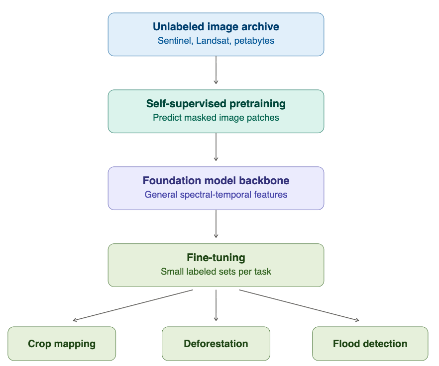
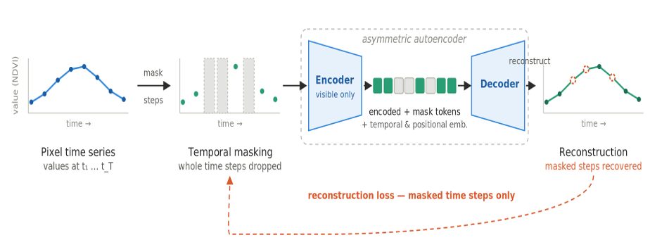
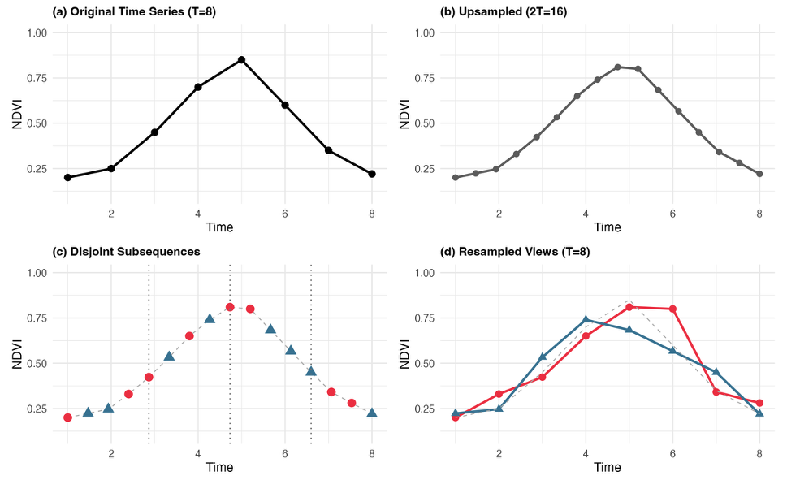
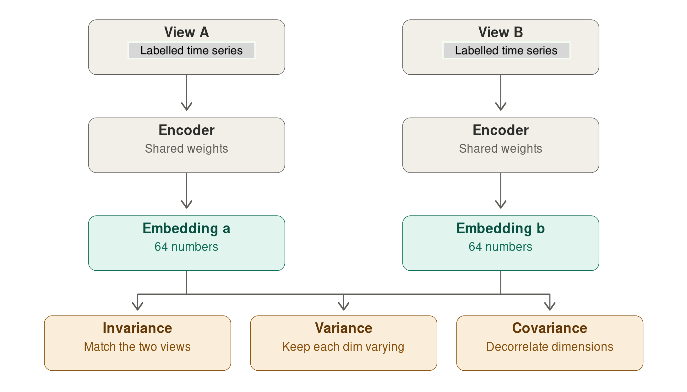
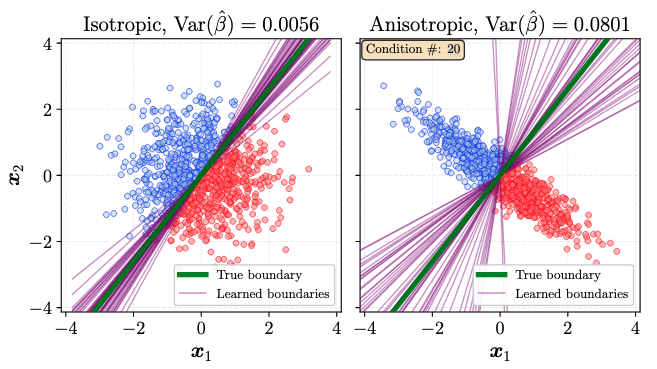
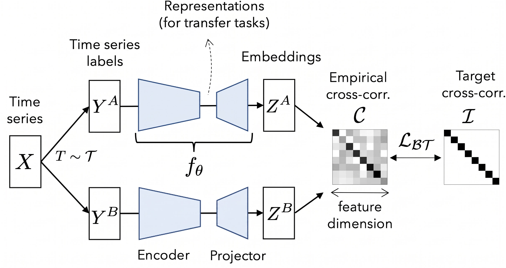
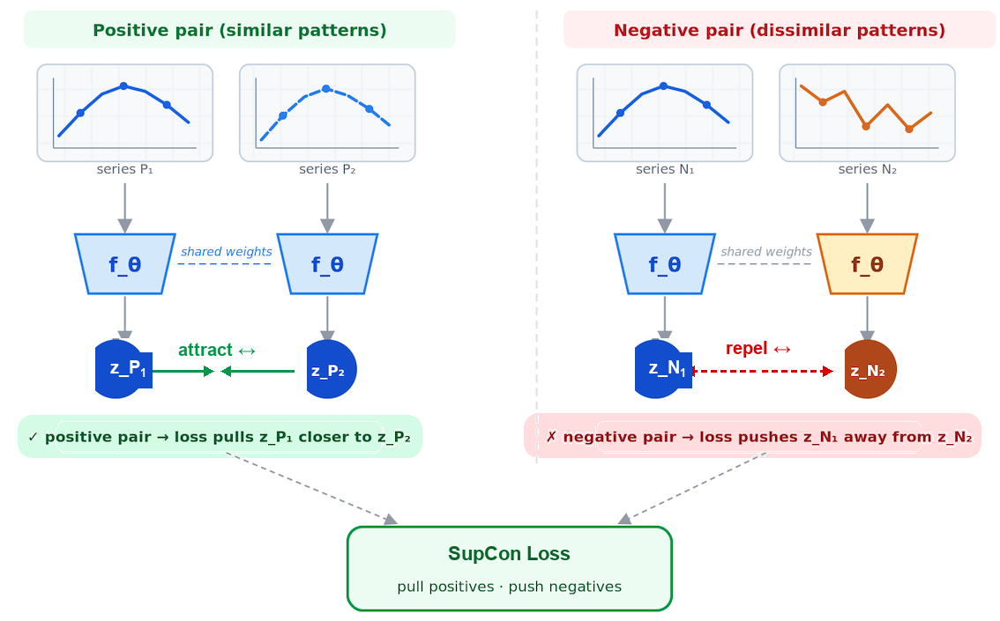

---
title: "Foundational Models and Embeddings"
format: html
--- 

## Introduction

The term "foundation model" entered the AI lexicon around 2021, coined by researchers at Stanford to describe large neural networks trained on vast, diverse datasets that can be adapted — through fine-tuning or prompting — to a wide range of downstream tasks. GPT-4, Gemini, and Claude are foundation models for language. Their defining characteristic is not size alone, but the breadth of their pretraining: they learn general representations of their domain that transfer efficiently to specialized problems. Earth observation foundation models (EOFMs) apply this logic to satellite and aerial imagery. Rather than training a separate model from scratch for each task, such as flood detection or crop classification, an EO foundation model attempts to produce general-purpose representations. Their assumption is that such shared backbones can then be adapted to downstream applications with relatively little labeled data.

EOFMs share is a common goal: compress high-dimensional satellite data — spectral bands × time steps × spatial extent — into compact vectors that capture the semantically relevant structure. The approaches differ in what they compress, how the network is trained to produce useful compressions, and what counts as a useful representation.

Relevant developments in the area include: (a) AlphaEarth Foundations [@Brown2025], developed by Google DeepMind, which generates geospatial representations from multiple data sources; (b) TESSERA (Temporal Embeddings of Surface Spectra for Earth Representation and Analysis), a pixel-by-pixel foundational model for Sentinel-1/2 multimodal time series [@Feng2025]; (c) Prithvi, developed by IBM in partnership with NASA, trained with Harmonized Landsat Sentinel-2 (HLS) data using masked autoencoders [@Szwarcman2026]; and (d) PRESTO (Pretrained Remote Sensing Transformer, trained on Sentinel-1, Sentinel-2, and Landsat imagery time series using time series [@Tseng2024].

## How are foundational models built?

Foundation models for Earth observation (EO) are built in two stages: large-scale self-supervised pretraining on unlabeled satellite archives, followed by lightweight fine-tuning for specific applications. The key insight is that satellite archives (Sentinel, Landsat, commercial constellations) contain petabytes of imagery but almost no labels. Instead of annotating, builders curate a globally sampled, cloud-filtered pretraining corpus and train a transformer backbone to handle multispectral bands, SAR, irregular revisit times, and varying resolutions.

```{r}
#| echo: false
#| label: fig-emb-pipeline
#| out-width: 100%
#| fig-align: "center"
#| fig-cap: | 
#|   Pipeline for building foundational models for Earth observation.


```


**Self-supervised learning** builds its own training signal from the data itself, through a *pretext task*: the model predicts hidden patches, matches the same field across seasons, or aligns optical with SAR views of one location. No annotation is needed, so training can scale to the entire archive, and the encoder it produces transfers across tasks. 

Although self-supervised learning methods do not use labels, they face the practical problem of being trained on samples that capture the different types of land cover and events. For this reason, many self-supervised models take a coarse resolution classified map as reference for their sampling location. For example, Alpha Earth [@Brown2025] uses stratified random sample by ecoregion ID from the 2017 RESOLVE Ecoregions dataset [@Dinerstein2017], sampling biogeographic regions equally regardless of extent.

```{r}
#| echo: false
#| label: fig-emb-ssl
#| out-width: 70%
#| fig-align: "center"
#| fig-cap: | 
#|   The general pipeline of self-supervised learning. The visual representation is learned through self-supervision that comes from the unlabeled data. The learned parameters serve as a pre-trained model and are transferred to supervised downstream tasks for fine-tuning (source: Wang et al., 2022).

knitr::include_graphics("./images/emb_ssl_paradigm.png")
```

In many cases, especially when working with transfer learning or multi-year classification, it is useful to build task-specific foundational models using  **supervised learning**, which requires pixels or polygons annotated by experts. The model learns a direct mapping from imagery to those labels, and the result is a single-task model, for example, a land use and land cover classifier. 

Consider the challenge of mapping a large region for long period (e.g., 20 years). One common approach is to train models using a subset of the data (e.g., 5 years) and then extend these samples to other years. The challenge of this transfer learning approach is its sensitivity to yearly changes of the ground response due to climate variability. Using supervised foundational models reduce this sensitivity. 

## What are embeddings?

A satellite image time series is inherently high-dimensional. A single Sentinel-2 pixel in the Brazil Data Cube may carry 10 spectral bands × 24 annual observations, so a classifier must find patterns in a 240-dimensional space — computationally costly, and unreliable without many training samples. Adding another sensor such as Sentinel-1 enlarges the attribute space further.

An embedding is a compact alternative representation of that pixel, typically 32 to 64 values, produced by passing the raw time series through an Earth observation foundation model. The network — pretrained on large volumes of unlabeled imagery — learns which patterns are worth keeping: the shape of the phenological curve, the mean spectral response, temporal variability, seasonal events. The result is a fixed-length numerical descriptor that summarizes months or years of multi-source data for one location, discarding noise.

Geometrically, the embedding maps each pixel to a point in a latent space where spectrotemporally similar pixels lie close together. Amazonian primary forest and regenerating secondary forest occupy nearby but distinguishable regions; pasture and soybean fall far apart.

This matters because labeled samples are scarce and expensive in remote sensing. Self-supervised learning sidesteps that constraint by learning representations from unlabeled archives, and the resulting model generates the embeddings.

Embeddings therefore offer two practical advantages:

- **Compression and efficiency** — complex multi-source data collapses into short vectors, sharply reducing storage and processing cost.
- **Structured similarity** — the latent space clusters similar areas, making it straightforward to compare locations, detect spatial patterns, and transfer knowledge between regions.

After pretraining on time series, embeddings are expected to encode:

* Phenological state — crop growth cycles and seasonal vegetation dynamics.
* Land cover type — forest, cropland, wetland, built-up, bare soil, water, discriminated by time series shape.
* Change regime — gradual trends (urbanization, progressive deforestation), seasonal cycles, and abrupt events (fires, floods).
* Anomaly signatures** — deviations from the expected seasonal trajectory indicating stress, disturbance, or human activity.

```{r}
#| echo: false
#| label: fig-emb-vector
#| out-width: 70%
#| fig-align: "center"
#| fig-cap: | 
#|   Graphical representation of embeddings. A neural networks captures the spectral, spatial and temporal features of the images and produces multi-dimensional vectors for each pixel.

knitr::include_graphics("./images/emb_embedding.png")
```


## Building embeddings in sits

The aim of the embedding functions in `sits` is not to develop yet another global foundation model. Our focus is narrower and, we believe, more achievable: serving users to produce *regional embeddings*. These are representations tailored to specific tasks (primarily LUCC) over large, well-defined regions of interest. Global foundation models necessarily make upfront design choices about input data and temporal representation; these choices will not be optimal for a particular regional application. Our approach instead gives users control. Input data (optical, SAR, climate), learning method, and temporal coverage can all be configured to the problem at hand.

In `sits` we provide five methods for building embeddings. Three are self-supervised:  (a) Masked Autoencoders (MAE); (b) Variance-Invariance-Covariance regularization (VICReg); (c) Lean Joint-Embedding Predictive Architectures (LeJEPA). Two are supervised: (a) Barlow Twins; (b) Supervised Contrastive Learning.

The target user we have in mind faces a large-scale, multi-year classification problem under concrete constraints of computational time and data availability. In most such cases, users already have a baseline classification from a prior year or adjacent region, which motivates our choice of two supervised methods alongside the unsupervised ones. This is a deliberate design decision: supervised methods can exploit existing reference data that operational monitoring programmes typically hold.

### Masked autoencoders

Masked Autoencoders (MAEs) are a class of self-supervised learning neural networks that learn to understand data by hiding portions of an input and training the model to reconstruct the missing pieces [@He2022]. In the `sits` package, the MAE model is fed a satellite image time series where a large portion of the values are masked. By default, a fraction `mask_ratio = 0.6` of the time steps are hidden, chosen with `masking_method = "random"` (an alternative `"contiguous"` strategy masks a single continuous block of time steps). The model aims to reconstruct the missing values based on the available ones. To do this successfully, the model must learn what features naturally co-occur in the real world. When processing  time-series data, the MAE learns the temporal signatures of land cover and land use pixels. This is also the strategy used in the PRESTO foundational model [@Tseng2024]. The embedding is the latent representation produced by the encoder before reconstruction. It is never explicitly told what is important — it discovers structure by being forced to predict missing observations.

```{r}
#| echo: false
#| label: fig-emb-mae
#| out-width: 100%
#| fig-align: "center"
#| fig-cap: | 
#|   Graphical illustration of an masked autoencoders of time series. .


```

The MAE loss function is a masked mean squared error, computed only over the
masked positions. The indices run over the batch of samples $i$, the time steps
$t$, and the spectral bands $b$. The binary mask $m_{i,t} \in \{0,1\}$ marks
which time steps are hidden ($1 = $ masked, $0 = $ visible); it carries no band
index because masking is applied to a whole time step at once, so every band of
a masked step is hidden together. The target $x_{i,t,b}$ is the *observed* value
after the same per-band normalization (zero mean, unit variance across the
training samples) used to feed the encoder, and $\hat{x}_{i,t,b}$ is the value
the decoder reconstructs for that position:

$$
\mathcal{L}_{\text{MAE}} = \frac{\displaystyle\sum_{i,t,b} m_{i,t}\,\bigl(\hat{x}_{i,t,b} - x_{i,t,b}\bigr)^2}{\displaystyle\max\!\Bigl(1,\; \sum_{i,t,b} m_{i,t}\Bigr)}
$$ {#eq-mae}

The numerator accumulates the squared reconstruction error only where
$m_{i,t}=1$, and the denominator counts those same masked entries, so the loss
is the mean squared error over the hidden positions. The denominator is clamped
to at least 1 to avoid division by zero when a batch happens to mask nothing.
Visible time steps contribute nothing to the loss: the encoder is rewarded only
for reconstructing what it could not see.

### VICReg (Variance-Invariance-Covariance Regularization)

VICReg is a **joint-embedding** method [@Bardes2022]. Its build two views of the same input, push both
through a shared encoder and projector, and apply a loss that keeps paired
embeddings close while preventing collapse. For satellite image time series, we employ the method proposed by [@Saget2025] that generates positive pairs. Each time series is upsampled. From this new time series, we extract disjoint subsequences while preserving temporal coverage.

```{r}
#| echo: false
#| label: fig-emb-saget
#| out-width: 100%
#| fig-align: "center"
#| fig-cap: | 
#|     Upsampling of time series. The original series is doubled in frequency. Two similar series are extracted to form augmented positive pairs for self-supervised learning.

```

The core problem VICReg solves is collapse. When training a network so that two views of the same pixel give the same embedding, the easiest solution is to output the same constant vector for every pixel on Earth — perfectly consistent but useless. Contrastive methods avoid this by also pushing different locations apart, which requires negative pairs. VICReg avoids it with statistics computed over the batch instead.

Invariance does the actual learning: take a pixel's time series, build two augmented views of it and penalize the distance between their embeddings. The message is "these are the same place, so describe them the same way."

Variance blocks the shortcut. Look at one dimension of the embedding — say dimension 7 — across all pixels in the batch, and measure its standard deviation. If it falls below a threshold, the loss penalizes it. Every one of the 64 slots must keep varying across the batch, so a constant output is no longer available.

Covariance stops a subtler failure. Nothing so far prevents all 64 dimensions from encoding the same thing 64 times over. So VICReg computes the covariance between every pair of dimensions and pushes the off-diagonal terms toward zero. Each slot is forced to carry information the others don't, spreading the signal across the full vector. The covariance term is important, since spectral bands and consecutive dates are heavily correlated — decorrelation is what makes 64 dimensions actually worth 64 dimensions. And because the two branches only need to produce comparable vectors, they can be different encoders on different sensors, which is how multimodal EO models are trained.

```{r}
#| echo: false
#| label: fig-emb-vicreg
#| out-width: 100%
#| fig-align: "center"
#| fig-cap: | 
#|     VICReg pipeline. The augmented views are passed through the encoder to produce embeddings, which are used as inputs to the loss functions. 

```

The embeddings produce two resampling-augmented views per sample. Let $Z^A, Z^B \in \mathbb{R}^{N \times D}$ be the projector outputs of the two views over a batch of $N$ samples. Each row $Z_{i,:}$ is the embedding of sample $i$, and $D = d_p$ is the projector *output* dimensionality — not the size of the input time series. We write $Z_{:,j}$ for column $j$, i.e. feature $j$ collected across all $N$ samples in the batch. The VICReg loss sums three terms: 

*Invariance* — mean squared error between paired views:

$$
\ell_{\text{inv}} = \frac{1}{N D}\sum_{i=1}^{N}\sum_{j=1}^{D}\bigl(Z^A_{i,j} - Z^B_{i,j}\bigr)^2.
$$ {#eq-vicreg-inv}


*Variance* — a hinge that keeps each feature's batch standard deviation at or
above 1 (with $\epsilon = 10^{-4}$), preventing collapse:

$$
v(Z) = \frac{1}{D}\sum_{j=1}^{D}\max\!\Bigl(0,\; 1 - \sqrt{\operatorname{Var}(Z_{:,j}) + \epsilon}\Bigr),
\qquad
\ell_{\text{var}} = \tfrac{1}{2}\bigl(v(Z^A) + v(Z^B)\bigr).
$$ {#eq-vicreg-var}

Here $\operatorname{Var}(Z_{:,j})$ is the variance of feature $j$ across the $N$
samples of the batch, so $\sqrt{\operatorname{Var}(Z_{:,j}) + \epsilon}$ is that
feature's batch standard deviation. The hinge $\max(0,\,1 - \cdot)$ penalizes a
feature only while its standard deviation stays below the target value of 1;
once every feature varies enough, the term is zero. $\ell_{\text{var}}$ averages
this penalty over the two views.

VICReg also relies on batch statistics, so batches need to be large enough for the variance and covariance estimates to mean something.

*Covariance* — decorrelates features by penalizing off-diagonal covariance:

$$
C(Z) = \frac{1}{N-1}\,(Z - \bar Z)^\top (Z - \bar Z),
\qquad
c(Z) = \frac{1}{D}\sum_{j \neq k} \bigl[C(Z)\bigr]_{j,k}^2,
$$ {#eq-vicreg-cov1}

$$
\ell_{\text{cov}} = c(Z^A) + c(Z^B).
$$ {#eq-vicreg-cov2}

Here $\bar Z$ is the row vector of column means (each feature's batch mean),
broadcast over rows, so $C(Z) \in \mathbb{R}^{D \times D}$ is the empirical
covariance matrix of the features and $[C(Z)]_{j,k}$ is the covariance between
features $j$ and $k$. The sum in $c(Z)$ runs over all off-diagonal pairs
($j \neq k$), so only *between-feature* covariances are penalized while the
diagonal variances are left to the variance term.

The total loss combines them with fixed coefficients:

$$
\mathcal{L}_{\text{VICReg}} = \lambda_{\text{sim}}\,\ell_{\text{inv}}
\;+\; \lambda_{\text{std}}\,\ell_{\text{var}}
\;+\; \lambda_{\text{cov}}\,\ell_{\text{cov}}
$$ {#eq-vicreg-loss}

The default weights are $\lambda_{\text{sim}} = 25$, $\lambda_{\text{std}} = 25$,
and $\lambda_{\text{cov}} = 1$ (arguments `sim_coeff`, `std_coeff`, and
`cov_coeff`). The covariance term is given a much smaller weight because it sums
$D(D-1)$ off-diagonal entries and would otherwise dominate.

### Lean Joint-Embedding Predictive Architectures (LeJEPA)

LeJEPA [@Balestriero2025] starts from a different place than VICReg. Its two ideas are: predict in embedding space rather than pixel space, and replace the VICReg loss with a single provable constraint. The algorithm takes two views of the same encodes the visible part, encodes the hidden part, and asks a predictor to guess the embedding of the hidden part from the embedding of the visible part. 

LeJEPA avoid the embedding collapse by assuming that the embedding distribution should be an isotropic Gaussian, which minimizes worst-case downstream prediction risk. Intuitively, the cloud of embeddings should be a round ball with no preferred direction, because any elongation means some directions carry most of the information and a downstream probe pointed elsewhere does badly. So instead of discouraging collapse indirectly, LeJEPA just enforces the target distribution directly. The loss has two terms — prediction error plus a distributional penalty — with a single trade-off hyperparameter.

```{r}
#| echo: false
#| label: fig-emb-lejepa
#| out-width: 100%
#| fig-align: "center"
#| fig-cap: | 
#|     LeJEPA avoids anisotropic (right) embeddings which lead to higher variance estimators and enforces isotropic embeddings (left) (source: [@Balestriero2025]) 

```

One challenge for LeJEPA is that testing whether a cloud of 64-dimensional vectors is Gaussian is inviable in high dimensions. The authors introduce SIGReg (Sketched Isotropic Gaussian Regularization). Draw many random directions, project every embedding onto each one, and run a one-dimensional goodness-of-fit test against a standard normal. If every random slice looks normal, the joint distribution is isotropic Gaussian. Cost is linear in batch size and dimension.

LeJEPA has useful properties for Earth observation data. Isotropy means all 64 dimensions carry comparable information, which matters when your deliverable is a fixed-length vector to be used for classification. 

The loss function in LeJEPA stacks the two projected views as $z \in \mathbb{R}^{V \times N \times D}$,
where $V = 2$ is the number of views, $N$ is the number of samples in the batch,
and $D$ is the projector output dimensionality. The entry $z^{(v)}_{i,j}$ is
feature $j$ of view $v$ for sample $i$. The loss has two components: an
invariance loss and the SIGReg term.

The invariance loss is the MSE of each view from the per-sample view mean
$\bar z = \tfrac{1}{V}\sum_v z^{(v)}$:

$$
\ell_{\text{inv}} = \frac{1}{V N D}\sum_{v,i,j}\bigl(\bar z_{i,j} - z^{(v)}_{i,j}\bigr)^2.
$$ {#eq-lejepa-inv}
The SIGReg (Sketched Isotropic Gaussian Regularization) pushes the embedding
distribution toward an isotropic Gaussian. For each of $S$ random unit
directions $a \in \mathbb{R}^D$ (argument `num_slices`, default 256), it forms
the scalar projections $u_i = z^{(v)}_i \cdot a$ — the coordinate of sample $i$'s
embedding along direction $a$ — and compares their empirical characteristic
function (ECF) to the characteristic function of a standard normal,
$\phi(t) = e^{-t^2/2}$, using an Epps–Pulley statistic evaluated at $K$
quadrature knots $t_k \in [0, 3]$ (argument `num_knots`, default 17):

$$
\widehat{\phi}(t_k) = \frac{1}{N}\sum_{i=1}^{N} e^{\,\mathrm{i}\,t_k u_i},
$$ {#eq-lejepa-knots}

where $\mathrm{i} = \sqrt{-1}$ is the imaginary unit (not to be confused with the
sample index $i$ in the sum), and $\widehat{\phi}(t_k)$ is the empirical
characteristic function of the projected values $u_1,\dots,u_N$ evaluated at knot
$t_k$. If the $u_i$ are standard normal, $\widehat{\phi}(t_k)$ should match
$\phi(t_k)$; SIGReg penalizes the squared gap between them.


$$
\ell_{\text{SIGReg}} = \mathbb{E}_{a,\,v}\!\left[\; N \sum_{k=1}^{K} \tilde w_k
\Bigl(\underbrace{\bigl(\tfrac{1}{N}\textstyle\sum_i \cos(t_k u_i) - \phi(t_k)\bigr)^2}_{\text{real part}}
+ \underbrace{\bigl(\tfrac{1}{N}\textstyle\sum_i \sin(t_k u_i)\bigr)^2}_{\text{imag. part}}\Bigr)\right],
$$ {#eq-lejepa-sigreg}


Here $\mathbb{E}_{a,\,v}$ denotes the average over the $S$ random directions $a$
and the $V$ views, and $\tilde w_k$ are the trapezoidal quadrature weights for
the knots $t_k$ (multiplied by $\phi(t_k)$) that turn the sum over knots into an
approximation of the integrated ECF discrepancy. The bracket splits the squared
error of the complex ECF into its real part (a sum of cosines, compared to
$\phi(t_k)$) and its imaginary part (a sum of sines, whose target is 0 because
the standard normal is symmetric). The two terms combine with a single
trade-off:

$$
\mathcal{L}_{\text{LeJEPA}} = (1 - \lambda)\,\ell_{\text{inv}} \;+\; \lambda\,\ell_{\text{SIGReg}}
$$ {#eq-lejepa-loss}

with default $\lambda = 0.02$.


### Supervised Barlow Twins 

Barlow Twins is a way to teach an encoder to produce good, compact embeddings
without needing a classifier at training time.Instead of reconstructing values, the model takes two perturbed versions of the same time series or two series of the same class.  It is trained to produce identical embeddings for both versions. A regularizer prevents the network from solving the problem in a trivial way, collapsing everything into the same vector. TESSERA uses this approach, with sparse random temporal sampling to simulate the actual irregularity of the series [@Feng2025]. 

The original method [@Zbontar2021] is self-supervised — the two views are
two random augmentations of one image. The `sits` variant makes it supervised
in one specific way: the two views are two different samples that share the
same class label. Labels decide which samples get paired, but the loss
itself never looks at the labels. Two samples of the same class run in parallel
through the same encoder (a Siamese setup). The loss function measures how 
much the two embeddings agree, and whether their individual dimensions carry
non-redundant information?  Supervision works through pairing, 
not through the objective function.

```{r}
#| echo: false
#| label: fig-emb-btwins
#| out-width: 100%
#| fig-align: "center"
#| fig-cap: | 
#|   Graphical representation of supervised Barlow Twins model.


```
.

The loss function works by taking a batch of $N$ view-pairs. Run both views through encoder + projector to get $Z^A, Z^B \in \mathbb{R}^{N \times D}$, where $N$ is the batch size and $D = d_p$ is the projector output dimensionality. Standardize each feature $j$ across the batch to zero mean and unit variance, giving $\hat{Z}^A_{i,j}$ and $\hat{Z}^B_{i,j}$ (the standardized value of feature $j$ for sample $i$ in views A and B). Then form the empirical cross-correlation matrix:

$$
C_{jk} = \frac{1}{N}\sum_{i=1}^{N} \hat{Z}^A_{i,j}\,\hat{Z}^B_{i,k}, \qquad C \in \mathbb{R}^{D \times D}, \quad C_{jk} \in [-1, 1].
$$ {#eq-btwins-cross}

Each entry $C_{jk}$ is the correlation, over the $N$ samples, between feature $j$
of view A and feature $k$ of view B; the diagonal $C_{jj}$ measures how
consistently feature $j$ is reproduced across the two views. The objective
function drives $C$ toward the identity matrix:

$$
\mathcal{L}_{\text{BT}}
= \underbrace{\sum_{j=1}^{D}\bigl(C_{jj} - 1\bigr)^{2}}_{\text{invariance}}
\;+\;
\lambda\,\underbrace{\sum_{j=1}^{D}\sum_{\substack{k=1\\ k \neq j}}^{D} C_{jk}^{2}}_{\text{redundancy reduction}}
$$ {#eq-btwins-loss}

The invariance term pushes the diagonal to 1, so the same feature computed from the two same-class views should be perfectly correlated. The redundancy-reduction term pushes the off-diagonals to 0: distinct embedding dimensions should be decorrelated, so they carry non-overlapping information.
The parameter $\lambda$ (default $5\times10^{-3}$) balances the two. 


### Supervised Contrastive Learning

Supervised Contrastive learning [@Khosla2021] is a algorithm that learns useful representations
by teaching an encoder to distinguish *similar* pairs from *dissimilar* ones. For each instance, two time series with the same label form a positive pair; time series from other classes act as negatives. Training pulls positives together in the embedding space and pushes negatives apart. 
This provides a rich training signal: the embedding of a Cerrado grassland pixel is pulled toward all other grassland pixels in the batch simultaneously, regardless of which satellite, season, or sensor captured them. The result is tighter class clusters in embedding space and better generalization to new samples. 

```{r}
#| echo: false
#| label: fig-emb-contrast
#| out-width: 100%
#| fig-align: "center"
#| fig-cap: | 
#|  Contrastive self-supervised learning applied directly to pairs of time series. 
#|  A shared encoder f_0 maps each series to an embedding. The InfoNCE loss attracts embeddings
#|  from similar series (positive pairs) and repels those from dissimilar series (negative pairs).


```

Concretely, training works on batches. Take a batch of time series, each with a class label. For every time series in the batch (the *anchor*), all other series sharing its label are its positives, and every series from a different class is a negative. The encoder projects each series to a normalized embedding vector, and the loss compares the anchor to all other embeddings at once via a dot-product similarity scaled by a temperature parameter $\tau$: it rewards the anchor for being closer (in cosine similarity) to its positives than to any of the negatives, summed over every possible anchor in the batch. Because a batch can contain many positives per anchor (e.g., several pixels of "pasture"), the signal is denser than a plain "one positive, many negatives" contrastive setup — the more same-class examples are in a batch, the more comparisons reinforce the same pull, which is why larger, class-balanced batches tend to produce tighter clusters.

Let $I$ be the index set of a batch, $z_i$ the L2-normalized embedding of sample $i$ (so a dot product $z_i \cdot z_p$ equals the cosine similarity between the two embeddings), $A(i) = I \setminus \{i\}$ all other samples in the batch, and $P(i) \subset A(i)$ the subset of $A(i)$ sharing sample $i$'s class label, with $|P(i)|$ its number of positives. The supervised contrastive loss is

$$
\mathcal{L}_{\text{SupCon}} = \sum_{i \in I} \frac{-1}{|P(i)|} \sum_{p \in P(i)} \log \frac{\exp\!\left(z_i \cdot z_p / \tau\right)}{\displaystyle\sum_{a \in A(i)} \exp\!\left(z_i \cdot z_a / \tau\right)}
$$ {#eq-supcon-loss}

For each anchor $i$, the inner term is a softmax over all other samples in the batch, with positives $p \in P(i)$ playing the role of the "correct" class; the log-softmax is then averaged over all of the anchor's positives, and the outer sum runs over every sample acting as an anchor in turn. Minimizing $\mathcal{L}_{\text{SupCon}}$ increases $z_i \cdot z_p$ for same-class pairs relative to $z_i \cdot z_a$ for all other pairs, which is what packs same-class embeddings into tight clusters while keeping different classes apart. The temperature $\tau$ controls how sharply the loss penalizes close negatives: a small $\tau$ concentrates the gradient on the hardest negatives (those nearly as similar to the anchor as its positives), while a larger $\tau$ spreads it more evenly.

### Comparing the five methods

The five approaches differ mainly in what counts as a "pair," whether the loss needs negative examples to avoid collapse, and where — if at all — class labels enter the picture.

| Method | Pair type | Needs negatives? | Where supervision enters |
|---|---|---|---|
| MAE | anchor vs. its own masked/visible split (no second view) | No | Unsupervised; labels not used |
| VICReg | two resampled/augmented views of the same series | No (collapse blocked by variance/covariance terms) | Unsupervised; pairs come from augmentation, not labels |
| LeJEPA | two views of the same series (visible vs. hidden, in embedding space) | No (collapse blocked by isotropic-Gaussian constraint) | Unsupervised; pairs come from augmentation, not labels |
| Barlow Twins (sits variant) | two different series sharing the same class label | No (redundancy-reduction term blocks collapse, not negatives) | Supervised only through pairing — the loss itself never sees the labels |
| SupCon | anchor vs. all same-class series in the batch (positives) and all other-class series (negatives) | Yes — negatives are the mechanism that pushes classes apart | Supervised directly in the loss — the softmax denominator is built from same- vs. different-class comparisons |

Two contrasts are worth noting. First, MAE stands apart in never comparing two views at all — the loss compares reconstruction to itself, not to a second embedding — whereas the other four are all joint-embedding methods pairing two things. Second, only SupCon uses negatives inside the objective function; unlike SupCon, VICReg and LeJEPA build their positive pairs entirely from augmentation rather than from class labels, and Barlow Twins uses labels only to pick which pairs go together, leaving the objective itself label-agnostic.

## Global and local embeddings

There are many proposals of EOFMs, including patch-based models such as IBM and NASA's Prithvi [@Szwarcman2026], time-series based methods such as PRESTO [@Tseng2024] and TESSERA [@Feng2025] and mixed-models such as Google's AlphaEarth [@Brown2025]. These models are pre-trained on global datasets, attempting to learn universal statistical patterns that apply uniformly from the Arctic tundra to the Sahara Desert. The goal is to create a single latent representation of the Earth's landmass.

Pre-training data shapes what a model can and cannot know: a model trained predominantly on temperate agricultural landscapes may generalize poorly to tropical forests or Arctic tundra. As an alternative to global EOFMs, we consider that it is important to offer to the geospatial community the possibility of building regional EOFMs. The advantages of regional models include:
 
* Geographical ontologies are local: Global models inherently seek universal patterns, which often leads to the homogenization of complex landscapes. A global model might force a highly specific, transitional biome in South America into a generic "shrubland" category to minimize its global error rate. Regional models, trained exclusively on local data cubes, respect local geographical ecological patterns.

* Agro-ecological specificity: Agricultural practices vary wildly across the globe. A model trained  on the synchronized, single-harvest monocultures of the American Midwest will struggle to embed multi-cropping systems found in tropical regions like Brazil or Southeast Asia.

* Mitigating structural data bias: Historically, global datasets are heavily skewed toward the Global North, where ground-truth validation is abundant. A regional model prevents the AI from importing spatial biases learned from entirely different continents, resulting in much higher-fidelity embeddings for local downstream tasks.

## References

