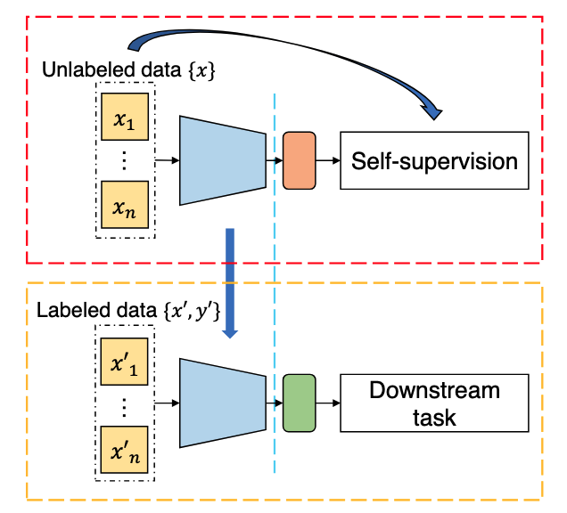
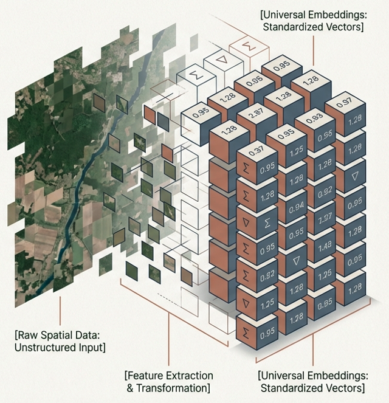

---
title: "Foundational Models and Embeddings"
format: html
--- 

## Introduction

The term "foundation model" entered the AI lexicon around 2021, coined by researchers at Stanford to describe large neural networks trained on vast, diverse datasets that can be adapted — through fine-tuning or prompting — to a wide range of downstream tasks. GPT-4, Gemini, and Claude are foundation models for language. Their defining characteristic is not size alone, but the breadth of their pretraining: they learn general representations of their domain that transfer efficiently to specialized problems. Earth observation foundation models (EOFMs) apply this logic to satellite and aerial imagery. Rather than training a separate model from scratch for each task, such as flood detection or crop classification, an EO foundation model attempts to produce general-purpose representations. Their assumption is that such shared backbones can then be adapted to downstream applications with relatively little labeled data.

In `sits`, we are particularly interested in building EOFMs using satellite image time series. Many EOFMs treat each image as an independent observation — a frozen snapshot of the world at a single moment. But the planet is not static, and some of its most important signals are written not in any single image but in how a place changes over time. A foundation model built on satellite image time series takes the temporal dimension as a basis, treating sequences of observations as the primary unit of learning.


## Building foundational models

In a general sense, an "Earth observation foundation model" (EOFM) is a neural network architectures that 
has been trained on large unlabeled datasets using self-supervised learning (SSL) strategies. SSL works by setting an optimization criteria. A large amount of unlabeled data is then used to train a model by optimizing this objective without requiring any manual annotation. Given a carefully designed self-supervised problem, the model gets the ability to capture high-level representations of the input data. Afterward, the model can be further transferred to supervised downstream tasks [@Wang2022a].

```{r}
#| echo: false
#| label: fig-emb-ssl
#| out-width: 100%
#| fig-align: "center"
#| fig-cap: | 
#|   The general pipeline of self-supervised learning. The visual representation is learned through self-supervision that comes from the unlabeled data. The learned parameters serve as a pre-trained model and are transferred to supervised downstream tasks for fine-tuning (source: Wang et al., 2022).


```

Most current EOFMs borrow their architecture from computer vision: the Vision Transformer has become a dominant backbone. Images are divided into patches, each patch is embedded as a token, and a transformer learns relationships among those tokens across the full scene. The pretraining objective is typically masked image modelling — parts of patches are hidden, and the model must reconstruct them from context. This strategy allows the model to capture scene structure.

In `sits`, we work differently, treating a time series of images as a sequence of tokens and learning how scenes evolve. 
Rather than feeding the model on image patches, the input is a collection of time series. The same geographic locations are captured repeatedly over months or years, at regular intervals. Each acquisition in the stack becomes a temporal token. The model's job during pretraining is to learn what makes the sequence coherent — the regularities, transitions, and anomalies that distinguish a wheat field from a pine forest, a growing city from a stable one, a drying lake from a healthy one.

A fraction of the time series — randomly selected time steps — are masked out, and the model must reconstruct them from the unmasked context. This SSL strategy allows the model to represent different types of vegetation phenology, soil reflectance, and agricultural growing season. The deeper insight behind this class of models is that time is a label. A model forced to predict masked observations within a coherent time series will be able to represent the underlying physical and ecological processes that generate that coherence. That representation is not based on training data; it is induced from the data itself. 

In `sits` we use masked autoencoders (MAE) for semi-supervised learning. The model is fed a satellite image time series where a large portion of the values are masked. The model aims to reconstruct the missing values based on the available ones. To do this successfully, the model must learn what features naturally co-occur in the real world. When processing  time-series data, the EOFM learns the temporal signatures of land cover and land use pixels. 

## What is an embedding?

In traditional remote sensing, a geographic location is represented by an array of pixel values across time and space. These pixel values are multidimensional.  When this raw data is passed through an EOFM, the neural network compresses and transforms it into an "embedding" — a latent representation expressed as a numerical vector. This embedding acts as a mathematical summary of that specific location.

After pretraining on millions of time series, one expects the model's embeddings to capture different kinds of information:

* Phenological state — argricultural growths cycles and seasonal variations of vegetation.
* Land cover type — forest, cropland, wetland, built-up area, bare soil, water — discriminated by the shape of the time series.
* Change regime — gradual trends (slow urbanisation, progressive deforestation), seasonal cycles (agriculture, snowpack), and abrupt events (fire, flood, construction)
* Anomaly signatures — deviations from the expected seasonal trajectory that may indicate stress, disturbance, or human activity.

```{r}
#| echo: false
#| label: fig-emb-vector
#| out-width: 100%
#| fig-align: "center"
#| fig-cap: | 
#|   Graphical illustration of an Earth observation embedding.  (source: authors using Google Gemini).


```

## Global and local embeddings

There are many proposals of EOFMs, including patch-based models such as IBM and NASA's Prithvi [@Szwarcman2026], time-series bases methods such as PRESTO [@Tseng2024] and TESSERA [@Feng2025] and mixed-models such as Google's AlphaEarth [@Brown2025]. These models are pre-trained on global datasets, attempting to learn universal statistical patterns that apply uniformly from the Arctic tundra to the Sahara Desert. The goal is to create a single latent represenation of the Earth's landmass.

Pretraining data shapes what a model can and cannot know: a model trained predominantly on temperate agricultural landscapes may generalize poorly to tropical forests or Arctic tundra. As an alternative to global EOFMs, we consider that it is important to offer to the geospatial community the possibility of building regional EOFMs. The advantages of regional models include:
 
* Geographical ontologies are local: Global models inherently seek universal patterns, which often leads to the homogenization of complex landscapes. A global model might force a highly specific, transitional biome in South America into a generic "shrubland" category to minimize its global error rate. Regional models, trained exclusively on local data cubes, respect local geographical ecological patterns.

* Agro-ecological specificity: Agricultural practices vary wildly across the globe. A model trained  on the synchronized, single-harvest monocultures of the American Midwest will struggle to embed multi-cropping systems found in tropical regions like Brazil or Southeast Asia.

* Mitigating structural data bias: Historically, global datasets are heavily skewed toward the Global North, where ground-truth validation is abundant. A regional model prevents the AI from importing spatial biases learned from entirely different continents, resulting in much higher-fidelity embeddings for local downstream tasks.


