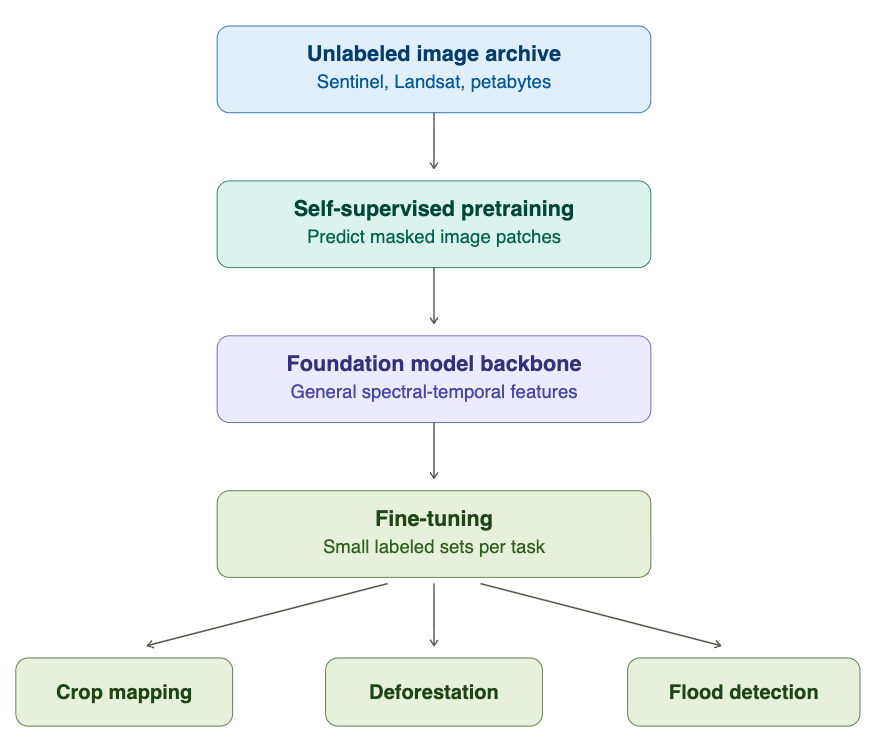
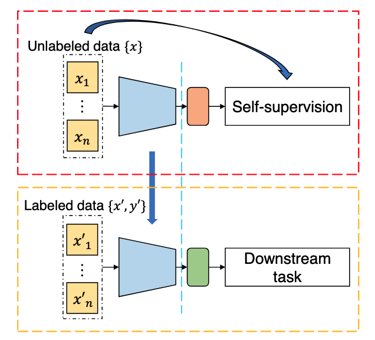
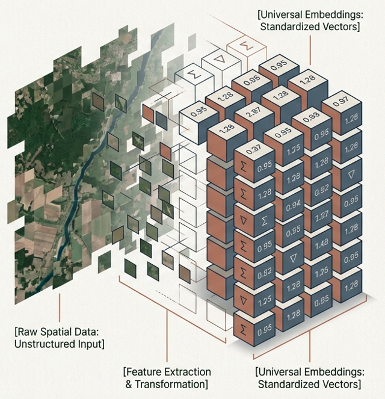

---
title: "Foundational Models and Embeddings"
format: html
--- 

## Introduction

The term "foundation model" entered the AI lexicon around 2021, coined by researchers at Stanford to describe large neural networks trained on vast, diverse datasets that can be adapted — through fine-tuning or prompting — to a wide range of downstream tasks. GPT-4, Gemini, and Claude are foundation models for language. Their defining characteristic is not size alone, but the breadth of their pretraining: they learn general representations of their domain that transfer efficiently to specialized problems. Earth observation foundation models (EOFMs) apply this logic to satellite and aerial imagery. Rather than training a separate model from scratch for each task, such as flood detection or crop classification, an EO foundation model attempts to produce general-purpose representations. Their assumption is that such shared backbones can then be adapted to downstream applications with relatively little labeled data.

EOFMs share is a common goal: compress high-dimensional satellite data — spectral bands × time steps × spatial extent — into compact vectors that capture the semantically relevant structure. The approaches differ in what they compress, how the network is trained to produce useful compressions, and what counts as a useful representation.

Relevant developments in the area include: (a) AlphaEarth Foundations [@Brown2025], developed by Google DeepMind, which generates geospatial representations from multiple data sources; (b) TESSERA (Temporal Embeddings of Surface Spectra for Earth Representation and Analysis), a pixel-by-pixel foundational model for Sentinel-1/2 multimodal time series [@Feng2025]; (c) Prithvi, developed by IBM in partnership with NASA, trained with Harmonized Landsat Sentinel-2 (HLS) data using masked autoencoders [@Szwarcman2026]; and (d) PRESTO (Pretrained Remote Sensing Transformer, trained on Sentinel-1, Sentinel-2, and Landsat imagery time series using time series [@Tseng2024].

## How are foundational models built?

Foundation models for Earth observation (EO) are built in two stages: large-scale self-supervised pretraining on unlabeled satellite archives, followed by lightweight fine-tuning for specific applications. The key insight is that satellite archives (Sentinel, Landsat, commercial constellations) contain petabytes of imagery but almost no labels. Instead of annotating, builders curate a globally sampled, cloud-filtered pretraining corpus and train a transformer backbone to handle multispectral bands, SAR, irregular revisit times, and varying resolutions.

```{r}
#| echo: false
#| label: fig-emb-pipeline
#| out-width: 100%
#| fig-align: "center"
#| fig-cap: | 
#|   Pipeline for building foundational models for Earth observation.


```


**Self-supervised learning** builds its own training signal from the data itself, through a *pretext task*: the model predicts hidden patches, matches the same field across seasons, or aligns optical with SAR views of one location. No annotation is needed, so training can scale to the entire archive, and the encoder it produces transfers across tasks. 

Although self-supervised learning methods do not use labels, they face the practical problem of being trained on samples that capture the different types of land cover and events. For this reason, many self-supervised models take a coarse resolution classified map as reference for their sampling location. For example, Alpha Earth [@Brown2025] uses stratified random sample by ecoregion ID from the 2017 RESOLVE Ecoregions dataset [@Dinerstein2017], sampling biogeographic regions equally regardless of extent.

```{r}
#| echo: false
#| label: fig-emb-ssl
#| out-width: 70%
#| fig-align: "center"
#| fig-cap: | 
#|   The general pipeline of self-supervised learning. The visual representation is learned through self-supervision that comes from the unlabeled data. The learned parameters serve as a pre-trained model and are transferred to supervised downstream tasks for fine-tuning (source: Wang et al., 2022).


```

In many cases, especially when working with transfer learning or multi-year classification, it is useful to build task-specific foundational models using  **supervised learning**, which requires pixels or polygons annotated by experts. The model learns a direct mapping from imagery to those labels, and the result is a single-task model, for example, a land use and land cover classifier. 

Consider the challenge of mapping a large region for long period (e.g., 20 years). One common approach is to train models using a subset of the data (e.g., 5 years) and then extend these samples to other years. The challenge of this transfer learning approach is its sensitivity to yearly changes of the ground response due to climate variability. Using supervised foundational models reduce this sensitivity. 

## What are embeddings?

A satellite image time series is inherently high-dimensional. A single Sentinel-2 pixel in the Brazil Data Cube may carry 10 spectral bands × 24 annual observations, so a classifier must find patterns in a 240-dimensional space — computationally costly, and unreliable without many training samples. Adding another sensor such as Sentinel-1 enlarges the attribute space further.

An embedding is a compact alternative representation of that pixel, typically 32 to 64 values, produced by passing the raw time series through an Earth observation foundation model. The network — pretrained on large volumes of unlabeled imagery — learns which patterns are worth keeping: the shape of the phenological curve, the mean spectral response, temporal variability, seasonal events. The result is a fixed-length numerical descriptor that summarizes months or years of multi-source data for one location, discarding noise.

Geometrically, the embedding maps each pixel to a point in a latent space where spectrotemporally similar pixels lie close together. Amazonian primary forest and regenerating secondary forest occupy nearby but distinguishable regions; pasture and soybean fall far apart.

This matters because labeled samples are scarce and expensive in remote sensing. Self-supervised learning sidesteps that constraint by learning representations from unlabeled archives, and the resulting model generates the embeddings.

Embeddings therefore offer two practical advantages:

- Compression and efficiency — complex multi-source data collapses into short vectors, sharply reducing storage and processing cost.
- Structured similarity — the latent space clusters similar areas, making it straightforward to compare locations, detect spatial patterns, and transfer knowledge between regions.

After pretraining on time series, embeddings are expected to encode:

* Phenological state — crop growth cycles and seasonal vegetation dynamics.
* Land cover type — forest, cropland, wetland, built-up, bare soil, water, discriminated by time series shape.
* Change regime — gradual trends (urbanization, progressive deforestation), seasonal cycles, and abrupt events (fires, floods).
* Anomaly signatures — deviations from the expected seasonal trajectory indicating stress, disturbance, or human activity.

```{r}
#| echo: false
#| label: fig-emb-vector
#| out-width: 70%
#| fig-align: "center"
#| fig-cap: | 
#|   Graphical representation of embeddings. A neural networks captures the spectral, spatial and temporal features of the images and produces multi-dimensional vectors for each pixel.


```


## Global and local embeddings

There are many proposals of EOFMs, including patch-based models such as IBM and NASA's Prithvi [@Szwarcman2026], time-series based methods such as PRESTO [@Tseng2024] and TESSERA [@Feng2025] and mixed-models such as Google's AlphaEarth [@Brown2025]. These models are pre-trained on global datasets, attempting to learn universal statistical patterns that apply uniformly from the Arctic tundra to the Sahara Desert. The goal is to create a single latent representation of the Earth's landmass.

Pre-training data shapes what a model can and cannot know: a model trained predominantly on temperate agricultural landscapes may generalize poorly to tropical forests or Arctic tundra. As an alternative to global EOFMs, we consider that it is important to offer to the geospatial community the possibility of building regional EOFMs. The advantages of regional models include:
 
* Geographical ontologies are local: Global models inherently seek universal patterns, which often leads to the homogenization of complex landscapes. A global model might force a highly specific, transitional biome in South America into a generic "shrubland" category to minimize its global error rate. Regional models, trained exclusively on local data cubes, respect local geographical ecological patterns.

* Agro-ecological specificity: Agricultural practices vary wildly across the globe. A model trained  on the synchronized, single-harvest monocultures of the American Midwest will struggle to embed multi-cropping systems found in tropical regions like Brazil or Southeast Asia.

* Mitigating structural data bias: Historically, global datasets are heavily skewed toward the Global North, where ground-truth validation is abundant. A regional model prevents the AI from importing spatial biases learned from entirely different continents, resulting in much higher-fidelity embeddings for local downstream tasks.

## Building embeddings in sits

The aim of the embedding functions in `sits` is not to develop yet another global foundation model. Our focus is narrower and, we believe, more achievable: serving users to produce *regional embeddings*. These are representations tailored to specific tasks (primarily LUCC) over large, well-defined regions of interest. Global foundation models necessarily make upfront design choices about input data and temporal representation; these choices will not be optimal for a particular regional application. Our approach instead gives users control. Input data (optical, SAR, climate), learning method, and temporal coverage can all be configured to the problem at hand.

The target user we have in mind faces a large-scale, multi-year classification problem under concrete constraints of computational time and data availability. In most such cases, users already have a baseline classification from a prior year or adjacent region, which motivates our choice of two supervised methods alongside the unsupervised ones. This is a deliberate design decision: supervised methods can exploit existing reference data that operational monitoring programmes typically hold.

## Summary

In this chapter, we introduce the topic of geospatial embeddings and describe what
are the aims of the `sits` methods that build and manage embeddings. 
In the following chapters, we first describe the methods available in `sits`.
Next, we provide a simple example of how to produce embeddings. Then we 
describe in detail how to generate regional embeddings. 


## References

