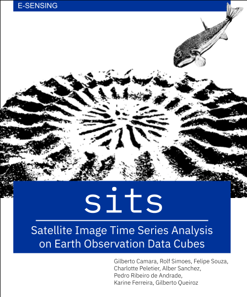

--- 
title: '**sits**: Satellite Image Time Series Analysis 
    on Earth Observation Data Cubes'
author:
- Gilberto Camara
- Rolf Simoes
- Felipe Souza
- Charlotte Peletier
- Alber Sanchez
- Pedro R. Andrade
- Karine Ferreira
- Gilberto Queiroz
date: "`r Sys.Date()`"
output:
  html_document: 
    df_print: tibble
    theme:
        base_font:
          google: "IBM Plex Serif"
        code_font:
          google: "IBM Plex Mono"
documentclass: report
link-citations: yes
colorlinks: yes
lot: yes
lof: yes
always_allow_html: true
fontsize: 11pt
site: bookdown::bookdown_site
cover-image: images/cover_sits_book.png
bibliography: e-sensing.bib
biblio-style: apalike
csl: ieee.csl
indent: true
description: |
  This book presents  **sits**, an open-source R package for satellite image time series analysis. The package supports the application of machine learning techniques for classifying image time series obtained from Earth observation data cubes.
---
```{r, setup, include=FALSE}
knitr::opts_chunk$set(
    class.output = 'sourceCode'
)
```

```{r, echo = FALSE}
source("common.R")
```

```{r, echo = FALSE}
library(sits)
library(sitsdata)
library(tibble)
```


# Preface {-}

<a href="https://github.com/e-sensing/sitsbook"></a>

Satellite images are the most comprehensive source of data about our environment; they provide essential information on global challenges. In recent years, space agencies have adopted open distribution policies. Petabytes of Earth observation data are now available. Experts now have access to repeated acquisitions over the same areas; the resulting time series improve our understanding of ecological patterns and processes. Instead of selecting individual images from specific dates and comparing them, researchers now can track change continuously. 

Information on land change is critical for sustainable development because our growing demand for natural resources is causing significant environmental impacts. Satellite time series enable significant advances in classifying land use and land cover change, compared to what is achievable with image from a single date or temporal composites. Time series capture subtle changes in ecosystem health and condition and improve the distinction between different land classes. Using time series, analysts can obtain the best benefits from big Earth observation data collections. 

This book presents  `sits`, an open-source **R** package for land use and land cover classification of big Earth observation data using satellite image time series. Users can build regular data cubes from cloud data services such as Amazon Web Services, Microsoft Planetary Computer, Brazil Data Cube, and Digital Earth Africa. The software includes functions for quality assessment of training samples using self-organized maps. It provides machine learning and deep learning algorithms for classification of big Earth observation data cubes. Post-processing methods includes Bayesian smoothing and uncertainty assessment. Users can apply best practices for estimating area and assessing accuracy of land change. Thus, `sits` is an end-to-end toolkit for land mapping with Earth observation.

## Who this book is for {-}

The target audience for `sits` is the community of remote sensing experts with Earth Sciences background who want to have access to state-of-the-art data analysis methods, with minimal investment in programming skills. The package provides a clear and direct set of functions, which are easy to learn and master. Users with a minimal background on **R** programming can start using `sits` right away. Those not yet familiar with **R** need only to learn introductory concepts.  

If you are not an **R** user and would like to quickly master what is needed to run `sits`, please read Part 1 and Part 2 of the book by Garrett Golemund, "Hands-On Programming with R" <https://rstudio-education.github.io/hopr/>. If you already are an **R** user and would like to update your skills with the latest trends,  please read the book by Hadley Wickham and Gareth Golemund, "R for Data Science". <https://r4ds.had.co.nz/>.


## Main reference for sits {-}

If you use sits in your work, please cite the following paper: 

Rolf Simoes, Gilberto Camara, Gilberto Queiroz, Felipe Souza, Pedro R. Andrade,  Lorena Santos, Alexandre Carvalho, and Karine Ferreira. “Satellite Image Time Series Analysis for Big Earth Observation Data”. Remote Sensing, 13, p. 2428, 2021. <https://doi.org/10.3390/rs13132428>. 

## Licenses {-}

This book is licensed as Attribution-NonCommercial-ShareAlike 4.0 International (CC BY-NC-SA 4.0) by Creative Commons <https://creativecommons.org/licenses/by-nc-sa/4.0/>. The `sits` package is licensed under the GNU General Public License, version 3.0. 
