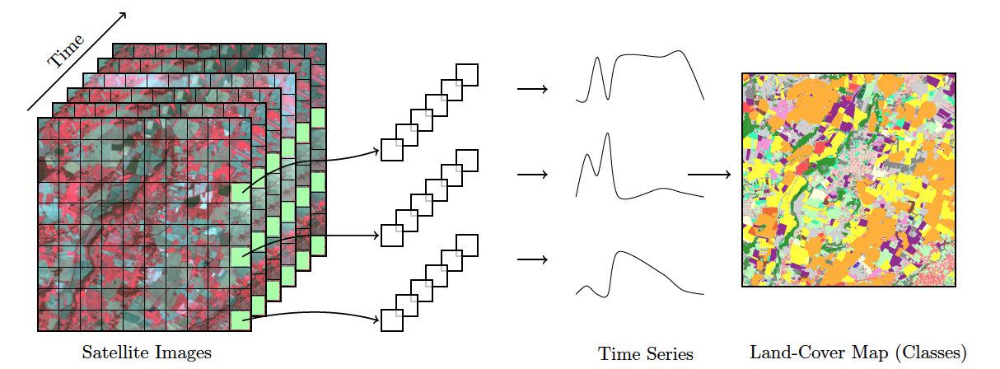
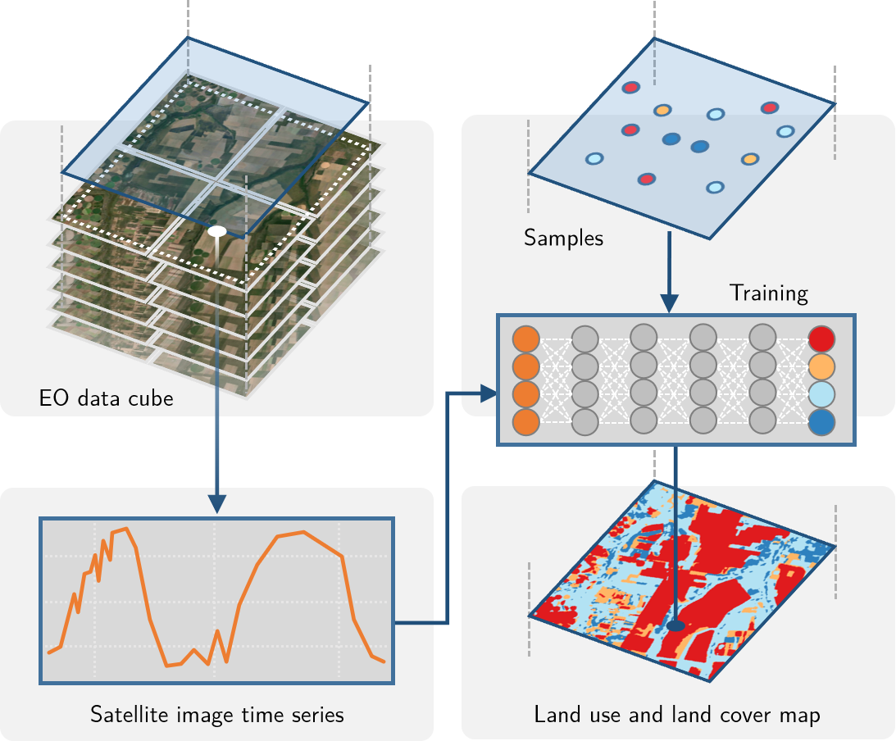
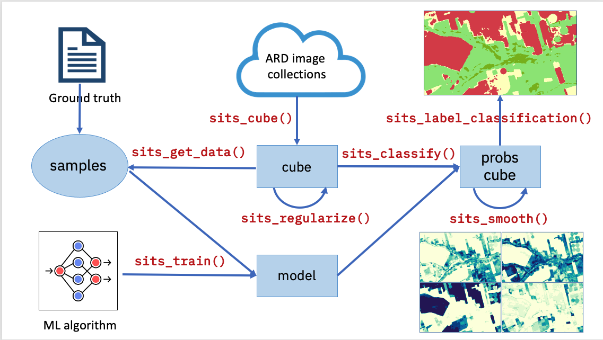

## Who is this book for?

This book, tailored for land use change experts and researchers, is a practical guide that enables them to analyze big Earth observation data sets. It provides readers with the means to produce high-quality maps of land use and land cover, guiding them through all the steps to achieve good results. Given the natural world's complexity and the huge variations in human-nature interactions, only local experts who know their countries and ecosystems can extract full information from big EO data.

One group of readers that we are keen to engage with is the national authorities on forestry, agriculture, and statistics in developing countries. We aim to foster a collaborative environment where they can use EO data to enhance their national land use and cover estimates, supporting sustainable development policies. To achieve this goal, `sits` has strong backing from the FAO Expert Group on the Use of Earth Observation data ([FAO-EOSTAT](https://www.fao.org/in-action/eostat)). FAO-EOSTAT is at the forefront of using advanced EO data analysis methods for agricultural statistics in developing countries [@DeSimone2022; @DeSimone2022a].

## Why work with satellite image time series?

Satellite imagery provides the most extensive data on our environment. By encompassing vast areas of the Earth's surface, satellite images enable researchers to analyze local and worldwide transformations. By observing the same location multiple times, satellites provide data on environmental changes and survey areas that are difficult to observe from the ground. Given its unique features, images offer essential information for many applications, including monitoring deforestation, crop production, food security, urban footprints, water scarcity, and land degradation. Using time series, experts improve their understanding of ecological patterns and processes. Instead of selecting individual images from specific dates and comparing them, researchers track change continuously [@Woodcock2020].

## Time-first, space-later

"Time-first, space-later" is an approach to satellite image classification that treats time series analysis as the first step in analyzing remote sensing data, bringing in spatial information only after all time series have been classified. Every pixel in a data cube is handled as a time series. In the *time-first* phase, classification is pixel-based: a model assigns a label to each pixel from its temporal profile, producing a set of labeled pixels. This focus on time sharpens our understanding of landscape change, making it feasible to detect and track seasonal and long-term trends and to flag anomalous events such as wildfires, floods, or droughts. In the *space-later* phase, a smoothing algorithm refines these results by considering the spatial neighborhood of each pixel. The resulting map therefore combines both temporal and spatial information.

The premise of time-first is that the temporal profile carries most of the information needed to distinguish land classes, such as crop types, pasture versus natural vegetation, or forest versus degraded forest; space is used afterwards to capture neighborhood relations. Algorithms are trained on labeled time-series samples, with each time series treated independently. This fits a long-standing tradition in remote sensing, where experts label individual pixels or polygons in images to provide training data for machine learning, and extending that practice to image time series is straightforward.

The alternative "space-first, time-later" approach inherits practices from computer vision, where the aim of image classification is to describe objects in photographs under a "foreground versus background" paradigm. Its methods use a small window of pixels — a "patch," such as 16×16, 32×32, or 64×64 — as the classification unit. The patch supplies spatial context (texture, shape, and neighborhood arrangement) that pure pixel-based methods lack, and it is the input format for convolutional neural networks (CNNs) [@Song2019a], semantic segmentation [@Garnot2022], and vision transformers [@Tarasiou2023]. Providing labeled patches, however, is far less common than labeling individual pixels or polygons, so the training data these methods require are harder to obtain [@Ajibola2024].

The two approaches differ most in what they are suited for, the training data they require, and their computational cost. Time-first is best for mapping phenological change in continuous fields such as agriculture and forests, where space acts as a smoothing step decoupled from classification. Space-first is better for detecting spatial patterns in urban morphology, fine field boundaries, and object-level detail, where spatial context is part of the learned features. Because time-first works with point and pixel samples — exactly what field campaigns and reference databases naturally produce — and classifies each pixel independently, it scales to continental data sets and can sometimes run without GPUs (Random Forest works well). Space-first needs spatially contiguous labeled patches, which are costlier to obtain, and it is computationally demanding, typically requiring GPUs; this can limit its use in large-scale studies.

```{r}
#| label: fig-ts-intro
#| echo: false
#| out-width: 100%
#| out-height: 100%
#| fig-cap: |
#|   Satellite image time series classification (source: [@Tan2017]).
#| fig-align: center

 
```

## Land use and land cover

The UN Food and Agriculture Organization defines land cover as "the observed biophysical cover on the Earth's surface" [@DiGregorio2016]. Land cover can be observed and mapped directly through remote sensing images. In FAO's guidelines and reports, land use is described as "the human activities or purposes for which land is managed or exploited." Although *land cover* and *land use* denote different approaches for describing the Earth's landscape, in practice there is considerable overlap between these concepts [@Comber2008b]. When classifying remote sensing images, natural areas are classified using land cover types (e.g., forest), while human-modified areas are described with land use classes (e.g., pasture).

One of the advantages of using image time series for land classification is its capacity to measure changes in the landscape related to agricultural practices. For example, the time series of a vegetation index in an area of crop production will show a pattern of minima (planting and sowing stages) and maxima (flowering stage). Thus, classification schemas based on image time series data can be richer and more detailed than those associated only with land cover. In what follows, we use the term "land classification" to refer to image classification representing both land cover and land use classes.

## How `sits` works

The `sits` package uses satellite image time series for land classification, using a *time-first, space-later* approach. In the data preparation part, collections of big Earth observation images are organized as data cubes. Each spatial location of a data cube is associated with a time series. Locations with known labels are used to train a machine learning algorithm, which classifies all time series of a data cube, as shown in @fig-gview-intro.

```{r}
#| label: fig-gview-intro
#| echo: false
#| out.width: 70% 
#| out.height: 70%
#| fig.align: center
#| fig.cap: General view of sits.

```

The `sits` API is a set of functions that can be chained to create a workflow for land classification. At its heart, the `sits` package has eight functions, as shown in @fig-api-intro:

1. Extract data from an analysis-ready data (ARD) collection using `sits_cube()`, producing a non-regular data cube object.
2. From a non-regular data cube, create a regular one using `sits_regularize()`. Regular data cubes are required to train machine learning algorithms.
3. Obtain new bands and indices with operations on regular data cubes with `sits_apply()`.
4. Given a set of ground truth values in formats such as CSV or SHP and a regular data cube, use `sits_get_data()` to obtain training samples containing time series for selected locations in the training area.
5. Select a machine learning algorithm and use `sits_train()` to produce a classification model.
6. Given a classification model and a regular data cube, use `sits_classify()` to get a probability data cube, which contains the probabilities for class allocation for each pixel.
7. Remove outliers in a probability data cube using `sits_smooth()`.
8. Use `sits_label_classification()` to produce a thematic map from a smoothed probability cube.


```{r}
#| label: fig-api-intro
#| echo: false
#| out-width: 100%
#| out-height: 100%
#| fig-cap: |
#|   Main functions of the sits API (source: authors).
#| fig-align: center

 
```

Each workflow step corresponds to a function of the `sits` API, as shown in the table below. These functions have convenient default parameters and behaviors. A single function builds machine learning (ML) models. The classification function processes big data cubes with efficient parallel processing. Since the `sits` API is simple to learn, achieving good results does not require in-depth knowledge about machine learning and parallel processing.

```{r}
#| echo: false
library(kableExtra)

sits_api <- data.frame(
    API_function = c("sits_cube()", 
                     "sits_regularize()",
                     "sits_apply()",
                     "sits_get_data()",
                     "sits_train()", 
                     "sits_classify()", 
                     "sits_smooth()",
                     "sits_label_classification()"),
    Inputs = c("ARD image collection", 
               "Non-regular data cube", 
               "Regular data cube", 
               "Regular data cube and sample locations",
               "Time series and ML method", 
               "ML classification model and regular data cube",
               "Probability cube", 
               "Smoothed probability cube"),
    Output = c("Non-regular data cube", 
               "Regular data cube",
               "Regular data cube with new bands and indices",
               "Time series samples",
               "ML classification model", 
               "Probability cube", 
               "Smoothed probability cube",
               "Classified map"))

kableExtra::kbl(sits_api,
                caption = "The sits API workflow for land classification.",
                booktabs = TRUE) |>
    kableExtra::kable_styling(position = "center",
                              font_size = 14,
                              latex_options = c("scale_down", "HOLD_position")) |>
    kableExtra::column_spec(column = 1, monospace = TRUE, color =  "RawSienna")
```


## Additional functions in `sits`

In addition to the eight basic functions of its API, `sits` supports additional tools for improving training data quality and evaluating classification results. They include: 

1.  Performing quality control and filtering on the time series samples. 
2.  Merging multi-source data to capture responses from different sensors.
3.  Measuring classification uncertainty to support active learning.
4.  Supporting vector data cubes and object-based time series image analysis.
5.  Evaluating the accuracy of the classification using best practices.

These functions are also described in this book. 

## References
