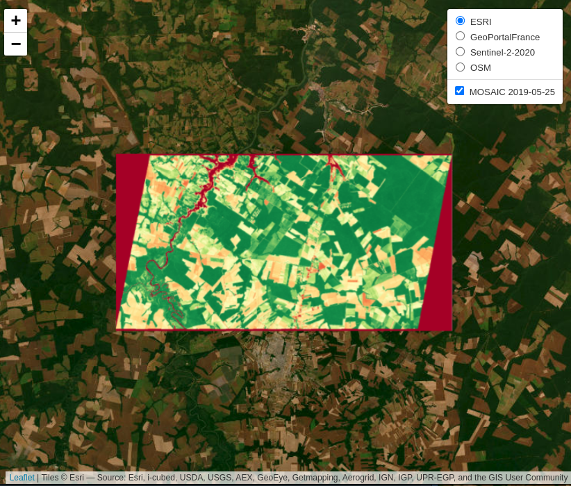
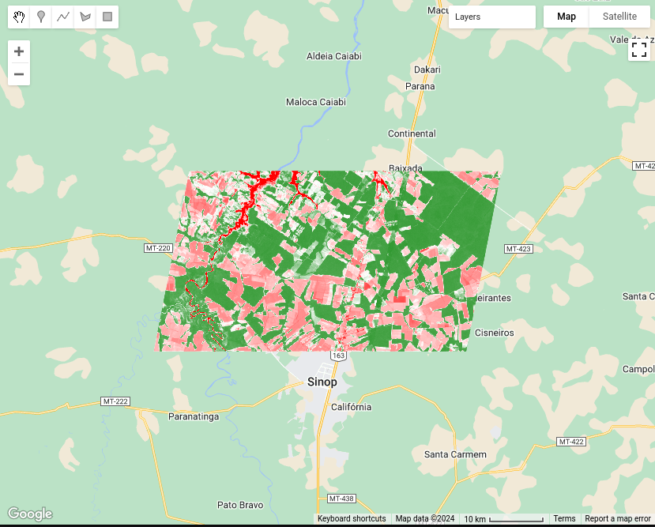
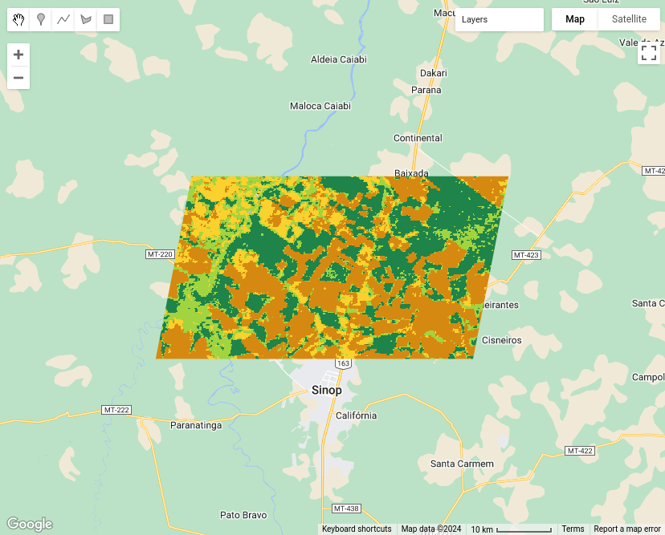

--- 
title: '**sits**: Satellite Image Time Series Analysis 
    on Earth Observation Data Cubes'
author:
- Gilberto Camara
- Rolf Simoes
- Felipe Souza
- Felipe Menino
- Charlotte Pelletier
- Pedro R. Andrade
- Karine Ferreira
- Gilberto Queiroz
date: "`r Sys.Date()`"
output:
  html_document: 
    df_print: tibble
    theme:
        base_font:
          google: "IBM Plex Serif"
        code_font:
          google: "IBM Plex Mono"
  pdf_document: 
    latex_engine: xelatex
    toc: true
    toc_depth: 2 
    df_print: tibble
documentclass: report
link-citations: yes
colorlinks: yes
lot: yes
lof: yes
always_allow_html: true
fontsize: 10,5pt
site: bookdown::bookdown_site
cover-image: images/cover_sits_book.png
bibliography: e-sensing.bib
biblio-style: apalike
csl: ieee.csl
indent: true
description: |
  This book presents  **sits**, an open-source R package for satellite image time series analysis. The package supports the application of machine learning techniques for classifying image time series obtained from Earth observation data cubes.
---

# Preface {-}

Placeholder


## How much R knowledge is required?{-}
## Software version described in this book{-}
## Main reference for `sits` {-}
## Intellectual property rights {-}

<!--chapter:end:index.Rmd-->


# Setup {.unnumbered}

Placeholder


## How to use this on-line book {.unnumbered}
## How to install sits using R and RStudio {.unnumbered}
### Installing `sits` from CRAN {.unnumbered}
### Installing in Microsoft Windows and MacOS environments{.unnumbered}
### Installing in Ubuntu environments{.unnumbered}
### Installing in Debian environments{.unnumbered}
### Installing in Fedora environments {.unnumbered}
## Using Docker images {.unnumbered}
## Install `sits` from CONDA {.unnumbered}
## Accessing the development version {.unnumbered}
## Additional requirements {.unnumbered}
## Using GPUs with `sits` {.unnumbered}

<!--chapter:end:01-setup.Rmd-->


# Acknowledgements {-}

Placeholder


## Funding Sources {-}
## Community Contributions {-}
## Reproducible papers and books used in building `sits` {-}
## Publications using `sits` {-}
## AI support in preparing the book {-}

<!--chapter:end:02-acknowledgements.Rmd-->


# Introduction{-}

Placeholder


## Who is this book for?{-}
## Why work with satellite image time series?{-}
## Time-first, space-later{-}
## Land use and land cover{-}
## How `sits` works {.unnumbered}
## Creating a data cube {.unnumbered}
## The time series tibble {-}
## Training a machine learning model {.unnumbered}
## Data cube classification {.unnumbered}
## Spatial smoothing {.unnumbered}
## Labeling a probability data cube {.unnumbered}

<!--chapter:end:03-intro.Rmd-->


# Earth observation data cubes{-}

Placeholder


## Analysis-ready data(ARD){-}
## Image collections handled by sits{-}
## Regular image data cubes{-}
## Creating data cubes{-}
## Amazon Web Services{-}
## Microsoft Planetary Computer{-}
### SENTINEL-2/2A images in MPC{-}
### LANDSAT-C2-L2 images in MPC{-}
### SENTINEL-1-GRD images in MPC{-}
### SENTINEL-1-RTC images in MPC{-}
### Copernicus DEM 30 meter images in MPC{-}
## Brazil Data Cube{-}
## Copernicus Data Space Ecosystem (CDSE){-}
### SENTINEL-2/2A images in CDSE{-}
### SENTINEL-1-RTC images in CDSE{-}
## Digital Earth Africa{-}
## Digital Earth Australia{-}
## Harmonized Landsat-Sentinel {-}
## EO products from TERRASCOPE{-}
## Planet data as ARD local files{-}
## Reading classified images as local data cube{-}
## Regularizing data cubes{-}
### Regularizing Sentinel-2 images{-}
### Regularizing Sentinel-1 images{-}
### Merging Sentinel-1 and Sentinel-2 images{-}
## Combining multitemporal data cubes with digital elevation models{-}
## Merging multitemporal data cubes with DEM{-}

<!--chapter:end:04-datacubes.Rmd-->


# Operations on data cubes{-}

Placeholder


## Pixel-based and neighborhood-based operations{-}
## Computing vegetation indexes{-}
## Spectral indexes for identifying burned areas{-}
## Support for non-normalized indexes{-}
## Temporal combination operations{-}
## Spectral mixture analysis{-}

<!--chapter:end:05-cubeoperations.Rmd-->


# Working with time series{-}

Placeholder


## Data structures for satellite time series{-}
## Utilities for handling time series{-}
## Time series visualisation{-}
## Visualizing sample patterns{-}
## Geographical variability of training samples{-}
## Obtaining time series data from data cubes{-}
## Filtering time series{-}
### Savitzky–Golay filter{-}
### Whittaker filter{-}

<!--chapter:end:06-timeseries.Rmd-->


# Improving the quality of training samples{-}

Placeholder


## Datasets used in this chapter{-}
## Cross-validation of training sets{-}
## Hierarchical clustering for sample quality control{-}
## Using SOM for sample quality control{-}
## Creating the SOM map{-}
## Measuring confusion between labels using SOM{-}
## Detecting noisy samples using SOM{-}
## Reducing sample imbalance{-} 
## Conclusion{-}

<!--chapter:end:07-clustering.Rmd-->


# Machine learning for data cubes{-}

Placeholder


## Machine learning classification{-}
## Common interface to machine learning and deep learning models{-}
## Random forest{-}
## Support vector machine{-}
## Extreme gradient boosting{-}
## Deep learning using multilayer perceptron{-}
## Temporal Convolutional Neural Network (TempCNN){-}
## Attention-based models{-}
## Deep learning model tuning{-}
## Considerations on model choice{-}

<!--chapter:end:08-machinelearning.Rmd-->


# Classification of raster data cubes{-}

Placeholder


## Data cube for case study {-}
## Training data for the case study{-}
## Training machine learning models{-}
## Classification of machine learning models in CPUs{-}
## Training and running deep learning models{-}
### Deep learning model tuning{-}
### Classification in GPUs using parallel processing{-}
## Map reclassification{-}

<!--chapter:end:09-rasterclassification.Rmd-->


# Bayesian smoothing for post-processing{-}

Placeholder


## Introduction{-}
## The need for post-processing{-}
## Empirical Bayesian estimation{-}
## Using non-isotropic neighborhoods{-}
## Effect of the hyperparameter{-}
## Running Bayesian smoothing {-}
## Assessing the local logit variance{-}
## Using the variance to select values of hyperparameters{-}

<!--chapter:end:10-bayesiansmoothing.Rmd-->


# Validation and accuracy measurements{-}

Placeholder


## Introduction{-}
## Example data set{-} 
## Stratified sampling design and allocation{-} 
## Accuracy assessment of classified images{-}

<!--chapter:end:11-validation.Rmd-->


# Uncertainty and active learning{-}

Placeholder


## Measuring uncertainty{-} 
## Using uncertainty measures for active learning{-}

<!--chapter:end:12-uncertainty.Rmd-->


# Ensemble prediction from multiple models{-}

Placeholder


<!--chapter:end:13-ensembleprediction.Rmd-->


# Object-based time series image analysis {.unnumbered}

Placeholder


## Image segmentation in sits {-}
## Simple linear iterative clustering algorithm{-}
## Example of SLIC-based segmentation and classification{-}

<!--chapter:end:14-obia.Rmd-->


# Data visualisation in `sits` {-}

Placeholder


## Plotting{-}
### Plotting false color maps{-}
### Plotting RGB color composite maps{-}
### Plotting classified maps{-}
## Visualization of data cubes in interactive maps {.unnumbered}
## How colors work in sits{-}
## Exporting colors to QGIS{-}

<!--chapter:end:15-visualisation.Rmd-->

# Technical annex {-}

```{r, eval = TRUE, echo = FALSE, include = FALSE}
source("common.R")
library(sits)
library(sitsdata)
if (!file.exists("./tempdir/chp16"))
  dir.create("./tempdir/chp16")
```

This Chapter contains technical details on the algorithms available in `sits`. It is intended to support those that want to understand how the package works and also want to contribute to its development.

<!-- ## Adding functions to the `sits` API{-} -->

<!-- ### General principles{-} -->

<!-- New functions that build on the `sits` API should follow the general principles below. -->

<!-- - The target audience for `sits` is the community of remote sensing experts with Earth Sciences background who want to use state-of-the-art data analysis methods with minimal investment in programming skills. The design of the `sits` API considers the typical workflow for land classification using satellite image time series and thus provides a clear and direct set of functions, which are easy to learn and master.  -->

<!-- - For this reason, we welcome contributors that provide useful additions to the existing API, such as new ML/DL classification algorithms. In case of a new API function, before making a pull request please raise an issue stating your rationale for a new function. -->

<!-- - Most functions in `sits` use the S3 programming model with a strong emphasis on generic methods wich are specialized depending on the input data type. See for example the implementation of the `sits_bands()` function.  -->

<!-- - Please do not include contributed code using the S4 programming model. Doing so would break the structure and the logic of existing code. Convert your code from S4 to S3. -->

<!-- - Use generic functions as much as possible, as they improve modularity and maintenance. If your code has decision points using `if-else` clauses, such as `if A, do X; else do Y` consider using generic functions.  -->

<!-- - Functions that use the `torch` package use the R6 model to be compatible with that package. See for example, the code in `sits_tempcnn.R` and `api_torch.R`. To convert `pyTorch` code to R and include it is straightforward. Please see the [Technical Annex](https://e-sensing.github.io/sitsbook/technical-annex.html) of the sits on-line book. -->

<!-- - The sits code relies on the packages of the `tidyverse` to work with tables and list. We use `dplyr` and `tidyr` for data selection and wrangling, `purrr` and `slider` for loops on lists and table, `lubridate` to handle dates and times.  -->

<!-- ### Adherence to the `sits` data types{-} -->

<!-- The `sits` package in built on top of three data types: time series tibble, data cubes and models. Most `sits` functions have one or more of these types as inputs and one of them as return values. The time series tibble contains data and metadata. The first six columns contain the metadata: spatial and temporal information, the label assigned to the sample, and the data cube from where the data has been extracted. The time_series column contains the time series data for each spatiotemporal location. All time series tibbles are objects of class `sits`.  -->

<!-- The `cube` data type is designed to store metadata about image files. In principle, images which are part of a data cube share the same geographical region, have the same bands, and have been regularized to fit into a pre-defined temporal interval. Data cubes in `sits` are organized by tiles. A tile is an element of a satellite's mission reference system, for example MGRS for Sentinel-2 and WRS2 for Landsat. A `cube` is a tibble where each row contains information about data covering one tile. Each row of the cube tibble contains a column named `file_info`; this column contains a list that stores a tibble  -->

<!-- The `cube` data type is specialised in `raster_cube` (ARD images), `vector_cube` (ARD cube with segmentation vectors). `probs_cube` (probabilities produced by classification algorithms on raster data), `probs_vector_cube`(probabilites generated by vector classification of segments),  `uncertainty_cube` (cubes with uncertainty information), and `class_cube` (labelled maps). See the code in `sits_plot.R` as an example of specialisation of `plot` to handle different classes of raster data.  -->

<!-- All ML/DL models in `sits` which are the result of `sits_train` belong to the `ml_model` class. In addition, models are assigned a second class, which is unique to ML models (e.g, `rfor_model`, `svm_model`) and generic for all DL `torch` based models (`torch_model`). The class information is used for plotting models and for establishing if a model can run on GPUs.  -->

<!-- ### Literal values, error messages, and testing{-} -->

<!-- The internal `sits` code has no literal values, which are all stored in the YAML configuration files `./inst/extdata/config.yml` and `./inst/extdata/config_internals.yml`. The first file contains configuration parameters that are relevant to users, related to visualisation and plotting; the second contains parameters that are relevant only for developers. These values are accessible using the `.conf` function. For example, the value of the default size for ploting COG files is accessed using the command `.conf["plot", "max_size"]`.  -->

<!-- Error messages are also stored outside of the code in the YAML configuration file `./inst/extdata/config_messages.yml`. These values are accessible using the `.conf` function. For example, the error associated to an invalid NA value for an input parameter is accessible using th function `.conf("messages", ".check_na_parameter")`.  -->

<!-- We strive for high code coverage (> 90\%). Every parameter of all `sits` function (including internal ones) is checked for consistency. Please see `api_check.R`.  -->


<!-- ### Supporting new STAC-based image catalogues{-} -->

<!-- If you want to include a STAC-based catalogue not yet supported by `sits`, we encourage you to look at existing implementations of catalogues such as Microsoft Planetary Computer (MPC), Digital Earth Africa (DEA) and AWS. STAC-based catalogues in `sits` are associated to YAML description files, which are available in the directory `.inst/exdata/sources`. For example, the YAML file `config_source_mpc.yml` describes the contents of the MPC collections supported by `sits`. Please first provide an YAML file which lists the detailed contents of the new catalogue you wish to include. Follow the examples provided. -->

<!-- After writing the YAML file, you need to consider how to access and query the new catalogue. The entry point for access to all catalogues is the `sits_cube.stac_cube()` function, which in turn calls a sequence of functions which are described in the generic interface `api_source.R`. Most calls of this API are handled by the functions of `api_source_stac.R` which provides an interface to the `rstac` package and handles STAC queries.  -->

<!-- Each STAC catalogue is different. The STAC specification allows providers to implement their data descriptions with specific information. For this reason, the generic API described in `api_source.R` needs to be specialized for each provider. Whenever a provider needs specific implementations of parts of the STAC protocol, we include them in separate files. For example, `api_source_mpc.R` implements specific quirks of the MPC platform. Similarly, specific support for CDSE (Copernicus Data Space Environment) is available in `api_source_cdse.R`.  -->


<!-- ## Exporting data to JSON{-} -->

<!-- Both the data cube and the time series tibble can be exported to exchange formats such as JSON. -->

<!-- ```{r, tidy = "styler", eval = FALSE} -->
<!-- library(jsonlite) -->
<!-- # Export the data cube to JSON -->
<!-- jsonlite::write_json( -->
<!--   x = sinop, -->
<!--   path = "./data_cube.json", -->
<!--   pretty = TRUE) -->

<!-- # Export the time series to JSON -->
<!-- jsonlite::write_json( -->
<!--   x = samples_prodes_4classes, -->
<!--   path = "./time_series.json", -->
<!--   pretty = TRUE) -->
<!-- ``` -->

## SITS and Google Earth Engine APIs: A side-by-side exploration{-}

This section presents a side-by-side exploration of the `sits` and Google Earth 
Engine (`gee`) APIs, focusing on their respective capabilities in handling 
satellite data. The exploration is structured around three key examples: 
(1) creating a mosaic, (2) calculating the Normalized Difference Vegetation 
Index (NDVI), and (3) performing a Land Use and Land Cover (LULC) classification. 
Each example demonstrates how these tasks are executed using `sits` and `gee`, 
offering a clear view of their methodologies and highlighting the similarities 
and the unique approaches each API employs.

### Example 1: Creating a Mosaic{-}

A common application among scientists and developers in the field of Remote 
Sensing is the creation of satellite image mosaics. These mosaics are formed by 
combining two or more images, typically used for visualization in various 
applications. In this example, we will demonstrate how to create an image 
mosaic using `sits` and `gee` APIs.

#### Define Region of Interest data{-}

In this example, a Region of Interest (ROI) is defined using a bounding box
with longitude and latitude coordinates. Below are the code snippets for 
specifying this ROI in both `sits` and `gee` environments.


**sits**

```{r, eval = FALSE}
roi <- c("lon_min" = -63.410, "lat_min" = -9.783,
         "lon_max" = -62.614, "lat_max" = -9.331)
```

**gee**

```js
var roi = ee.Geometry.Rectangle([-63.410,-9.783,-62.614,-9.331]);
```

#### Load Satellite Imagery{-}

Next, we will load the satellite imagery. For this example, we used data from [Sentinel-2](https://sentinels.copernicus.eu/web/sentinel/copernicus/sentinel-2). 
In `sits`, several providers offer Sentinel-2 ARD images. In this example, 
we will use images provided by the Microsoft Planetary Computer (**MPC**).

**sits**

```{r, eval = FALSE}
data <- sits_cube(
  source     = "MPC",
  collection = "SENTINEL-2-L2A",
  bands      = c("B02", "B03", "B04"),
  tiles      = c("20LNQ", "20LMQ"),
  start_date = "2024-08-01",
  end_date   = "2024-08-03"
)
```

**gee**

```js
var data = ee.ImageCollection('COPERNICUS/S2_SR_HARMONIZED')
  .filterDate('2024-08-01', '2024-08-03')
  .filter(ee.Filter.inList('MGRS_TILE', ['20LNQ', '20LMQ']))
  .select(['B4', 'B3', 'B2']);
```

> `sits` provides search filters for a collection as parameters in the 
`sits_cube` function, whereas `gee` offers these filters as methods of an 
`ImageCollection` object.

#### Mosaic Creation{-}

In `sits`, we will use the `sits_mosaic` function to create mosaics of our 
images. In `gee`, we will utilize the `mosaic` method. 
`sits_mosaic()` function crops the mosaic based on the `roi` parameter. 
In `gee`, cropping is performed using the `clip()` method. 
We will use the same `roi` that was used to filter the images to perform 
the cropping on the mosaic. See the following code:

**sits**

```{r, eval = FALSE}
mosaic <- sits_mosaic(
  cube       = data,
  roi        = roi,
  multicores = 4,
  output_dir = tempdir()
)
```

**gee**

```js
var mosaic = data.mosaic().clip(roi);
```

#### View Result{-}

Finally, the results can be visualized in an interactive map.

**sits**

```{r, eval = FALSE}
sits_view(
  x     = mosaic,
  red   = "B04",
  green = "B03",
  blue  = "B02"
)
```

```{r, echo = FALSE, out.width = "100%", out.height = "50%"}
knitr::include_graphics("./images/sitsgee/mosaic-sits.png")
```

**gee**

```js
// Define view region
Map.centerObject(roi, 10);

// Add mosaic Image
Map.addLayer(mosaic, {
    min: 0, 
    max: 3000
}, 'Mosaic');
```

```{r, echo = FALSE, out.width = "100%", out.height = "50%"}
knitr::include_graphics("./images/sitsgee/mosaic-gee.png")
```

### Example 2: Calculating NDVI{-}

This example demonstrates how to generate time-series of Normalized Difference 
Vegetation Index (NDVI) using both the `sits` and `gee` APIs.

#### Define Region of Interest data{-}

In this example, a Region of Interest (ROI) is defined using the `sinop_roi.shp` 
file. Below are the code snippets for specifying this file in both `sits` and 
`gee` environments.

> To reproduce the example, you can download the shapefile using [this link](data/sits-gee/sinop_roi.zip). 
In `sits`, you can just use it. In `gee`, it would be required to upload the 
file in your user space.

**sits**

```{r, eval = FALSE}
roi_data <- "sinop_roi.shp"
```

**gee**

```js
var roi_data = ee.FeatureCollection("/path/to/sinop_roi");
```

#### Load Satellite Imagery{-}

Next, we load the satellite imagery. For this example, we use data from [Landsat-8](https://www.usgs.gov/landsat-missions/landsat-8). 
In `sits`, this data is retrieved from the Brazil Data Cube, although 
other sources are available. For `gee`, the data provided by the platform is used.

In `sits`, when the data is loaded, all necessary transformations to make the 
data ready for use (e.g., `factor`, `offset`, `cloud masking`) are applied 
automatically. In `gee`, users are responsible for performing these 
transformations themselves.

**sits**

```{r, eval = FALSE}
data <- sits_cube(
    source      = "BDC",
    collection  = "LANDSAT-OLI-16D",
    bands       = c("RED", "NIR08", "CLOUD"),
    roi         = roi_data,
    start_date  = "2019-05-01",
    end_date    = "2019-07-01"
)
```

**gee**

```js
var data = ee.ImageCollection("LANDSAT/LC08/C02/T1_L2")
  .filterBounds(roi_data)
  .filterDate("2019-05-01", "2019-07-01")
  .select(["SR_B4", "SR_B5", "QA_PIXEL"]);

// factor and offset
data = data.map(function(image) {
  var opticalBands = image.select('SR_B.').multiply(0.0000275).add(-0.2);
  return image.addBands(opticalBands, null, true);
});

data = data.map(function(image) {
  // Select the pixel_qa band
  var qa = image.select('QA_PIXEL');

  // Create a mask to identify cloud and cloud shadow
  var cloudMask = qa.bitwiseAnd(1 << 5).eq(0) // Clouds
           .and(qa.bitwiseAnd(1 << 3).eq(0)); // Cloud shadows

  // Apply the cloud mask to the image
  return image.updateMask(cloudMask);
});
```

#### Generate NDVI{-}

After loading the satellite imagery, the NDVI can be generated. In `sits`, a 
function allows users to specify the formula used to create a new attribute, 
in this case, NDVI. In `gee`, a callback function is used, where the NDVI is 
calculated for each image.

**sits**

```{r, eval = FALSE}
data_ndvi <- sits_apply(
  data        = data,
  NDVI        = (NIR08 - RED) / (NIR08 + RED),
  output_dir  = tempdir(),
  multicores  = 4,
  progress    = TRUE
)
```

**gee**

```js
var data_ndvi = data.map(function(image) {
  var ndvi = image.normalizedDifference(["SR_B5", "SR_B4"]).rename('NDVI');

  return image.addBands(ndvi);
});

data_ndvi = data_ndvi.select("NDVI");
```

#### Crop Result{-}

The results are clipped to the ROI defined at the beginning of the 
example to facilitate visualization.

> In both APIs, you can define a ROI before performing the 
operation to optimize resource usage. However, in this example, the data is 
cropped after the calculation.

**sits**

```{r, eval = FALSE}
data_ndvi <- sits_mosaic(
  cube       = data_ndvi,
  roi        = roi_data,
  output_dir = tempdir(),
  multicores = 4
)
```

**gee**

```js
data_ndvi = data_ndvi.map(function(image) {
  return image.clip(roi_data);
});
```

#### View Result{-}

Finally, the results can be visualized in an interactive map.

**sits**

```{r, eval = FALSE}
sits_view(data_ndvi, band = "NDVI", date = "2019-05-25", opacity = 1)
```

```{r, echo = FALSE, out.width = "100%", out.height = "50%"}

```

**gee**

```js
// Define view region
Map.centerObject(roi_data, 10);

// Add classification map (colors from sits)
Map.addLayer(data_ndvi, {
    min: 0, 
    max: 1, 
    palette: ["red", 'white', 'green']
}, "NDVI Image");
```

```{r, echo = FALSE, out.width = "100%", out.height = "50%"}

```

### Example 3: Land Use and Land Cover (LULC) Classification{-}

This example demonstrates how to perform Land Use and Land Cover (LULC) 
classification using satellite image time series and machine-learning models in 
both `sits` and `gee`.

#### Define Region of Interest data{-}

This example defines the region of interest (ROI) using a shapefile named 
`sinop_roi.shp`. Below are the code snippets for specifying this file in both 
`sits` and `gee` environments.

> To reproduce the example, you can download the shapefile using [this link](data/sits-gee/sinop_roi.zip). 
In `sits`, you can just use it. In `gee`, it would be required to upload the 
file in your user space.

**sits**

```r
roi_data <- "sinop_roi.shp"
```

**gee**

```js
var roi_data = ee.FeatureCollection("/path/to/sinop_roi");
```

#### Define Sample Data{-}

To train a classifier, sample data with labels representing the behavior of 
each class to be identified is necessary. In this example, we use a small set 
with `18` samples. The following code snippets show how these samples are defined 
in each environment.

In `sits`, labels can be of type `string`, whereas `gee` requires labels to be 
`integers`. To accommodate this difference, two versions of the same sample set 
were created: (1) one with `string` labels for use with `sits`, and (2) another 
with `integer` labels for use with `gee`.

> To download these samples, you can use the following links: 
[samples_sinop_crop for sits](data/sits-gee/samples_sinop_crop.zip) or [samples_sinop_crop for gee](data/sits-gee/samples_sinop_crop_gee.zip)

**sits**

```r
samples <- "samples_sinop_crop.shp"
```

**gee**

```js
var samples = ee.FeatureCollection("samples_sinop_crop_gee");
```

#### Load Satellite Imagery{-}

Next, we load the satellite imagery. For this example, we use data from [MOD13Q1](https://ladsweb.modaps.eosdis.nasa.gov/missions-and-measurements/products/MOD13Q1) . 
In `sits`, this data is retrieved from the Brazil Data Cube, but other 
sources are also available. In `gee`, the platform directly provides this data.

In `sits`, all necessary data transformations for classification tasks are 
handled automatically. In contrast, `gee` requires users to manually transform 
the data into the correct format.

In this context it's important to note that, in the `gee` code, transforming all 
images into bands mimics the approach used by `sits` for non-temporal classifiers. 
However, this method is not inherently scalable in `gee` and may need adjustments 
for larger datasets or more bands. Additionally, for temporal classifiers like 
TempCNN, other transformations are necessary and must be manually implemented by 
the user in `gee`.

In contrast, `sits` provides a consistent API experience, regardless of the data 
size or machine learning algorithm.

**sits**

```r
data <- sits_cube(
    source      = "BDC",
    collection  = "MOD13Q1-6.1",
    bands       = c("NDVI"),
    roi         = roi_data,
    start_date  = "2013-09-01",
    end_date    = "2014-08-29"
)
```

**gee**

```js
var data = ee.ImageCollection("MODIS/061/MOD13Q1")
  .filterBounds(roi_data)
  .filterDate("2013-09-01", "2014-09-01")
  .select(["NDVI"]);

// Transform all images to bands
data = data.toBands();
```

#### Extract sample time-series{-}

In this example, we'll use a Random Forest classifier to create a LULC map. To 
train the classifier, we need sample data linked to time-series.

This step shows how to extract and associate time-series with samples.

**sits**

```r
samples_ts <- sits_get_data(
    cube       = data,
    samples    = samples,
    multicores = 4
)
```

**gee**

```js
var samples_ts = data.sampleRegions({
  collection: samples,
  properties: ["label"]
});
```

#### Train classification model{-}

With the time-series data extracted for each sample, we can now train the Random
Forest classifier

**sits**

```r
classifier <- sits_train(
    samples_ts, sits_rfor(num_trees = 100)
)
```

**gee**

```js
var classifier = ee.Classifier.smileRandomForest(100).train({
  features: samples_ts,
  classProperty: "label",
  inputProperties: data.bandNames()
});
```

#### Generate classification map{-}

Now, it is possible to generate the classification map using the trained Random 
Forest model.

In `sits`, the classification process starts with a probability map. 
This map provides the probability of each class for every pixel, offering insights 
into the classifier's performance. It also allows for refining the results using
methods like Bayesian probability smoothing. After generating the probability map, 
it is possible to produce the class map, where each pixel is assigned to the class 
with the highest probability.

In `gee`, while it is possible to generate probabilities, it is not strictly 
required to produce the classification map. Yet, as of the date of this document, 
there is no out-of-the-box solution available for utilizing these probabilities 
to enhance classification results, as presented in `sits`

**sits**

```r
probabilities <- sits_classify(
    data       = data,
    ml_model   = classifier,
    multicores = 4,
    roi        = roi_data,
    output_dir = tempdir()
)

class_map <- sits_label_classification(
    cube       = probabilities,
    output_dir = tempdir(),
    multicores = 4
)
```

**gee**

```js
var probs_map = data.classify(classifier.setOutputMode("MULTIPROBABILITY"));
var class_map = data.classify(classifier);
```

#### Crop Result{-}

The results are clipped to the ROI defined at the beginning of the example to 
facilitate visualization.

> In both APIs, it's possible to define an ROI before processing. However, this 
was not applied in this example.

**sits**

```r
class_map <- sits_mosaic(
    cube       = class_map,
    roi        = roi_data,
    output_dir = tempdir(),
    multicores = 4
)
```

**gee**

```js
class_map = class_map.clip(roi_data);
```

#### View Result{-}

Finally, the results can be visualized on an interactive map.

**sits**

```r
sits_view(class_map, opacity = 1)
```

```{r, echo = FALSE, out.width = "100%", out.height = "50%"}
knitr::include_graphics("./images/sitsgee/classification-sits.png")
```

**gee**

```js
// Define view region
Map.centerObject(roi_data, 10);

// Add classification map (colors from sits)
Map.addLayer(class_map, {
    min: 1,
    max: 4,
    palette: ["#FAD12D", "#1E8449", "#D68910", "#a2d43f"]
}, "Classification map");
```

```{r, echo = FALSE, out.width = "100%", out.height = "50%"}

```
>>>>>>> 8712241aad54bee8b0ba9c8623758144364623a4:15-annex.Rmd

<!--chapter:end:16-annex.Rmd-->

# References{-}

<!--chapter:end:17-references.Rmd-->

