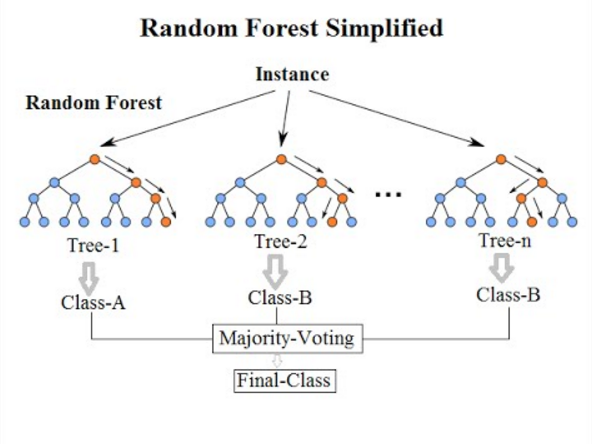
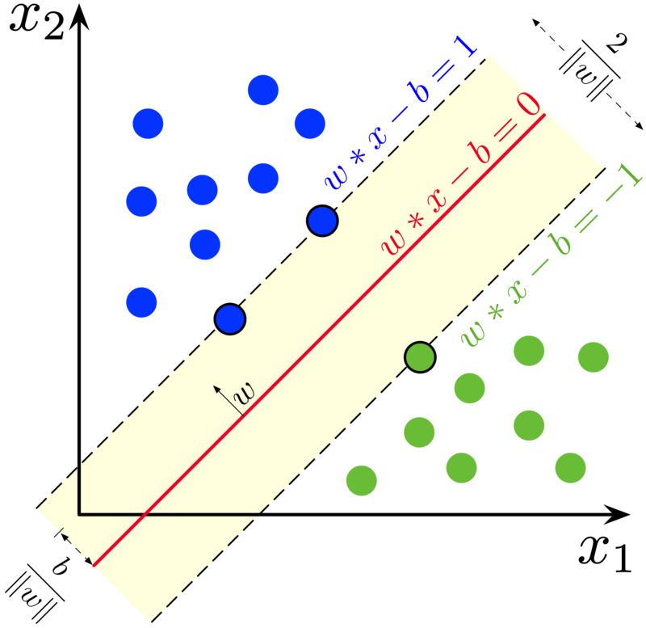

--- 
title: '**sits**: Satellite Image Time Series Analysis 
    on Earth Observation Data Cubes'
author:
- Gilberto Camara
- Rolf Simoes
- Felipe Souza
- Charlotte Peletier
- Alber Sanchez
- Pedro R. Andrade
- Karine Ferreira
- Gilberto Queiroz
date: "`r Sys.Date()`"
output:
  html_document: 
    df_print: tibble
    theme:
        base_font:
          google: "IBM Plex Serif"
        code_font:
          google: "IBM Plex Mono"
documentclass: report
link-citations: yes
colorlinks: yes
lot: yes
lof: yes
always_allow_html: true
fontsize: 11pt
site: bookdown::bookdown_site
cover-image: images/cover_sits_book.png
bibliography: e-sensing.bib
biblio-style: apalike
csl: ieee.csl
indent: true
description: |
  This book presents  **sits**, an open-source R package for satellite image time series analysis. The package supports the application of machine learning techniques for classifying image time series obtained from Earth observation data cubes.
---
```{r, setup, include=FALSE}
knitr::opts_chunk$set(
    class.output = 'sourceCode'
)
```

```{r, echo = FALSE}
source("common.R")
```

```{r, echo = FALSE}
library(sits)
library(sitsdata)
library(tibble)
```


# Preface {-}

<a href="https://github.com/e-sensing/sitsbook"></a>

Satellite images are the most comprehensive source of data about our environment; they provide essential information on global challenges. In recent years, space agencies have adopted open distribution policies. Petabytes of Earth observation data are now available. Experts now have access to repeated acquisitions over the same areas; the resulting time series improve our understanding of ecological patterns and processes. Instead of selecting individual images from specific dates and comparing them, researchers now can track change continuously. 

Information on land change is critical for sustainable development because our growing demand for natural resources is causing significant environmental impacts. Satellite time series enable significant advances in classifying land use and land cover change, compared to what is achievable with image from a single date or temporal composites. Time series capture subtle changes in ecosystem health and condition and improve the distinction between different land classes. Using time series, analysts can obtain the best benefits from big Earth observation data collections. 

This book presents  `sits`, an open-source **R** package for land use and land cover classification of big Earth observation data using satellite image time series. Users can build regular data cubes from cloud data services such as Amazon Web Services, Microsoft Planetary Computer, Brazil Data Cube, and Digital Earth Africa. The software includes functions for quality assessment of training samples using self-organized maps. It provides machine learning and deep learning algorithms for classification of big Earth observation data cubes. Post-processing methods includes Bayesian smoothing and uncertainty assessment. Users can apply best practices for estimating area and assessing accuracy of land change. Thus, `sits` is an end-to-end toolkit for land mapping with Earth observation.

## Who this book is for {-}

The target audience for `sits` is the community of remote sensing experts with Earth Sciences background who want to have access to state-of-the-art data analysis methods, with minimal investment in programming skills. The package provides a clear and direct set of functions, which are easy to learn and master. Users with a minimal background on **R** programming can start using `sits` right away. Those not yet familiar with **R** need only to learn introductory concepts.  

If you are not an **R** user and would like to quickly master what is needed to run `sits`, please read Part 1 and Part 2 of the book by Garrett Golemund, "Hands-On Programming with R" <https://rstudio-education.github.io/hopr/>. If you already are an **R** user and would like to update your skills with the latest trends,  please read the book by Hadley Wickham and Gareth Golemund, "R for Data Science". <https://r4ds.had.co.nz/>.


## Main reference for sits {-}

If you use sits in your work, please cite the following paper: 

Rolf Simoes, Gilberto Camara, Gilberto Queiroz, Felipe Souza, Pedro R. Andrade,  Lorena Santos, Alexandre Carvalho, and Karine Ferreira. “Satellite Image Time Series Analysis for Big Earth Observation Data”. Remote Sensing, 13, p. 2428, 2021. <https://doi.org/10.3390/rs13132428>. 

## Licenses {-}

This book is licensed as Attribution-NonCommercial-ShareAlike 4.0 International (CC BY-NC-SA 4.0) by Creative Commons <https://creativecommons.org/licenses/by-nc-sa/4.0/>. The `sits` package is licensed under the GNU General Public License, version 3.0. 

<!--chapter:end:index.Rmd-->

# Setup {.unnumbered}

The `sits` package relies on the `sf` and `terra` R packages, which in turn require the GDAL and PROJ libraries. Please follow the instructions below for installing `sf` and `terra` together with GDAL, provided by Edzer Pebesma.

## Support for GDAL and PROJ {.unnumbered}

#### Windows and MacOS {.unnumbered}

Windows and MacOS users are strongly encouraged to install the `sf` and `terra` binary packages from CRAN. To install `sits` from source, please install package `Rtools` to have access to the compiling environment.

#### Ubuntu {.unnumbered}

For Ubuntu versions 20.04 (focal) and 22.04 (jammy), we provide a script for fast installation, based on the work by Dirk Eddelbuettel in [r2u](https://github.com/eddelbuettel/r2u) project. The script installs binary versions of sits and all its dependencies. It requires R version 4.2.0 or later. To download the script use:

```bash
wget https://raw.githubusercontent.com/e-sensing/sitsbook/master/utils/fast_sits_installation_ubuntu.sh
```

and run the script as sudo:

```bash
sudo sh fast_sits_installation_ubuntu.sh
```

Alternatively, the installation can be done step-by-step. We recommend using the latest version of the GDAL, GEOS, and PROJ4  libraries. To do so, use the repository `ubuntugis-unstable`, which should be done as follows:

``` sh
sudo add-apt-repository ppa:ubuntugis/ubuntugis-unstable
sudo apt-get update
sudo apt-get install libudunits2-dev libgdal-dev libgeos-dev libproj-dev 
```

If you get an error while adding this PPA repository, it could be because you miss the package `software-properties-common`. When GDAL is running in `docker` containers, please add the security flag `--security-opt seccomp=unconfined` on start. 

#### Debian

To install on Debian, use the [rocker geospatial](https://github.com/rocker-org/geospatial) dockerfiles. 

#### Fedora {.unnumbered}

The following command installs all required dependencies:

``` sh
sudo dnf install gdal-devel proj-devel geos-devel sqlite-devel udunits2-devel
```

## Installing the `sits` package {.unnumbered}

`sits` is available on CRAN and should be installed as other R packages.

```{r, eval = FALSE}
install.packages("sits")
```

The source code repository is on GitHub <https://github.com/e-sensing/sits>. To install the development version of `sits`, which contains the latest updates but might be unstable, users should install `devtools` if not already available, as then install sits as follows:

```{r, eval = FALSE}
install.packages("devtools")
devtools::install_github("e-sensing/sits@dev", dependencies = TRUE)
```

To run the examples in the book, please also install the "sitsdata" package.

```{r, eval = FALSE}
options(download.file.method = "wget")
devtools::install_github("e-sensing/sitsdata")
```

<!--chapter:end:01-setup.Rmd-->

# Acknowledgements {-}

## Funding Sources {-}

The authors acknowledge the funders that supported the development of `sits`:

1.  Amazon Fund, established by the Brazil with financial contribution from Norway, through contract 17.2.0536.1. between the Brazilian Development Bank (BNDES) and the Foundation for Science, Technology and Space Applications (FUNCATE), for the establishment of the Brazil Data Cube,   

2. Coordenação de Aperfeiçoamento de Pessoal de Nível Superior-Brasil (CAPES) and from the Conselho Nacional de Desenvolvimento Científico e Tecnológico (CNPq) for grants 312151/2014-4 and 140684/2016-6. 

3. Sao Paulo Research Foundation (FAPESP) under eScience Program grant 2014/08398-6, for for providing MSc, PhD and post-doc scholarships, equipment, and travel support.  

4. International Climate Initiative of the Germany Federal Ministry for the Environment, Nature Conservation, Building and Nuclear Safety (IKI) under grant 17-III-084- Global-A-RESTORE+ (“RESTORE+: Addressing Landscape Restoration on Degraded Land in Indonesia and Brazil”). 

5. Microsoft Planetary Computer initiative under the GEO-Microsoft Cloud Computer Grants Programme. 


## Community Contributions {-}

The authors thank Marius Appel, Tim Appelhans, Henrik Bengtsson, Robert Hijmans, Edzer Pebesma, and Ron Wehrens, for their R packages `gdalcubes`,  `leafem`, `data.table`, `terra`, `sf`/`stars`, and "kohonen". We are indebted to the RStudio team, including Hadley Wickham for the `tidyverse` and Daniel Falbel for `torch`.

## Reproducible papers used in building sits {-}

We thank the authors of these papers for making their code available. 

- Marius Appel and Edzer Pebesma, “On-Demand Processing of Data Cubes from Satellite Image Collections with the Gdalcubes Library.” Data 4 (3): 1–16, 2020. <https://doi.org/10.3390/data4030092>

- Hassan Fawaz, Germain Forestier, Jonathan Weber, Lhassane Idoumghar,  and Pierre-Alain Muller, "Deep learning for time series classification: a review". Data Mining and Knowledge Discovery, 33(4): 917--963, 2019. <https://doi.org/10.1007/s10618-019-00619-1>.

- Edzer Pebesma, "Simple Features for R: Standardized Support for Spatial Vector Data". R Journal, 10(1):2018.

- Charlotte Pelletier, Geoffrey Webb, and Francois Petitjean. “Temporal Convolutional Neural Network for the Classification of Satellite Image Time Series”. Remote Sensing 11 (5), 2019. <https://doi.org/10.3390/rs11050523>

- Ron Wehrens and Kruisselbrink, Johannes. "Flexible Self-Organising Maps in kohonen 3.0". Journal of Statistical Software, 87, 7 (2018). <https://doi.org/10.18637/jss.v087.i07>.

- Vivien Garnot, Loic Landrieu, Sebastien Giordano, and Nesrine Chehata,  "Satellite Image Time Series Classification with Pixel-Set Encoders and Temporal Self-Attention", Conference on Computer Vision and Pattern Recognition, 2020. <https://doi.org/10.1109/CVPR42600.2020.01234>.

- Vivien Garnot, Loic Landrieu, "Lightweight Temporal Self-Attention  for Classifying Satellite Images Time Series", 2020. <arXiv:2007.00586>.

- Maja Schneider, Marco Körner, "[Re] Satellite Image Time Series Classification with Pixel-Set Encoders and Temporal Self-Attention." ReScience C 7 (2), 2021. <doi:10.5281/zenodo.4835356>.

\newpage

## Publications using sits {-}

This section gathers the publications that have used **sits** to generate their results.


**2021**

- Lorena Santos, Karine R. Ferreira, Gilberto Camara, Michelle Picoli, Rolf Simoes, “Quality control and class noise reduction of satellite image time series”. ISPRS Journal of Photogrammetry and Remote Sensing, vol. 177, pp 75-88, 2021. https://doi.org/10.1016/j.isprsjprs.2021.04.014.

- Lorena Santos, Karine Ferreira, Michelle Picoli, Gilberto Camara, Raul Zurita-Milla and Ellen-Wien Augustijn, “Identifying Spatiotemporal Patterns in Land Use and Cover Samples from Satellite Image Time Series”. Remote Sensing, 2021, 13(5), 974; https://doi.org/10.3390/rs13050974. 


**2020**

- Rolf Simoes, Michelle Picoli, Gilberto Camara, Adeline Maciel, Lorena Santos, Pedro Andrade, Alber Sánchez, Karine Ferreira & Alexandre Carvalho. “Land use and cover maps for Mato Grosso State in Brazil from 2001 to 2017”. Nature Scientific Data 7, article 34 (2020). DOI: 10.1038/s41597-020-0371-4.

- Michelle Picoli, Ana Rorato, Pedro Leitão, Gilberto Camara, Adeline Maciel, Patrick Hostert, Ieda Sanches, “Impacts of Public and Private Sector Policies on Soybean and Pasture Expansion in Mato Grosso—Brazil from 2001 to 2017”. Land, 9(1), 2020. DOI: 10.3390/land9010020. 

- Karine Ferreira, Gilberto Queiroz et al., “Earth Observation Data Cubes for Brazil: Requirements, Methodology and Products”. Remote Sensing, 12, 4033, 2020.

- Adeline Maciel, Lubia Vinhas, Michelle Picoli and Gilberto Camara, “Identifying Land Use Change Trajectories in Brazil’s Agricultural Frontier”. Land, 9, 506, 2020. DOI: 10.3390/land9120506. DOI: 10.3390/rs12244033.

**2018**

- Michelle Picoli, Gilberto Camara, et al.,  “Big Earth Observation Time Series Analysis for Monitoring Brazilian Agriculture”. ISPRS Journal of Photogrammetry and Remote Sensing, 2018.

<!--chapter:end:02-acknowledgements.Rmd-->

---
output:
  pdf_document: default
  html_document: default
---

# Introduction to SITS{-}

```{r, include = FALSE}
source("common.R")
dir.create("./tempdir/chp3")
```

<a href="https://www.kaggle.com/esensing/introduction-to-sits" target="_blank"></a>

## How `sits` works {.unnumbered}

The `sits` package is based on the premise of using all of the data available in an Earth observation data cube, adopting a *time-first, space-later* approach. Each spatial location is associated to a time series. Locations with known labels train a machine learning classifier, which classifies all time series of a data cube, as shown in Figure 1.

```{r sits-overview, echo = FALSE, out.width = "70%", out.height = "70%", fig.align="center", fig.cap="Using time series for land classification (source: authors)"}
knitr::include_graphics("images/sits_general_view.png")
```

\newpage

The package provides a set of tools for analysis, visualization and classification of satellite image time series. Users follow a typical workflow:

1.  Select an analysis-ready data image collection on cloud providers such as AWS, Microsoft Planetary Computer, Digital Earth Africa and Brazil Data Cube.
2.  Build a regular data cube using the chosen image collection.
3.  Obtain new bands and indices with operations on data cubes.
4.  Extract time series samples from the data cube to be used as training data.
5.  Perform quality control and filtering on the time series samples.
6.  Train a machine learning model using the extracted samples.
7.  Use the model to classify the data cube and get class probabilities for each pixel.
8.  Post-process the probability cube to remove outliers.
9.  Produce a labeled map from the post-processed probability cube.
10. Evaluate the accuracy of the classification using best practices.

Each step of workflow corresponds to a function of the `sits` API, as shown in the table and figure below. These functions have convenient default parameters and behavior. A single function builds machine learning models ranging from random forests to neural networks. Functions that process big data cubes implement efficient processing internally. Thus, users can achieve good results without in-depth knowledge about machine learning and parallel processing.

```{r api_tab, echo = FALSE}
library(kableExtra)

sits_api <- data.frame(
    API_function = c("sits_cube()", 
                     "sits_regularize()",
                     "sits_apply()",
                     "",
                     "sits_get_data()", 
                     "sits_som()",
                     "sits_train()", 
                     "sits_classify()", 
                     "",
                     "sits_smooth()",
                     "sits_label_classification()", 
                     "sits_accuracy()"),
    Inputs = c("ARD image collection", 
               "Irregular data cube", 
               "Regular data cube", 
               "",
               "Data cube and sample locations",
               "Time series", 
               "Time series and ML algorithm", 
               "ML classification model", 
               "and regular data cube",
               "Probability cube", 
               "Post-processed probs cube",
               "Classified map and validation samples"),
    Output = c("Irregular data cube", 
               "Regular data cube",
               "Regular data cube",
               "with new bands and indices",
               "Time series",
               "Improved time series samples",
               "ML classification model", 
               "Probability cube", 
               "",
               "Post-processed probs cube",
               "Classified map",
               "Accuracy assessment")
)
kableExtra::kbl(sits_api, 
                caption = "The sits API workflow for land classification",
                booktabs = TRUE) %>%
    kableExtra::kable_styling(position = "center", 
                              latex_options = c("scale_down", "HOLD_position")) %>% 
    kableExtra::column_spec(column = 1, monospace = TRUE, color =  "RawSienna")
```


```{r api, echo = FALSE, out.width = "100%", out.height = "100%", fig.align="center", fig.cap="Main functions of the SITS API (source: authors)."}

knitr::include_graphics("images/sits_api.png") 
```

\newpage

## Creating a Data Cube {.unnumbered}

There are two kinds of data cubes in `sits`: (a) irregular data cubes generated by selecting image collections image collections on cloud providers such as AWS and Planetary Computer; (b) regular data cubes with images fully covering a chosen area, where each image has the same spectral bands and spatial resolution, and images follow a set of adjacent and regular time intervals. Machine learning applications need regular data cubes. For further details, please refer to Chapter "Earth Observation Data Cubes".

The first steps in using `sits` are: (a) select an analysis-ready data image collection available in a cloud provider or stored locally using `sits_cube()`; (b)if the collection is not regular, use `sits_regularize()` to build a regular data cube.

This section shows how to build a data cube from images organized as a regular data cube and available as local files. The data cube is composed of a set of MODIS MOD13Q1 images for the Sinop region in Mato Grosso, Brazil. All images have bands "NDVI" and "EVI" covering a one-year period from 2013-09-14 to 2014-08-29 (we use "year-month-day" for dates). There are 23 time instances, each covering a 16-day period. The data is available in the R package `sitsdata`.

To build a data cube from local files, users need to provide information about the original source from with the data was obtained. In this case, `sits_cube()` needs the parameters:

(a) `source`, the cloud provider from where the data has been obtained (in this case the Brazil Data Cube "BDC");
(b) `collection`, the collection from where the images have been extracted. In this case, data comes from the MOD13Q1 collection 6; 
(c) `data_dir`, the local directory where the image files are stored; 
(d) `parse_info`, stating how file names store information on tile, band and date. In this case, local images stored as `TERRA_MODIS_012010_EVI_2014-07-28.tif`. 

```{r, out.width = "80%", tidy="styler", fig.align = 'center', fig.cap="Color composite image MODIS cube for 2013-09-14 (red = EVI, green = NDVI, blue = EVI)."}
# create a data cube object based on the information about the files
sinop <- sits_cube(
  source = "BDC", 
  collection  = "MOD13Q1-6",
  data_dir = system.file("extdata/sinop", package = "sitsdata"),  
  parse_info = c("X1", "X2", "tile", "band", "date")
)
# plot a color composite  for the first date (2013-09-14)
plot(sinop, 
     red = "EVI", 
     green = "NDVI", 
     blue = "EVI", 
     date = "2013-09-14"
)
```

\newpage

The R object returned by `sits_cube()` contains the metadata that describes the the contents of the data cube. The metadata includes data source and collection, satellite, sensor, tile in the collection, bounding box, projection, and list of files. Each file refers to one band of an image at one of the temporal instances of the cube.

```{r}
# show the R object that describes the data cube
sinop
```

## The time series table {-}

To handle time series information, `sits` uses a tabular data structure. The example below shows a table with 1,218 time series obtained from MODIS MOD13Q1 images. Each series has four attributes: two bands ("NIR" and "MIR") and two indexes ("NDVI" and "EVI"). This data set is available in package `sitsdata`.

```{r}
# load the MODIS samples for Mato Grosso from the "sitsdata" package
library(tibble)
library(sitsdata)
data("samples_matogrosso_mod13q1", package = "sitsdata")
samples_matogrosso_mod13q1[1:2,]
```

The data structure associated to the time series is a table that contains data and metadata. The first six columns contain the metadata: spatial and temporal information, the label assigned to the sample, and the data cube from where the data has been extracted. The `time_series` column contains the time series data for each spatiotemporal location. This data is also organized as a table, with a column with the dates and the other columns with the values for each spectral band. For more details on how to handle time series data, please see the "Working with Time Series" chapter.

It is useful to plot the dispersion of the time series. In what follows, for brevity we will select only one label ("Forest") and one index ("NDVI"). The resulting plot shows all of the time series associated to the label and attribute, highlighting the median and the first and third quartiles.

```{r, out.width = "80%", tidy="styler", fig.align = 'center', fig.cap="Joint plot of all samples in band NDVI for class Forest.", strip.white = FALSE}
samples_forest <- dplyr::filter(
    samples_matogrosso_mod13q1, 
    label == "Forest"
)
samples_forest_ndvi <- sits_select(
    samples_forest, 
    band = "NDVI"
)
plot(samples_forest_ndvi)
```

## Training a machine learning model {.unnumbered}

The next step is to train a machine learning (ML) model using `sits_train()`. It takes two inputs, `samples` (a time series table) and `ml_method` (a function that implements a ML algorithm). The result is a model that is used classification. Each algorithm requires specific parameters that are user-controllable. For novice users, `sits` provides default parameters which produces a good result. For more details, please see the "Machine Learning for Data Cubes" chapter. 

Since the time series data has four attributes ("EVI", "NDVI", "NIR", "MIR") and the data cube images only two, we select the "NDVI" and "EVI" values and use the resulting data for training. To build the classification model, we use a random forest model called by the `sits_rfor()` function.

```{r, out.width = "80%", tidy="styler", fig.align="center", fig.cap="Most relevant variables of trained random forests model."}
# select the bands "ndvi", "evi"
samples_2bands <- sits_select(
    data = samples_matogrosso_mod13q1, 
    bands = c("NDVI", "EVI"))

# train a random forest model
rf_model <- sits_train(
    samples = samples_2bands, 
    ml_method = sits_rfor()
)
# plot the most important variables of the model
plot(rf_model)
```

## Data cube classification {.unnumbered}

After training the machine learning model, the next step is to classify the data cube using `sits_classify()`. This function produces a set of raster probability maps, one for each class. For each of these maps, the value of a pixel is proportional to the the probability that it belongs to the class. This function has two mandatoty parameters: `data`, the data cube or time series tibble to be classified; and `ml_model`, the trained ML model. Optional parameters include: (a) `multicores`, number of cores to be used; (b) `memsize`, RAM used in the classification; (c) `output_dir`, the directory where the classified files will be written. Details of the classification process are available in "Classification of Images in Data Cubes".

```{r, out.width = "80%", tidy="styler", fig.align = 'center', fig.cap = "Probability map for class Forest."}

# classify the raster image
sinop_probs <- sits_classify(
    data = sinop, 
    ml_model = rf_model,
    multicores = 2,
    memsize = 8,
    output_dir = "./tempdir/chp3"
)
# plot the probability cube
plot(sinop_probs, labels = c("Forest"))
```

After classification has been completed, we plot the probability maps for class "Forest". Probability maps are useful to visualize the degree of confidence that the classifier assigns to the labels for each pixel and can be used to produce uncertainty information and support active learning, as described in Chapter "Data Cube Classification".

## Spatial smoothing {.unnumbered}

When working with big EO data, there is much variability in each class. As a result, some pixels will be misclassified. These errors are more likely to occur in transition areas between classes. To offset these problems,  the `sits_smooth()` function takes a probability cube as input and  uses the class probabilities of each pixel's neighborhood to reduce labeling uncertainty. We then plot the smoothed probability map for class "Forest" to compare with the previous plot.

```{r, out.width = "80%",  tidy="styler", fig.align = 'center', fig.cap = "Smoothed probability map for class Forest."}
# perform spatial smoothing
sinop_bayes <- sits_smooth(
    cube = sinop_probs,
    multicores = 2,
    memsize = 8,
    output_dir = "./tempdir/chp3"
)
plot(sinop_bayes, labels = c("Forest"))
```

## Labelling a probability data cube {.unnumbered}

After removing outliers using local smoothing, one can obtain the labeled classification map using the function `sits_label_classification()`. This function assigns each pixel to the class with highest probability.
\newpage

```{r, out.width = "100%", tidy="styler", fig.cap = "Classification map for Sinop", fig.align="center"}

# label the probability file 
sinop_map <- sits_label_classification(
    cube = sinop_bayes, 
    output_dir = "./tempdir/chp3"
)
plot(sinop_map, title = "Sinop Classification Map")
```

In the above example, the color legend is taken for the predefined color table provided by `sits`. The options for defining labels include:

1.  Predefined color table: `sits` has a default color table, that can be shown using the command `sits_config_show(colors = TRUE)`. This color definition file assigns colors to about 250 class names, including the IPCC and IGBP land use classes, the UMD GLAD classification scheme, the FAO LCC1 and LCCS2 land use layers, and the LCCS3 surface hydrology layer.
2.  User-defined defined color table: users can set the legend they prefer with a YAML user-defined configuration file. This file should defined by the environmental variable `SITS_CONFIG_USER_FILE`. Create an YAML file, and then set the path to it with `Sys.setenv(SITS_CONFIG_USER_FILE="path_to_myfile")`. An example of an YAML file with user-defined legend is shown below.
3. User-defined legend: users may define their own legends and pass them as parameters to to the `plot` function.

```{yaml}
colors:
    Cropland:           "khaki"
    Deforestation:      "sienna"
    Forest :            "darkgreen"
    Grassland :         "lightgreen"
    NonForest:          "lightsteelblue1"
```

The resulting classification files can be read by QGIS. Links to the associated files are available in the `sinop_map` object in the nested table `file_info`.

```{r}
# show the location of the classification file
sinop_map$file_info[[1]]
```

## Final remarks {.unnumbered}

The `sits` package provides an API to build EO data cubes from image collections available in cloud services, and to perform land classification of data cubes using machine learning. The classification models are built based on satellite image time series extracted from the cubes. The package provides additional function for sample quality control, post-processing and validation. The design of the API tries to reduce complexity for users and hide details such as how to do parallel processing, and to handle data cubes composed by tiles of different timelines.

<!--chapter:end:03-intro.Rmd-->

# Earth observation data cubes{-}

```{r, include = FALSE}
source("common.R")
dir.create("./tempdir/chp4")
library(sits)
```

## Analysis-ready data image collections{-}

Collections of Earth observation analysis-ready data (ARD) are available in cloud services such as Amazon Web Service, Brazil Data Cube, Digital Earth Africa, Swiss Data Cube, and Microsoft's Planetary Computer. These collections which have been processed to improve multidate comparability.  Radiance measures at the top of the atmosphere have been converted to ground reflectance measures.  In general, timelines of the images of an ARD image collection are different. Images still contain cloudy or missing pixels; bands for the images in the collection may have different resolutions. Figure 9 shows an example of the Landsat ARD image collection. 

```{r ardtile, echo = FALSE, out.width="70%", fig.align="center", fig.cap="ARD image collection (source: USGS). Reproduction based on fair use doctrine."}
knitr::include_graphics("images/usgs_ard_tile.png")
```

ARD image collections are organized in spatial partitions. Sentinel-2/2A images follow the MGRS tiling system, which divides the world in 60 UTM zones of 8 degrees of longitude each. Each zone has blocks of 6 degrees of latitude. Blocks are split into tiles of 110 x 110 km2 with a 10 km overlap. Figure 10 shows the MGRS tiling system for a part of the Northeastern coast of Brazil, contained in UTM zone 24, block M. 

```{r wrs, echo = FALSE, out.width="70%", fig.align="center", fig.cap="MGRS tiling system used by Sentinel-2 images (source: GISSurfer 2.0). Reproduction based on fair use doctrine."}
knitr::include_graphics("images/s2_mgrs_grid.png")
```

The Landsat 4/5/7/8/9 satellites use the Worldwide Reference System (WRS-2), which breaks the coverage of Landsat satellites into images identified by path and row.  The path is the descending orbit of the satellite; the WRS-2 system has 233 paths per orbit and each path is divided in 119 rows,where each row refers to ta latitudinal center line of a frame of imagery. Images in WRS-2 are geometrically corrected to the UTM projection. 

```{r mgrs, echo = FALSE, out.width="70%", fig.align="center", fig.cap="WRS-2 tiling system used by Landsat-5/7/8/9 images (source: INPE and ESRI). Reproduction based on fair use doctrine."}
knitr::include_graphics("images/landsat_wrs_grid.png")
```

## ARD image collections handled by sits{-}

As of version 1.1.0, `sits` supports access to the following ARD image collections:

1. Amazon Web Services (AWS): Open data Sentinel-2/2A level 2A collections for the Earth's land surface. 
2. Brazil Data Cube (BDC): Open data collections of Sentinel-2/2A, Landsat-8, CBERS-4/4A, and MODIS images for Brazil. These collections organized as regular data cubes. 
3. Digital Earth Africa (DEA): Open data collections of Sentinel-2/2A and Landsat-8 for Africa.
4. Microsoft Planetary Computer (MPC): Open data collections of Sentinel-2/2A and Landsat-4/5/7/8/9 for the Earth's land areas. 
5. USGS: Landsat-4/5/7/8/9 collections available in AWS, which require payment to access. 
6. Swiss Data Cube (SDC): Open data collection of Sentinel-2/2A and Landsat-8 images for Switzerland. 

## Regular image data cubes{-}

Machine learning and deep learning (ML/DL) classification algorithms require the input data to be consistent. The dimensionality of the data used for training the model has to be the same as that of the data to be classified. There should be no gaps in the input data and no missing values are allowed. Thus, to use of ML/DL algorithms for remote sensing data, ARD image collections should be converted to regular data cubes. Following [@Appel2019], a *regular data cube*  meets the following definition:

1. A regular data cube is a four-dimensional structure with dimensions x (longitude or easting), y (latitude or northing), time, and bands.
2. Its spatial dimensions refer to a single spatial reference system (SRS). Cells of a data cube have a constant spatial size with respect to the cube’s SRS.
3. The temporal dimension is composed of a set of continuous and equally-spaced intervals. 
4. For every combination of dimensions, a cell has a single value.

All cells of a data cube have the same spatiotemporal extent. The spatial resolution of each cell is the same in X and Y dimensions. All temporal intervals are the same. Each cell contains a valid set of measures. For each position in space, the data cube should provide a valid time series. For each time interval, the regular data cube should provide a valid 2D image (see Figure 11). 

```{r dcconcept, echo = FALSE, out.width="90%", fig.align="center", fig.cap="Conceptual view of data cubes (source: authors)"}
knitr::include_graphics("images/datacube_conception.png")
```

Currently, the only cloud service that provides regular data cubes by default is the Brazil Data Cube (BDC). Analysis-ready data (ARD) collections available in AWS, MSPC, USGS and DE Africa are not regular in space and time. Bands may have different resolutions, images may not cover the entire time, and time intervals are not regular. For this reason, subsets of these collections need to be converted to regular data cubes before further processing. To produce data cubes for machine-learning data analysis, users should first create an irregular data cube from an ARD collection and then use `sits_regularize()`, as described below.

## Creating data cubes{-}

<a href="https://www.kaggle.com/esensing/creating-data-cubes-in-sits" target="_blank"></a>

To obtain information on ARD image collection from cloud providers, `sits` uses the STAC (SpatioTemporal Asset Catalogue) protocol, which is a specification of geospatial information which has been adopted by many large image collection providers. A 'spatiotemporal asset' is any file that represents information about the Earth captured in a certain space and time. To access STAC endpoints, `sits` uses the [rstac](http://github.com/brazil-data-cube/rstac) R package.

All access to image collections and data cubes is done using `sits_cube()`,  which requires the following common parameters:

1. `source`: name of the provider from the list of providers supported by `sits`. 
2. `collection`: a collection available in the provider and supported by `sits`. To find out which collections are supported by `sits`, see `sits_list_collections()`. 
3. `platform`: optional parameter specifying the platform in case of collections that include more than one satellite. 
4. `tiles`: Set of tiles of image collection reference system. Either `tiles` or `roi` should be specified. 
5. `roi`: a region of interest. Either: (a) a named vector (`lon_min`, `lon_max`, `lat_min`, `lat_max`) in WGS 84 coordinates; or (b) an `sf` object.  All images that intersect the convex hull of the `roi` are selected. 
6. `bands`: (optional) bands to be used. If missing, all bands from the collection are used.
7. `start_date`: the initial date for the temporal interval containing the time series of images.
8. `end_date`: the final date for the temporal interval containing the time series of images.

The `sits_cube()` function produces a tibble with metadata about the desired images. It has the information required for further processing, but does not contain the actual data. The attributes of individual image files can be assessed by listing the `file_info` column of the tibble. 


## Assessing Amazon Web Services{-}

AWS holds are two kinds of collections: *open-data* and *requester-pays*. Open data collections can be accessed without cost. Requester-pays collections require payment to an AWS account. Currently, `sits` supports collections `SENTINEL-S2-L2A` (requester-pays) and `SENTINEL-S2-L2A-COGS` (open-data). Both collections include all Sentinel-2/2A bands.  The bands in 10m resolution are `B02`, `B03`, `B04`, and `B08`. The  20m bands are `B05`, `B06`, `B07`, `B8A`, `B11`, and `B12`. Bands `B01` and `B09` are available at 60m resolution. A `CLOUD` band is also available. The example below shows how to access one tile of the open data `SENTINEL-S2-L2A-COGS` collection.  The `tiles` parameter allows selection of desired area according to the MGRS reference system. 

```{r, tidy="styler"}
# create a data cube covering an area in the Brazilian Amazon
# Sentinel-2 images over the Rondonia region
s2_20LKP_cube <- sits_cube(
    source = "AWS",
    collection = "SENTINEL-S2-L2A-COGS",
    tiles = "20LKP",
    bands = c("B04", "B08", "B11", "CLOUD"),
    start_date = "2018-07-12",
    end_date = "2019-07-28"
)
```


## Assessing Microsoft's Planetary Computer{-}

Microsoft's Planetary Computer (MPC) hosts two open data collections: `SENTINEL-2-L2A` and `LANDSAT-C2-L2`. The first collection contains SENTINEL-2/2A ARD images, with the same bands and resolutions as those available in AWS (see above). The example below shows how to access the `SENTINEL-2-L2A` collection. 

```{r, tidy="styler",  out.width="90%", fig.align="center", fig.cap= "Sentinel-2 image in an area of the state of Rondonia, Brazil"}
# create a data cube covering an area in the Brazilian Amazon
s2_20LKP_cube_MPC <- sits_cube(
      source = "MPC",
      collection = "SENTINEL-2-L2A",
      tiles = "20LKP",
      bands = c("B05", "B8A", "B11", "CLOUD"),
      start_date = "2019-07-01",
      end_date = "2019-07-28"
      
)
# plot a color composite of one date of the cube
plot(s2_20LKP_cube_MPC, red = "B11", blue = "B05", green = "B8A", 
     date = "2019-07-18")
```

The `LANDSAT-C2-L2` collection provides access to data from Landsat-4, 5, 7, 8, and 9 satellites. Images from these satellites have been intercalibrated to ensure data consistency. For compatibility between the different Landsat sensors, the band names are `BLUE`, `GREEN`, `RED`,  `NIR08`,  `SWIR16`, and `SWIR22`. All images have 30m resolution. For this collection,  tile search is not supported; the `roi` parameter should be used. The example shows how to retrieve data from a region of interest covering the city of Brasilia in Brazil. 

\newpage

```{r, tidy="styler", out.width="80%", fig.align="center", fig.cap= "Landsat-8 image in an area of the city of Brasilia, Brazil"}
# Read a shapefile thar covers the city of Brasilia
shp_file <- system.file("extdata/shapefiles/df_bsb/df_bsb.shp", 
                        package = "sits")
sf_bsb <- sf::read_sf(shp_file)
# select the cube
s2_L8_cube_MPC <- sits_cube(
        source = "MPC",
        collection = "LANDSAT-C2-L2",
        bands = c("BLUE", "NIR08", "SWIR16", "CLOUD"),
        roi = sf_bsb,
        start_date = "2019-06-01",
        end_date = "2019-10-01"
)
# Plot the second tile that covers Brasilia
plot(s2_L8_cube_MPC[2,], red = "SWIR16", green = "NIR08", blue = "BLUE", 
     date = "2019-07-30")
```


## Assessing Digital Earth Africa{-}

Digital Earth Africa (DEAFRICA) is a cloud service that provides open access Earth Observation data for the African continent. The ARD image collections available in `sits` are `S2_L2A` (Sentinel-2 level 2A) and `LS8_SR` (Landsat-8). Since the STAC interface for DEAFRICA does not implement the concept of tiles, users users need to specify their area of interest using the `roi` parameter. The requested `roi` produces a cube that contains three MGRS tiles ("35HLD", "35HKD", and "35HLC") covering part of South Africa. 
```{r, tidy="styler", out.width="90%", fig.align="center", fig.cap="Sentinel-2 image in an area over South Africa"}
dea_cube <- sits_cube(
    source = "DEAFRICA",
    collection = "S2_L2A",
    roi = c(lon_min = 24.97, lat_min = -34.30,
            lon_max = 25.87, lat_max = -32.63),
    bands = c("B05", "B8A", "B11"),
    start_date = "2019-09-01",
    end_date = "2019-10-01"
)
# plot tile 35HLC
dea_cube %>% 
    dplyr::filter(tile == "35HLC") %>% 
    plot(red = "B11", blue = "B05", green = "B8A", date = "2019-09-07")
```

## Assessing the Brazil Data Cube{-}

The [Brazil Data Cube](http://brazildatacube.org/) (BDC) is built by Brazil’s National Institute for Space Research (INPE). The BDC uses three hierarchical grids based on the Albers Equal Area projection and SIRGAS 2000 datum. The three grids are generated taking -54$^\circ$ longitude as the central reference and defining tiles of $6\times4$, $3\times2$ and $1.5\times1$ degrees. The large grid is composed by tiles of $672\times440$ km^2^ and is used for CBERS-4 AWFI collections at 64 meter resolution; each CBERS-4 AWFI tile contains images of $10,504\times6,865$ pixels. The medium grid is used for Landsat-8 OLI collections at 30 meter resolution; tiles have an extension of $336\times220$ km^2^ and each image has $11,204\times7,324$ pixels. The small grid covers $168\times110$ km^2^ and is used for Sentinel-2 MSI collections at 10m resolutions; each image has $16,806\times10,986$ pixels. The data cubes in the BDC are regularly spaced in time and cloud-corrected [@Ferreira2020a]. 

```{r, echo = FALSE, out.width="80%", fig.align="center", fig.cap="Hierarchical BDC tiling system showing overlayed on Brazilian Biomes (a), illustrating that one large tile (b) contains four medium tiles (c) and that medium tile contains four small tiles. Source: Ferreira et al.(2020). Reproduction under fair use doctrine."}

knitr::include_graphics("images/bdc_grid.png")
```

The collections available in the BDC are: `LC8_30_16D_STK-1` (Landsat-8 OLI, 30m resolution, 16-day intervals),  `S2-SEN2COR_10_16D_STK-1` (Sentinel-2 MSI images at 10 meter resolution, 16-day intervals), `CB4_64_16D_STK-1` (CBERS 4/4A AWFI, 64m resolution, 16 days intervals), `CB4_20_1M_STK-1` (CBERS 4/4A MUX, 20m resolution, one month intervals) and `MOD13Q1-6` (MODIS MOD13SQ1 product, collection 6, 250m resolution, 16-day intervals). For more details, use `sits_list_collections(source = "BDC")`.

To access the Brazil Data Cube, users need to provide their credentials using an environment variables, as shown below. Obtaining a BDC access key is free. Users need to register at the [BDC site](https://brazildatacube.dpi.inpe.br/portal/explore) to obtain the key.
```{r,eval = FALSE}
Sys.setenv(
    "BDC_ACCESS_KEY" = <your_bdc_access_key>
)
```

In the example below, the data cube is defined as one tile ("022024") of `CB4_64_16D_STK-1` collection which holds CBERS AWFI images at 16 days resolution.

```{r, tidy="styler", eval = FALSE}
# define a tile from the CBERS-4/4A AWFI collection
cbers_tile <- sits_cube(
    source = "BDC",
    collection = "CB4_64_16D_STK-1",
    tiles = "022024",
    bands = c("B13", "B14", "B15", "B16", "CLOUD"),
    start_date = "2018-09-01",
    end_date = "2019-08-28"
)
# plot one time instance
plot(cbers_tile, red = "B15", green = "B16", blue = "B13", date = "2018-09-30")
```

```{r, echo = FALSE, out.width="70%", fig.align="center", fig.cap="Plot of CBERS-4 image obtained from the BDC with a single tile covering an area in the Brazilian Cerrado."}

knitr::include_graphics("images/cbers_4_image_bdc.png")
```

## Defining a data cube using ARD local files{-}

ARD images downloaded from cloud collections to a local computer are not associated to a STAC endpoint that describes them. They need to be be organized and named to allow `sits` to create a data cube from them. All local files should be in the same directory and have the same spatial resolution and projection. Each file should contain a single image band for a single date. Each file name needs to include tile, date and band information. Users need to provide information about the original data source to allow `sits` to retrieve information about image attributes such as band names, missing values, etc. When working with local cubes,  `sits_cube()` needs the following parameters: 

1. `source`: name of the original data provider; either `BDC`, `AWS`, `USGS`, `MSPC` or `DEAFRICA`. 
2. `collection`:  collection from where the data was extracted. 
3. `data_dir`: local directory for images.
4. `bands`: optional parameter to describe the bands to be retrieved.
5. `parse_info`: information to parse the file names. File names need to contain information on tile, date and band, separated by a delimiter (usually "_").
6. `delim`: separator character between descriptors in the file name (default is "_").

The example shows how to define a data cube using files from the *sitsdata* package.  Given the file name `CB4_64_16D_STK_022024_2018-08-29_2018-09-13_EVI.tif`, to retrieve information about the images, one needs to set the `parse_info` parameter to `c("X1", "X2", "X3", "X4", "tile", "date", "X5", "band")`. 

```{r}
library(sits)
# Create a cube based on a stack of CBERS data
data_dir <- system.file("extdata/CBERS", package = "sitsdata")
# list the first file
list.files(data_dir)[1]
```

```{r, tidy="styler", out.width="90%", fig.align="center", fig.cap="CBERS-4 NDVI in an area over Brazil"}
# create a data cube from local files
cbers_cube <- sits_cube(
    source = "BDC",
    collection = "CB4_64_16D_STK-1",
    data_dir = data_dir,
    parse_info = c("X1", "X2", "X3", "X4", "tile", "date", "X5", "band")
)
# plot the band NDVI in the first time instance
plot(cbers_cube, band = "NDVI", date = "2018-08-29")
```

## Defining a data cube using classified images{-}

It is also possible to create local cubes based on results that have been produced by classification or post-classification algorithms. In this case, there are more parameters that are required and the parameter `parse_info` is specified differently, as follows:

1. `source`:  name of the original data provider. 
2. `collection`:  name of the collection from where the data was extracted. 
3. `data_dir`: local directory for the classified images.
4. `band`: Band name is associated to the type of result. Use `probs` for probability cubes produced by `sits_classify()`; `bayes`, `bilateral`, `gaussian` according to the function selected when using `sits_smooth()`; `entropy` when using `sits_uncertainty()`, `class` for labelled cubes.
5. `labels`: Labels associated to the classification results. 
6. `version`: Version of the result (default = `v1`).
7. `parse_info`: File name parsing information to allow `sits` to deduce the values of `tile`, `start_date`, `end_date`, `band` and `version` from the file name. Unlike non-classified image files, cubes produced by classification and post-classification have both `start_date` and `end_date`. 

The following code creates a results cube based on the classification of deforestation in Brazil.  This classified cube was obtained by a large data cube of Sentinel-2 images, covering the state of Rondonia, Brazil comprising 40 tiles, 10 spectral bands, and covering the period from 2020-06-01 to 2021-09-11. Samples of four classes were trained by a random forest classifier. 

```{r, tidy="styler", out.width="90%", fig.align="center", fig.cap="Classified data cube for year 2020/2021 in Rondonia, Brazil"}
# Create a cube based on a classified image 
data_dir <- system.file("extdata/Rondonia", package = "sitsdata")
# file is named "SENTINEL-2_MSI_20LLP_2020-06-04_2021-08-26_class_v1.tif" 
Rondonia_class_cube <- sits_cube(
    source = "AWS",
    collection = "SENTINEL-S2-L2A-COGS",
    bands = "class",
    labels = c("Burned_Area", "Cleared_Area", 
               "Highly_Degraded", "Forest"),
    data_dir = data_dir,
    parse_info = c("X1", "X2", "tile", "start_date", "end_date", 
                   "band", "version")
)
# plot the classified cube
plot(Rondonia_class_cube)
```

## Regularizing data cubes{-}

Analysis-ready data (ARD) collections available in AWS, MSPC, USGS and DEAFRICA are not regular in space and time. Bands may have different resolutions, images may not cover the entire tile, and time intervals are not regular. For this reason, subsets of these collection need to be converted to regular data cubes before further processing and data analysis. This is done in *sits* by the function `sits_regularize()`, which uses the  *gdalcubes* package [@Appel2019]. In the following example, the user has created an irregular data cube from the Sentinel-2 collection available in Microsoft's Planetary Computer (MSPC) for tiles `20LKP` and `20LLP` in the state of Rondonia, Brazil. As described earlier in this chapter, because of the way ARD image collections are built, some of the images have invalid pixels, as shown below.  We first build an irregular data cube using `sits_cube()`.

```{r, tidy="styler", out.width="90%", fig.align="center", fig.cap="Sentinel-2 tile 20LLP for date 2018-07-03"}
# creating an irregular data cube from MSPC
s2_cube <- sits_cube(
    source = "MPC",
    collection = "SENTINEL-2-L2A",
    tiles = c("20LKP", "20LLP"),
    bands = c("B05", "B8A", "B12", "CLOUD"),
    start_date = as.Date("2018-07-01"),
    end_date = as.Date("2018-08-31")
)
# plot the first image of the irregular cube
s2_cube %>% 
    dplyr::filter(tile == "20LLP") %>% 
    plot(red = "B12", green = "B8A", blue = "B05", date = "2018-07-03")
```

Because of different acquisition orbits of the Sentinel-2 and Sentinel-2A satellites, the two tiles also have different timelines. Tile `20LKP` has 12 instances and tile `20LLP` has 24 instances for the chosen period. The function  `sits_regularize()` builds a data cube with a regular timeline and a best estimate of a valid pixel for each interval. The `period` parameter sets the time interval between two images. Values of `period` use the ISO8601 time period specification, which defines time intervals as `P[n]Y[n]M[n]D`, where Y stands for years, "M" for months and "D" for days. Thus, `P1M` stands for a one-month period, `P15D` for a fifteen-day period. When joining different images to get the best image for a period, `sits_regularize()` uses an aggregation method which organizes the images for the chosen interval in order of increasing cloud cover, and selects the first cloud-free pixel in the sequence. 

\newpage

```{r, tidy="styler", message=FALSE, results='hide', out.width="90%", fig.align="center", fig.cap="Regularized image for tile Sentinel-2 tile 20LLP"}
# regularize the cube to 15 day intervals
reg_cube <- sits_regularize(
          cube       = s2_cube,
          output_dir = "./tempdir/chp4",
          res        = 120,
          period     = "P15D",
          multicores = 4,
          memsize    = 16
)
# plot the first image of the tile 20LLP of the regularized cube
# The pixels of the regular data cube cover the full MGRS tile
reg_cube %>% 
    dplyr::filter(tile == "20LLP") %>% 
    plot(red = "B12", green = "B8A", blue = "B05")
```

After obtaining a regular data cube, users can perform data analysis and classification operations, as shown what follows and in the next chapter.

## Mathematical operations on regular data cubes{-}

Many analysis operations on remote sensing require operations on one or multiple bands. These operations include thresholding, decision trees, and band ratios. Given a regular data cube, these operations can be performed using `sits_apply()`. Users specify the mathematical operation as function of the bands available on the cube. The function then performs the operation for all tiles and all temporal intervals. The flexibility of `sits_apply()` allows users to perform different types of mathematical operations in data cubes in a simple and efficient fashion.  The example below shows the computation of the normalized burn ratio (NBR) as the difference between the near infrared and the short wave infrared band, here calculated using the `B8A` and `B12` bands.

```{r, tidy="styler", out.width="90%", fig.align="center", fig.cap="NBR ratio for a regular data cube built using Sentinel-2 tiles and 20LKP and 20LLP"}
# calculate the normalized burn ratio 
reg_cube_NBR <- sits_apply(reg_cube,
    NBR = (B8A - B12)/(B8A + B12),
    output_dir = "./tempdir/chp4",
    multicores = 4,
    memsize = 12
)
# plot the NBR for the first date
plot(reg_cube_NBR, band = "NBR")
```


<!--chapter:end:04-datacubes.Rmd-->

# Working with time series{-}

```{r, include = FALSE}
source("common.R")
```

## Data structures for satellite time series{-}

<a href="https://www.kaggle.com/esensing/working-with-time-series-in-sits" target="_blank"></a>


The `sits` package requires a set of time series data, describing properties in spatiotemporal locations of interest. For land use classification, this set consists of samples provided by experts that take in-situ field observations or recognize land classes using high-resolution images. The package can also be used for any type of classification, provided that the timeline and bands of the time series (used for training) match that of the data cubes. 

For handling time series, the package uses a `tibble` to organize time series data with associated spatial information. A `tibble` is a generalization of a `data.frame`, the usual way in R to organize data in tables. Tibbles are part of the `tidyverse`, a collection of R packages designed to work together in data manipulation [@Wickham2017].  The following code shows the first three lines of a tibble containing 1,882 labeled samples of land cover in Mato Grosso state of Brazil. The samples contain time series extracted from the MODIS MOD13Q1 product from 2000 to 2016, provided every 16 days at 250-meter resolution in the Sinusoidal projection. Based on ground surveys and high-resolution imagery, it includes samples of nine classes: "Forest", "Cerrado", "Pasture", "Soy_Fallow", "Fallow_Cotton", "Soy_Cotton", "Soy_Corn", "Soy_Millet", and "Soy_Sunflower". 

```{r}
# data set of samples
data("samples_matogrosso_mod13q1")
samples_matogrosso_mod13q1[1:4,]
```

A sits tibble contains data and metadata. The first six columns contain spatial and temporal information, the label assigned to the sample, and the data cube from where the data has been extracted. The first sample has been labeled "Pasture" at location (-58.5631, -13.8844) and is valid for the period (2006-09-14, 2007-08-29). Informing the dates where the label is valid is crucial for correct classification. In this case, the researchers involved in labeling the samples chose to use the agricultural calendar in Brazil. For other applications and other countries, the relevant dates will most likely be different from those used in the example. The `time_series` column contains the time series data for each spatiotemporal location. This data is also organized as a tibble, with a column with the dates and the other columns with the values for each spectral band. 

## Utilities for handling time series{-}

The package provides functions for data manipulation and displaying information for sits tibble. For example, `sits_labels_summary()` shows the labels of the sample set and their frequencies.

```{r}
sits_labels_summary(samples_matogrosso_mod13q1)
```

In many cases, it is helpful to relabel the data set. For example, there may be situations when one wants to use a smaller set of labels, since samples in one label on the original set may not be distinguishable from samples with other labels. We then could use `sits_relabel()`, which requires a conversion list (for details, see `?sits_relabel`).

Given that we have used the tibble data format for the metadata and the embedded time series, one can use the functions from `dplyr`, `tidyr`, and `purrr` packages of the `tidyverse` [@Wickham2017] to process the data. For example, the following code uses `sits_select()` to get a subset of the sample data set with two bands (NDVI and EVI) and then uses the `dplyr::filter()` to select the samples labelled as "Cerrado". 

```{r, tidy="styler", message = FALSE}
# select NDVI band
samples_ndvi <- sits_select(samples_matogrosso_mod13q1, 
                            bands = "NDVI")

# select only samples with Cerrado label
samples_cerrado <- dplyr::filter(samples_ndvi, 
                                 label == "Cerrado")
```

## Time series visualisation{-}

Given a small number of samples to display, `plot()` tries to group as many spatial locations together. In the following example, the first 12 samples of  "Cerrado" class refer to the same spatial location in consecutive time periods. For this reason, these samples are plotted together.

```{r cerrado-12, fig.align="center", out.width="70%", fig.cap="Plot of the first 'Cerrado' sample" }
# plot the first 12 samples
plot(samples_cerrado[1:12,])
```

For a large number of samples, the default visualization combines all samples together in a single temporal interval even if they belong to different years. This plot is useful to show the spread of values for the time series of each band. The strong red line in the plot shows the median of the values, while the two orange lines are the first and third interquartile ranges. See `?plot` for more details on data visualization in  `sits`.

```{r fig.align="center", out.width="70%", fig.cap="Plot of all Cerrado samples "}
# plot all cerrado samples together
plot(samples_cerrado)
```

## Obtaining time series data from data cubes{-}

To get a time series in sits, one has to first create a regular data cube and then request one or more time series points from the data cube by using `sits_get_data()`. This function provides a general means of describe training data  with the `samples` parameter. This parameter accepts the following data types: 

1. A data.frame with information on latitude and longitude (mandatory), start_date, end_date and label for each sample point.
2. A csv file with columns latitude and longitude, start_date, end_date and label.
3. A shapefile containing either POINT or POLYGON geometries. See details below.
4. An `sf` object (from the `sf` package) with POINT or POLYGON geometry information. See details below.

In the example below, given a data cube the user provides the latitude and longitude of the desired location. Since the bands, start date and end date of the time series are not informed, `sits` obtains them from the data cube. The result is a tibble with one time series that can be visualized using `plot()`.
\newpage
```{r, tidy="styler", fig.align="center", out.width="70%", fig.cap="NDVI and EVI time series fetched from local raster cube.", message = FALSE}
# Obtain a raster cube with based on local files
data_dir <- system.file("extdata/sinop", package = "sitsdata")
raster_cube <- sits_cube(
    source     = "BDC",
    collection = "MOD13Q1-6",
    data_dir   = data_dir,
    parse_info = c("X1", "X2", "tile", "band", "date")
)
# obtain a time series from the raster cube from a point
sample_latlong <- tibble::tibble(
    longitude = -55.57320, 
    latitude  = -11.50566 
)
series <- sits_get_data(cube    = raster_cube,
                        samples = sample_latlong)
plot(series)
```

A useful case is when a set of labelled samples are available to be used as a training data set. In this case, one usually has trusted observations that are labelled and commonly stored in plain text files in comma-separated values (CSV) or using shapefiles (SHP). 
\newpage

```{r, tidy="styler", message=FALSE}
# retrieve a list of samples described by a CSV file
samples_csv_file <- system.file("extdata/samples/samples_sinop_crop.csv",
                                package = "sits")
# for demonstration, read the CSV file into an R object
samples_csv <- read.csv(samples_csv_file)
# print the first three lines
samples_csv[1:3,]
```

To retrieve training samples for time series analysis, users need to provide the temporal information (`start_date` and `end_date`). In the simplest case, all samples share the same dates. That is not a strict requirement. Users can specify different dates, as long as they have a compatible duration. For example, the data set `samples_matogrosso_mod13q1` provided with the `sitsdata` package contains samples from different years covering the same duration. These samples were obtained from the MOD13Q1 product, which contains the same number of images per year. Thus, all time series in the data set `samples_matogrosso_mod13q1` have the same number of instances. 

Given a suitably built CSV sample file, `sits_get_data()` requires two parameters: (a) `cube`, the name of the R object that describes the data cube; (b) `samples`, the name of the CSV file. 
```{r, tidy="styler"}
# get the points from a data cube in raster brick format
points <- sits_get_data(
    cube = raster_cube, 
    samples = samples_csv_file)
# show the tibble with the first three points
points[1:3,]
```
\newpage
Users can also specify samples by providing shapefiles or `sf` objects containing POINT or POLYGON geometries. The geographical location is inferred from the geometries associated with the shapefile or `sf` object. For files containing points, the geographical location is obtained directly. For polygon geometries, the parameter `n_sam_pol` (defaults to 20) determines the number of samples to be extracted from each polygon. The temporal information can be provided explicitly by the user; if absent, it is inferred from the data cube. If label information is available in the shapefile or `sf` object, users should include the parameter `label_attr` to indicate the column which contains the label to be associated with each time series.

```{r, tidy="styler", warning = FALSE, message = FALSE, error = FALSE}
# obtain a set of points inside the state of Mato Grosso, Brazil
shp_file <- system.file("extdata/shapefiles/mato_grosso/mt.shp", 
                        package = "sits")
# read the shapefile into an "sf" object
sf_shape <- sf::st_read(shp_file)
```

```{r, tidy="styler", eval = FALSE}
# create a data cube based on MOD13Q1 collection from BDC
modis_cube <- sits_cube(
    source      = "BDC",
    collection  = "MOD13Q1-6",
    bands       = c("NDVI", "EVI"),
    roi         = sf_shape,
    start_date  = "2020-06-01", 
    end_date    = "2021-08-29"
)
# read the points from the cube and produce a tibble with time series
samples_mt <- sits_get_data(
    cube         = modis_cube, 
    samples      = shp_file, 
    start_date   = "2020-06-01", end_date     = "2021-08-29", 
    n_sam_pol    = 20, multicores   = 4
)
```
\newpage
## Filtering techniques for time series{-}

Satellite image time series generally is contaminated by atmospheric influence, geolocation error, and directional effects [@Lambin2006]. Atmospheric noise, sun angle, interferences on observations or different equipment specifications, as well as the very nature of the climate-land dynamics can be sources of variability [@Atkinson2012]. Inter-annual climate variability also changes the phenological cycles of the vegetation, resulting in time series whose periods and intensities do not match on a year-to-year basis. To make the best use of available satellite data archives, methods for satellite image time series analysis need to deal with  *noisy* and *non-homogeneous* data sets. In this vignette, we discuss filtering techniques to improve time series data that present missing values or noise.

The literature on satellite image time series has several applications of filtering to correct or smooth vegetation index data. The package supports the well-known Savitzky–Golay (`sits_sgolay()`) and Whittaker (`sits_whittaker()`) filters. In an evaluation of MERIS NDVI time series filtering for estimating phenological parameters in India, @Atkinson2012 found that the Whittaker filter provides good results. @Zhou2016 found that the Savitzky-Golay filter is good for reconstruction in tropical evergreen broadleaf forests.

### Savitzky–Golay filter{-}

The Savitzky-Golay filter works by fitting a successive array of $2n+1$ adjacent data points with a $d$-degree polynomial through linear least squares. The main parameters for the filter are  the polynomial degree ($d$) and the length of the window data points ($n$). In general, it produces smoother results for a larger value of $n$ and/or a smaller value of $d$ [@Chen2004]. The optimal value for these two parameters can vary from case to case. In SITS, the user can set the order of the polynomial using the parameter `order` (default = 3), the size of the temporal window with the parameter `length` (default = 5), and the temporal expansion with the parameter `scaling` (default = 1). The following example shows the effect of Savitsky-Golay filter on a point extracted from the MOD13Q1 product, ranging from 2000-02-18 to 2018-01-01.


```{r, fig.align="center", out.width="70%", fig.cap="Savitzky-Golay filter applied on a multi-year NDVI time series."}

# Take NDVI band of the first sample data set
point_ndvi <- sits_select(point_mt_6bands, band = "NDVI")
# apply Savitzky Golay filter
point_sg <- sits_sgolay(point_ndvi, length = 11)
# merge the point and plot the series
sits_merge(point_sg, point_ndvi) %>% plot()
```

Notice that the resulting smoothed curve has both desirable and unwanted properties. For the period 2000 to 2008, the Savitsky-Golay filter removes noise resulting from clouds. However, after 2010, when the region has been converted to agriculture, the filter removes an important part of the natural variability from the crop cycle. Therefore, the `length` parameter is arguably too big and results in oversmoothing. Users can try to reduce this parameter and analyse the results.

### Whittaker filter{-}

The Whittaker smoother attempts to fit a curve that represents the raw data, but is penalized if subsequent points vary too much [@Atzberger2011]. The Whittaker filter is a balancing between the residual to the original data and the "smoothness" of the fitted curve. The filter has one parameter: $\lambda{}$ that works as a "smoothing weight" parameter. 

The following example shows the effect of Whitakker filter on a point extracted from the MOD13Q1 product, ranging from 2000-02-18 to 2018-01-01. The `lambda` parameter controls the smoothing of the filter. By default, it is set to 0.5, a small value. For illustrative purposes, we show the effect of a larger smoothing parameter.
\newpage

```{r, fig.align="center", out.width="70%", fig.cap="Whittaker filter applied on a one-year NDVI time series."}

# Take NDVI band of the first sample data set
point_ndvi <- sits_select(point_mt_6bands, band = "NDVI")
# apply Whitakker filter
point_whit <- sits_whittaker(point_ndvi, lambda = 8)
# merge the point and plot the series
sits_merge(point_whit, point_ndvi) %>% plot()
```

In the same way as what is observed in the Savitsky-Golay filter, high values of the smoothing parameter `lambda` produce an over-smoothed time series that reduces the capacity of the time series to represent natural variations on crop growth. For this reason, low smoothing values are recommended when using the `sits_whittaker` function.

<!--chapter:end:05-timeseries.Rmd-->

# Improving the Quality of Training Samples{-}

```{r, include = FALSE}
source("common.R")
```

## Introduction{-}

One of the key challenges when using samples to train machine learning classification models is assessing their quality. Experience with machine learning methods has shown that the limiting factor in obtaining good results is the number and quality of training samples. Large and accurate data sets are better, no matter the algorithm used [@Maxwell2018]; noisy training samples can have a negative effect on classification performance [@Frenay2014]. Therefore, it is useful to apply pre-processing methods to improve the quality of the samples and to remove those that might have been wrongly labeled or that have low discriminatory power. 

One needs to distinguish between wrongly labelled samples and differences that result from natural variability of class signatures. When training data is collected over a large geographic region, natural variability of vegetation phenology leads to different patterns being assigned to the same label. A related issue is the limitation of crisp boundaries to describe the natural world. Class definitions use idealized descriptions (e.g., "a savanna woodland has tree cover of 50% to 90% ranging from 8 to 15 meters in height"). In practice, the boundaries between classes are fuzzy and sometimes overlap, making it hard to distinguish between them. Samples quality assessment methods should provide users with means of identifying these different situations. 

The package provides support for two clustering methods to test sample quality: (a) Agglomerative Hierarchical Clustering (AHC); (b) Self-organizing Maps (SOM). The two methods have different computational complexities. As discussed below, AHC results are somewhat easier to interpret than those of SOM. However, AHC has a computational complexity of $\mathcal{O}(n^2)$ given the number of time series $n$, whereas SOM complexity is linear with respect to n. For large data sets, AHC requires an substantial amount of memory and running time; in these cases, SOM is recommended.

## Hierachical clustering for sample quality control{-}

Agglomerative hierarchical clustering (AHC) computes the dissimilarity between any two elements from a data set. Depending on the distance functions and linkage criteria, the algorithm decides which two clusters are merged at each iteration. This approach is useful for exploring data samples due to its visualization power and ease of use [@Keogh2003]. In `sits`, AHC is implemented using `sits_cluster_dendro()`.

```{r dendrogram, tidy = "styler", cache=TRUE, fig.align="center", out.width="90%", fig.cap="Example of hierarchical clustering for a two class set of time series", message=FALSE}
# take a set of patterns for 2 classes
# create a dendrogram, plot, and get the optimal cluster based on ARI index
clusters <- sits_cluster_dendro(
    samples = cerrado_2classes, 
    bands = c("NDVI", "EVI"),
    dist_method = "dtw_basic",
    linkage =  "ward.D2"
)
```

The `sits_cluster_dendro()` function has one mandatory parameter (`samples`), where users should provide the name of the R object containing the data samples to be evaluated. Optional parameters include `bands`, `dist_method` and `linkage`. The `dist_method` parameter specifies how to calculate the distance between two time series. We recommend a metric that uses dynamic time warping (DTW)[@Petitjean2012], as DTW is reliable method for measuring differences between satellite image time series [@Maus2016]. The options available in `sits` are based on those provided by package `dtwclust`, which include `dtw_basic`, `dtw_lb`, and `dtw2`. Please check `?dtwclust::tsclust` for more information on DTW distances.

The `linkage` parameter defines the metric used for computing the distance between clusters. The recommended linkage criteria are: `complete` or `ward.D2`. Complete linkage prioritizes the within-cluster dissimilarities, producing clusters with shorter distance samples, but results are sensitive to outliers. As an alternative, Ward proposes to minimize the data variance by means of either *sum-of-squares* or *sum-of-squares-error* [@Ward1963]. To cut the dendrogram, the `sits_cluster_dendro()` function computes the *adjusted rand index* (ARI) [@Rand1971] and returns the height where the cut of the dendrogram maximizes the index . In the example, the ARI index indicates that six (6) clusters are present. The result of `sits_cluster_dendro()` is a time series tibble with one additional column, called "cluster". The function `sits_cluster_frequency()` provides information on the composition of each cluster.

```{r}
# show clusters samples frequency
sits_cluster_frequency(clusters)
```

The cluster frequency table shows that each cluster has a predominance of either "Cerrado" or "Pasture" class with the exception of cluster $3$ which has a mix of samples from both classes. Such confusion may have resulted from incorrect labeling, inadequacy of selected bands and spatial resolution, or even a natural confusion due to the variability of the land classes. To remove cluster $3$ use `dplyr::filter()`. The resulting clusters still contained mixed labels, possibly resulting from outliers. In this case, users may want to remove the outliers and leave only the most frequent class using `sits_cluster_clean()`. After cleaning the samples, the result set of samples is likely to improve the classification results.

```{r}
# remove cluster 3 from the samples
clusters_new <- dplyr::filter(clusters, cluster != 3)
# clear clusters, leaving only the majority class
clean <- sits_cluster_clean(clusters_new)
# show clusters samples frequency
sits_cluster_frequency(clean)
```


## Using self-organizing maps for sample quality control{-}

<a href="https://www.kaggle.com/esensing/using-som-for-sample-quality-control-in-sits" target="_blank"></a>

As an alternative for hierarchical clustering for quality control of training samples, SITS provides a clustering technique based on self-organizing maps (SOM). SOM is a dimensionality reduction technique [@Kohonen1990], where high-dimensional data is mapped into a two dimensional map, keeping the topological relations between data patterns. As the shown in the Figure below, the SOM 2D map is composed by units called \emph{neurons}. Each neuron has a weight vector, with the same dimension as the training samples. At the start, neurons are assigned a small random value and then trained by competitive learning. The algorithm computes the distances of each member of the training set to all neurons and finds the neuron closest to the input, called the best matching unit.

```{r, out.width = "90%", out.height = "90%", echo = FALSE, fig.align="center", fig.cap="SOM 2D map creation (source: Santos et al.(2021). Reproduction under fair use doctrine."}

knitr::include_graphics("images/som_structure.png")
```

The input data for quality assessment is a set of training samples, which are high-dimensional data sets such as a time series with 25 instances of 4 spectral bands has 100 dimensions. When projecting a high-dimensional data set into a 2D SOM map, the units of the map (called *neurons*) compete for each sample. Each time series will be mapped to one of the neurons. Since the number of neurons is smaller than the number of classes, each neuron will be associated to many time series. The resulting 2D map will be a set of clusters. Given that SOM preserves the topological structure of neighborhoods in multiple dimensions, clusters that contain training samples of a given class will usually be neighbors in 2D space. The neighbors of each neuron of a SOM map provide information on intraclass and interclass variability which is used to detect noisy samples. The methodology of using SOM for sample quality assessment (see Figure below) is discussed in detail in the reference paper [@Santos2021a].

```{r, out.width = "90%", out.height = "90%", echo = FALSE, fig.align="center", fig.cap="Using SOM for class noise reduction (source: Santos et al.(2021). Reproduction under fair use doctrine."}

knitr::include_graphics("images/methodology_bayes_som.png")
```

As an example, we take a time series dataset from the Cerrado region of Brazil, the second largest biome in South America with an area of more than 2 million km2. This set ranges from 2000 to 2017 and includes 50,160 land use and cover samples divided into 12 classes("Dense_Woodland", "Dunes", "Fallow_Cotton", "Millet_Cotton", "Pasture", "Rocky_Savanna", "Savanna", "Savanna_Parkland", "Silviculture", "Soy_Corn", "Soy_Cotton", "Soy_Fallow"). Each time series covers 12 months (23 data points) from MOD13Q1 product, and has 4 bands ("EVI", "NDVI", "MIR", and "NIR"). We use bands "NDVI" and "EVI" for faster processing.

```{r, message = FALSE, tidy = "styler", warning = FALSE}
# take only the NDVI and EVI bands
samples_cerrado_mod13q1_2bands <- sits_select(
    data = samples_cerrado_mod13q1, 
    bands = c("NDVI", "EVI")
)
# show the summary of the samples
sits_labels_summary(
  data = samples_cerrado_mod13q1_2bands
)
```

### SOM-based quality assessment: creating the SOM map{-}

To perform the SOM-based quality assessment, the first step is to run `sits_som_map()` which uses the `kohonen` R package [@Wehrens2018] to compute a SOM grid, controlled by five parameters. The grid size is given by `grid_xdim` and `grid_ydim`. The starting learning rate is `alpha`, which decreases during the interactions. To measure separation between samples, use `distance` (either "sumofsquares" or "euclidean"). The number of iterations is set by `rlen`. For more details, please consult `?kohonen::supersom`.


```{r, tidy = "styler", out.width = "90%", message = FALSE, warning = FALSE, fig.cap = "SOM map for the Cerrado samples"}
# clustering time series using SOM
som_cluster <- sits_som_map(samples_cerrado_mod13q1_2bands,
    grid_xdim = 15,
    grid_ydim = 15,
    alpha = 1.0,
    distance = "euclidean",
    rlen = 20
)
# plot the som map
plot(som_cluster)
```

The output of the `sits_som_map()` is a list with 3 elements: (a) the original set of time series with two additional columns for each time series: `id_sample` (the original id of each sample) and `id_neuron` (the id of the neuron to which it belongs); (b) a tibble with information on the neurons. For each neuron, it gives the prior and posterior probabilities of all labels which occur in the samples assigned to it; and (c) the SOM grid. To plot the SOM grid, use `plot()`. The neurons are labelled using majority voting.

The SOM grid shows that most classes are associated to neurons close to each other.  The are exceptions. Some "Pasture" neurons are far from the main cluster, because  the transition between areas of open savanna and pasture is not always well defined and depends on climate and latitude. Also, the neurons associated to "Soy_Fallow" are dispersed in the map; this indicates possible problems in distinguishing this class from the other agricultural classes. Thus, the SOM grid provides a measures of  sample quality.

### SOM-based quality assessment: measuring confusion between labels{-}

The second step in SOM-based quality assessment is understanding the confusion between labels. The function `sits_som_evaluate_cluster()` groups neurons by their majority label and produces a tibble. For each label, the tibble show the percentage of samples with a different label that have been mapped to a neuron whose majority is that label.

```{r}
# produce a tibble with a summary of the mixed labels
som_eval <- sits_som_evaluate_cluster(som_cluster)
# show the result
som_eval 
```

As seen above, almost all labels are associated to clusters where there are some samples with a different label. Such confusion between labels arises because visual labeling of samples is subjective and can be biased. In many cases, interpreters use high-resolution data to identify samples. However, the actual images to be classified are captured by satellites with lower resolution. In our case study, a MOD13Q1 image has pixels with 250 x 250 meter resolution. Therefore, the correspondence between labelled locations in high-resolution images and mid to low-resolution images is not direct. Therefore, the SOM-based analysis is useful to select only homogeneous pixels.

The confusion by class can be visualised in a bar plot using `plot()`, as shown below. The bar plot shows some confusion between the classes associated to the natural vegetation typical of the Brazilian Cerrado ("Savanna", "Savanna_Parkland", "Rocky_Savanna"). This mixture is due to the large variability of the natural vegetation of the Cerrado biome, which makes it difficult to draw sharp boundaries between each label. Some confusion is also visible between the agricultural classes. The "Millet_Cotton" class is a particularly difficult one, since many of the samples assigned to this class are confused with "Soy_Cotton" and "Fallow_Cotton". 

```{r, out.width = "90%", fig.align="center", fig.cap="Confusion between classes as measured by SOM."}
# plot the confusion between clusters
plot(som_eval)
```

### SOM-based quality assessment part 3: using probabilities to detect noisy samples{-}

The third step in the quality assessment uses the discrete probability distribution associated to each neuron, which is included in the `labelled_neurons` tibble produced by `sits_som_map()`. More homogeneous neurons (those with a single class of high probability) are assumed to be composed of good quality samples. Heterogeneous neurons (those with two or more classes with significant probability) are likely to contain noisy samples. The algorithm computes two values for each sample:

- *prior probability*: the probability that the label assigned to the sample is correct, considering only the samples contained in the same neuron. For example, if a neuron has 20 samples, of which 15 are labeled as "Pasture" and 5 as "Forest", all samples labeled "Forest" are assigned a prior probability of 25%. This is an indication that the "Forest" samples in this neuron may not be of good quality.
- *posterior probability*: the probability that the label assigned to the sample is correct, considering the neighboring neurons. Take the case of the above-mentioned neuron whose samples labeled "Pasture" have a prior probability of 75%. *What happens if all the neighboring samples have "Forest" as a majority label?* To answer this question, we use Bayesian inference to estimate if these samples are noisy based on the neighboring neurons [@Santos2021].

To identify noisy samples, we take the result of the `sits_som_map()` function as the first argument to the function `sits_som_clean_samples()`. This function finds out which samples are noisy, those that are clean, and some that need to be further examined by the user. It requires the `prior_threshold` and `posterior_threshold` parameters according to the following rules:

-   If the prior probability of a sample is less than `prior_threshold`, the sample is assumed to be noisy and tagged as "remove";
-   If the prior probability is greater or equal to `prior_threshold` and the posterior probability calculated by Bayesian inference is greater or equal to `posterior_threshold`, the sample is assumed not to be noisy and thus is tagged as "clean";
-   If the prior probability is greater or equal to `prior_threshold` and the posterior probability is less than `posterior_threshold`, we have a situation the sample is part of the majority level of those assigned to its neuron, but its label is not consistent with most of its neighbors. This is an anomalous condition and is tagged as "analyze". Users are encouraged to inspect such samples to find out whether they are in fact noisy or not.

The default value for both `prior_threshold` and `posterior_threshold` is 60%. The `sits_som_clean_samples()` has an additional parameter (`keep`) which indicates which samples should be kept in the set based on their prior and posterior probabilities. The default for `keep` is `c("clean", "analyze")`. As a result of the cleaning, about 900 samples have been considered to be noisy and thus removed.

```{r, tidy = "styler", message = FALSE, warning = FALSE}
new_samples <- sits_som_clean_samples(
    som_map = som_cluster, 
    prior_threshold = 0.6,
    posterior_threshold = 0.6,
    keep = c("clean", "analyze")
)
# print the new sample distribution
sits_labels_summary(new_samples)
```

All samples of the class which had the highest confusion with others("Millet_Cotton") have been removed. Most samples of class "Silviculture" (planted forests) have also been removed, since in the SOM map they have been confused with natural forests and woodlands. Further analysis includes calculating the SOM map and confusion matrix for the new set, as shown in the following example. 

```{r, tidy = "styler", message = FALSE, warning = FALSE}
# evaluate the misture in the SOM clusters of new samples
new_cluster <- sits_som_map(
   data = new_samples,
   grid_xdim = 15,
   grid_ydim = 15,
   alpha = 1.0,
   distance = "euclidean",
)
```

```{r, out.width="90%", fig.align="center", fig.cap="Cluster confusion plot for samples cleaned by SOM"}
new_cluster_mixture <- sits_som_evaluate_cluster(new_cluster)
# plot the mixture information.
plot(new_cluster_mixture)
```

As expected, the new confusion map shows a significant improvement over the previous one. This result should be interpreted carefully, since it may be due to different effects. The most direct interpretation is that "Millet_Cotton" and "Silviculture" cannot be easily separated from the other classes, given the current attributes (a time series of "NDVI" and "EVI" indices from MODIS images). In such situations, users should consider improving the number of samples from the less represented classes, including more MODIS bands, or working with higher resolution satellites. In general, results of the SOM method should be interpreted based on the users' understanding of the ecosystems and agricultural practices of the study region. 

A further comparison between the original and clean samples is to run a 5-fold validation on the original and on the cleaned sample sets using `sits_kfold_validate()` and a random forests model. The SOM procedure improves the validation results from 95% on the original data set to 99% in the cleaned one. This improvement should not be interpreted as providing better fit for the final map accuracy. A 5-fold validation procedure only measures how well the machine learning model fits the samples; it is not an accuracy assessment of classification results. The result indicates that the resulting training set after the SOM sample removal procedure is more internally consistent than the original one. For more details on accuracy measures, please see chapter on "Validation and Accuracy Measures".

```{r, tidy = "styler", message = FALSE, warning = FALSE}
# run a k-fold validation
assess_orig <- sits_kfold_validate(
    samples = samples_cerrado_mod13q1_2bands, 
    folds = 5,
    ml_method = sits_rfor()
)
# print summary 
sits_accuracy_summary(assess_orig)
```

```{r, tidy = "styler", message = FALSE, warning = FALSE}
assess_new <- sits_kfold_validate(
    samples = new_samples,
    folds = 5,
    ml_method = sits_rfor()
)
# print summary 
sits_accuracy_summary(assess_new)
```

The SOM-based analysis discards samples which can be confused with samples of other classes. After removing noisy samples or uncertain classes, the data set obtains a better validation score since there is less confusion between classes. Users should analyse the results with care. Not all discarded samples are low quality ones. Confusion between samples of different classes can result from inconsistent labeling or from the lack of capacity of satellite data to distinguish between chosen classes. When many samples are discarded, as in the current example, it is advisable to revise the whole classification schema. The aim of selecting training data should always be to match the reality in the ground to the power  of remote sensing data to identify differences. No analysis procedure can replace actual user experience and knowledge of the study region. 

## Reducing sample imbalance{-} 

Many training samples for Earth observation data analysis are imbalanced. This situation arises when the distribution of samples associated to each class is uneven. One example is the Cerrado data set used in this chapter. The three most frequent classes ("Dense Woodland", "Savanna" and "Pasture") include 53% of all samples, while the three least frequent classes ("Millet-Cotton", "Silviculture", and "Dunes") comprise only 2.5% of the data set. Sample imbalance is an undesirable property of a training set. Since machine learning algorithms tend to be more accurate for classes with many samples. The instances belonging to the minority group are misclassified more often than those belonging to the majority group. Thus, reducing sample imbalance can have a positive effect on classification accuracy[@Johnson2019]. 

The function `sits_reduce_imbalance()` deals with class imbalance; it oversamples minority classes and undersamples majority ones. Oversampling requires generation of synthetic samples. The package uses the SMOTE method that estimates new samples by considering the cluster formed by the nearest neighbors of each minority class. SMOTE takes two samples from this cluster and produces a new one by a random interpolation between them [@Chawla2002].

To perform undersampling for the majority classes, `sits_reduce_imbalance()` builds a SOM map, based on the required number of samples to be selected. Each dimension of the SOM is set to `ceiling(sqrt(new_number_samples/4))` to allow a reasonable number of neurons to group similar samples. After calculating the SOM map, the algorithm extracts four samples per neuron to generate a reduced set of samples that approximates the variation of the original one. 

The `sits_reduce_imbalance()` algorithm has two parameters: `n_samples_over` and `n_samples_under`. The first parameter ensures that all classes with samples less than its value are oversampled. The second parameter  controls undersampling; all classes with more samples than its value are undersampled. The following example shows the use of `sits_reduce_imbalance()` in the Cerrado data set used in this chapter. We generate a balanced data set where all classes have between 1000 and 1500 samples. We use `sits_som_evaluate_cluster()` to estimate the confusion between classes of the balanced data set.

```{r, tidy = "styler"}
# reducing imbalances in the Cerrado data set
balanced_samples <- sits_reduce_imbalance(
    samples = samples_cerrado_mod13q1_2bands,
    n_samples_over = 1000,
    n_samples_under = 1500,
    multicores = 4
)
```

```{r, tidy = "styler"}
# print the balanced samples
# some classes have more than 1500 samples due to the SOM map
# each class has betwen 10% and 6% of the full set
sits_labels_summary(balanced_samples)
```

```{r, tidy = "styler", message = FALSE, warning = FALSE}
# clustering time series using SOM
som_cluster_bal <- sits_som_map(
    data = balanced_samples,
    grid_xdim = 10,
    grid_ydim = 10,
    alpha = 1.0,
    distance = "euclidean",
    rlen = 20
)
```


```{r}
# produce a tibble with a summary of the mixed labels
som_eval <- sits_som_evaluate_cluster(som_cluster_bal)
```

```{r, fig.align="center", out.width="90%", fig.cap="Confusion by cluster for the balanced data set"}
# show the result
plot(som_eval) 
```

As shown in the Figure, the balanced data set shows less confusion per class than the unbalanced one. In this case, many of the classes which were confused with other in the original confusion map are now better represented. Reducing class imbalance should be tried as an alternative to reducing the number of samples of the classes using SOM. In general, users should try to balance their training data for better performance. 

## Conclusion{-}

Machine learning methods are now established as a useful technique for remote sensing image analysis. Despite the well-known fact that the quality of the training data is a key factor in the accuracy of the resulting maps, the literature on methods for detecting and removing class noise in SITS training sets is limited. To contribute to solving this challenge, `sits` provides three methods for training sample improvements. We recommend the use of both imbalance reducing and SOM-based algorithms for large data sets. The SOM-based method identifies potential mislabeled samples and outliers that are flagged to further investigation. The results demonstrate the positive impact on the overall classification accuracy. 

We recommend that users dedicate an appropriate time for defining their classification schema. The complexity and diversity of our planet defies simple class names with hard boundaries. Because of representational and data handling issues, all classification systems will have a limited number of categories, which will fail to properly describe the nuances of the planet's landscapes. All representation systems are thus limited and application-dependent. As stated by [@Janowicz2012]: *"geographical concepts are situated and context-dependent, can be described from different, equally valid, points of view, and ontological commitments are arbitrary to a large extent"*. The availability of big data and satellite image time series is a further challenge. In principle, image time series can capture more subtle changes for land classification. In practice, experts need to conceive classification systems and training data collection by understanding how time series information relate to actual land change. Methods for quality analysis such as those presented in this chapter cannot replace actual users understanding and informed choices. 

<!--chapter:end:06-clustering.Rmd-->

# Machine Learning for Data Cubes using the SITS package{-}

```{r, include = FALSE, echo = FALSE}
source("common.R")
```


## Machine learning classification{-}

<a href="https://www.kaggle.com/brazildatacube/sits-classification-r" target="_blank"></a>

The `sits` package supports for time series classification, preserving the temporal resolution of the input data. Instead of extracting metrics from time series segments, it uses all values of the time series. Our hypothesis is that building high-dimensional spaces using all values of the time series, coupled with advanced statistical learning methods, is a robust and efficient approach for land cover classification of large data sets. Thus, we use the full depth of satellite image time series to create large dimensional spaces for statistical classification.

The goal of a machine learning models is to approximate a function $y = f(x)$ that maps an input $x$ to a category $y$. A model defines a mapping $y = f(x;\theta)$ and learns the value of the parameters $\theta$ that result in the best function approximation [@Goodfellow2016]. The difference between the different algorithms is the approach they take to build the mapping that classifies the input data. 

The following machine learning methods are available in `sits`:

-   Random forests (`sits_rfor()`)
-   Support vector machines (`sits_svm()`)
-   Extreme gradient boosting (`sits_xgboost()`)
-   Multilayer perceptrons (`sits_mlp()`)
-   Deep Residual Networks (`sits_resnet()`)
-   1D convolutional neural networks (`sits_tempcnn()`)
-   Temporal attention encoders (`sits_tae()`)
-   Lightweight temporal attention encoders (`sits_lighttae()`)

\newpage

These methods can be subdivided in two types. The first group does not explicitly consider spatial or temporal dimensions; these algorithms treat time series as a vector in a high-dimensional feature space. They include random forests [@Belgiu2016], support vector machines [@Mountrakis2011], extreme gradient boosting [@Chen2016], and multilayer perceptrons [@Parente2019a]. The second group of models comprises deep learning methods designed to work with time series. Temporal relations between observed values in a time series are taken into account. From this kind of models, `sits` supports 1D convolution neural networks  [@Pelletier2019], residual 1D networks [@Fawaz2020], and temporal attention-based encoders [@Garnot2020a; @Russwurm2020]. In these algorithms, the order of the samples in the time series is relevant for the classifier. 

Experience with `sits` shows that SVM, extreme gradient boosting and multilayer perceptron models tend to have inferior performance those using random forests and temporal deep learning. This difference derives from the temporal behavior of land use and land cover classes, where some dates capture more information than others. For example, in deforestation monitoring the dates associates to the actions of forest removal are more informative than earlier or later ones. The same situation occurs in crop mapping, when a large part of the variation is captured in a few dates. In these cases, classification methods which consider the temporal order of samples are more likely to capture the seasonal behavior of the image time series. Random forests methods that use individual measures as nodes in the decision trees can also capture particular events such as deforestation. 

The following examples show how to train machine learning methods and apply it to classify a single time series. We use the set `samples_matogrosso_mod13q1`, containing time series samples from Brazilian Mato Grosso state, obtained from the MODIS MOD13Q1 product. It has 1,892 samples and 9 classes (Cerrado, Fallow_Cotton, Forest, Pasture, Soy_Corn, Soy_Cotton, Soy_Fallow, Soy_Millet, Soy_Sunflower). Each time series comprehends 12 months (23 data points) with 6 bands ("NDVI", "EVI", "BLUE", "RED", "NIR", "MIR"). The samples are arranged along an agricultural year, starting in September and ending in August. The data set was used in the paper "Big Earth observation time series analysis for monitoring Brazilian agriculture" [@Picoli2018], and is available in the R package `sitsdata`. Please see the "Setup" section for instructions on how to obtain this pacakge.

The results should not be taken as indication of which method performs better. The most important factor for achieving a good result is the quality of the training data [@Maxwell2018]. Experience shows that classification quality depends on the training samples and on how well the model matches these samples. For examples of ML for classifying large areas, please see the "Case Studies" chapter in this book and also the papers by the authors [@Picoli2018; @Picoli2020a; @Simoes2020; @Ferreira2020a].

## Visualizing Sample Patterns{-}

One useful way of describing and understanding the samples is by plotting them. A direct way of doing so is using the `plot` function, as discussed in the "Working with Time Series" chapter. A useful alternative is to estimate a statistical approximation to an idealized pattern based on a generalised additive models (GAM). A GAM is a linear model in which the linear predictor depends linearly on a smooth function of the predictor variables 

$$
y = \beta_{i} + f(x) + \epsilon, \epsilon \sim N(0, \sigma^2).
$$ 

The function `sits_patterns()` uses a GAM to predict a smooth, idealized approximation to the time series associated to the each label, for all bands. This function is based on the R package `dtwSat`[@Maus2019], which implements the TWDTW time series matching method described in @Maus2016. The resulting patterns can be viewed using `plot`.

```{r, tidy="styler", out.width = "90%", fig.align="center", fig.cap="Patterns for the samples for Mato Grosso."}
# Estimate the patterns for each class and plot them
samples_matogrosso_mod13q1 %>% 
    sits_patterns() %>% 
    plot()
```
\newpage
The resulting patterns provide some insights over the time series behavior of each class. The response of the Forest class is quite distinctive.  They also shows that it should be possible to separate between the single cropping classes and the double cropping ones. There are similarities between the double-cropping classes (Soy_Corn, Soy_Millet, Soy_Sunflower and Soy_Sunflower) and  between the Cerrado and Pasture classes. The subtle differences between class signatures provide hints to possible ways by which machine leaning algorithms might distinguish between classes. One example is the difference between the middle-infrared response during the dry season (May to September) to distinguish between the Cerrado and Pasture classes. 

## Common interface to machine learning and deep learning models{-}

The SITS package provides a common interface to all machine learning models, using the `sits_train()` function. This function takes two mandatory parameters: the training data (`samples`) and the ML algorithm (`ml_method`). After the model is estimated, it can be used to classify individual time series or data cubes with `sits_classify()`. In what follows, we show how to apply each method for the classification of a single time series. Then, in the "Classification of Images in Data Cubes" we discuss how to classify data cubes.

Since `sits` is aimed at remote sensing users who are not machine learning experts, it provides a set of default values for all classification models. These settings have been chosen based on  testing by the authors. Nevertheless, users can control all parameters for each model. Novice users can rely on the default values, while experienced ones can fine-tune model parameters to meet their needs. Model tuning is discussed at the end of this chapter. 

When a set of time series organised as tibble is taken as input to the classifier, the result is the same tibble with one additional column ("predicted"), which contains the information on what labels are have been assigned for each interval. The results can be shown in text format using the function `sits_show_prediction()` or graphically using `plot()`.


## Random forests{-}

The random forests model uses *decision trees* as its base model with refinements. When building the decision trees, each time a split in a tree is considered, a random sample of `m` features is chosen as split candidates from the full set of `n` features of the samples[@James2013]. Each of these features is then tested; the one maximizing the decrease in a purity measure is used to build the trees. This criterion is used to identify relevant features and to perform variable selection. This decreases the correlation among trees and improves prediction performance. Classification performance depends on the number of trees in the forest as well as the number of features randomly selected at each node. 

```{r, echo = FALSE, out.width = "70%", fig.align="center", fig.cap="Random forests algorithm (source: Venkata Jagannath in Wikipedia - licenced as CC-BY-SA 4.0.)"}

 
```

SITS provides `sits_rfor()`, which uses the R `randomForest` package [@Wright2017]; its main parameter is `num_trees`, which is the number of trees to grow with a default value 100. The model can be visualized using `plot()`.

```{r, echo = FALSE}
set.seed(290356)
```

```{r, tidy="styler",out.width = "80%", fig.align="center", fig.cap="Most important variables in random forests model."}
# Train the Mato Grosso samples with Random Forests model.
rfor_model <- sits_train(
    samples = samples_matogrosso_mod13q1, 
    ml_method = sits_rfor(num_trees = 100)
)
# plot the most important variables of the model
plot(rfor_model)
```

The most important explanatory variables are the NIR (near infrared) band on date 17 (2007-05-25) and the MIR (middle infrared) band in date 22 (2007-08-13). The NIR value at the end of May captures the growth of the second crop for double cropping classes.  Values of the MIR band at the end of the period (late July to late August) capture bare soil signatures to distinguish between agricultural classes and natural ones. This corresponds to summer time when the ground is drier and crops have been harvested.
\newpage

```{r, tidy="styler",out.width = "70%", fig.align="center", fig.cap="Classification of time series using random forests."}
# retrieve a point to be classified
point_mt_4bands <- sits_select(
    data = point_mt_6bands, 
    bands = c("NDVI", "EVI", "NIR", "MIR")
)
# Classify using Random Forest model and plot the result
point_class <- sits_classify(
    data = point_mt_4bands, 
    ml_model  = rfor_model
)
plot(point_class, bands = c("NDVI", "EVI"))
```

The result shows that the area started out as a forest in 2000, it was deforested from 2004 to 2005, used as pasture from 2006 to 2007, and for double-cropping agriculture from 2009 onwards. They are consistent with expert evaluation of the process of land use change in this region of Amazonia.

Random forests are robust to outliers and able to deal with irrelevant inputs [@Hastie2009]. The method tends to overemphasize some variables because its performance tends to stabilize after a part of the trees are grown [@Hastie2009]. In cases where abrupt change takes place, such deforestation mapping, random forests (if properly trained) will emphasize the temporal instances and bands that capture such quick change. 

## Support Vector Machines{-}

The support vector machine (SVM) classifier is a generalization of a linear classifier which finds an optimal separation hyperplane that minimizes misclassification [@Cortes1995]. Since a set of samples with $n$ features defines an n-dimensional feature space, hyperplanes are linear ${(n-1)}$-dimensional boundaries that define linear partitions in that space. If the classes are linearly separable on the feature space, there will be an optimal solution defined by the *maximal margin hyperplane*, which is the separating hyperplane that is farthest from the training observations[@James2013]. The maximal margin is computed as the the smallest distance from the observations to the hyperplane. The solution for the hyperplane coefficients depends only on the samples that define the maximum margin criteria, the so-called *support vectors*.

```{r, echo = FALSE, out.width = "50%", fig.align="center", fig.cap="Maximum-margin hyperplane and margins for an SVM trained with samples from two classes. Samples on the margin are called the support vectors. (source: Larhmam in Wikipedia - licensed as CC-BY-SA-4.0 )."}

 
```

For data that is not linearly separable, SVM includes kernel functions that map the original feature space into a higher dimensional space, providing nonlinear boundaries to the original feature space. The new classification model, despite having a linear boundary on the enlarged feature space, generally translates its hyperplane to a nonlinear boundaries in the original attribute space. Kernels are an efficient computational strategy to produce nonlinear boundaries in the input attribute space; thus, they improve training-class separation. SVM is one of the most widely used algorithms in machine learning applications and has been applied to classify remote sensing data [@Mountrakis2011].

In `sits`, SVM is implemented as a wrapper of `e1071` R package that uses the `LIBSVM` implementation [@Chang2011], the `sits` package adopts the *one-against-one* method for multiclass classification. For a $q$ class problem, this method creates ${q(q-1)/2}$ SVM binary models, one for each class pair combination and tests any unknown input vectors throughout all those models. The overall result is computed by a voting scheme.

The example below shows how to apply the SVM method for classification of time series using default values. The main parameters for the SVM are `kernel` which controls whether to use a non-linear transformation (default is `radial`), `cost` which measures the punishment for wrongly-classified samples (default is 10), and `cross` which sets the value of the k-fold cross validation (default is 10).

```{r, echo = FALSE}
set.seed(290356)
```


```{r, tidy="styler", out.width = "70%", fig.align="center", fig.cap="Classification of time series using SVM."}
# Train a machine learning model for the mato grosso dataset using SVM
svm_model <- sits_train(
    samples = samples_matogrosso_mod13q1, 
    ml_method = sits_svm())
# Classify using SVM model and plot the result
point_class <- sits_classify(
    data = point_mt_4bands, 
    ml_model = svm_model
)
# plot the result
plot(point_class, bands = c("NDVI", "EVI"))

```
The SVM classifier is less stable and less robust to outliers than the random forests method. In this example, it tends to misclassify some of the data. In 2008, it is likely that the land cover was still "Pasture" rather than "Soy_Millet" as produced by the algorithm, while the "Soy_Cotton" class in 2012 is also inconsistent with the previous and latter classification of "Soy_Corn".


## Extreme Gradient Boosting{-}

The boosting method is based on the idea of starting from a weak predictor and then improving performance sequentially by fitting a better model at each iteration. It starts by fitting a simple classifier to the training data, and using the residuals of the fit to build a predictor. Typically, the base classifier is a regression tree. Although both random forests and boosting use trees for classification, there are important differences. The performance of random forests generally increases with the number of trees until it becomes stable. Boosting trees improve on previous result by applying finer divisions that improve the performance [@Hastie2009]. However, the number of trees grown by boosting techniques has to be limited at the risk of overfitting.

Gradient boosting is a variant of boosting methods where the cost function is minimized by gradient descent. Extreme gradient boosting [@Chen2016], called XGBoost, is an efficient approximation to the gradient loss function. Some recent papers show that it outperforms random forests for remote sensing image classification[@Jafarzadeh2021]. However, this result is not generalizable, since actual performance is controlled by the quality of the training data set.

In SITS, the XGBoost method is implemented by the `sits_xbgoost()` function, which is based on `XGBoost` R package and has five hyperparameters that require tuning. The `sits_xbgoost()` function takes the user choices as input to a cross validation to determine suitable values for the predictor.

The learning rate `eta` varies from 0.0 to 1.0 and should be kept small (default is 0.3) to avoid overfitting. The minimum loss value `gamma` specifies the minimum reduction required to make a split. Its default is 0; increasing it makes the algorithm more conservative. The `max_depth` value controls the maximum depth of the trees. Increasing this value will make the model more complex and more likely to overfit (default is 6). The `subsample` parameter controls the percentage of samples supplied to a tree. Its default is 1 (maximum). Setting it to lower values means that xgboost randomly collects only part of the data instances to grow trees, thus preventing overfitting. The `nrounds` parameter controls the maximum number of boosting interactions; its default is 100, which has proven to be enough in most cases. In order to follow the convergence of the algorithm, users can turn the `verbose` parameter on. In general, the results using the extreme gradient boosting algorithm are similar to the random forests method.

```{r, echo = FALSE}
set.seed(290356)
```


```{r, tidy="styler", out.width = "70%", fig.align="center", fig.cap="Classification of time series using XGBoost."}
# Train a model for the mato grosso dataset using XGBOOST
# The default parameters are those of the "xgboost" package
xgb_model <- sits_train(
    samples = samples_matogrosso_mod13q1, 
    ml_method = sits_xgboost(verbose = 0)
)
# Classify using SVM model and plot the result
point_class <- sits_classify(
    data = point_mt_4bands, 
    ml_model = xgb_model
)
plot(point_class, bands = c("NDVI", "EVI"))
```


## Deep learning using multilayer perceptrons{-}

To support deep learning methods, `sits` uses the `torch` R package, which takes the Facebook `torch` C++ library as a back-end. Machine learning algorithms that use the R `torch` package are similar from those developed using `PyTorch`. Converting image time series algorithms developed in `PyTorch` to be using in `sits` is straightforward. Please see the chapter on "Extensibility" for guidance on how to include new deep learning algorithms in `sits`. 

The simplest deep learning method is multilayer perceptrons (MLPs), which are feedforward artificial neural networks. A MLP consists of three kinds of nodes: an input layer, a set of hidden layers and an output layer. The input layer has the same dimension as the number of the features in the data set. The hidden layers attempt to approximate the best classification function. The output layer makes a decision about which class should be assigned to the input.

In `sits`, users build MLP models using `sits_mlp()`. Since there is no established model for generic classification of satellite image time series, designing MLP models requires parameter customization. The most important decisions are the number of layers in the model and the number of neurons per layer. These values are set by the `layers` parameters, which is a list of integer values. The size of the list is the number of layers and each element of the list indicates the number of nodes per layer.

The choice of the number of layers depends on the inherent separability of the data set to be classified. For data sets where the classes have different signatures, a shallow model (with 3 layers) may provide appropriate responses. More complex situations require models of deeper hierarchy. The user should be aware that some models with many hidden layers may take a long time to train and may not be able to converge. The suggestion is to start with 3 layers and test different options of number of neurons per layer, before increasing the number of layers.

MLP models also need to include the activation function. The activation function of a node defines the output of that node given an input or set of inputs. Following standard practices [@Goodfellow2016], we use the `relu` activation function.

Users can also define the optimization method (`optimizer`), which defines the gradient descent algorithm to be used. These methods aim to maximize an objective function by updating the parameters in the opposite direction of the gradient of the objective function [@Ruder2016]. Based on experience with image time series, we recommend that users start by using the default method provided by `sits`, which is the `optimizer_adamw` method from package `torchopt`. Please refer to the `torchopt` package for additional information.

Another relevant parameter is the list of dropout rates (`dropout`). Dropout is a technique for randomly dropping units from the neural network during training [@Srivastava2014]. By randomly discarding some neurons, dropout reduces overfitting. Since the purpose of a cascade of neural nets is to improve learning as more data is acquired, discarding some neurons may seem a waste of resources. In practice, dropout prevents an early convergence to a local minimum [@Goodfellow2016]. We suggest users experiment with different dropout rates, starting from small values (10-30%) and increasing as required.

The following example shows how to use `sits_mlp()`. The default parameters for have been chosen based on a modified verion of @Wang2017, which proposes the use of multilayer perceptrons as a baseline for time series classification. These parameters are: (a) Three layers with 512 neurons each, specified by the parameter `layers`; (b) Using the "relu" activation function; (c) dropout rates of 40%, 30%, and 20% for the layers; (d) the "optimizer_adamw" as optimizer (default value); (e) a number of training steps (`epochs`) of 100; (f) a `batch_size` of 64, which indicates how many time series are used for input at a given steps; and (g) a validation percentage of 20%, which means 20% of the samples will be randomly set side for validation.

In our experience, if the training dataset is of good quality, using 3 to 5 layers is a reasonable compromise. Further increase on the number of layers will not improve the model. To simplify the output generation, the `verbose` option has been turned off. The default value is "on". After the model has been generated, we plot its training history. In this and in the following examples of using deep learning classifiers, both the training samples and the point to be classified are filtered with `sits_whittaker()` with a small smoothing parameter (lambda = 0.5). Since deep learning classifiers are not as robust as Random Forest or XGBoost, the right amount of smoothing improves their detection power in case of noisy data.

```{r, echo = FALSE}
set.seed(290356)
```


```{r, tidy="styler", out.width = "70%", warning = FALSE, message = FALSE, fig.align="center", fig.cap="Evolution of training accuracy of MLP model."}
# train a  model for the Mato Grosso data using an MLP model
# this is an example of how to set parameters
# first-time users should test default options first
mlp_model <- sits_train(
    samples = samples_matogrosso_mod13q1, 
    ml_method = sits_mlp(
        layers           = c(512, 512, 512),
        dropout_rates    = c(0.40, 0.30, 0.20),
        epochs           = 100,
        batch_size       = 64,
        verbose          = FALSE,
        validation_split = 0.2
    ) 
)
# show training evolution
plot(mlp_model)
```
\newpage
Then, we classify a 16-year time series using the multilayer perceptron model.

```{r, tidy="styler", out.width = "70%", fig.align="center", fig.cap="Classification of time series using MLP."}
# Classify using DL model and plot the result
point_mt_6bands %>% 
    sits_select(bands = c("NDVI", "EVI", "NIR", "MIR")) %>% 
    sits_classify(mlp_model) %>% 
    plot(bands = c("NDVI", "EVI"))
```

In theory, multilayer perceptron model is able to capture more subtle changes than the random forests and XGBoost models. In this specific case, the result is similar to the them. Although the model mixes the "Soy_Corn" and "Soy_Millet" classes, the distinction between their temporal signatures is quite subtle. Also in this case, this suggests the need to improve the number of samples. In this examples, the MLP model shows an increase in the sensitivity compared to previous models. We recommend that the users compare different configurations, since the MLP model is sensitive to changes in its parameters.

## Temporal Convolutional Neural Network (TempCNN){-}

Convolutional neural networks (CNN) are a variety of deep learning methods where a convolution filter (sliding window) is applied to the input data. In the case of time series, a 1D CNN works by applying a moving window to the series. Using convolution filters is a way to incorporate temporal autocorrelation information in the classification. The result of the convolution is another time series. Russwurm and Körner [@Russwurm2017] state that the use of 1D-CNN for time series classification improves on the use of multilayer perceptrons, since the classifier is able to represent temporal relationships; also, the convolution window makes the classifier more robust to moderate noise, e.g. intermittent presence of clouds.

The use of 1D CNNs for satellite image time series classification is proposed by Pelletier et al [@Pelletier2019]. The TempCNN architecture has three 1D convolutional layers, and a final softmax layer for classification (see figure). The authors use a combination of different methods to avoid overfitting and reduce the vanishing gradient effect, including dropout, regularization, and batch normalisation. In the tempCNN paper [@Pelletier2019], the authors compare favorably their model with the Recurrent Neural Network proposed by Russwurm and Körner [@Russwurm2018] for land use classification. The figure below shows the architecture of the tempCNN model.

```{r, echo = FALSE, fig.align="center", out.width = "90%", fig.cap="Structure of tempCNN architecture (source: Pelletier et al.(2019))"}

knitr::include_graphics("images/tempcnn.png")
```

The function `sits_tempcnn()` implements the model. The parameter `cnn_layers` controls the number of 1D-CNN layers and the size of the filters applied at each layer; the default values are three CNNs with 128 units. The parameter `cnn_kernels` indicates the size of the convolution kernels; the default are kernels of size 7. Activation for all 1D-CNN layers uses the "relu" function. The dropout rates for each 1D-CNN layer are controlled individually by the parameter `cnn_dropout_rates`. The `validation_split` controls the size of the test set, relative to the full data set. We recommend to set aside at least 20% of the samples for validation.

```{r, echo = FALSE}
set.seed(290356)
```


```{r, tidy="styler", out.width = "70%", warning = FALSE, message = FALSE, fig.align="center", fig.cap="Training evolution of TempCNN model."}
library(torchopt)
# train a machine learning model using tempCNN
tempcnn_model <- sits_train(samples_matogrosso_mod13q1, 
                       sits_tempcnn(
                          optimizer            = torchopt::optim_adamw,
                          cnn_layers           = c(128, 128, 128),
                          cnn_kernels          = c(7, 7, 7),
                          cnn_dropout_rates    = c(0.2, 0.2, 0.2),
                          epochs               = 100,
                          batch_size           = 64,
                          validation_split     = 0.2,
                          verbose              = FALSE) )

# show training evolution
plot(tempcnn_model)
```

Then, we classify a 16-year time series using the TempCNN model.

```{r, out.width = "70%", tidy="styler", fig.align="center", fig.cap="Classification of time series using TempCNN."}
# Classify using TempCNN model and plot the result
class <- point_mt_6bands %>% 
    sits_select(bands = c("NDVI", "EVI", "NIR", "MIR")) %>% 
    sits_classify(tempcnn_model) %>% 
    plot(bands = c("NDVI", "EVI"))
```

The result has important differences from the previous ones. The TempCNN model indicates the "Soy_Cotton" class as the most likely one in 2004. While this result is likely to be wrong, it shows that the time series for year 2004 is different from those of "Forest" and "Pasture" classes. One possible explanation is that there was forest degradation in 2004, leading to a signature that is a mix of forest and bare soil. In this case, users could consider improving the training data by including samples that represent forest degradation. In our experience, TempCNN models are a reliable way for classifying image time series [@Simoes2021]. Recent work which compares different models also provides evidence of that TempCNN models have satisfactory behavior, especially in the case of crop classes [@Russwurm2020].

## Residual 1D CNN Networks (ResNet){-}

The Residual Network (ResNet) is a 1D convolution neural network (CNN) proposed by Wang et al. [@Wang2017], based on the idea of deep residual networks for 2D image recognition [@He2016]. The ResNet architecture is composed of 11 layers, with three blocks of three 1D CNN layers each (see figure below). Each block corresponds to a 1D CNN architecture. The output of each block is combined with a shortcut that links its output to its input, called a "skip connection". The purpose of combining the input layer of each block with its output layer (after the convolutions) is to avoid the so-called "vanishing gradient problem". This issue occurs in deep networks as he neural network's weights are updated based on the partial derivative of the error function. If the gradient is too small, the weights will not be updated, stopping the training[@Hochreiter1998]. Skip connections aim to avoid vanishing gradients from occurring, allowing deep networks to be trained.

```{r, echo = FALSE, out.width = "80%", out.height = "80%", fig.align="center", fig.cap="Structure of ResNet architecture (source: Wang et al.(2017))."}
knitr::include_graphics("images/resnet.png")
```

In `sits`, the Residual Network is implemented using the `sits_resnet()` function. The default parameters are those proposed by Wang et al. [@Wang2017], as implemented by Fawaz et al.[@Fawaz2019]. The first parameter is `blocks`, which controls the number of blocks and the size of filters in each block. By default, the model implements three blocks, the first with 64 filters and the others with 128 filters. Users can control the number of blocks and filter size by changing this parameter. The parameter `kernels` controls the size the of kernels of the three layers inside each block. We have found out that it is useful to experiment a bit with these kernel sizes in the case of satellite image time series. The default activation is "relu", which is recommended in the literature to reduce the problem of vanishing gradients. The default optimizer is `optim_adamw`, available in package `torchopt`.

```{r, tidy="styler", out.width = "70%", warning = FALSE, message = FALSE, fig.align="center", fig.cap="Training evolution of ResNet model."}
# train a machine learning model using ResNet
resnet_model <- sits_train(samples_matogrosso_mod13q1, 
                       sits_resnet(
                          blocks               = c(64, 128, 128),
                          kernels              = c(7, 5, 3),
                          epochs               = 100,
                          batch_size           = 64,
                          validation_split     = 0.2,
                          verbose              = FALSE) )
# show training evolution
plot(resnet_model)
```
\newpage
Then, we classify a 16-year time series using the ResNet model. The behaviour of the ResNet model is similar to that of TempCNN, with more variability.

```{r, tidy="styler", out.width = "70%", fig.align="center", fig.cap="Classification of time series using ResNet."}
# Classify using DL model and plot the result
class <- point_mt_6bands %>% 
    sits_select(bands = c("NDVI", "EVI", "NIR", "MIR")) %>% 
    sits_classify(tempcnn_model) %>% 
    plot(bands = c("NDVI", "EVI"))
```
 
## Attention-based models{-}

Attention-based models have become one of the most used deep learning architectures for problems that involve sequential data inputs, e.g., text recognition and automatic translation. The general idea is that in applications such as language translation not all inputs are alike. Consider the English sentence *"Look at all the lonely people"* and its Portuguese translation *"Olhe para todas as pessoas solitárias"*. A good translation system needs to relate the words "look" and "people" as the key parts of this sentence and to ensure such link is captured in the translation. A specific type of attention models, called *transformers*, enables the recognition of such complex relationships between input and output sequences [@Vaswani2017]. 

The basic structure of transformers is the same as other neural network algorithms. They have an encoder that transforms the input textual values into numerical vectors, and a decoder that processes these vectors and provides suitable answers. The difference is on how the values are handled internally. In multilayer perceptrons (MLP), all inputs are treated equally at first; based on iterative matching of training and test data, the backpropagation technique feeds information back to the initial layers to identify the most relevant combination of inputs that produces the best output. In convolutional nets (CNN), input values that are close in time (1D) or space (2D) are combined to produce higher-level information that helps to distinguish the different components of the input data. For text recognition, the initial choice of deep learning studies was to use recurrent neural networks (RNN) that handle input sequences sequentially. However, neither MLPs, nor CNNs or RNNs have been able to capture the structure of complex inputs such as natural language. The success of transformer-based solutions accounts for substantial improvements in natural language processing.

The two main differences between transformer models and other algorithms are the use of positional encoding and self-attention. Positional encoding assigns an index to each input value which ensures that the relative locations of the inputs are maintained throughout the learning and processing phases. Self-attention works by comparing every word in the sentence to every other word in the sentence, including itself. In this way, it learns contextual information about the relation between the words. This conception has been validated in large language models such as BERT [@Devlin2019] and GPT-3 [@Brown2020].

The application of attention-based models for satellite image time series analysis is proposed by Garnot et [@Garnot2020a] and Russwurm and Körner [@Russwurm2020]. The intuition behind the use of self-attention to image time series is to identify which observations are most relevant for classification. The first model proposed by Garnot and co-authors was a full transformer-based model [@Garnot2020a]. Considering that image time series classification is a easier task that natural language processing, Garnot et al [@Garnot2020b] also propose a simplified version of the full transformer model. This simpler model uses a reduced way to compute the attention matrix, reducing time for training and classification without loss of quality of result. 

In `sits`, the full transformer-based model proposed by Garnot and co-authors [@Garnot2020a]   is implemented using the `sits_tae()` function. The default parameters are those proposed by the authors. The default optimizer is the same is `optim_adamw`, available in package `torchopt`.

```{r, tidy="styler", out.width = "70%", warning = FALSE, message = FALSE, fig.align="center", fig.cap="Training evolution of Temporal Self-Attention model."}
# train a machine learning model using TAE
tae_model <- sits_train(samples_matogrosso_mod13q1, 
                       sits_tae(
                          epochs               = 150,
                          batch_size           = 64,
                          optimizer            = torchopt::optim_adamw,
                          validation_split     = 0.2,
                          verbose              = FALSE) )
# show training evolution
plot(tae_model)
```

Then, we classify a 16-year time series using the TAE model. 

```{r, tidy="styler", out.width = "70%", fig.align="center", fig.cap="Classification of time series using TAE."}
# Classify using DL model and plot the result
class <- point_mt_6bands %>% 
    sits_select(bands = c("NDVI", "EVI", "NIR", "MIR")) %>% 
    sits_classify(tae_model) %>% 
    plot(bands = c("NDVI", "EVI"))
```

In `sits`, the simplified transformer-based model proposed by Garnot and co-authors [@Garnot2020a]   is implemented using the `sits_lighttae()` function. The default optimizer is the same is `optim_adamw`, available in package `torchopt`. The most important parameter to be set is the learning rate `lr`. Values ranging from 0.001 to 0.005 should produce reasonable results. See also the section below on model tuning. 

```{r, tidy="styler", out.width = "70%", warning = FALSE, message = FALSE, fig.align="center", fig.cap="Training evolution of Lightweight Temporal Self-Attention model."}
# train a machine learning model using TAE
ltae_model <- sits_train(samples_matogrosso_mod13q1, 
                       sits_lighttae(
                          epochs               = 150,
                          batch_size           = 64,
                          optimizer            = torchopt::optim_adamw,
                          opt_hparams = list(lr = 0.001),
                          validation_split     = 0.2) )
# show training evolution
plot(ltae_model)
```

Then, we classify a 16-year time series using the LightTAE model. 

```{r, tidy="styler", out.width = "70%", fig.align="center", fig.cap="Classification of time series using LightTAE."}
# Classify using DL model and plot the result
class <- point_mt_6bands %>% 
    sits_select(bands = c("NDVI", "EVI", "NIR", "MIR")) %>% 
    sits_classify(ltae_model) %>% 
    plot(bands = c("NDVI", "EVI"))
```
\newpage

The behaviour of both `sits_tae()` and `sits_lighttae()` is similar to that of `sits_tempcnn()`. It points out the possible need for more classes and training data to better represent the transition period between 2004 and 2010. One possibility is that the training data associated to the Pasture class is only consistent with the time series between the years 2005 to 2008. However, the transition from Forest to Pasture in 2004 and from Pasture to Agriculture in 2009-2010 is subject to uncertainty, since the classifiers do not agree on the resulting classes. In general, the deep learning temporal-aware models are more sensitive to class variability than random forests and extreme gradient boosters. 

## Model tuning{-}

Model tuning is an important step in machine learning classification, to enable a better fir of the method to the training data. Learning algorithms have a set of internal configuration called *hyperparameters*, which control the convergence of the algorithm and minimize the classification error. In practice, an unsuitable choice of hyperparameters can have a detrimental effect on the quality of the results. 

Deep learning algorithms try to find the optimal point that represents the best value of the prediction function that, given an input $X$ of data points, predicts the result $Y$. In our case, $X$ is a multidimensional time series and $Y$ is a vector of probabilities for the possible output classes. For complex situations, the best prediction function is time consuming to estimate. For this reason, deep learning methods rely on gradient descent methods to speed up predictions and converge faster than an exhaustive search [@Bengio2012]. All gradient descent methods use an optimization algorithm that is adjusted with hyperparameters such as the learning rate and regularization rate [@Schmidt2021]. The learning rate controls the numerical step of the gradient descent function and the regularization rate controls model overfitting. Adjusting these values to an optimal setting requires the use of model tuning methods. 

To reduce the learning curve, `sits` provides default values for all machine learning and deep learning methods described above. These defaults ensure a reasonable baseline performance. More experienced users may want to refine model hyperparameters, especially for more complex models such as `sits_lighttae()` or `sits_tempcnn()`. To that end, the package provides the `sits_tuning()` function. 

The simplest approach to model tuning is would be to run a grid search; this involves defining a range for each hyperparameter and then testing all possible combinations. This approach leads to a combinational explosion and thus is not recommended. Instead, Bergstra and Bengio [@Bergstra2012] propose to use randomly chosen trials. In their paper, the authors show that random trials are more efficient than grid search trials, allowing the selection of adequate hyperparameters at a fraction of the computational cost. The `sits_tuning()` function follows Bergstra and Bengio [@Bergstra2012] and uses a random search on the chosen hyperparameters.

Since gradient descent plays a key role in deep learning model fitting, developing optimizers is an important topic of research [@Bottou2018]. A large number of optimizers have been proposed in the literature, and recent results are reviewed by Schmidt et al [Schmidt2021]. For general deep learning applications, the *Adam*  optimizer [@Kingma2017] provides a good baseline and reliable performance. For this reason, *Adam*  is the default optimizer in the R `torch` package. However, experiments with image time series show that other optimizers may have better performance for the specific problem of land use classification. For this reason, the authors developed a separate R package, called `torchopt` that includes a number of recently proposed optimizers, including *Adamw*  [@Loshchilov2019], *Madgrad* [@Defazio2021] and *Yogi* [@Zaheer2018]. Based on our experiments, we have selected *Adamw* as the default optimizer for deep learning methods. Using the `sits_tuning()` function allows testing these and other optimizers available in `torch` and `torch_opt` packages.

The `sits_tuning()` function takes the following parameters:

1. `samples` - Training data set to be used by the model.
2. `samples_validation` (optional) - If available, this data set contains time series to be used for validation. If missing, the next parameter will be used.
3. `validation_split` - If `samples_validation` is not used, this parameter defines the proportion of time series in the training data set to be used for validation (default is 20%).
4. `ml_method()`  - Deep learning method (either `sits_mlp()`, `sits_tempcnn()`, `sits_resnet()`, `sits_tae()` or `sits_lighttae()`)
5. `params` - defines the optimizer and its hyperparameters by calling the `sits_tuning_hparams()` function, as shown in the example below. 
6. `trials` - number of trials to run the random search.
7. `multicores` - number of cores to be used for the procedure.
8. `progress` - show progress bar?

The `sits_tuning_hparams()` function inside `sits_tuning()` allows users to define optimizers and their hyperparameters including `lr` (learning rate), `eps` (controls numerical stability) and `weight_decay` (controls overfitting). The default values for `eps` and `weight_decay` in all `sits` deep learning functions are 1.0e-08  and 1.0e-06, respectively. The default `lr` for `sits_lighttae()` and `sits_tempcnn()` is  0.005, and for `sits_tae()` and `sits_resnet()` is 0.001. Users have different ways to randomize the hyperparameters, including: `choice()` (a list of options), `uniform` (a uniform distribution), `randint` (random integers from a uniform distribution), `normal(mean, sd)` (normal distribution), `beta(shape1, shape2)`(beta distribution). These options allow extensive combination of hyperparameters.

In the example, the `sits_tuning()` function finds good hyperparameters to train the `sits_lighttae()` method for the Mato Grosso data set. It tests 100 combinations of learning rate and weight decay for the *Adamw* optimizer. To randomize the learning rate, it uses a beta distribution with parameters 0.35 and 10, which allows for variation between about 0.2 and 1.0e-00; for the weight decay, the beta distribution with parameters 0.1 and 2 generates values roughly between 1 and 1.0e-24. 

```{r, tidy="styler", eval = FALSE, echo = TRUE}
tuned <- sits_tuning(
     samples = samples_matogrosso_mod13q1,
     ml_method = sits_lighttae(),
     params = sits_tuning_hparams(
         optimizer = torchopt::optim_adamw,
         opt_hparams = list(
             lr = beta(0.35, 10),
             weight_decay = beta(0.1, 2)
         )
     ),
     trials = 100,
     multicores = 6,
     progress = FALSE
)
```

```{r, eval = TRUE, echo = FALSE}
tuned <- readRDS("./etc/tuned.rds")

```

The result is a tibble with different values of accuracy, kappa, decision matrix, and hyperparameters. The 10 best results obtain accuracy values between 0.976 and 0.958, as shown below. The best result is obtained by a learning rate of 0.0011 and an weight decay of 2.14e-05, 

```{r} 
# obtain accuracy, kappa, lr and weight decay for the 10 best results
# hyperparameters are organized as a list
hparams_10 <- tuned[1:10,]$opt_hparams
# extract learning rate and weight decay from the list
lr_10 <- purrr::map_dbl(hparams_10, function (h) h$lr)
wd_10 <- purrr::map_dbl(hparams_10, function (h) h$weight_decay)

# create a tibble to display the results
best_10 <- tibble::tibble(
    accuracy = tuned[1:10,]$accuracy,
    kappa = tuned[1:10,]$kappa,
    lr    = lr_10,
    weight_decay = wd_10
)
# print the best combination of hyperparameters
best_10
```

For large data sets, the tuning process is time consuming. Despite this cost, it is recommended for achieving the best performance. In general, tuning hyperparameters for models such as `sits_tempcnn()` and `sits_lighttae()` will result in a slight performance improvement over the default parameters on overall accuracy. The performance gain will be stronger in the less well represented classes, where significant gains in producer's and user's accuracies are possible. In cases where one wants to detect change in less frequent classes, tuning can make a difference in the results. 


## Considerations on model choice{-}

The development of machine learning methods for classification of satellite image time series is an ongoing task. There is a lot of recent work using methods such as convolutional neural networks [@Pelletier2019, @Wang2017, @Fawaz2020] and temporal self-attention [@Garnot2020a]. Given the rapid evolution of the field with new methods still being developed, there are few references that offer a comparison between different machine learning methods. Most works on the literature [@Wang2017, @Fawaz2019] compare methods for generic time series classification. Their insights are not directly applicable for satellite image time series data, which have different properties than the time series using in applications such as economics and health.

In the specific case of satellite image time series, Russwurm et al. [@Russwurm2020] present a comparative study between seven deep neural networks for classification of agricultural crops, using random forests (RF) as a baseline. The dataset is composed of Sentinel-2 images over Britanny, France. Their results indicate a slight difference between the best model (attention-based transformer model) over TempCNN, ResNet and RF. Attention-based models obtain accuracy ranging from 80-81%, TempCNN get 78-80%, and RF gets 78%. Based on this result and also on the authors' experience, we make the following recommendations:

1.  Random forests provide a good baseline for image time series classification and should be included in users' assessments. 

2.  XGBoost is an worthy alternative to Random forests. In principle, XGBoost is more sensitive to data variations at the cost of possible overfitting.

3.  TempCNN is a reliable model with reasonable training time, which is close to the state-of-the-art in deep learning classifiers for image time series.

4.  Attention-based models (TAE and LightTAE) can achieve the best overall performance, in case of well designed and balanced training sets and with hyperparameter tuning. 

5. The best means of improving classification performance is to provide an accurate and reliable training data set. Each class should have enough samples to account for spatial and temporal variability. 

<!--chapter:end:07-machinelearning.Rmd-->

```{r, include = FALSE}
source("common.R")
dir.create("./tempdir/chp8")
```

# Classification of Images in Data Cubes using Satellite Image Time Series{-}


<a href="https://www.kaggle.com/esensing/raster-classification-in-sits" target="_blank"></a>

In this chapter, we discuss how to classify data cubes by providing a step-by-step example. We selected a study area located in the Bahia state, Brazil, between the Cerrado and Caatinga biomes. This region is known for the expansion of agriculture and livestock, which has been happening over the last few years in an intensive way. This data set has been used in the paper "Earth Observation Data Cubes for Brazil: Requirements, Methodology and Products" [@Ferreira2020a]. The data is composed of 23 EVI and NDVI CBERS-4 AWFI images for the period 2018-08-29 to 2019-08-13, covering the agricultural year in the Brazilian Cerrado near the city of Barreiras (Bahia) and available in the `sitsdata` package. 

## Training the classification model{-}

We first retrieve the training data set `samples_cerrado_cbers`, also available in the package `sitsdata`, and show its contents. The training data is composed of 922 samples, with land classes `Cerrado`, `Cerradao` (Dense Woodlands), `Cropland`, and `Pasture`. 

```{r, tidy = "styler"}
library(sitsdata)
# obtain the samples 
data("samples_cerrado_cbers")
# show the contents of the samples
sits_labels_summary(samples_cerrado_cbers)
```
The next step is to train a LighTAE model, using the `adamw` optimizer and a learning rate of 0.001. Since the images only have the `NDVI` and `EVI` bands, we select these bands from the training data.

```{r, tidy = "styler", out.width = "70%", fig.align="center", fig.cap="Training evolution of LightTAE model."}
# use only the NDVI and EVI bands
samples_cerrado_ndvi_evi <- sits_select(samples_cerrado_cbers, 
                                        bands = c("NDVI", "EVI"))

# train model using LightTAE algorithm
ltae_model <- sits_train(
    samples = samples_cerrado_ndvi_evi, 
    ml_method = sits_lighttae(
        opt_hparams = list(lr = 0.001)
        )
)
# plot the evolution of the model
plot(ltae_model)
```

## Building the data cube{-}

We now build a data cube from the NDVI and EVI CBERS-4 images available in the package `sitsdata`. These images were downloaded from the Brazil Data Cube (`BDC`) and come from `CB4_64_16D_STK-1` collection, which contains CBERS-4 images from the AWFI sensor at 64 meter resolution. The image files follow the pattern `CB4_64_16D_STK_022024_2018-08-29_2018-09-13_EVI.tif`. As explained in the "Earth observation data cubes" chapter, we need to inform `sits` how to parse these file names to obtain tile, date and band information. 


```{r, tidy = "styler", out.width = "70%", fig.align="center", fig.cap="Color composite image of first date of the cube"}

# files are available in a local directory
data_dir <- system.file("extdata/CBERS", package = "sitsdata")
# build a local data cube
cbers_cerrado_cube <- sits_cube(
    source     = "BDC",
    collection = "CB4_64_16D_STK-1",
    data_dir = data_dir,
    parse_info = c("X1", "X2", "X3", "X4", "tile", "date", "X5", "band"),
    delim = "_"
)
# plot the first date with NDVI and EVI bands
plot(cbers_cerrado_cube, red = "EVI", green = "NDVI", blue = "EVI")
```

## Classification using parallel processing{-}

To classify both data cubes and sets of time series, use the function `sits_classify()`, which uses parallel processing for speed up performance, as described in the end of this Chapter. Its most relevant parameters are: (a) `data`, either a data cube or a set of time series; (b) `ml_model`, a trained model using one of the machine learning methods provided; (c) `multicores`, number of CPU cores that will be used for processing; (d) `memsize`, memory available for classification; (e) `output_dir`, directory where results will be stored; (f) `version`, for version control. If users want to follow the processing steps, they should turn on the parameters `verbose` to print information and `progress` to get a progress bar. The result of the classification is a data cube with a set of probability layers, one for each output class. Each probability layer contains the model's assessment of how likely is each pixel to belong to the related class. The probability cube can be visualisazed with `plot()`. 

```{r, tidy = "styler", out.width = "70%", fig.align="center", fig.cap="Probability maps produced by LightTAE model."}

# classify data cube
probs_cerrado <- sits_classify(
    data     = cbers_cerrado_cube,
    ml_model = ltae_model,
    output_dir = "./tempdir/chp8",
    version = "v1",
    multicores = 4,
    memsize = 12
)
plot(probs_cerrado, breaks = "quantile")
```

The probability cube is a useful tool for data analysis. It is used for post-processing smoothing, as described in this Chapter, but also in uncertainty estimates and active learning, as described in the "Uncertainty and Active Learning" Chapter.

```{r, tidy = "styler", out.width = "70%", fig.align="center", fig.cap="Final classification map."}
# generate thematic map
cerrado_map <- sits_label_classification(
    cube = probs_cerrado,
    multicores = 4,
    memsize = 12,
    output_dir = "./tempdir/chp8"
)
plot(cerrado_map)
```

The resulting labelled map shows a number of likely misclassified pixels which are shown as small patches surrounded by a different class. These outliers are a side-effect of pixel-based time series classification. Images contain many mixed pixels irrespective of the resolution, and there is a considerable degree of data variability in each class. These effects lead to outliers whose chance of misclassification is significant. To improve this result, it is recommended to include post-processing smoothing methods that use spatial context of the probability cubes. 

## Post-classification smoothing{-}

Smoothing methods are an important complement to machine learning algorithms for image classification. Since these methods are mostly pixel-based, it is useful to complement them with post-processing smoothing to include spatial information in the result. For each pixel, machine learning and other statistical algorithms provide the probabilities of that pixel belonging to each of the classes. As a first step in obtaining a result, each pixel is assigned to the class whose probability is higher. After this step, smoothing methods use class probabilities to detect and correct outliers or misclassified pixels. 

Image classification post-processing has been defined as "a refinement of the labelling in a classified image in order to enhance its classification accuracy" [@Huang2014]. In remote sensing image analysis, these procedures are used  to combine pixel-based classification methods with a spatial post-processing method to remove outliers and misclassified pixels. For pixel-based classifiers, post-processing methods enable the inclusion of spatial information in the final results. 

Post-processing is a desirable step in any classification process. To offset these problems, most post-processing methods use the "smoothness assumption" [@Schindler2012]: nearby pixels tend to have the same label. To put this assumption in practice, smoothing methods use the neighbourhood information to remove outliers and enhance consistency in the resulting product. The spatial smoothing methods are available in `sits` are bayesian smoothing and bilinear smoothing. These methods are called using the `sits_smooth()` function, as shown in the examples below.

### Bayesian smoothing{-}

The assumption of all spatial smoothing methods is the existence of a spatial autocorrelation effect between a pixel and its neighbors. Spatial autocorrelation describes the degree of similarity between pixels that are located close to each other. In land use classification, class probabilities of pixels in a neighborhood are mostly similar. Pixels with high probabilities of being labelled "Forest" should be surrounded by pixels with similar class probabilities. However, sometimes a pixel with high probability for a given class (e.g., "Crops") has neighbors with which have low to moderate probabilities for this class. Bayesian smoothing uses the class probability to estimate if this is a classification error. 

Bayesian inference can be thought of as way of coherently updating our uncertainty in the light of new evidence.  It allows the inclusion of expert knowledge on the derivation of probabilities. Bayesian smoothing works by considering the combination of two elements: (a) our prior belief on class probabilities; (b) the estimated probabilities for a given pixel. To estimate prior distribution to the class probabilities for each pixel, we use the values for its neighbors. The assumption is that, at local level, class probabilities should be similar and provide the baseline for comparison with the pixel values produced by the classifier. Based on these two elements, Bayesian smoothing adjusts the probabilities for the pixel based on our prior beliefs.  

The intuition for Bayesian smoothing is that homogeneous neighborhoods should have the same class. These situations occur when there is a high average probability for a single class, associated with a low variance. In this case, local effects dominate. Pixels which have been assigned to a different class are updated to the one that dominates the neighborhood. In these case, the prior probability is said to be informative. By contrast, in neighborhoods where the average probability for the most frequent class is not high and that have a high variance in its values, the pixel's assigned class is likely not to be updated. 

To run Bayesian smoothing, the parameter of `sits_smooth()` are: (a) `cube`, a probability cube produced by `sits_classify()`; (b) `type` should be `bayes` (the default); (c) `window_size`, the local window to compute the neighborhood probabilities; (d) `smoothness`, an estimate of the local variance (see Technical Annex for details); (e) `multicores`, number of CPU cores that will be used for processing; (f) `memsize`, memory available for classification; (g) `output_dir`, directory where results will be stored; (h) `version`, for version control. The resulting cube can be visualized with `plot()`. The bigger one sets the `window_size` and `smoothness` parameters, the stronger the adjustments will be.  In what follows, we compare two situations of smoothing effects, by varying the `window_size` and `smoothness` parameters 

```{r, tidy = "styler", out.width = "70%", fig.align="center", fig.cap="Probability maps after bayesian smoothing."}
# compute Bayesian smoothing
probs_smooth <- sits_smooth(
    cube = probs_cerrado,
    type = "bayes",
    window_size = 5,
    smoothness = 20,
    multicores = 4,
    memsize = 12,
    version = "bayes_w5_s20",
    output_dir = "./tempdir/chp8"
)
# plot the result
plot(probs_smooth, breaks = "quantile")
```

Bayesian smoothing has removed some of local variability associated to misclassified pixels which are different from their neighbors. The impact of smoothing is best appreciated comparing the labelled map produced without smoothing to the one that follows the procedure, as shown below.

```{r, tidy = "styler", out.width = "70%", fig.align="center", fig.cap="Final classification map after Bayesian smoothing."}
# generate thematic map
cerrado_map_smooth <- sits_label_classification(
    cube = probs_smooth,
    multicores = 4,
    memsize = 12,
    output_dir = "./tempdir/chp8",
    version = "bayes_w5_s20"
)
plot(cerrado_map_smooth)
```

To produce an even stronger smoothing effect, the example below uses bigger values for `window_size` and `smoothness`. 

```{r, tidy = "styler", out.width = "70%", fig.align="center", fig.cap="Probability maps after bayesian smoothing with big window."}
# compute Bayesian smoothing
probs_smooth_2 <- sits_smooth(
    cube = probs_cerrado,
    type = "bayes",
    window_size = 9,
    smoothness = 80,
    multicores = 4,
    memsize = 12,
    version = "bayes_w9_s80",
    output_dir = "./tempdir/chp8"
)
# plot the result
plot(probs_smooth_2, breaks = "quantile")
```


Comparing the two maps, it is apparent that the smoothing procedure has reduced a lot of the noise in the original classification and produced a more homogeneous result. Although more pleasing to the eye, this map may not be be more accurate than the previous one, since much spatial details has been lost.  

```{r, tidy = "styler", out.width = "70%", fig.align="center", fig.cap="Final classification map after Bayesian smoothing with large window size."}
# generate thematic map
cerrado_map_smooth_2 <- sits_label_classification(
    cube = probs_smooth_2,
    multicores = 4,
    memsize = 12,
    output_dir = "./tempdir/chp8",
    version = "bayes_w9_s80"
)
plot(cerrado_map_smooth_2)
```
## Bilateral smoothing{-} 

One of the problems with post-classification smoothing is that we would like to remove noisy pixels (e.g., a pixel with high probability of being labeled "Forest" in the midst of pixels likely to be labeled "Cerrado"), but would also like to preserve the edges between areas. Because of its design, bilateral filter has proven to be a useful method for post-classification processing since it preserves edges while removing noisy pixels [@Schindler2012].

Bilateral smoothing combines proximity (combining pixels which are close) and similarity (comparing the values of the pixels) [@Tomasi1998]. If most of the pixels in a neighborhood have similar values, it is easy to identify outliers and noisy pixels. In contrast, there is a strong difference between the values of pixels in a  neighborhood, it is possible that the pixel is located in a class boundary. The method takes a considers two factors: the distance between the pixel and its neighbors, and the difference in class probabilities between them. Each of the values contributes according to a Gaussian kernel. These factors are calculated independently. Big difference between class probability values reduce the influence of the neighbor in the smoothed pixel. Big distances between pixels also reduce the impact of neighbors.

To run Bayesian smoothing, the parameter of `sits_smooth()` are: (a) `cube`, a probability cube produced by `sits_classify()`; (b) `type` should be `bilateral` (the default); (c) `window_size`, the local window to compute the neighborhood probabilities; (d) `sigma`, an estimate of the variance of the Gaussian kernel based on distances (see Technical Annex for details); (e) `tau`, an estimate of the variance of the Gaussian kernel based on local probabilities; (f) `multicores`, number of CPU cores that will be used for processing; (g) `memsize`, memory available for classification; (h) `output_dir`, directory where results will be stored; (v) `version`, for version control. The resulting cube can be visualized with `plot()`. 

The bigger one sets the `window_size`, the stronger the adjustments will be.  The `sigma` parameter controls the effects of distance; larger values will reduce the influence of the neighbors. The `tau` parameter controls the influence of the class probabilities of the neighbors.  Larger values of `sigma` will increase the influence of the neighbors. To achieve a satisfactory result, we need to balance the `sigma` and `tau`. As a general rule, the values of `tau` should range from 0.05 to 0.50, while the values of `sigma` should vary between 4 and 16[@Paris2007]. The default values adopted in *sits* are `tau = 0.1` and `sigma = 8`. As the best values of `sigma` and `tau` depend on the variance of the noisy pixels, users are encouraged to experiment and find parameter values that best fit their requirements.

The following example shows the behavior of the bilateral smoother and its impact on the classification map. The results show only a moderate reduction of classification noise. 

```{r, tidy = "styler", out.width = "70%", fig.align="center", fig.cap="Classified image with bilateral smoothing"}
# smooth the result with a bilateral filter
cerrado_probs_bil_1 <- sits_smooth(
    cube = probs_cerrado, 
    type = "bilateral",
    window_size = 5,
    sigma = 8,
    tau = 0.1,
    multicores = 4,
    memsize = 12,
    version = "bil_w5_s8_t01",
    output_dir = "./tempdir/chp8"
)

# label the smoothed probability images
cerrado_class_bil_1 <- sits_label_classification(
    cube = cerrado_probs_bil_1,
    multicores = 4,
    memsize = 12,
    version = "bil_s8_t01",
    output_dir = "./tempdir/chp8")
# plot the result
plot(cerrado_class_bil_1)
```

For a stronger reduction in classification noise, we can increase the window size, while reducing the variance of the Gaussian kernels by decreasing `sigma` and `tau`. 

```{r, tidy = "styler", out.width = "70%", fig.align="center", fig.cap="Classified image with bilateral smoothing"}
# smooth the result with a bilateral filter
cerrado_probs_bil_2 <- sits_smooth(
    cube = probs_cerrado, 
    type = "bilateral",
    window_size = 9,
    sigma = 16,
    tau = 0.5,
    multicores = 4,
    memsize = 12,
    version = "bil_w9_s16_t05",
    output_dir = "./tempdir/chp8"
)

# label the smoothed probability images
cerrado_class_bil_2 <- sits_label_classification(
    cube = cerrado_probs_bil_2,
    multicores = 4,
    memsize = 12,
    version = "bil_w9_s16_t05",
    output_dir = "./tempdir/chp8")
# plot the result
plot(cerrado_class_bil_2)
```

Bayesian smoothing tends to produce more homogeneous labeled images than bilateral smoothing. However, some spatial details and some edges are better preserved by the bilateral method. Choosing between the methods depends on user needs and requirements. Since Bayesian smoothing is based on class probabilities and is simpler to parameterize than bilateral smoothing, we recommend the former rather than the latter.  In any case, as stated by Schindler [@Schindler2012], smoothing improves the quality of classified images and thus should be applied in most situations.

### How parallel processing works in `sits`{-}

This section provides an overview of how the functions `sits_classify()`, `sits_smooth()` and `sits_label_classification()` process images in parallel. To achieve efficiency, `sits` implements a fault tolerant multitasking procedure for big EO data classification. Users are not burdened with the need to learn how to do multiprocessing. Thus, their learning curve is shortened. Image classification in `sits` is done by a cluster of independent workers linked to a virtual machine. To avoid communication overhead, all large payloads are read and stored independently; direct interaction between the main process and the workers is kept at a minimum. The customized approach is depicted in the figure below.

1. Based on the size of the cube, the~number of cores, and~the available memory, divide the cube into chunks.
2. The cube is divided into chunks along its spatial dimensions. Each chunk contains all temporal intervals.
3. Assign chunks to the worker cores. Each core processes a block and produces an output image that is a subset of the result.
4. After all the subimages are produced, join them to obtain the result.
5. If a worker fails to process a block, provide failure recovery and ensure the worker completes the job.

```{r, out.width = "90%", out.height = "90%", echo = FALSE, fig.align="center", fig.cap="Parallel processing in sits (source: Simoes et al.,2021)."}

knitr::include_graphics("images/sits_parallel.png")
```

This approach has many advantages. It works in any virtual machine that supports R and has no dependencies on proprietary software. Processing is done in a concurrent and independent way, with no communication between workers. Failure of one worker does not cause failure of the big data processing. The~software is prepared to resume classification processing from the last processed chunk, preventing against failures such as memory exhaustion, power supply interruption, or network breakdown. From~an end-user point of view, all work is done smoothly and transparently. 

The classification algorithm allows users to choose how many processes will run the task in parallel, and also the size of each data chunk to be consumed at each iteration. This strategy enables `sits` to work on average desktop computers without depleting all computational resources. The code bellow illustrates how to classify a large brick image that accompany the package. 

To reduce processing time, it is necessary to adjust `sits_classify()`, `sits_smooth()`, and `sits_label_classification()`  according to the capabilities of the host environment. There is a trade-off between computing time, memory use, and I/O operations. The best trade-off has to be determined by the user, considering issues such disk read speed, number of cores in the server, and CPU performance.  The `memsize` parameter controls the size of the main memory (in GBytes) to be used for classification. A practical approach is to set `memsize` to about 75% to 80% of the total memory available in the virtual machine. Users choose the number of cores to be used for parallel processing by setting the parameter `multicores`. We suggest that the `multicores` parameter is set to 1/4 to 1/2 of `memsize`.

### Processing time estimates{-} 

Processing time depends on the data size and the model used. Some estimates derived from experiments made the authors show that:

1. Classification of one year of the entire Cerrado region of Brazil (2,5 million $kmˆ2$) using 18 tiles of CBERS-4 AWFI images (64 meter resolution), each tile consisting of 10,504 x 6,865 pixels with 24 time instances, using 4 spectral bands, 2 vegetation indexes and a cloud mask, resulting in 1,7 TB, took 16 hours using 100 GB of memory and 20 cores of a virtual machine. The classification was done with a random forest model with 100 trees.

2. Classification of one year in one tile of LANDSAT-8 images (30 meter resolution), each tile consisting of 11,204 x 7,324 pixels with 24 time instances, using 7 spectral bands, 2 vegetation indexes and a cloud mask, resulting in 157 GB, took 90 minutes using 100 GB of memory and 20 cores of a virtual machine. The classification was done with a random forests model.


<!--chapter:end:08-rasterclassification.Rmd-->

# Validation and accuracy measurements in SITS{-}


```{r, include = FALSE}
source("common.R")
dir.create("./tempdir/chp9")
```

## Case study used in this Chapter{-}

To show how to do validation and accuracy assessment in`sits`, we present an example resulting using a study area located in the Bahia state, Brazil, in the Cerrado biome. The data is composed of 67 Landsat-8 tiles from the Brazil Data Cube, with 23 time steps covering the the period 2017-08-29 to 2018-08-29, covering the agricultural year in the Brazilian Cerrado near the city of Barreiras (Bahia) and available in the `sitsdata` package.  The following code creates the data cube from local files.

Since the data is avaliable in the Brazil Data Cube, users should first obtain access to the BDC, by obtaining an access key. After obtaining the access key, they should  to include their credentials using an environment variables, as shown below. Obtaining a BDC access key is free. Users need to register at the [BDC site](https://brazildatacube.dpi.inpe.br/portal/explore) to obtain the key.
```{r,eval = FALSE}
Sys.setenv(
    "BDC_ACCESS_KEY" = <your_bdc_access_key>
)
```

After obtaining the BDC access key, we now can create a data cube for the Cerrado biome. 

```{r, tidy = "styler", out.width = "70%", fig.align="center", fig.cap="Color composite image of first date of the cube"}

# files are available in the Brazil Data Cube
# 
# obtain the region of interest covering the Cerrado biome
roi_cerrado_shp <- system.file(
    "extdata/shapefiles/cerrado_border/cerrado_border.shp",
    package = "sitsdata")
# read the shapefile as an object of the "sf" package
roi_cerrado <- sf::st_read(roi_cerrado_shp)

# create a data cube for the entire cerrado biome
cerrado_cube <- sits_cube(
        source = "BDC",
        collection = "LC8_30_16D_STK-1",
        roi = roi_cerrado,
        start_date = "2017-08-29",
        end_date = "2018-08-29",
        multicores = 3
)
# plot the first date with NDVI and EVI bands
plot(cerrado_cube, tile = "044049", red = "B7", green = "B5", blue = "B4")
```

To classify the Cerrado, we will use a training data set, produced by a systematic sampling using a grid of 5km x 5km throughout the biome as described by Simoes et al.[@Simoes2021]. The authors carried out a systematic sampling using a grid of 5 x 5 km throughout the Cerrado biome, collecting 85,026 samples. The training data labels were extracted from three sources: the pastureland map of 2018 from Parente et al. [@Parente2019], MapBiomas Collection 5 for  2018 [@Souza2020], and~Brazil's National Mapping Agency IBGE land maps for 2016--2018. Out of the 85,026 samples, the authors selected those where there was no disagreement between the labels assigned by the three sources.  The final training set consists of 48,850 points from which the authors extracted the time series using the Landsat-8 data cube available in the BDC. The classes for this training set are: `Annual Crop`, `Cerradao` (Woody Savanna), `Cerrado` (Savanna), `Nat_NonVeg` (Dunes), `Pasture`, `Perennial_Crop`, `Silviculture` (Planted Forests), `Sugarcane`, and `Water`. This data set is available in the package `sitsdata` as `samples_cerrado_lc8`. 


```{r, tidy = "styler", out.width = "70%"}
library(sitsdata)
data("samples_cerrado_lc8")
# show the class distribution in the new training set
sits_labels_summary(samples_cerrado_lc8)
```

Since the dataset is big and highly imbalanced, we will use the function `sits_reduce_imbalance()` to reduce the size and produce a more balanced sample dataset. We will use the resulting data set in the validation examples in this chapter.

```{r, tidy = "styler", echo = TRUE, eval=FALSE}
# reduce imbalance in the data set
# maximum number of samples per class will be 1000 
# minimum number of samples per class will be 500
samples_cerrado_bal <- sits_reduce_imbalance(
    samples = samples_cerrado_lc8,
    n_samples_over = 500,
    n_samples_under = 1000,
    multicores = 4
)
# show new sample distribution
sits_labels_summary(samples_cerrado_bal)
```

```{r, tidy = "styler", echo = FALSE, eval=TRUE}
samples_cerrado_bal <- readRDS("./etc/samples_cerrado_bal.rds")
sits_labels_summary(samples_cerrado_bal)
```

## Cross validation of training set{-}

Cross validation is a process undertaken on models to estimate some error associated with them, and hence has been used widely in different scientific disciplines. When we talk about validation, we are interested in estimating the prediction error associated to some model. For this purpose, we concentrate on the *cross-validation* approach, probably the most used validation technique [@Hastie2009].

Notice that validation techniques are not a replacement of accuracy measures, which are described below. Validation methods are based on the training samples. In general, these samples will be biased due to many factors. When working in large areas, it is hard to obtain random stratified samples which would cover the different variations in land cover associated to the ecosystems of the study area. In general, all machine learning methods are prone to underspecification [@DAmour2020]. Therefore, cross-validation should not be used as an accuracy measures, unless the samples have been carefully collected to represent the diversity of possible ocurrences of classes in the study area [@Wadoux2021]. 

Cross-validation uses part of the available samples to fit the classification model, and a different part to test it. The so-called *k-fold* validation, we split the data into $k$ partitions with approximately the same size and proceed by fitting the model and testing it $k$ times. At each step, we take one distinct partition for test and the remaining ${k-1}$ for training the model, and calculate its prediction error for classifying the test partition. A simple average gives us an estimation of the expected prediction error. 

A natural question that arises is: *how good is this estimation?* According to @Hastie2009, there is a bias-variance trade-off in choice of $k$. If $k$ is set to the number of samples, we obtain the so-called *leave-one-out* validation, the estimator gives a low bias for the true expected error, but produces a high variance expectation. This can be computational expensive as it requires the same number of fitting process as the number of samples. On the other hand, if we choose ${k=2}$, we get a high biased expected prediction error estimation that overestimates the true prediction error, but has a low variance. The recommended choices of $k$ are $5$ or $10$.

`sits_kfold_validate()` supports k-fold validation in `sits`. The following code does a five-fold validation using random forests. The result is the confusion matrix and the accuracy statistics (overall and by class). In the examples below, we use multiprocessing to speed up the results. 

```{r, echo = FALSE}
set.seed(290356)
```


```{r, tidy = "styler"}
# perform a five fold validation for the cerrado data set
# random forests machine learning method using default parameters
val_rfor <- sits_kfold_validate(
    samples = samples_cerrado_bal, 
    folds = 5, 
    ml_method = sits_rfor(),
    multicores = 5
)
# print the validation statistics
sits_accuracy_summary(val_rfor)
```


One useful function in SITS is the capacity to compare different validation methods and store them in an XLS file for further analysis. The following example shows how to do this, using the Cerrado data set. We take the models: random forests(`sits_rfor()`), extreme gradient boosting (`sits_xgboost()`), temporal CNN (`sits_tempcnn()`), and lightweight temporal attention encoder (`sits_lighttae())`.  After computing the confusion matrix and the statistics for each model, we also store the result in a list. When the calculation is finished, the function `sits_to_xlsx()` writes all of the results in an Excel-compatible spreadsheet. 


```{r, tidy = "styler", eval = FALSE}
# Compare different models for the Cerrado data set
# create a list to store the results
results <- list()
# Give a name to the results of the random forest model (see above)
val_rfor$name <- "rfor"
# store the rfor results in a list
results[[length(results) + 1]] <- val_rfor

## Extreme Gradient Boosting
val_xgb <- sits_kfold_validate(
    samples = samples_cerrado_bal,
    ml_method = sits_xgboost(),
    folds = 5,
    multicores = 5
)

# Give a name to the SVM model
val_xgb$name <- "xgboost"
# store the results in a list
results[[length(results) + 1]] <- val_xgb

# Temporal CNN
val_tcnn <- sits_kfold_validate(
    samples = samples_cerrado_bal,
    ml_method = sits_tempcnn(
        optimizer = torchopt::optim_adamw,
        opt_hparams = list(lr = 0.001)
    ),
    folds = 5,
    multicores = 5
)

# Give a name to the result
val_tcnn$name <- "TempCNN"
# store the results in a list
results[[length(results) + 1]] <- val_tcnn

# Light TAE
val_ltae <- sits_kfold_validate(
    samples = samples_cerrado_bal,
    ml_method = sits_lighttae(
        optimizer = torchopt::optim_adamw,
        opt_hparams = list(lr = 0.001)
    ),
    folds = 5,
    multicores = 5
)

# Give a name to the result
val_ltae$name <- "LightTAE"
# store the results in a list
results[[length(results) + 1]] <- val_ltae

# Save to an XLS file
xlsx_file <- "./model_comparison.xlsx"

sits_to_xlsx(results, file = xlsx_file)
```
The resulting Excel file can be opened with R or using spreadsheet programs. The figure below shows a printout of what is read by Excel. As shown below, each sheet corresponds to the output of one model. For simplicity, we show only the result of Random Forests, that has an overall accuracy of 90%. 

```{r, echo = FALSE, fig.align="center", out.width = "90%", out.height = "90%", fig.cap= "Result of 5-fold cross validation of Mato Grosso dataset using LightTAE"}

knitr::include_graphics("images/k_fold_validation_xlsx.png")

```

The scores for overall accuracy are similar between the models. However, there are significant differences between the models, as shown by comparing their F1 scores, as shown below.    

```{r, eval = FALSE, echo = TRUE}
model_acc <- tibble::tibble(
    "Random Forest" = val_rfor$overall[["Accuracy"]],
    "XGBoost"       = val_xgb$overall[["Accuracy"]],
    "TempCNN"       = val_tcnn$overall[["Accuracy"]],
    "LightTAE"      = val_ltae$overall[["Accuracy"]]
)
options(digits = 3)
model_acc
```

```{r, eval = TRUE, echo = FALSE}
model_acc <- readRDS(file = "./etc/model_acc.rds")
options(digits = 3)
model_acc
```
The table below shows the F1-scores of all classes for each model, as produced by the k-fold validation. The F1-scores are obtained as the harmonic mean between user's accuracy and precision accuracy for each class. The results show that although deep learning models such TempCNN and LightTAE have similar overall accuracies than Random Forests or XGBoost, their F1-scores per class are in most cases better.  

```{r, eval=FALSE, echo = TRUE, tidy = "styler"}
f1_score_rfor <- unname(val_rfor$byClass[,"F1"])
f1_score_xgb <-  unname(val_xgb$byClass[,"F1"])
f1_score_tcnn <-  unname(val_tcnn$byClass[,"F1"])
f1_score_ltae <-  unname(val_ltae$byClass[,"F1"])

f1_scores <- tibble::tibble(
    "Classes"  = sits_labels(samples_cerrado_bal),
    "RandFor"  = f1_score_rfor,
    "XGBoost"  = f1_score_xgb,
    "TempCNN"  = f1_score_tcnn,
    "LightTAE" = f1_score_ltae
)
f1_scores
```
```{r, eval = TRUE, echo = FALSE}
f1_scores <- readRDS(file = "./etc/f1_scores.rds")
options(digits = 3)
f1_scores
```

The cross validation results have to be interpreted carefully. Cross validation is a measure how well the model fits the training data. Using these results as a measure of classification accuracy is only valid if the training data is a good sample of the entire data set. In practice, training data is subject to various sources of bias. In most cases of land classification, some classes are much more frequent than others and as such the training data set will be imbalanced. For large areas, regional differences in soil and climate condition will lead that the same classes will have different spectral responses. When collecting samples for large areas, field analysts may be restricted to areas where they have access (e.g, along roads). An additional problem is that of mixed pixels. Expert interpreters tend to select samples which standout in field work or reference images. Border pixels are unlikely to be chosen as part of training data. For all these reason, cross validation results should not be considered as indicative of  accuracy measurement over the entire data set. 


## Accuracy assessment of classified images{-}

To measure the accuracy of classified images, the `sits_accuracy()` function uses an area-weighted technique, following the best practices proposed by Olofsson et al. [@Olofsson2013]. The need for area-weighted estimates arises from the fact the land use and land cover classes are not evenly distributed in space. In some applications (e.g., deforestation) where the interest lies in assessing how much of the image has changed, the area mapped as deforested is likely to be a small fraction of the total area. If users disregard the relative importance of small areas where change is taking place, the overall accuracy estimate will be inflated and unrealistic. For this reason, Olofsson et al [@Olofsson2013] argue that "mapped areas should be adjusted to eliminate bias attributable to map classification error and these error-adjusted area estimates should be accompanied by confidence intervals to quantify the sampling variability of the estimated area".

With this motivation, when measuring accuracy of classified images, the function `sits_accuracy()` follows the procedure set by Olofsson et al. [@Olofsson2013]. Given a classified image and a validation file, the first step is to calculate the confusion matrix in the traditional way, i.e., by identifying the commission and omission errors. Then we calculate the unbiased estimator of the proportion of area in cell $i,j$ of the error matrix

$$
\hat{p_{i,j}} = W_i\frac{n_{i,j}}{n_i}
$$
where the total area of the map is $A_{tot}$, the mapping area of class $i$ is $A_{m,i}$ and the proportion of area mapped as class $i$ is $W_i = {A_{m,i}}/{A_{tot}}$. Adjusting for area size allows producing an unbiased estimation of the total area of class $j$, defined as a stratified estimator
$$
\hat{A_j} = A_{tot}\sum_{i=1}^KW_i\frac{n_{i,j}}{n_i}
$$
This unbiased area estimator includes the effect of false negatives (omission error) while not considering the effect of false positives (commission error). The area estimates also allow producing an unbiased estimate of the user's and producer's accuracy for each class. Following @Olofsson2013, we provide the 95% confidence interval for $\hat{A_j}$. 

To use the `sits_accuracy()` function to produce the adjusted area estimates, users have to provide the classified image together with a csv file containing a set of well selected labeled points.  The csv file should have the same format as the one used to obtain samples, as discussed earlier. The labelled points should be based on a random stratified sample. All areas associated to each class should contribute to the test data used for accuracy assessment. 

Because of the biases inherent in cross validation of training data, users should provide an independent validation data set to measure classification accuracy. In this case study, Simoes et al.[@Simoes2021] did a systematic sampling of the Cerrado biome using a 20 x 20 km grid with a total of 5402 points. These samples are independent of the training set used in the classification. They were interpreted by five specialists using high resolution images from the same period of the classification. This resulted in 5286 evaluation samples thus distributed: "Annual Crop" (553), "Cerrado" (3155), "Natural Non Vegetated" (44), "Pasture" (1246), "Perennial Crop" (38), "Silviculture" (94), "Sugarcane" (77), and "Water" (79). This data set is available in package "sitsdata", as described below. In this validation file, all samples belonging to classes "Cerrado", "Open Cerrado" and "Cerradao" (Woody Savanna) have been grouped together in a single class. 

The first step is to obtain the classification map. Since the map is too large for sharing by an R package, the data is available in a Dropbox folder. The metadata for the cube is provided by the library `sitsdata`. 

```{r, tidy="styler", out.width = "70%", fig.align="center", fig.cap="Classification of tile 044048 from the Landsat data cube for the Brazilian Cerrado in 2017/2018." }
# retrieve the metadata for the classified cube
# the files are stored as Dropbox links
cerrado_classif_rds <- system.file("extdata/Cerrado/cerrado_classif_dropbox.rds",
                                   package = "sitsdata")
# read the cube metadata
cerrado_classif <- readRDS(cerrado_classif_rds)
# plot the classification
plot(cerrado_classif, tiles = "044048")
```
The next step is to provide a CSV file with the validation points, as described above.

```{r, eval = FALSE, echo = TRUE}
# get ground truth points
valid_csv <- system.file("extdata/csv/cerrado_lc8_validation.csv",
                            package = "sitsdata")
# calculate accuracy according to Olofsson's method
area_acc <- sits_accuracy(cerrado_classif, 
                          validation_csv = valid_csv)
# print the area estimated accuracy 
area_acc
```
```{r, eval = TRUE, echo = FALSE}
# calculate accuracy according to Olofsson's method
area_acc <- readRDS("./etc/area_acc.rds")
# print the area estimated accuracy 
options(digits = 3)
area_acc
```
This example shows that it is important to correct area estimates in land classification, to reduce the bias effect of misclassification and to take into account the different producer's accuracies associated to each class. It also shows that actual overall accuracy is in general lower than the result of cross-validation.  


<!--chapter:end:09-validation.Rmd-->

# Uncertainty and active learning{-}

```{r, include = FALSE}
source("common.R")
```

The function `sits_uncertainty()` calculates the uncertainty cube based on the probabilities produced by the classifier. Takes a probability cube as input. The uncertainty measure is relevant in the context of active leaning, and helps to increase the quantity and quality of training samples by providing information about the confidence of the model. The supported types of uncertainty are 'entropy', 'least', 'margin' and 'ratio'. 'entropy' is the difference between all predictions expressed as entropy, 'least' is the difference between 100% and most confident prediction, 'margin' is the difference between the two most confident predictions, and 'ratio' is the ratio between the two most confident predictions.

cube              Probability data cube.
type              Method to measure uncertainty. See details.
window_size       Size of neighborhood to calculate entropy.
window_fn         Function to be applied in entropy calculation.
multicores        Number of cores to run the function.
memsize           Maximum overall memory (in GB) to run the
                           function
output_dir        Output directory for image files.
version           Version of resulting image.

<!--chapter:end:10-uncertainty.Rmd-->

# Design and extensibility considerations{-}

```{r, include = FALSE}
source("common.R")
```

## Design decisions

Compared with existing tools, sits has distinctive features:

1. A consistent API that encapsulates the entire land classification workflow in a few commands.
2. Integration with data cubes and Earth observation image collections available in cloud services such as AWS and Microsoft.
3. A single interface for different machine learning and deep learning algorithms.
4. Internal support for parallel processing, without requiring users to learn how to improve the performance of their scripts.
5. Support for efficient processing of large areas in a user-transparent way.
6. Innovative methods for sample quality control and post-processing.
7. Capacity to run on virtual machines in cloud environments.

Considering the aims and design of **sits**, it is relevant to discuss how its design and implementation choices differ from other software for big EO data analytics, such as Google Earth Engine [@Gorelick2017], Open Data Cube [@Lewis2017] and openEO [@Schramm2021]. In what follows, we compare **sits** to each of these solutions.

Google Earth Engine (GEE) [@Gorelick2017] uses the Google distributed file system [@Ghemawat2003] and its map-reduce paradigm [@Dean2008]. By combining a flexible API with an efficient back-end processing, GEE has become a widely used platform [@Amani2020]. However, GEE is restricted to the Google environment and does not provide direct support for deep learning. By contrast, **sits** aims to support different cloud environments and to allow advances in data analysis by providing a user-extensible interface to include new machine learning algorithms.

The Open Data Cube (ODC) is an important contribution to the EO community and has proven its usefulness in many domains [@Lewis2017, @Giuliani2020]. It reads subsets of image collections and makes them available to users as a Python \texttt{xarray} structure. ODC does not provide an API to work with \texttt{xarrays}, relying on the tools available in Python. This choice allows much flexibility at the cost of increasing the learning curve. It also means that temporal continuity is restricted to the \texttt{xarray} memory data structure; cases where tiles from an image collection have different timelines are not handled by ODC. The design of **sits** takes a different approach, favouring a simple API with few commands to reduce the learning curve. Processing and handling large image collections in **sits** does not require knowledge of parallel programming tools. Thus, **sits** and ODC have different aims and will appeal to different classes of users. 

Designers of the openEO API [@Schramm2021] aim to support applications that are both language-independent and server-independent. To achieve their goals, openEO designers use microservices based on REST protocols. The main abstraction of openEO is a \textit{process}, defined as an operation that performs a specific task. Processes are described in JSON and can be chained in process graphs. The software relies on server-specific implementations that translate an openEO process graph into an executable script. Arguably, openEO is the most ambitious solution for reproducibility across different EO data cubes. To achieve its goals, openEO needs to overcome some challenges. Most data analysis functions are not self-contained. For example, machine learning algorithms depend on libraries such as TensorFlow and Torch. If these libraries are not available in the target environment, the user-requested process may not be executable. Thus, while the authors expect openEO to evolve into a widely-used API, it is not yet feasible to base an user-driven operational software such as **sits** in openEO. 

Designing software for big Earth observation data analysis requires making compromises between flexibility, interoperability, efficiency, and ease of use. GEE is constrained by the Google environment and excels at certain tasks (e.g., pixel-based processing) while being limited at others such as deep learning. ODC allows users complete flexibility in the Python ecosystem, at the cost of limitations when working with large areas and requiring programming skills. The openEO API achieves platform independence but needs additional effort in designing drivers for specific languages and cloud services. While the **sits** API provides a simple and powerful environment for land classification, it has currently no support for other kinds of EO applications. Therefore, each of these solutions has benefits and drawbacks. Potential users need to understand the design choices and constraints to decide which software best meets their needs.

<!--chapter:end:11-extensibility.Rmd-->

# Technical Annex {-}

This chapter contains technical details on the algorithms available in `sits`. It is intended to support those that want to understand how the package works and also want to contribute to its development.

##  Bayesian smoothing {-}

Doing post-processing using Bayesian smoothing in SITS is straightforward. The result of the `sits_classify` function applied to a data cube is set of probability images, one per class. The next step is to apply the `sits_smooth` function. By default, this function selects the most likely class for each pixel considering only the probabilities of each class for each pixel. To allow for Bayesian smoothing, it suffices to include the `type = bayesian` parameter (which is also the default). If desired, the `smoothness` parameter (associated to the hyperparameter $\sigma^2_k$ described above) can control the degree of smoothness. If so desired, the `smoothness` parameter can also be expressed as a matrix.

In the case of continuous probability distributions, Bayesian inference is expressed by the rule:

$$
\pi(\theta|x) \propto \pi(x|\theta)\pi(\theta)
$$

Bayesian inference involves the estimation of an unknown parameter $\theta$, which is the random variable that describe what we are trying to measure. In the case of smoothing of image classification, $\theta$ is the class probability for a given pixel. We model our initial belief about this value by a probability distribution,  $\pi(\theta)$, called the \emph{prior} distribution. It represents what we know about $\theta$ \emph{before} observing the data. The distribution $\pi(x|\theta)$, called the \emph{likelihood}, is estimated based on the observed data. It represents the added information provided by our observations. The \emph{posterior} distribution $\pi(\theta|x)$ is our improved belief of $\theta$ \emph{after} seeing the data. Bayes's rule states that the \emph{posterior} probability is proportional to the product of the \emph{likelihood} and the \emph{prior} probability.

### Derivation of bayesian parameters for spatiotemporal smoothing{-}

In our post-classification smoothing model, we consider the output of a machine learning algorithm that provides the probabilities of each pixel in the image to belong to target classes. More formally, consider a set of $K$ classes that are candidates for labelling each pixel. Let $p_{i,t,k}$ be the probability of pixel $i$ belonging to class $k$, $k = 1, \dots, K$ at a time $t$, $t=1,\dots{},T$. We have 
$$
\sum_{k=1}^K p_{i,t,k} = 1, p_{i,t,k} > 0
$$
We label a pixel $p_i$ as being of class $k$ if
$$
	p_{i,t,k} > p_{i,t,m}, \forall m = 1, \dots, K, m \neq k
$$


For each pixel $i$, we take the odds of the classification for class $k$, expressed as
$$
	O_{i,t,k} = p_{i,t,k} / (1-p_{i,t,k})
$$
where $p_{i,t,k}$ is the probability of class $k$ at time $t$. We have more confidence in pixels with higher odds since their class assignment is stronger. There are situations, such as border pixels or mixed ones, where the odds of different classes are similar in magnitude. We take them as cases of low confidence in the classification result. To assess and correct these cases,  Bayesian smoothing methods borrow strength from the neighbors and reduces the variance of the estimated class for each pixel.

We further make the transformation 
$$
	x_{i,t,k} = \log [O_{i,t,k}]
$$
which measures the *logit* (log of the odds) associated to classifying the pixel $i$ as being of class $k$ at time $t$. The support of $x_{i,t,k}$ is $\mathbb{R}$. We can express  the pixel data as a $K$-dimensional multivariate logit vector 

$$
\mathbf{x}_{i,t}=(x_{i,t,k_{0}},x_{i,t,k_{1}},\dots{},x_{i,t,k_{K}})
$$ 


For each pixel, the random variable that describes the class probability $k$ at time $t$ is denoted by $\theta_{i,t,k}$. This formulation allows uses to use the class covariance matrix in our formulations. We can express Bayes' rule for all combinations of pixel and classes for a time interval as

$$
\pi(\boldsymbol\theta_{i,t}|\mathbf{x}_{i,t}) \propto \pi(\mathbf{x}_{i,t}|\boldsymbol\theta_{i,t})\pi(\boldsymbol\theta_{i,t}).	
$$

We assume the conditional distribution $\mathbf{x}_{i,t}|\boldsymbol\theta_{i,t}$ follows a multivariate normal distribution

$$
    [\mathbf{x}_{i,t}|\boldsymbol\theta_{i,t}]\sim\mathcal{N}_{K}(\boldsymbol\theta_{i,t},\boldsymbol\Sigma_{i,t}),
$$

where $\boldsymbol\theta_{i,t}$ is the mean parameter vector for the pixel $i$ at time $t$, and $\boldsymbol\Sigma_{i,t}$ is a known $k\times{}k$ covariance matrix that we will use as a parameter to control the level of smoothness effect. We will discuss later on how to estimate $\boldsymbol\Sigma_{i,t}$. To model our uncertainty about the parameter $\boldsymbol\theta_{i,t}$, we will assume it also follows a multivariate normal distribution with hyper-parameters $\mathbf{m}_{i,t}$ for the mean vector, and $\mathbf{S}_{i,t}$ for the covariance matrix. 

$$
    [\boldsymbol\theta_{i,t}]\sim\mathcal{N}_{K}(\mathbf{m}_{i,t}, \mathbf{S}_{i,t}).
$$

The above equation defines our prior distribution. The hyper-parameters $\mathbf{m}_{i,t}$ and $\mathbf{S}_{i,t}$ are obtained by considering the neighboring pixels of pixel $i$. The neighborhood can be defined as any graph scheme (e.g. a given Chebyshev distance on the time-space lattice) and can include the referencing pixel $i$ as a neighbor. Also, it can make no reference to time steps other than $t$ defining a space-only neighborhood. More formally, let 

$$
    \mathbf{V}_{i,t}=\{\mathbf{x}_{i_{j},t_{j}}\}_{j=1}^{N}, 
$$
denote the $N$ logit vectors of a spatiotemporal neighborhood $N$ of pixel $i$ at time $t$. Then the prior mean is calculated by

$$
	\mathbf{m}_{i,t}=\operatorname{E}[\mathbf{V}_{i,t}],
$$

and the prior covariance matrix by

$$
    \mathbf{S}_{i,t}=\operatorname{E}\left[
      \left(\mathbf{V}_{i,t}-\mathbf{m}_{i,t}\right)
      \left(\mathbf{V}_{i,t}-\mathbf{m}_{i,t}\right)^\intercal
    \right].
$$

Since the likelihood and prior are multivariate normal distributions, the posterior will also be a multivariate normal distribution, whose updated parameters can be derived by applying the density functions associated to the above equations. The posterior distribution is given by

$$
    [\boldsymbol\theta_{i,t}|\mathbf{x}_{i,t}]\sim\mathcal{N}_{K}\left(
    (\mathbf{S}_{i,t}^{-1} + \boldsymbol\Sigma^{-1})^{-1}( \mathbf{S}_{i,t}^{-1}\mathbf{m}_{i,t} + \boldsymbol\Sigma^{-1} \mathbf{x}_{i,t}),
    (\mathbf{S}_{i,t}^{-1} + \boldsymbol\Sigma^{-1})^{-1}
    \right).
$$

The $\boldsymbol\theta_{i,t}$ parameter model is our initial belief about a pixel vector using the neighborhood information in the prior distribution. It represents what we know about the probable value of $\mathbf{x}_{i,t}$ (and hence, about the class probabilities as the logit function is a monotonically increasing function) \emph{before} observing it. The \emph{likelihood} function $P[\mathbf{x}_{i,t}|\boldsymbol\theta_{i,t}]$ represents the added information provided by our observation of $\mathbf{x}_{i,t}$. The \emph{posterior} probability density function $P[\boldsymbol\theta_{i,t}|\mathbf{x}_{i,t}]$ is our improved belief of the pixel vector \emph{after} seeing $\mathbf{x}_{i,t}$.

At this point, we are able to infer a point estimator $\hat{\boldsymbol\theta}_{i,t}$ for the $\boldsymbol\theta_{i,t}|\mathbf{x}_{i,t}$ parameter. For the multivariate normal distribution, the posterior mean minimises not only the quadratic loss but the absolute and zero-one loss functions. It can be taken from the updated mean parameter of the posterior distribution which, after some algebra, can be expressed as

$$
    \hat{\boldsymbol{\theta}}_{i,t}=\operatorname{E}[\boldsymbol\theta_{i,t}|\mathbf{x}_{i,t}]=\boldsymbol\Sigma_{i,t}\left(\boldsymbol\Sigma_{i,t}+\mathbf{S}_{i,t}\right)^{-1}\mathbf{m}_{i,t} +
    \mathbf{S}_{i,t}\left(\boldsymbol\Sigma_{i,t}+\mathbf{S}_{i,t}\right)^{-1}\mathbf{x}_{i,t}.
$$

The estimator value for the logit vector $\hat{\boldsymbol\theta}_{i,t}$ is a weighted combination of the original logit vector $\mathbf{x}_{i,t}$ and the neighborhood mean vector $\mathbf{m}_{i,t}$. The weights are given by the covariance matrix $\mathbf{S}_{i,t}$ of the prior distribution and the covariance matrix of the conditional distribution. The matrix $\mathbf{S}_{i,t}$ is calculated considering the spatiotemporal neighbors and the matrix $\boldsymbol\Sigma_{i,t}$ corresponds to the smoothing factor provided as prior belief by the user. 

When the values of local class covariance $\mathbf{S}_{i,t}$ are relative to the conditional covariance $\boldsymbol\Sigma_{i,t}$, our confidence on the influence of the neighbors is low, and the smoothing algorithm gives more weight to the original pixel value $x_{i,k}$. When the local class covariance $\mathbf{S}_{i,t}$ decreases relative to the smoothness factor $\boldsymbol\Sigma_{i,t}$, then our confidence on the influence of the neighborhood increases. The smoothing procedure will be most relevant in situations where the original classification odds ratio is low, showing a low level of separability between classes. In these cases, the updated values of the classes will be influenced by the local class variances. 

In practice, $\boldsymbol\Sigma_{i,t}$ is a user-controlled covariance matrix parameter that will be set by users based on their knowledge of the region to be classified. In the simplest case, users can associate the  conditional covariance $\boldsymbol\Sigma_{i,t}$ to a diagonal matrix, using only one hyperparameter $\sigma^2_k$ to set the level of smoothness. Higher values of $\sigma^2_k$ will cause the assignment of the local mean to the pixel updated probability. In our case, after some classification tests, we decided to $\sigma^2_k=20$ by default for all $k$. 

## Bilateral smoothing {-}

Bilateral smoothing combines proximity (combining pixels which are close) and similarity (comparing the values of the pixels) [@Tomasi1998]. If most of the pixels in a neighborhood have similar values, it is easy to identify outliers and noisy pixels. In contrast, there is a strong difference between the values of pixels in a if neighborhood, it is possible that the pixel is located in a class boundary. Bilateral filtering combines domain filtering with range filtering. In domain filtering, the weights used to combine pixels decrease with distance. In range filtering, the weights are computed considering value similarity. 

The combination of domain and range filtering is mathematically expressed as: 

$$
S(x_i) = \frac{1}{W_{i}} \sum_{x_k \in \theta} I(x_k)\mathcal{N}_{\tau}(\|I(x_k) - I(x_i)\|)\mathcal{N}_{\sigma}(\|x_k - x_i\|),
$$
where

- $S(x_i)$  is the smoothed value of pixel $i$;
- $I$ is the original probability image to be filtered;
- $I(x_i)$ is the value of pixel $i$;
- $\theta$ is the neighborhood centered in $x_i$;
- $x_k$ is a pixel $k$ which belongs to neighborhood $\theta$;
- $I(x_k)$ is the value of a pixel $k$ in the neighborhood of pixel $i$;
- $\|I(x_k) - I(x_i)\|$ is the absolute difference between the values of the pixel $k$ and pixel $i$;
- $\|x_k - x_i\|$ is the distance between pixel $k$ and pixel $i$;
- $\mathcal{N}_{\tau}$ is the Gaussian range kernel for smoothing differences in intensities;
- $\mathcal{N}_{\sigma}$is the Gaussian spatial kernel for smoothing differences based on proximity.
- $\tau$ is the variance of the Gaussian range kernel;
- $\sigma$ is the variance of the Gaussian spatial kernel.

The normalization term to be applied to compute the smoothed values of pixel $i$ is defined as

$$
W_{i} = \sum_{x_k \in \theta}{\mathcal{N}_{\tau}(\|I(x_k) - I(x_i)\|)\mathcal{N}_{\sigma}(\|x_k - x_i\|)}
$$
# References{-}

<!--chapter:end:12-annex.Rmd-->

# References{-}

<!--chapter:end:13-references.Rmd-->

