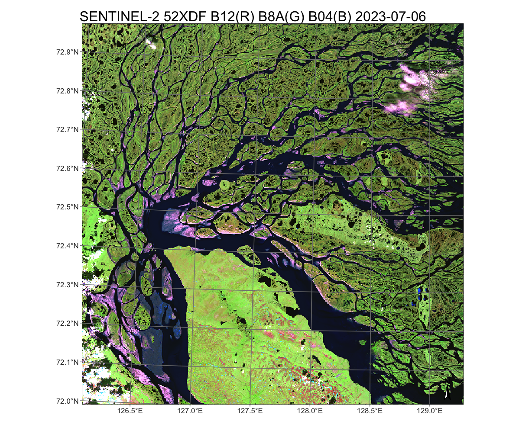
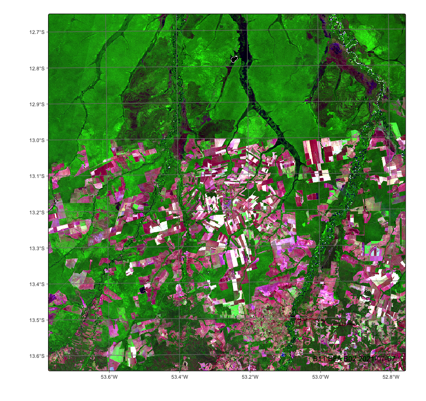
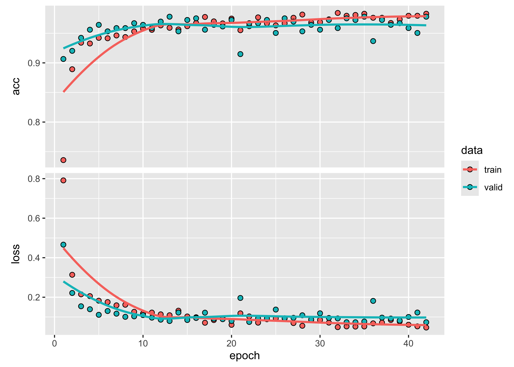
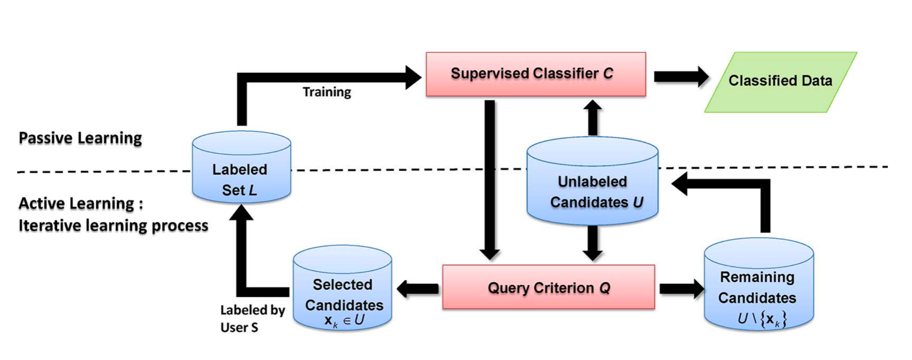

--- 
title: '**sits**: Satellite Image Time Series Analysis 
    on Earth Observation Data Cubes'
author:
- Gilberto Camara
- Rolf Simoes
- Felipe Souza
- Felipe Menino
- Charlotte Pelletier
- Pedro R. Andrade
- Karine Ferreira
- Gilberto Queiroz
date: "2024-08-23"
output:
  html_document: 
    df_print: tibble
    theme:
        base_font:
          google: "IBM Plex Serif"
        code_font:
          google: "IBM Plex Mono"
  pdf_document: 
    latex_engine: xelatex
    toc: true
    toc_depth: 2 
    df_print: tibble
documentclass: report
link-citations: yes
colorlinks: yes
lot: yes
lof: yes
always_allow_html: true
fontsize: 10,5pt
site: bookdown::bookdown_site
cover-image: images/cover_sits_book.png
bibliography: e-sensing.bib
biblio-style: apalike
csl: ieee.csl
indent: true
description: |
  This book presents  **sits**, an open-source R package for satellite image time series analysis. The package supports the application of machine learning techniques for classifying image time series obtained from Earth observation data cubes.
---


```
## SITS - satellite image time series analysis.
```

```
## Loaded sits v1.5.2.
##         See ?sits for help, citation("sits") for use in publication.
##         Documentation avaliable in https://e-sensing.github.io/sitsbook/.
```

```
## Loaded sitsdata data sets v1.2. Use citation("sitsdata") for use in publication.
```

```
## Loading required package: proxy
```

```
## 
## Attaching package: 'proxy'
```

```
## The following objects are masked from 'package:stats':
## 
##     as.dist, dist
```

```
## The following object is masked from 'package:base':
## 
##     as.matrix
```

```
## Loading required package: dtw
```

```
## Loaded dtw v1.23-1. See ?dtw for help, citation("dtw") for use in publication.
```

```
## dtwclust:
## Setting random number generator to L'Ecuyer-CMRG (see RNGkind()).
## To read the included vignettes type: browseVignettes("dtwclust").
## See news(package = "dtwclust") after package updates.
```


# Preface {-}

<a href="https://github.com/e-sensing/sitsbook"></a>

Petabytes of Earth observation (EO) data are now open, making the full extent of image archives available. Users can extract satellite image time series from these big EO data sets, covering the same areas at different times. These time series can range from days to decades. They are a powerful tool for observing the Earth's surface and its changes over time, enabling insights and analysis that would be difficult or impossible to achieve with single snapshots. Using image time series, analysts make best use of big Earth observation data collections, capturing subtle changes in ecosystem health and condition and improving the distinction between different land classes.

Satellite image time series provide an unparalleled view of the Earth’s surface, offering users accurate ways to measure environmental changes, including deforestation, forest degradation, and desertification. They are also crucial in monitoring agricultural production and showing harvesting times. Organizing big EO data in data cubes that support time series is the most effective approach to address global challenges like climate change, natural resource depletion, and urban expansion.

This book introduces `sits`, an open-source **R** package of big Earth observation data analysis using satellite image time series. Users build regular data cubes from cloud services such as Amazon Web Services, Microsoft Planetary Computer, Copernicus Data Space Ecosystem, NASA Harmonized Landsat-Sentinel, Brazil Data Cube, Swiss Data Cube, Digital Earth Australia, and Digital Earth Africa. The `sits` API includes training sample quality measures, machine learning and deep learning classification algorithms, and Bayesian post-processing methods for smoothing and uncertainty assessment. To evaluate results, `sits` supports best practice accuracy assessments.

## How much R knowledge is required?{-}

The `sits` package is designed for remote sensing experts in the Earth Sciences field who want to use advanced data analysis techniques without a lot of programming knowledge. The package provides a clear and direct set of functions that are easy to learn and master. Users with a minimal background in R programming can start using `sits` right away. Those familiar with Python or JavaScript may consider lack of **R** knowledge as a barrier to use `sits.` Fear not. Those unfamiliar with **R** can rely on their programming knowledge since **R** scripts in `sits` are easy to follow. Users only need a basic understanding of core concepts of how functions work, which is also required for Python or JavaScript. A minimal investment will be rewarded with access to a package with no equivalents in other programming languages.

To quickly master what is needed to run `sits`, please read Parts 1 and 2 of Garrett Golemund's book, [Hands-On Programming with R](https://rstudio-education.github.io/hopr/). Although not needed to run `sits`, your **R** skills will benefit from the book by Hadley Wickham and Gareth Golemund, [R for Data Science (2nd edition)](https://r4ds.hadley.nz/). Important concepts of spatial analysis are presented by Edzer Pebesma and Roger Bivand in their book [Spatial Data Science](https://r-spatial.org/book/).

## Software version described in this book{-}

The version of the `sits` package described in this book is 1.5.1.

## Main reference for `sits` {-}

If you use `sits` in your work, please cite the following paper: 

Rolf Simoes, Gilberto Camara, Gilberto Queiroz, Felipe Souza, Pedro R. Andrade,  Lorena Santos, Alexandre Carvalho, and Karine Ferreira. [Satellite Image Time Series Analysis for Big Earth Observation Data]([https://doi.org/10.3390/rs13132428). Remote Sensing, 13, p. 2428, 2021.

## Intellectual property rights {-}

This book is licensed as [Attribution-NonCommercial-ShareAlike 4.0 International (CC BY-NC-SA 4.0)](https://creativecommons.org/licenses/by-nc-sa/4.0/) by Creative Commons. The `sits` package is licensed under the GNU General Public License, version 3.0. 

<!--chapter:end:index.Rmd-->

# Setup {.unnumbered}

## How to use this on-line book {.unnumbered}

This book contains reproducible code that can be run on an R environment. There are three options to setup your working environment:

1. Install R and RStudio and the packages required by `sits`, with specific procedures for each type of operating systems.
2. Use a Docker image provided by the Brazil Data Cube.
3. Install `sits` and all its dependencies using `conda`. 

## How to install sits using R and RStudio {.unnumbered}

We suggest a staged installation, as follows:

1. Get and install base R from [CRAN](https://cran.r-project.org/).
2. Install RStudio from the [Posit website](https://posit.co/).


### Installing `sits` from CRAN {.unnumbered}

The Comprehensive R Archive Network (CRAN), a network of servers (also known as mirrors) from around the world that store up-to-date versions of basic code and packages for R. In what follows, we describe how to use CRAN to `sits` on Windows, Linux and MacOS. 

### Installing in Microsoft Windows and MacOS environments{.unnumbered}

Windows and MacOS users are strongly encouraged to install binary packages from CRAN. The `sits` package relies on the `sf` and `terra` packages, which require the GDAL and PROJ libraries. Run RStudio and install binary packages `sf` and `terra`, in this order:


``` r
install.packages("sf")
install.packages("terra")
```

After installing the binaries for `sf` and `terra`, install `sits` as follows;


``` r
install.packages("sits", dependencies = TRUE)
```

To run the examples in the book, please also install `sitsdata` package, which is available from GitHub. It is necessary to use package `devtools` to install `sitsdata`.


``` r
install.packages("devtools")
devtools::install_github("e-sensing/sitsdata")
```

 To install `sits` from source, please install [Rtools](https://cran.r-project.org/bin/windows/Rtools/) for Windows to have access to the compiling environment. For Mac, please follow the instructions available [here](https://mac.r-project.org/tools/).

### Installing in Ubuntu environments{.unnumbered}

For Ubuntu, the first step should be to install the latest version of the GDAL, GEOS, and PROJ4 libraries and binaries. To do so, use the repository `ubuntugis-unstable`, which should be done as follows:

``` sh
sudo add-apt-repository ppa:ubuntugis/ubuntugis-unstable
sudo apt-get update
sudo apt-get install libudunits2-dev libgdal-dev libgeos-dev libproj-dev 
sudo apt-get install gdal-bin
sudo apt-get install proj-bin
```
Getting an error while adding this PPA repository could be due to the absence of the package `software-properties-common`. After installing GDAL, GEOS, and PROJ4, please install packages `sf` and `terra`:


``` r
install.packages("sf")
install.packages("terra")
```

Then please proceed to install `sits`, which can be installed as a regular **R** package.


``` r
install.packages("sits", dependencies = TRUE)
```

### Installing in Debian environments{.unnumbered}

For Debian,  use the [rocker geospatial](https://github.com/rocker-org/geospatial) dockerfiles. 

### Installing in Fedora environments {.unnumbered}

In the case of Fedora, the following command installs all required dependencies:


``` sh
sudo dnf install gdal-devel proj-devel geos-devel sqlite-devel udunits2-devel
```

## Using Docker images {.unnumbered}

If you are familiar with Docker, there are images for `sits` available with RStudio or Jupyter notebook. Such images are provided by the Brazil Data Cube team:

- [Version for R and RStudio](https://hub.docker.com/r/brazildatacube/sits-rstudio).
- [Version for Jupyter Notebooks](https://hub.docker.com/r/brazildatacube/sits-jupyter).

On a Windows or Mac platform, install [Docker](https://docs.docker.com/desktop/install/windows-install/) and then obtain one of the two images listed above from the Brazil Data Cube. Both images contain the full `sits` running environment. When GDAL is running in `docker` containers, please add the security flag `--security-opt seccomp=unconfined` on start. 

## Install `sits` from CONDA {.unnumbered}

Conda is an open-source, cross-platform package manager. It is a convenient way to installl Python and R packages. To use `conda`, first download the software from the [CONDA website](https://conda.io/projects/conda/en/latest/index.html). After installation, use `conda` to install sits from the terminal as follows:


``` bash
# add conda-forge to the download channels 
conda config --add channels conda-forge
conda config --set channel_priority strict
# install sits using conda
conda install conda-forge::r-sits
```

The conda installer will download all packages and libraries required to run `sits`. This is the easiest way to install `sits` on Windows. 


## Accessing the development version {.unnumbered}

The source code repository of `sits` is on [GitHub](https://github.com/e-sensing/sits). There are two versions available on GitHub: `master` and `dev`. The `master` contains the current stable version, which is either the same code available in CRAN or a minor update with bug fixes. To install the `master` version, install `devtools` (if not already available) and do as follows: 


``` r
install.packages("devtools")
devtools::install_github("e-sensing/sits", dependencies = TRUE)
```

To install the `dev` (development) version, which contains the latest updates but might be unstable, install `devtools` (if not already available), and then install `sits` as follows:


``` r
install.packages("devtools")
devtools::install_github("e-sensing/sits@dev", dependencies = TRUE)
```

## Additional requirements {.unnumbered}

To run the examples in the book, please also install the `sitsdata` package. We recommend installing it using `wget`. See instructions in the [GNU Wget site](https://www.gnu.org/software/wget/). 


``` r
options(download.file.method = "wget")
devtools::install_github("e-sensing/sitsdata")
```

## Using GPUs with `sits` {.unnumbered}

The `torch` package automatically recognizes if a GPU is available on the machine and uses it for training and classification. There is a significant performance gain when GPUs are used instead of CPUs for deep learning models. There is no need for specific adjustments to `torch` scripts.  To use GPUs, `torch` requires version 11.6 of the CUDA library, which is available for Ubuntu 18.04 and 20.04. Please follow the detailed instructions for setting up `torch` available [here](https://torch.mlverse.org/docs/articles/installation.html).


``` r
install.packages("torch")
```

<!--chapter:end:01-setup.Rmd-->

# Acknowledgements {-}

## Funding Sources {-}

The authors acknowledge the funders that supported the development of `sits`:

- Amazon Fund, established by Brazil with financial contribution from Norway, through contract 17.2.0536.1. between the Brazilian Development Bank (BNDES) and the Foundation for Science, Technology, and Space Applications (FUNCATE), for the establishment of the Brazil Data Cube.

- Coordenação de Aperfeiçoamento de Pessoal de Nível Superior-Brasil (CAPES) and Conselho Nacional de Desenvolvimento Científico e Tecnológico (CNPq) for grants 312151/2014-4 and 140684/2016-6. 

- Sao Paulo Research Foundation (FAPESP) under eScience Program grant 2014/08398-6, for providing MSc, PhD, and post-doc scholarships, equipment, and travel support.  

- International Climate Initiative of the Germany Federal Ministry for the Environment, Nature Conservation, Building and Nuclear Safety (IKI) under grant 17-III-084-Global-A-RESTORE+ (“RESTORE+: Addressing Landscape Restoration on Degraded Land in Indonesia and Brazil”). 

- Microsoft Planetary Computer initiative under the GEO-Microsoft Cloud Computer Grants Programme. 

- Instituto Clima e Sociedade, under the project grant "Modernization of PRODES and DETER Amazon monitoring systems". 

- Open-Earth-Monitor Cyberinfrastructure project, which has received funding from the European Union’s Horizon Europe research and innovation programme under grant agreement No. 101059548.

- FAO-EOSTAT initiative, which uses next generation Earth observation tools to produce land cover and land use statistics.


## Community Contributions {-}

The authors thank the R-spatial community for their foundational work, including Marius Appel, Tim Appelhans, Robert Hijmans, Jakub Nowosad, Edzer Pebesma, and Martijn Tennekes for their R packages `gdalcubes`,  `leafem`, `terra`, `supercells`, `sf`/`stars`, and `tmap`. We are grateful for the work of Dirk Eddelbuettel on `Rcpp` and `RcppArmadillo` and Ron Wehrens in package `kohonen`. We are much indebted to Hadley Wickham for the `tidyverse`, Daniel Falbel for the `torch` and `luz` packages, and the RStudio team for package `leaflet`. The multiple authors of machine learning packages `randomForest`, `e1071`, and `xgboost` provided robust algorithms. We would like to thank Python developers who shared their deep learning algorithms for image time series classification: Vivien Sainte Fare Garnot, Zhiguang Wang, Maja Schneider, and Marc Rußwurm. The first author also thanks Roger Bivand for his benign influence in all things related to **R**.  

## Reproducible papers and books used in building `sits` {-}

We thank the authors of the following papers for making their code and papers open and reusable. Their contribution has been essential to build `sits`.  

- Edzer Pebesma, [Simple Features for R: Standardized Support for Spatial Vector Data](https://journal.r-project.org/archive/2018/RJ-2018-009/RJ-2018-009.pdf). R Journal, 10(1), 2018.

- Martin Tennekes, [tmap: Thematic Maps in R](https://www.jstatsoft.org/article/view/v084i06). Journal of Statistical Software, 84(6), 1–39, 2018.

- Ron Wehrens and Johannes Kruisselbrink, [Flexible Self-Organising Maps in kohonen 3.0](https://doi.org/10.18637/jss.v087.i07). Journal of Statistical Software, 87, 7, 2018.

- Hassan Fawaz, Germain Forestier, Jonathan Weber, Lhassane Idoumghar,  and Pierre-Alain Muller, [Deep learning for time series classification: a review](https://doi.org/10.1007/s10618-019-00619-1). Data Mining and Knowledge Discovery, 33(4): 917--963, 2019.

- Charlotte Pelletier, Geoffrey Webb, and Francois Petitjean. [Temporal Convolutional Neural Network for the Classification of Satellite Image Time Series](https://doi.org/10.3390/rs11050523). Remote Sensing 11 (5), 2019.

- Marc Rußwurm, Charlotte Pelletier, Maximilian Zollner, Sèbastien Lefèvre, and Marco Körner, [Breizhcrops: a Time Series Dataset for Crop Type Mapping](https://doi.org/10.5194/isprs-archives-XLIII-B2-2020-1545-2020). International Archives of the Photogrammetry, Remote Sensing and Spatial Information Sciences ISPRS, 2020. 

- Marius Appel and Edzer Pebesma, [On-Demand Processing of Data Cubes from Satellite Image Collections with the Gdalcubes Library](https://doi.org/10.3390/data4030092). Data 4 (3): 1--16, 2020.

- Vivien Garnot, Loic Landrieu, Sebastien Giordano, and Nesrine Chehata, [Satellite Image Time Series Classification with Pixel-Set Encoders and Temporal Self-Attention](https://doi.org/10.1109/CVPR42600.2020.01234), Conference on Computer Vision and Pattern Recognition, 2020.

- Vivien Garnot  and Loic Landrieu, [Lightweight Temporal Self-Attention  for Classifying Satellite Images Time Series](https://arxiv.org/pdf/2007.00586), 2020.

- Maja Schneider, Marco Körner, [Re: Satellite Image Time Series Classification with Pixel-Set Encoders and Temporal Self-Attention](https://doi.org/10.5281/zenodo.4835356) ReScience C 7 (2), 2021.

- Rolf Simoes, Felipe Souza, Mateus Zaglia, Gilberto Queiroz, Rafael dos Santos and Karine Ferreira, [Rstac: An R Package to Access Spatiotemporal Asset Catalog Satellite Imagery](http://www.brazildatacube.org/en/rstac-an-r-package-to-access-spatiotemporal-asset-catalog-satellite-imagery-2/). IGARSS, 2021, pp. 7674-7677.

- Jakub Nowosad, Tomasz Stepinksi, [Extended SLIC superpixels algorithm for applications to non-imagery geospatial rasters](https://doi.org/10.1016/j.jag.2022.102935). International Journal of Applied Earth Observations and Geoinformation, 2022.

- Sigrid Keydana, [Deep Learning and Scientific Computing with R torch](https://skeydan.github.io/Deep-Learning-and-Scientific-Computing-with-R-torch/), Chapman and Hall/CRC, London, 2023.

- Robin Lovelace, Jakub Nowosad, Jannes Münchow, [Geocomputation with R](https://r.geocompx.org/). Chapman and Hall/CRC, London, 2023.

- Edzer Pebesma, Roger Bivand, [Spatial Data Science: With applications in R](https://r-spatial.org/book/). Chapman and Hall/CRC, London, 2023.

## Publications using `sits` {-}

This section gathers the publications that have used `sits` to generate their results.

**2024**

- Giuliani, Gregory. [Time-First Approach for Land Cover Mapping Using Big Earth Observation Data Time-Series in a Data Cube – a Case Study from the Lake Geneva Region (Switzerland)](https://doi.org/10.1080/20964471.2024.2323241). Big Earth Data, 2024. 

- Werner, João, Mariana Belgiu et al., [Mapping Integrated Crop–Livestock Systems Using Fused Sentinel-2 and PlanetScope Time Series and Deep Learning](https://doi.org/10.3390/rs16081421). Remote Sensing 16, no. 8 (January 2024): 1421. 

**2023**

- Hadi, Firman, Laode Muhammad Sabri, Yudo Prasetyo, and Bambang Sudarsono. [Leveraging Time-Series Imageries and Open Source Tools for Enhanced Land Cover Classification](https://doi.org/10.1088/1755-1315/1276/1/012035). In IOP Conference Series: Earth and Environmental Science, 1276:012035. IOP Publishing, 2023. 

- Bruno Adorno, Thales Körting, and Silvana Amaral, [Contribution of time-series data cubes to classify urban vegetation types by remote sensing](https://doi.org/10.1016/j.ufug.2022.127817). Urban Forest & Urban Greening, 79, 127817, 2023.

**2021**

- Lorena Santos, Karine R. Ferreira, Gilberto Camara, Michelle Picoli, and Rolf Simoes, [Quality control and class noise reduction of satellite image time series](https://doi.org/10.1016/j.isprsjprs.2021.04.014). ISPRS Journal of Photogrammetry and Remote Sensing, 177, 75--88, 2021.

- Lorena Santos, Karine Ferreira, Michelle Picoli, Gilberto Camara, Raul Zurita-Milla and Ellen-Wien Augustijn, [Identifying Spatiotemporal Patterns in Land Use and Cover Samples from Satellite Image Time Series](https://doi.org/10.3390/rs13050974). Remote Sensing, 13(5), 974, 2021.


**2020**

- Rolf Simoes, Michelle Picoli, Gilberto Camara, Adeline Maciel, Lorena Santos, Pedro Andrade, Alber Sánchez, Karine Ferreira, and Alexandre Carvalho, [Land use and cover maps for Mato Grosso State in Brazil from 2001 to 2017](https://doi.org/10.1038/s41597-020-0371-4). Nature Scientific Data, 7, article 34, 2020.

- Michelle Picoli, Ana Rorato, Pedro Leitão, Gilberto Camara, Adeline Maciel, Patrick Hostert, and Ieda Sanches, [Impacts of Public and Private Sector Policies on Soybean and Pasture Expansion in Mato Grosso—Brazil from 2001 to 2017](https://doi.org/10.3390/land9010020). Land, 9(1), 2020. 

- Karine Ferreira, Gilberto Queiroz et al., [Earth Observation Data Cubes for Brazil: Requirements, Methodology and Products](https://doi.org/10.3390/rs12244033). Remote Sensing, 12, 4033, 2020.

- Adeline Maciel, Lubia Vinhas, Michelle Picoli, and Gilberto Camara, [Identifying Land Use Change Trajectories in Brazil’s Agricultural Frontier](https://doi.org/10.3390/land9120506). Land, 9, 506, 2020.

**2018**

- Michelle Picoli, Gilberto Camara, et al.,  [Big Earth Observation Time Series Analysis for Monitoring Brazilian Agriculture](https://doi.org/10.1016/j.isprsjprs.2018.08.007). ISPRS Journal of Photogrammetry and Remote Sensing, 145, 328--339, 2018.

## AI support in preparing the book {-}

The authors have use Generative AI tools (Chat-GPT, Grammarly and ProWritingAid) to improve readability and language of the work. The core technical and scientific content of the book has been prepared exclusively by the authors. Assistance from Generative AI has been limited to improving definitions and making the text easier to follow.

<!--chapter:end:02-acknowledgements.Rmd-->

# Introduction{-}


<a href="https://www.kaggle.com/esensing/introduction-to-sits" target="_blank"></a>


## Who is this book for?{-}

This book, tailored for land use change experts and researchers, is a practical guide that enables them to analyze big Earth observation data sets. It provides readers with the means of producing high-quality maps of land use and land cover, guiding them through all the steps to achieve good results. Given the natural world's complexity and huge variations in human-nature interactions, only local experts who know their countries and ecosystems can extract full information from big EO data. 

One group of readers that we are keen to engage with is the national authorities on forest, agriculture, and statistics in developing countries. We aim to foster a collaborative environment where they can use EO data to enhance their national land use and cover estimates, supporting sustainable development policies.  To achieve this goal, `sits` has strong backing from the FAO Expert Group on the Use of Earth Observation data (FAO-EOSTAT)[https://www.fao.org/in-action/eostat]. FAO-EOSTAT is at the forefront of using advanced EO data analysis methods for agricultural statistics in developing countries [@DeSimone2022][@DeSimone2022a].

## Why work with satellite image time series?{-}

Satellite imagery provides the most extensive data on our environment. By encompassing vast areas of the Earth's surface, images enable researchers to analyze local and worldwide transformations. By observing the same location multiple times, satellites provide data on environmental changes and survey areas that are difficult to observe from the ground. Given its unique features, images offer essential information for many applications, including deforestation, crop production, food security, urban footprints, water scarcity, and land degradation. Using time series, experts improve their understanding of ecological patterns and processes. Instead of selecting individual images from specific dates and comparing them, researchers track change continuously [@Woodcock2020]. 

## Time-first, space-later{-}

"Time-first, space-later" is a concept in satellite image classification that takes time series analysis as the first step for analyzing remote sensing data, with spatial information being considered after all time series are classified. The *time-first* part brings a better understanding of changes in landscapes. Detecting and tracking seasonal and long-term trends becomes feasible, as well as identifying anomalous events or patterns in the data, such as wildfires, floods, or droughts. Each pixel in a data cube is treated as a time series, using information available in the temporal instances of the case. Time series classification is pixel-based, producing a set of labeled pixels. This result is then used as input to the *space-later* part of the method. In this phase, a smoothing algorithm improves the results of time-first classification by considering the spatial neighborhood of each pixel. The resulting map thus combines both spatial and temporal information.

## Land use and land cover{-}

The UN Food and Agriculture Organization defines land cover as "the observed biophysical cover on the Earth's surface" [@DiGregorio2016]. Land cover can be observed and mapped directly through remote sensing images. In FAO's guidelines and reports, land use is described as "the human activities or purposes for which land is managed or exploited". Although *land cover* and *land use* denote different approaches for describing the Earth's landscape, in practice there is considerable overlap between these concepts [@Comber2008b]. When classifying remote sensing images, natural areas are classified using land cover types (e.g, forest), while human-modified areas are described with land use classes (e.g., pasture). 

One of the advantages of using image time series for land classification is its capacity of measuring changes in the landscape related to agricultural practices. For example, the time series of a vegetation index in an area of crop production will show a pattern of minima (planting and sowing stages) and maxima (flowering stage). Thus, classification schemas based on image time series data can be richer and more detailed than those associated only with land cover. In what follows, we use the term "land classification" to refer to image classification representing both land cover and land use classes.

## How `sits` works {.unnumbered}

The `sits` package uses satellite image time series for land classification, using  a *time-first, space-later* approach. In the data preparation part, collections of big Earth observation images are organized as data cubes. Each spatial location of a data cube is associated with a time series. Locations with known labels train a machine learning algorithm, which classifies all time series of a data cube, as shown in Figure \@ref(fig:gview).

<div class="figure" style="text-align: center">

<p class="caption">(\#fig:gview)Using time series for land classification (source: authors).</p>
</div>

The package provides tools for analysis, visualization, and classification of satellite image time series. Users follow a typical workflow for a pixel-based classification:

1.  Select an analysis-ready data image collection from a cloud provider such as AWS, Microsoft Planetary Computer, Digital Earth Africa, or Brazil Data Cube.
2.  Build a regular data cube using the chosen image collection.
3.  Obtain new bands and indices with operations on data cubes.
4.  Extract time series samples from the data cube to be used as training data.
5.  Perform quality control and filtering on the time series samples.
6.  Train a machine learning model using the time series samples.
7.  Classify the data cube using the model to get class probabilities for each pixel.
8.  Post-process the probability cube to remove outliers.
9.  Produce a labeled map from the post-processed probability cube.
10. Evaluate the accuracy of the classification using best practices.

Each workflow step corresponds to a function of the `sits` API, as shown in the Table below and Figure \@ref(fig:api). These functions have convenient default parameters and behaviors. A single function builds machine learning (ML) models. The classification function processes big data cubes with efficient parallel processing. Since the `sits` API is simple to learn, achieving good results do not require in-depth knowledge about machine learning and parallel processing.


<table class="table" style="font-size: 14px; margin-left: auto; margin-right: auto;">
<caption style="font-size: initial !important;">(\#tab:unnamed-chunk-2)The sits API workflow for land classification.</caption>
 <thead>
  <tr>
   <th style="text-align:left;"> API_function </th>
   <th style="text-align:left;"> Inputs </th>
   <th style="text-align:left;"> Output </th>
  </tr>
 </thead>
<tbody>
  <tr>
   <td style="text-align:left;font-family: monospace;color: RawSienna !important;"> sits_cube() </td>
   <td style="text-align:left;"> ARD image collection </td>
   <td style="text-align:left;"> Irregular data cube </td>
  </tr>
  <tr>
   <td style="text-align:left;font-family: monospace;color: RawSienna !important;"> sits_regularize() </td>
   <td style="text-align:left;"> Irregular data cube </td>
   <td style="text-align:left;"> Regular data cube </td>
  </tr>
  <tr>
   <td style="text-align:left;font-family: monospace;color: RawSienna !important;"> sits_apply() </td>
   <td style="text-align:left;"> Regular data cube </td>
   <td style="text-align:left;"> Regular data cube with new bands and indices </td>
  </tr>
  <tr>
   <td style="text-align:left;font-family: monospace;color: RawSienna !important;"> sits_get_data() </td>
   <td style="text-align:left;"> Data cube and sample locations </td>
   <td style="text-align:left;"> Time series </td>
  </tr>
  <tr>
   <td style="text-align:left;font-family: monospace;color: RawSienna !important;"> sits_train() </td>
   <td style="text-align:left;"> Time series and ML method </td>
   <td style="text-align:left;"> ML classification model </td>
  </tr>
  <tr>
   <td style="text-align:left;font-family: monospace;color: RawSienna !important;"> sits_classify() </td>
   <td style="text-align:left;"> ML classification model and regular data cube </td>
   <td style="text-align:left;"> Probability cube </td>
  </tr>
  <tr>
   <td style="text-align:left;font-family: monospace;color: RawSienna !important;"> sits_smooth() </td>
   <td style="text-align:left;"> Probability cube </td>
   <td style="text-align:left;"> Post-processed probability cube </td>
  </tr>
  <tr>
   <td style="text-align:left;font-family: monospace;color: RawSienna !important;"> sits_uncertainty() </td>
   <td style="text-align:left;"> Post-processed probability cube </td>
   <td style="text-align:left;"> Uncertainty cube </td>
  </tr>
  <tr>
   <td style="text-align:left;font-family: monospace;color: RawSienna !important;"> sits_label_classification() </td>
   <td style="text-align:left;"> Post-processed probability cube </td>
   <td style="text-align:left;"> Classified map </td>
  </tr>
  <tr>
   <td style="text-align:left;font-family: monospace;color: RawSienna !important;"> sits_accuracy() </td>
   <td style="text-align:left;"> Classified map and validation samples </td>
   <td style="text-align:left;"> Accuracy assessment </td>
  </tr>
</tbody>
</table>


<div class="figure" style="text-align: center">

<p class="caption">(\#fig:api)Main functions of the sits API (source: authors).</p>
</div>

Additionally, experts can perform object-based image analysis (OBIA) with `sits`. In this case, before classifying the time series, one can use `sits_segments()` to create a set of closed polygons. These polygons are classified using a subset of the time series contained inside each segment. For details, see Chapter [Object-based time series image analysis](https://e-sensing.github.io/sitsbook/object-based-time-series-image-analysis.html).


## Creating a data cube {.unnumbered}

There are two kinds of data cubes in `sits`: (a) irregular data cubes generated by selecting image collections on cloud providers such as AWS and Planetary Computer; (b) regular data cubes with images fully covering a chosen area, where each image has the same spectral bands and spatial resolution, and images follow a set of adjacent and regular time intervals. Machine learning applications need regular data cubes. Please refer to Chapter [Earth observation data cubes](https://e-sensing.github.io/sitsbook/earth-observation-data-cubes.html) for further details.

The first steps in using `sits` are: (a) select an analysis-ready data image collection available in a cloud provider or stored locally using `sits_cube()`; (b) if the collection is not regular, use `sits_regularize()` to build a regular data cube.

This section shows how to build a data cube from local images already organized as a regular data cube. The data cube is composed of MODIS MOD13Q1 images for the region close to the city of Sinop in Mato Grosso, Brazil. This region is one of the world's largest producers of soybeans. All images have indexes NDVI and EVI covering a one-year period from 2013-09-14 to 2014-08-29 (we use "year-month-day" for dates). There are 23 time instances, each covering a 16-day period. This data is available in the package `sitsdata`.

To build a data cube from local files, users must provide information about the original source from which the data was obtained. In this case, `sits_cube()` needs the parameters:

(a) `source`, the cloud provider from where the data has been obtained (in this case, the Brazil Data Cube "BDC");
(b) `collection`, the collection of the cloud provider from where the images have been extracted. In this case, data comes from the MOD13Q1 collection 6; 
(c) `data_dir`, the local directory where the image files are stored; 
(d) `parse_info`, a vector of strings stating how file names store information on "tile", "band", and "date". In this case, local images are stored in files whose names are similar to `TERRA_MODIS_012010_EVI_2014-07-28.tif`. This file represents an image obtained by the MODIS sensor onboard the TERRA satellite, covering part of tile 012010 in the EVI band for date 2014-07-28.


``` r
# load package "tibble"
library(tibble)
# load packages "sits" and "sitsdata"
library(sits)
library(sitsdata)
# Create a data cube using local files
sinop_cube <- sits_cube(
  source = "BDC",
  collection = "MOD13Q1-6.1",
  bands = c("NDVI", "EVI"),
  data_dir = system.file("extdata/sinop", package = "sitsdata"),
  parse_info = c("satellite", "sensor", "tile", "band", "date")
)
# Plot the NDVI for the first date (2013-09-14)
plot(sinop_cube,
  band = "NDVI",
  dates = "2013-09-14",
  palette = "RdYlGn"
)
```

<div class="figure" style="text-align: center">

<p class="caption">(\#fig:introndvi)False color MODIS image for NDVI band in 2013-09-14 from sinop data cube (source: Brazil Data Cube).</p>
</div>

The aim of the `parse_info` parameter is to extract `tile`, `band`, and `date` information from the file name. Given the large variation in image file names generated by different produces, it includes designators such as `X1` and `X2`; these are place holders for parts of the file name that is not relevant to `sits_cube()`. 

The R object returned by `sits_cube()` contains the metadata describing the contents of the data cube. It includes data source and collection, satellite, sensor, tile in the collection, bounding box, projection, and list of files. Each file refers to one band of an image at one of the temporal instances of the cube.


``` r
# Show the description of the data cube
sinop_cube
```

```
#> # A tibble: 1 × 11
#>   source collection satellite sensor tile     xmin    xmax    ymin    ymax crs  
#>   <chr>  <chr>      <chr>     <chr>  <chr>   <dbl>   <dbl>   <dbl>   <dbl> <chr>
#> 1 BDC    MOD13Q1-6… TERRA     MODIS  0120… -6.18e6 -5.96e6 -1.35e6 -1.23e6 "PRO…
#> # ℹ 1 more variable: file_info <list>
```

The list of image files which make up the data cube is stored as a data frame in the column `file_info`. For each file, `sits` stores information about spectral band, reference date, size, spatial resolution, coordinate reference system, bounding box, path to file location and cloud cover information (when available). 


``` r
# Show information on the images files which are part of a data cube
sinop_cube$file_info[[1]]
```

```
#> # A tibble: 46 × 13
#>    fid   band  date       nrows ncols  xres  yres      xmin      ymin      xmax
#>    <chr> <chr> <date>     <dbl> <dbl> <dbl> <dbl>     <dbl>     <dbl>     <dbl>
#>  1 1     EVI   2013-09-14   551   944  232.  232. -6181982. -1353336. -5963298.
#>  2 1     NDVI  2013-09-14   551   944  232.  232. -6181982. -1353336. -5963298.
#>  3 2     EVI   2013-09-30   551   944  232.  232. -6181982. -1353336. -5963298.
#>  4 2     NDVI  2013-09-30   551   944  232.  232. -6181982. -1353336. -5963298.
#>  5 3     EVI   2013-10-16   551   944  232.  232. -6181982. -1353336. -5963298.
#>  6 3     NDVI  2013-10-16   551   944  232.  232. -6181982. -1353336. -5963298.
#>  7 4     EVI   2013-11-01   551   944  232.  232. -6181982. -1353336. -5963298.
#>  8 4     NDVI  2013-11-01   551   944  232.  232. -6181982. -1353336. -5963298.
#>  9 5     EVI   2013-11-17   551   944  232.  232. -6181982. -1353336. -5963298.
#> 10 5     NDVI  2013-11-17   551   944  232.  232. -6181982. -1353336. -5963298.
#> # ℹ 36 more rows
#> # ℹ 3 more variables: ymax <dbl>, crs <chr>, path <chr>
```

A key attribute of a data cube is its timeline, as shown below. The command `sits_timeline()` lists the temporal references associated to `sits` objects, including samples, data cubes and models. 


``` r
# Show the R object that describes the data cube
sits_timeline(sinop_cube)
```

```
#>  [1] "2013-09-14" "2013-09-30" "2013-10-16" "2013-11-01" "2013-11-17"
#>  [6] "2013-12-03" "2013-12-19" "2014-01-01" "2014-01-17" "2014-02-02"
#> [11] "2014-02-18" "2014-03-06" "2014-03-22" "2014-04-07" "2014-04-23"
#> [16] "2014-05-09" "2014-05-25" "2014-06-10" "2014-06-26" "2014-07-12"
#> [21] "2014-07-28" "2014-08-13" "2014-08-29"
```
The timeline of the `sinop_cube` data cube has 23 intervals with a temporal difference of 16 days. The chosen dates capture the agricultural calendar in Mato Grosso, Brazil. The agricultural year starts in September-October with the sowing of the summer crop (usually soybeans) which is harvested in February-March. Then the winter crop (mostly Corn, Cotton or Millet) is planted in March and harvested in June-July. For LULC classification, the training samples and the date cube should share a timeline with the same number of intervals and similar start and end dates.

## The time series tibble {-}

To handle time series information, `sits` uses a `tibble`. Tibbles are extensions of the `data.frame` tabular data structures provided by the `tidyverse` set of packages. The example below shows a tibble with 1,837 time series obtained from MODIS MOD13Q1 images. Each series has four attributes: two bands (NIR and MIR) and two indexes (NDVI and EVI). This dataset is available in package `sitsdata`.

The time series tibble contains data and metadata. The first six columns contain the metadata: spatial and temporal information, the label assigned to the sample, and the data cube from where the data has been extracted. The `time_series` column contains the time series data for each spatiotemporal location. This data is also organized as a tibble, with a column with the dates and the other columns with the values for each spectral band. 


``` r
# Load the MODIS samples for Mato Grosso from the "sitsdata" package
library(tibble)
library(sitsdata)
data("samples_matogrosso_mod13q1", package = "sitsdata")
samples_matogrosso_mod13q1
```

```
#> # A tibble: 1,837 × 7
#>    longitude latitude start_date end_date   label   cube     time_series      
#>        <dbl>    <dbl> <date>     <date>     <chr>   <chr>    <list>           
#>  1     -57.8    -9.76 2006-09-14 2007-08-29 Pasture bdc_cube <tibble [23 × 5]>
#>  2     -59.4    -9.31 2014-09-14 2015-08-29 Pasture bdc_cube <tibble [23 × 5]>
#>  3     -59.4    -9.31 2013-09-14 2014-08-29 Pasture bdc_cube <tibble [23 × 5]>
#>  4     -57.8    -9.76 2006-09-14 2007-08-29 Pasture bdc_cube <tibble [23 × 5]>
#>  5     -55.2   -10.8  2013-09-14 2014-08-29 Pasture bdc_cube <tibble [23 × 5]>
#>  6     -51.9   -13.4  2014-09-14 2015-08-29 Pasture bdc_cube <tibble [23 × 5]>
#>  7     -56.0   -10.1  2005-09-14 2006-08-29 Pasture bdc_cube <tibble [23 × 5]>
#>  8     -54.6   -10.4  2013-09-14 2014-08-29 Pasture bdc_cube <tibble [23 × 5]>
#>  9     -52.5   -11.0  2013-09-14 2014-08-29 Pasture bdc_cube <tibble [23 × 5]>
#> 10     -52.1   -14.0  2013-09-14 2014-08-29 Pasture bdc_cube <tibble [23 × 5]>
#> # ℹ 1,827 more rows
```

The timeline for all time series associated with the samples follows the same agricultural calendar, starting in September 14th and ending in August 28th. All samples contain 23 values, corresponding to the same temporal interval as those of the `sinop` data cube. Notice that that although the years for the samples are different, the samples for a given year follow the same agricultural calendar. 

The time series can be displayed by showing the `time_series` column.


``` r
# Load the time series for MODIS samples for Mato Grosso
samples_matogrosso_mod13q1[1, ]$time_series[[1]]
```

```
#> # A tibble: 23 × 5
#>    Index       NDVI   EVI   NIR    MIR
#>    <date>     <dbl> <dbl> <dbl>  <dbl>
#>  1 2006-09-14 0.500 0.263 0.230 0.139 
#>  2 2006-09-30 0.485 0.330 0.359 0.161 
#>  3 2006-10-16 0.716 0.397 0.264 0.0757
#>  4 2006-11-01 0.654 0.415 0.332 0.124 
#>  5 2006-11-17 0.591 0.433 0.400 0.172 
#>  6 2006-12-03 0.662 0.439 0.348 0.125 
#>  7 2006-12-19 0.734 0.444 0.295 0.0784
#>  8 2007-01-01 0.739 0.502 0.348 0.0887
#>  9 2007-01-17 0.768 0.526 0.351 0.0761
#> 10 2007-02-02 0.797 0.550 0.355 0.0634
#> # ℹ 13 more rows
```


The distribution of samples per class can be obtained using the `summary()` command. The classification schema uses nine labels, four associated to crops (`Soy_Corn`, `Soy_Cotton`, `Soy_Fallow`, `Soy_Millet`), two with natural vegetation (`Cerrado`, `Forest`) and one to `Pasture`.


``` r
# Load the MODIS samples for Mato Grosso from the "sitsdata" package
summary(samples_matogrosso_mod13q1)
```

```
#> # A tibble: 7 × 3
#>   label      count   prop
#>   <chr>      <int>  <dbl>
#> 1 Cerrado      379 0.206 
#> 2 Forest       131 0.0713
#> 3 Pasture      344 0.187 
#> 4 Soy_Corn     364 0.198 
#> 5 Soy_Cotton   352 0.192 
#> 6 Soy_Fallow    87 0.0474
#> 7 Soy_Millet   180 0.0980
```


It is helpful to plot the dispersion of the time series. In what follows, for brevity, we will filter only one label (`Forest`) and select one index (NDVI). Note that for filtering the label we use a function from `dplyr` package, while for selecting the index we use `sits_select()`. We use two different functions for selection because of they way metadata is stored in a samples files. The labels for the samples are listed in column `label` in the samples tibble, as shown above. In this case, one can use functions from the `dplyr` package to extract subsets. In particular, the function `dplyr::filter` retaining all rows that satisfy a given condition. In the above example, the result of `dplyr::filter` is the set of samples associated to the "Forest" label. The second selection involves obtaining only the values for the NDVI band. This operation requires access to the `time_series` column, which is stored as a list. In this case, selection with `dplyr::filter` will not work. To handle such cases, `sits` provides `sits_select()` to select subsets inside the `time_series` list. 


``` r
# select all samples with label "Forest"
samples_forest <- dplyr::filter(
  samples_matogrosso_mod13q1,
  label == "Forest"
)
# select the NDVI band for all samples with label "Forest"
samples_forest_ndvi <- sits_select(
  samples_forest,
  band = "NDVI"
)
plot(samples_forest_ndvi)
```

<div class="figure" style="text-align: center">

<p class="caption">(\#fig:timeseriesforest)Joint plot of all samples in band NDVI for label Forest (source: authors).</p>
</div>
  
The above figure shows all the time series associated with label `Forest` and band NDVI (in light blue), highlighting the median (shown in dark red) and the first and third quartiles (shown in brown). The spikes are noise caused by the presence of clouds.

## Training a machine learning model {.unnumbered}

The next step is to train a machine learning (ML) model using `sits_train()`. It takes two inputs, `samples` (a time series tibble) and `ml_method` (a function that implements a machine learning algorithm). The result is a model that is used for classification. Each ML algorithm requires specific parameters that are user-controllable. For novice users, `sits` provides default parameters that produce good results. Please see Chapter [Machine learning for data cubes](https://e-sensing.github.io/sitsbook/machine-learning-for-data-cubes.html) for more details.

Since the time series data has four attributes (EVI, NDVI, NIR, and MIR) and the data cube images have only two, we select the NDVI and EVI values and use the resulting data for training. To build the classification model, we use a random forest model called by `sits_rfor()`. Results from the random forest model can vary between different runs, due to the stochastic nature of the algorithm, For this reason, in the code fragment below, we set the seed of R's pseudo-random number generation explicitly to ensure the same results are produced for documentation purposes.


``` r
set.seed(03022024)
# Select the bands NDVI and EVI
samples_2bands <- sits_select(
  data = samples_matogrosso_mod13q1,
  bands = c("NDVI", "EVI")
)
# Train a random forest model
rf_model <- sits_train(
  samples = samples_2bands,
  ml_method = sits_rfor()
)
# Plot the most important variables of the model
plot(rf_model)
```

<div class="figure" style="text-align: center">

<p class="caption">(\#fig:rfintro)Most relevant variables of trained random forest model (source: authors).</p>
</div>


## Data cube classification {.unnumbered}

After training the machine learning model, the next step is to classify the data cube using `sits_classify()`. This function produces a set of raster probability maps, one for each class. For each of these maps, the value of a pixel is proportional to the probability that it belongs to the class. This function has two mandatory parameters: `data`, the data cube or time series tibble to be classified; and `ml_model`, the trained ML model. Optional parameters include: (a) `multicores`, number of cores to be used; (b) `memsize`, RAM used in the classification; (c) `output_dir`, the directory where the classified raster files will be written. Details of the classification process are available in "Image classification in data cubes".


``` r
# Classify the raster image
sinop_probs <- sits_classify(
  data = sinop_cube,
  ml_model = rf_model,
  multicores = 2,
  memsize = 8,
  output_dir = "./tempdir/chp3"
)
# Plot the probability cube for class Forest
plot(sinop_probs, labels = "Forest", palette = "BuGn")
```

<div class="figure" style="text-align: center">

<p class="caption">(\#fig:pbforintro)Probability map for class Forest (source: authors).</p>
</div>

After completing the classification, we plot the probability maps for class `Forest`. Probability maps are helpful to visualize the degree of confidence the classifier assigns to the labels for each pixel. They can be used to produce uncertainty information and support active learning, as described in Chapter [Image classification in data cubes](https://e-sensing.github.io/sitsbook/image-classification-in-data-cubes.html).

## Spatial smoothing {.unnumbered}

When working with big Earth observation data, there is much variability in each class. As a result, some pixels will be misclassified. These errors are more likely to occur in transition areas between classes. To address these problems, `sits_smooth()` takes a probability cube as input and  uses the class probabilities of each pixel's neighborhood to reduce labeling uncertainty. Plotting the smoothed probability map for class Forest shows that most outliers have been removed.


``` r
# Perform spatial smoothing
sinop_bayes <- sits_smooth(
  cube = sinop_probs,
  multicores = 2,
  memsize = 8,
  output_dir = "./tempdir/chp3"
)
plot(sinop_bayes, labels = "Forest", palette = "BuGn")
```

<div class="figure" style="text-align: center">

<p class="caption">(\#fig:byforintro)Smoothed probability map for class Forest (source: authors).</p>
</div>

## Labeling a probability data cube {.unnumbered}

After removing outliers using local smoothing, the final classification map can be obtained using `sits_label_classification()`. This function assigns each pixel to the class with the highest probability.


``` r
# Label the probability file
sinop_map <- sits_label_classification(
  cube = sinop_bayes,
  output_dir = "./tempdir/chp3"
)
plot(sinop_map)
```

<div class="figure" style="text-align: center">

<p class="caption">(\#fig:mapintro)Classification map for Sinop (source: authors).</p>
</div>

The resulting classification files can be read by QGIS. Links to the associated files are available in the `sinop_map` object in the nested table `file_info`.


``` r
# Show the location of the classification file
sinop_map$file_info[[1]]
```

```
#> # A tibble: 1 × 12
#>   band  start_date end_date   ncols nrows  xres  yres      xmin     xmax    ymin
#>   <chr> <date>     <date>     <dbl> <dbl> <dbl> <dbl>     <dbl>    <dbl>   <dbl>
#> 1 class 2013-09-14 2014-08-29   944   551  232.  232. -6181982.  -5.96e6 -1.35e6
#> # ℹ 2 more variables: ymax <dbl>, path <chr>
```


<!--chapter:end:03-intro.Rmd-->

# Earth observation data cubes{-}


<a href="https://www.kaggle.com/code/esensing/creating-data-cubes-in-sits" target="_blank"></a>

## Analysis-ready data(ARD){-}

Analysis Ready Data (CEOS-ARD) are satellite data that have been processed to meet the [ARD standards](https://ceos.org/ard/) defined by the Committee on Earth Observation Satellites (CEOS). ARD data simplify and accelerate the analysis of Earth observation data by providing consistent and high-quality data that are standardized across different sensors and platforms. 

ARD images processing includes geometric corrections, radiometric corrections, and sometimes atmospheric corrections. Images are georeferenced, meaning they are accurately aligned with a coordinate system. Optical ARD images include cloud and shadow masking information. These masks indicate which pixels affected by clouds or cloud shadows. For optical sensors, CEOS-ARD images have to be converted to surface reflectance values, which represent the fraction of light that is reflected by the surface. This makes the data more comparable across different times and locations.

For SAR images, CEOS-ARD specification require images to undergo Radiometric Terrain Correction (RTC) and are provided in the GammaNought ($\gamma_0$) backscatter values. This value which mitigates the variations from diverse observation geometries and is recommended for most land applications. 

ARD images are available from various satellite platforms, including Landsat, Sentinel, and commercial satellites. This provides a wide range of spatial, spectral, and temporal resolutions to suit different applications. They are organised as a collection of  files, where each pixel contains a single value for each spectral band for a given date. These collections are available in cloud services such as Brazil Data Cube, Digital Earth Africa, and Microsoft's Planetary Computer. In general, the timelines of the images of an ARD collection are different. Images still contain cloudy or missing pixels; bands for the images in the collection may have different resolutions. Figure \@ref(fig:ardt) shows an example of the Landsat ARD image collection. 

<div class="figure" style="text-align: center">

<p class="caption">(\#fig:ardt)ARD image collection (source: USGS. Reproduction based on fair use doctrine).</p>
</div>

ARD image collections are organized in spatial partitions. Sentinel-2/2A images follow the Military Grid Reference System (MGRS) tiling system, which divides the world into 60 UTM zones of 8 degrees of longitude. Each zone has blocks of 6 degrees of latitude. Blocks are split into tiles of 110 $\times$ 110 km$^2$ with a 10 km overlap. Figure \@ref(fig:mgrs) shows the MGRS tiling system for a part of the Northeastern coast of Brazil, contained in UTM zone 24, block M. 

<div class="figure" style="text-align: center">

<p class="caption">(\#fig:mgrs)MGRS tiling system used by Sentinel-2 images (source: US Army. Reproduction based on fair use doctrine).</p>
</div>

The Landsat-4/5/7/8/9 satellites use the Worldwide Reference System (WRS-2), which breaks the coverage of Landsat satellites into images identified by path and row (see Figure \@ref(fig:wrs)).  The path is the descending orbit of the satellite; the WRS-2 system has 233 paths per orbit, and each path has 119 rows, where each row refers to a latitudinal center line of a frame of imagery. Images in WRS-2 are geometrically corrected to the UTM projection.

<div class="figure" style="text-align: center">

<p class="caption">(\#fig:wrs)WRS-2 tiling system used by Landsat-5/7/8/9 images (source: INPE and ESRI. Reproduction based on fair use doctrine).</p>
</div>

## Image collections handled by sits{-}

In version 1.5.1,`sits` supports access to the following ARD image cloud providers:

-  Amazon Web Services (AWS): Open data Sentinel-2/2A level 2A collections for the Earth's land surface. 
-  Brazil Data Cube (BDC): Open data collections of Sentinel-2/2A, Landsat-8, CBERS-4/4A, and MOD13Q1 products for Brazil. These collections are organized as regular data cubes. 
- Copernicus Data Space Ecosystem (CDSE): Open data collections of Sentinel-1 RTC and Sentinel-2/2A images. 
- Digital Earth Africa (DEAFRICA): Open data collections of Sentinel-1 RTC, Sentinel-2/2A, Landsat-5/7/8/9 for Africa. Additional products available include ALOS_PALSAR mosaics, DEM_COP_30, NDVI_ANOMALY based on Landsat data, and monthly and daily rainfall data from CHIRPS. 
- Digital Earth Australia (DEAUSTRALIA): Open data ARD collections of Sentinel-2A/2B and Landsat-5/7/8/9 images; yearly geomedian of Landsat 5/7/8 images; yearly fractional land cover from 1986 to 2024. 
- Harmonized Landsat-Sentinel (HLS): HLS, provided by NASA, is an open data collection that processes Landsat 8 and Sentinel-2 imagery to a common standard.
- Microsoft Planetary Computer (MPC): Open data collections of Sentinel-1 GRD, Sentinel-2/2A,  Landsat-4/5/7/8/9 images for the Earth's land areas. Also supported are Copernicus DEM-30 and MOD13Q1, MOD10A1 and MOD09A1 products. Sentinel-1 RTC collections are accessible but require payment.
- Swiss Data Cube (SDC): Open data collection of Sentinel-2/2A and Landsat-8 images for Switzerland. 
- Terrascope: Cloud service with EO products which includes the ESA World Cover map.
- USGS: Landsat-4/5/7/8/9 collections available in AWS, which require access payment. 


In addition, `sits` supports the use of Planet monthly mosaics stored as local files. For a detailed description of the providers and collections supported by `sits`, please run `sits_list_collections()`.


## Regular image data cubes{-}

Machine learning and deep learning (ML/DL) classification algorithms require the input data to be consistent. The dimensionality of the data used for training the model has to be the same as that of the data to be classified. There should be no gaps and no missing values. Thus, to use ML/DL algorithms for remote sensing data, ARD image collections should be converted to regular data cubes. Adapting a previous definition by Appel and Pebesma [@Appel2019], we consider a *regular data cube*  has the following definition and properties:

1. A regular data cube is a four-dimensional data structure with dimensions x (longitude or easting), y (latitude or northing), time, and bands. The spatial, temporal, and attribute dimensions are independent and not interchangeable.
2. The spatial dimensions refer to a coordinate system, such as the grids defined by UTM (Universal Transverse Mercator) or MGRS (Military Grid Reference System). A grid (or tile) of the grid corresponds to a unique zone of the coordinate system. A data cube may span various tiles and UTM zones.
3. The temporal dimension is a set of continuous and equally-spaced intervals. 
4. For every combination of dimensions, a cell has a single value.

All cells of a data cube have the same spatiotemporal extent. The spatial resolution of each cell is the same in X and Y dimensions. All temporal intervals are the same. Each cell contains a valid set of measures. Each pixel is associated to a unique coordinate in a zone of the coordinate system.   For each position in space, the data cube should provide a set of valid time series. For each time interval, the regular data cube should provide a valid 2D image (see Figure \@ref(fig:dc)). 

<div class="figure" style="text-align: center">

<p class="caption">(\#fig:dc)Conceptual view of data cubes (source: authors).</p>
</div>

Currently, the only cloud service that provides regular data cubes by default is the Brazil Data Cube (BDC). ARD collections available in other cloud services are not regular in space and time. Bands may have different resolutions, images may not cover the entire time, and time intervals may be irregular. For this reason, subsets of these collections need to be converted to regular data cubes before further processing. To produce data cubes for machine-learning data analysis, users should first create an irregular data cube from an ARD collection and then use `sits_regularize()`, as described below.

## Creating data cubes{-}

<a href="https://www.kaggle.com/esensing/creating-data-cubes-in-sits" target="_blank"></a>

To obtain information on ARD image collection from cloud providers, `sits` uses the [SpatioTemporal Asset Catalogue](https://stacspec.org/en) (STAC) protocol, a specification of geospatial information which many large image collection providers have adopted. A 'spatiotemporal asset' is any file that represents information about the Earth captured in a specific space and time. To access STAC endpoints, `sits` uses the [rstac](http://github.com/brazil-data-cube/rstac) R package.

The function `sits_cube()` supports access to image collections in cloud services; it has the following parameters:

- `source`: Name of the provider. 
- `collection`: A collection available in the provider and supported by `sits`. To find out which collections are supported by `sits`, see `sits_list_collections()`. 
- `platform`: Optional parameter specifying the platform in collections with multiple satellites. 
- `tiles`: Set of tiles of image collection reference system. Either `tiles` or `roi` should be specified. 
-  `roi`: A region of interest. Either: (a) a named vector (`lon_min`, `lon_max`, `lat_min`, `lat_max`) in WGS 84 coordinates; or (b) an `sf` object.  All images intersecting the convex hull of the `roi` are selected. 
- `bands`: Optional parameter with the bands to be used. If missing, all bands from the collection are used.
- `orbit`: Optional parameter required only for Sentinel-1 images (default = "descending").
- `start_date`: The initial date for the temporal interval containing the time series of images.
- `end_date`: The final date for the temporal interval containing the time series of images.

The result of `sits_cube()` is a tibble with a description of the selected images required for further processing. It does not contain the actual data, but only pointers to the images.  The attributes of individual image files can be assessed by listing the `file_info` column of the tibble. 

## Amazon Web Services{-}

Amazon Web Services (AWS) holds two kinds of collections: *open-data* and *requester-pays*. Open data collections can be accessed without cost. Requester-pays collections require payment from an AWS account. Currently, `sits` supports collection `SENTINEL-2-L2A` which is open data.  The bands in 10 m resolution are B02, B03, B04, and B08. The  20 m bands are B05, B06, B07, B8A, B11, and B12. Bands B01 and B09 are available at 60 m resolution. A CLOUD band is also available. The example below shows how to access one tile of the open data `SENTINEL-2-L2A` collection.  The `tiles` parameter allows selecting the desired area according to the MGRS reference system. 


``` r
# Create a data cube covering an area in Brazil
s2_23MMU_cube <- sits_cube(
  source = "AWS",
  collection = "SENTINEL-2-L2A",
  tiles = "23MMU",
  bands = c("B02", "B8A", "B11", "CLOUD"),
  start_date = "2018-07-12",
  end_date = "2019-07-28"
)
plot(s2_23MMU_cube,
  red = "B11",
  blue = "B02",
  green = "B8A",
  date = "2018-10-05"
)
```

<div class="figure" style="text-align: center">

<p class="caption">(\#fig:aws)Sentinel-2 image in an area of the Northeastern coast of Brazil (&copy; EU Copernicus Sentinel Programme; source: AWS).</p>
</div>


## Microsoft Planetary Computer{-}

The `sits` supports access to three open data collection from Microsoft's Planetary Computer (MPC): `SENTINEL-1-GRD`, `SENTINEL-2-L2A`, `LANDSAT-C2-L2`. It also allows access to `COP-DEM-GLO-30` (Copernicus Global DEM at 30 meter resolution) and `MOD13Q1-6.1`(version 6.1 of the MODIS MOD13Q1 product). Access to the non-open data collection `SENTINEL-1-RTC` is available for users that have registration in MPC. 

### SENTINEL-2/2A images in MPC{-}

The SENTINEL-2/2A ARD images available in MPC have the same bands and resolutions as those available in AWS (see above). The example below shows how to access the `SENTINEL-2-L2A` collection. 


``` r
# Create a data cube covering an area in the Brazilian Amazon
s2_20LKP_cube_MPC <- sits_cube(
  source = "MPC",
  collection = "SENTINEL-2-L2A",
  tiles = "20LKP",
  bands = c("B02", "B8A", "B11", "CLOUD"),
  start_date = "2019-07-01",
  end_date = "2019-07-28"
)
# Plot a color composite of one date of the cube
plot(s2_20LKP_cube_MPC,
  red = "B11", blue = "B02", green = "B8A",
  date = "2019-07-18"
)
```

<div class="figure" style="text-align: center">

<p class="caption">(\#fig:mpc1)Sentinel-2 image in an area of the state of Rondonia, Brazil (&copy; EU Copernicus Sentinel Programme; source: Microsoft).</p>
</div>

### LANDSAT-C2-L2 images in MPC{-}

The `LANDSAT-C2-L2` collection provides access to data from Landsat-4/5/7/8/9 satellites. Images from these satellites have been intercalibrated to ensure data consistency. For compatibility between the different Landsat sensors, the band names are BLUE, GREEN, RED,  NIR08,  SWIR16, and SWIR22. All images have 30 m resolution. For this collection,  tile search is not supported; the `roi` parameter should be used. The example below shows how to retrieve data from a region of interest covering the city of Brasilia in Brazil. 


``` r
# Read a ROI that covers part of the Northeastern coast of Brazil
roi <- c(
  lon_min = -43.5526, lat_min = -2.9644,
  lon_max = -42.5124, lat_max = -2.1671
)
# Select the cube
s2_L8_cube_MPC <- sits_cube(
  source = "MPC",
  collection = "LANDSAT-C2-L2",
  bands = c("BLUE", "RED", "GREEN", "NIR08", "SWIR16", "CLOUD"),
  roi = roi,
  start_date = "2019-06-01",
  end_date = "2019-09-01"
)
# Plot the tile that covers the Lencois Maranhenses
plot(s2_L8_cube_MPC,
  red = "RED", green = "GREEN", blue = "BLUE",
  date = "2019-06-30"
)
```

<div class="figure" style="text-align: center">

<p class="caption">(\#fig:mpc2)Landsat-8 image in an area in Northeast Brazil (sources: USGS and Microsoft).</p>
</div>

### SENTINEL-1-GRD images in MPC{-}

Sentinel-1 GRD products consist of focused SAR data that has been detected, multi-looked and projected to ground range using the WGS84 Earth ellipsoid model. GRD images are subject for variations in the radar signal's intensity due to topographic effects, antenna pattern, range spreading loss, and other radiometric distortions. The most common types of distortions include foreshortening, layover and shadowing. 

Foreshortening occurs when the radar signal strikes a steep terrain slope facing the radar, causing the slope to appear compressed in the image. Features like mountains can appear much steeper than they are, and their true heights can be difficult to interpret. Layover happens when the radar signal reaches the top of a tall feature (like a mountain or building) before it reaches the base. As a result, the top of the feature is displaced towards the radar and appears in front of its base. This results in a reversal of the order of features along the radar line-of-sight, making the image interpretation challenging. Shadowing occurs when a radar signal is obstructed by a tall object, casting a shadow on the area behind it that the radar cannot illuminate. The shadowed areas appear dark in SAR images, and no information is available from these regions, similar to optical shadows.

Access to Sentinel-1 GRD images can be done either by MGRS tiles (`tiles`) or by region of interest (`roi`). We recommend using the MGRS tiling system for specifying the area of interest, since when these images are regularized, they will be re-projected into MGRS tiles. By default, only images in descending orbit are selected. 

The following example shows how to create a data cube of S1 GRD images over a region in Mato Grosso Brazil that is an area of the Amazon forest that has been deforested. The resulting cube will not follow any specific projection and its coordinates will be stated as EPSG 4326 (latitude/longitude). Its geometry is derived from the SAR slant-range perspective; thus, it will appear included in relation to the Earth's longitude. 


``` r
cube_s1_grd <- sits_cube(
  source = "MPC",
  collection = "SENTINEL-1-GRD",
  bands = c("VV"),
  orbit = "descending",
  tiles = c("21LUJ", "21LVJ"),
  start_date = "2021-08-01",
  end_date = "2021-09-30"
)
plot(cube_s1_grd, band = "VV", palette = "Greys")
```

<div class="figure" style="text-align: center">

<p class="caption">(\#fig:mpc3)Sentinel-1 image in an area in Mato Grosso, Brazil (&copy; EU Copernicus Sentinel Programme; source: Microsoft).</p>
</div>

As explained earlier in this chapter, in areas with areas with large elevation differences, Sentinel-1 GRD images will have geometric distortions. For this reason, whenever possible, we recommend the use of RTC (radiometrically terrain corrected) images as described in the next session. 


### SENTINEL-1-RTC images in MPC{-}

An RTC SAR image has undergone corrections for both geometric distortions and radiometric distortions caused by the terrain. The purpose of RTC processing is to enhance the interpretability and usability of SAR images for various applications by providing a more accurate representation of the Earth's surface. The radar backscatter values are normalized to account for these variations, ensuring that the image accurately represents the reflectivity of the surface features.

The terrain correction addresses geometric distortions caused by the side-looking geometry of SAR imaging, such as foreshortening, layover, and shadowing. It uses a Digital Elevation Model (DEM) to model the terrain and re-project the SAR image from the slant range (radar line-of-sight) to the ground range (true geographic coordinates). This process aligns the SAR image with the actual topography, providing a more accurate spatial representation.

In MPC, access to Sentinel-1-RTC images requires a Planetary Computer account. User will receive a  Shared Access Signature (SAS) Token from MPC that allows access to RTC data. Once a user receives a token from Microsoft, she needs to include the environment variable `MPC_TOKEN` in her `.Rprofile`. Therefore, the following example only works for users that have an SAS token.


``` r
cube_s1_rtc <- sits_cube(
  source = "MPC",
  collection = "SENTINEL-1-RTC",
  bands = c("VV", "VH"),
  orbit = "descending",
  tiles = "18NZM",
  start_date = "2021-08-01",
  end_date = "2021-09-30"
)
plot(cube_s1_rtc, band = "VV", palette = "Greys")
```

<div class="figure" style="text-align: center">

<p class="caption">(\#fig:mpcrtcol)Sentinel-1-RTC image of an area in Colombia (&copy; EU Copernicus Sentinel Programme; source: Microsoft).</p>
</div>


The above image is from the central region of Colombia, a country with large variations in altitude due to the Andes mountains. Users are invited to compare this images with the one from the `SENTINEL-1-GRD` collection and see the significant geometrical distortions of the GRD image compared with the RTC one.

### Copernicus DEM 30 meter images in MPC{-}

The Copernicus digital elevation model 30-meter global dataset (COP-DEM-GLO-30) is a high-resolution topographic data product provided by the European Space Agency (ESA) under the Copernicus Program. The vertical accuracy of the Copernicus DEM 30-meter dataset is typically within a few meters, but this can vary depending on the region and the original data sources. The primary data source for the Copernicus DEM is data from the TanDEM-X mission, designed by the German Aerospace Center (DLR). TanDEM-X provides high-resolution radar data through interferometric synthetic aperture radar (InSAR) techniques.

The Copernicus DEM 30 meter is organized in a 1$^\circ$ by 1$^\circ$ grid. In `sits`, access to COP-DEM-GLO-30 images can be done either by MGRS tiles (`tiles`) or by region of interest (`roi`). In both case, the cube is retrieved based on the parts of the grid that intersect the region of interest or the chosen tiles.


``` r
cube_dem_30 <- sits_cube(
  source = "MPC",
  collection = "COP-DEM-GLO-30",
  tiles = "20LMR",
  band = "ELEVATION"
)
plot(cube_dem_30, band = "ELEVATION", palette = "RdYlGn", rev = TRUE)
```


<div class="figure" style="text-align: center">

<p class="caption">(\#fig:mpc4)Copernicus 30-meter DEM of an area in Brazil (&copy; DLR e.V. 2010-2014 and &copy Airbus Defence and Space GmbH 2014-2018 provided under COPERNICUS by the European Union and ESA; source: Microsoft).</p>
</div>

## Brazil Data Cube{-}

The [Brazil Data Cube](http://brazildatacube.org/en) (BDC) is built by Brazil’s National Institute for Space Research (INPE), to provide regular EO data cubes from CBERS, LANDSAT, SENTINEL-2, and TERRA/MODIS satellites for environmental applications. The collections available in the BDC are: `LANDSAT-OLI-16D` (Landsat-8 OLI, 30 m resolution, 16-day intervals),  `SENTINEL-2-16D` (Sentinel-2A and 2B MSI images at 10 m resolution, 16-day intervals), `CBERS-WFI-16D` (CBERS 4 WFI, 64 m resolution, 16-day intervals), `CBERS-WFI-8D`(CBERS 4 and 4A WFI images, 64m resolution, 8-day intervals), and `MOD13Q1-6.1` (MODIS MOD13SQ1 product, collection 6, 250 m resolution, 16-day intervals). For more details, use `sits_list_collections(source = "BDC")`.

The BDC uses three hierarchical grids based on the Albers Equal Area projection and SIRGAS 2000 datum. The large grid has tiles of 4224.4 $\times4$ 224.4 km^2^ and is used for CBERS-4 AWFI collections at 64 m resolution; each CBERS-4 AWFI tile contains images of 6600 $\times$ 6600 pixels. The medium grid is used for Landsat-8 OLI collections at 30 m resolution; tiles have an extension of 211.2 $\times$ 211.2 km^2^, and each image has 7040 $\times$ 7040 pixels. The small grid covers 105.6 $\times$ 105.6 km^2^ and is used for Sentinel-2 MSI collections at 10 m resolutions; each image has 10560 $\times$ 10560 pixels. The data cubes in the BDC are regularly spaced in time and cloud-corrected [@Ferreira2020a]. 


<div class="figure" style="text-align: center">

<p class="caption">(\#fig:bdc)Hierarchical BDC tiling system showing (a) large BDC grid overlayed on Brazilian biomes, (b) one large tile, (c) four medium tiles, and (d) sixteen small tiles (Source: Ferreira et al. (2020). Reproduction under fair use doctrine).</p>
</div>

To access the BDC, users must provide their credentials using environment variables, as shown below. Obtaining a BDC access key is free. Users must register at the [BDC site](https://brazildatacube.dpi.inpe.br/portal/explore) to obtain a key. In the example below, the data cube is defined as one tile ("005004") of `CBERS-WFI-16D` collection, which holds CBERS AWFI images at 16 days resolution.


``` r
# Define a tile from the CBERS-4/4A AWFI collection
cbers_tile <- sits_cube(
  source = "BDC",
  collection = "CBERS-WFI-16D",
  tiles = "005004",
  bands = c("B13", "B14", "B15", "B16", "CLOUD"),
  start_date = "2021-05-01",
  end_date = "2021-09-01"
)
# Plot one time instance
plot(cbers_tile,
  red = "B15",
  green = "B16",
  blue = "B13",
  date = "2021-05-09"
)
```

<div class="figure" style="text-align: center">

<p class="caption">(\#fig:cbers)CBERS-4 WFI image in a Cerrado area in Brazil (&copy; INPE/Brazil licensed under CC-BY-SA. source: Brazil Data Cube).</p>
</div>


## Copernicus Data Space Ecosystem (CDSE){-}

The Copernicus Data Space Ecosystem (CDSE) is a cloud service designed to support access to Earth observation data from the Copernicus Sentinel missions and other sources. It is designed and maintained by the European Space Agency (ESA) with support from the European Commission. 

Configuring user access to CDSE involves several steps to ensure proper registration, access to data, and utilization of the platform's tools and services. Visit the Copernicus Data Space Ecosystem [registration page](https://dataspace.copernicus.eu). Complete the registration form with your details, including name, email address, organization, and sector. Confirm your email address through the verification link sent to your inbox.

After registration, you will need to obtain access credentials to the S3 service implemented by CDSE, which can be obtained using the [CSDE S3 credentials site](https://eodata-s3keysmanager.dataspace.copernicus.eu/panel/s3-credentials). The site will request you to add a new credential. You will receive two keys: an an S3 access key and a secret access key. Take note of both and include the following lines in your `.Rprofile`.


``` r
Sys.setenv(
    AWS_ACCESS_KEY_ID = "your access key",
    AWS_SECRET_ACCESS_KEY = "your secret access key"
	  AWS_S3_ENDPOINT = "eodata.dataspace.copernicus.eu",
	  AWS_VIRTUAL_HOSTING = "FALSE"
)
```

After including these lines in your .Rprofile, restart `R` for the changes to take effect. By following these steps, users will have access to the Copernicus Data Space Ecosystem. 

### SENTINEL-2/2A images in CDSE{-}

CDSE hosts a global collection of Sentinel-2 Level-2A images, which are processed according to the [CEOS Analysis-Ready Data](https://ceos.org/ard/) specifications. One example is provided below, where we present a Sentinel-2 image of the Lena river delta in Siberia in summertime.


``` r
# obtain a collection of images of a tile covering part of Lena delta
lena_cube <- sits_cube(
  source = "CDSE",
  collection = "SENTINEL-2-L2A",
  bands = c("B02", "B04", "B8A", "B11", "B12"),
  start_date = "2023-05-01",
  end_date = "2023-09-01",
  tiles = c("52XDF")
)
# plot an image from summertime
plot(lena_cube, date = "2023-07-06", red = "B12", green = "B8A", blue = "B04")
```

<div class="figure" style="text-align: center">

<p class="caption">(\#fig:lena)Sentinel-2 image of the Lena river delta in summertime (&copy; EU Copernicus Sentinel Programme; source: CDSE).</p>
</div>

### SENTINEL-1-RTC images in CDSE{-}

An important product under development at CDSE are the radiometric terrain corrected (RTC) Sentinel-1 images. in CDSE, this product is referred to as normalized terrain backscater (NRB). The S1-NRB product contains radiometrically terrain corrected (RTC) gamma nought backscatter (γ0) processed from Single Look Complex (SLC) Level-1A data. Each acquired polarization is stored in an individual binary image file. 

All images are projected and gridded into the United States Military Grid Reference System (US-MGRS). The use of the US-MGRS tile grid ensures a very high level of interoperability with Sentinel-2 Level-2A ARD products making it easy to also set-up complex analysis systems that exploit both SAR and optical data. While speckle is inherent in SAR acquisitions, speckle filtering is not applied to the S1-NRB product in order to preserve spatial resolution.  Some applications (or processing methods) may require spatial or temporal filtering for stationary backscatter estimates. 

For more details, please refer to the [S1-NRB product website](https://sentinels.copernicus.eu/web/sentinel/sentinel-1-ard-normalised-radar-backscatter-nrb-product). As of July 2024, RTC images are only available for Africa. Global coverage is expected to grow as ESA expands the S1-RTC archive. The following example shows an S1-RTC image for the Rift valley in Ethiopia.


``` r
# retrieve a S1-RTC cube and plot
s1_cube <- sits_cube(
  source = "CDSE",
  collection = "SENTINEL-1-RTC",
  bands = c("VV", "VH"),
  orbit = "descending",
  start_date = "2023-01-01",
  end_date = "2023-12-31",
  tiles = c("37NCH")
)
plot(s1_cube, band = "VV", date = c("2023-03-03"), palette = "Greys")
```

<div class="figure" style="text-align: center">

<p class="caption">(\#fig:cdsertc)Sentinel-1-RTC image of the Rift Valley in Ethiopia (&copy; EU Copernicus Sentinel Programme; source: CDSE).</p>
</div>


## Digital Earth Africa{-}

Digital Earth Africa (DEAFRICA) is a cloud service that provides open-access Earth observation data for the African continent. The ARD image collections in `sits` are:

- Sentinel-2 level 2A (`SENTINEL-2-L2A`), organised as MGRS tiles.
- Sentinel-1 radiometrically terrain corrected (`SENTINEL-1-RTC`)
- Landsat-5 (`LS5-SR`), Landsat-7 (`LS7-SR`), Landsat-8 (`LS8-SR`) and Landat-9 (`LS9-SR`). All Landsat collections are ARD data and are organized as WRS-2 tiles.
- SAR L-band images produced by PALSAR sensor onboard the Japanese ALOS satellite(`ALOS-PALSAR-MOSAIC`). Data is organized in a 5$^\circ$ by 5$^\circ$ grid with a spatial resolution of 25 meters. Images are available annually from 2007 to 2010 (ALOS/PALSAR) and from 2015 to 2022 (ALOS-2/PALSAR-2).
- Estimates of vegetation condition using NDVI anomalies (`NDVI-ANOMALY`) compared with the long-term baseline condition. The available measurements are "NDVI_MEAN" (mean NDVI for a month) and "NDVI-STD-ANOMALY" (standardised NDVI anomaly for a month).
- Rainfall information provided by Climate Hazards Group InfraRed Precipitation with Station data (CHIRPS) from University of California in Santa Barbara. There are monthly (`RAINFALL-CHIRPS-MONTHLY`) and daily (`RAINFALL-CHIRPS-DAILY`) products over Africa.
- Digital elevation model provided by the EC Copernicus program (`COP-DEM-30`) in 30 meter resolution organized in a 1$^\circ$ by 1$^\circ$ grid.
- Annual geomedian images for Landsat 8 and Landsat 9 (`GM-LS8-LS9-ANNUAL` (LANDSAT/OLI)`) in grid system WRS-2.
- Annual geomedian images for Sentinel-2 (`GM-S2-ANNUAL`) in MGRS grid.
- Rolling three-month geomedian images for Sentinel-2 (`GM-S2-ROLLING`) in MGRS grid.
- Semestral geomedian images for Sentinel-2 (`GM-S2-SEMIANNUAL`) in MGRS grid.

Access to DEAFRICA Sentinel-2 images can be done wither using `tiles` or `roi` parameter. In this example, the requested `roi` produces a cube that contains one MGRS tiles (“35LPH”) covering an area of Madagascar that includes the Betsiboka Estuary.


``` r
dea_s2_cube <- sits_cube(
  source = "DEAFRICA",
  collection = "SENTINEL-2-L2A",
  roi = c(
    lon_min = 46.1, lat_min = -15.6,
    lon_max = 46.6, lat_max = -16.1
  ),
  bands = c("B02", "B04", "B08"),
  start_date = "2019-04-01",
  end_date = "2019-05-30"
)
plot(dea_s2_cube, red = "B04", blue = "B02", green = "B08")
```

<div class="figure" style="text-align: center">

<p class="caption">(\#fig:dea1)Sentinel-2 image in an area over Madagascar (&copy; EU Copernicus Sentinel Programme; source: Digital Earth Africa).</p>
</div>

The next example retrieves a set of ARD Landsat-9 data, covering the Serengeti plain in Tanzania. 


``` r
dea_l9_cube <- sits_cube(
  source = "DEAFRICA",
  collection = "LS9-SR",
  roi = c(
    lon_min = 33.0, lat_min = -3.60,
    lon_max = 33.6, lat_max = -3.00
  ),
  bands = c("B04", "B05", "B06"),
  start_date = "2023-05-01",
  end_date = "2023-08-30"
)
plot(dea_l9_cube,
  date = "2023-06-26",
  red = "B06", green = "B05", blue = "B04"
)
```

<div class="figure" style="text-align: center">

<p class="caption">(\#fig:seren)Landsat-9 image in an area over the Serengeti in Tanzania (source: Digital Earth Africa).</p>
</div>

The following example shows how to retrieve a subset of the ALOS-PALSAR mosaic for year 2020, for an area near the border between Congo and Rwanda. 


``` r
dea_alos_cube <- sits_cube(
  source = "DEAFRICA",
  collection = "ALOS-PALSAR-MOSAIC",
  roi = c(
    lon_min = 28.69, lat_min = -2.35,
    lon_max = 29.35, lat_max = -1.56
  ),
  bands = c("HH", "HV"),
  start_date = "2020-01-01",
  end_date = "2020-12-31"
)
plot(dea_alos_cube, band = "HH")
```

<div class="figure" style="text-align: center">

<p class="caption">(\#fig:lakekivu)ALOS-PALSAC mosaic in the Congo forest area (&copy; JAXA EORC; source: Digital Earth Africa).</p>
</div>


## Digital Earth Australia{-}


Digital Earth Australia (DEAUSTRALIA) is an initiative by Geoscience Australia that uses satellite data to monitor and analyze environmental changes and resources across the Australian continent. It provides many datasets that offer detailed information on phenomena such as droughts, agriculture, water availability, floods, coastal erosion, and urban development. The DEAUSTRALIA image collections in `sits` are:

- GA_LS5T_ARD_3: ARD images from Landsat-5 satellite, with bands "BLUE", "GREEN", "RED", "NIR", "SWIR-1", "SWIR-2", and "CLOUD".
- GA_LS7E_ARD_3: ARD images from Landsat-7 satellite, with the same bands as Landsat-5.
3. GA_LS8C_ARD_3: ARD images from Landsat-8 satellite, with bands "COASTAL-AEROSOL", "BLUE", "GREEN", "RED", "NIR", "SWIR-1", "SWIR-2", "PANCHROMATIC", and "CLOUD".
- GA_LS9C_ARD_3: ARD images from Landsat-9 satellite, with the same bands as Landsat-8.
- GA_S2AM_ARD_3: ARD images from Sentinel-2A satellite, with bands "COASTAL-AEROSOL", "BLUE", "GREEN", "RED", "RED-EDGE-1", "RED-EDGE-2", "RED-EDGE-3", "NIR-1", "NIR-2", "SWIR-2", "SWIR-3", and "CLOUD".
- GA_S2BM_ARD_3: ARD images from Sentinel-2B satellite, with the same bands as Sentinel-2A.
- GA_LS5T_NBART_GM_CYEAR_3: Landsat-5 geomedian images, with bands "BLUE", "GREEN", "RED", "NIR", "SWIR1", "SWIR2", "EDEV", "SDEV", "BCDEV". 
- GA_LS7E_NBART_GM_CYEAR_3: Landsat-7 geomedian images, with the same bands as Landsat-5 geomedian.
- GA_LS8C_NBART_GM_CYEAR_3: Landsat-8 geomedian images, with the same bands as Landsat-5 geomedian.
- GA_LS_FC_3: Landsat fractional land cover, with bands "BS", "PV", "NPV". 
- GA_S2LS_INTERTIDAL_CYEAR_3: Landsat/Sentinel intertidal data, with bands "ELEVATION",  "ELEVATION-UNCERTAINTY", "EXPOSURE", "TA-HAT", "TA-HOT", "TA-LOT", "TA-LAT" "TA-OFFSET-HIGH", "TA-OFFSET-LOW", "TA-SPREAD", "QA-NDWI-CORR"and "QA-NDWI-FREQ". 

The following code retrieves an image from Sentinel-2 


``` r
# get roi for an MGRS tile
bbox_55KGR <- sits_mgrs_to_roi("55KGR")
# retrieve the world cover map for the chosen roi
s2_56KKV <- sits_cube(
  source = "DEAUSTRALIA",
  collection = "GA_S2AM_ARD_3",
  tiles = "56KKV",
  bands = c("BLUE", "GREEN", "RED", "NIR-2", "SWIR-2", "CLOUD"),
  start_date = "2023-09-01",
  end_date = "2023-11-30"
)
# plot the resulting map
plot(s2_56KKV, green = "NIR-2", blue = "BLUE", red = "SWIR-2", date = "2023-10-14")
```

<div class="figure" style="text-align: center">

<p class="caption">(\#fig:goldcoast)Plot of Sentinel-2 image obtained from the DEAUSTRALIA collection for date 2023-10-14 showing MGRS tile 56KKV (&copy; EU Copernicus Sentinel Programme; source: Digital Earth Australia).</p>
</div>
## Harmonized Landsat-Sentinel {-}

Harmonized Landsat Sentinel (HLS) is a NASA initiative that processes and harmonizes Landsat 8 and Sentinel-2 imagery to a common standard, including atmospheric correction, alignment, resampling, and corrections for BRDF (bidirectional reflectance distribution function). The purpose of the HLS project is to create a unified and consistent dataset that integrates the advantages of both systems, making it easier to work with the data.

The NASA Harmonized Landsat and Sentinel (HLS) service provides two image collections:

- Landsat 8 OLI Surface Reflectance HLS (HLSL30) – The HLSL30 product includes atmospherically corrected surface reflectance from the Landsat 8 OLI sensors at 30 m resolution. The dataset includes 11 spectral bands.

- Sentinel-2 MultiSpectral Instrument Surface Reflectance HLS (HLSS30) – The HLSS30 product includes atmospherically corrected surface reflectance from the Sentinel-2 MSI sensors at 30 m resolution. The dataset includes 12 spectral bands.

The HLS tiling system is identical as the one used for Sentinel-2 (MGRS). The tiles dimension is 109.8 km and there is an overlap of 4,900 m on each side.

To access NASA HLS, users need to registed at [NASA EarthData](https://urs.earthdata.nasa.gov/), and save their login and password in a ~/.netrc plain text file in Unix (or %HOME%\_netrc in Windows). The file must contain the following fields:


``` echo
machine urs.earthdata.nasa.gov
login <username>
password <password>
```

We recommend using the earthdatalogin package to create a `.netrc` file with the `earthdatalogin::edl_netrc`. This function creates a properly configured .netrc file in the user's home directory and an environment variable GDAL_HTTP_NETRC_FILE, as shown in the example.


``` r
library(earthdatalogin)

earthdatalogin::edl_netrc(
  username = "<your user name>",
  password = "<your password>"
)
```


Access to images in NASA HLS is done by region of interest or by tiles. The following example shows an HLS Sentinel-2 image over the Brazilian coast. 


``` r
# define a region of interest
roi <- c(
  lon_min = -45.6422, lat_min = -24.0335,
  lon_max = -45.0840, lat_max = -23.6178
)

# create a cube from the HLSS30 collection
hls_cube_s2 <- sits_cube(
  source = "HLS",
  collection = "HLSS30",
  roi = roi,
  bands = c("BLUE", "GREEN", "RED", "CLOUD"),
  start_date = as.Date("2020-06-01"),
  end_date = as.Date("2020-09-01"),
  progress = FALSE
)
# plot the cube
plot(hls_cube_s2, red = "RED", green = "GREEN", blue = "BLUE", date = "2020-06-20")
```

<div class="figure" style="text-align: center">

<p class="caption">(\#fig:hlssen)Plot of Sentinel-2 image obtained from the NASA HLS collection for date 2020-06-15 showing the island of Ilhabela in the Brazilian coast  (&copy;EU Copernicus Sentinel Programme; source: NASA).</p>
</div>
Images from the HLS Landsat and Sentinel-2 collections are accessed separately and can be combined with `sits_merge()`. The script below creates an HLS Landsat cube over the same area as the Sentinel-2 cube above bands. The two cubes are then merged. 


``` r
# define a region of interest
roi <- c(
  lon_min = -45.6422, lat_min = -24.0335,
  lon_max = -45.0840, lat_max = -23.6178
)

# create a cube from the HLSS30 collection
hls_cube_l8 <- sits_cube(
  source = "HLS",
  collection = "HLSL30",
  roi = roi,
  bands = c("BLUE", "GREEN", "RED", "CLOUD"),
  start_date = as.Date("2020-06-01"),
  end_date = as.Date("2020-09-01"),
  progress = FALSE
)
# merge the Sentinel-2 and Landsat-8 cubes
hls_cube_merged <- sits_merge(hls_cube_s2, hls_cube_l8)
```


Comparing the timelines of the original cubes and the merged one, one can see the benefits of the merged collection for time series data analysis. 


``` r
# Timeline of the Sentinel-2 cube
sits_timeline(hls_cube_s2)
```

```
#>  [1] "2020-06-15" "2020-06-20" "2020-06-25" "2020-06-30" "2020-07-05"
#>  [6] "2020-07-10" "2020-07-20" "2020-07-25" "2020-08-04" "2020-08-09"
#> [11] "2020-08-14" "2020-08-19" "2020-08-24" "2020-08-29"
```

``` r
# Timeline of the Landsat-8 cube
sits_timeline(hls_cube_l8)
```

```
#> [1] "2020-06-09" "2020-06-25" "2020-07-11" "2020-07-27" "2020-08-12"
#> [6] "2020-08-28"
```

``` r
# Timeline of the Landsat-8 cube
sits_timeline(hls_cube_merged)
```

```
#>  [1] "2020-06-09" "2020-06-15" "2020-06-20" "2020-06-25" "2020-06-30"
#>  [6] "2020-07-05" "2020-07-10" "2020-07-11" "2020-07-20" "2020-07-25"
#> [11] "2020-07-27" "2020-08-04" "2020-08-09" "2020-08-12" "2020-08-14"
#> [16] "2020-08-19" "2020-08-24" "2020-08-28" "2020-08-29"
```


``` r
# plotting a harmonized Landsat image from the merged dataset
# plot the cube
plot(hls_cube_merged,
  red = "RED",
  green = "GREEN",
  blue = "BLUE",
  date = "2020-07-11"
)
```

<div class="figure" style="text-align: center">

<p class="caption">(\#fig:hlsmerge)Plot of Sentinel-2 image obtained from merging NASA HLS collection and Sentinel-2 collection for date 2020-06-15 showing the island of Ilhabela in the Brazilian coast (&copy; EU Copernicus Sentinel Programme; source: NASA).</p>
</div>

## EO products from TERRASCOPE{-}

Terrascope is online platform for accessing open-source satellite images. This service, operated by VITO, offers a range of Earth observation data and processing services that are accessible free of charge. Currently, `sits` supports the World Cover 2021 maps, produced by VITO with support form the European Commission and ESA. The following code shows how to access the World Cover 2021 convering tile "22LBL". The first step is to use `sits_mgrs_to_roi()` to get the region of interest expressed as a bounding box; this box is then entered as the `roi` parameter in the `sits_cube()` function. Since the World Cover data is available as a 3$^\circ$ by 3$^\circ$ grid, it is necessary to use `sits_cube_copy()` to extract the exact MGRS tile.


``` r
# get roi for an MGRS tile
bbox_22LBL <- sits_mgrs_to_roi("22LBL")
# retrieve the world cover map for the chosen roi
world_cover_2021 <- sits_cube(
  source = "TERRASCOPE",
  collection = "WORLD-COVER-2021",
  roi = bbox_22LBL
)
# cut the 3 x 3 degree grid to match the MGRS tile 22LBL
world_cover_2021_20LBL <- sits_cube_copy(
  cube = world_cover_2021,
  roi = bbox_22LBL,
  multicores = 6,
  output_dir = "./tempdir/chp4"
)
# plot the resulting map
plot(world_cover_2021_20LBL)
```

<div class="figure" style="text-align: center">

<p class="caption">(\#fig:worldcover)Plot of World Cover 2021 map covering MGRS tile 22LBL (&copy; TerraScope).</p>
</div>

## Planet data as ARD local files{-}

ARD images downloaded from cloud collections to a local computer are not associated with a STAC endpoint that describes them. They must be organized and named to allow `sits` to create a data cube from them. All local files have to be in the same directory and have the same spatial resolution and projection. Each file must contain a single image band for a single date. Each file name needs to include tile, date, and band information. Users must provide information about the original data source to allow `sits` to retrieve information about image attributes such as band names, missing values, etc. When working with local cubes,  `sits_cube()` needs the following parameters: 

- `source`: Name of the original data provider; for a list of providers and collections, use `sits_list_collections()`. 
- `collection`:  Collection from where the data was extracted. 
- `data_dir`: Local directory for images.
- `bands`: Optional parameter to describe the bands to be retrieved.
- `parse_info`: Information to parse the file names. File names need to contain information on tile, date, and band, separated by a delimiter (usually `"_"`).
- `delim`: Separator character between descriptors in the file name (default is `"_"`).

To be able to read local files, they must belong to a collection registered by `sits`. All collections known to `sits` by default are shown using `sits_list_collections()`. To register a new collection, please see the information provided in the Technical Annex.

The example shows how to define a data cube using Planet images from the `sitsdata` package.  The dataset contains monthly PlanetScope mosaics for tile "604-1043" for August to October 2022, with bands B01, B02, B04, and B04. 

In general, `sits` users need to match the local file names to the values provided by the `parse_info` parameter. The file names of this dataset use the format `PLANETSCOPE_MOSAIC_604-1043_B4_2022-10-01.tif`, which fits the default value for `parse_info` which is `c("source", "collection", "tile", "band", "date")` and for `delim` which is "_",  it is not necessary to set these values when creating a data cube from the local files. 


``` r
# Define the directory where Planet files are stored
data_dir <- system.file("extdata/Planet", package = "sitsdata")
# Create a data cube from local files
planet_cube <- sits_cube(
  source = "PLANET",
  collection = "MOSAIC",
  data_dir = data_dir
)

# Plot the first instance of the Planet data in natural colors
plot(planet_cube, red = "B3", green = "B2", blue = "B1")
```


<div class="figure" style="text-align: center">

<p class="caption">(\#fig:planet)Planet image over an area in Colombia (&copy; Planet - reproduction based on fair use doctrine).</p>
</div>

## Reading classified images as local data cube{-}

It is also possible to create local cubes based on results that have been produced by classification or post-classification algorithms. In this case, more parameters are required, and the parameter `parse_info` is specified differently, as follows:

- `source`:  Name of the original data provider. 
- `collection`: Name of the collection from where the data was extracted. 
- `data_dir`: Local directory for the classified images.
- `band`: Band name associated with the type of result. Use: (a) `probs` for probability cubes produced by `sits_classify()`; (b) `bayes`, for cubes produced by `sits_smooth()`; (c) `entropy`, `least`, `ratio` or `margin`, according to the method selected when using `sits_uncertainty()`; and (d) `class` for classified cubes.
- `labels`: Labels associated with the names of the classes (not required for cubes produced by `sits_uncertainty()`).
- `version`: Version of the result (default = `v1`).
- `parse_info`: File name parsing information to allow `sits` to deduce the values of `tile`, `start_date`, `end_date`, `band`, and `version` from the file name. Unlike non-classified image files, cubes produced by classification and post-classification have both `start_date` and `end_date`. 

The following code creates a results cube based on the classification of deforestation in Brazil.  This classified cube was obtained by a large data cube of Sentinel-2 images, covering the state of Rondonia, Brazil comprising 40 tiles, 10 spectral bands, and covering the period from 2020-06-01 to 2021-09-11. Samples of four classes were trained by a random forest classifier. Internally, classified images use integers to represent classes. Thus, labels have to be associated to the integers that represent each class name.


``` r
# Create a cube based on a classified image
data_dir <- system.file("extdata/Rondonia-20LLP",
  package = "sitsdata"
)
# File name  "SENTINEL-2_MSI_20LLP_2020-06-04_2021-08-26_class_v1.tif"
Rondonia_class_cube <- sits_cube(
  source = "AWS",
  collection = "SENTINEL-S2-L2A-COGS",
  bands = "class",
  labels = c(
    "1" = "Burned_Area", "2" = "Cleared_Area",
    "3" = "Highly_Degraded", "4" = "Forest"
  ),
  data_dir = data_dir,
  parse_info = c(
    "satellite", "sensor", "tile", "start_date", "end_date",
    "band", "version"
  )
)
# Plot the classified cube
plot(Rondonia_class_cube)
```

<div class="figure" style="text-align: center">

<p class="caption">(\#fig:mapdata)Classified data cube for the year 2020/2021 in Rondonia, Brazil (&copy; EU Copernicus Sentinel Programme; source: authors).</p>
</div>

## Regularizing data cubes{-}

ARD collections available in AWS, MPC, USGS, and DEAFRICA are not regular in space and time. Bands may have different resolutions, images may not cover the entire tile, and time intervals are irregular. For this reason, data from these collections need to be converted to regular data cubes by calling `sits_regularize()`, which uses the  *gdalcubes* package [@Appel2019]. After obtaining a regular data cube, users can perform data analysis and classification operations, as shown in the following chapters.

### Regularizing Sentinel-2 images{-}

In the following example, the user has created an irregular data cube from the Sentinel-2 collection available in Microsoft's Planetary Computer (MPC) for tiles `20LKP` and `20LLP` in the state of Rondonia, Brazil. We first build an irregular data cube using `sits_cube()`.


``` r
# Creating an irregular data cube from MPC
s2_cube_rondonia <- sits_cube(
  source = "MPC",
  collection = "SENTINEL-2-L2A",
  tiles = c("20LKP", "20LLP"),
  bands = c("B02", "B8A", "B11", "CLOUD"),
  start_date = as.Date("2018-07-01"),
  end_date = as.Date("2018-08-31")
)
# Show the different timelines of the cube tiles
sits_timeline(s2_cube_rondonia)
```

```
#> $`20LKP`
#>  [1] "2018-07-03" "2018-07-08" "2018-07-13" "2018-07-18" "2018-07-23"
#>  [6] "2018-07-28" "2018-08-02" "2018-08-07" "2018-08-12" "2018-08-17"
#> [11] "2018-08-22" "2018-08-27"
#> 
#> $`20LLP`
#>  [1] "2018-07-03" "2018-07-05" "2018-07-08" "2018-07-10" "2018-07-13"
#>  [6] "2018-07-15" "2018-07-18" "2018-07-20" "2018-07-23" "2018-07-25"
#> [11] "2018-07-28" "2018-07-30" "2018-08-02" "2018-08-04" "2018-08-07"
#> [16] "2018-08-09" "2018-08-12" "2018-08-14" "2018-08-17" "2018-08-19"
#> [21] "2018-08-22" "2018-08-24" "2018-08-27" "2018-08-29"
```


``` r
# plot the first image of the irregular cube
s2_cube_rondonia |>
  dplyr::filter(tile == "20LLP") |>
  plot(red = "B11", green = "B8A", blue = "B02", date = "2018-07-03")
```

<div class="figure" style="text-align: center">

<p class="caption">(\#fig:unnamed-chunk-27)Sentinel-2 tile 20LLP for date 2018-07-03 (&copy; EU Copernicus Sentinel Programme; source: authors).</p>
</div>

Because of the different acquisition orbits of the Sentinel-2 and Sentinel-2A satellites, the two tiles also have different timelines. Tile `20LKP` has 12 instances, while tile `20LLP` has 24 instances for the chosen period. The function  `sits_regularize()` builds a data cube with a regular timeline and a best estimate of a valid pixel for each interval. The `period` parameter sets the time interval between two images. Values of `period` use the ISO8601 time period specification, which defines time intervals as `P[n]Y[n]M[n]D`, where "Y" stands for years, "M" for months, and "D" for days. Thus, `P1M` stands for a one-month period, `P15D` for a fifteen-day period. When joining different images to get the best image for a period, `sits_regularize()` uses an aggregation method that organizes the images for the chosen interval in order of increasing cloud cover and then selects the first cloud-free pixel. In the example, we use a small spatial resolution for the regular cube to speed up processing; in actual case, we suggest using a 10-meter spatial resolution for the cube.


``` r
# Regularize the cube to 15 day intervals
reg_cube_rondonia <- sits_regularize(
  cube       = s2_cube_rondonia,
  output_dir = "./tempdir/chp4",
  res        = 40,
  period     = "P16D",
  multicores = 6
)

# Plot the first image of the tile 20LLP of the regularized cube
# The pixels of the regular data cube cover the full MGRS tile
reg_cube_rondonia |>
  dplyr::filter(tile == "20LLP") |>
  plot(red = "B11", green = "B8A", blue = "B02")
```

<div class="figure" style="text-align: center">

<p class="caption">(\#fig:senroreg)Regularized image for tile Sentinel-2 tile 20LLP (&copy; EU Copernicus Sentinel Programme; source: authors).</p>
</div>

### Regularizing Sentinel-1 images{-}

Because of their acquisition mode, SAR images are usually stored following their geometry of acquisition, which is inclined with respect to the Earth. This is the case of GRD and RTC collections available in Microsoft Planetary Computer (MPC). To allow easier use of Sentinel-1 data and to merge them with Sentinel-2 images, regularization in sits reprojects SAR data to the MGRS grid, as shown in the following example. The example uses the "SENTINEL-1-RTC" collection from MPC. Readers that do not have a subscription can replace "SENTINEL-1-RTC" with "SENTINEL-1-GRD" in the example.


``` r
# create an RTC cube from MPC collection for a region in Mato Grosso, Brazil.
cube_s1_rtc <- sits_cube(
  source = "MPC",
  collection = "SENTINEL-1-RTC",
  bands = c("VV", "VH"),
  orbit = "descending",
  tiles = c("22LBL"),
  start_date = "2021-06-01",
  end_date = "2021-10-01"
)
plot(cube_s1_rtc, band = "VH", palette = "Greys", scale = 0.7)
```

<div class="figure" style="text-align: center">

<p class="caption">(\#fig:sargrdorig)Original Sentinel-1 image covering tile 22LBL (&copy; EU Copernicus Sentinel Programme; source: Microsoft).</p>
</div>

After creating an irregular data cube from the data available in MPC, we use `sits_regularize()` to produce a SAR data cube that matches MGRS tile "22LBL". For plotting the SAR image, we select a multidate plot for the "VH" band, where the first date will be displayed in red, the second in green and the third in blue, so as to show an RGB map where changes are visually enhanced.


``` r
# define the output directory
# # Create a directory to store files
if (!file.exists("./tempdir/chp4/sar")) {
  dir.create("./tempdir/chp4/sar")
}
# create a regular RTC cube from MPC collection for a tile 22LBL.
cube_s1_reg <- sits_regularize(
  cube = cube_s1_rtc,
  period = "P16D",
  res = 40,
  tiles = c("22LBL"),
  memsize = 12,
  multicores = 6,
  output_dir = "./tempdir/chp4/sar"
)
plot(cube_s1_reg,
  band = "VH", palette = "Greys", scale = 0.7,
  dates = c("2021-06-06", "2021-07-24", "2021-09-26")
)
```

<div class="figure" style="text-align: center">

<p class="caption">(\#fig:sarrtcreg)Regular Sentinel-1 image covering tile 22LBL (&copy; EU Copernicus Sentinel Programme; source: Microsoft).</p>
</div>

### Merging Sentinel-1 and Sentinel-2 images{-}

To combine Sentinel-1 and Sentinel-2 data, the first step is to produce regular data cubes for the same MGRS tiles with compatible time steps. The timelines do not have to be exactly the same, but they need to be close enough so that matching is acceptable and have the same number of time steps. This example uses the regular Sentinel-1 cube for tile "22LBL" produced in the previous sections. The next step is to produce a regular Sentinel-2 data cube for the same tile and regularize it. The cube below defines an irregular data cube retrieved from Planetary Computer. 


``` r
# define the output directory
cube_s2 <- sits_cube(
  source = "MPC",
  collection = "SENTINEL-2-L2A",
  bands = c("B02", "B8A", "B11", "CLOUD"),
  tiles = c("22LBL"),
  start_date = "2021-06-01",
  end_date = "2021-09-30"
)
plot(cube_s2, red = "B11", green = "B8A", blue = "B02", date = "2021-07-07")
```

<div class="figure" style="text-align: center">

<p class="caption">(\#fig:senlbl)Sentinel-2 image covering tile 22LBL (&copy; EU Copernicus Sentinel Programme; source: authors).</p>
</div>

The next step is to create a regular data cube for tile "20LBL". 

``` r
if (!file.exists("./tempdir/chp4/s2_opt")) {
  dir.create("./tempdir/chp4/s2_opt")
}
# define the output directory
cube_s2_reg <- sits_regularize(
  cube = cube_s2,
  period = "P16D",
  res = 40,
  tiles = c("22LBL"),
  memsize = 12,
  multicores = 6,
  output_dir = "./tempdir/chp4/s2_opt"
)
```

After creating the two regular cubes, we can merge them. Before this step, one should first compare their timelines to see if they match. Timelines of regular cubes are constrained by acquisition dates, which in the case of Sentinel-1 and Sentinel-2 are different. Attentive readers will have noticed that the start and end dates of the cubes selected from the Planetary Computer (see code above) are slightly difference, because of the need to ensure both regular cubes have the same number of time steps. The timelines for both cubes are shown below.


``` r
# timeline of the Sentinel-2 cube
sits_timeline(cube_s2_reg)
```

```
#> [1] "2021-06-02" "2021-06-18" "2021-07-04" "2021-07-20" "2021-08-05"
#> [6] "2021-08-21" "2021-09-06" "2021-09-22"
```


``` r
# timeline of the Sentinel-2 cube
sits_timeline(cube_s1_reg)
```

```
#> [1] "2021-06-06" "2021-06-22" "2021-07-08" "2021-07-24" "2021-08-09"
#> [6] "2021-08-25" "2021-09-10" "2021-09-26"
```

Considering that the timelines are close enough so that the cubes can be combined, we can use the `sits_merge` function to produce a combined cube. As an example, we show a plot with both radar and optical bands.


``` r
# merge Sentinel-1 and Sentinel-2 cubes
cube_s1_s2 <- sits_merge(cube_s2_reg, cube_s1_reg)
# plot a an image with both SAR and optical bands
plot(cube_s1_s2, red = "B11", green = "B8A", blue = "VH")
```

<div class="figure" style="text-align: center">

<p class="caption">(\#fig:saropt)Sentinel-2 and Sentinel-1 RGB composite for tile 22LBL (source: authors).</p>
</div>

## Combining multitemporal data cubes with digital elevation models{-}

In many applications, especially in regions with large topographical, soil or climatic variations, is is useful to merge multitemporal data cubes with base information such as digital elevation models (DEM). Merging multitemporal satellite images with digital elevation models (DEMs) offers several advantages that enhance the analysis and interpretation of geospatial data. Elevation data provides an additional to the two-dimensional satellite images, which help to distinguish land use and land cover classes which are impacted by altitude gradients.  One example is the capacity to distinguish between low-altitude and high-altitude forests. In case where topography changes significantly, DEM information can improve the accuracy of classification algorithms.

As an example of DEM integation in a data cube, we will consider an agricultural region of Chile which is located in a narrow area close to the Andes. There is a steep gradient so that the cube benefits from the inclusion of the DEM.


``` r
s2_cube_19HBA <- sits_cube(
  source = "MPC",
  collection = "SENTINEL-2-L2A",
  tiles = "19HBA",
  bands = c("B04", "B8A", "B12", "CLOUD"),
  start_date = "2021-01-01",
  end_date = "2021-03-31"
)
plot(s2_cube_19HBA, red = "B12", green = "B8A", blue = "B04")
```

<div class="figure" style="text-align: center">

<p class="caption">(\#fig:unnamed-chunk-35)Sentinel-2 image covering tile 19HBA (source: authors).</p>
</div>

Then, we produce a regular data cube to use for classification. In this example, we will use a reduced resolution (30 meters) to expedite processing. In practice, a resolution of 10 meters is recommended.


``` r
s2_cube_19HBA_reg <- sits_regularize(
  cube = s2_cube_19HBA,
  period = "P16D",
  res = 30,
  output_dir = "./tempdir/chp4/s2_19HBA"
)
```


The next step is recover the DEM for the area. For this purpose, we will use the Copernicus Global DEM-30, and select the area covered by the tile. As explained in the MPC access section above, the Copernicus DEM tiles are stored as 1$^\circ$ by 1$^\circ$ grid. For them to match an MGRS tile, they have to be regularized in a similar way as the Sentinel-1 images, as shown below. To select a DEM, no temporal information is required.


``` r
# obtain the DEM cube for
dem_cube_19HBA <- sits_cube(
  source = "MPC",
  collection = "COP-DEM-GLO-30",
  bands = "ELEVATION",
  tiles = "19HBA"
)
```

After obtaining the 1$^\circ$ by 1$^\circ$ data cube covering the selected tile, the next step is to regularize it. This is done using the `sits_regularize()` function. This function will produce a DEM which matches exactly the chosen tile. 


``` r
# obtain the DEM cube for
dem_cube_19HBA_reg <- sits_regularize(
  cube = dem_cube_19HBA,
  res = 30,
  bands = "ELEVATION",
  tiles = "19HBA",
  output_dir = "./tempdir/chp4/dem_19HBA"
)
# plot the DEM reversing the palette
plot(dem_cube_19HBA_reg, band = "ELEVATION", palette = "Spectral", rev = TRUE)
```


<div class="figure" style="text-align: center">

<p class="caption">(\#fig:demchile)Copernicus DEM-30 covering tile 19HBA (&copy; DLR e.V. 2010-2014 and &copy Airbus Defence and Space GmbH 2014-2018 provided under COPERNICUS by the European Union and ESA; source: Microsoft and authors).</p>
</div>

After obtaining regular data cubes from satellite images and from DEMs, there are two ways to combine them. One option is to take the DEM band as a multitemporal information, and duplicate this band for every time step so that the DEM becomes one additional time series. The alternative is to use DEMs as base cubes, and take them as a single additional band. These options are discusses in what follows.

## Merging multitemporal data cubes with DEM{-}

There are two ways to combine multitemporal data cubes with DEM data. The first method takes the DEM as a base information, which is used in combination with the multispectral time series. For exemple, consider a situation of a data cube with 10 bands and 23 time steps, which has a 230-dimensional space. Adding DEM as a base cube will include one dimension to the attribute space. This combination is supported by function `sits_add_base_cube`. In the resulting cube, the information on the image time series and that of the DEM are stored separately. The data cube metadata will now include a column called `base_info`. 


``` r
merged_cube_base <- sits_add_base_cube(s2_cube_19HBA_reg, dem_cube_19HBA_reg)
merged_cube_base$base_info[[1]]
```

```
#> # A tibble: 1 × 11
#>   source collection     satellite sensor  tile    xmin   xmax   ymin  ymax crs  
#>   <chr>  <chr>          <chr>     <chr>   <chr>  <dbl>  <dbl>  <dbl> <dbl> <chr>
#> 1 MPC    COP-DEM-GLO-30 TANDEM-X  X-band… 19HBA 199980 309780 5.99e6 6.1e6 EPSG…
#> # ℹ 1 more variable: file_info <list>
```

Although this combination is conceptually simple, it has drawbacks. Since the attribute space now mixes times series with fixed-time information, the only applicable classification method is random forests. Because of the way random forest works, not all attributes are used by every decision tree. During the training of each tree, at each node, a random subset of features is selected, and the best split is chosen based on this subset rather than all features. Thus, there may be a significant number of decision trees that do use the DEM attribute. As a result, the effect of the DEM information may be underestimated. 

The alternative is to combine the image data cube and the DEM using `sits_merge`. In this case, the DEM becomes another band. Although it may look peculiar to replicate the DEM many time to build an artificial time series, there are many advantages in doing so. All classification algorithms available in `sits` (including the deep learning ones) can be used to classify the resulting cube. For cases where the DEM information is particularly important, such organisation places DEM data at a par with other spectral bands. Users are encouraged to compare the results obtained by direct merging of DEM with spectral bands with the method where DEM is taken as a base cube. 


``` r
merged_cube <- sits_merge(s2_cube_19HBA_reg, dem_cube_19HBA_reg)
merged_cube$file_info[[1]]
```

```
#> # A tibble: 24 × 13
#>    fid   band      date       nrows ncols  xres  yres   xmin   ymin   xmax  ymax
#>    <chr> <chr>     <date>     <dbl> <dbl> <dbl> <dbl>  <dbl>  <dbl>  <dbl> <dbl>
#>  1 1     B04       2021-01-03  3660  3660    30    30 199980 5.99e6 309780 6.1e6
#>  2 1     B12       2021-01-03  3660  3660    30    30 199980 5.99e6 309780 6.1e6
#>  3 1     B8A       2021-01-03  3660  3660    30    30 199980 5.99e6 309780 6.1e6
#>  4 1     ELEVATION 2021-01-03  3660  3660    30    30 199980 5.99e6 309780 6.1e6
#>  5 2     B04       2021-01-19  3660  3660    30    30 199980 5.99e6 309780 6.1e6
#>  6 2     B12       2021-01-19  3660  3660    30    30 199980 5.99e6 309780 6.1e6
#>  7 2     B8A       2021-01-19  3660  3660    30    30 199980 5.99e6 309780 6.1e6
#>  8 1     ELEVATION 2021-01-19  3660  3660    30    30 199980 5.99e6 309780 6.1e6
#>  9 3     B04       2021-02-04  3660  3660    30    30 199980 5.99e6 309780 6.1e6
#> 10 3     B12       2021-02-04  3660  3660    30    30 199980 5.99e6 309780 6.1e6
#> # ℹ 14 more rows
#> # ℹ 2 more variables: crs <chr>, path <chr>
```

<!--chapter:end:04-datacubes.Rmd-->

# Operations on data cubes{-}


<a href="https://www.kaggle.com/code/esensing/operations-in-data-cubes" target="_blank"></a>

## Pixel-based and neighborhood-based operations{-}

Pixel-based operations in remote sensing images refer to image processing techniques that operate on individual pixels or cells in an image without considering their spatial relationships with neighboring pixels. These operations are typically applied to each pixel in the image independently and can be used to extract information on spectral, radiometric, or spatial properties. Pixel-based operations produce spectral indexes which combine data from multiple bands.

Neighborhood-based operations are applied to groups of pixels in an image. The neighborhood is typically defined as a rectangular or circular region centered on a given pixel. These operations can be used for removing noise, detecting edges, and sharpening, among other uses.

The `sits_apply()` function computes new indices from a desired mathematical operation as a function of the bands available on the cube using any valid R expression. It applies the operation for all tiles and all temporal intervals. There are two types of operations in `sits_apply()`: 

- Pixel-based operations that produce an index based on individual pixels of existing bands. The input bands and indexes should be part of the input data cube and have the same names used in the cube. The new index will be computed for every pixel of all images in the time series. Besides arithmetic operators, the function also accepts vectorized R functions that can be applied to matrices (e.g., `sqrt()`, `log()`, and `sin()`).

- Neighborhood-based operations that produce a derived value based on a window centered around each individual pixel. The available functions  are `w_median()`, `w_sum()`, `w_mean()`, `w_min()`, `w_max()`, `w_sd()` (standard deviation), and `w_var()` (variance). Users set the window size (only odd values are allowed).

The following examples show how to use `sits_apply()`.

## Computing vegetation indexes{-}

Using vegetation indexes is an established practice in remote sensing. These indexes aim to improve the discrimination of vegetation structure by combining two wavebands, one where leaf pigments reflect incoming light with another where leaves absorb incoming radiation. Green leaves from natural vegetation such as forests have a strong emissivity rate in the near-infrared bands and low emissivity rates in the red bands of the electromagnetic spectrum. These spectral properties are used to calculate the Normalized Difference Vegetation Index (NDVI), a widely used index that is computed as the normalized difference between the values of infra-red and red bands. Including red-edge bands in Sentinel-2 images has broadened the scope of the bands used to calculate these indices [@Xie2019; @Sun2020a]. In what follows, we show examples of vegetation index calculation using a Sentinel-2 data cube. 

First, we define a data cube for a tile in the state of Rondonia, Brazil, including bands used to compute different vegetation indexes. We regularize the cube using a target resolution of 60 m to reduce processing time. 


``` r
# Create a directory to store files
if (!file.exists("./tempdir/chp5")) {
  dir.create("./tempdir/chp5")
}
```


``` r
# Create an irregular data cube from AWS
s2_cube <- sits_cube(
  source = "AWS",
  collection = "SENTINEL-S2-L2A-COGS",
  tiles = "20LKP",
  bands = c(
    "B02", "B03", "B04",
    "B05", "B06", "B07",
    "B08", "B8A", "B11",
    "B12", "CLOUD"
  ),
  start_date = as.Date("2018-07-01"),
  end_date = as.Date("2018-08-31")
)
```


``` r
# Regularize the cube to 15 day intervals
reg_cube <- sits_regularize(
  cube       = s2_cube,
  output_dir = "./tempdir/chp5",
  res        = 60,
  period     = "P15D",
  multicores = 4
)
```


There are many options for calculating vegetation indexes using Sentinel-2 bands. The most widely used method combines band B08 (785-899 nm) and band B04 (650-680 nm). Recent works in the literature propose using the red-edge bands B05 (698-713 nm), B06 (733-748 nm), and B07 (773-793 nm) for capturing subtle variations in chlorophyll absorption producing indexes, which are called Normalized Difference Vegetation Red-edge indexes (NDRE) [@Xie2019].  In a recent review, Chaves et al. argue that red-edge bands are important for distinguishing leaf structure and chlorophyll content of different vegetation species [@Chaves2020]. In the example below, we show how to include indexes in the regular data cube with the Sentinel-2 spectral bands. 

We first calculate the NDVI in the usual way, using bands B08 and B04.


``` r
# Calculate NDVI index using bands B08 and B04
reg_cube <- sits_apply(reg_cube,
  NDVI = (B08 - B04) / (B08 + B04),
  output_dir = "./tempdir/chp5"
)
```


``` r
plot(reg_cube, band = "NDVI", palette = "RdYlGn")
```

<div class="figure" style="text-align: center">

<p class="caption">(\#fig:ndviop)NDVI using bands B08 and B04 of Sentinel-2 (&copy; EU Copernicus Programme modified by authors).</p>
</div>
We now compare the traditional NDVI with other vegetation index computed using red-edge bands. The example below such the NDRE1 index, obtained using bands B06 and B05. Sun et al. argue that a vegetation index built using bands B06 and B07 provides a better approximation to leaf area index estimates than NDVI [@Sun2020a]. Notice that the contrast between forests and deforested areas is more robust in the NDRE1 index than with NDVI. 


``` r
# Calculate NDRE1 index using bands B06 and B05
reg_cube <- sits_apply(reg_cube,
  NDRE1 = (B06 - B05) / (B06 + B05),
  output_dir = "./tempdir/chp5"
)
```


``` r
# Plot NDRE1 index
plot(reg_cube, band = "NDRE1", palette = "RdYlGn")
```

<div class="figure" style="text-align: center">

<p class="caption">(\#fig:ndreop)NDRE1 using bands B06 and B05 of Sentinel-2 (&copy; EU Copernicus Programme modified by authors).</p>
</div>


## Spectral indexes for identifying burned areas{-}

Band combination can also generate spectral indices for detecting degradation by fires, which are an important element in environmental degradation. Forest fires significantly impact emissions and impoverish natural ecosystems [@Nepstad1999]. Fires open the canopy, making the microclimate drier and increasing the amount of dry fuel [@Gao2020]. One well-established technique for detecting burned areas with remote sensing images is the normalized burn ratio (NBR), the difference between the near-infrared and the short wave infrared band,  calculated using bands B8A and B12.


``` r
# Calculate the NBR index
reg_cube <- sits_apply(reg_cube,
  NBR = (B12 - B8A) / (B12 + B8A),
  output_dir = "./tempdir/chp5"
)
```


``` r
# Plot the NBR for the first date
plot(reg_cube, band = "NBR", palette = "Reds")
```

<div class="figure" style="text-align: center">

<p class="caption">(\#fig:nbr)NBR ratio using Sentinel-2 B11 and B8A (&copy; EU Copernicus Programme modified by authors).</p>
</div>

## Support for non-normalized indexes{-}

All data cube operations discussed so far produce normalized indexes. By default, the indexes generated by the sits_apply() function are normalized between -1 and 1, scaled by a factor of 0.0001. Normalized indexes are saved as INT2S (Integer with sign). If the normalized parameter is FALSE, no scaling factor will be applied and the index will be saved as FLT4S (Float with sign). The code below shows an exemple of  the non-normalized index, CVI - chlorophyll vegetation index. CVI is a spectral index used to estimate the chlorophyll content and overall health of vegetation. It combines bands in visible and near-infrared (NIR) regions to assess vegetation characteristics. Since CVI is not normalized, we have to set the parameter `normalized` to `FALSE` to inform `sits_apply()` to generate an FLT4S image.


``` r
# Calculate the NBR index
reg_cube <- sits_apply(reg_cube,
  CVI = (B8A / B03) * (B05 / B03),
  normalized = FALSE,
  output_dir = "./tempdir/chp5"
)
plot(reg_cube, band = "CVI", palette = "Greens")
```

<div class="figure" style="text-align: center">

<p class="caption">(\#fig:cviop)CVI index using bands B03, B05, and B8A (&copy; EU Copernicus Programme modified by authors).</p>
</div>

## Temporal combination operations{-}

There are cases when users want to produce results which combine the values a time series associated to each pixel of a data cube using reduction operators. In the context of time series analysis, a reduction operator is a function that reduces a sequence of data points into a single value or a smaller set of values. This process involves summarizing or aggregating the information from the time series in a meaningful way. Reduction operators are often used to extract key statistics or features from the data, making it easier to analyze and interpret.

To produce temporal combinations, `sits` provides `sits_reduce`, with associated functions: 

- `t_max()`: maximum value of the series.
- `t_min()`: minimum value of the series
- `t_mean()`: mean of the series.
- `t_median()`: median of the series.
- `t_sum()`: sum of all the points in the series.
- `t_std()`: standard deviation of the series.
- `t_skewness()`: skewness of the series.
- `t_kurtosis()`: kurtosis of the series.
- `t_amplitude()`: difference between maximum and minimum values of the cycle. A small amplitude means a stable cycle.
- `t_fslope()`: maximum value of the first slope of the cycle. Indicates when the cycle presents an abrupt change in the curve. The slope between two values relates the speed of the growth or senescence phases
- `t_mse()`: average spectral energy density. The energy of the time series is distributed by frequency.
- `t_fqr()`: value of the first quartile of the series (0.25).
- `t_tqr()`: value of the third quartile of the series (0.75).
-  `t_iqr()`: interquartile range (difference between the third and first quartiles).

The functions `t_sum()`, `t_std()`, `t_skewness()`, `t_kurtosis()`, and `t_mse()` produce values greater than the limit of a two-byte integer. Therefore, we save the images generated by these in floating point format.

The following examples show an example temporal reduction operations.


``` r
# Calculate the NBR index
ave_cube <- sits_reduce(reg_cube,
  NDVIMAX = t_max(NDVI),
  output_dir = "./tempdir/chp5/reduce"
)
plot(ave_cube, band = "NDVIMAX", palette = "Greens")
```

<div class="figure" style="text-align: center">

<p class="caption">(\#fig:redmax)maximum NDVI for Sentinel-2 cube (&copy; EU Copernicus Programme modified by authors).</p>
</div>


## Spectral mixture analysis{-}

Many pixels in images of medium-resolution satellites such as Landsat or Sentinel-2 contain a mixture of spectral responses of different land cover types inside a resolution element [@Roberts1993]. In many applications, it is desirable to obtain the proportion of a given class inside a mixed pixel. For this purpose, the literature proposes mixture models; these models represent pixel values as a combination of multiple pure land cover types [@Shimabukuro2019]. Assuming that the spectral response of pure land cover classes (called endmembers) is known, spectral mixture analysis derives new bands containing the proportion of each endmember inside a pixel.

The most used method for spectral mixture analysis is the linear model [@Shimabukuro2019]. The main idea behind the linear mixture model is that the observed pixel spectrum can be expressed as a linear combination of the spectra of the pure endmembers, weighted by their respective proportions (or abundances) within the pixel. Mathematically, the model can be represented as:
$$
R_i = \sum_{j=1}^N a_{i,j}*x_j + \epsilon_i, i \in {1,...M}, M > N,
$$
where $i=1,..M$ is the set of spectral bands and $j=1,..N$ is the set of land classes. For each pixel, $R_i$ is the reflectance in the i-th spectral band, $x_j$ is the reflectance value due to the j-th endmember, and $a_{i,j}$ is the proportion between the j-th endmember and the i-th spectral band. To solve this system of equations and obtain the proportion of each endmember, `sits` uses a non-negative least squares (NNLS) regression algorithm, which is available in the R package `RStoolbox` and was developed by Jakob Schwalb-Willmann, based on the sequential coordinate-wise algorithm (SCA) proposed on Franc et al. [@Franc2005]. 

To run the mixture model in `sits`, it is necessary to inform the values of pixels which represent spectral responses of a unique class. These are the so-called "pure" pixels. Because the quality of the resulting endmember images depends on the quality of the pure pixels, they should be chosen carefully and based on expert knowledge of the area.  Since `sits` supports multiple endmember spectral mixture analysis [@Roberts1998], users can specify more than one pure pixel per endmember to account for natural variability. 

In `sits`, spectral mixture analysis is done by `sits_mixture_model()`, which has two mandatory parameters: `cube` (a data cube) and `endmembers`, a named table (or equivalent) that defines the pure pixels. The `endmembers` table must have the following named columns: (a) `type`, which defines the class associated with an endmember; (b) names, the names of the bands. Each line of the table must contain the value of each endmember for all bands (see example). To improve readability, we suggest that the `endmembers` parameters be defined as a `tribble`. A `tribble` is a `tibble` with an easier to read row-by-row layout. In the example below, we define three endmembers for classes `Forest`, `Soil`, and `Water`.  Note that the values for each band are expressed as integers ranging from 0 to 10,000. 


``` r
# Define the endmembers for three classes and six bands
em <- tibble::tribble(
  ~class,   ~B02, ~B03, ~B04, ~B8A, ~B11, ~B12,
  "forest",  200,  352,  189, 2800, 1340,  546,
  "soil",    400,  650,  700, 3600, 3500, 1800,
  "water",   700, 1100, 1400,  850,   40,   26
)
# Generate the mixture model
reg_cube <- sits_mixture_model(
  data = reg_cube,
  endmembers = em,
  multicores = 4,
  memsize = 12,
  output_dir = "./tempdir/chp5"
)
```


``` r
# Plot the FOREST for the first date using the Greens palette
plot(reg_cube, band = "FOREST", palette = "Greens")
```

<div class="figure" style="text-align: center">

<p class="caption">(\#fig:mixfor)Percentage of forest per pixel estimated by mixture model ((&copy; EU Copernicus Programme modified by authors).</p>
</div>


``` r
# Plot the water endmember for the first date using the Blues palette
plot(reg_cube, band = "WATER", palette = "Blues")
```

<div class="figure" style="text-align: center">

<p class="caption">(\#fig:mixwater)Percentage of water per pixel estimated by mixture model (source: authors).</p>
</div>


``` r
# Plot the SOIL endmember for the first date using the orange red (OrRd) palette
plot(reg_cube, band = "SOIL", palette = "OrRd")
```

<div class="figure" style="text-align: center">

<p class="caption">(\#fig:mixsoil)Percentage of soil per pixel estimated by mixture model (source: authors).</p>
</div>

Linear mixture models (LMM) improve the interpretation of remote sensing images by accounting for mixed pixels and providing a more accurate representation of the Earth's surface. LMMs provide a more accurate representation of mixed pixels by considering the contributions of multiple land classes within a single pixel. This can lead to improved land cover classification accuracy compared to conventional per-pixel classification methods, which may struggle to accurately classify mixed pixels. 

LMMs also allow for the estimation of the abundances of each land class within a pixel, providing valuable sub-pixel information. This can be especially useful in applications where the spatial resolution of the sensor is not fine enough to resolve individual land cover types, such as monitoring urban growth or studying vegetation dynamics. By considering the sub-pixel composition of land classes, LMMs can provide a more sensitive measure of changes in land cover over time. This can lead to more accurate and precise change detection, particularly in areas with complex land cover patterns or where subtle changes in land cover may occur.

Applications of spectral mixture analysis in remote sensing include forest degradation [@Cochrane1998, @SouzaJr2005, @Shimabukuro2019, @Bullock2020, @Chen2021], wetland surface dynamics [@Halabisky2016], and urban area characterization [@Wu2003]. These models providing valuable information for a wide range of applications, from land mapping and change detection to resource management and environmental monitoring.


<!--chapter:end:05-cubeoperations.Rmd-->

# Working with time series{-}


## Data structures for satellite time series{-}

<a href="https://www.kaggle.com/esensing/working-with-time-series-in-sits" target="_blank"></a>

The `sits` package uses sets of time series data describing properties in spatiotemporal locations of interest. For land classification, these sets consist of samples labeled by experts. The package can also be used for any type of classification, provided that the timeline and bands of the time series used for training match that of the data cubes. 

In `sits`, time series are stored in a `tibble` data structure. The following code shows the first three lines of a time series tibble containing 1,882 labeled samples of land classes in Mato Grosso state of Brazil. The samples have time series extracted from the MODIS MOD13Q1 product from 2000 to 2016, provided every 16 days at 250 m resolution in the Sinusoidal projection. Based on ground surveys and high-resolution imagery, it includes samples of seven classes: `Forest`, `Cerrado`, `Pasture`, `Soy_Fallow`, `Soy_Cotton`, `Soy_Corn`, and `Soy_Millet`. 


``` r
# Samples
data("samples_matogrosso_mod13q1")
samples_matogrosso_mod13q1[1:4, ]
```

```
#> # A tibble: 4 × 7
#>   longitude latitude start_date end_date   label   cube     time_series      
#>       <dbl>    <dbl> <date>     <date>     <chr>   <chr>    <list>           
#> 1     -57.8    -9.76 2006-09-14 2007-08-29 Pasture bdc_cube <tibble [23 × 5]>
#> 2     -59.4    -9.31 2014-09-14 2015-08-29 Pasture bdc_cube <tibble [23 × 5]>
#> 3     -59.4    -9.31 2013-09-14 2014-08-29 Pasture bdc_cube <tibble [23 × 5]>
#> 4     -57.8    -9.76 2006-09-14 2007-08-29 Pasture bdc_cube <tibble [23 × 5]>
```

The time series tibble contains data and metadata. The first six columns contain spatial and temporal information, the label assigned to the sample, and the data cube from where the data has been extracted. The first sample has been labeled `Pasture` at location (-58.5631, -13.8844), being valid for the period (2006-09-14, 2007-08-29). Informing the dates where the label is valid is crucial for correct classification. In this case, the researchers labeling the samples used the agricultural calendar in Brazil. The relevant dates for other applications and other countries will likely differ from those used in the example. The `time_series` column contains the time series data for each spatiotemporal location. This data is also organized as a tibble, with a column with the dates and the other columns with the values for each spectral band. 

## Utilities for handling time series{-}

The package provides functions for data manipulation and displaying information for time series tibbles. For example, `summary()` shows the labels of the sample set and their frequencies.


``` r
summary(samples_matogrosso_mod13q1)
```

```
#> # A tibble: 7 × 3
#>   label      count   prop
#>   <chr>      <int>  <dbl>
#> 1 Cerrado      379 0.206 
#> 2 Forest       131 0.0713
#> 3 Pasture      344 0.187 
#> 4 Soy_Corn     364 0.198 
#> 5 Soy_Cotton   352 0.192 
#> 6 Soy_Fallow    87 0.0474
#> 7 Soy_Millet   180 0.0980
```

In many cases, it is helpful to relabel the dataset. For example, there may be situations where using a smaller set of labels is desirable because samples in one label on the original set may not be distinguishable from samples with other labels. We then could use `sits_labels()<-` to assign new labels. The example below shows how to do relabeling on a time series set shown above; all samples associated with crops are grouped in a single `Croplands` label.

``` r
# Copy the sample set for Mato Grosso
samples_new_labels <- samples_matogrosso_mod13q1
# Show the current labels
sits_labels(samples_new_labels)
```

```
#> [1] "Cerrado"    "Forest"     "Pasture"    "Soy_Corn"   "Soy_Cotton"
#> [6] "Soy_Fallow" "Soy_Millet"
```

``` r
# Update the labels
sits_labels(samples_new_labels) <- c(
  "Cerrado", "Forest",
  "Pasture", "Croplands",
  "Cropland", "Cropland",
  "Cropland"
)
summary(samples_new_labels)
```

```
#> # A tibble: 5 × 3
#>   label     count   prop
#>   <chr>     <int>  <dbl>
#> 1 Cerrado     379 0.206 
#> 2 Cropland    619 0.337 
#> 3 Croplands   364 0.198 
#> 4 Forest      131 0.0713
#> 5 Pasture     344 0.187
```

Since metadata and the embedded time series use the tibble data format, the functions from `dplyr`, `tidyr`, and `purrr` packages of the `tidyverse` [@Wickham2017] can be used to process the data. For example, the following code uses `sits_select()` to get a subset of the sample dataset with two bands (NDVI and EVI) and then uses the `dplyr::filter()` to select the samples labeled as `Cerrado`. 


``` r
# Select NDVI band
samples_ndvi <- sits_select(samples_matogrosso_mod13q1,
  bands = "NDVI"
)
# Select only samples with Cerrado label
samples_cerrado <- dplyr::filter(
  samples_ndvi,
  label == "Cerrado"
)
```

## Time series visualisation{-}

Given a few samples to display, `plot()` tries to group as many spatial locations together. In the following example, the first 12 samples labeled as `Cerrado` refer to the same spatial location in consecutive time periods. For this reason, these samples are plotted together.


``` r
# Plot the first 12 samples
plot(samples_cerrado[1:12, ])
```

<div class="figure" style="text-align: center">

<p class="caption">(\#fig:tscerrado12)Plot of the first 'Cerrado' samples (source: authors).</p>
</div>

For many samples, the default visualization combines all samples together in a single temporal interval, even if they belong to different years. This plot shows the spread of values for the time series of each band. The strong red line in the plot indicates the median of the values, while the two orange lines are the first and third interquartile ranges. See `?sits::plot` for more details on data visualization in  `sits`.


``` r
# Plot all cerrado samples together
plot(samples_cerrado)
```

<div class="figure" style="text-align: center">

<p class="caption">(\#fig:tscerrado)Plot of all Cerrado samples (source: authors).</p>
</div>

To see the spatial distribution of the samples, use `sits_view()` to create an interactive plot. The spatial visulisation is useful to show where the data has been collected. 


``` r
sits_view(samples_matogrosso_mod13q1)
```


## Visualizing sample patterns{-}

When dealing with large time series, its is useful to obtain a single plot that captures the essential temporal variability of each class. Following the work on the `dtwSat` R package [@Maus2019], we use a generalized additive model (GAM) to obtain a single time series based on statistical approximation. In a GAM, the predictor depends linearly on a smooth function of the predictor variables. 

$$
y = \beta_{i} + f(x) + \epsilon, \epsilon \sim N(0, \sigma^2).
$$ 

The function `sits_patterns()` uses a GAM to predict an idealized approximation to the time series associated with each class for all bands. The resulting patterns can be viewed using `plot()`.


``` r
# Estimate the patterns for each class and plot them
samples_matogrosso_mod13q1 |>
  sits_patterns() |>
  plot()
```

<div class="figure" style="text-align: center">

<p class="caption">(\#fig:tspat)Patterns for the samples for Mato Grosso (source: authors).</p>
</div>

The resulting patterns provide some insights over the time series behaviour of each class. The response of the Forest class is quite distinctive.  They also show that it should be possible to separate between the single and double cropping classes. There are similarities between the double-cropping classes (`Soy_Corn` and `Soy_Millet `) and between the `Cerrado` and `Pasture` classes. The subtle differences between class signatures provide hints at possible ways by which machine learning algorithms might distinguish between classes. One example is the difference between the middle-infrared response during the dry season (May to September) to differentiate between `Cerrado` and `Pasture`. 

## Geographical variability of training samples{-}

When working with machine learning classification of Earth observation data, it is important to evaluate if the training samples are well distributed in the study area. Training data often comes from ground surveys made at chosen locations. In large areas, ideally representative samples need to capture spatial variability. In practice, however, ground surveys or other means of data collection are limited to selected areas. In many cases, the geographical distribution of the training data does not cover the study area equally. Such mismatch can be a problem for achieving a good quality classification. As stated by Meyer and Pebesma [@Meyer2022]: "large gaps in geographic space do not always imply large gaps in feature space". 

Meyer and Pebesma propose using a spatial distance distribution plot, which displays two distributions of nearest-neighbor distances: sample-to-sample and prediction-location-to-sample [@Meyer2022]. The difference between the two distributions reflects the degree of spatial clustering in the reference data. Ideally, the two distributions should be similar. Cases where the sample-to-sample distance distribution does not match prediction-location-to-sample distribution indicate possible problems in training data collection. 

`sits` implements spatial distance distribution plots with the `sits_geo_dist()` function. This function gets a training data in the `samples` parameter, and the study area in the `roi` parameter expressed as an `sf` object. Additional parameters are `n` (maximum number of samples for each distribution) and `crs` (coordinate reference system for the samples). By default, `n` is 1000, and `crs` is "EPSG:4326". The example below shows how to use `sits_geo_dist()`. 


``` r
# Read a shapefile for the state of Mato Grosso, Brazil
mt_shp <- system.file("extdata/shapefiles/mato_grosso/mt.shp",
  package = "sits"
)
# Convert to an sf object
mt_sf <- sf::read_sf(mt_shp)

# Calculate sample-to-sample and sample-to-prediction distances
distances <- sits_geo_dist(
  samples = samples_modis_ndvi,
  roi = mt_sf
)
# Plot sample-to-sample and sample-to-prediction distances
plot(distances)
```

<div class="figure">

<p class="caption">(\#fig:tsdist)Distribution of sample-to-sample and sample-to-prediction distances (source: authors).</p>
</div>
The plot shows a mismatch between the sample-to-sample and the sample-to-prediction distributions. Most samples are closer to each other than they are close to the location where values need to be predicted. In this case, there are many areas where few or no samples have been collected and where the prediction uncertainty will be higher. In this and similar cases, improving the distribution of training samples is always welcome. If that is not possible, areas with insufficient samples could have lower accuracy. This information must be reported to potential users of classification results. 


## Obtaining time series data from data cubes{-}

To get a set of time series in `sits`, first create a regular data cube and then request one or more time series from the cube using `sits_get_data()`.  This function uses two mandatory parameters: `cube` and `samples`. The `cube` indicates the data cube from which the time series will be extracted.  The `samples` parameter accepts the following data types: 

- A data.frame with information on `latitude` and `longitude` (mandatory), `start_date`, `end_date`, and `label` for each sample point.
- A csv file with columns `latitude`, `longitude`, `start_date`, `end_date`, and `label`.
- A shapefile containing either `POINT`or `POLYGON` geometries. See details below.
- An `sf` object (from the `sf` package) with `POINT` or `POLYGON` geometry information. See details below.

In the example below, given a data cube, the user provides the latitude and longitude of the desired location. Since the bands, start date, and end date of the time series are missing, `sits` obtains them from the data cube. The result is a tibble with one time series that can be visualized using `plot()`.


``` r
# Obtain a raster cube based on local files
data_dir <- system.file("extdata/sinop", package = "sitsdata")
raster_cube <- sits_cube(
  source     = "BDC",
  collection = "MOD13Q1-6.1",
  data_dir   = data_dir,
  parse_info = c("satellite", "sensor", "tile", "band", "date")
)
# Obtain a time series from the raster cube from a point
sample_latlong <- tibble::tibble(
  longitude = -55.57320,
  latitude  = -11.50566
)
series <- sits_get_data(
  cube = raster_cube,
  samples = sample_latlong
)
plot(series)
```

<div class="figure" style="text-align: center">

<p class="caption">(\#fig:tsget)NDVI and EVI time series fetched from local raster cube (source: authors).</p>
</div>

A useful case is when a set of labeled samples can be used as a training dataset. In this case, trusted observations are usually labeled and commonly stored in plain text files in comma-separated values (csv) or using shapefiles (shp). 


``` r
# Retrieve a list of samples described by a csv file
samples_csv_file <- system.file("extdata/samples/samples_sinop_crop.csv",
  package = "sits"
)
# Read the csv file into an R object
samples_csv <- read.csv(samples_csv_file)
# Print the first three samples
samples_csv[1:3, ]
```

```
#> # A tibble: 3 × 6
#>      id longitude latitude start_date end_date   label  
#>   <int>     <dbl>    <dbl> <chr>      <chr>      <chr>  
#> 1     1     -55.7    -11.8 2013-09-14 2014-08-29 Pasture
#> 2     2     -55.6    -11.8 2013-09-14 2014-08-29 Pasture
#> 3     3     -55.7    -11.8 2013-09-14 2014-08-29 Forest
```

To retrieve training samples for time series analysis, users must provide the temporal information (`start_date` and `end_date`). In the simplest case, all samples share the same dates. That is not a strict requirement. It is possible to specify different dates as long as they have a compatible duration. For example, the dataset `samples_matogrosso_mod13q1` provided with the `sitsdata` package contains samples from different years covering the same duration. These samples are from the MOD13Q1 product, which contains the same number of images per year. Thus, all time series in the dataset `samples_matogrosso_mod13q1` have the same number of dates. 

Given a suitably built csv sample file, `sits_get_data()` requires two parameters: (a) `cube`, the name of the R object that describes the data cube; (b) `samples`, the name of the CSV file. 

``` r
# Get the points from a data cube in raster brick format
points <- sits_get_data(
  cube = raster_cube,
  samples = samples_csv_file
)
# Show the tibble with the first three points
points[1:3, ]
```

```
#> # A tibble: 3 × 7
#>   longitude latitude start_date end_date   label    cube        time_series
#>       <dbl>    <dbl> <date>     <date>     <chr>    <chr>       <list>     
#> 1     -55.8    -11.7 2013-09-14 2014-08-29 Cerrado  MOD13Q1-6.1 <tibble>   
#> 2     -55.8    -11.7 2013-09-14 2014-08-29 Cerrado  MOD13Q1-6.1 <tibble>   
#> 3     -55.7    -11.7 2013-09-14 2014-08-29 Soy_Corn MOD13Q1-6.1 <tibble>
```

Users can also specify samples by providing shapefiles or `sf` objects containing `POINT` or `POLYGON` geometries. The geographical location is inferred from the geometries associated with the shapefile or `sf` object. For files containing points, the geographical location is obtained directly. For polygon geometries, the parameter `n_sam_pol` (defaults to 20) determines the number of samples to be extracted from each polygon. The temporal information can be provided explicitly by the user; if absent, it is inferred from the data cube. If label information is available in the shapefile or `sf` object, the parameter `label_attr` is compulsory to indicate which column contains the label associated with each time series.


``` r
# Obtain a set of points inside the state of Mato Grosso, Brazil
shp_file <- system.file("extdata/shapefiles/mato_grosso/mt.shp",
  package = "sits"
)
# Read the shapefile into an "sf" object
sf_shape <- sf::st_read(shp_file)
```

```
#> Reading layer `mt' from data source 
#>   `/Library/Frameworks/R.framework/Versions/4.4-x86_64/Resources/library/sits/extdata/shapefiles/mato_grosso/mt.shp' 
#>   using driver `ESRI Shapefile'
#> Simple feature collection with 1 feature and 3 fields
#> Geometry type: MULTIPOLYGON
#> Dimension:     XY
#> Bounding box:  xmin: -61.63284 ymin: -18.03993 xmax: -50.22481 ymax: -7.349034
#> Geodetic CRS:  SIRGAS 2000
```


``` r
# Create a data cube based on MOD13Q1 collection from BDC
modis_cube <- sits_cube(
  source      = "BDC",
  collection  = "MOD13Q1-6.1",
  bands       = c("NDVI", "EVI"),
  roi         = sf_shape,
  start_date  = "2020-06-01",
  end_date    = "2021-08-29"
)

# Read the points from the cube and produce a tibble with time series
samples_mt <- sits_get_data(
  cube         = modis_cube,
  samples      = shp_file,
  start_date   = "2020-06-01",
  end_date     = "2021-08-29",
  n_sam_pol    = 20,
  multicores   = 4
)
```

## Filtering time series{-}

Satellite image time series is generally contaminated by atmospheric influence, geolocation error, and directional effects [@Lambin2006]. Atmospheric noise, sun angle, interferences on observations or different equipment specifications, and the nature of the climate-land dynamics can be sources of variability [@Atkinson2012]. Inter-annual climate variability also changes the phenological cycles of the vegetation, resulting in time series whose periods and intensities do not match on a year-to-year basis. To make the best use of available satellite data archives, methods for satellite image time series analysis need to deal with  *noisy* and *non-homogeneous* datasets.

The literature on satellite image time series has several applications of filtering to correct or smooth vegetation index data. The package supports the well-known Savitzky–Golay (`sits_sgolay()`) and Whittaker (`sits_whittaker()`) filters. In an evaluation of NDVI time series filtering for estimating phenological parameters in India, Atkinson et al. found that the Whittaker filter provides good results [@Atkinson2012]. Zhou et al. found that the Savitzky-Golay filter is suitable for reconstructing tropical evergreen broadleaf forests [@Zhou2016].

### Savitzky–Golay filter{-}

The Savitzky-Golay filter fits a successive array of $2n+1$ adjacent data points with a $d$-degree polynomial through linear least squares. The main parameters for the filter are the polynomial degree ($d$) and the length of the window data points ($n$). It generally produces smoother results for a larger value of $n$ and/or a smaller value of $d$ [@Chen2004]. The optimal value for these two parameters can vary from case to case. In `sits`, the parameter `order` sets the order of the polynomial (default = 3), the parameter `length` sets the size of the temporal window (default = 5), and the parameter `scaling` sets the temporal expansion (default = 1). The following example shows the effect of Savitsky-Golay filter on a point extracted from the MOD13Q1 product, ranging from 2000-02-18 to 2018-01-01.


``` r
# Take NDVI band of the first sample dataset
point_ndvi <- sits_select(point_mt_6bands, band = "NDVI")
# Apply Savitzky Golay filter
point_sg <- sits_sgolay(point_ndvi, length = 11)
# Merge the point and plot the series
sits_merge(point_sg, point_ndvi) |> plot()
```

<div class="figure" style="text-align: center">

<p class="caption">(\#fig:tssg)Savitzky-Golay filter applied on a multi-year NDVI time series (source: authors).</p>
</div>

The resulting smoothed curve has both desirable and unwanted properties. From 2000 to 2008, the Savitsky-Golay filter removes noise from clouds. However, after 2010, when the region was converted to agriculture, the filter removes an important part of the natural variability from the crop cycle. Therefore, the `length` parameter is arguably too big, resulting in oversmoothing. 

### Whittaker filter{-}

The Whittaker smoother attempts to fit a curve representing the raw data, but is penalized if subsequent points vary too much [@Atzberger2011]. The Whittaker filter balances the residual to the original data and the smoothness of the fitted curve. The filter has one parameter: $\lambda{}$ that works as a smoothing weight parameter. The following example shows the effect of the Whittaker filter on a point extracted from the MOD13Q1 product, ranging from 2000-02-18 to 2018-01-01. The `lambda` parameter controls the smoothing of the filter. By default, it is set to 0.5, a small value. The example shows the effect of a larger smoothing parameter.


``` r
# Take NDVI band of the first sample dataset
point_ndvi <- sits_select(point_mt_6bands, band = "NDVI")
# Apply Whitakker filter
point_whit <- sits_whittaker(point_ndvi, lambda = 8)
# Merge the point and plot the series
sits_merge(point_whit, point_ndvi) |> plot()
```

<div class="figure" style="text-align: center">

<p class="caption">(\#fig:tswhit)Whittaker filter applied on a one-year NDVI time series (source: authors).</p>
</div>

Similar to what is observed in the Savitsky-Golay filter, high values of the smoothing parameter `lambda` produce an over-smoothed time series that reduces the capacity of the time series to represent natural variations in crop growth. For this reason, low smoothing values are recommended when using `sits_whittaker()`.

<!--chapter:end:06-timeseries.Rmd-->

# Improving the quality of training samples{-}


<a href="https://www.kaggle.com/code/esensing/improving-quality-of-training-samples" target="_blank"></a>


Selecting good training samples for machine learning classification of satellite images is critical to achieving accurate results. Experience with machine learning methods has shown that the number and quality of training samples are crucial factors in obtaining accurate results [@Maxwell2018]. Large and accurate datasets are preferable, regardless of the algorithm used, while noisy training samples can negatively impact classification performance [@Frenay2014]. Thus, it is beneficial to use pre-processing methods to improve the quality of samples and eliminate those that may have been incorrectly labeled or possess low discriminatory power.

It is necessary to distinguish between wrongly labeled samples and differences resulting from the natural variability of class signatures. When working in a large geographic region, the variability of vegetation phenology leads to different patterns being assigned to the same label. A related issue is the limitation of crisp boundaries to describe the natural world. Class definitions use idealized descriptions (e.g., "a savanna woodland has tree cover of 50% to 90% ranging from 8 to 15 m in height"). Class boundaries are fuzzy and sometimes overlap, making it hard to distinguish between them. To improve sample quality, `sits` provides methods for evaluating the training data.

Given a set of training samples, experts should first cross-validate the training set to assess their inherent prediction error. The results show whether the data is internally consistent. Since cross-validation does not predict actual model performance, this chapter provides additional tools for improving the quality of training sets. More detailed information is available on Chapter [Validation and accuracy measurements](https://e-sensing.github.io/sitsbook/validation-and-accuracy-measurements.html).

## Datasets used in this chapter{-}

The examples of this chapter use two datasets: 

-  `cerrado_2classes`: a set of time series for the Cerrado region of Brazil, the second largest biome in South America with an area of more than 2 million km^2. The data contains 746 samples divided into 2 classes (`Cerrado` and `Pasture`). Each time series covers 12 months (23 data points) from MOD13Q1 product, and has 2 bands (EVI, and NDVI).

- `samples_cerrado_mod13q1`: a set of time series from the Cerrado region of Brazil. The data ranges from 2000 to 2017 and includes 50,160 samples divided into 12 classes (`Dense_Woodland`, `Dunes`, `Fallow_Cotton`,  `Millet_Cotton`, `Pasture`, `Rocky_Savanna`, `Savanna`, `Savanna_Parkland`, `Silviculture`, `Soy_Corn`, `Soy_Cotton`, and  `Soy_Fallow`). Each time series covers 12 months (23 data points) from MOD13Q1 product, and has 4 bands (EVI, NDVI, MIR, and NIR). We use bands NDVI and EVI for faster processing.


``` r
library(sits)
library(sitsdata)
# Take only the NDVI and EVI bands
samples_cerrado_mod13q1_2bands <- sits_select(
  data = samples_cerrado_mod13q1,
  bands = c("NDVI", "EVI")
)

# Show the summary of the samples
summary(samples_cerrado_mod13q1_2bands)
```

```
#> # A tibble: 12 × 3
#>    label            count    prop
#>    <chr>            <int>   <dbl>
#>  1 Dense_Woodland    9966 0.199  
#>  2 Dunes              550 0.0110 
#>  3 Fallow_Cotton      630 0.0126 
#>  4 Millet_Cotton      316 0.00630
#>  5 Pasture           7206 0.144  
#>  6 Rocky_Savanna     8005 0.160  
#>  7 Savanna           9172 0.183  
#>  8 Savanna_Parkland  2699 0.0538 
#>  9 Silviculture       423 0.00843
#> 10 Soy_Corn          4971 0.0991 
#> 11 Soy_Cotton        4124 0.0822 
#> 12 Soy_Fallow        2098 0.0418
```


## Cross-validation of training sets{-}

Cross-validation is a technique to estimate the inherent prediction error of a model [@Hastie2009]. Since cross-validation uses only the training samples, its results are not accuracy measures unless the samples have been carefully collected to represent the diversity of possible occurrences of classes in the study area [@Wadoux2021]. In practice, when working in large areas, it is hard to obtain random stratified samples which cover the different variations in land classes associated with the ecosystems of the study area. Thus, cross-validation should be taken as a measure of model performance on the training data and not an estimate of overall map accuracy. 

Cross-validation uses part of the available samples to fit the classification model and a different part to test it. The k-fold validation method splits the data into $k$ partitions with approximately the same size and proceeds by fitting the model and testing it $k$ times. At each step, we take one distinct partition for the test and the remaining ${k-1}$ for training the model and calculate its prediction error for classifying the test partition. A simple average gives us an estimation of the expected prediction error. The recommended choices of $k$ are $5$ or $10$ [@Hastie2009].

`sits_kfold_validate()` supports k-fold validation in `sits`. The result is the confusion matrix and the accuracy statistics (overall and by class). In the examples below, we use multiprocessing to speed up the results. The parameters of `sits_kfold_validate` are:

1. `samples`:  training samples organized as a time series tibble;
2. `folds`: number of folds, or how many times to split the data (default = 5);
3. `ml_method`: ML/DL method to be used for the validation (default = random forest);
4. `multicores`: number of cores to be used for parallel processing (default = 2).

Below we show an example of cross-validation on the `samples_cerrado_mod13q1` dataset. 


``` r
rfor_validate <- sits_kfold_validate(
  samples = samples_cerrado_mod13q1_2bands,
  folds = 5,
  ml_method = sits_rfor(),
  multicores = 5
)
rfor_validate
```

```
#> Confusion Matrix and Statistics
#> 
#>                   Reference
#> Prediction         Pasture Dense_Woodland Rocky_Savanna Savanna_Parkland
#>   Pasture             6628             27            11                3
#>   Dense_Woodland       494           9672           605                0
#>   Rocky_Savanna          8             69          7317               27
#>   Savanna_Parkland       2              0            41             2642
#>   Savanna               47            191            31               27
#>   Dunes                  0              0             0                0
#>   Soy_Corn              10              0             0                0
#>   Soy_Cotton             1              0             0                0
#>   Soy_Fallow            12              0             0                0
#>   Fallow_Cotton          3              0             0                0
#>   Silviculture           1              7             0                0
#>   Millet_Cotton          0              0             0                0
#>                   Reference
#> Prediction         Savanna Dunes Soy_Corn Soy_Cotton Soy_Fallow Fallow_Cotton
#>   Pasture              114     0       38         10         23            37
#>   Dense_Woodland       134     0        2          0          2             0
#>   Rocky_Savanna          8     0        0          0          0             0
#>   Savanna_Parkland      17     0        1          0          1             0
#>   Savanna             8899     0        8          1          0             0
#>   Dunes                  0   550        0          0          0             0
#>   Soy_Corn               0     0     4854         60        362             6
#>   Soy_Cotton             0     0       40       4041          0            28
#>   Soy_Fallow             0     0       27          0       1706             1
#>   Fallow_Cotton          0     0        1          2          4           554
#>   Silviculture           0     0        0          0          0             0
#>   Millet_Cotton          0     0        0         10          0             4
#>                   Reference
#> Prediction         Silviculture Millet_Cotton
#>   Pasture                     2             1
#>   Dense_Woodland            105             0
#>   Rocky_Savanna               0             0
#>   Savanna_Parkland            0             0
#>   Savanna                    11             0
#>   Dunes                       0             0
#>   Soy_Corn                    0             2
#>   Soy_Cotton                  0            20
#>   Soy_Fallow                  0             0
#>   Fallow_Cotton               0            23
#>   Silviculture              305             0
#>   Millet_Cotton               0           270
#> 
#> Overall Statistics
#>                             
#>  Accuracy : 0.9457          
#>    95% CI : (0.9437, 0.9477)
#>                             
#>     Kappa : 0.9367          
#> 
#> Statistics by Class:
#> 
#>                           Class: Pasture Class: Dense_Woodland
#> Prod Acc (Sensitivity)            0.9198                0.9705
#> Specificity                       0.9938                0.9666
#> User Acc (Pos Pred Value)         0.9614                0.8782
#> Neg Pred Value                    0.9866                0.9925
#> F1 score                          0.9401                0.9220
#>                           Class: Rocky_Savanna Class: Savanna_Parkland
#> Prod Acc (Sensitivity)                  0.9141                  0.9789
#> Specificity                             0.9973                  0.9987
#> User Acc (Pos Pred Value)               0.9849                  0.9771
#> Neg Pred Value                          0.9839                  0.9988
#> F1 score                                0.9482                  0.9780
#>                           Class: Savanna Class: Dunes Class: Soy_Corn
#> Prod Acc (Sensitivity)            0.9702            1          0.9765
#> Specificity                       0.9923            1          0.9903
#> User Acc (Pos Pred Value)         0.9657            1          0.9169
#> Neg Pred Value                    0.9933            1          0.9974
#> F1 score                          0.9680            1          0.9457
#>                           Class: Soy_Cotton Class: Soy_Fallow
#> Prod Acc (Sensitivity)               0.9799            0.8132
#> Specificity                          0.9981            0.9992
#> User Acc (Pos Pred Value)            0.9785            0.9771
#> Neg Pred Value                       0.9982            0.9919
#> F1 score                             0.9792            0.8876
#>                           Class: Fallow_Cotton Class: Silviculture
#> Prod Acc (Sensitivity)                  0.8794              0.7210
#> Specificity                             0.9993              0.9998
#> User Acc (Pos Pred Value)               0.9438              0.9744
#> Neg Pred Value                          0.9985              0.9976
#> F1 score                                0.9104              0.8288
#>                           Class: Millet_Cotton
#> Prod Acc (Sensitivity)                  0.8544
#> Specificity                             0.9997
#> User Acc (Pos Pred Value)               0.9507
#> Neg Pred Value                          0.9991
#> F1 score                                0.9000
```

The results show a good validation, reaching 94% accuracy. However, this accuracy does not guarantee a good classification result. It only shows if the training data is internally consistent. In what follows, we present additional methods for improving sample quality.

Cross-validation measures how well the model fits the training data. Using these results to measure classification accuracy is only valid if the training data is a good sample of the entire dataset. Training data is subject to various sources of bias. In land classification, some classes are much more frequent than others, so the training dataset will be imbalanced.  Regional differences in soil and climate conditions for large areas will lead the same classes to have different spectral responses. Field analysts may be restricted to places they have access (e.g., along roads) when collecting samples. An additional problem is mixed pixels. Expert interpreters select samples that stand out in fieldwork or reference images. Border pixels are unlikely to be chosen as part of the training data. For all these reasons, cross-validation results do not measure classification accuracy for the entire dataset. 

## Hierarchical clustering for sample quality control{-}

The package provides two clustering methods to assess sample quality: Agglomerative Hierarchical Clustering (AHC) and Self-organizing Maps (SOM). These methods have different computational complexities. AHC has a computational complexity of $\mathcal{O}(n^2)$, given the number of time series $n$, whereas SOM complexity is linear. For large data, AHC requires substantial memory and running time; in these cases, SOM is recommended. This section describes how to run AHC in `sits`. The SOM-based technique is presented in the next section.

AHC computes the dissimilarity between any two elements from a dataset. Depending on the distance functions and linkage criteria, the algorithm decides which two clusters are merged at each iteration. This approach is helpful for exploring samples due to its visualization power and ease of use [@Keogh2003]. In `sits`, AHC is implemented using `sits_cluster_dendro()`.


``` r
# Take a set of patterns for 2 classes
# Create a dendrogram, plot, and get the optimal cluster based on ARI index
clusters <- sits_cluster_dendro(
  samples = cerrado_2classes,
  bands = c("NDVI", "EVI"),
  dist_method = "dtw_basic",
  linkage = "ward.D2"
)
```

<div class="figure" style="text-align: center">

<p class="caption">(\#fig:cludendro)Example of hierarchical clustering for a two class set of time series (source: authors).</p>
</div>

The `sits_cluster_dendro()` function has one mandatory parameter (`samples`), with the samples to be evaluated. Optional parameters include `bands`, `dist_method`, and `linkage`. The `dist_method` parameter specifies how to calculate the distance between two time series. We recommend a metric that uses dynamic time warping (DTW) [@Petitjean2012], as DTW is a reliable method for measuring differences between satellite image time series [@Maus2016]. The options available in `sits` are based on those provided by package `dtwclust`, which include `dtw_basic`, `dtw_lb`, and `dtw2`. Please check `?dtwclust::tsclust` for more information on DTW distances.

The `linkage` parameter defines the distance metric between clusters. The recommended linkage criteria are: `complete` or `ward.D2`. Complete linkage prioritizes the within-cluster dissimilarities, producing clusters with shorter distance samples, but results are sensitive to outliers. As an alternative, Ward proposes to use the sum-of-squares error to minimize data variance [@Ward1963]; his method is available as `ward.D2` option to the `linkage` parameter.  To cut the dendrogram, the `sits_cluster_dendro()` function computes the adjusted rand index (ARI) [@Rand1971], returning the height where the cut of the dendrogram maximizes the index. In the example, the ARI index indicates that there are six clusters. The result of `sits_cluster_dendro()` is a time series tibble with one additional column called "cluster". The function `sits_cluster_frequency()` provides information on the composition of each cluster.


``` r
# Show clusters samples frequency
sits_cluster_frequency(clusters)
```

```
#>          
#>             1   2   3   4   5   6 Total
#>   Cerrado 203  13  23  80   1  80   400
#>   Pasture   2 176  28   0 140   0   346
#>   Total   205 189  51  80 141  80   746
```

The cluster frequency table shows that each cluster has a predominance of either `Cerrado` or `Pasture` labels, except for cluster 3, which has a mix of samples from both labels. Such confusion may have resulted from incorrect labeling, inadequacy of selected bands and spatial resolution, or even a natural confusion due to the variability of the land classes. To remove cluster 3, use `dplyr::filter()`. The resulting clusters still contain mixed labels, possibly resulting from outliers. In this case, `sits_cluster_clean()` removes the outliers, leaving only the most frequent label. After cleaning the samples, the resulting set of samples is likely to improve the classification results.


``` r
# Remove cluster 3 from the samples
clusters_new <- dplyr::filter(clusters, cluster != 3)
# Clear clusters, leaving only the majority label
clean <- sits_cluster_clean(clusters_new)
# Show clusters samples frequency
sits_cluster_frequency(clean)
```

```
#>          
#>             1   2   4   5   6 Total
#>   Cerrado 203   0  80   0  80   363
#>   Pasture   0 176   0 140   0   316
#>   Total   203 176  80 140  80   679
```


## Using SOM for sample quality control{-}

<a href="https://www.kaggle.com/esensing/using-som-for-sample-quality-control-in-sits" target="_blank"></a>

`sits` provides a clustering technique based on self-organizing maps (SOM) as an alternative to hierarchical clustering for quality control of training samples. SOM is a dimensionality reduction technique [@Kohonen1990], where high-dimensional data is mapped into a two-dimensional map, keeping the topological relations between data patterns. As shown in Figure \@ref(fig:som2d), the SOM 2D map is composed of units called neurons. Each neuron has a weight vector, with the same dimension as the training samples. At the start, neurons are assigned a small random value and then trained by competitive learning. The algorithm computes the distances of each member of the training set to all neurons and finds the neuron closest to the input, called the best matching unit.

<div class="figure" style="text-align: center">

<p class="caption">(\#fig:som2d)SOM 2D map creation (Source: Santos et al. (2021). Reproduction under fair use doctrine).</p>
</div>

The input data for quality assessment is a set of training samples, which are high-dimensional data; for example, a time series with 25 instances of 4 spectral bands has 100 dimensions. When projecting a high-dimensional dataset into a 2D SOM map, the units of the map (called neurons) compete for each sample. Each time series will be mapped to one of the neurons. Since the number of neurons is smaller than the number of classes, each neuron will be associated with many time series. The resulting 2D map will be a set of clusters. Given that SOM preserves the topological structure of neighborhoods in multiple dimensions, clusters that contain training samples with a given label will usually be neighbors in 2D space. The neighbors of each neuron of a SOM map provide information on intraclass and interclass variability, which is used to detect noisy samples. The methodology of using SOM for sample quality assessment is discussed in detail in the reference paper [@Santos2021a].

<div class="figure" style="text-align: center">

<p class="caption">(\#fig:clusommet)Using SOM for class noise reduction (Source: Santos et al. (2021). Reproduction under fair use doctrine).</p>
</div>


## Creating the SOM map{-}

To perform the SOM-based quality assessment, the first step is to run `sits_som_map()`, which uses the `kohonen` R package to compute a SOM grid [@Wehrens2018], controlled by five parameters. The grid size is given by `grid_xdim` and `grid_ydim`. The starting learning rate is `alpha`, which decreases during the interactions. To measure the separation between samples, use `distance` (either "dtw" or "euclidean"). The number of iterations is set by `rlen`. When using `sits_som_map()` in machines which have multiprocessing support for the OpenMP protocol, setting the laerning mode parameter `mode` to "patch" improves processing time. In MacOS and Windows, please use "online". 

We suggest using the Dynamic Time Warping ("dtw") metric as the distance measure. It is a technique used to measure the similarity between two temporal sequences that may vary in speed or timing [@Berndt1994]. The core idea of DTW is to find the optimal alignment between two sequences by allowing non-linear mapping of one sequence onto another. In time series analysis, DTW matches two series slightly out of sync. This property is useful in land use studies for matching time series of agricultural areas [@Maus2015].


``` r
# Clustering time series using SOM
som_cluster <- sits_som_map(samples_cerrado_mod13q1_2bands,
  grid_xdim = 15,
  grid_ydim = 15,
  alpha = 1.0,
  distance = "dtw",
  rlen = 20
)
```


``` r
# Plot the SOM map
plot(som_cluster)
```

<div class="figure">

<p class="caption">(\#fig:clusommap)SOM map for the Cerrado samples (source: authors).</p>
</div>

The output of the `sits_som_map()` is a list with three elements: (a) `data`, the original set of time series with two additional columns for each time series: `id_sample` (the original id of each sample) and `id_neuron` (the id of the neuron to which it belongs); (b) `labelled_neurons`, a tibble with information on the neurons. For each neuron, it gives the prior and posterior probabilities of all labels which occur in the samples assigned to it; and (c) the SOM grid. To plot the SOM grid, use `plot()`. The neurons are labelled using majority voting.

The SOM grid shows that most classes are associated with neurons close to each other, although there are exceptions. Some Pasture neurons are far from the main cluster because the transition between open savanna and pasture areas is not always well defined and depends on climate and latitude. Also, the neurons associated with Soy_Fallow are dispersed in the map, indicating possible problems in distinguishing this class from the other agricultural classes. The SOM map can be used to remove outliers, as shown below.

## Measuring confusion between labels using SOM{-}

The second step in SOM-based quality assessment is understanding the confusion between labels. The function `sits_som_evaluate_cluster()` groups neurons by their majority label and produces a tibble. Neurons are grouped into clusters, and there will be as many clusters as there are labels. The results shows the percentage of samples of each label in each cluster. Ideally, all samples of each cluster would have the same label. In practice, cluster contain samples with different label. This information helps on measuring the confusion between samples. 


``` r
# Produce a tibble with a summary of the mixed labels
som_eval <- sits_som_evaluate_cluster(som_cluster)
# Show the result
som_eval
```

```
#> # A tibble: 66 × 4
#>    id_cluster cluster        class          mixture_percentage
#>         <int> <chr>          <chr>                       <dbl>
#>  1          1 Dense_Woodland Dense_Woodland            78.1   
#>  2          1 Dense_Woodland Pasture                    5.56  
#>  3          1 Dense_Woodland Rocky_Savanna              8.95  
#>  4          1 Dense_Woodland Savanna                    3.88  
#>  5          1 Dense_Woodland Silviculture               3.48  
#>  6          1 Dense_Woodland Soy_Corn                   0.0249
#>  7          2 Dunes          Dunes                    100     
#>  8          3 Fallow_Cotton  Dense_Woodland             0.169 
#>  9          3 Fallow_Cotton  Fallow_Cotton             49.5   
#> 10          3 Fallow_Cotton  Millet_Cotton             13.9   
#> # ℹ 56 more rows
```

Many labels are associated with clusters where there are some samples with a different label. Such confusion between labels arises because sample labeling is subjective and can be biased. In many cases, interpreters use high-resolution data to identify samples. However, the actual images to be classified are captured by satellites with lower resolution. In our case study, a MOD13Q1 image has pixels with 250 m resolution. As such, the correspondence between labeled locations in high-resolution images and mid to low-resolution images is not direct. The confusion by sample label can be visualized in a bar plot using `plot()`, as shown below. The bar plot shows some confusion between the labels associated with the natural vegetation typical of the Brazilian Cerrado (`Savanna`, `Savanna_Parkland`, `Rocky_Savanna`). This mixture is due to the large variability of the natural vegetation of the Cerrado biome, which makes it difficult to draw sharp boundaries between classes. Some confusion is also visible between the agricultural classes. The `Millet_Cotton` class is a particularly difficult one since many of the samples assigned to this class are confused with `Soy_Cotton` and `Fallow_Cotton`. 


``` r
# Plot the confusion between clusters
plot(som_eval)
```

<div class="figure" style="text-align: center">

<p class="caption">(\#fig:clusomeval)Confusion between classes as measured by SOM (source: authors).</p>
</div>

## Detecting noisy samples using SOM{-}

The third step in the quality assessment uses the discrete probability distribution associated with each neuron, which is included in the `labeled_neurons` tibble produced by `sits_som_map()`. This approach associates probabilities with frequency of occurrence. More homogeneous neurons (those with one label has high frequency) are assumed to be composed of good quality samples. Heterogeneous neurons (those with two or more classes with significant frequencies) are likely to contain noisy samples. The algorithm computes two values for each sample:

- *prior probability*: the probability that the label assigned to the sample is correct, considering the frequency of samples in the same neuron. For example, if a neuron has 20 samples, of which 15 are labeled as `Pasture` and 5 as `Forest`, all samples labeled Forest are assigned a prior probability of 25%. This indicates that Forest samples in this neuron may not be of good quality.

- *posterior probability*: the probability that the label assigned to the sample is correct, considering the neighboring neurons. Take the case of the above-mentioned neuron whose samples labeled `Pasture` have a prior probability of 75%. What happens if all the neighboring neurons have `Forest` as a majority label? To answer this question, we use Bayesian inference to estimate if these samples are noisy based on the surrounding neurons [@Santos2021]. 

To identify noisy samples, we take the result of the `sits_som_map()` function as the first argument to the function `sits_som_clean_samples()`. This function finds out which samples are noisy, which are clean, and which need to be further examined by the user. It requires the `prior_threshold` and `posterior_threshold` parameters according to the following rules:

-   If the prior probability of a sample is less than `prior_threshold`, the sample is assumed to be noisy and tagged as "remove";
-   If the prior probability is greater or equal to `prior_threshold` and the posterior probability calculated by Bayesian inference is greater or equal to `posterior_threshold`, the sample is assumed not to be noisy and thus is tagged as "clean";
-   If the prior probability is greater or equal to `prior_threshold` and the posterior probability is less than `posterior_threshold`, we have a situation when the sample is part of the majority level of those assigned to its neuron, but its label is not consistent with most of its neighbors. This is an anomalous condition and is tagged as "analyze". Users are encouraged to inspect such samples to find out whether they are in fact noisy or not.

The default value for both `prior_threshold` and `posterior_threshold` is 60%. The `sits_som_clean_samples()` has an additional parameter (`keep`), which indicates which samples should be kept in the set based on their prior and posterior probabilities. The default for `keep` is `c("clean", "analyze")`. As a result of the cleaning, about 900 samples have been considered to be noisy and thus removed.


``` r
new_samples <- sits_som_clean_samples(
  som_map = som_cluster,
  prior_threshold = 0.6,
  posterior_threshold = 0.6,
  keep = c("clean", "analyze")
)
# Print the new sample distribution
summary(new_samples)
```

```
#> # A tibble: 9 × 3
#>   label            count   prop
#>   <chr>            <int>  <dbl>
#> 1 Dense_Woodland    8519 0.220 
#> 2 Dunes              550 0.0142
#> 3 Pasture           5509 0.142 
#> 4 Rocky_Savanna     5508 0.142 
#> 5 Savanna           7651 0.197 
#> 6 Savanna_Parkland  1619 0.0418
#> 7 Soy_Corn          4595 0.119 
#> 8 Soy_Cotton        3515 0.0907
#> 9 Soy_Fallow        1309 0.0338
```

All samples of the class which had the highest confusion with others(`Millet_Cotton`) have been removed. Most samples of class `Silviculture` (planted forests) have also been removed since they have been confused with natural forests and woodlands in the SOM map. Further analysis includes calculating the SOM map and confusion matrix for the new set, as shown in the following example. 


``` r
# Evaluate the mixture in the SOM clusters of new samples
new_cluster <- sits_som_map(
  data = new_samples,
  grid_xdim = 15,
  grid_ydim = 15,
  alpha = 1.0,
  rlen = 20,
  distance = "dtw"
)
```


``` r
new_cluster_mixture <- sits_som_evaluate_cluster(new_cluster)
# Plot the mixture information.
plot(new_cluster_mixture)
```

<div class="figure" style="text-align: center">

<p class="caption">(\#fig:clumix)Cluster confusion plot for samples cleaned by SOM (source: authors).</p>
</div>

As expected, the new confusion map shows a significant improvement over the previous one. This result should be interpreted carefully since it may be due to different effects. The most direct interpretation is that `Millet_Cotton` and `Silviculture` cannot be easily separated from the other classes, given the current attributes (a time series of NDVI and EVI indices from MODIS images). In such situations, users should consider improving the number of samples from the less represented classes, including more MODIS bands, or working with higher resolution satellites. The results of the SOM method should be interpreted based on the users' understanding of the ecosystems and agricultural practices of the study region. 


The SOM-based analysis discards samples that can be confused with samples of other classes. After removing noisy samples or uncertain classes, the dataset obtains a better validation score since there is less confusion between classes. Users should analyse the results with care. Not all discarded samples are low-quality ones. Confusion between samples of different classes can result from inconsistent labeling or from the lack of capacity of satellite data to distinguish between chosen classes. When many samples are discarded, as in the current example, revising the whole classification schema is advisable. The aim of selecting training data should always be to match the reality on the ground to the power of remote sensing data to identify differences. No analysis procedure can replace actual user experience and knowledge of the study region. 

## Reducing sample imbalance{-} 

Many training samples for Earth observation data analysis are imbalanced. This situation arises when the distribution of samples associated with each label is uneven. One example is the Cerrado dataset used in this Chapter. The three most frequent labels (`Dense Woodland`, `Savanna`, and `Pasture`) include 53% of all samples, while the three least frequent labels (`Millet-Cotton`, `Silviculture`, and `Dunes`) comprise only 2.5% of the dataset. Sample imbalance is an undesirable property of a training set since machine learning algorithms tend to be more accurate for classes with many samples. The instances belonging to the minority group are misclassified more often than those belonging to the majority group. Thus, reducing sample imbalance can positively affect classification accuracy [@Johnson2019]. 

The function `sits_reduce_imbalance()` deals with training set imbalance; it increases the number of samples of least frequent labels, and reduces the number of samples of most frequent labels. Oversampling requires generating synthetic samples. The package uses the SMOTE method that estimates new samples by considering the cluster formed by the nearest neighbors of each minority label. SMOTE takes two samples from this cluster and produces a new one by randomly interpolating them [@Chawla2002].

To perform undersampling, `sits_reduce_imbalance()` builds a SOM map for each majority label based on the required number of samples to be selected. Each dimension of the SOM is set to `ceiling(sqrt(new_number_samples/4))` to allow a reasonable number of neurons to group similar samples. After calculating the SOM map, the algorithm extracts four samples per neuron to generate a reduced set of samples that approximates the variation of the original one. 

The `sits_reduce_imbalance()` algorithm has two parameters: `n_samples_over` and `n_samples_under`. The first parameter indicates the minimum number of samples per class. All classes with samples less than its value are oversampled. The second parameter controls the maximum number of samples per class; all classes with more samples than its value are undersampled. The following example uses `sits_reduce_imbalance()` with the Cerrado samples. We generate a balanced dataset where all classes have a minimum of 1000 and and a maximum of 1500 samples. We use `sits_som_evaluate_cluster()` to estimate the confusion between classes of the balanced dataset.


``` r
# Reducing imbalances in the Cerrado dataset
balanced_samples <- sits_reduce_imbalance(
  samples = samples_cerrado_mod13q1_2bands,
  n_samples_over = 1000,
  n_samples_under = 1500,
  multicores = 4
)
```


``` r
# Print the balanced samples
# Some classes have more than 1500 samples due to the SOM map
# Each label has between 10% and 6% of the full set
summary(balanced_samples)
```

```
#> # A tibble: 12 × 3
#>    label            count   prop
#>    <chr>            <int>  <dbl>
#>  1 Dense_Woodland    1596 0.0974
#>  2 Dunes             1000 0.0610
#>  3 Fallow_Cotton     1000 0.0610
#>  4 Millet_Cotton     1000 0.0610
#>  5 Pasture           1592 0.0971
#>  6 Rocky_Savanna     1476 0.0901
#>  7 Savanna           1600 0.0976
#>  8 Savanna_Parkland  1564 0.0954
#>  9 Silviculture      1000 0.0610
#> 10 Soy_Corn          1588 0.0969
#> 11 Soy_Cotton        1568 0.0957
#> 12 Soy_Fallow        1404 0.0857
```


``` r
# Clustering time series using SOM
som_cluster_bal <- sits_som_map(
  data = balanced_samples,
  grid_xdim = 15,
  grid_ydim = 15,
  alpha = 1.0,
  distance = "dtw",
  rlen = 20,
  mode = "pbatch"
)
```


``` r
# Produce a tibble with a summary of the mixed labels
som_eval <- sits_som_evaluate_cluster(som_cluster_bal)
```


``` r
# Show the result
plot(som_eval)
```

<div class="figure" style="text-align: center">

<p class="caption">(\#fig:seval)Confusion by cluster for the balanced dataset (source: authors).</p>
</div>

As shown in Figure \@ref(fig:seval), the balanced dataset shows less confusion per label than the unbalanced one. In this case, many classes that were confused with others in the original confusion map are now better represented. Reducing sample imbalance should be tried as an alternative to reducing the number of samples of the classes using SOM. In general, users should balance their training data for better performance. 

## Conclusion{-}

The quality of training data is critical to improving the accuracy of maps resulting from machine learning classification methods. To address this challenge, the `sits` package provides three methods for improving training samples. For large datasets, we recommend using both imbalance-reducing and SOM-based algorithms. The SOM-based method identifies potential mislabeled samples and outliers that require further investigation. The results demonstrate a positive impact on the overall classification accuracy.

The complexity and diversity of our planet defy simple label names with hard boundaries. Due to representational and data handling issues, all classification systems have a limited number of categories, which inevitably fail to adequately describe the nuances of the planet's landscapes. All representation systems are thus limited and application-dependent. As stated by Janowicz [@Janowicz2012]: "geographical concepts are situated and context-dependent and can be described from different, equally valid, points of view; thus, ontological commitments are arbitrary to a large extent". 

The availability of big data and satellite image time series is a further challenge. In principle, image time series can capture more subtle changes for land classification. Experts must conceive classification systems and training data collections by understanding how time series information relates to actual land change. Methods for quality analysis, such as those presented in this Chapter, cannot replace user understanding and informed choices. 


<!--chapter:end:07-clustering.Rmd-->

# Machine learning for data cubes{-}


<a href="https://www.kaggle.com/code/esensing/machine-learning-for-data-cubes" target="_blank"></a>

## Machine learning classification{-}

Machine learning classification is a type of supervised learning in which an algorithm is trained to predict which  class an input data point belongs to.  The goal of machine learning models is to approximate a function $y = f(x)$ that maps an input $x$ to a class $y$. A model defines a mapping $y = f(x;\theta)$ and learns the value of the parameters $\theta$ that result in the best function approximation [@Goodfellow2016]. The difference between the different algorithms is their approach to building the mapping that classifies the input data.  
In `sits`, machine learning is used to classify individual time series using the `time-first` approach. The package includes two kinds of methods for time series classification: 

- Machine learning algorithms that do not explicitly consider the temporal structure of the time series. They treat time series as a vector in a high-dimensional feature space, taking each time series instance as independent from the others. They include random forest (`sits_rfor()`), support vector machine (`sits_svm()`), extreme gradient boosting (`sits_xgboost()`), and multilayer perceptron (`sits_mlp()`). 

- Deep learning methods where temporal relations between observed values in a time series are taken into account.  These models are specifically designed for time series. The temporal order of values in a time series is relevant for the classification model. From this class of models, `sits` supports 1D convolution neural networks  (`sits_tempcnn()`) and temporal attention-based encoders (`sits_tae()` and `sits_lighttae()`). 

Based on experience with `sits`, random forest, extreme gradient boosting, and temporal deep learning models outperform SVM and multilayer perceptron models. The reason is that some dates provide more information than others in the temporal behavior of land classes. For instance, when monitoring deforestation, dates corresponding to forest removal actions are more informative than earlier or later dates. Similarly, a few dates may capture a large portion of the variation in crop mapping. Therefore, classification methods that consider the temporal order of samples are more likely to capture the seasonal behavior of image time series. Random forest and extreme gradient boosting methods that use individual measures as nodes in decision trees can also capture specific events such as deforestation.

The following examples show how to train machine learning methods and apply them to classify a single time series. We use the set `samples_matogrosso_mod13q1`, containing time series samples from the Brazilian Mato Grosso state obtained from the MODIS MOD13Q1 product. It has 1,892 samples and nine classes (`Cerrado`, `Forest`, `Pasture`, `Soy_Corn`, `Soy_Cotton`, `Soy_Fallow`, `Soy_Millet`). Each time series covers 12 months (23 data points) with six bands (NDVI, EVI, BLUE, RED, NIR, MIR). The samples are arranged along an agricultural year, starting in September and ending in August. The dataset was used in the paper "Big Earth observation time series analysis for monitoring Brazilian agriculture" [@Picoli2018], being available in the R package `sitsdata`.

## Common interface to machine learning and deep learning models{-}

The `sits_train()` function provides a standard interface to all machine learning models. This function takes two mandatory parameters: the training data (`samples`) and the ML algorithm (`ml_method`). After the model is estimated, it can classify individual time series or data cubes with `sits_classify()`. In what follows, we show how to apply each method to classify a single time series. Then, in Chapter [Image classification in data cubes](https://e-sensing.github.io/sitsbook/image-classification-in-data-cubes.html), we discuss how to classify data cubes.

Since `sits` is aimed at remote sensing users who are not machine learning experts, it provides a set of default values for all classification models. These settings have been chosen based on testing by the authors. Nevertheless, users can control all parameters for each model. Novice users can rely on the default values, while experienced ones can fine-tune model parameters to meet their needs. Model tuning is discussed at the end of this Chapter. 

When a set of time series organized as tibble is taken as input to the classifier, the result is the same tibble with one additional column (`predicted`), which contains the information on the labels assigned for each interval. The results can be shown in text format using the function `sits_show_prediction()` or graphically using `plot()`.

## Random forest{-}

Random forest is a machine learning algorithm that uses an ensemble learning method for classification tasks. The algorithm consists of multiple decision trees, each trained on a different subset of the training data and with a different subset of features. To make a prediction, each decision tree in the forest independently classifies the input data. The final prediction is made based on the majority vote of all the decision trees. The randomness in the algorithm comes from the random subsets of data and features used to train each decision tree, which helps to reduce overfitting and improve the accuracy of the model. This classifier measures the importance of each feature in the classification task, which can be helpful in feature selection and data visualization. For an in-depth discussion of the robustness of random forest method for satellite image time series classification, please see Pelletier et al [@Pelletier2016]. 

<div class="figure" style="text-align: center">

<p class="caption">(\#fig:mlrffig)Random forest algorithm (Source: Venkata Jagannath in Wikipedia - licenced as CC-BY-SA 4.0).</p>
</div>

`sits` provides `sits_rfor()`, which uses the R `randomForest` package [@Wright2017]; its main parameter is `num_trees`, which is the number of trees to grow with a default value of 100. The model can be visualized using `plot()`.


``` r
# Train the Mato Grosso samples with random forest model
rfor_model <- sits_train(
  samples = samples_matogrosso_mod13q1,
  ml_method = sits_rfor(num_trees = 100)
)
# Plot the most important variables of the model
plot(rfor_model)
```

<div class="figure" style="text-align: center">

<p class="caption">(\#fig:mlrformodel)Most important variables in random forest model (source: authors).</p>
</div>

The most important explanatory variables are the NIR (near infrared) band on date 17 (2007-05-25) and the MIR (middle infrared) band on date 22 (2007-08-13). The NIR value at the end of May captures the growth of the second crop for double cropping classes.  Values of the MIR band at the end of the period (late July to late August) capture bare soil signatures to distinguish between agricultural and natural classes. This corresponds to summertime when the ground is drier after harvesting crops.


``` r
# Classify using random forest model and plot the result
point_class <- sits_classify(
  data = point_mt_mod13q1,
  ml_model = rfor_model
)
plot(point_class, bands = c("NDVI", "EVI"))
```


``` r
knitr::include_graphics("./images/mlrforplot.png")
```

<div class="figure" style="text-align: center">

<p class="caption">(\#fig:mlrforplot)Classification of time series using random forest (source: authors).</p>
</div>


The result shows that the area started as a forest in 2000, was deforested from 2004 to 2005, used as pasture from 2006 to 2007, and for double-cropping agriculture from 2009 onwards. This behavior is consistent with expert evaluation of land change process in this region of Amazonia.

Random forest is robust to outliers and can deal with irrelevant inputs [@Hastie2009]. The method tends to overemphasize some variables because its performance tends to stabilize after part of the trees is grown [@Hastie2009]. In cases where abrupt change occurs, such as deforestation mapping, random forest (if properly trained) will emphasize the temporal instances and bands that capture such quick change. 

## Support vector machine{-}

The support vector machine (SVM) classifier is a generalization of a linear classifier that finds an optimal separation hyperplane that minimizes misclassification [@Cortes1995]. Since a set of samples with $n$ features defines an n-dimensional feature space, hyperplanes are linear ${(n-1)}$-dimensional boundaries that define linear partitions in that space. If the classes are linearly separable on the feature space, there will be an optimal solution defined by the maximal margin hyperplane, which is the separating hyperplane that is farthest from the training observations [@James2013]. The maximal margin is computed as the smallest distance from the observations to the hyperplane. The solution for the hyperplane coefficients depends only on the samples that define the maximum margin criteria, the so-called support vectors.

<div class="figure" style="text-align: center">

<p class="caption">(\#fig:mlsvmfig)Maximum-margin hyperplane and margins for an SVM trained with samples from two classes. Samples on the margin are called the support vectors. (Source: Larhmam in Wikipedia - licensed as CC-BY-SA-4.0).</p>
</div>

For data that is not linearly separable, SVM includes kernel functions that map the original feature space into a higher dimensional space, providing nonlinear boundaries to the original feature space. Despite having a linear boundary on the enlarged feature space, the new classification model generally translates its hyperplane to a nonlinear boundary in the original attribute space. Kernels are an efficient computational strategy to produce nonlinear boundaries in the input attribute space; thus, they improve training-class separation. SVM is one of the most widely used algorithms in machine learning applications and has been applied to classify remote sensing data [@Mountrakis2011].

In `sits`, SVM is implemented as a wrapper of `e1071` R package that uses the `LIBSVM` implementation [@Chang2011]. The `sits` package adopts the *one-against-one* method for multiclass classification. For a $q$ class problem, this method creates ${q(q-1)/2}$ SVM binary models, one for each class pair combination, testing any unknown input vectors throughout all those models. A voting scheme computes the overall result.

The example below shows how to apply SVM to classify time series using default values. The main parameters are `kernel`, which controls whether to use a nonlinear transformation (default is `radial`), `cost`, which measures the punishment for wrongly-classified samples (default is 10), and `cross`, which sets the value of the k-fold cross validation (default is 10).


``` r
# Train an SVM model
svm_model <- sits_train(
  samples = samples_matogrosso_mod13q1,
  ml_method = sits_svm()
)
# Classify using the SVM model and plot the result
point_class <- sits_classify(
  data = point_mt_mod13q1,
  ml_model = svm_model
)
# Plot the result
plot(point_class, bands = c("NDVI", "EVI"))
```

<div class="figure" style="text-align: center">

<p class="caption">(\#fig:mlsvmplot)Classification of time series using SVM (source: authors).</p>
</div>

The SVM classifier is less stable and less robust to outliers than the random forest method. In this example, it tends to misclassify some of the data. In 2008, it is likely that the correct land class was still `Pasture` rather than `Soy_Millet` as produced by the algorithm, while the `Soy_Cotton` class in 2012 is also inconsistent with the previous and latter classification of `Soy_Corn`.

## Extreme gradient boosting{-}

XGBoost (eXtreme Gradient Boosting) [@Chen2016] is an implementation of gradient boosted decision trees designed for speed and performance.  It is an ensemble learning method, meaning it combines the predictions from multiple models to produce a final prediction. XGBoost builds trees one at a time, where each new tree helps to correct errors made by previously trained tree. Each tree builds a new model to correct the errors made by previous models. Using gradient descent, the algorithm iteratively adjusts the predictions of each tree by focusing on instances where previous trees made errors. Models are added sequentially until no further improvements can be made. 

Although random forest and boosting use trees for classification, there are significant differences. While random forest builds multiple decision trees in parallel and merges them together for a more accurate and stable prediction, XGBoost builds trees one at a time, where each new tree helps to correct errors made by previously trained tree. XGBoost is often preferred for its speed and performance, particularly on large datasets, and is well-suited for problems where precision is paramount. Random Forest, on the other hand, is simpler to implement, more interpretable, and can be more robust to overfitting, making it a good choice for general-purpose applications.

<div class="figure" style="text-align: center">

<p class="caption">(\#fig:mlxgbfig)Flow chart of XGBoost algorithm (Source: Guo et al., Applied Sciences, 2020. - licenced as CC-BY-SA 4.0).</p>
</div>

The boosting method starts from a weak predictor and then improves performance sequentially by fitting a better model at each iteration. It fits a simple classifier to the training data and uses the residuals of the fit to build a predictor. Typically, the base classifier is a regression tree. Although random forest and boosting use trees for classification, there are significant differences. The performance of random forest generally increases with the number of trees until it becomes stable. Boosting trees apply finer divisions over previous results to improve performance [@Hastie2009]. Some recent papers show that it outperforms random forest for remote sensing image classification [@Jafarzadeh2021]. However, this result is not generalizable since the quality of the training dataset controls actual performance.

In `sits`, the XGBoost method is implemented by the `sits_xbgoost()` function, based on `XGBoost` R package, and has five hyperparameters that require tuning. The `sits_xbgoost()` function takes the user choices as input to a cross-validation to determine suitable values for the predictor.

The learning rate `eta` varies from 0.0 to 1.0 and should be kept small (default is 0.3) to avoid overfitting. The minimum loss value `gamma` specifies the minimum reduction required to make a split. Its default is 0; increasing it makes the algorithm more conservative. The `max_depth` value controls the maximum depth of the trees. Increasing this value will make the model more complex and likely to overfit (default is 6). The `subsample` parameter controls the percentage of samples supplied to a tree. Its default is 1 (maximum). Setting it to lower values means that xgboost randomly collects only part of the data instances to grow trees, thus preventing overfitting. The `nrounds` parameter controls the maximum number of boosting interactions; its default is 100, which has proven to be enough in most cases. To follow the convergence of the algorithm, users can turn the `verbose` parameter on. In general, the results using the extreme gradient boosting algorithm are similar to the random forest method.


``` r
# Train using  XGBoost
xgb_model <- sits_train(
  samples = samples_matogrosso_mod13q1,
  ml_method = sits_xgboost(verbose = 0)
)
# Classify using SVM model and plot the result
point_class_xgb <- sits_classify(
  data = point_mt_mod13q1,
  ml_model = xgb_model
)
plot(point_class_xgb, bands = c("NDVI", "EVI"))
```


<div class="figure" style="text-align: center">

<p class="caption">(\#fig:mlxgbplot)Classification of time series using XGBoost (source: authors).</p>
</div>

## Deep learning using multilayer perceptron{-}

To support deep learning methods, `sits` uses the `torch` R package, which takes the Facebook `torch` C++ library as a back-end. Machine learning algorithms that use the R `torch` package are similar to those developed using `PyTorch`. The simplest deep learning method is multilayer perceptron (MLP), which are feedforward artificial neural networks. An MLP consists of three kinds of nodes: an input layer, a set of hidden layers, and an output layer. The input layer has the same dimension as the number of features in the dataset. The hidden layers attempt to approximate the best classification function. The output layer decides which class should be assigned to the input.

In `sits`, MLP models can be built using `sits_mlp()`. Since there is no established model for generic classification of satellite image time series, designing MLP models requires parameter customization. The most important decisions are the number of layers in the model and the number of neurons per layer. These values are set by the `layers` parameter, which is a list of integer values. The size of the list is the number of layers, and each element indicates the number of nodes per layer.

The choice of the number of layers depends on the inherent separability of the dataset to be classified. For datasets where the classes have different signatures, a shallow model (with three layers) may provide appropriate responses. More complex situations require models of deeper hierarchy. Models with many hidden layers may take a long time to train and may not converge. We suggest to start with three layers and test different options for the number of neurons per layer before increasing the number of layers. In our experience, using three to five layers is a reasonable compromise if the training data has a good quality. Further increase in the number of layers will not improve the model. 

MLP models also need to include the activation function. The activation function of a node defines the output of that node given an input or set of inputs. Following standard practices [@Goodfellow2016], we use the `relu` activation function.

The optimization method (`optimizer`) represents the gradient descent algorithm to be used. These methods aim to maximize an objective function by updating the parameters in the opposite direction of the gradient of the objective function [@Ruder2016]. Since gradient descent plays a key role in deep learning model fitting, developing optimizers is an important topic of research [@Bottou2018]. Many optimizers have been proposed in the literature, and recent results are reviewed by Schmidt et al. [@Schmidt2021]. The Adamw optimizer  provides a good baseline and reliable performance for general deep learning applications [@Kingma2017]. By default, all deep learning algorithms in `sits` use Adamw. 

Another relevant parameter is the list of dropout rates (`dropout`). Dropout is a technique for randomly dropping units from the neural network during training [@Srivastava2014]. By randomly discarding some neurons, dropout reduces overfitting. Since a cascade of neural nets aims to improve learning as more data is acquired, discarding some neurons may seem like a waste of resources. In practice, dropout prevents an early convergence to a local minimum [@Goodfellow2016]. We suggest users experiment with different dropout rates, starting from small values (10-30%) and increasing as required.

The following example shows how to use `sits_mlp()`. The default parameters have been chosen based on a modified version of @Wang2017, which proposes using multilayer perceptron as a baseline for time series classification. These parameters are: (a) Three layers with 512 neurons each, specified by the parameter `layers`; (b) Using the "relu" activation function; (c) dropout rates of 40%, 30%, and 20% for the layers; (d) the "optimizer_adamw" as optimizer (default value); (e) a number of training steps (`epochs`) of 100; (f) a `batch_size` of 64, which indicates how many time series are used for input at a given step; and (g) a validation percentage of 20%, which means 20% of the samples will be randomly set aside for validation.

To simplify the output, the `verbose` option has been turned off. After the model has been generated, we plot its training history. 


``` r
# Train using an MLP model
# This is an example of how to set parameters
# First-time users should test default options first
mlp_model <- sits_train(
  samples = samples_matogrosso_mod13q1,
  ml_method = sits_mlp(
    optimizer        = torch::optim_adamw,
    layers           = c(512, 512, 512),
    dropout_rates    = c(0.40, 0.30, 0.20),
    epochs           = 80,
    batch_size       = 64,
    verbose          = FALSE,
    validation_split = 0.2
  )
)
# Show training evolution
plot(mlp_model)
```

<div class="figure" style="text-align: center">

<p class="caption">(\#fig:mlmlpmodel)Evolution of training accuracy of MLP model (source: authors).</p>
</div>

Then, we classify a 16-year time series using the multilayer perceptron model.


``` r
# Classify using MLP model and plot the result
point_mt_mod13q1 |>
  sits_classify(mlp_model) |>
  plot(bands = c("NDVI", "EVI"))
```

<div class="figure" style="text-align: center">

<p class="caption">(\#fig:mlmlpplot)Classification of time series using MLP (source: authors).</p>
</div>


In theory, multilayer perceptron model can capture more subtle changes than random forest and XGBoost In this specific case, the result is similar to theirs. Although the model mixes the `Soy_Corn` and `Soy_Millet` classes, the distinction between their temporal signatures is quite subtle. Also, in this case, this suggests the need to improve the number of samples. In this example, the MLP model shows an increase in sensitivity compared to previous models. We recommend to compare different configurations since the MLP model is sensitive to changes in its parameters.

## Temporal Convolutional Neural Network (TempCNN){-}

Convolutional neural networks (CNN) are deep learning methods that apply convolution filters (sliding windows) to the input data sequentially. The Temporal Convolutional Neural Network (TempCNN) is a neural network architecture specifically designed to process sequential data such as time series. In the case of time series, a 1D CNN applies a moving temporal window to the time series to produce another time series as the result of the convolution. 

The TempCNN architecture for satellite image time series classification is proposed by Pelletier et al. [@Pelletier2019].  It has three 1D convolutional layers and a final softmax layer for classification (see Figure \@ref(fig:mltcnnfig)). The authors combine different methods to avoid overfitting and reduce the vanishing gradient effect, including dropout, regularization, and batch normalization. In the TempCNN reference paper [@Pelletier2019], the authors favourably compare their model with the Recurrent Neural Network proposed by Russwurm and Körner [@Russwurm2018]. Figure \@ref(fig:mltcnnfig) shows the architecture of the TempCNN model. TempCNN applies one-dimensional convolutions on the input sequence to capture temporal dependencies, allowing the network to learn long-term dependencies in the input sequence. Each layer of the model captures temporal dependencies at a different scale. Due to its multi-scale approach, TempCNN can capture complex temporal patterns in the data and produce accurate predictions.

<div class="figure" style="text-align: center">

<p class="caption">(\#fig:mltcnnfig)Structure of tempCNN architecture (Source: Pelletier et al. (2019). Reproduction under fair use doctrine). </p>
</div>

The function `sits_tempcnn()` implements the model. The first parameter is the `optimizer` used in the backpropagation phase for gradient descent. The default is `adamw` which is considered as a stable and reliable optimization function. The parameter `cnn_layers` controls the number of 1D-CNN layers and the size of the filters applied at each layer; the default values are three CNNs with 128 units. The parameter `cnn_kernels` indicates the size of the convolution kernels; the default is kernels of size 7. Activation for all 1D-CNN layers uses the "relu" function. The dropout rates for each 1D-CNN layer are controlled individually by the parameter `cnn_dropout_rates`. The `validation_split` controls the size of the test set relative to the full dataset. We recommend setting aside at least 20% of the samples for validation.


``` r
library(torchopt)
# Train using tempCNN
tempcnn_model <- sits_train(
  samples_matogrosso_mod13q1,
  sits_tempcnn(
    optimizer            = torch::optim_adamw,
    cnn_layers           = c(256, 256, 256),
    cnn_kernels          = c(7, 7, 7),
    cnn_dropout_rates    = c(0.2, 0.2, 0.2),
    epochs               = 80,
    batch_size           = 64,
    validation_split     = 0.2,
    verbose              = FALSE
  )
)
# Show training evolution
plot(tempcnn_model)
```

<div class="figure" style="text-align: center">

<p class="caption">(\#fig:mltcnnmodel)Training evolution of TempCNN model (source: authors).</p>
</div>

Using the TempCNN model, we classify a 16-year time series.


``` r
# Classify using TempCNN model and plot the result
point_mt_mod13q1 |>
  sits_classify(tempcnn_model) |>
  plot(bands = c("NDVI", "EVI"))
```

<div class="figure" style="text-align: center">

<p class="caption">(\#fig:mltccnplot)Classification of time series using TempCNN (source: authors).</p>
</div>


``` r
knitr::include_graphics("./images/mltcnnplot.png")
```

<div class="figure" style="text-align: center">

<p class="caption">(\#fig:mltcnnplot)Classification of time series using TempCNN (source: authors).</p>
</div>


The result has important differences from the previous ones. The TempCNN model indicates the `Soy_Cotton` class as the most likely one in 2004. While this result is possibly wrong, it shows that the time series for 2004 is different from those of Forest and Pasture classes. One possible explanation is that there was forest degradation in 2004, leading to a signature that is a mix of forest and bare soil. In this case, including forest degradation samples could improve the training data. In our experience, TempCNN models are a reliable way of classifying image time series [@Simoes2021]. Recent work which compares different models also provides evidence that TempCNN models have satisfactory behavior, especially in the case of crop classes [@Russwurm2020].


## Attention-based models{-}

Attention-based deep learning models are a class of models that use a mechanism inspired by human attention to focus on specific parts of input during processing. These models have been shown to be effective for various tasks such as machine translation, image captioning, and speech recognition.

The basic idea behind attention-based models is to allow the model to selectively focus on different input parts at different times. This can be done by introducing a mechanism that assigns weights to each element of the input, indicating the relative importance of that element to the current processing step. The model can then use them to compute a weighted sum of the input. The results capture the model's attention on specific parts of the input.

Attention-based models have become one of the most used deep learning architectures for problems that involve sequential data inputs, e.g., text recognition and automatic translation. The general idea is that not all inputs are alike in applications such as language translation. Consider the English sentence "Look at all the lonely people". A sound translation system needs to relate the words "look" and "people" as the key parts of this sentence to ensure such link is captured in the translation. A specific type of attention models, called transformers, enables the recognition of such complex relationships between input and output sequences [@Vaswani2017]. 

The basic structure of transformers is the same as other neural network algorithms. They have an encoder that transforms textual input values into numerical vectors and a decoder that processes these vectors to provide suitable answers. The difference is how the values are handled internally. In an MLP, all inputs are treated equally at first; based on iterative matching of training and test data, the backpropagation technique feeds information back to the initial layers to identify the most suitable combination of inputs that produces the best output. 

Convolutional nets (CNN) combine input values that are close in time (1D) or space (2D) to produce higher-level information that helps to distinguish the different components of the input data. For text recognition, the initial choice of deep learning studies was to use recurrent neural networks (RNN) that handle input sequences. 

However, neither MLPs, CNNs, or RNNs have been able to capture the structure of complex inputs such as natural language. The success of transformer-based solutions accounts for substantial improvements in natural language processing.

The two main differences between transformer models and other algorithms are positional encoding and self-attention. Positional encoding assigns an index to each input value, ensuring that the relative locations of the inputs are maintained throughout the learning and processing phases. Self-attention compares every word in a sentence to every other word in the same sentence, including itself. In this way, it learns contextual information about the relation between the words. This conception has been validated in large language models such as BERT [@Devlin2019] and GPT-3 [@Brown2020].

The application of attention-based models for satellite image time series analysis is proposed by Garnot et al. [@Garnot2020a] and Russwurm and Körner [@Russwurm2020]. A self-attention network can learn to focus on specific time steps and image features most relevant for distinguishing between different classes. The algorithm tries to identify which combination of individual temporal observations is most relevant to identify each class. For example, crop identification will use observations that capture the onset of the growing season, the date of maximum growth, and the end of the growing season. In the case of deforestation, the algorithm tries to identify the dates when the forest is being cut. Attention-based models are a means to identify events that characterize each land class.

The first model proposed by Garnot et al. is a full transformer-based model [@Garnot2020a]. Considering that image time series classification is easier than natural language processing, Garnot et al. also propose a simplified version of the full transformer model [@Garnot2020b]. This simpler model uses a reduced way to compute the attention matrix, reducing time for training and classification without loss of quality of the result. 

In `sits`, the full transformer-based model proposed by Garnot et al. [@Garnot2020a]   is implemented using `sits_tae()`. The default parameters are those proposed by the authors. The default optimizer is `optim_adamw`, as also used in the `sits_tempcnn()` function.


``` r
# Train a machine learning model using TAE
tae_model <- sits_train(
  samples_matogrosso_mod13q1,
  sits_tae(
    epochs               = 80,
    batch_size           = 64,
    optimizer            = torch::optim_adamw,
    validation_split     = 0.2,
    verbose              = FALSE
  )
)
# Show training evolution
plot(tae_model)
```

<div class="figure" style="text-align: center">

<p class="caption">(\#fig:mltaemodel)Training evolution of Temporal Self-Attention model (source: authors).</p>
</div>

Then, we classify a 16-year time series using the TAE model. 


``` r
# Classify using DL model and plot the result
point_mt_mod13q1 |>
  sits_classify(tae_model) |>
  plot(bands = c("NDVI", "EVI"))
```

<div class="figure" style="text-align: center">

<p class="caption">(\#fig:mltaeplot)Classification of time series using TAE (source: authors).</p>
</div>


Garnot and co-authors also proposed the Lightweight Temporal Self-Attention Encoder (LTAE) [@Garnot2020b], which the authors claim can achieve high classification accuracy with fewer parameters compared to other neural network models. It is a good choice for applications where computational resources are limited. The `sits_lighttae()` function implements this algorithm. The most important parameter to be set is the learning rate `lr`. Values ranging from 0.001 to 0.005 should produce good results. See also the section below on model tuning. 


``` r
# Train a machine learning model using TAE
ltae_model <- sits_train(
  samples_matogrosso_mod13q1,
  sits_lighttae(
    epochs = 80,
    batch_size = 64,
    optimizer = torch::optim_adamw,
    opt_hparams = list(lr = 0.001),
    validation_split = 0.2
  )
)
# Show training evolution
plot(ltae_model)
```

<div class="figure" style="text-align: center">

<p class="caption">(\#fig:mlltaemodel)Training evolution of Lightweight Temporal Self-Attention model (source: authors).</p>
</div>

Then, we classify a 16-year time series using the LightTAE model. 


``` r
# Classify using DL model and plot the result
point_mt_mod13q1 |>
  sits_classify(ltae_model) |>
  plot(bands = c("NDVI", "EVI"))
```

<div class="figure" style="text-align: center">

<p class="caption">(\#fig:mlltaeplot)Classification of time series using LightTAE (source: authors).</p>
</div>

The behaviour of both `sits_tae()` and `sits_lighttae()` is similar to that of `sits_tempcnn()`. It points out the possible need for more classes and training data to better represent the transition period between 2004 and 2010. One possibility is that the training data associated with the Pasture class is only consistent with the time series between the years 2005 to 2008. However, the transition from Forest to Pasture in 2004 and from Pasture to Agriculture in 2009-2010 is subject to uncertainty since the classifiers do not agree on the resulting classes. In general, deep learning temporal-aware models are more sensitive to class variability than random forest and extreme gradient boosters. 


## Deep learning model tuning{-}

Model tuning is the process of selecting the best set of hyperparameters for a specific application. When using deep learning models for image classification, it is a highly recommended step to enable a better fit of the algorithm to the training data. Hyperparameters are parameters of the model that are not learned during training but instead are set prior to training and affect the behavior of the model during training. Examples include the learning rate, batch size, number of epochs, number of hidden layers, number of neurons in each layer, activation functions, regularization parameters, and optimization algorithms.

Deep learning model tuning involves selecting the best combination of hyperparameters that results in the optimal performance of the model on a given task. This is done by training and evaluating the model with different sets of hyperparameters to select the set that gives the best performance.

Deep learning algorithms try to find the optimal point representing the best value of the prediction function that, given an input $X$ of data points, predicts the result $Y$. In our case, $X$ is a multidimensional time series, and $Y$ is a vector of probabilities for the possible output classes. For complex situations, the best prediction function is time-consuming to estimate. For this reason, deep learning methods rely on gradient descent methods to speed up predictions and converge faster than an exhaustive search [@Bengio2012]. All gradient descent methods use an optimization algorithm adjusted with hyperparameters such as the learning and regularization rates [@Schmidt2021]. The learning rate controls the numerical step of the gradient descent function, and the regularization rate controls model overfitting. Adjusting these values to an optimal setting requires using model tuning methods. 

To reduce the learning curve, `sits` provides default values for all machine learning and deep learning methods, ensuring a reasonable baseline performance. However, refininig model hyperparameters might be necessary, especially for more complex models such as `sits_lighttae()` or `sits_tempcnn()`. To that end, the package provides the `sits_tuning()` function. 

The most straightforward approach to model tuning is to run a grid search; this involves defining a range for each hyperparameter and then testing all possible combinations. This approach leads to a combinatorial explosion and thus is not recommended. Instead, Bergstra and Bengio propose randomly chosen trials [@Bergstra2012]. Their paper shows that randomized trials are more efficient than grid search trials, selecting adequate hyperparameters at a fraction of the computational cost. The `sits_tuning()` function follows Bergstra and Bengio by using a random search on the chosen hyperparameters.

Experiments with image time series show that other optimizers may have better performance for the specific problem of land classification. For this reason, the authors developed the  `torchopt` R package, which includes several recently proposed optimizers, including Madgrad [@Defazio2021], and Yogi [@Zaheer2018]. Using the `sits_tuning()` function allows testing these and other optimizers available in `torch` and `torch_opt` packages.  

The `sits_tuning()` function takes the following parameters:

- `samples`: Training dataset to be used by the model.
- `samples_validation`: Optional dataset containing time series to be used for validation. If missing, the next parameter will be used.
- `validation_split`: If `samples_validation` is not used, this parameter defines the proportion of time series in the training dataset to be used for validation (default is 20%).
- `ml_method()`: Deep learning method (either `sits_mlp()`, `sits_tempcnn()`, `sits_tae()` or `sits_lighttae()`).
- `params`: Defines the optimizer and its hyperparameters by calling  `sits_tuning_hparams()`, as shown in the example below. 
- `trials`: Number of trials to run the random search.
- `multicores`: Number of cores to be used for the procedure.
- `progress`: Show a progress bar?

The `sits_tuning_hparams()` function inside `sits_tuning()` allows defining optimizers and their hyperparameters, including `lr` (learning rate), `eps` (controls numerical stability), and `weight_decay` (controls overfitting). The default values for `eps` and `weight_decay` in all `sits` deep learning functions are 1e-08  and 1e-06, respectively. The default `lr` for `sits_lighttae()` and `sits_tempcnn()` is  0.005. 

Users have different ways to randomize the hyperparameters, including: 

- `choice()` (a list of options);
- `uniform` (a uniform distribution); 
- `randint` (random integers from a uniform distribution);
- `normal(mean, sd)` (normal distribution);
- `beta(shape1, shape2)` (beta distribution);
- `loguniform(max, min)` (loguniform distribution). 

We suggest to use the log-uniform distribution to search over a wide range of values that span several orders of magnitude. This is common for hyperparameters like learning rates, which can vary from very small values (e.g., 0.0001) to larger values (e.g., 1.0) in a logarithmic manner. By default, `sits_tuning()` uses a loguniform distribution between 10^-2 and 10^-4 for the learning rate and the same distribution between 10^-2 and 10^-8 for the weight decay.


``` r
tuned <- sits_tuning(
  samples = samples_matogrosso_mod13q1,
  ml_method = sits_lighttae(),
  params = sits_tuning_hparams(
    optimizer = torch::optim_adamw,
    opt_hparams = list(
      lr = loguniform(10^-2, 10^-4),
      weight_decay = loguniform(10^-2, 10^-8)
    )
  ),
  trials = 40,
  multicores = 6,
  progress = FALSE
)
```


The result is a tibble with different values of accuracy, kappa, decision matrix, and hyperparameters. The best results obtain accuracy values between 0.978 and 0.970, as shown below. The best result is obtained by a learning rate of 0.0013 and a weight decay of 3.73e-07. The worst result has an accuracy of 0.891, which shows the importance of the tuning procedure.


``` r
# Obtain accuracy, kappa, lr, and weight decay for the 5 best results
# Hyperparameters are organized as a list
hparams_5 <- tuned[1:5, ]$opt_hparams
# Extract learning rate and weight decay from the list
lr_5 <- purrr::map_dbl(hparams_5, function(h) h$lr)
wd_5 <- purrr::map_dbl(hparams_5, function(h) h$weight_decay)

# Create a tibble to display the results
best_5 <- tibble::tibble(
  accuracy = tuned[1:5, ]$accuracy,
  kappa = tuned[1:5, ]$kappa,
  lr = lr_5,
  weight_decay = wd_5
)
# Print the best five combination of hyperparameters
best_5
```

```
#> # A tibble: 5 × 4
#>   accuracy kappa       lr weight_decay
#>      <dbl> <dbl>    <dbl>        <dbl>
#> 1    0.978 0.974 0.00136  0.000000373 
#> 2    0.975 0.970 0.00269  0.0000000861
#> 3    0.973 0.967 0.00162  0.00218     
#> 4    0.970 0.964 0.000378 0.00000868  
#> 5    0.970 0.964 0.00198  0.00000275
```

For large datasets, the tuning process is time-consuming. Despite this cost, it is recommended to achieve the best performance. In general, tuning hyperparameters for models such as `sits_tempcnn()` and `sits_lighttae()` will result in a slight performance improvement over the default parameters on overall accuracy. The performance gain will be stronger in the less well represented classes, where significant gains in producer's and user's accuracies are possible. When detecting change in less frequent classes, tuning can make a substantial difference in the results.

## Considerations on model choice{-}

The results should not be taken as an indication of which method performs better. The most crucial factor for achieving a good result is the quality of the training data [@Maxwell2018]. Experience shows that classification quality depends on the training samples and how well the model matches these samples. For examples of ML for classifying large areas, please see the papers by the authors [@Picoli2018; @Picoli2020a; @Simoes2020; @Ferreira2020a].

In the specific case of satellite image time series, Russwurm et al. present a comparative study between seven deep neural networks for the classification of agricultural crops, using random forest as a baseline [@Russwurm2020]. The data is composed of Sentinel-2 images over Britanny, France. Their results indicate a slight difference between the best model (attention-based transformer model) over TempCNN and random forest. Attention-based models obtain accuracy ranging from 80-81%, TempCNN gets 78-80%, and random forest obtains 78%. Based on this result and also on the authors' experience, we make the following recommendations:

-  Random forest provides a good baseline for image time series classification and should be included in users' assessments. 

-  XGBoost is a worthy alternative to random forest. In principle, XGBoost is more sensitive to data variations at the cost of possible overfitting.

- TempCNN is a reliable model with reasonable training time, which is close to the state-of-the-art in deep learning classifiers for image time series.

- Attention-based models (TAE and LightTAE) can achieve the best overall performance with  well-designed and balanced training sets and hyperparameter tuning. 

The best means of improving classification performance is to provide an accurate and reliable training dataset. Accuracy improvements resulting from using deep learning methods instead of random forest of xgboost are on the order of 3-5%, while gains when using good training data improve results by 10-30%. As a basic rule, make sure you have good quality samples before training and classification.

<!--chapter:end:08-machinelearning.Rmd-->


# Classification of raster data cubes{-}


<a href="https://www.kaggle.com/code/esensing/classification-of-raster-data-cubes" target="_blank"></a>

This Chapter discusses how to classify data cubes by providing a step-by-step example. Our study area is the state of Rondonia, Brazil, which underwent substantial deforestation in the last decades. The objective of the case study is to detect deforested areas. 

## Data cube for case study {-}

The examples of this chapter use a pre-built data cube of Sentinel-2 images, available in the package `sitsdata`. These images are from the `SENTINEL-2-L2A` collection in Microsoft Planetary Computer (`MPC`). The data consists of bands BO2, B8A, and B11, and indexes NDVI, EVI and NBR in a small area of $1200 \times 1200$ pixels in the state of Rondonia. As explained in Chapter [Earth observation data cubes](https://e-sensing.github.io/sitsbook/earth-observation-data-cubes.html), we must inform `sits` how to parse these file names to obtain tile, date, and band information. Image files are named according to the convention "satellite_ sensor_tile_band_date" (e.g., `SENTINEL-2_MSI_20LKP_BO2_2020_06_04.tif`) which is the default format in `sits`. 


``` r
# Files are available in a local directory
data_dir <- system.file("extdata/Rondonia-20LMR/",
  package = "sitsdata"
)
# Read data cube
rondonia_20LMR <- sits_cube(
  source = "MPC",
  collection = "SENTINEL-2-L2A",
  data_dir = data_dir
)

# Plot the cube
plot(rondonia_20LMR, date = "2022-07-16", band = "NDVI")
```

<div class="figure" style="text-align: center">

<p class="caption">(\#fig:rcndvi)Color composite image of the cube for date 2023-07-16 (&copy; EU Copernicus Sentinel Programme; source: Microsoft).</p>
</div>

## Training data for the case study{-}

This case study uses the training dataset `samples_deforestation_rondonia`, available in package `sitsdata`. This dataset consists of 6007 samples collected from Sentinel-2 images covering the state of Rondonia. There are nine classes: `Clear_Cut_Bare_Soil`, `Clear_Cut_Burned_Area`, `Mountainside_Forest`, `Forest`, `Riparian_Forest`, `Clear_Cut_Vegetation`, `Water`, `Wetland`, and `Seasonally_Flooded`. Each time series contains values from Sentinel-2/2A bands B02, B03, B04, B05, B06, B07, B8A, B08, B11 and B12, from 2022-01-05 to 2022-12-23 in 16-day intervals. The samples are intended to detect deforestation events and have been collected by remote sensing experts using visual interpretation. f


``` r
library(sitsdata)
# Obtain the samples
data("samples_deforestation_rondonia")
# Show the contents of the samples
summary(samples_deforestation_rondonia)
```

```
#> # A tibble: 9 × 3
#>   label                 count   prop
#>   <chr>                 <int>  <dbl>
#> 1 Clear_Cut_Bare_Soil     944 0.157 
#> 2 Clear_Cut_Burned_Area   983 0.164 
#> 3 Clear_Cut_Vegetation    603 0.100 
#> 4 Forest                  964 0.160 
#> 5 Mountainside_Forest     211 0.0351
#> 6 Riparian_Forest        1247 0.208 
#> 7 Seasonally_Flooded      731 0.122 
#> 8 Water                   109 0.0181
#> 9 Wetland                 215 0.0358
```


It is helpful to plot the basic patterns associated with the samples to understand the training set better. The function `sits_patterns()` uses a generalized additive model (GAM) to predict a smooth, idealized approximation to the time series associated with each class for all bands. Since the data cube used in the classification has 10 bands, we obtain the indexes NDVI, EVI and NBR before showing the patterns. 


``` r
samples_deforestation_rondonia |>
  sits_apply(NDVI = (B08 - B04) / (B08 + B04)) |>
  sits_apply(NBR = (B08 - B12) / (B08 + B12)) |>
  sits_apply(EVI = 2.5 * (B08 - B04) / ((B08 + 6.0 * B04 - 7.5 * B02) + 1.0)) |>
  sits_select(bands = c("NDVI", "EVI", "NBR")) |>
  sits_patterns() |>
  plot()
```

<div class="figure" style="text-align: center">

<p class="caption">(\#fig:rcpatplot)Patterns associated to the training samples (source: authors).</p>
</div>

The patterns show different temporal responses for the selected classes. They match the typical behavior of deforestation in the Amazon. In most cases, the forest is cut at the start of the dry season (May/June). At the end of the dry season, some clear-cut areas are burned to clean the remains; this action is reflected in the steep fall of the response of B11 values of burned area samples after August. (....) The areas where native trees have been cut but some vegatation remain ("Clear_Cut_Vegetation") have values in the B8A band that increase during the period. 


## Training machine learning models{-}

The next step is to train a machine learning model to illustrate CPU-based classification. We build a random forest model using `sits_train()` and then create a plot to find out what are the most important variables for the model.


``` r
# set the seed to get the same result
set.seed(03022024)
# Train model using random forest model
rfor_model <- sits_train(
  samples_deforestation_rondonia,
  ml_method = sits_rfor()
)
```


``` r
plot(rfor_model)
```

<div class="figure" style="text-align: center">

<p class="caption">(\#fig:rcrfmodel)Most relevant variables of the Random Forest model (source: authors).</p>
</div>
The figure shows that  EVI index values on dates 9 ("2022-05-13") and 15 ("2022-08-17") are the most informative variables for the random forest model. These bands and dates represent inflection points in the image time series. 

## Classification of machine learning models in CPUs{-}

By default, all classification algorithms in `sits` use CPU-based parallel processing, done internally by the package. The algorithms are adaptable; the only requirement for users is to inform the configuration of their machines. To achieve efficiency, `sits` implements a fault-tolerant multitasking procedure, using a cluster of independent workers linked to a virtual machine. To avoid communication overhead, all large payloads are read and stored independently; direct interaction between the main process and the workers is kept at a minimum. Details of CPU-based parallel processing in `sits` can be found in the [Technical annex](https://e-sensing.github.io/sitsbook/technical-annex.html).

To classify both data cubes and sets of time series, use `sits_classify()`, which uses parallel processing to speed up the performance, as described at the end of this Chapter. Its most relevant parameters are: (a) `data`, either a data cube or a set of time series; (b) `ml_model`, a trained model using one of the machine learning methods provided; (c) `multicores`, number of CPU cores that will be used for processing; (d) `memsize`, memory available for classification; (e) `output_dir`, directory where results will be stored; (f) `version`, for version control. To follow the processing steps, turn on the parameters `verbose` to print information and `progress` to get a progress bar. The classification result is a data cube with a set of probability layers, one for each output class. Each probability layer contains the model's assessment of how likely each pixel belongs to the related class. The probability cube can be visualized with `plot()`. In this example, we show only the probabilities associated to label "Forest". 


``` r
# Classify data cube to obtain a probability cube
rondonia_20LMR_probs <- sits_classify(
  data = rondonia_20LMR,
  ml_model = rfor_model,
  output_dir = "./tempdir/chp9",
  version = "rf-raster",
  multicores = 4,
  memsize = 16
)

plot(rondonia_20LMR_probs, labels = "Forest", palette = "YlGn")
```

<div class="figure" style="text-align: center">

<p class="caption">(\#fig:rcprobs)Probabilities for class Forest  (source: authors).</p>
</div>

The probability cube provides information on the output values of the algorithm for each class. Most probability maps contain outliers or misclassified pixels. The labeled map generated from the pixel-based time series classification method exhibits several misclassified pixels, which are small patches surrounded by a different class. This occurrence of outliers is a common issue that arises due to the inherent nature of this classification approach. Regardless of their resolution, mixed pixels are prevalent in images, and each class exhibits considerable data variability. As a result, these factors can lead to outliers that are more likely to be misclassified. To overcome this limitation, `sits` employs post-processing smoothing techniques that leverage the spatial context of the probability cubes to refine the results. These techniques will be discussed in the Chapter [Bayesian smoothing for post-processing](https://e-sensing.github.io/sitsbook/bayesian-smoothing-for-post-processing.html). In what follows, we will generate the smoothed cube to illustrate the procedure. 


``` r
# Smoothen a  probability cube
rondonia_20LMR_bayes <- sits_smooth(
  cube = rondonia_20LMR_probs,
  output_dir = "./tempdir/chp9",
  version = "rf-raster",
  multicores = 4,
  memsize = 16
)
plot(rondonia_20LMR_bayes, labels = c("Forest"), palette = "YlGn")
```

<div class="figure" style="text-align: center">

<p class="caption">(\#fig:rcbayes)Smoothened probabilities for class Forest  (source: authors).</p>
</div>

In general, users should perform a post-processing smoothing after obtaining the probability maps in raster format. After the post-processing operation, we apply `sits_label_classification()` to obtain a map with the most likely class for each pixel. For each pixel, the `sits_label_classification()` function takes the label with highest probability and assigns it to the resulting map. The output is a labelled map with classes.


``` r
# Generate a thematic map
rondonia_20LMR_class <- sits_label_classification(
  cube = rondonia_20LMR_bayes,
  multicores = 4,
  memsize = 12,
  output_dir = "./tempdir/chp9",
  version = "rf-raster"
)

# Plot the thematic map
plot(rondonia_20LMR_class,
  legend_text_size = 0.7
)
```

<div class="figure" style="text-align: center">

<p class="caption">(\#fig:rcmap)Final map of deforestation obtained by random forest model(source: authors).</p>
</div>


## Training and running deep learning models{-}

The next examples show how to run deep learning models in `sits`. The case study uses the Temporal CNN model [@Pelletier2019], which is described in Chapter [Machine learning for data cubes](https://e-sensing.github.io/sitsbook/machine-learning-for-data-cubes.html). We first show the need for model tuning, before applying the model for data cube classification. 

### Deep learning model tuning{-}

In the example, we use `sits_tuning()` to find good hyperparameters to train the `sits_tempcnn()` algorithm for the Rondonia dataset. The hyperparameters for the `sits_tempcnn()` method include the size of the layers, convolution kernels, dropout rates, learning rate, and weight decay. Please refer to the description of the Temporal CNN algorithm in Chapter [Machine learning for data cubes](https://e-sensing.github.io/sitsbook/machine-learning-for-data-cubes.html) 


``` r
tuned_tempcnn <- sits_tuning(
  samples = samples_deforestation_rondonia,
  ml_method = sits_tempcnn(),
  params = sits_tuning_hparams(
    cnn_layers = choice(c(256, 256, 256), c(128, 128, 128), c(64, 64, 64)),
    cnn_kernels = choice(c(3, 3, 3), c(5, 5, 5), c(7, 7, 7)),
    cnn_dropout_rates = choice(
      c(0.15, 0.15, 0.15), c(0.2, 0.2, 0.2),
      c(0.3, 0.3, 0.3), c(0.4, 0.4, 0.4)
    ),
    optimizer = torch::optim_adamw,
    opt_hparams = list(
      lr = loguniform(10^-2, 10^-4),
      weight_decay = loguniform(10^-2, 10^-8)
    )
  ),
  trials = 50,
  multicores = 4
)
```


The result of `sits_tuning()` is  tibble with different values of accuracy, kappa, decision matrix, and hyperparameters. The five best results obtain accuracy values between 0.939 and 0.908, as shown below. The best result is obtained by a learning rate of 3.76e-04 and a weight decay of 1.5e-04, and three CNN layers of size 256, kernel size of 5, and dropout rates of 0.2.


``` r
# Obtain accuracy, kappa, cnn_layers, cnn_kernels, and cnn_dropout_rates the best result
cnn_params <- tuned_tempcnn[1, c("accuracy", "kappa", "cnn_layers", "cnn_kernels", "cnn_dropout_rates"), ]
# Learning rates and weight decay are organized as a list
hparams_best <- tuned_tempcnn[1, ]$opt_hparams[[1]]
# Extract learning rate and weight decay
lr_wd <- tibble::tibble(
  lr_best = hparams_best$lr,
  wd_best = hparams_best$weight_decay
)
# Print the best parameters
dplyr::bind_cols(cnn_params, lr_wd)
```

```
#> # A tibble: 1 × 7
#>   accuracy kappa cnn_layers       cnn_kernels cnn_dropout_rates  lr_best wd_best
#>      <dbl> <dbl> <chr>            <chr>       <chr>                <dbl>   <dbl>
#> 1    0.939 0.929 c(256, 256, 256) c(5, 5, 5)  c(0.2, 0.2, 0.2)  0.000376 1.53e-4
```

### Classification in GPUs using parallel processing{-}

Deep learning time series classification methods in `sits`, which include `sits_tempcnn()`, `sits_mlp()`, `sits_lightae()` and `sits_tae()`, are written using the `torch` package, which is an adaptation of pyTorch to the R environment. These algorithms can use a CUDA-compatible NVDIA GPU if one is available and has been  properly configured. Please refer to the `torch` [installation guide](https://torch.mlverse.org/docs/articles/installation) for details on how to configure `torch` to use GPUs. If no GPU is available, these algorithms will run on regular CPUs, using the same paralellization methods described in the  traditional machine learning methods. Typically, there is a 10-fold performance increase when running `torch` based methods in GPUs relative to their processing time in GPU.

To illustrate the use of GPUs, we take the same data cube and training data used in the previous examples and use a Temporal CNN method. The first step is to obtain a deep learning model using the hyperparameters produced by the tuning procedure shown earlier. We run


``` r
tcnn_model <- sits_train(
  samples_deforestation_rondonia,
  sits_tempcnn(
    cnn_layers = c(256, 256, 256),
    cnn_kernels = c(5, 5, 5),
    cnn_dropout_rates = c(0.2, 0.2, 0.2),
    opt_hparams = list(
      lr = 0.000376,
      weight_decay = 0.000153
    )
  )
)
```

After training the model, we classify the data cube. If a GPU is available, users need to provide the additional parameter `gpu_memory` to `sits_classify()`. This information will be used by `sits` to optimize access to the GPU and speed up processing. 


``` r
rondonia_20LMR_probs_tcnn <- sits_classify(
  rondonia_20LMR,
  ml_model = tcnn_model,
  output_dir = "./tempdir/chp9",
  version = "tcnn-raster",
  gpu_memory = 16,
  multicores = 6,
  memsize = 24
)
```

After classification, we can smooth the probability cube and then label the resulting smoothed probabilities to obtain a classified map. 


``` r
# Smoothen the probability map
rondonia_20LMR_bayes_tcnn <- sits_smooth(
  rondonia_20LMR_probs_tcnn,
  output_dir = "./tempdir/chp9",
  version = "tcnn-raster",
  multicores = 6,
  memsize = 24
)
# Obtain the final labelled map
rondonia_20LMR_class_tcnn <- sits_label_classification(
  rondonia_20LMR_bayes_tcnn,
  output_dir = "./tempdir/chp9",
  version = "tcnn-raster",
  multicores = 6,
  memsize = 24
)
```


``` r
# plot the final classification map
plot(rondonia_20LMR_class_tcnn,
  legend_text_size = 0.7
)
```

<div class="figure" style="text-align: center">

<p class="caption">(\#fig:rctcnnmap)Final map of deforestation obtained using TempCNN model (source: authors).</p>
</div>


## Map reclassification{-}

Reclassification of a remote sensing map refers to changing the classes assigned to different pixels in the image. The purpose of reclassification is to modify the information contained in the image to better suit a specific use case. In `sits`, reclassification involves assigning new classes to pixels based on additional information from a reference map. Users define rules according to the desired outcome. These rules are then applied to the classified map to produce a new map with updated classes.

To illustrate the reclassification in `sits`, we take a classified data cube stored in the `sitsdata` package. As discussed in Chapter [Earth observation data cubes](https://e-sensing.github.io/sitsbook/earth-observation-data-cubes.html), `sits` can create a data cube from a classified image file. Users need to provide the original data source and collection, the directory where data is stored (`data_dir`), the information on how to retrieve data cube parameters from file names (`parse_info`), and the labels used in the classification. 


``` r
# Open classification map
data_dir <- system.file("extdata/Rondonia-Class", package = "sitsdata")
rondonia_class <- sits_cube(
  source = "MPC",
  collection = "SENTINEL-2-L2A",
  data_dir = data_dir,
  parse_info = c(
    "satellite", "sensor",
    "tile", "start_date", "end_date",
    "band", "version"
  ),
  bands = "class",
  labels = c(
    "1" = "Water", "2" = "Clear_Cut_Burned_Area",
    "3" = "Clear_Cut_Bare_Soil",
    "4" = "Clear_Cut_Vegetation",
    "5" = "Forest",
    "6" = "Bare_Soil",
    "7" = "Wetland"
  )
)

plot(rondonia_class,
  legend_text_size = 0.7
)
```

<div class="figure" style="text-align: center">

<p class="caption">(\#fig:rcreclasorig)Original classification map (source: authors).</p>
</div>

The above map shows the total extent of deforestation by clear cuts estimated by the `sits` random forest algorithm in an area in Rondonia, Brazil, based on a time series of Sentinel-2 images for the period 2020-06-04 to 2021-08-26. Suppose we want to estimate the deforestation that occurred from June 2020 to August 2021. We need a reference map containing information on forest cuts before 2020. 

In this example, we use as a reference the PRODES deforestation map of Amazonia created by Brazil's National Institute for Space Research (INPE). This map is produced by visual interpretation. PRODES measures deforestation every year, starting from August of one year to July of the following year. It contains classes that represent the natural world (Forest, Water, NonForest, and  NonForest2) and classes that capture the yearly deforestation increments. These classes are named "dYYYY" and "rYYYY"; the first refers to deforestation in a given year (e.g., "d2008" for deforestation for August 2007 to July 2008); the second to places where the satellite data is not sufficient to determine the land class (e.g., "r2010" for 2010). This map is available on package `sitsdata`, as shown below.


``` r
data_dir <- system.file("extdata/PRODES", package = "sitsdata")
prodes_2021 <- sits_cube(
  source = "USGS",
  collection = "LANDSAT-C2L2-SR",
  data_dir = data_dir,
  parse_info = c(
    "product", "sensor",
    "tile", "start_date", "end_date",
    "band", "version"
  ),
  bands = "class",
  version = "v20220606",
  labels = c(
    "1" = "Forest", "2" = "Water", "3" = "NonForest",
    "4" = "NonForest2", "6" = "d2007", "7" = "d2008",
    "8" = "d2009", "9" = "d2010", "10" = "d2011",
    "11" = "d2012", "12" = "d2013", "13" = "d2014",
    "14" = "d2015", "15" = "d2016", "16" = "d2017",
    "17" = "d2018", "18" = "r2010", "19" = "r2011",
    "20" = "r2012", "21" = "r2013", "22" = "r2014",
    "23" = "r2015", "24" = "r2016", "25" = "r2017",
    "26" = "r2018", "27" = "d2019", "28" = "r2019",
    "29" = "d2020", "31" = "r2020", "32" = "Clouds2021",
    "33" = "d2021", "34" = "r2021"
  )
)
```

Since the labels of the deforestation map are specialized and are not part of the default `sits` color table, we define a legend for better visualization of the different deforestation classes. 


``` r
# Use the RColorBrewer palette "YlOrBr" for the deforestation years
colors <- grDevices::hcl.colors(n = 15, palette = "YlOrBr")
# Define the legend for the deforestation map
def_legend <- c(
  "Forest" = "forestgreen", "Water" = "dodgerblue3",
  "NonForest" = "bisque2", "NonForest2" = "bisque2",
  "d2007" = colors[1], "d2008" = colors[2],
  "d2009" = colors[3], "d2010" = colors[4],
  "d2011" = colors[5], "d2012" = colors[6],
  "d2013" = colors[7], "d2014" = colors[8],
  "d2015" = colors[9], "d2016" = colors[10],
  "d2017" = colors[11], "d2018" = colors[12],
  "d2019" = colors[13], "d2020" = colors[14],
  "d2021" = colors[15], "r2010" = "lightcyan",
  "r2011" = "lightcyan", "r2012" = "lightcyan",
  "r2013" = "lightcyan", "r2014" = "lightcyan",
  "r2015" = "lightcyan", "r2016" = "lightcyan",
  "r2017" = "lightcyan", "r2018" = "lightcyan",
  "r2019" = "lightcyan", "r2020" = "lightcyan",
  "r2021" = "lightcyan", "Clouds2021" = "lightblue2"
)
```

Using this new legend, we can visualize the PRODES deforestation map.

``` r
sits_view(prodes_2021, legend = def_legend)
```

<div class="figure" style="text-align: center">

<p class="caption">(\#fig:prodesview)Deforestation map produced by PRODES (source: authors).</p>
</div>

Taking the PRODES map as our reference, we can include new labels in the classified map produced by `sits` using `sits_reclassify()`. The new class name Defor_2020 will be applied to all pixels that PRODES considers that have been deforested before July 2020. We also include a Non_Forest class to include all pixels that PRODES takes as not covered by native vegetation, such as wetlands and rocky areas. The PRODES classes will be used as a mask over the `sits` deforestation map.

The `sits_reclassify()` operation requires the parameters: (a) `cube`, the classified data cube whose pixels will be reclassified; (b) `mask`, the reference data cube used as a mask; (c) `rules`, a named list. The names of the `rules` list will be the new label. Each new label is associated with a `mask` vector that includes the labels of the reference map that will be joined. `sits_reclassify()` then compares the original and reference map pixel by pixel. For each pixel of the reference map whose labels are in one of the `rules`, the algorithm relabels the original map. The result will be a reclassified map with the original labels plus the new labels that have been masked using the reference map.


``` r
# Reclassify cube
rondonia_def_2021 <- sits_reclassify(
  cube = rondonia_class,
  mask = prodes_2021,
  rules = list(
    "Non_Forest" = mask %in% c("NonForest", "NonForest2"),
    "Deforestation_Mask" = mask %in% c(
      "d2007", "d2008", "d2009",
      "d2010", "d2011", "d2012",
      "d2013", "d2014", "d2015",
      "d2016", "d2017", "d2018",
      "d2019", "d2020",
      "r2010", "r2011", "r2012",
      "r2013", "r2014", "r2015",
      "r2016", "r2017", "r2018",
      "r2019", "r2020", "r2021"
    ),
    "Water" = mask == "Water"
  ),
  memsize = 8,
  multicores = 2,
  output_dir = "./tempdir/chp9",
  version = "reclass"
)

# Plot the reclassified map
plot(rondonia_def_2021,
  legend_text_size = 0.7
)
```

<div class="figure" style="text-align: center">

<p class="caption">(\#fig:prodesreclass)Deforestation map by sits masked by PRODES map (source: authors).</p>
</div>

The reclassified map has been split into deforestation before mid-2020 (using the PRODES map) and the areas classified by `sits` that are taken as being deforested from mid-2020 to mid-2021. This allows experts to measure how much deforestation occurred in this period according to `sits` and compare the result with the PRODES map. 

The `sits_reclassify()` function is not restricted to comparing deforestation maps. It can be used in any case that requires masking of a result based on a reference map. 


<!--chapter:end:09-rasterclassification.Rmd-->


# Bayesian smoothing for post-processing{-}

<a href="https://www.kaggle.com/code/esensing/bayesian-smoothing-for-post-processing" target="_blank"></a>

## Introduction{-}

Machine learning algorithms rely on training samples that are derived from "pure" pixels, hand-picked by users to represent the desired output classes. Given the presence of mixed pixels in images regardless of resolution, and the considerable data variability within each class, these classifiers often produce results with outliers or misclassified pixels. Therefore, post-processing techniques have become crucial to refine the labels of a classified image [@Huang2014]. Post-processing methods reduce salt-and-pepper and border effects, where single pixels or small groups of pixels are classified differently from their larger surrounding areas; these effects lead to visual discontinuity and inconsistency. By mitigating these errors and minimizing noise, post-processing improves the quality of the initial classification results, bringing  a significant gain in the overall accuracy and interpretability of the final output [@Schindler2012].

The `sits` package uses a *time-first, space-later* approach. Since machine learning classifiers in `sits` are mostly pixel-based, it is necessary to complement them with spatial smoothing methods. These methods improve the accuracy of land classification by incorporating spatial and contextual information into the classification process. The smoothing method available in `sits` uses an Empirical Bayes approach, adjusted to the specific properties of land classification. The assumption is that class probabilities at the local level should be similar and provide the baseline for comparison with the pixel values produced by the classifier. Based on these two elements, Bayesian smoothing adjusts the probabilities for the pixels, considering a spatial dependence.

## The need for post-processing{-}

The main idea behind our post-processing method is that a pixel-based classification should take into account its neighborhood pixels. Consider the figure blow which shows a class assignment produced by a random forest algorithm on a image time series. The classified map has been produced by taking, for each pixel, the class of higher probability produced by the algorithm. The resulting map has many noisy areas with a high spatial variability of class assignments. This happens more frequently in two cases: (a) small clusters of pixels of one class inside a larger area of a different class; (b) transition zones between classes. In general, images of heterogeneous landscapes with high spatial variability have many mixed pixels, whose spectral response combines different types of land cover in a single ground resolved cell. For example, many pixels in the border between areas of classes `Forest` and 
`Clear_Cut_Bare_Soil` are wrongly assigned to the `Clear_Cut_Vegetation` class. This wrong assignment occurs because these pixels have a mixed response. Inside the ground cell captured by the sensor as a single pixel value, there are both trees and bare soil areas. Such results are undesirable and need to be corrected by post-processing.

<div class="figure" style="text-align: center">

<p class="caption">(\#fig:bayesexnosmooth)Detail of labelled map produced by pixel-based random forest without smoothing (source: authors)</p>
</div>

To maintain consistency and coherence in our class representations, we should minimise small variations or misclassifications. We incorporate spatial coherence as a post-processing step to accomplish this. The probabilities associated with each pixel will change based on statistical inference, which depends on the values for each neighbourhood. Using the recalculated probabilities for each pixel, we get a better version of the final classified map. Consider the figure below, which is the result of Bayesian smoothing on the random forest algorithm outcomes. The noisy border pixels between two large areas of the same class have been removed. We have also removed small clusters of pixels belonging to one class inside larger areas of other classes. The outcome is a more uniform map, like the ones created through visual interpretation or object-based analysis. Details like narrow vegetation corridors or small forest roads might be missing in the smoothed image. However, the improved spatial consistency of the final map compensates for such losses, due to the removal of misclassified pixels that have mixed spectral responses. 

<div class="figure" style="text-align: center">

<p class="caption">(\#fig:bayesexsmooth)Detail of labelled map produced by pixel-based random forest after smoothing (source: uthors)</p>
</div>


## Empirical Bayesian estimation{-}

The Bayesian estimate is based on the probabilities produced by the classifiers. Let $p_{i,k} \geq 0$ be the prior probability of the $i$-th pixel belonging to class $k \in \{1, \ldots, m\}$.  The probabilities $p_{i,k}$ are the classifier's output, being subject to noise, outliers, and classification errors. Our estimation aims to remove these effects and obtain values that approximate the actual class probability better. We convert the class probability values $p_{i,k}$  to log-odds values using the logit function, to transform probability values ranging from $0$ to $1$ to values from negative infinity to infinity. The conversion from probabilities logit values is helpful to support our assumption of normal distribution for our data. 

$$
    x_{i,k} = \ln \left(\frac{p_{i,k}}{1 - p_{i,k}}\right)
$$
We assume that the logit of the prior probability of the pixels $i$ associated to class $k$ is described by a Gaussian distribution function

\begin{equation} 
x_{i,k} = \log\left( \frac{\pi_{i,k}}{1-\pi_{i,k}} \right) \sim N(m_{i,k}, s^2_{i,k}) 
\end{equation}

where $m_{i,k}$ represents the local mean value and $s^2_{i,k}$ the local class variance. The local mean and variance are computed based on the local neighborhood of the point. We express the likelihood as a conditional Gaussian distribution of the logit $x_{i,k}$ of the observed values $p_{i,k}$ over $\mu_{i,k}$: 
\begin{equation}
(x_{i,k} | \mu_{i,k}) = \log(p_{i,k}/(1-p_{i,k})) \sim N(\mu_{i,k}, \sigma^2). 
\end{equation}

In the above equation, $\mu_{i,k}$ is the posterior expected mean of the logit probability associated to the $i-th$ pixel. The variance $\sigma^2_{k}$ will be estimated based on user expertise and taken as a hyperparameter to control the smoothness of the resulting estimate. The standard Bayesian updating [@Gelman2014] leads to the posterior distribution  which can be expressed as a weighted mean

$$
{E}[\mu_{i,k} | x_{i,k}] =
\Biggl [ \frac{s^2_{i,k}}{\sigma^2_{k} +s^2_{i,k}} \Biggr ] \times
x_{i,k} +
\Biggl [ \frac{\sigma^2_{k}}{\sigma^2_{k} +s^2_{i,k}} \Biggr ] \times m_{i,k},
$$
where:

- $x_{i,k}$ is the logit value for pixel $i$ and class $k$.
- $m_{i,k}$ is the average of logit values for pixels of class $k$ 
in the neighborhood of pixel $i$.
- $s^2_{i,k}$ is the variance of logit values for pixels of class $k$ 
in the neighborhood of pixel $i$.
- $\sigma^2_{k}$ is an user-derived hyperparameter which estimates the variance for class $k$, expressed in logits.


The above equation is a weighted average between the value $x_{i,k}$ for the pixel and the mean $m_{i,k}$ for the neighboring pixels. When the variance $s^2_{i,k}$ for the neighbors is too high, the algorithm gives more weight to the pixel value $x_{i,k}$. When class variance  $\sigma^2_k$ increases, the results gives more weight to the neighborhood mean $m_{i,k}$. 

Bayesian smoothing for land classification assumes that image patches with similar characteristics have a dominant class. This dominant class has higher average probabilities and lower variance than other classes. A pixel assigned to a different class will likely exhibit high local variance in such regions. As a result, post-processing should adjust the class of this pixel to match the dominant class.

There is usually no prior information to specify $m_{i,k}$ and $s^2_{i,k}$. Because of that, we adopt an Empirical Bayes (EB) approach to obtain estimates of these prior parameters by considering the pixel neighborhood. However, using a standard symmetrical neighborhood for each pixel, based uniquely on the distance between locations, would not produce reasonable results for border pixels. For this reason, our EB estimates uses non-isotropic neighbourhood, as explained below.

## Using non-isotropic neighborhoods{-}

The fundamental idea behind Bayesian smoothing for land classification is that individual pixels area related to those close to it. Each pixel usually has the same class as most of its neighbors. These closeness relations are expressed in similar values of class probability. If we find a pixel assigned to `Water` surrounded by pixels labeled as `Forest`, such pixel may have been wrongly labelled. To check if the pixel has been mislabeled, we look at the class probabilities for the pixels and its neighbors. There are possible situations:

- The outlier has a class probability distribution very different from its neighbors. For example, its probability for belonging to the `Water` class is 80% while that of being a `Forest` is 20%. If we also consider that `Water` pixels have a smaller variance, since water areas have a strong signal in multispectral images, our post-processing method will not change the pixel's label.

- The outlier has a class probability distribution similar from its neighbors. Consider a case where a pixel has a 47% probability for `Water` and 43% probability for `Forest`. This small difference indicates that we need to look at the neighborhood to improve the information produced by the classifier. In these cases, the post-processing estimate may change the pixel's label.

Pixels in the border between two areas of different classes pose a challenge. Only some of their neighbors belong to the same class as the pixel. To address this issue, we employ a non-isotropic definition of a neighborhood to estimate the prior class distribution. For instance, consider a boundary pixel with a neighborhood defined by a 7 x 7 window, located along the border between `Forest` and `Grassland` classes. To estimate the prior probability of the pixel being labeled as a `Forest`, we should only take into account the neighbors on one side of the border that are likely to be correctly classified as `Forest`. Pixels on the opposite side of the border should be disregarded, since they are unlikely to belong to the same spatial process. In practice, we use only half of the pixels in the 7 x 7 window, opting for those that have a higher probability of being named as `Forest`. For the prior probability of the `Grassland` class, we reverse the selection and only consider those on the opposite side of the border.

Although this choice of neighborhood may seem unconventional, it is consistent with the assumption of non-continuity of the spatial processes describing each class. A dense forest patch, for example, will have pixels with strong spatial autocorrelation for values of the Forest class; however, this spatial autocorrelation doesn't extend across its border with other land classes.

## Effect of the hyperparameter{-}

The parameter $\sigma^2_k$ controls the level of smoothness. If $\sigma^2_k$ is zero, the value ${E}[\mu_{i,k} | x_{i,k}]$ will be equal to the pixel value $x_{i,k}$. The parameter $\sigma^2_k$ expresses confidence in the inherent variability of the distribution of values of a class $k$. The smaller the parameter $\sigma^2_k$, the more we trust the estimated probability values produced by the classifier for class $k$. Conversely, higher values of $\sigma^2_k$ indicate lower confidence in the classifier outputs and improved confidence in the local averages.

Consider the following two-class example. Take a pixel with probability $0.4$ (logit $x_{i,1} = -0.4054$) for class A and probability $0.6$ (logit $x_{i,2} = 0.4054$) for class B. Without post-processing, the pixel will be labeled as class B. Consider that the local average is $0.6$ (logit $m_{i,1} = 0.4054$) for class A and $0.4$ (logit $m_{i,2} = -0.4054$) for class B. This is a case of an outlier classified originally as class B in the midst of a set of class A pixels. 

Given this situation, we apply the proposed method. Suppose the local variance of logits to be $s^2_{i,1} = 5$ for class A and $s^2_{i,2} = 10$ and for class B. This difference is to be expected if the local variability of class A is smaller than that of class B. To complete the estimate, we need to set the parameter $\sigma^2_{k}$, representing our belief in the variability of the probability values for each class. 

Setting $\sigma^2_{k}$ will be based on our confidence in the local variability of each class around pixel ${i}$. If we considered the local variability to be high, we can take both  $\sigma^2_1$ for class A and $\sigma^2_2$ for class B to be both 10. In this case, the Bayesian  estimated probability for class A is $0.52$  and for class B is $0.48$ and the pixel will be relabeled as being class A. 

By contrast, if we consider local variability to be high If we set $\sigma^2$ to be 5 for both classes A and B, the Bayesian probability estimate will be $0.48$ for class A and $0.52$ for class B. In this case, the original class will be kept. Therefore, the result is sensitive to the subjective choice of the hyperparameter. In the example below, we will show hoq to use the local logit variance to set the appropriate values of $\sigma^2$.

## Running Bayesian smoothing {-}

We now show how to run Bayesian smoothing on a data cube covering an area of Sentinel-2 tile "20LLQ" in the period 2020-06-04 to 2021-08-26. The training data has six classes: (a) `Forest` for natural tropical forest; (b) `Water` for lakes and rivers; (c) "Wetlands" for areas where water covers the soil in the wet season; (d) `Clear_Cut_Burned_Area` for areas where fires cleared the land after tree removal; (e) `Clear_Cut_Bare_Soil` where the forest has been completely removed; (f) `Clear_Cut_Vegetation` where some vegetation remains after most trees have been removed. To simplify the example, our input is the probability cube generated by a random forest model. We recover the probability data cube and then plot the the results of the machine learning method for classes `Forest`, `Clear_Cut_Bare_Soil`, `Clear_Cut_Vegetation`, and `Clear_Cut_Burned_Area`.


``` r
# define the classes of the probability cube
labels <- c(
  "1" = "Water",
  "2" = "Clear_Cut_Burned_Area",
  "3" = "Clear_Cut_Bare_Soil",
  "4" = "Clear_Cut_Vegetation",
  "5" = "Forest",
  "6" = "Wetland"
)
# directory where the data is stored
data_dir <- system.file("extdata/Rondonia-20LLQ/", package = "sitsdata")
# create a probability data cube from a file
rondonia_20LLQ_probs <- sits_cube(
  source = "MPC",
  collection = "SENTINEL-2-L2A",
  data_dir = data_dir,
  bands = "probs",
  labels = labels,
  parse_info = c(
    "satellite", "sensor", "tile",
    "start_date", "end_date", "band", "version"
  )
)

# plot the probabilities for water and forest
plot(rondonia_20LLQ_probs,
  labels = c("Forest", "Clear_Cut_Bare_Soil")
)
```

<div class="figure" style="text-align: center">

<p class="caption">(\#fig:bayesprobmapfor)Probability map produced for classes Forest and Clear_Cut_Bare_Soil (source: authors).</p>
</div>


``` r
plot(rondonia_20LLQ_probs,
  labels = c("Clear_Cut_Vegetation", "Clear_Cut_Burned_Area")
)
```

<div class="figure" style="text-align: center">

<p class="caption">(\#fig:bayesprobmapveg)Probability map produced for classes Forest and Clear_Cut_Bare_Soil (source: authors).</p>
</div>
              
The probability map for `Forest` shows high values associated with compact patches and linear stretches in riparian areas. Class `Clear_Cut_Bare_Soil` is mostly composed of dense areas of high probability whose geometrical boundaries result from forest cuts. Areas of class `Clear_Cut_Vegetation` are is less well-defined than the others; this is to be expected since this is a transitional class between a natural forest and areas of bare soil. Patches associated to class `Clear_Cut_Burned_Area` include both homogeneous areas of high probability and areas of mixed response. Since classes have different behaviours, the post-processing procedure should enable users to control how to handle outliers and border pixels of each class.  

The next step is to show the labelled map resulting from the raw class probabilites. We produce a  classification map by taking the class of higher probability to each pixel, without considering the spatial context. There are many places with the so-called "salt-and-pepper" effect which result from misclassified pixels. The non-smoothed labelled map shows the need for post-processing, since it contains a significant number of outliers and areas with mixed labelling. 


``` r
# Generate the thematic map
rondonia_20LLQ_class <- sits_label_classification(
  cube = rondonia_20LLQ_probs,
  multicores = 4,
  memsize = 12,
  output_dir = "./tempdir/chp10",
  version = "no_smooth"
)

# Plot the result
plot(rondonia_20LLQ_class,
  legend_text_size = 0.7
)
```

<div class="figure" style="text-align: center">

<p class="caption">(\#fig:bayesmapnosmooth)Classified map without smoothing (source: authors).</p>
</div>

## Assessing the local logit variance{-}

To determine appropriate settings for the $\sigma^2_{k}$ hyperparameter for each class to perform Bayesian smoothing, it is useful to calculate the local logit variances for each class. For each pixel, we estimate the local variance $s^2_{i,k}$ by considering the non-isotropic neighborhood. The local logit variances are estimated by `sits_variance()`; Its main parameters are: (a) `cube`, a probability data cube; (b) `window_size`, dimension of the local neighbourhood; (c) `neigh_fraction`, the percentage of pixels in the neighbourhood used to calculate the variance. The example below uses half of the pixels of a $7\times 7$ window to estimate the variance. The chosen pixels will be those with the highest probability pixels to be more representative of the actual class distribution. The output values are the logit variances in the vicinity of each pixel.  

The choice of the $7 \times 7$ window size is a compromise between having enough values to  estimate the parameters of a normal distribution and the need to capture local effects  for class patches of small sizes. Classes such as `Water` tend to be spatially limited; a bigger window size could result in invalid values for their respective normal distributions.


``` r
# calculate variance
rondonia_20LLQ_var <- sits_variance(
  cube = rondonia_20LLQ_probs,
  window_size = 7,
  neigh_fraction = 0.50,
  output_dir = "./tempdir/chp10",
  multicores = 4,
  memsize = 16
)
plot(rondonia_20LLQ_var,
  labels = c("Forest", "Clear_Cut_Bare_Soil"),
  palette = "Spectral",
  rev = TRUE
)
```

<div class="figure" style="text-align: center">

<p class="caption">(\#fig:bayesvarfor)Variance map for classes Forest and Clear_Cut_Bare_Soil (source: authors).</p>
</div>


``` r
plot(rondonia_20LLQ_var,
  labels = c("Clear_Cut_Vegetation", "Clear_Cut_Burned_Area"),
  palette = "Spectral",
  rev = TRUE
)
```

<div class="figure" style="text-align: center">

<p class="caption">(\#fig:bayesvarveg)Variance map for clases Clear_Cut_Vegetation and Clear_Cut_Burned_Area (source: authors).</p>
</div>


Comparing the variance maps with the probability maps, one sees that areas of high probability of classes `Forest` and `Clear_Cut_Bare_Soil` are mostly made of compact patches. Recall these are the two dominant classes in the area, and deforestation is a process that converts forest to bare soil. Many areas of high logit variance for these classes are related to border pixels which have a mixed response. Areas of large patches of high logit variance for these classes are associated to lower class probabilities and will not be relevant to the final result.
 
By contrast, the transitional classes `Clear_Cut_Vegetation` and `Clear_Cut_Burned_Area` have a different spatial pattern of their probability and logit variance. The first has a high spatial variability, since pixels of this class arise when the forest has not been completely removed and there is some remaining vegetation after trees are cut. The extent of remaining vegetation after most trees have been removed is not uniform. For this reason, many areas of high local logit variance of class `Clear_Cut_Vegetation` are located in mixed patches inside pixels of class `Forest` and on the border between `Forest` and `Clear_Cut_Bare_Soil`. This situation is consistent with the earlier observation that transitional classes may appear as artificial effects of mixed pixels in borders between other classes. 

Instances of class `ClearCut_Burned_Area` arise following a forest fire. Most pixels of this class tend to form mid-sized to large spatial clusters, because of how forest fires start and propagate. It is desirable to preserve the contiguity of the burned areas and remove pixels of other classes inside these clusters. Isolated points of class `ClearCut_Burned_Area` can be removed without significant information loss.

The distinct patterns of these classes are measured quantitatively by the `summary()` function. For variance cubes, this function provides information on the logit variance values of the higher inter-quartile values.


``` r
# get the summary of the logit variance
summary(rondonia_20LLQ_var)
```

```
#>      Water Clear_Cut_Burned_Area Clear_Cut_Bare_Soil Clear_Cut_Vegetation
#> 75%   4.22                  0.25                0.40               0.5500
#> 80%   4.74                  0.31                0.49               0.6800
#> 85%   5.07                  0.38                0.64               0.8700
#> 90%   5.36                  0.51                0.87               1.1810
#> 95%   5.88                  0.76                1.68               1.8405
#> 100% 22.10                  8.74               12.79              14.0800
#>       Forest Wetland
#> 75%   1.2600  0.2800
#> 80%   2.0020  0.3400
#> 85%   3.0715  0.4300
#> 90%   4.2700  0.5700
#> 95%   5.1400  1.2105
#> 100% 21.1800  8.8700
```
The summary statistics show that most local variance values are low, which is an expected result. Areas of low variance correspond to pixel neighborhoods of high logit values for one of the classes and low logit values for the others. High values of the local variances are relevant in areas of confusion between classes. 

## Using the variance to select values of hyperparameters{-}

We make the following recommendations for setting the $\sigma^2_{k}$ parameter, based on the local logit variance:
    
- Set the $\sigma^2_{k}$ parameter with high values (in the 95%-100% range) to increase the neighborhood influence compared with the probability values for each pixel. Such choice will produce denser spatial clusters and remove "salt-and-pepper" outliers.

- Set the $\sigma^2_{k}$ parameter with low values (in the 75%-80% range) to reduce the neighborhood influence, for classes that we want to preserve their original spatial shapes.

Consider the case of forest areas and watersheds. If an expert wishes to have compact areas classified as forests without many outliers inside them, she will set the $\sigma^2$ parameter for the class `Forest` to be high. For comparison, to avoid that small watersheds with few similar neighbors being relabeled, it is advisable to avoid a strong influence of the neighbors, setting $\sigma^2$ to be as low as possible.  In contrast, transitional classes such as `Clear_Cut_Vegetation` are likely to be associated with some outliers; use large $\sigma^2_{k}$ for them.


To remove the outliers and classification errors, we run a smoothing procedure with `sits_smooth()` with parameters: (a) `cube`, a probability cube produced by `sits_classify()`; (b) `window_size`, the local window to compute the neighborhood probabilities; (d) `neigh_fraction`, fraction of local neighbors used to calculate local statistics; (e) `smoothness`, a vector with estimates of the prior variance of each class; (f) `multicores`, number of CPU cores that will be used for processing; (g) `memsize`, memory available for classification; (h) `output_dir`, a directory where results will be stored; (i) `version`, for version control. The resulting cube can be visualized with `plot()`. 

The parameters `window_size` and `neigh_fraction` control how many pixels in a neighborhood the Bayesian estimator will use to calculate the local statistics. For example, setting `window size` to $7$ and `neigh_fraction` to $0.50$ (the defaults) ensures that $25$ samples are used to estimate the local statistics. The `smoothness` values for the classes are set as recommended above.  


``` r
# Compute Bayesian smoothing
rondonia_20LLQ_smooth <- sits_smooth(
  cube = rondonia_20LLQ_probs,
  window_size = 7,
  neigh_fraction = 0.50,
  smoothness = c(
    "Water" = 5.0,
    "Clear_Cut_Burned_Area" = 9.5,
    "Clear_Cut_Bare_Soil" = 0.5,
    "Clear_Cut_Vegetation" = 15,
    "Forest" = 2.5,
    "Wetland" = 0.40
  ),
  multicores = 4,
  memsize = 12,
  output_dir = "./tempdir/chp10"
)

# Plot the result
plot(rondonia_20LLQ_smooth, labels = c("Clear_Cut_Vegetation", "Forest"))
```

<div class="figure" style="text-align: center">

<p class="caption">(\#fig:bayessmoothfor)Probability maps after bayesian smoothing (source: authors).</p>
</div>

Bayesian smoothing has removed some of the local variability associated with misclassified pixels that differ from their neighbors, specially in the case of transitional classes such as `Clear_Cut_Vegetation`. The smoothing impact is best appreciated by comparing the labeled map produced without smoothing to the one that follows the procedure, as shown below.


``` r
# Generate the thematic map
rondonia_20LLQ_class_v2 <- sits_label_classification(
  cube = rondonia_20LLQ_smooth,
  multicores = 4,
  memsize = 12,
  output_dir = "./tempdir/chp10",
  version = "smooth"
)

plot(rondonia_20LLQ_class_v2,
  legend_text_size = 0.7
)
```

<div class="figure" style="text-align: center">

<p class="caption">(\#fig:bayessmoothmap)Final classification map after Bayesian smoothing with 7 x 7 window, using high smoothness values (source: authors).</p>
</div>

In the smoothed map, outliers inside forest areas and in the class borders have been removed. The salt-and-pepper effect associated to transitional classes has also been replaced by more coherent estimates. The smoothed map shown much improvements compared with the non-smoothed one. In conclusion, post-processing is a desirable step in any classification process. Bayesian smoothing improves the borders between the objects created by the classification and removes outliers that result from pixel-based classification. It is a reliable method that should be used in most situations. 

<!--chapter:end:10-bayesiansmoothing.Rmd-->

# Validation and accuracy measurements{-}


## Introduction{-}

Statistically robust and transparent approaches for assessing accuracy are essential parts of the land classification process. The `sits` package supports the “good practice” recommendations for designing and implementing an accuracy assessment of a change map and estimating the area based on reference sample data. These recommendations address three components: sampling design, reference data collection, and accuracy estimates [@Olofsson2014].
.
The sampling design is implemented as a random stratified approach, ensuring that every land use and land cover class in the population is included in the sample. Sampling designs use established statistical methods aimed at providing unbiased estimates. Based on a chosen design, `sits` supports a selection of random samples per class. These samples should be evaluated accurately using high-quality reference data, ideally collected through field visits or using high-resolution imagery. In this way, we get a reference classification that is more accurate than the map classification being evaluated. 

The accuracy assessment is reported as an error matrix. It supports estimates of overall accuracy, user’s and producer’s accuracy. Based on the error matrix, it is possible to estimate each class's proportion and adjust for classification errors. The estimated area includes confidence intervals.  

## Example data set{-} 

Our study area is the state of Rondonia (RO) in the Brazilian Amazon, which has a total area of \SI{237576}{\kilo\metre\squared}. According to official Brazilian government statistics, as of 2021, there are \SI{125752.41}{\kilo\metre\squared} of tropical forests in RO, which corresponds to 53\% of the state's total area. Significant human occupation started in 1970, led by settlement projects promoted by then Brazil's military government [@Alves2003]. Small and large-scale cattle ranching occupies most deforested areas. Deforestation in Rondonia is highly fragmented, partly due to the original occupation by small settlers. Such fragmentation poses considerable challenges for automated methods to distinguish between clear-cut and highly degraded areas. While visual interpreters rely upon experience and field knowledge, researchers must carefully train automated methods to achieve the same distinction.

We used Sentinel-2 and Sentinel-2A ARD (analysis ready) images from 2022-01-01 to 2022-12-31. Using all 10 spectral bands, we produced a regular data cube with a 16-day interval, with 23 instances per year. The best pixels for each period were selected to obtain as low cloud cover as possible. Persistent cloud cover pixels remaining in each period are then temporally interpolated to obtain estimated values. As a result, each pixel is associated with a valid time series. To fully cover RO, we used 41 MGRS tiles; the final data cube has 1.1 TB.  

The work considered nine LUCC classes: (a) stable  natural land cover, including `Forest` and `Water`; (b) events associated with clear-cuts, including `Clear_Cut_Vegetation`, `Clear_Cut_Bare_Soil`, and `Clear_Cut_Burned_Area`; (c) natural areas with seasonal variability, `Wetland`, `Seasonally_Flooded_Forest`, and `Riparian_Forest`; (d) stable forest areas subject to topographic effects, including `Mountainside_Forest`.  

In this chapter, we will take the classification map as our starting point for accuracy assessment. This map can be retrieved from the `sitsdata` package as follows.


``` r
# define the classes of the probability cube
labels <- c(
  "1" = "Clear_Cut_Bare_Soil",
  "2" = "Clear_Cut_Burned_Area",
  "3" = "Mountainside_Forest",
  "4" = "Forest",
  "5" = "Riparian_Forest",
  "6" = "Clear_Cut_Vegetation",
  "7" = "Water",
  "8" = "Seasonally_Flooded",
  "9" = "Wetland"
)

# directory where the data is stored
data_dir <- system.file("extdata/Rondonia-Class-2022-Mosaic/", package = "sitsdata")
# create a probability data cube from a file
rondonia_2022_class <- sits_cube(
  source = "MPC",
  collection = "SENTINEL-2-L2A",
  data_dir = data_dir,
  bands = "class",
  labels = labels,
  version = "mosaic"
)
```


``` r
# plot the classification map
plot(rondonia_2022_class)
```

<div class="figure" style="text-align: center">

<p class="caption">(\#fig:valromosaic)Classified mosaic for land cover in Rondonia, Brazil for 2022 (source: authors).</p>
</div>


## Stratified sampling design and allocation{-} 

The sampling design outlines the method for selecting a subset of the map, which serves as the foundation for the accuracy assessment. The subset needs to satisfy a compromise between statistical and practical consideration. The subset needs to provide enough data for statistically-valid quality assessment, and also ensure that each element of the the sample can be evaluated correctly. Selection of the sample size thus combines an expected level of user's accuracy for each class with a viable choice of size and location. 

Following the recommended best practices for estimating accuracy of LUCC maps [@Olofsson2014], `sits` uses Cochran's method for stratified random sampling [@Cochran1977]. The method divides the population into homogeneous subgroups, or strata, and then applying random sampling within each stratum. In the case of LUCC, we take the classification map as the basis for the stratification. The area occupied by each class is considered as an homogeneous subgroup. Cochran's method for stratified random sampling helps to increase the precision of the estimates by reducing the overall variance, particularly when there is significant variability between strata but relatively less variability within each stratum.

To determine the overall number of samples to measure accuracy, we use the following formula [@Cochran1977]:

$$
n = \left( \frac{\sum_{i=1}^L W_i S_i}{S(\hat{O})} \right)^2
$$
where

- $L$ is the number of classes
- $S(\hat{O})$ is the expected standard error of the accuracy estimate
- $S_i$ is the standard deviation of the estimated area for class $i$
- $W_i$ is is the mapped proportion of area of class $i$

The standard deviation per class (stratum) is estimated based on the expected user's accuracy $U_i$ for each class as 

$$
S_i = \sqrt{U_i(1 - U_i)}
$$

Therefore, the total number of samples depends on the assumptions about the user's accuracies $U_i$ and the expected standard error $S(\hat{O})$. Once the sample size is estimated, there are several methods for allocating samples per class[@Olofsson2014]. One option is proportional allocation, when sample size in each stratum is proportional to the stratum’s size in the population. In land use mapping, some classes often have small areas compared to the more frequent ones. Using proportional allocation, rare classes will have small sample sizes decreasing their accuracy. Another option is equal allocation, where all classes will have the same number of samples; however, equal allocation may fail to capture the natural variation of classes with large areas.

As alternatives to proportional and equal allocation, [@Olofsson2014] suggests ad-hoc approaches where each class is assigned a minimum number of samples. He proposes three allocations where 50, 75 and 100 sample units are allocated to the less common classes, and proportional allocation is used for more frequent ones. These allocation methods should be considered as suggestions, and users should be flexible to select alternative sampling designs. 

The allocation methods proposed by [@Olofsson2014] are supported by function `sits_sampling_design()`, which has the following parameters:

- `cube`: a classified data cube;
- `expected_ua`: a named vector with the expected user's accuracies for each class;
- `alloc_options`: fixed sample allocation for rare classes;
- `std_err`: expected standard error of the accuracy estimate;
- `rare_class_prop`: proportional area limit to determine which are the rare classes.

In the case of Rondonia, the following sampling design was adopted.


``` r
ro_sampling_design <- sits_sampling_design(
  cube = rondonia_2022_class,
  expected_ua = c(
    "Clear_Cut_Bare_Soil" = 0.75,
    "Clear_Cut_Burned_Area" = 0.70,
    "Mountainside_Forest" = 0.70,
    "Forest" = 0.75,
    "Riparian_Forest" = 0.70,
    "Clear_Cut_Vegetation" = 0.70,
    "Water" = 0.70,
    "Seasonally_Flooded" = 0.70,
    "Wetland" = 0.70
  ),
  alloc_options = c(120, 100),
  std_err = 0.01,
  rare_class_prop = 0.1
)
# show sampling desing
ro_sampling_design
```

```
#>                       prop        expected_ua std_dev equal alloc_120 alloc_100
#> Clear_Cut_Bare_Soil   0.3841309   0.75        0.433   210   438       496      
#> Clear_Cut_Burned_Area 0.004994874 0.7         0.458   210   120       100      
#> Clear_Cut_Vegetation  0.009201698 0.7         0.458   210   120       100      
#> Forest                0.538726    0.75        0.433   210   614       696      
#> Mountainside_Forest   0.004555433 0.7         0.458   210   120       100      
#> Riparian_Forest       0.005482552 0.7         0.458   210   120       100      
#> Seasonally_Flooded    0.007677294 0.7         0.458   210   120       100      
#> Water                 0.007682599 0.7         0.458   210   120       100      
#> Wetland               0.03754864  0.7         0.458   210   120       100      
#>                       alloc_prop
#> Clear_Cut_Bare_Soil   727       
#> Clear_Cut_Burned_Area 9         
#> Clear_Cut_Vegetation  17        
#> Forest                1019      
#> Mountainside_Forest   9         
#> Riparian_Forest       10        
#> Seasonally_Flooded    15        
#> Water                 15        
#> Wetland               71
```
The next step is to chose one of the options for sampling design to generate a set of points for stratified sampling. These points can then be used for accuracy assessment. This is achieved by function `sits_stratified_sampling()` which takes the following parameters: 

- `cube`: a classified data cube;
- `sampling_design`: the output of function `sits_sampling_design()`;
- `alloc`: one of the sampling allocation options produced by `sits_sampling_design()`;
- `overhead`: additional proportion of number of samples per class (see below);
- `multicores`:  number of cores to run the function in parallel;
- `shp_file`: name of shapefile to save results for later use (optional);
- `progress`: show progress bar?

In the example below, we chose the "alloc_120" option from the sampling design to generate a set of stratified samples. The output of the function is an `sf` object with points with location (latitude and longitude) and class assigned in the map. We can also generate a SHP file with the sample information. The script below shows how to usee `sits_stratified_sampling()` and also how to convert an `sf` object to a CSV file. 


``` r
ro_samples_sf <- sits_stratified_sampling(
  cube = rondonia_2022_class,
  sampling_design = ro_sampling_design,
  alloc = "alloc_120",
  multicores = 4,
  shp_file = "./tempdir/chp11/ro_samples.shp"
)
```

```
#> Deleting layer `ro_samples' using driver `ESRI Shapefile'
#> Writing layer `ro_samples' to data source 
#>   `./tempdir/chp11/ro_samples.shp' using driver `ESRI Shapefile'
#> Writing 2254 features with 1 fields and geometry type Point.
```

``` r
# save sf object as CSV file
sf::st_write(ro_samples_sf,
  "./tempdir/chp11/ro_samples.csv",
  layer_options = "GEOMETRY=AS_XY",
  append = FALSE
)
```

```
#> Writing layer `ro_samples' to data source 
#>   `./tempdir/chp11/ro_samples.csv' using driver `CSV'
#> options:        GEOMETRY=AS_XY 
#> Writing 2254 features with 1 fields and geometry type Point.
```

Using the CSV file (or the optional shapefile) users can visualize the points in a standard GIS such as QGIS. For each point, they will indicate what is the correct class. In this way, they will obtain a confusion matrix which will be used for accuracy assessment. The `overhead` parameter is useful for users to discard border or doubtful pixels where the interpreter cannot be confident of her class assignment. By discarding points whose attribution is uncertain, they will improve the quality of the assessment. 

After all sampling points are labelled in QGIS (or similar), users should produce a CSV file, a SHP file, a data frame, or an `sf` object,  with at least three columns: `latitude`, `longitude` and `label`. See the next section for an example on how to use this data set for accuracay assessment.

## Accuracy assessment of classified images{-}

To measure the accuracy of classified images, `sits_accuracy()` uses an area-weighted technique, following the best practices proposed by Olofsson et al. [@Olofsson2013]. The need for area-weighted estimates arises because the land classes are not evenly distributed in space. In some applications (e.g., deforestation) where the interest lies in assessing how much of the image has changed, the area mapped as deforested is likely to be a small fraction of the total area. If users disregard the relative importance of small areas where change is taking place, the overall accuracy estimate will be inflated and unrealistic. For this reason, Olofsson et al.  argue that "mapped areas should be adjusted to eliminate bias attributable to map classification error, and these error-adjusted area estimates should be accompanied by confidence intervals to quantify the sampling variability of the estimated area" [@Olofsson2013].

With this motivation, when measuring the accuracy of classified images, `sits_accuracy()` follows the procedure set by Olofsson et al. [@Olofsson2013]. Given a classified image and a validation file, the first step calculates the confusion matrix in the traditional way, i.e., by identifying the commission and omission errors. Then it calculates the unbiased estimator of the proportion of area in cell $i,j$ of the error matrix

$$
\hat{p_{i,j}} = W_i\frac{n_{i,j}}{n_i},
$$
where the total area of the map is $A_{tot}$, the mapping area of class $i$ is $A_{m,i}$ and the proportion of area mapped as class $i$ is $W_i = {A_{m,i}}/{A_{tot}}$. Adjusting for area size allows producing an unbiased estimation of the total area of class $j$, defined as a stratified estimator
$$
\hat{A_j} = A_{tot}\sum_{i=1}^KW_i\frac{n_{i,j}}{n_i}.
$$

This unbiased area estimator includes the effect of false negatives (omission error) while not considering the effect of false positives (commission error). The area estimates also allow for an unbiased estimate of the user's and producer's accuracy for each class. Following Olofsson et al. @Olofsson2013, we provide the 95% confidence interval for $\hat{A_j}$. 

To produce the adjusted area estimates for classified maps, `sits_accuracy()` uses the following parameters:

- `data`: a classified data cube;
- `validation`:  a CSV file, SHP file, GPKG file, `sf` object or data frame containing at least three columns: `latitude`, `longitude` and `label`, containing a set of well-selected labeled points obtained from the samples suggested by `sits_stratified_sample()`.  

In the example below, we use a validation set produced by the researchers which produced the Rondonia data set, described above. We selected this data set both to serve as an example of `sits_accuracy()` and to illustrate the pitfalls of using visual interpretation of results of image time series classification. In this case, the validation team used an image from a single date late in 2022 to assess the results. This choice is not adequate for assessing results of time series classification. In many cases, including the example used in this chapter, the training set includes transitional classes such as `Clear_Cut_Burned_Area` and `Clear_Cut_Vegetation`. The associated samples refer to events that occur in specific times of the year. An area may start the year as a `Forest` land cover, only to be cut and burned during the peak of the dry season and later be completely clean. The classifier will recognize the signs of burned area and will signal that such event occurred. When using only a single date to evaluate the classification results, this correct estimate by the classifier will be missed by the interpreter. For this reason, the results shown below are merely illustrative and do not reflect a correct accuracy assessment. 

The validation team used QGIS to produce a CSV file with validation data, which is then used to assess the area accuracy using the best practices recommended by @Olofsson2014. 


``` r
# Get ground truth points
valid_csv <- system.file("extdata/Rondonia-Class-2022-Mosaic/rondonia_samples_validation.csv",
  package = "sitsdata"
)
# Calculate accuracy according to Olofsson's method
area_acc <- sits_accuracy(rondonia_2022_class,
  validation = valid_csv,
  multicores = 4
)
# Print the area estimated accuracy
area_acc
```

```
#> Area Weighted Statistics
#> Overall Accuracy = 0.84
#> 
#> Area-Weighted Users and Producers Accuracy
#>                       User Producer
#> Clear_Cut_Bare_Soil   0.82     1.00
#> Clear_Cut_Burned_Area 0.88     0.08
#> Mountainside_Forest   0.69     0.05
#> Forest                0.85     1.00
#> Riparian_Forest       0.66     0.58
#> Clear_Cut_Vegetation  0.82     0.24
#> Water                 0.97     0.67
#> Seasonally_Flooded    0.86     0.68
#> Wetland               0.87     0.69
#> 
#> Mapped Area x Estimated Area (ha)
#>                       Mapped Area (ha) Error-Adjusted Area (ha)
#> Clear_Cut_Bare_Soil          9537617.8                7787913.8
#> Clear_Cut_Burned_Area         124018.1                1383784.0
#> Mountainside_Forest           113107.2                1665469.0
#> Forest                      13376070.4               11377193.6
#> Riparian_Forest               136126.7                 155704.6
#> Clear_Cut_Vegetation          228469.7                 766171.1
#> Water                         190751.9                 275599.8
#> Seasonally_Flooded            190620.2                 241225.8
#> Wetland                       932298.3                1176018.6
#>                       Conf Interval (ha)
#> Clear_Cut_Bare_Soil            321996.87
#> Clear_Cut_Burned_Area          278746.61
#> Mountainside_Forest            299925.62
#> Forest                         333181.28
#> Riparian_Forest                 60452.25
#> Clear_Cut_Vegetation           186476.04
#> Water                           78786.79
#> Seasonally_Flooded              58098.50
#> Wetland                        163726.86
```

The confusion matrix is also available, as follows.


``` r
area_acc$error_matrix
```

```
#>                        
#>                         Clear_Cut_Bare_Soil Clear_Cut_Burned_Area
#>   Clear_Cut_Bare_Soil                   415                    65
#>   Clear_Cut_Burned_Area                   1                    42
#>   Mountainside_Forest                     1                     0
#>   Forest                                  0                     0
#>   Riparian_Forest                         4                     0
#>   Clear_Cut_Vegetation                    1                    17
#>   Water                                   0                     0
#>   Seasonally_Flooded                      0                     0
#>   Wetland                                 0                     2
#>                        
#>                         Mountainside_Forest Forest Riparian_Forest
#>   Clear_Cut_Bare_Soil                     0      0               0
#>   Clear_Cut_Burned_Area                   0      0               0
#>   Mountainside_Forest                    22      9               0
#>   Forest                                 95    680               3
#>   Riparian_Forest                         4      5             111
#>   Clear_Cut_Vegetation                    0      0               0
#>   Water                                   0      0               3
#>   Seasonally_Flooded                      0      0               1
#>   Wetland                                 0      0               1
#>                        
#>                         Clear_Cut_Vegetation Water Seasonally_Flooded Wetland
#>   Clear_Cut_Bare_Soil                     10     3                  1      15
#>   Clear_Cut_Burned_Area                    1     0                  1       3
#>   Mountainside_Forest                      0     0                  0       0
#>   Forest                                  19     2                  0       3
#>   Riparian_Forest                         43     0                  0       0
#>   Clear_Cut_Vegetation                    82     0                  0       0
#>   Water                                    0   121                  1       0
#>   Seasonally_Flooded                       0     1                118      18
#>   Wetland                                  4     0                  6      88
```

These results show the challenges of conducting validation assessments with image time series. While stable classes like `Forest` and `Clear_Cut_Bare_Soil` exhibit high user's accuracy (UA) and producer's accuracy (PA), the transitional classes (`Clear_Cut_Burned_Area` and `Clear_Cut_Vegetation`) have low PA. This discrepancy is not a true reflection of classification accuracy, but rather a result of inadequate visual interpretation practices. As mentioned earlier, the visual interpretation for quality assessment utilised only a single date, a method traditionally used for single images, but ineffective for image time series.

A detailed examination of the confusion matrix reveals a clear distinction between natural areas (e.g., `Forest` and `Riparian_Forest`) and areas associated with deforestation (e.g., `Clear_Cut_Bare_Soil` and `Clear_Cut_Burned_Area`). The low producer's accuracy values for transitional classes `Clear_Cut_Burned_Area` and `Clear_Cut_Vegetation` are artefacts of the validation procedure. Validation relied on only one date near the end of the calendar year, causing transitional classes to be overlooked.

This chapter provides an example of the recommended statistical methods for designing stratified samples for accuracy assessment. However, these sampling methods depend on perfect or near-perfect validation by end-users. Ensuring best practices in accuracy assessment involves a well-designed sample set and a sample interpretation that aligns with the classifier's training set.

<!--chapter:end:11-validation.Rmd-->

# Uncertainty and active learning{-}

<a href="https://www.kaggle.com/code/esensing/uncertainty-and-active-learning" target="_blank"></a>


Land classification tasks have unique characteristics that differ from other machine learning domains, such as image recognition and natural language processing. The main challenge for land classification is to describe the diversity of the planet's landscapes in a handful of labels. However, the diversity of the world's ecosystem makes all classification systems to be biased approximations of reality. As stated by Murphy: "The gradation of properties in the world means that our smallish number of categories will never map perfectly onto all objects" [@Murphy2002]. For this reason, `sits` provides tools to improve classifications using a process called active learning. 

Active learning is an iterative process of sample selection, labeling, and model retraining. The following steps provide a general overview of how to use active learning:

1. Collect initial training samples: Start by collecting a small set of representative training samples that cover the range of land classes of interest.
2. Train a machine learning model: Use the initial training samples to train a machine learning model to classify remote sensing data.
3. Classify the data cube using the model.
4. Identify areas of uncertainty. 
5. Select samples for re-labeling: Select a set of unlabeled samples that the model is most uncertain about, i.e., those that the model is least confident in classifying.
6. Label the selected samples: The user labels the selected samples, adding them to the training set.
7. Retrain the model: The model is retrained using the newly labeled samples, and the process repeats itself, starting at step 2.
8. Stop when the classification accuracy is satisfactory: The iterative process continues until the classification accuracy reaches a satisfactory level.

In traditional classification methods, experts provide a set of training samples and use a machine learning algorithm to produce a map. By contrast, the active learning approach puts the human in the loop [@Monarch2021]. At each iteration, an unlabeled set of samples is presented to the user, which assigns classes to them and includes them in the training set [@Crawford2013]. The process is repeated until the expert is satisfied with the result, as shown in Figure \@ref(fig:al). 

<div class="figure" style="text-align: center">

<p class="caption">(\#fig:al)Active learning approach (Source: Crawford et al. (2013).  Reproduction under fair use doctrine).</p>
</div>

Active learning aims to reduce bias and errors in sample selection and, as such, improve the accuracy of the result. At each interaction, experts are asked to review pixels where the machine learning classifier indicates a high uncertainty value. Sources of classification uncertainty include missing classes and or mislabeled samples. In `sits`, active learning is supported by functions `sits_uncertainty()` and `sits_uncertainty_sampling()`. 

## Measuring uncertainty{-} 

Uncertainty refers to the degree of doubt or ambiguity in the accuracy of the classification results. Several sources of uncertainty can arise during land classification using satellite data, including:

1.	Classification errors: These can occur when the classification algorithm misinterprets the spectral, spatial or temporal characteristics of the input data, leading to the misclassification of land classes.
2.	Ambiguity in classification schema: The definition of land classes can be ambiguous or subjective, leading to inconsistencies in the classification results.
3.	Variability in the landscape: Natural and human-induced variations in the landscape can make it difficult to accurately classify land areas.
4.	Limitations of the data: The quality and quantity of input data can influence the accuracy of the classification results.

Quantifying uncertainty in land classification is important for ensuring that the results are reliable and valid for decision-making. Various methods, such as confusion and error matrices, can be used to estimate and visualize the level of uncertainty in classification results. Additionally, incorporating uncertainty estimates into decision-making processes can help to identify regions where further investigation or data collection is needed. 

The function `sits_uncertainty()` calculates the uncertainty cube based on the probabilities produced by the classifier. It takes a probability cube as input. The uncertainty measure is relevant in the context of active learning. It helps to increase the quantity and quality of training samples by providing information about the model's confidence. The supported types of uncertainty are 'entropy', 'least', 'margin', and 'ratio'. 

Least confidence sampling is the difference between no uncertainty (100% confidence) and the probability of the most likely class, normalized by the number of classes. Let $P_1(i)$ be the higher class probability for pixel $i$. Then least confidence sampling is expressed as

$$
\theta_{LC} = (1 - P_1(i)) * \frac{n}{n-1}.
$$

The margin of confidence sampling is the difference between the two most confident predictions, expressed from 0% (no uncertainty) to 100% (maximum uncertainty). Let $P_1(i)$ and $P_2(i)$ be the two higher class probabilities for pixel $i$. Then, the margin of confidence is expressed as 

$$
\theta_{MC} = 1 - (P_1(i) - P_2(i)).
$$

The ratio of confidence is the measure of the ratio between the two most confident predictions, expressed in a range from 0% (no uncertainty) to 100% (maximum uncertainty). Let $P_1(i)$ and $P_2(i)$ be the two higher class probabilities for pixel $i$. Then, the ratio of confidence is expressed as 
$$
\theta_{RC} = \frac{P_2(i)}{P_1(i)}.
$$

Entropy is a measure of uncertainty used by Claude Shannon in his classic work "A Mathematical Theory of Communication". It is related to the amount of variability in the probabilities associated with a pixel. The lower the variability, the lower the entropy. Let $P_k(i)$ be the probability of class $k$ for pixel $i$. The entropy is calculated as 
$$
\theta_{E} = \frac{-\sum_{k=1}^K P_k(i) * log_2(P_k(i))}{log_2{n}}.
$$

The parameters for `sits_uncertainty()` are: `cube`, a probability data cube; `type`, the uncertainty measure (default is `least`). As with other processing functions, `multicores` is the number of cores to run the function and `memsize` is the maximum overall memory (in GB) to run the function, `output_dir` is the output directory for image files, and `version` is the result version.

## Using uncertainty measures for active learning{-}

The following case study shows how uncertainty measures can be used in the context of active learning. The study area is a subset of one Sentinel-2 tile in the state of Rondonia, Brazil. The work aims to detect deforestation in Brazilian Amazonia. 

The study area is close to the Samuel Hydroelectric Dam, located on the Madeira River in the Brazilian state of Rondônia. Building the dam led to a loss of 56,000 ha of native forest. The dam's construction caused the displacement of several indigenous communities and traditional populations, leading to social and cultural disruption. Additionally, flooding large forest areas resulted in losing habitats and biodiversity, including several endangered species. The dam has altered the natural flow of the Madeira River, leading to changes in water quality and temperature and affecting the aquatic life that depends on the river. The changes in river flow have also impacted the navigation and transportation activities of the local communities [@Fearnside2005].

The first step is to produce a regular data cube for the chosen area from 2020-06-01 to 2021-09-01. To reduce processing time and storage, we use only three bands (B02, B8A, and B11) plus the cloud band, and take a small area inside the tile. After obtaining a regular cube, we plot the study area in two dates during the temporal interval of the data cube. The first image is taken at the beginning of the dry season in 2020-07-04, when the inundation area of the dam was covered by shallow water. 


``` r
# Select a S2 tile
s2_cube_ro <- sits_cube(
  source = "AWS",
  collection = "SENTINEL-S2-L2A-COGS",
  tiles = "20LMR",
  bands = c("B02", "B8A", "B11", "SCL"),
  start_date = as.Date("2020-06-01"),
  end_date = as.Date("2021-09-01"),
  progress = FALSE
)

# Select a small area inside the tile
roi <- c(
  lon_max = -63.25790, lon_min = -63.6078,
  lat_max = -8.72290, lat_min = -8.95630
)
# Regularize the small area cube
s2_reg_cube_ro <- sits_regularize(
  cube = s2_cube_ro,
  output_dir = "./tempdir/chp12/",
  res = 20,
  roi = roi,
  period = "P16D",
  multicores = 4,
  progress = FALSE
)
```


``` r
plot(s2_reg_cube_ro,
  red = "B11",
  green = "B8A",
  blue = "B02",
  date = "2020-07-04"
)
```

<div class="figure" style="text-align: center">

<p class="caption">(\#fig:uncubefirst)Area in Rondonia near Samuel dam (source: authors).</p>
</div>

The second image is from 2020-11-09 and shows that most of the inundation area dries during the dry season. In early November 2020, after the end of the dry season, the inundation area is dry and has a response similar to bare soil and burned areas. The Madeira River can be seen running through the dried inundation area. 


``` r
plot(s2_reg_cube_ro,
  red = "B11",
  green = "B8A",
  blue = "B02",
  date = "2020-11-09"
)
```

<div class="figure" style="text-align: center">

<p class="caption">(\#fig:uncubesec)Area in Rondonia near Samuel dam in November 2021 (source: authors).</p>
</div>

The third image is from 2021-08-08. In early August 2021, after the wet season, the inundation area is again covered by a shallow water layer. Several burned and clear-cut areas can also be seen in the August 2021 image compared with the July 2020 one. Given the contrast between the wet and dry seasons, correct land classification of this area is hard. 


``` r
plot(s2_reg_cube_ro, red = "B11", green = "B8A", blue = "B02", date = "2021-08-08")
```

<div class="figure" style="text-align: center">

<p class="caption">(\#fig:uncubethird)Area in Rondonia near Samuel dam in August 2021 (source: authors).</p>
</div>

The next step is to classify this study area using a training set with 480 times series collected over the state of Rondonia (Brazil) for detecting deforestation. The training set uses 4 classes (`Burned_Area`, `Forest`,` `Highly_Degraded`, and `Cleared_Area`). The cube is classified using a Random Forest model, post-processed by Bayesian smoothing, and then labeled.


``` r
library(sitsdata)
# Load the training set
data("samples_prodes_4classes")
# Select the same three bands used in the data cube
samples_4classes_3bands <- sits_select(
  data = samples_prodes_4classes,
  bands = c("B02", "B8A", "B11")
)

# Train a random forest model
rfor_model <- sits_train(
  samples = samples_4classes_3bands,
  ml_method = sits_rfor()
)

# Classify the small area cube
s2_cube_probs <- sits_classify(
  data = s2_reg_cube_ro,
  ml_model = rfor_model,
  output_dir = "./tempdir/chp12/",
  memsize = 15,
  multicores = 5
)

# Post-process the probability cube
s2_cube_bayes <- sits_smooth(
  cube = s2_cube_probs,
  output_dir = "./tempdir/chp12/",
  memsize = 16,
  multicores = 4
)

# Label the post-processed  probability cube
s2_cube_label <- sits_label_classification(
  cube = s2_cube_bayes,
  output_dir = "./tempdir/chp12/",
  memsize = 16,
  multicores = 4
)

plot(s2_cube_label)
```

<div class="figure" style="text-align: center">

<p class="caption">(\#fig:unmapbefore)Classified map for area in Rondonia near Samuel dam (source: authors).</p>
</div>

The resulting map correctly identifies the forest area and the deforestation. However, it wrongly classifies the area covered by the Samuel hydroelectric dam. The reason is the lack of samples for classes related to surface water and wetlands. To improve the classification, we need to improve our samples. To do that, the first step is to calculate the uncertainty of the classification.


``` r
# Calculate the uncertainty cube
s2_cube_uncert <- sits_uncertainty(
  cube = s2_cube_bayes,
  type = "margin",
  output_dir = "./tempdir/chp12/",
  memsize = 16,
  multicores = 4
)

plot(s2_cube_uncert)
```

<div class="figure" style="text-align: center">

<p class="caption">(\#fig:unmarginbefore)Uncertainty map for classification in Rondonia near Samuel dam (source: authors).</p>
</div>

As expected, the places of highest uncertainty are those covered by surface water or associated with wetlands. These places are likely to be misclassified. For this reason, `sits` provides `sits_uncertainty_sampling()`, which takes the uncertainty cube as its input and produces a tibble with locations in WGS84 with high uncertainty. The function has three parameters: `n`, the number of uncertain points to be included; `min_uncert`, the minimum value of uncertainty for pixels to be included in the list; and `sampling_window`, which defines a window where only one sample will be selected. The aim of  `sampling_window` is to improve the spatial distribution of the new samples by avoiding points in the same neighborhood to be included. After running the function, we can use `sits_view()` to visualize the location of the samples.


``` r
# Find samples with high uncertainty
new_samples <- sits_uncertainty_sampling(
  uncert_cube = s2_cube_uncert,
  n = 20,
  min_uncert = 0.5,
  sampling_window = 10
)

# View the location of the samples
sits_view(new_samples)
```


<div class="figure" style="text-align: center">

<p class="caption">(\#fig:unview)Location of uncertain pixel for classification in Rondonia near Samuel dam (source: authors).</p>
</div>

The visualization shows that the samples are located in the areas covered by the Samuel data. Thus, we designate these samples as Wetlands. A more detailed evaluation, which is recommended in practice, requires analysing these samples with an exploration software such as QGIS and individually labeling each sample. In our case, we will take a direct approach for illustration purposes.


``` r
# Label the new samples
new_samples$label <- "Wetland"
# Obtain the time series from the regularized cube
new_samples_ts <- sits_get_data(
  cube = s2_reg_cube_ro,
  samples = new_samples
)

# Join the new samples with the original ones with 4 classes
samples_round_2 <- dplyr::bind_rows(
  samples_4classes_3bands,
  new_samples_ts
)

# Train a RF model with the new sample set
rfor_model_v2 <- sits_train(
  samples = samples_round_2,
  ml_method = sits_rfor()
)

# Classify the small area cube
s2_cube_probs_v2 <- sits_classify(
  data = s2_reg_cube_ro,
  ml_model = rfor_model_v2,
  output_dir = "./tempdir/chp12/",
  version = "v2",
  memsize = 16,
  multicores = 4
)

# Post-process the probability cube
s2_cube_bayes_v2 <- sits_smooth(
  cube = s2_cube_probs_v2,
  output_dir = "./tempdir/chp12/",
  version = "v2",
  memsize = 16,
  multicores = 4
)

# Label the post-processed  probability cube
s2_cube_label_v2 <- sits_label_classification(
  cube = s2_cube_bayes_v2,
  output_dir = "./tempdir/chp12/",
  version = "v2",
  memsize = 16,
  multicores = 4
)

# Plot the second version of the classified cube
plot(s2_cube_label_v2)
```

<div class="figure" style="text-align: center">

<p class="caption">(\#fig:unmapafter)New land classification in Rondonia near Samuel dam (source: authors).</p>
</div>

The results show a significant quality gain over the earlier classification. There are still some areas of confusion in the exposed soils inside the inundation area, some of which have been classified as burned areas. It is also useful to show the uncertainty map associated with the second model. 


``` r
# Calculate the uncertainty cube
s2_cube_uncert_v2 <- sits_uncertainty(
  cube = s2_cube_bayes_v2,
  type = "margin",
  output_dir = "./tempdir/chp12/",
  version = "v2",
  memsize = 16,
  multicores = 4
)

plot(s2_cube_uncert_v2)
```

<div class="figure" style="text-align: center">

<p class="caption">(\#fig:unentropy)Uncertainty map for classification in Rondonia near Samuel dam - improved model (source: authors).</p>
</div>
 
As the new uncertainty map shows, there is a significant improvement in the quality of the classification. The remaining areas of high uncertainty are those affected by the contrast between the wet and dry seasons close to the inundation area. These areas are low-laying places that sometimes are covered by water and sometimes are bare soil areas throughout the year, depending on the intensity of the rainy season. To further improve the classification quality, we could obtain new samples of those uncertain areas, label them, and add them to samples. In general, as this Chapter shows, combining uncertainty measurements with active learning is a recommended practice for improving classification results. 


<!--chapter:end:12-uncertainty.Rmd-->

# Ensemble prediction from multiple models{-}


Ensemble prediction is a powerful technique for combining predictions from multiple models to produce more accurate and robust predictions. Errors of individual models cancel out or are reduced when combined with the predictions of other models. As a result, ensemble predictions can lead to better overall accuracy and reduce the risk of overfitting. This can be especially useful when working with complex or uncertain data. By combining the predictions of multiple models, users can identify which features or factors are most important for making accurate predictions. When using ensemble methods, choosing diverse models with different sources of error is essential to ensure that the ensemble predictions are more precise and robust.

The `sits` package provides `sits_combine_predictions()` to estimate ensemble predictions using probability cubes produced by `sits_classify()` and optionally post-processed with `sits_smooth()`. There are two ways to make ensemble predictions from multiple models:

* Averaging: In this approach, the predictions of each model are averaged to produce the final prediction. This method works well when the models have similar accuracy and errors. 

* Uncertainty: Predictions from different models are compared in terms of their uncertainties on a pixel-by-pixel basis; predictions with lower uncertainty are chosen as being more likely to be valid. 

In what follows, we will use the same sample dataset and data cube used in Chapter [Image classification in data cubes](https://e-sensing.github.io/sitsbook/image-classification-in-data-cubes.html) to illustrate how to produce an ensemble prediction. The dataset `samples_deforestation_rondonia` consists of 6007 samples collected from Sentinel-2 images covering the state of Rondonia. Each time series contains values from all Sentinel-2/2A spectral bands for year 2022 in 16-day intervals. The data cube is a subset of the Sentinel-2 tile "20LMR" which contains all spectral bands, plus spectral indices "NVDI", "EVI" and "NBR" for the year 2022. 

The first step is to recover the data cube which is available in the `sitsdata` package, and to select only the spectral bands. 


``` r
# Files are available in a local directory
data_dir <- system.file("extdata/Rondonia-20LMR/", package = "sitsdata")
# Read data cube
ro_cube_20LMR <- sits_cube(
  source = "MPC",
  collection = "SENTINEL-2-L2A",
  data_dir = data_dir
)
# reduce the number of bands
ro_cube_20LMR <- sits_select(
  data = ro_cube_20LMR,
  bands = c("B02", "B03", "B04", "B05", "B06", "B07", "B08", "B11", "B12", "B8A")
)
# plot one time step of the cube
plot(ro_cube_20LMR, blue = "B02", green = "B8A", red = "B11", date = "2022-08-17")
```

<div class="figure" style="text-align: center">

<p class="caption">(\#fig:ensmapfirst)Subset of Sentinel-2 tile 20LMR ((&copy;: EU Copernicus Sentinel Programme; source: Microsoft).</p>
</div>

We will train three models: Random Forests (RF), Light Temporal Attention Encoder (LTAE), and Temporal Convolution Neural Networks (TempCNN), classify the cube with them, and then combine their results. The example uses all spectral bands. We first run the RF classification.


``` r
# train a random forest model
rfor_model <- sits_train(samples_deforestation_rondonia, sits_rfor())
# classify the data cube
ro_cube_20LMR_rfor_probs <- sits_classify(
  ro_cube_20LMR,
  rfor_model,
  output_dir = "./tempdir/chp13",
  multicores = 6,
  memsize = 24,
  version = "rfor"
)

ro_cube_20LMR_rfor_variance <- sits_variance(
  ro_cube_20LMR_rfor_probs,
  window_size = 9,
  output_dir = "./tempdir/chp13",
  multicores = 6,
  memsize = 24,
  version = "rfor"
)
summary(ro_cube_20LMR_rfor_variance)
```


```
#>      Clear_Cut_Bare_Soil Clear_Cut_Burned_Area Clear_Cut_Vegetation  Forest
#> 75%                 4.73                4.8225                0.380  0.9000
#> 80%                 5.29                5.3020                0.460  1.2500
#> 85%                 5.64                5.6400                0.570  1.9915
#> 90%                 5.98                5.9900                0.830  4.0500
#> 95%                 6.62                6.6605                4.261  6.3800
#> 100%               18.44               16.1800               13.390 23.4400
#>      Mountainside_Forest Riparian_Forest Seasonally_Flooded   Water Wetland
#> 75%               0.8000          0.9800               0.35  1.0300    4.71
#> 80%               2.2000          1.4520               0.45  1.5100    5.23
#> 85%               4.0415          2.6115               0.65  2.3800    5.63
#> 90%               5.4400          4.3800               1.08  3.8000    5.97
#> 95%               6.4200          6.0200               3.15  7.5715    6.49
#> 100%             12.5200         29.5500              18.67 51.5200   17.74
```

Based on the variance values, we apply the smoothness hyperparameter according to the recommendations proposed before. We choose values of $\sigma^2_{k}$ that reflect our prior expectation of the spatial patterns of each class. For classes `Clear_Cut_Vegetation` and `Clear_Cut_Burned_Area`, to produce denser spatial clusters and remove "salt-and-pepper" outliers, we take $\sigma^2_{k}$ values in 95%-100% range.  In the case of the most frequent classes `Forest` and `Clear_Cut_Bare_Soil` we want to preserve their original spatial shapes as much as possible; the same logic applies to less frequent classes `Water` and `Wetland`. For this reason, we set  $\sigma^2_{k}$ values in the 75%-80% range for these classes. The class spatial patterns correspond to our prior expectations.


``` r
ro_cube_20LMR_rfor_bayes <- sits_smooth(
  ro_cube_20LMR_rfor_probs,
  output_dir = "./tempdir/chp13",
  smoothness = c(
    "Clear_Cut_Bare_Soil" = 5.25,
    "Clear_Cut_Burned_Area" = 15.0,
    "Clear_Cut_Vegetation" = 12.0,
    "Forest" = 1.8,
    "Mountainside_Forest" = 6.5,
    "Riparian_Forest" = 6.0,
    "Seasonally_Flooded" = 3.5,
    "Water" = 1.5,
    "Wetland" = 5.5
  ),
  multicores = 6,
  memsize = 24,
  version = "rfor"
)
ro_cube_20LMR_rfor_class <- sits_label_classification(
  ro_cube_20LMR_rfor_bayes,
  output_dir = "./tempdir/chp13",
  multicores = 6,
  memsize = 24,
  version = "rfor"
)
```


``` r
plot(ro_cube_20LMR_rfor_class,
  legend_text_size = 0.7, legend_position = "outside"
)
```

<div class="figure" style="text-align: center">

<p class="caption">(\#fig:unrforclass)Land classification in Rondonia using a random forest algorithm  (source: authors).</p>
</div>

The next step is to classify the same area using a tempCNN algorithm, as shown below. 

``` r
# train a tempcnn model
tcnn_model <- sits_train(
  samples_deforestation_rondonia,
  sits_tempcnn()
)

# classify the data cube
ro_cube_20LMR_tcnn_probs <- sits_classify(
  ro_cube_20LMR,
  tcnn_model,
  output_dir = "./tempdir/chp13",
  multicores = 2,
  memsize = 8,
  gpu_memory = 8,
  version = "tcnn"
)

ro_cube_20LMR_tcnn_variance <- sits_variance(
  ro_cube_20LMR_tcnn_probs,
  window_size = 9,
  output_dir = "./tempdir/chp13",
  multicores = 6,
  memsize = 24,
  version = "tcnn"
)
summary(ro_cube_20LMR_tcnn_variance)
```


``` r
ro_cube_20LMR_tcnn_bayes <- sits_smooth(
  ro_cube_20LMR_tcnn_probs,
  output_dir = "./tempdir/chp13",
  window_size = 11,
  smoothness = c(
    "Clear_Cut_Bare_Soil" = 1.5,
    "Clear_Cut_Burned_Area" = 20.0,
    "Clear_Cut_Vegetation" = 25.0,
    "Forest" = 4.0,
    "Mountainside_Forest" = 3.0,
    "Riparian_Forest" = 40.0,
    "Seasonally_Flooded" = 30.0,
    "Water" = 1.0,
    "Wetland" = 2.0
  ),
  multicores = 2,
  memsize = 6,
  version = "tcnn"
)
ro_cube_20LMR_tcnn_class <- sits_label_classification(
  ro_cube_20LMR_tcnn_bayes,
  output_dir = "./tempdir/chp13",
  multicores = 2,
  memsize = 6,
  version = "tcnn"
)
```


``` r
plot(ro_cube_20LMR_tcnn_class,
  legend_text_size = 0.7, legend_position = "outside"
)
```

<div class="figure" style="text-align: center">

<p class="caption">(\#fig:untcnnmap)Land classification in Rondonia using tempCNN (source: authors).</p>
</div>

The third model is the Light Temporal Attention Encoder (LTAE), which has been discussed. 

``` r
# train a tempcnn model
ltae_model <- sits_train(samples_deforestation_rondonia, sits_lighttae())

# classify the data cube
ro_cube_20LMR_ltae_probs <- sits_classify(
  ro_cube_20LMR,
  ltae_model,
  output_dir = "./tempdir/chp13",
  multicores = 2,
  memsize = 8,
  gpu_memory = 8,
  version = "ltae"
)

ro_cube_20LMR_ltae_variance <- sits_variance(
  ro_cube_20LMR_ltae_probs,
  window_size = 9,
  output_dir = "./tempdir/chp13",
  multicores = 6,
  memsize = 24,
  version = "ltae"
)
summary(ro_cube_20LMR_ltae_variance)
```
We use the same rationale for selecting the `smoothness` parameter for the Bayesian smoothing operation as in the cases above.


``` r
ro_cube_20LMR_ltae_bayes <- sits_smooth(
  ro_cube_20LMR_tcnn_probs,
  output_dir = "./tempdir/chp13",
  window_size = 11,
  smoothness = c(
    "Clear_Cut_Bare_Soil" = 1.2,
    "Clear_Cut_Burned_Area" = 10.0,
    "Clear_Cut_Vegetation" = 15.0,
    "Forest" = 4.0,
    "Mountainside_Forest" = 8.0,
    "Riparian_Forest" = 25.0,
    "Seasonally_Flooded" = 30.0,
    "Water" = 0.3,
    "Wetland" = 1.8
  ),
  multicores = 2,
  memsize = 6,
  version = "ltae"
)
ro_cube_20LMR_ltae_class <- sits_label_classification(
  ro_cube_20LMR_ltae_bayes,
  output_dir = "./tempdir/chp13",
  multicores = 2,
  memsize = 6,
  version = "ltae"
)
```


``` r
plot(ro_cube_20LMR_ltae_class,
  legend_text_size = 0.7, legend_position = "outside"
)
```

<div class="figure" style="text-align: center">

<p class="caption">(\#fig:unltaemap)Land classification in Rondonia using tempCNN (source: authors).</p>
</div>

To understand the differences between the results, it is useful to compare the resulting class areas produced by the different algorithms.


``` r
# get the summary of the map produced by RF
sum1 <- summary(ro_cube_20LMR_rfor_class) |>
  dplyr::select("class", "area_km2")
colnames(sum1) <- c("class", "rfor")
# get the summary of the map produced by TCNN
sum2 <- summary(ro_cube_20LMR_tcnn_class) |>
  dplyr::select("class", "area_km2")
colnames(sum2) <- c("class", "tcnn")
# get the summary of the map produced by LTAE
sum3 <- summary(ro_cube_20LMR_ltae_class) |>
  dplyr::select("class", "area_km2")
colnames(sum3) <- c("class", "ltae")
# compare class areas of non-smoothed and smoothed maps
dplyr::inner_join(sum1, sum2, by = "class") |>
  dplyr::inner_join(sum3, by = "class")
```

```
#> # A tibble: 9 × 4
#>   class                     rfor   tcnn    ltae
#>   <chr>                    <dbl>  <dbl>   <dbl>
#> 1 Clear_Cut_Bare_Soil    80       68     68    
#> 2 Clear_Cut_Burned_Area   1.7      4.7    4.8  
#> 3 Clear_Cut_Vegetation   19       14     14    
#> 4 Forest                280      240    240    
#> 5 Mountainside_Forest     0.0088   0.04   0.028
#> 6 Riparian_Forest        47       40     40    
#> 7 Seasonally_Flooded     70      130    130    
#> 8 Water                  63       67     66    
#> 9 Wetland                14       13     13
```


The study area presents many challenges for land classification, given the presence of wetlands, riparian forests and seasonally-flooded areas. The results show the algorithms obtain quite different results, since each model has different sensitivities. The RF method is biased towards the most frequent classes, especially for `Clear_Cut_Bare_Soil` and `Forest`. The area estimated by RF for class `Clear_Cut_Burned_Area` is the smallest of the three models. Most pixels assigned by LTAE and TCNN as burned areas are assigned by RF as being areas of bare soil.  The RF algorithm tends to be more conservative. The reason is because RF decision-making uses values from single attributes (values of a single band in a given time instance), while LTAE and TCNN consider the relations between instances of the time series. Since the RF model is sensitive to the response of images at the end of the period, it tends to focus on values that indicate the presence of forests and bare soils during the dry season, which peaks in August. The LTAE model is more balanced to the overall separation of classes in the entire attribute space, and produces larger estimates of riparian and seasonally flooded forest than the other methods. In contrast, both LTAE and TCNN make more mistakes than RF in including flooded areas in the center-left part of the image on the left side of the rives as `Clear_Cut_Vegetation` when the right label would be riparian or flooded forests. 

Given the differences and complementaries between the three predicted outcomes, combining them using `sits_combine_predictions()` is useful. This function takes the following arguments: (a) `cubes`, a list of the cubes to be combined. These cubes should be probability cubes generated by which optionally may have been smoothened; (b) `type`, which indicates how to combine the probability maps. The options are `average`, which performs a weighted mean of the probabilities, and  `uncertainty`, which uses the uncertainty cubes to combine the predictions; (c) `weights`, a vector of weights to be used to combine the predictions when `average` is selected; (d) `uncertainty_cubes`, a list of uncertainty cubes associated to the predictions;  (e) `multicores`, number of cores to be used; (f) `memsize`, RAM used in the classification; (g) `output_dir`, the directory where the classified raster files will be written.


``` r
# Combine the two predictions by taking the average of the probabilities for each class
ro_cube_20LMR_average_probs <- sits_combine_predictions(
  cubes = list(
    ro_cube_20LMR_tcnn_bayes,
    ro_cube_20LMR_rfor_bayes,
    ro_cube_20LMR_ltae_bayes
  ),
  type = "average",
  version = "average-rfor-tcnn-ltae",
  output_dir = "./tempdir/chp13/",
  weights = c(0.33, 0.34, 0.33),
  memsize = 16,
  multicores = 4
)
# Label the average probability cube
ro_cube_20LMR_average_class <- sits_label_classification(
  cube = ro_cube_20LMR_average_probs,
  output_dir = "./tempdir/chp13/",
  version = "average-rfor-tcnn-ltae",
  memsize = 16,
  multicores = 4
)
```


``` r
# Plot the second version of the classified cube
plot(ro_cube_20LMR_average_class,
  legend_text_size = 0.7, legend_position = "outside"
)
```

<div class="figure" style="text-align: center">

<p class="caption">(\#fig:enavemap)Land classification in Rondonia using the average of the probabilities produced by Random Forest and SVM algorithms (source: authors).</p>
</div>

We can also consider the class areas produced by the ensemble combination and compare them to the original estimates.


``` r
# get the summary of the map produced by LTAE
sum4 <- summary(ro_cube_20LMR_average_class) |>
  dplyr::select("class", "area_km2")
colnames(sum4) <- c("class", "ave")
# compare class areas of non-smoothed and smoothed maps
dplyr::inner_join(sum1, sum2, by = "class") |>
  dplyr::inner_join(sum3, by = "class") |>
  dplyr::inner_join(sum4, by = "class")
```

```
#> # A tibble: 9 × 5
#>   class                     rfor   tcnn    ltae     ave
#>   <chr>                    <dbl>  <dbl>   <dbl>   <dbl>
#> 1 Clear_Cut_Bare_Soil    80       68     68      71    
#> 2 Clear_Cut_Burned_Area   1.7      4.7    4.8     3.8  
#> 3 Clear_Cut_Vegetation   19       14     14      15    
#> 4 Forest                280      240    240     250    
#> 5 Mountainside_Forest     0.0088   0.04   0.028   0.036
#> 6 Riparian_Forest        47       40     40      45    
#> 7 Seasonally_Flooded     70      130    130     110    
#> 8 Water                  63       67     66      68    
#> 9 Wetland                14       13     13      11
```

As expected, the ensemble map combines information from the three models. Taking the RF model prediction as a base, there is a reduction in the areas of classes `Clear_Cut_Bare_Soil` and `Forest`, confirming the tendency of the RF model to overemphasize the most frequent classes. The LTAE and TempCNN models are more sensitive to class variations and capture time-varying classes such as `Riparian_Forest` and `Clear_Cut_Burned_Area` in more detail than the RF model. However, both TempCNN and LTAE tend to confuse the deforestation-related class `Clear_Cut_Vegetation` and the natural class `Riparian_Forest` more than the RF model. This effect is evident in the left bank of the Madeira river in the centre-left region of the image. Also, both the LTAE and TempCNN maps are more grainy and have more spatial variability than the RF map.

The average map provides a compromise between RF's strong empahsis on the most frequent classes and the tendency of deep learning methods to produce outliers based on temporal relationship. The average map is less grainy and more spatially consistent than the LTAE and TempCNN maps, while introducing variability which is not present in the RF map. 

This chapter shows the possibilities of ensemble prediction. There are many ways to get better results than those presented here. Increasing the number of spectral bands would improve the final accuracy. Also, Bayesian smoothing for deep learning models should not rely on default parameters; rather it needs to rely on variance analysis, increase the spatial window and provide more informed hyperparameters. In general, ensemble prediction should be consider in all situations where one is not satisfied with the results of individual models. Combining model output increses the reliability of the result and thus shouls be considered in all situations where similar classes are present.


<!--chapter:end:13-ensembleprediction.Rmd-->

# Object-based time series image analysis {.unnumbered}


<a href="https://www.kaggle.com/code/esensing/object-based-image-time-series-classification" target="_blank"></a>

Object-Based Image Analysis (OBIA) is an approach to remote sensing image analysis that partitions an image into closed segments which are then classified and analyzed. For high-resolution images (1 meter or smaller) the aim of OBIA is to create objects that represent meaningful features in the real world, like buildings, roads, fields, forests, and water bodies. In case of medium resolution images (such as Sentinel-2 or Landsat) the segments represent groups  of the image with similar spectral responses which in general do not correspond directly to individual objects in the ground. These groups of pixels are called super-pixels. In both situations, the aim of OBIA is to obtain a spatial partition of the image which can then be assigned to a single class. When applicable, OBIA reduces processing time and produces labeled maps with greater spatial consistency.

The general sequence of the processes involved in OBIA in `sits` is:

1.  Segmentation: The first step is to group together pixels that are similar based a distance metric that considers the values of all bands in all time instances. We build a multitemporal attribute space where each time/band combination is taken as an independent dimension. Thus, distance metrics for segmentation in a data cube with 10 bands and 24 time steps use a 240-dimension space.

2.  Probability Estimation: After the image has been partitioned into distinct objects, the next step is to classify each segment. For satellite image time series, a subset of time series inside each segment is classified. 

3. Labeling: Once the set of probabilities have been obtained for each time series inside a segment, they can be used for labeling. This is done by considering the median value of the probabilities for the time series inside the segment that have been classified. For each class, we take the median of the probability values. Then, median values for the classes are normalised, and the most likely value is assigned as the class for the segment. 

## Image segmentation in sits {-}

The first step of the OBIA procedure in `sits` is to select a data cube to be segmented and function that performs the segmentation. For this purpose, `sits` provides a generic `sits_segment()` function, which allows users to select different segmentation algorithms. The `sits_segment()` function has the following parameters:

-   `cube`: a regular data cube.
-   `seg_fn`: function to apply the segmentation
-   `roi`: spatial region of interest in the cube
-   `start_date`: starting date for the space-time segmentation
-   `end_date`: final date for the space-time segmentation
-   `memsize`: memory available for processing
-   `multicores`: number of cores available for processing
-   `output_dir`: output directory for the resulting cube
-   `version`: version of the result
-   `progress`: show progress bar?

In `sits` version 1.4.2, there is only one segmentation function available (`sits_slic`) which implements the extended version of the Simple Linear Iterative Clustering (SLIC) which is described below. In future versions of `sits`, we expect to include additional functions that support spatio-temporal segmentation.

## Simple linear iterative clustering algorithm{-}

 After building the multidimensional space, we use the Simple Linear Iterative Clustering (SLIC) algorithm [@Achanta2012] that clusters pixels to efficiently generate compact, nearly uniform superpixels. This algorithm has been adapted by Nowosad and Stepinski [@Nowosad2022] to work with multispectral images. SLIC uses spectral similarity and proximity in the image space to segment the image into superpixels. Superpixels are clusters of pixels with similar spectral responses that are close together, which correspond to coherent object parts in the image. Here's a high-level view of the extended SLIC algorithm:

1.  The algorithm starts by dividing the image into a grid, where each cell of the grid will become a superpixel.

2.  For each cell, the pixel in the center becomes the initial "cluster center" for that superpixel.

3.  For each pixel, the algorithm calculates a distance to each of the nearby cluster centers. This distance includes both a spatial component (how far the pixel is from the center of the superpixel in terms of x and y coordinates) and a spectral component (how different the pixel's spectral values are from the average values of the superpixel). The spectral distance is calculated using all the temporal instances of the bands. 

4.  Each pixel is assigned to the closest cluster. After all pixels have been assigned to clusters, the algorithm recalculates the cluster centers by averaging the spatial coordinates and spectral values of all pixels within each cluster.

5.  Steps 3-4 are repeated for a set number of iterations, or until the cluster assignments stop changing.

The outcome of the SLIC algorithm is a set of superpixels which try to capture the to boundaries of objects within the image. The SLIC implementation in `sits` 1.4.1 uses the `supercells` R package [@Nowosad2022]. The parameters for the `sits_slic()` function are:

-   `dist_fn`: metric used to calculate the distance between values. By default, the "euclidean" metric is used. Alternatives include "jsd" (Jensen-Shannon distance), and "dtw" (dynamic time warping) or one of 46 distance and similarity measures implemented in the R package `philentropy` [@Drost2018].
-   `avg_fn`: function to calculate a value of each superpixel. There are two internal functions implemented in C++ - "mean" and "median". It is also possible to provide a user-defined R function that returns one value based on an R vector.
-   `step`: distance, measured in the number of cells, between initial superpixels' centers.
-   `compactness`: A value that controls superpixels' density. Larger values cause clusters to be more compact.
-   `minarea`: minimal size of the output superpixels (measured in number of cells).

## Example of SLIC-based segmentation and classification{-}

To show an example of SLIC-based segmentation, we first build a data cube, using images available in the `sitsdata` package.


``` r
# directory where files are located
data_dir <- system.file("extdata/Rondonia-20LMR", package = "sitsdata")
# Builds a cube based on existing files
cube_20LMR <- sits_cube(
  source = "AWS",
  collection = "SENTINEL-2-L2A",
  data_dir = data_dir,
  bands = c("B02", "B8A", "B11")
)
plot(cube_20LMR, red = "B11", green = "B8A", blue = "B02", date = "2022-07-16")
```

<div class="figure" style="text-align: center">

<p class="caption">(\#fig:obiaimage)Sentinel-2 image in an area of Rondonia, Brazil (source: authors).</p>
</div>

The following example produces a segmented image. For the SLIC algorithm, we take the initial separation between cluster centres (`step`) to be 20 pixels, the `compactness` to be 1, and the minimum area for each superpixel (`min_area`) to be 20 pixels.


``` r
# segment a cube using SLIC
# Files are available in a local directory
segments_20LMR <- sits_segment(
  cube = cube_20LMR,
  output_dir = "./tempdir/chp14",
  seg_fn = sits_slic(
    step = 20,
    compactness = 1,
    dist_fun = "euclidean",
    iter = 20,
    minarea = 20
  )
)
plot(segments_20LMR,
  red = "B11", green = "B8A", blue = "B02",
  date = "2022-07-16"
)
```


It is useful to visualize the segments in a leaflet together with the RGB image using `sits_view()`.


``` r
sits_view(segments_20LMR,
  red = "B11", green = "B8A", blue = "B02",
  dates = "2022-07-16"
)
```


After obtaining the segments, the next step is to classify them. This is done by first training a classification model. In this case study, we will use an SVM model.


``` r
svm_model <- sits_train(samples_deforestation, sits_svm())
```

The segment classification procedure applies the model to a number of user-defined samples inside each segment. Each of these samples is then assigned a set of probability values, one for each class. We then obtain the median value of the probabilities for each class and normalize them. The output of the procedure is a vector data cube containing a set of classified segments. The parameters for the `sits_classify()`


``` r
segments_20LMR_probs_svm <- sits_classify(
  data = segments_20LMR,
  ml_model = svm_model,
  output_dir = "./tempdir/chp14",
  n_sam_pol = 40,
  gpu_memory = 16,
  memsize = 24,
  multicores = 6,
  version = "svm-segments"
)

segments_20LMR_class_svm <- sits_label_classification(
  segments_20LMR_probs_svm,
  output_dir = "./tempdir/chp14",
  memsize = 24,
  multicores = 6,
  version = "svm-segments"
)
```

To view the classified segments together with the original image, use `plot()` or `sits_view()`, as in the following example.


``` r
sits_view(
  segments_20LMR_class_svm,
  red = "B11",
  green = "B8A",
  blue = "B02",
  dates = "2022-07-16",
)
```


We conclude that OBIA analysis applied to image time series is a worthy and efficient technique for land classification, combining the desirable sharp object boundary properties required by land use and cover maps with the analytical power of image time series. 

<!--chapter:end:14-obia.Rmd-->

# Data visualisation in `sits` {-}


This Chapter contains a discussion on plotting and visualisation of data cubes in `sits`. 

## Plotting{-}

The `plot()` function produces a graphical display of data cubes, time series, models, and SOM maps. For each type of data, there is a dedicated version of the `plot()` function. See `?plot.sits` for details. Plotting of time series, models and SOM outputs uses the `ggplot2` package; maps are plotted using the `tmap` package. When plotting images and classified maps, users can control the output, which appropriate parameters for each type of image. In this chapter, we provide examples of the options available for plotting different types of maps.

Plotting and visualisation function in `sits` use COG overview if available. COG overviews are reduced-resolution versions of the main image, stored within the same file. Overviews allow for quick rendering at lower zoom levels, improving performance when dealing with large images. Usually, a single GeoTIFF will have many overviews, to match different zoom levels

### Plotting false color maps{-}

We refer to false color maps as images which are plotted on a color scale. Usually these are single bands, indexes such as NDVI or DEMs. For these data sets, the parameters for `plot()` are:
        
- `x`: data cube containing data to be visualised; 
- `band`:  band or index to be plotted;
- `pallete`: color scheme to be used for false color maps, which should be one of the `RColorBrewer` palettes. These palettes have been designed to be effective for map display by Prof Cynthia Brewer as described at the [Brewer website](http://colorbrewer2.org). By default, optical images use the `RdYlGn` scheme, SAR images use `Greys`, and DEM cubes use `Spectral`. 
- `rev`: whether the color palette should be reversed; `TRUE` for DEM cubes, and `FALSE` otherwise.
- `scale`: global scale parameter used by `tmap`. All font sizes, symbol sizes, border widths, and line widths are controlled by this value. Default is 0.75; users should vary this parameter and see the results.
- `first_quantile`: 1st quantile for stretching images (default = 0.05).
- `last_quantile`: last quantile for stretching images (default = 0.95).
- `max_cog_size`: for cloud-oriented geotiff files (COG), sets the maximum number of lines or columns of the COG overview to be used for plotting.   

The following optional parameters are available to allow for detailed control over the plot output:
- `graticules_labels_size`: size of coordinates labels (default = 0.8).
- `legend_title_size`: relative size of legend title (default = 1.0).
- `legend_text_size`: relative size of legend text (default = 1.0).
- `legend_bg_color`: color of legend background (default = "white").
- `legend_bg_alpha`: legend opacity (default = 0.5).
- `legend_position`: where to place the legend (options = "inside" or "outside" with "inside" as default).

The following example shows a plot of an NDVI index of a data cube. This data cube covers part of MGRS tile `20LMR` and contains bands "B02", "B03", "B04", "B05", "B06",  "B07", "B08", "B11", "B12", "B8A", "EVI", "NBR", and "NDVI" for the period 2022-01-05 to 2022-12-23. We will use parameters with other than their defaults.


``` r
# set the directory where the data is
data_dir <- system.file("extdata/Rondonia-20LMR", package = "sitsdata")
# read the data cube
ro_20LMR <- sits_cube(
  source = "MPC",
  collection = "SENTINEL-2-L2A",
  data_dir = data_dir
)
# plot the NDVI for date 2022-08-01
plot(ro_20LMR,
  band = "NDVI",
  date = "2022-08-01",
  palette = "Greens",
  legend_position = "outside",
  scale = 1.0
)
```

<div class="figure" style="text-align: center">

<p class="caption">(\#fig:visndvi)Sentinel-2 NDVI index covering tile 20LMR (&copy; EU Copernicus Sentinel Programme; source: Microsoft modified by authors).</p>
</div>
### Plotting RGB color composite maps{-}

For RGB color composite maps, the parameters for the `plot` function are:

- `x`: data cube containing data to be visualised;
- `band`:  band or index to be plotted;
- `date`: date to be plotted (must be part of the cube timeline);
- `red`: band or index associated to the red color;
- `green`: band or index associated to the green color;
- `blue`: band or index associated to the blue color;
- `scale`: global scale parameter used by `tmap`. All font sizes, symbol sizes, border widths, and line widths are controlled by this value. Default is 0.75; users should vary this parameter and see the results.
- `first_quantile`: 1st quantile for stretching images (default = 0.05).
- `last_quantile`: last quantile for stretching images (default = 0.95).
- `max_cog_size`: for cloud-oriented geotiff files (COG), sets the maximum number of lines or columns of the COG overview to be used for plotting.  

The optional parameters listed in the previous section are also available. An example follows:


``` r
# plot the NDVI for date 2022-08-01
plot(ro_20LMR,
  red = "B11",
  green = "B8A",
  blue = "B02",
  date = "2022-08-01",
  palette = "Greens",
  scale = 1.0
)
```

<div class="figure" style="text-align: center">

<p class="caption">(\#fig:visrgb)Sentinel-2 color composite covering tile 20LMR (&copy; EU Copernicus Sentinel Programme; source: Microsoft modified by authors).</p>
</div>
    
### Plotting classified maps{-}

Classified maps pose an additional challenge for plotting because of the association between labels and colors. In this case, `sits` allows three alternatives:

- Predefined color scheme: `sits` includes some well-established color schemes such as `IBGP`, `UMD`, `ESA_CCI_LC`, and `WORLDCOVER`. There is a predefined color table with associates labels commonly used in LUCC classification to colors. Users can also create their color schemas. Please see section "How Colors Work on `sits` in this chapter.
- legend: in this case, users provide a named vector with labels and colors, as shown in the example below.
- palette: an RColorBrewer categorical palette, which is assigned to labels which are not in the color table. 

The parameters for `plot()` applied to a classified data cube are:

- `x`: data cube containing a classified map;
- `legend`: legend which associated colors to the classes, which is `NULL` by default.
- `palette`: color palette used for undefined colors, which is `Spectral` by default.
- `scale`: global scale parameter used by `tmap`.

The optional parameters listed in the previous section are also available. For an example of plotting a classified data cube with default color scheme, please see the section "Reading classified images as local data cube" in the "Earth observation data cubes" chapter. In what follows we show a similar case using a legend.


``` r
# Create a cube based on a classified image
data_dir <- system.file("extdata/Rondonia-20LLP",
  package = "sitsdata"
)
# Read the classified cube
rondonia_class_cube <- sits_cube(
  source = "AWS",
  collection = "SENTINEL-S2-L2A-COGS",
  bands = "class",
  labels = c(
    "1" = "Burned", "2" = "Cleared",
    "3" = "Degraded", "4" = "Natural_Forest"
  ),
  data_dir = data_dir
)
# Plot the classified cube
plot(rondonia_class_cube,
  legend = c(
    "Burned" = "#a93226",
    "Cleared" = "#f9e79f",
    "Degraded" = "#d4efdf",
    "Natural_Forest" = "#1e8449"
  ),
  scale = 1.0,
  legend_position = "outside"
)
```

<div class="figure" style="text-align: center">

<p class="caption">(\#fig:vismap)Classified data cube for the year 2020/2021 in Rondonia, Brazil (&copy; EU Copernicus Sentinel Programme; source: authors).</p>
</div>


## Visualization of data cubes in interactive maps {.unnumbered}

 Data cubes and samples can also be shown as interactive maps using `sits_view()`. This function creates tiled overlays of different kinds of data cubes, allowing comparison between the original, intermediate and final results. It also includes background maps. The following example creates an interactive map combining the original data cube with the classified map.


``` r
sits_view(rondonia_class_cube,
  legend = c(
    "Burned" = "#a93226",
    "Cleared" = "#f9e79f",
    "Degraded" = "#d4efdf",
    "Natural_Forest" = "#1e8449"
  )
)
```


## How colors work in sits{-}

In examples provided in the book, the color legend is taken from a predefined color pallete provided by `sits`. The default color definition file used by `sits` has 220 class names, which can be shown using `sits_colors()`


```
#> [1] "Returning all available colors"
```

```
#> # A tibble: 236 × 2
#>    name                             color  
#>    <chr>                            <chr>  
#>  1 Evergreen_Broadleaf_Forest       #1E8449
#>  2 Evergreen_Broadleaf_Forests      #1E8449
#>  3 Tree_Cover_Broadleaved_Evergreen #1E8449
#>  4 Forest                           #1E8449
#>  5 Forests                          #1E8449
#>  6 Closed_Forest                    #1E8449
#>  7 Closed_Forests                   #1E8449
#>  8 Mountainside_Forest              #229C59
#>  9 Mountainside_Forests             #229C59
#> 10 Open_Forest                      #53A145
#> # ℹ 226 more rows
```

These colors are grouped by typical legends used by the Earth observation community, which include "IGBP", "UMD", "ESA_CCI_LC", "WORLDCOVER", "PRODES", "PRODES_VISUAL", "TERRA_CLASS", "TERRA_CLASS_PT". The following commands shows the colors associated with the IGBP legend [@Herold2009].


``` r
# Display default `sits` colors
sits_colors_show(legend = "IGBP")
```

<div class="figure" style="text-align: center">

<p class="caption">(\#fig:unnamed-chunk-4)Colors used in the sits package to represeny IGBP legend (source: authors).</p>
</div>


The default color table can be extended using `sits_colors_set()`. As an example of a user-defined color table, consider a definition that covers level 1 of the Anderson Classification System used in the US National Land Cover Data, obtained by defining a set of colors associated to a new legend. The colors should be defined by HEX values and the color names should consist of a single string; multiple names need to be connected with an underscore("_").

``` r
# Define a color table based on the Anderson Land Classification System
us_nlcd <- tibble::tibble(name = character(), color = character())
us_nlcd <- us_nlcd |>
  tibble::add_row(name = "Urban_Built_Up", color = "#85929E") |>
  tibble::add_row(name = "Agricultural_Land", color = "#F0B27A") |>
  tibble::add_row(name = "Rangeland", color = "#F1C40F") |>
  tibble::add_row(name = "Forest_Land", color = "#27AE60") |>
  tibble::add_row(name = "Water", color = "#2980B9") |>
  tibble::add_row(name = "Wetland", color = "#D4E6F1") |>
  tibble::add_row(name = "Barren_Land", color = "#FDEBD0") |>
  tibble::add_row(name = "Tundra", color = "#EBDEF0") |>
  tibble::add_row(name = "Snow_and_Ice", color = "#F7F9F9")
# Load the color table into `sits`
sits_colors_set(colors = us_nlcd, legend = "US_NLCD")
# Show the new legend
sits_colors_show(legend = "US_NLCD")
```

<div class="figure" style="text-align: center">

<p class="caption">(\#fig:colors)Example of defining colors for the Anderson Land Classification Scheme(source: authors).</p>
</div>

The original default `sits` color table can be restored using `sits_colors_reset()`. 


## Exporting colors to QGIS{-}

To simplify the process of importing your data to QGIS, the color palette used to display classified maps in `sits` can be exported as a QGIS style using `sits_colors_qgis`. The function takes two parameters: (a) `cube`, a classified data cube; and (b) `file`, the file where the QGIS style in XML will be written to. In this case study, we first retrieve and plot a classified data cube and then export the colors to a QGIS XML style.


``` r
# Create a cube based on a classified image
data_dir <- system.file("extdata/Rondonia-Class-2022-Mosaic",
  package = "sitsdata"
)

# labels of the classified image
labels <- c(
  "1" = "Clear_Cut_Bare_Soil",
  "2" = "Clear_Cut_Burned_Area",
  "3" = "Clear_Cut_Vegetation",
  "4" = "Forest",
  "5" = "Mountainside_Forest",
  "6" = "Riparian_Forest",
  "7" = "Seasonally_Flooded",
  "8" = "Water",
  "9" = "Wetland"
)
# read classified data cube
ro_class <- sits_cube(
  source = "MPC",
  collection = "SENTINEL-2-L2A",
  data_dir = data_dir,
  bands = "class",
  labels = labels,
  version = "mosaic"
)
# Plot the classified cube
plot(ro_class, scale = 1.0)
```

<div class="figure" style="text-align: center">

<p class="caption">(\#fig:visqgis)Classified data cube for the year 2022 for Rondonia, Brazil (&copy; EU Copernicus Sentinel Programme; source: authors).</p>
</div>

The file to be read by QGIS is a TIFF file whose location is informed by the data cube, as follows.


``` r
# Show the location of the classified map
ro_class[["file_info"]][[1]]$path
```

```
#> [1] "/Library/Frameworks/R.framework/Versions/4.4-x86_64/Resources/library/sitsdata/extdata/Rondonia-Class-2022-Mosaic/SENTINEL-2_MSI_MOSAIC_2022-01-05_2022-12-23_class_mosaic.tif"
```

The color schema can be exported to QGIS as follows.

``` r
# Export the color schema to QGIS
sits_colors_qgis(ro_class, file = "./tempdir/chp15/qgis_style.xml")
```


<!--chapter:end:15-visualisation.Rmd-->

# Technical annex {-}


This Chapter contains technical details on the algorithms available in `sits`. It is intended to support those that want to understand how the package works and also want to contribute to its development.

## Adding functions to the `sits` API{-}

### General principles{-}

New functions that build on the `sits` API should follow the general principles below.

- We welcome contributors that provide useful additions to the existing API, such as new ML/DL classification algorithms. In case of a new API function, before making a pull request please raise an issue stating your rationale for a new function.

- Most functions in `sits` use the S3 programming model with a strong emphasis on generic methods wich are specialized depending on the input data type. See for example the implementation of the `sits_bands()` function. Please do not include contributed code using the S4 programming model. Doing so would break the structure and the logic of existing code. Convert your code from S4 to S3.

- Use generic functions as much as possible, as they improve modularity and maintenance. If your code has decision points using `if-else` clauses, such as `if A, do X; else do Y` consider using generic functions. 

- The sits code relies on the packages of the `tidyverse` to work with tables and list. We use `dplyr` and `tidyr` for data selection and wrangling, `purrr` and `slider` for loops on lists and table, `lubridate` to handle dates and times. 

- For vector data, we use `sf` and for raster data, we mostly use `terra`. 

- Functions that use the `torch` package use the R6 model to be compatible with that package. To convert `pyTorch` code to R and include it is straightforward. See for example, the code in `sits_tempcnn.R` and `api_torch.R`. 


### Adherence to the `sits` data types{-}

The `sits` package in built on top of three data types: time series tibble, data cubes and models. Most `sits` functions have one or more of these types as inputs and one of them as return values. The time series tibble contains data and metadata. The first six columns contain the metadata: spatial and temporal information, the label assigned to the sample, and the data cube from where the data has been extracted. The time_series column contains the time series data for each spatiotemporal location. All time series tibbles are objects of class `sits`. 

The `cube` data type is designed to store metadata about image files. In principle, images which are part of a data cube share the same geographical region, have the same bands, and have been regularized to fit into a pre-defined temporal interval. Data cubes in `sits` are organized by tiles. A tile is an element of a satellite's mission reference system, for example MGRS for Sentinel-2 and WRS2 for Landsat. A `cube` is a tibble where each row contains information about data covering one tile. Each row of the cube tibble contains a column named `file_info`; this column contains a list that stores a tibble 

The `cube` data type is specialised in `raster_cube` (ARD images), `vector_cube` (ARD cube with segmentation vectors). `probs_cube` (probabilities produced by classification algorithms on raster data), `probs_vector_cube`(probabilites generated by vector classification of segments),  `uncertainty_cube` (cubes with uncertainty information), and `class_cube` (labelled maps). See the code in `sits_plot.R` as an example of specialisation of `plot` to handle different classes of raster data. 

All ML/DL models in `sits` which are the result of `sits_train` belong to the `ml_model` class. In addition, models are assigned a second class, which is unique to ML models (e.g, `rfor_model`, `svm_model`) and generic for all DL `torch` based models (`torch_model`). The class information is used for plotting models and for establishing if a model can run on GPUs. 

### Literal values, error messages, and testing{-}

The internal `sits` code has no literal values, which are all stored in the YAML configuration files `./inst/extdata/config.yml` and `./inst/extdata/config_internals.yml`. The first file contains configuration parameters that are relevant to users, related to visualisation and plotting; the second contains parameters that are relevant only for developers. These values are accessible using the `.conf` function. For example, the value of the default size for ploting COG files is accessed using the command `.conf["plot", "max_size"]`. 

Error messages are also stored outside of the code in the YAML configuration file `./inst/extdata/config_messages.yml`. These values are accessible using the `.conf` function. For example, the error associated to an invalid NA value for an input parameter is accessible using th function `.conf("messages", ".check_na_parameter")`. 

We strive for high code coverage (> 90\%). Every parameter of all `sits` function (including internal ones) is checked for consistency. Please see `api_check.R`. 

### Supporting new STAC-based image catalogues{-}

If you want to include a STAC-based catalogue not yet supported by `sits`, we encourage you to look at existing implementations of catalogues such as Microsoft Planetary Computer (MPC), Digital Earth Africa (DEA) and AWS. STAC-based catalogues in `sits` are associated to YAML description files, which are available in the directory `.inst/exdata/sources`. For example, the YAML file `config_source_mpc.yml` describes the contents of the MPC collections supported by `sits`. Please first provide an YAML file which lists the detailed contents of the new catalogue you wish to include. Follow the examples provided.

After writing the YAML file, you need to consider how to access and query the new catalogue. The entry point for access to all catalogues is the `sits_cube.stac_cube()` function, which in turn calls a sequence of functions which are described in the generic interface `api_source.R`. Most calls of this API are handled by the functions of `api_source_stac.R` which provides an interface to the `rstac` package and handles STAC queries. 

Each STAC catalogue is different. The STAC specification allows providers to implement their data descriptions with specific information. For this reason, the generic API described in `api_source.R` needs to be specialized for each provider. Whenever a provider needs specific implementations of parts of the STAC protocol, we include them in separate files. For example, `api_source_mpc.R` implements specific quirks of the MPC platform. Similarly, specific support for CDSE (Copernicus Data Space Environment) is available in `api_source_cdse.R`. 

## How parallel processing works in virtual machines with CPUs{-}

This section provides an overview of how `sits_classify()`, `sits_smooth()`, and `sits_label_classification()` process images in parallel. To achieve efficiency, `sits` implements a fault-tolerant multitasking procedure for big Earth observation data classification. The learning curve is shortened as there is no need to learn how to do multiprocessing. Image classification in `sits` is done by a cluster of independent workers linked to a virtual machine. To avoid communication overhead, all large payloads are read and stored independently; direct interaction between the main process and the workers is kept at a minimum. 

The classification procedure benefits from the fact that most images available in cloud collections are stored as COGs (cloud-optimized GeoTIFF). COGs are regular GeoTIFF files organized in regular square blocks to improve visualization and access for large datasets. Thus, data requests can be optimized to access only portions of the images. All cloud services supported by `sits` use COG files. The classification algorithm in `sits` uses COGs to ensure optimal data access, reducing I/O demand as much as possible.

The approach for parallel processing in `sits`, depicted in Figure \@ref(fig:par), has the following steps:

1. Based on the block size of individual COG files, calculate the size of each chunk that must be loaded in memory, considering the number of bands and the timeline's length. Chunk access is optimized for the efficient transfer of data blocks.
2. Divide the total memory available by the chunk size to determine how many processes can run in parallel. 
3. Each core processes a chunk and produces a subset of the result.
4. Repeat the process until all chunks in the cube have been processed.
5. Check that subimages have been produced correctly. If there is a problem with one or more subimages, run a failure recovery procedure to ensure all data is processed.
6. After generating all subimages, join them to obtain the result.

<div class="figure" style="text-align: center">

<p class="caption">(\#fig:par)Parallel processing in sits (Source: Simoes et al. (2021).  Reproduction under fair use doctrine).</p>
</div>

This approach has many advantages. It has no dependencies on proprietary software and runs in any virtual machine that supports R. Processing is done in a concurrent and independent way, with no communication between workers. Failure of one worker does not cause the failure of big data processing. The software is prepared to resume classification processing from the last processed chunk, preventing failures such as memory exhaustion, power supply interruption, or network breakdown. 

To reduce processing time, it is necessary to adjust `sits_classify()`, `sits_smooth()`, and `sits_label_classification()`  according to the capabilities of the host environment. The `memsize` parameter controls the size of the main memory (in GBytes) to be used for classification. A practical approach is to set `memsize` to the maximum memory available in the virtual machine for classification and to choose `multicores` as the largest number of cores available. Based on the memory available and the size of blocks in COG files, `sits` will access the images in an optimized way. In this way, `sits` tries to ensure the best possible use of the available resources. 

## Including new methods for machine learning{-}

This section provides guidance for experts that want to include new methods for machine learning that work in connection with `sits`. The discussion below assumes familiarity with the R language. Developers should consult Hadley Wickham's excellent book [Advanced R](https://adv-r.hadley.nz/), especially Chapter 10 on "Function Factories". 

All machine learning and deep learning algorithm in `sits` follow the same logic; all models are created by `sits_train()`. This function has two parameters: (a) `samples`, a set of time series with the training samples; (b) `ml_method`, a function that fits the model to the input data. The result is a function that is passed on to `sits_classify()` to classify time series or data cubes. The structure of `sits_train()` is simple, as shown below.


``` r
sits_train <- function(samples, ml_method) {
  # train a ml classifier with the given data
  result <- ml_method(samples)
  # return a valid machine learning method
  return(result)
}
```

In R terms, `sits_train()` is a function factory, or a function that makes functions. Such behavior is possible because functions are first-class objects in R. In other words, they can be bound to a name in the same way that variables are. A second propriety of R is that functions capture (enclose) the environment in which they are created. In other words, when a function is returned as a result of another function, the internal variables used to create it are available inside its environment. In programming language, this technique is called "closure". 

The following definition from Wikipedia captures the purpose of clousures: *"Operationally, a closure is a record storing a function together with an environment. The environment is a mapping associating each free variable of the function with the value or reference to which the name was bound when the closure was created. A closure allows the function to access those captured variables through the closure's copies of their values or references, even when the function is invoked outside their scope."*

In `sits`, the properties of closures are used as a basis for making training and classification independent. The return of `sits_train()` is a model that contains information on how to classify input values, as well as information on the samples used to train the model. 

To ensure all models work in the same fashion, machine learning functions in `sits` also share the same data structure for prediction. This data structure is created by `sits_predictors()`, which transforms the time series tibble into a set of values suitable for using as training data, as shown in the following example.


``` r
data("samples_matogrosso_mod13q1", package = "sitsdata")
pred <- sits_predictors(samples_matogrosso_mod13q1)
pred
```

```
#> # A tibble: 1,837 × 94
#>    sample_id label  NDVI1 NDVI2 NDVI3 NDVI4 NDVI5 NDVI6 NDVI7 NDVI8 NDVI9 NDVI10
#>        <int> <chr>  <dbl> <dbl> <dbl> <dbl> <dbl> <dbl> <dbl> <dbl> <dbl>  <dbl>
#>  1         1 Pastu… 0.500 0.485 0.716 0.654 0.591 0.662 0.734 0.739 0.768  0.797
#>  2         2 Pastu… 0.364 0.484 0.605 0.726 0.778 0.829 0.762 0.762 0.643  0.610
#>  3         3 Pastu… 0.577 0.674 0.639 0.569 0.596 0.623 0.650 0.650 0.637  0.646
#>  4         4 Pastu… 0.597 0.699 0.789 0.792 0.794 0.72  0.646 0.705 0.757  0.810
#>  5         5 Pastu… 0.388 0.491 0.527 0.660 0.677 0.746 0.816 0.816 0.825  0.835
#>  6         6 Pastu… 0.350 0.345 0.364 0.429 0.506 0.583 0.660 0.616 0.580  0.651
#>  7         7 Pastu… 0.490 0.527 0.543 0.583 0.594 0.605 0.616 0.627 0.622  0.644
#>  8         8 Pastu… 0.435 0.574 0.395 0.392 0.518 0.597 0.648 0.774 0.786  0.798
#>  9         9 Pastu… 0.396 0.473 0.542 0.587 0.649 0.697 0.696 0.695 0.699  0.703
#> 10        10 Pastu… 0.354 0.387 0.527 0.577 0.626 0.723 0.655 0.655 0.646  0.536
#> # ℹ 1,827 more rows
#> # ℹ 82 more variables: NDVI11 <dbl>, NDVI12 <dbl>, NDVI13 <dbl>, NDVI14 <dbl>,
#> #   NDVI15 <dbl>, NDVI16 <dbl>, NDVI17 <dbl>, NDVI18 <dbl>, NDVI19 <dbl>,
#> #   NDVI20 <dbl>, NDVI21 <dbl>, NDVI22 <dbl>, NDVI23 <dbl>, EVI1 <dbl>,
#> #   EVI2 <dbl>, EVI3 <dbl>, EVI4 <dbl>, EVI5 <dbl>, EVI6 <dbl>, EVI7 <dbl>,
#> #   EVI8 <dbl>, EVI9 <dbl>, EVI10 <dbl>, EVI11 <dbl>, EVI12 <dbl>, EVI13 <dbl>,
#> #   EVI14 <dbl>, EVI15 <dbl>, EVI16 <dbl>, EVI17 <dbl>, EVI18 <dbl>, …
```

The predictors tibble is organized as a combination of the "X" and "Y" values used by machine learning algorithms. The first two columns are `sample_id` and `label`. The other columns contain the data values, organized by band and time. For machine learning methods that are not time-sensitive, such as random forest, this organization is sufficient for training. In the case of time-sensitive methods such as `tempCNN`, further arrangements are necessary to ensure the tensors have the right dimensions. Please refer to the `sits_tempcnn()` source code for an example of how to adapt the prediction table to appropriate `torch` tensor.

Some algorithms require data normalization. Therefore, the `sits_predictors()` code is usually combined with methods that extract statistical information and then normalize the data, as in the example below.


``` r
# Data normalization
ml_stats <- sits_stats(samples)
# extract the training samples
train_samples <- sits_predictors(samples)
# normalize the training samples
train_samples <- sits_pred_normalize(pred = train_samples, stats = ml_stats)
```

The following example shows the implementation of the LightGBM algorithm, designed to efficiently handle large-scale datasets and perform fast training and inference [@Ke2017]. Gradient boosting is a machine learning technique that builds an ensemble of weak prediction models, typically decision trees, to create a stronger model. LightGBM specifically focuses on optimizing the training and prediction speed, making it particularly suitable for large datasets. The example builds a model using the `lightgbm` package.  This model will then be applied later to obtain a classification.

Since LightGBM is a gradient boosting model, it uses part of the data as testing data to improve the model's performance. The split between the training and test samples is controlled by a parameter, as shown in the following code extract.


``` r
# split the data into training and validation datasets
# create partitions different splits of the input data
test_samples <- sits_pred_sample(train_samples,
  frac = validation_split
)
# Remove the lines used for validation
sel <- !(train_samples$sample_id %in% test_samples$sample_id)
train_samples <- train_samples[sel, ]
```

To include the `lightgbm` package as part of `sits`, we need to create a new training function which is compatible with the other machine learning methods of the package and will be called by `sits_train()`. For compatibility, this new function will be called `sits_lightgbm()`. Its implementation uses two functions from the `lightgbm`: (a) `lgb.Dataset()`, which transforms training and test samples into internal structures; (b) `lgb.train()`, which trains the model.

The parameters of `lightgbm::lgb.train()` are: (a) `boosting_type`, boosting algorithm; (b) `objective`, classification objective (c) `num_iterations`, number of runs; (d) `max_depth`, maximum tree depth; (d) `min_samples_leaf`,  minimum size of data in one leaf (to avoid overfitting); (f) `learning_rate`,  learning rate of the algorithm; (g) `n_iter_no_change`, number of successive iterations to stop training when validation metrics do not improve; (h) `validation_split`, fraction of training data to be used as validation data. 


``` r
# install "lightgbm" package if not available
if (!require("lightgbm")) install.packages("lightgbm")
# create a function in sits style for LightGBM algorithm
sits_lightgbm <- function(samples = NULL,
                          boosting_type = "gbdt",
                          objective = "multiclass",
                          min_samples_leaf = 10,
                          max_depth = 6,
                          learning_rate = 0.1,
                          num_iterations = 100,
                          n_iter_no_change = 10,
                          validation_split = 0.2, ...) {
  # function that returns MASS::lda model based on a sits sample tibble
  train_fun <- function(samples) {
    # Extract the predictors
    train_samples <- sits_predictors(samples)

    # find number of labels
    labels <- sits_labels(samples)
    n_labels <- length(labels)
    # lightGBM uses numerical labels starting from 0
    int_labels <- c(1:n_labels) - 1
    # create a named vector with integers match the class labels
    names(int_labels) <- labels

    # add number of classes to lightGBM params
    # split the data into training and validation datasets
    # create partitions different splits of the input data
    test_samples <- sits_pred_sample(train_samples,
      frac = validation_split
    )

    # Remove the lines used for validation
    sel <- !(train_samples$sample_id %in% test_samples$sample_id)
    train_samples <- train_samples[sel, ]

    # transform the training data to LGBM dataset
    lgbm_train_samples <- lightgbm::lgb.Dataset(
      data = as.matrix(train_samples[, -2:0]),
      label = unname(int_labels[train_samples[[2]]])
    )
    # transform the test data to LGBM dataset
    lgbm_test_samples <- lightgbm::lgb.Dataset(
      data = as.matrix(test_samples[, -2:0]),
      label = unname(int_labels[test_samples[[2]]])
    )
    # set the parameters for the lightGBM training
    lgb_params <- list(
      boosting_type = boosting_type,
      objective = objective,
      min_samples_leaf = min_samples_leaf,
      max_depth = max_depth,
      learning_rate = learning_rate,
      num_iterations = num_iterations,
      n_iter_no_change = n_iter_no_change,
      num_class = n_labels
    )
    # call method and return the trained model
    lgbm_model <- lightgbm::lgb.train(
      data    = lgbm_train_samples,
      valids  = list(test_data = lgbm_test_samples),
      params  = lgb_params,
      verbose = -1,
      ...
    )
    # serialize the model for parallel processing
    lgbm_model_string <- lgbm_model$save_model_to_string(NULL)
    # construct model predict closure function and returns
    predict_fun <- function(values) {
      # reload the model (unserialize)
      lgbm_model <- lightgbm::lgb.load(model_str = lgbm_model_string)
      # predict probabilities
      prediction <- stats::predict(lgbm_model,
        data = as.matrix(values),
        rawscore = FALSE,
        reshape = TRUE
      )
      # adjust the names of the columns of the probs
      colnames(prediction) <- labels
      # retrieve the prediction results
      return(prediction)
    }
    # Set model class
    class(predict_fun) <- c("lightgbm_model", "sits_model", class(predict_fun))
    return(predict_fun)
  }
  result <- sits_factory_function(samples, train_fun)
  return(result)
}
```

The above code has two nested functions: `train_fun()` and `predict_fun()`. When `sits_lightgbm()` is called, `train_fun()` transforms the input samples into predictors and uses them to train the algorithm, creating a model (`lgbm_model`). This model is included as part of the function's closure and becomes available at classification time. Inside `train_fun()`, we include `predict_fun()`, which applies the `lgbm_model` object to classify to the input values. The `train_fun` object is then returned as a closure, using the `sits_factory_function` constructor. This function allows the model to be called either as part of `sits_train()` or to be called independently, with the same result.


``` r
sits_factory_function <- function(data, fun) {
  # if no data is given, we prepare a
  # function to be called as a parameter of other functions
  if (purrr::is_null(data)) {
    result <- fun
  } else {
    # ...otherwise compute the result on the input data
    result <- fun(data)
  }
  return(result)
}
```

As a result, the following calls are equivalent.


``` r
# building a model using sits_train
lgbm_model <- sits_train(samples, sits_lightgbm())
# building a model directly
lgbm_model <- sits_lightgbm(samples)
```


There is one additional requirement for the algorithm to be compatible with `sits`. Data cube processing algorithms in `sits` run in parallel. For this reason, once the classification model is trained, it is serialized, as shown in the following line. The serialized version of the model is exported to the function closure, so it can be used at classification time.


``` r
# serialize the model for parallel processing
lgbm_model_string <- lgbm_model$save_model_to_string(NULL)
```

During classification,  `predict_fun()` is called in parallel by each CPU. At this moment, the serialized string is transformed back into a model, which is then run to obtain the classification, as shown in the code.


``` r
# unserialize the model
lgbm_model <- lightgbm::lgb.load(model_str = lgbm_model_string)
```


Therefore, using function factories that produce closures, `sits` keeps the classification function independent of the machine learning or deep learning algorithm. This policy allows independent proposal, testing, and development of new classification methods. It also enables improvements on parallel processing methods without affecting the existing classification methods.

To illustrate this separation between training and classification, the new algorithm developed in the chapter using `lightgbm` will be used to classify a data cube. The code is the same as the one in Chapter [Introduction](https://e-sensing.github.io/sitsbook/introduction.html) as an example of data cube classification, except for the use of `lgb_method()`. 


``` r
data("samples_matogrosso_mod13q1", package = "sitsdata")
# Create a data cube using local files
sinop <- sits_cube(
  source = "BDC",
  collection = "MOD13Q1-6.1",
  data_dir = system.file("extdata/sinop", package = "sitsdata"),
  parse_info = c("X1", "X2", "tile", "band", "date")
)
# The data cube has only "NDVI" and "EVI" bands
# Select the bands NDVI and EVI
samples_2bands <- sits_select(
  data = samples_matogrosso_mod13q1,
  bands = c("NDVI", "EVI")
)
# train lightGBM model
lgb_model <- sits_train(samples_2bands, sits_lightgbm())

# Classify the data cube
sinop_probs <- sits_classify(
  data = sinop,
  ml_model = lgb_model,
  multicores = 2,
  memsize = 8,
  output_dir = "./tempdir/chp15"
)
# Perform spatial smoothing
sinop_bayes <- sits_smooth(
  cube = sinop_probs,
  multicores = 2,
  memsize = 8,
  output_dir = "./tempdir/chp15"
)
# Label the smoothed file
sinop_map <- sits_label_classification(
  cube = sinop_bayes,
  output_dir = "./tempdir/chp15"
)
# plot the result
plot(sinop_map, title = "Sinop Classification Map")
```

<div class="figure" style="text-align: center">

<p class="caption">(\#fig:maplgbm)Classification map for Sinop using LightGBM (source: authors).</p>
</div>

<!--chapter:end:16-annex.Rmd-->

# References{-}

<!--chapter:end:17-references.Rmd-->

