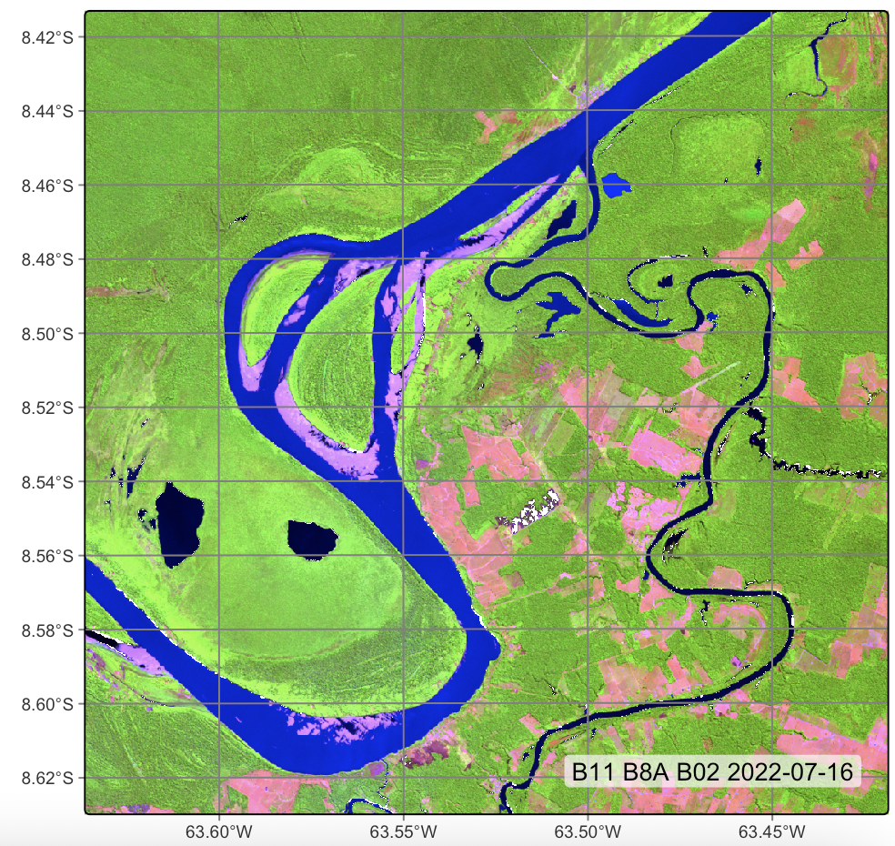
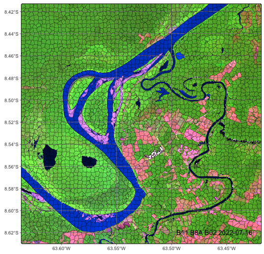
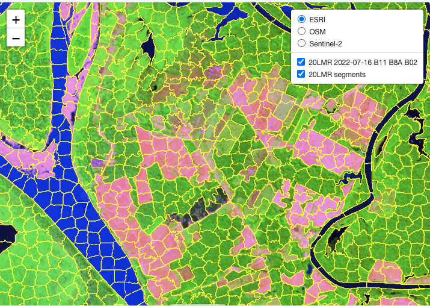
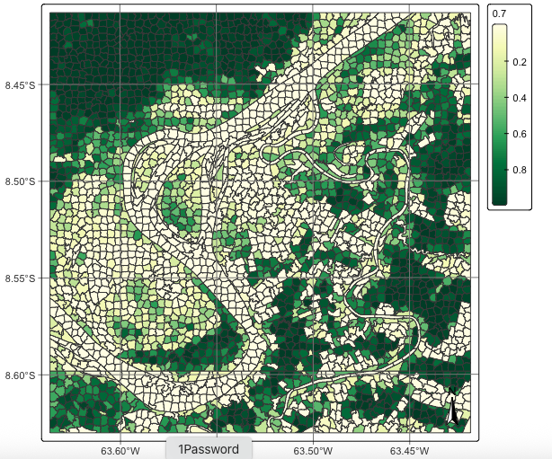
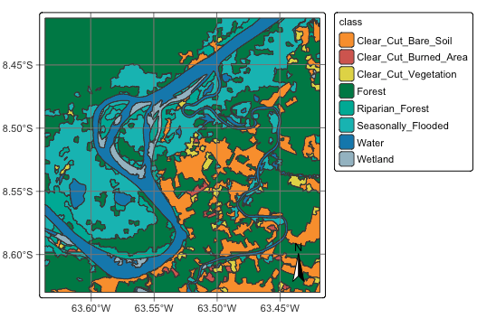

### Configurations to run this chapter{-}

:::{.panel-tabset}
## R
```{r}
#| echo: true
#| eval: true
#| output: false
# load package "tibble"
library(tibble)
# load packages "sits" and "sitsdata"
library(sits)
library(sitsdata)
# set tempdir if it does not exist 
tempdir_r <- "~/sitsbook/tempdir/R/vec_obia"
dir.create(tempdir_r, showWarnings = FALSE)
```
## Python
```{python}
#| echo: true
#| eval: true
#| output: false
# load "pysits" library
from pysits import *
from pathlib import Path
# set tempdir if it does not exist 
tempdir_py = Path.home() / "sitsbook/tempdir/Python/vec_obia"
tempdir_py.mkdir(parents=True, exist_ok=True)
```
:::


<a href="https://www.kaggle.com/code/esensing/object-based-image-time-series-classification" target="_blank"></a>

## Introduction

Object-Based Image Analysis (OBIA) is an approach to remote sensing image analysis that partitions an image into closed segments which are then classified and analyzed. For high-resolution images (1 meter or smaller) the aim of OBIA is to create objects that represent meaningful features in the real world, like buildings, roads, and water bodies. In case of medium resolution images (such as Sentinel-2 or Landsat) the segments represent regions of the image with similar spectral responses which in general do not correspond directly to individual objects in the ground. These groups of pixels are called superpixels. In both situations, the aim of OBIA is to obtain a spatial partition of the image which can then be assigned to a single class. When applicable, OBIA reduces processing time and produces labeled maps with greater spatial consistency.

The general sequence of the processes involved in OBIA in `sits` is:

1.  Segmentation: The first step is to group together pixels that are similar based a distance metric that considers the values of all bands in all time instances as well as their spatial location. We build a multitemporal attribute space where each time/band combination is taken as an independent dimension. Thus, distance metrics for segmentation in a data cube with 10 bands and 24 time steps use a 240-dimension spectral space and a 2-dimensional Euclidean space. This distance includes both a spatial component (how far the pixel is from the center of the superpixel in terms of x and y coordinates) and a spectral component (how different the pixel’s spectral values are from the average values of the superpixel). The spectral distance is calculated using all the temporal instances of the bands. The result is a set of superpixels are clusters of pixels with similar spectral responses that are close together, which correspond to coherent object parts in the image. 

2.  Training set selection: Users should provide a training set, consisting of either labeled points or polygons. We suggest that QGIS is used to label some of the polygons produced by the segmentation algorithm. These labelled polygons can be used to produce a set of consistent labelled points, using `sits_get_data()`. See more at ["Time series from data cubes"](https://e-sensing.github.io/sitsbook/ts_basics.html#time-series-from-data-cubes).

3. Model training: Using the training set produced in the previous step, users produce a classification model using `sits_train()`. See more at [Machine learning for image time series](https://e-sensing.github.io/sitsbook/classification.html).

4. Classification: After the image has been partitioned into distinct objects, the next step is to classify each segment using the model produced in the previous step, the segments produced in the first step and a data cube. A subset of the pixels inside each segment is classified, producing a set of class probabilities. This uses `sits_classify()`, as shown below.

5. Map labelling: Once the set of probabilities have been obtained for selected time series inside a segment, they can be used for labeling. This is done by considering the median value of the probabilities for the time series inside the segment that have been classified. For each class, we take the median of the probability values. Then, median values for the classes are normalised, and the most likely value is assigned as the class for the segment. This step uses `sits_label_classification()`, as shown below.

## Image segmentation in sits

The first step of the OBIA procedure in `sits` is to select a data cube to be segmented and a function that performs the segmentation. For this purpose, `sits` provides a generic `sits_segment()` function, which allows users to select different algorithms. The `sits_segment()` function has the following parameters:

-   `cube`: a regular data cube.
-   `seg_fn`: function to apply the segmentation
-   `roi`: spatial region of interest in the cube
-   `start_date`: starting date for the space-time segmentation
-   `end_date`: final date for the space-time segmentation
-   `memsize`: memory available for processing
-   `multicores`: number of cores available for processing
-   `output_dir`: output directory for the resulting cube
-   `version`: version of the result
-   `progress`: show progress bar?

Currently, there are two segmentation function available: (a) `sits_snic` which implements the Simple non-iterative clustering (SNIC) algorithm; (b) `sits_slic` which implements an extended version of the Simple Linear Iterative Clustering (SLIC). Both are described below. We suggest using `sits_snic` since it is much faster than `sits_slic` and produces good results in general. 

## Simple non-iterative clustering (SNIC)

SNIC (Simple Non-Iterative Clustering) is segmentation algorithm designed to partition an image into compact, uniform regions (superpixels) efficiently [@Achanta2017]. It is an evolution of the SLIC (Simple Linear Iterative Clustering) algorithm, described below. While SLIC relies on an iterative k-means approach (which requires multiple passes over the pixels), SNIC achieves similar or better results in a single pass using a priority queue, making it significantly faster and non-iterative.

SNIC treats image segmentation as a region-growing problem starting from a regular grid of seed points. It uses a priority queue to determine which pixel to process next, ensuring that regions grow in the "cheapest" direction first.

The algorithm can be summarised as follows:

1. Initialization: After choosing the data cube which will be segmented, users define the seed points (centroids) to be used to grow the superpixels. They can also choose their relative placement. The seeds can be placed on a rectangular, diamond or hexagonal grid, or can be placed randomly. A final parameter is the compactness, which defines how regular are the shapes of the resulting superpixels. 

2. Priority Queue: Each pixel is represented in a n-dimensional feature space, defined by its all time instances of the spectral bands and 2-D spatial position ($x, y$). The algorithm then creates a priority queue. Initially, the 4-connected neighbors of each seed are added to the queue. The "priority" (or cost) is the distance from the pixel to the seed's centroid in the n-dimensional space.

3. Region Growing Loop, with the following steps:

(a) SNIC initializes a label map, which will track to which superpixel a pixel belongs, with the corresponding distance map. 

(b) While the priority queue is not empty, the algorithm extracts the pixel with the smallest distance (lowest cost) from the queue. 

(c) If the pixel has already been labeled, it is discarded; otherwise, it is assigned to the superpixel of the seed that generated this queue entry. 

(d) SNIC updates the centroid of that superpixel immediately after adding the new pixel. The new centroid is the average of all pixels currently in that superpixel.

(e) Unlabeled neighbors of the newly added pixel are included to the priority queue. Their cost is calculated based on the current (updated) centroid of the superpixel.

(f) Go to step (b) until the priority queue is empty.


## Simple linear iterative clustering algorithm (SLIC)

The Simple Linear Iterative Clustering (SLIC) algorithm [@Achanta2012] clusters pixels in nearly uniform superpixels. This algorithm has been adapted by Nowosad and Stepinski [@Nowosad2022] to work with multispectral images. SLIC uses spectral similarity and proximity in the image space to segment the image into superpixels. Here's a high-level view of the extended SLIC algorithm:

1.  The algorithm starts by dividing the image into a grid, where each cell of the grid will become a superpixel.

2.  For each cell, the pixel in the center becomes the initial "cluster center" for that superpixel.

3.  For each pixel, the algorithm calculates a distance to each of the nearby cluster centers, using the same distance metric as that of the SNIC algorithm. 

4.  Each pixel is assigned to the closest cluster. After all pixels have been assigned to clusters, the algorithm recalculates the cluster centers by averaging the spatial coordinates and spectral values of all pixels within each cluster.

5.  Steps 3-4 are repeated for a set number of iterations, or until the cluster assignments stop changing.

The outcome of the SLIC algorithm is a set of superpixels which try to capture the to boundaries of objects within the image. 

## Example of SNIC-based segmentation and classification

The SNIC implementation in `sits` 1.5.4 uses the `snic` R package. The parameters for the `sits_snic()` function are:

-   `grid_seeding`: spatial organization of initial grid seeds (one of `rectangular`, `diamond`, `hexagonal`, `random`).
-   `spacing`:	distance (in number of pixels) between initial superpixels' centers.
-   `compactness`: numerical  value between 0 and 1 that controls superpixels' density. Larger values cause clusters to be more compact.
-   `padding`: distance (in pixels) from the image borders within which no seeds are placed.

To show an example of SNIC-based segmentation, we first build a data cube, using images available in the `sitsdata` package.

:::{.panel-tabset}
## R
```{r}
#| eval: false
# directory where files are located
data_dir <- system.file("extdata/Rondonia-20LMR", package = "sitsdata")

# builds a cube based on existing files
cube_20LMR <- sits_cube(
    source = "AWS",
    collection = "SENTINEL-2-L2A",
    data_dir = data_dir,
    bands = c("B02", "B8A", "B11")
)

# Plot
plot(
    cube_20LMR, 
    red = "B11",
    green = "B8A", 
    blue = "B02", 
    date = "2022-07-16"
)
```
## Python
```{python}
#| eval: false
# directory where files are located
data_dir = r_package_dir("extdata/Rondonia-20LMR", package = "sitsdata")

# Builds a cube based on existing files
cube_20LMR = sits_cube(
    source = "AWS",
    collection = "SENTINEL-2-L2A",
    data_dir = data_dir,
    bands = ("B02", "B8A", "B11")
)

# Plot
plot(
    cube_20LMR, 
    red = "B11",
    green = "B8A", 
    blue = "B02", 
    date = "2022-07-16"
)
```
:::

```{r}
#| label: fig-vec-obia-rgb
#| echo: false
#| out.width: "70%"
#| fig.align: "center"
#| fig.cap: | 
#|   RGB composite image for part of tile 20LMR in Rondonia, Brasil.
 
```

The following example produces a segmented image. For the SNIC algorithm, we take the initial separation between cluster centres (`step`) to be 20 pixels, the `compactness` to be 0.5, and the minimum distance between the cluster center and the image borders (`padding`) to be 10 pixels.

:::{.panel-tabset}
## R
```{r}
#| eval: false
# segment a cube using SLIC
# Files are available in a local directory 
segments_20LMR <- sits_segment(
    cube = cube_20LMR,
    output_dir = tempdir_r,
    seg_fn = sits_snic(
        grid_seeding = "rectangular",
        spacing = 20,
        compactness = 0.5,
        padding = 10
    )
)

# Plot segments
plot(segments_20LMR, red = "B11", green = "B8A", blue = "B02", 
          date = "2022-07-16")
```
## Python
```{python}
#| eval: false
# segment a cube using SLIC
# Files are available in a local directory 
segments_20LMR = sits_segment(
    cube = cube_20LMR,
    output_dir = tempdir_py,
    seg_fn = sits_snic(
        grid_seeding = "rectangular",
        spacing = 20,
        compactness = 0.5
    )
)

# Plot segments
plot(segments_20LMR, red = "B11", green = "B8A", blue = "B02", 
          date = "2022-07-16")
```

:::

```{r}
#| label: fig-vec-obia-segments
#| echo: false
#| out.width: "75%"
#| fig.align: "center"
#| fig.cap: "Image with segments for part of tile 20LMR in Rondonia, Brasil."
 
```


It is useful to visualize the segments in a leaflet together with the RGB image using `sits_view()`.

:::{.panel-tabset}
## R
```{r}
#| eval: false
sits_view(cube_20LMR, red = "B11", green = "B8A", blue = "B02", 
          dates = "2022-07-16")
sits_view(segments_20LMR, add = TRUE)
```
## Python
```{python}
#| eval: false
sits_view(cube_20LMR, red = "B11", green = "B8A", blue = "B02", 
          dates = "2022-07-16")
sits_view(segments_20LMR, add = TRUE)
```
:::

```{r}
#| label: fig-obia-view
#| echo: false
#| out.width: "75%"
#| fig.align: "center"
#| fig.cap: "Detail of segmentation of image in Amazonia"

```

After obtaining the segments, the next step is to classify them. This is done by first training a classification model. This case study uses the training dataset `samples_deforestation_rondonia`, available in package `sitsdata`. This dataset consists of 6007 samples collected from Sentinel-2 images covering the state of Rondonia. There are nine classes: `Clear_Cut_Bare_Soil`, `Clear_Cut_Burned_Area`, `Mountainside_Forest`, `Forest`, `Riparian_Forest`, `Clear_Cut_Vegetation`, `Water`, `Wetland`, and `Seasonally_Flooded`. Each time series contains values from Sentinel-2/2A bands B02, B03, B04, B05, B06, B07, B8A, B08, B11 and B12, from 2022-01-05 to 2022-12-23 in 16-day intervals. The samples are intended to detect deforestation events and have used in earlier examples of the book. For the training, we select the same bands as those of the data cube.

:::{.panel-tabset}
## R
```{r} 
#| eval: false
# Select bands
samples_deforestation <- sits_select(samples_deforestation_rondonia,
                                     bands = c("B02", "B8A", "B11"))

# Train TempCNN
tcnn_model <- sits_train(samples_deforestation, sits_tempcnn())
```
## Python
```{python} 
#| eval: false
# Load data
samples_deforestation_rondonia = load_samples(
    name = "samples_deforestation_rondonia",
    package = "sitsdata"
)

# Select bands
samples_deforestation = sits_select(samples_deforestation_rondonia,
                                     bands = ("B02", "B8A", "B11"))

# Train TempCNN
tcnn_model = sits_train(samples_deforestation, sits_tempcnn())
```
:::

```{r} 
#| echo: false
#| eval: false
tcnn_model <- readRDS("./etc/tcnn_model_obia.rds")
```

```{python} 
#| echo: false
#| eval: false
tcnn_model = read_rds("./etc/tcnn_model_obia.rds")
```

The segment classification procedure applies the model to a number of user-defined samples inside each segment. Each of these samples is then assigned a set of probability values, one for each class. We then obtain the median value of the probabilities for each class and normalize them. The output of the procedure is a vector data cube containing a set of classified segments. The most relevsnt parameters for the `sits_classify()` function are:

- `data`: vector cube being classified
- `ml_model`: machine learning model 
- `output_dir`: directory where results are stored
- `n_sam_pol`: number of samples to choose for each polygon
- `memsize`: memory available for classification in GB.
- `multicores`: number of cores to be used for classification
- `gpu_memory`: GPU memory available (if there is a GPU)	
- `version`: version name (to control for multiple versions)

:::{.panel-tabset}
## R
```{r}
#| eval: false
segments_20LMR_probs <- sits_classify(
    data = segments_20LMR,
    ml_model = tcnn_model,
    output_dir = tempdir_r,
    n_sam_pol = 10,
    gpu_memory = 8,
    memsize = 24,
    multicores = 1,
    version = "tcnn"
)
```
## Python
```{python}
#| eval: false
segments_20LMR_probs = sits_classify(
    data = segments_20LMR,
    ml_model = tcnn_model,
    output_dir = tempdir_py,
    n_sam_pol = 10,
    gpu_memory = 2,
    memsize = 24,
    multicores = 1,
    version = "tcnn"
)
```
:::

After computing the probabilities for the segments, we can visualize them.

:::{.panel-tabset}
## R
```{r}
#| eval: false
plot(segments_20LMR_probs, labels = "Forest")
```
## Python
```{python}
#| eval: false
plot(segments_20LMR_probs, labels = "Forest")
```
:::

```{r}
#| label: fig-vec-obia-probs-forest.png
#| echo: false
#| out.width: "75%"
#| fig.align: "center"
#| fig.cap: "Probability maps for the Forest class inside segments."
 
```

Finally, we can compute the most likely class for each of the segments.

:::{.panel-tabset}
## R
```{r}
#| eval: false
segments_20LMR_class <- sits_label_classification(
    segments_20LMR_probs,
    output_dir = tempdir_r,
    memsize = 24,
    multicores = 6,
    version = "tcnn"
)
```
## Python
```{python}
#| eval: false
segments_20LMR_class = sits_label_classification(
    segments_20LMR_probs,
    output_dir = tempdir_py,
    memsize = 24,
    multicores = 6,
    version = "tcnn"
)
```
:::

To view the classified segments together with the original image, use `plot()` or `sits_view()`, as in the following example.

:::{.panel-tabset}
## R
```{r}
#| eval: false
# plot the classified segments
plot(segments_20LMR_class)
```
## Python
```{python}
#| eval: false
# plot the classified segments
plot(segments_20LMR_class)
```
:::

```{r}
#| label: fig-vec-obia-class
#| echo: false
#| out.width: "95%"
#| fig.cap: |
#|   Plot of OBIA classified image.
#| fig.align: "center"

```

## Summary

OBIA analysis applied to image time series is a worthy and efficient technique for land classification, combining the desirable sharp object boundary properties required by land use and cover maps with the analytical power of image time series. 

## References{-}
